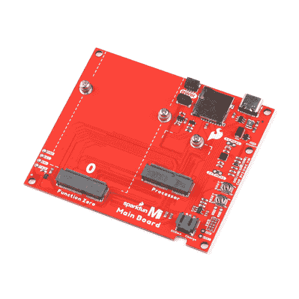
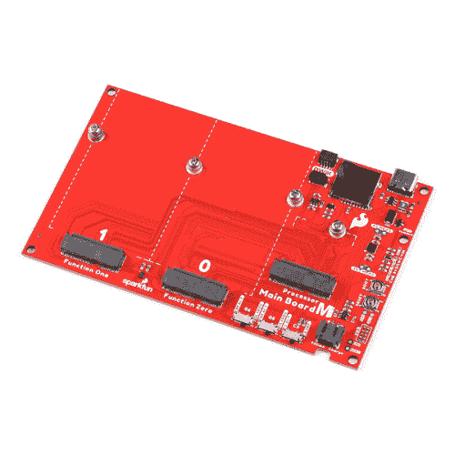

# MicroMod 主板连接指南 V2

> 原文：<https://learn.sparkfun.com/tutorials/micromod-main-board-hookup-guide-v2>

## 介绍

**Note:** This tutorial is for the MicroMod Main Board - Single V2.1 and Double V2.2\. For users with the older versions of the Main Boards, make sure to check out the [older tutorial](https://learn.sparkfun.com/tutorials/micromod-main-board-hookup-guide).

MicroMod 主板- [单](https://www.sparkfun.com/products/20748)和[双](https://www.sparkfun.com/products/20595)是专门的载板，允许您将处理器板与功能板连接。模块化系统允许您在功能板的帮助下向处理器板添加附加功能。

 

将**添加到您的[购物车](https://www.sparkfun.com/cart)中！**

### [SparkFun 微电机主板-单个](https://www.sparkfun.com/products/20748)

[In stock](https://learn.sparkfun.com/static/bubbles/ "in stock") DEV-20748

MicroMod 主板是一个专门的载板，允许您将一个 MicroMod 处理器板与一个单…

$15.95[Favorited Favorite](# "Add to favorites") 1[Wish List](# "Add to wish list")**** 

将**添加到您的[购物车](https://www.sparkfun.com/cart)中！**

### [SparkFun MicroMod 主板-双](https://www.sparkfun.com/products/20595)

[In stock](https://learn.sparkfun.com/static/bubbles/ "in stock") DEV-20595

MicroMod 主板是一种专用载板，允许您将 MicroMod 处理器板与多达两个…

$19.95[Favorited Favorite](# "Add to favorites") 2[Wish List](# "Add to wish list")**** ****### 所需材料

要完成本教程，您至少需要以下材料。你可能不需要所有的东西，这取决于你拥有什么。将它添加到您的购物车，通读指南，并根据需要调整购物车。****