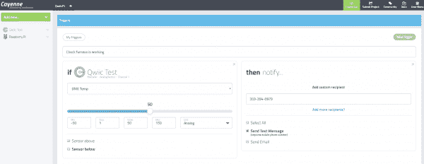

# 覆盆子酱 V2 连接指南的 Qwiic 套件

> 原文：<https://learn.sparkfun.com/tutorials/qwiic-kit-for-raspberry-pi-v2-hookup-guide>

## 介绍

**Note:** This tutorial is for the Qwiic Starter Kit for Rasberry Pi V2\. For users with the Qwiic Starter Kit for Raspberry Pi V1, make sure to check out the [older tutorial](https://learn.sparkfun.com/tutorials/qwiic-kit-for-raspberry-pi-hookup-guide).

欢迎使用树莓派 V2 连接指南的 [Qwiic 套件。在这里，我们将从一些围绕 I ² C 和 Python 在你的 Raspberry Pi 上的基础知识开始。别担心，在我们的 Qwiic 工具包中，我们已经用为主板编写的 Python 库完成了大部分工作。无论您只是想获得数据并将其显示在您的 Pi 上、显示在我们的有机发光二极管屏幕上，还是发布到互联网上，该工具包都应该可以帮助您开始。](https://www.sparkfun.com/products/21285)

[](https://www.sparkfun.com/products/21285) 

将**添加到您的[购物车](https://www.sparkfun.com/cart)中！**

 **### [树莓派的 SparkFun Qwiic 入门套件](https://www.sparkfun.com/products/21285)

[24 available](https://learn.sparkfun.com/static/bubbles/ "24 available") KIT-21285

用于 Raspberry Pi 的 SparkFun Qwiic 套件包括一个带接头的屏蔽、三个支持 Qwiic 的分线板和四根电缆…

$59.95[Favorited Favorite](# "Add to favorites") 1[Wish List](# "Add to wish list")** **### 所需材料

为了跟随这个教程，你还需要愿望列表中列出的一些硬件。你可能不需要所有的东西，这取决于你拥有什么。将它添加到您的购物车，通读指南，并根据需要调整购物车。

## Qwiic 连接系统

SparkFun 的 [Qwiic 连接系统](https://www.sparkfun.com/qwiic)是一种将 I ² C 设备连接到您的微控制器的快速简单的方法。因为我们的 Qwiic 板使用 4 针 JSH-SH 连接器，您不需要焊接。你只需要一根电缆来连接你的模块。连接器是极化的，这意味着你不能插错。此外，您可以将所有主板菊花链在一起。

| [](https://www.sparkfun.com/qwiic) |
| *[Qwiic 连接系统](https://www.sparkfun.com/qwiic)* |

I ² C 是一个已经存在了一段时间的协议，它有几个优点，例如每个设备都在同一条总线上，但每个设备都有一个唯一的地址。消息与地址来回发送，只有具有正确地址的设备才能监听消息。这就是为什么我们能够菊花链我们的传感器。目前，我们发现大量的传感器通过 I ² C 通信，但是那些不通信的呢？嗯，我们的一些 Qwiic 板使用其他类型的传感器，并有一个小的微控制器，它读取数据，然后通过 I ² C 输出，所以换句话说，你可以在 I ² C 上做任何你想做的事情。需要注意的一点是，总线上的每个项目都必须有自己的地址。有些传感器会有跳线垫，让你改变地址(如果是这种情况，你通常有 2 或 4 个选项)，但不是所有的。这可能会使一个链中有很多传感器变得困难，除非你有一个专用的 [I ² C mux](https://www.sparkfun.com/products/14685) 。

[https://www.youtube.com/embed/x0RDEHqFIF8/?autohide=1&border=0&wmode=opaque&enablejsapi=1](https://www.youtube.com/embed/x0RDEHqFIF8/?autohide=1&border=0&wmode=opaque&enablejsapi=1)


### 无焊接

Qwiic 电缆(4 针 JST)可以轻松地从开发板插入传感器、屏蔽、附件板等，使设置新原型的工作变得容易。


### 极化连接器

没有必要担心意外交换试验板上的 SDA 和 SCL 线。Qwiic 连接器是极化的，所以你知道你每次都可以正确接线，从一开始就是正确的。


### 可菊花链连接

是时候利用 I ² C 总线的力量了！大多数 Qwiic 板上有两个或更多的连接器，允许连接多个设备。

Qwiic Connect 系统旨在让您的项目顺利进行。如果你的 I ² C 传感器上没有 Qwiic 连接器，检查一下我们的 [Qwiic 适配器](https://www.sparkfun.com/products/14495)。您可能需要编写自己的 Python 库，但至少我们为您简化了连接。

## 硬件概述

**[Revision Changes:](https://learn.sparkfun.com/tutorials/qwiic-kit-for-raspberry-pi-v2-hookup-guide#revision)** With the revision from the initial release of the the SparkFun Qwiic Starter Kit for Raspberry Pi, we have swapped out an individual board inside the kit, listed below. At the time of writing we used the Qwiic pHAT v1.0\. The Qwiic pHAT v2.0 is functionally the same with additional features. Unfortunately, the CCS811 is EOL so the Environmental Combo Breakout CCS811/BME280 was removed from V2\. Thus, a similar sensor (SGP40) was added. Since the BME280 is also broken out on the Atmospheric Sensor Breakout, it was also included in the kit.

| 适用于 SKU 树莓 Pi 套件的 Qwiic 套件 | 修订历史 |
| 套件-21285 | -增加空气质量传感器 SGP40 (Qwiic)。
-添加环境传感器分接头- BME280 (Qwiic)
-添加额外的 Qwiic 电缆
-移除环境组合分接头(CCS811/BME280)。
-套件版本号升级至 V2。 |
| [套件-16841](https://www.sparkfun.com/products/16841) | -切换到 Qwiic pHAT v2.0 |
| [套件-15367](https://www.sparkfun.com/products/15367) | Qwiic pHAT 的初始版本 |

Please refer to the following pictures if you are unsure.

| [](https://cdn.sparkfun.com/assets/learn_tutorials/2/7/6/2/21285-_KIT_SparkFun_Qwiic_Starter_Kit-_01.jpg) | [](https://cdn.sparkfun.com/assets/learn_tutorials/2/7/6/2/16841-SparkFun_Qwiic_Starter_Kit_for_Raspberry_Pi-02.jpg"") | [](https://cdn.sparkfun.com/assets/learn_tutorials/2/7/6/2/15367-SparkFun_Qwiic_Kit_for_Raspberry_Pi-01.jpg) |
| 套件-21285 | *套件-16841* | *套件-15367* |

我们为该套件使用的硬件(除了 Pi)是 [Qwiic pHAT V2.0](https://www.sparkfun.com/products/15945) ，它为您的 Raspberry Pi 提供 Qwiic 连接器。这使您能够轻松地连接各种支持 Qwiic 的设备，如[接近传感器分接头- VCNL4040](https://www.sparkfun.com/products/15177) 、[大气传感器分接头- BME280](https://www.sparkfun.com/products/15440) 、[空气质量传感器- SGP40](https://www.sparkfun.com/products/18345) 和 [Qwiic 微型有机发光二极管分接头](https://www.sparkfun.com/products/14532)。

| [](https://cdn.sparkfun.com/assets/learn_tutorials/2/7/6/2/15177-SparkFun_Proximity_Sensor_Breakout_-_20cm__VCNL4040__Qwiic_-02.jpg) | [](https://cdn.sparkfun.com/assets/learn_tutorials/2/7/6/2/15440-SparkFun_Atmospheric_Sensor_Breakout_-_BME280__Qwiic_-01a.jpg) | [](https://cdn.sparkfun.com/assets/learn_tutorials/2/7/6/2/18345-SparkFun_Air_Quality_Sensor_Breakout_-_SGP40__Qwiic_-02.jpg) | [](https://cdn.sparkfun.com/assets/learn_tutorials/2/7/6/2/14532-SparkFun_Micro_OLED_Breakout__Qwiic_-02.jpg) |
| *接近和光传感器
(VCNL4040)* | *温度、湿度和气压传感器
(BME280)* | *空气质量传感器
(SGP40)* | *微 OLED 显示屏* |

## 硬件连接

让我们从连接 pHAT 开始。pHAT 应该像大多数 Pi 帽子一样适合 Raspberry Pi，但它也应该适合兼容的主板，如 [Nvidia Jetson Nano](https://www.sparkfun.com/products/15297) 、 [Google Coral board](https://www.sparkfun.com/products/15318) 以及其他使用标准 2x20 GPIO 接口的主板。它甚至可以在 Raspberry Pi Zero W 上工作。只需排列标题并将 pHAT 连接到您的 Raspberry Pi。如果您对 Qwiic pHAT 有更多问题，请查看[连接指南](https://learn.sparkfun.com/tutorials/qwiic-phat-for-raspberry-pi-hookup-guide)了解更多信息。

[](https://cdn.sparkfun.com/assets/learn_tutorials/2/7/6/2/Attaching_Qwiic-Enabled_Board_Raspberry_Pi_pHAT.jpg)

接下来，我们将连接我们的电路板。我们为您提供了不同长度的线缆供您选择，让您随心所欲地配置您的主板。所以继续把你所有的板用菊花链连接在一起(虽然你只需要 1 个 Qwiic 连接器在 pHAT 上，但是你可以用任意多的连接器)。只要它们都有通向 Pi 的路径，它们的连接顺序(或者使用电路板上的哪个连接器)并不重要。请记住，这些电缆是极化的，应该只朝一个方向走(不要强迫它朝错误的方向走)。您的设置应该类似于下图，支持 Qwiic 的设备以菊花链形式连接并堆叠在树莓 Pi 上。当然，你也可以将每块板连接到每一个 Qwiic 连接器上。

[](https://cdn.sparkfun.com/assets/learn_tutorials/2/7/6/2/Qwiic_Starter_Kit_V2_pHAT_Micro_OLED_Proximity_VCNL4040_Atmospheric_Humidity_Temperature_Pressure_BME280_Air_Quality__SGP40.jpg)

准备就绪后，连接电源和任何外围设备(即 HDMI 显示器、键盘、鼠标等)。)到树莓派。

**Note:** Make sure to watch where you place the Atmospheric Sensor - BME280\. The sensor readings can be affected by the heat from the Raspberry Pi and can skew the ambient temperature sensor readings. If you are looking to measure the ambient temperature of the room, make sure to add some space between the Raspberry Pi and BME280.

## 配置您的 Pi

我们假设你已经有了一个 Raspbian 运行的 Raspberry Pi。我们还假设它连接到互联网。如果没有，请查看我们的初学者工具包和设置树莓 Pi 的教程。

[](https://learn.sparkfun.com/tutorials/raspberry-pi-4-kit-hookup-guide) [### Raspberry Pi 4 套件连接指南

#### 2020 年 3 月 14 日](https://learn.sparkfun.com/tutorials/raspberry-pi-4-kit-hookup-guide) Guide for hooking up your Raspberry Pi 4 Model B basic, desktop, or hardware starter kit together.[Favorited Favorite](# "Add to favorites") 2

请确保更新图像，以便我们有最新的发行版。在[命令行](https://learn.sparkfun.com/tutorials/terminal-basics/command-line-windows-mac-linux)中分别输入以下命令来更新您的图像。

```
language:bash
sudo apt-get update
sudo apt-get dist-upgrade 
```

**Note:** sudo stands for "Super User Do", it is a way to give you superuser powers from the command line. Be careful whenever using `sudo`.

### 用户配置设置

一旦你设置好了，我强烈建议你更改密码。在这一点上，我们将处理物联网，不希望令人讨厌的字符使用默认登录潜入您的系统:(**用户名** : pi，**密码** : raspberry)。

raspi-config 工具是一种快速更改密码以及设置网络、语言、键盘等的方法。使用[命令行](https://learn.sparkfun.com/tutorials/terminal-basics/command-line-windows-mac-linux)键入以下命令，然后浏览菜单更新您的信息。

```
language:bash
sudo raspi-config 
```

您将需要使用工具启用 [I ² C](https://learn.sparkfun.com/tutorials/raspberry-pi-spi-and-i2c-tutorial/all#i2c-on-pi) 引脚来读取 I ² C 总线上的传感器。

[](https://cdn.sparkfun.com/assets/learn_tutorials/4/4/9/i2c-menu2.png)*Raspi-config for I²C***Note:** The previous Qwiic Kit for Raspberry Pi included the CCS811 which required you to use [I²C clock stretching](https://learn.sparkfun.com/tutorials/qwiic-kit-for-raspberry-pi-hookup-guide#i2c-clockstretch).**Note:** Here are some more resources on setting up a Raspberry Pi including how to connect to the Pi through a serial connection as well as VNC into the Pi remotely. This can be handy if you want to update things in the future without having to lug out an extra monitor, keyboard, and mouse.

[](https://learn.sparkfun.com/tutorials/sd-cards-and-writing-images) [### SD 卡和书写图像](https://learn.sparkfun.com/tutorials/sd-cards-and-writing-images) How to upload images to an SD card for Raspberry Pi, PCDuino, or your favorite SBC.[Favorited Favorite](# "Add to favorites") 19[](https://learn.sparkfun.com/tutorials/getting-started-with-the-raspberry-pi-zero-wireless) [### Raspberry Pi Zero Wireless 入门](https://learn.sparkfun.com/tutorials/getting-started-with-the-raspberry-pi-zero-wireless) Learn how to setup, configure and use the smallest Raspberry Pi yet, the Raspberry Pi Zero - Wireless.[Favorited Favorite](# "Add to favorites") 17[](https://learn.sparkfun.com/tutorials/headless-raspberry-pi-setup) [### 无头 Raspberry Pi 设置](https://learn.sparkfun.com/tutorials/headless-raspberry-pi-setup) Configure a Raspberry Pi without a keyboard, mouse, or monitor.[Favorited Favorite](# "Add to favorites") 16[](https://learn.sparkfun.com/tutorials/how-to-use-remote-desktop-on-the-raspberry-pi-with-vnc) [### 如何用 VNC 在树莓 Pi 上使用远程桌面](https://learn.sparkfun.com/tutorials/how-to-use-remote-desktop-on-the-raspberry-pi-with-vnc) Use RealVNC to connect to your Raspberry Pi to control the graphical desktop remotely across the network.[Favorited Favorite](# "Add to favorites") 8

## 计算机编程语言

**Notice:** This tutorial was written with Raspbian version "June 2019", Python version 3.7.3, and pip 19.1.1 for Python v3.7\. Other versions may affect how some of the steps in this guide are performed.

Python 是一门很棒的语言，我们实际上有一个关于在 Raspberry Pi 上开始 Python 编程的很棒的教程,它涵盖了从选择编辑器和运行代码到语法和错误消息的所有内容。如果你打算写你自己的代码，我强烈推荐你阅读它。如果您只是计划运行示例代码并做一些更改，我们将在这里介绍一些基本的东西。

[](https://learn.sparkfun.com/tutorials/python-programming-tutorial-getting-started-with-the-raspberry-pi) [### Python 编程教程:Raspberry Pi 入门

#### 2018 年 6 月 27 日](https://learn.sparkfun.com/tutorials/python-programming-tutorial-getting-started-with-the-raspberry-pi) This guide will show you how to write programs on your Raspberry Pi using Python to control hardware.[Favorited Favorite](# "Add to favorites") 27

### 刻痕

在许多编程语言中，我们缩进内容以使内容更容易阅读。在 Python 中，这些缩进是代码的一部分。不用在你的循环或`if()`语句上加括号，你只需[用前导空格缩进整个块](https://learn.sparkfun.com/tutorials/python-programming-tutorial-getting-started-with-the-raspberry-pi/programming-in-python#indent)。换句话说，你必须确保你的缩进是正确的。我也建议不要使用键盘上的`TAB`按钮来缩进，因为不同的程序会有不同的读取方式(通常是不正确的)。

### 评论

另一件要记住的事情是注释。在 Python 中，符号“`#`”用于表示该行是注释。不像其他语言，T2 没有官方的多行注释。所以当你写大的注释时，你必须习惯于在每一行输入`#`。

### Python 版本和安装 PIP

常用的 Python 版本有 2 个[。即使在 Python 3 问世之后，许多人仍然继续使用 2.7 很多年。部分原因是 Python 3 改进了一些东西，并在这个过程中使它不向后兼容。对于我们的例子，我们将使用 Python 3.7(代码将不能在 2.7 上运行)。要查看您的 Pi 使用的 Python 版本，请打开一个](https://wiki.python.org/moin/Python2orPython3)[命令行](https://learn.sparkfun.com/tutorials/terminal-basics/command-line-windows-mac-linux)并逐个键入以下命令进行检查。

```
language:bash
python --version
python -m pip --version 
```

如果你没有使用 Python 3，那么我们需要打开 ***。bashrc** 文件并添加一个别名。

首先，您需要通过运行以下命令来更新 python 安装包，以便为 Python 3 安装 pip。执行以下命令。

```
language:bash
sudo apt-get install python3-pip 
```

键入以下命令打开文件。

```
language:bash
nano ~/.bashrc 
```

然后在末尾添加以下几行。每当你想运行`python`来寻找位于`/usr/bin/python3`的文件时，这将告诉计算机。

```
language:bash
alias python='/usr/bin/python3'
alias pip=pip3 
```

[](https://cdn.sparkfun.com/assets/learn_tutorials/7/9/8/screen_01.png)

要退出 nano，请键入`CTRL` + `X`，然后在询问您是否要保存时点击`Y`，然后点击`ENTER`。您现在可以重新启动或者键入以下命令来强制 Pi 运行 ***/。bashrc** 文件又来了。

```
language:bash
source ~/.bashrc 
```

调整后，键入以下命令以确保 pip 是最新的。

```
language:bash
python -m pip install --upgrade pip 
```

## Python 库

我们还需要安装 Qwiic Python 库。这将自动下载一个包含所有 **Qwiic_Py** 文件和依赖关系的文件夹到你的 Raspberry Pi。运行以下命令[自动安装](https://github.com/sparkfun/qwiic_py#installation)qw IIC 传感器和微型有机发光二极管的模块。为了确保安装到 Python 3 的正确路径，请确保使用了`pip3`。

```
language:bash
sudo pip3 install sparkfun_qwiic 
```

**Tip:** If you need to uninstall the library and start from scratch, simply use the `uninstall` with the command. This is also for users that have the libraries installed and what to "upgrade" to the latest versions.

```
sudo pip3 uninstall sparkfun_qwiic
```

## 设置 MQTT 和 Cayenne

MQTT 是一种非常适合物联网设备的消息协议。设备可以发布主题和/或订阅主题以接收信息。Alex 写了一个关于 MQTT 的教程，如果你不熟悉 MQTT，这是一个很好的读物。此外，我们的设置将充当 MQTT 客户端，并将信息发布到名为 Cayenne 的在线服务。

[](https://learn.sparkfun.com/tutorials/introduction-to-mqtt) [### MQTT 简介

#### 2018 年 11 月 7 日](https://learn.sparkfun.com/tutorials/introduction-to-mqtt) An introduction to MQTT, one of the main communication protocols used with the Internet of Things (IoT).[Favorited Favorite](# "Add to favorites") 26

### 红辣椒粉

什么是卡宴？ [Cayenne](https://developers.mydevices.com/cayenne/features/) 是来自 [myDevices](https://mydevices.com/) 的一款产品，它不仅可以在仪表盘上显示数据，还可以设置触发器、监控设备、控制设备等。你可以从他们的网站(或应用程序)远程查看你家的温度，但你也可以告诉它在温度低于 40 度时给你发短信，这样你就可以找出你的炉子不工作的原因。但是不要担心，本教程中的练习都不需要你给我的设备任何钱(甚至是信用卡)。

| [](https://developers.mydevices.com/cayenne/features/) | [](https://mydevices.com/) |
| *Cayenne 和 myDevices 徽标由 myDevices 提供* |

如果你还没有，首先要做的是记账。使用 Raspberry Pi 的互联网浏览器点击下面的链接，前往 Cayenne 进行注册。如果您有帐户，请确保在中登录[。](https://accounts.mydevices.com/auth/realms/cayenne/protocol/openid-connect/auth?response_type=code&scope=email+profile&client_id=cayenne-web-app&state=JEDXXhKNBC84BFaPGkye8xacaefPvbwT99sCMLVP&redirect_uri=https%3A%2F%2Fcayenne.mydevices.com%2Fauth%2Fcallback)

[Log In with Cayenne](https://accounts.mydevices.com/auth/realms/cayenne/protocol/openid-connect/auth?response_type=code&scope=email+profile&client_id=cayenne-web-app&state=JEDXXhKNBC84BFaPGkye8xacaefPvbwT99sCMLVP&redirect_uri=https%3A%2F%2Fcayenne.mydevices.com%2Fauth%2Fcallback)

一旦你有一个帐户，我们将开始设置树莓派。这是一个很好的介绍，为您提供了一些关于您的 Pi (RAM 使用、温度、网络速度)的信息。它还允许你远程重置或关闭你的 Pi，切换 I/O 引脚，甚至给你你的 Pi 的 IP 地址。这是 Cayenne 的一个优点，它不会根据 IP 地址或网络来定义设备。你提供一个小脚本，你的 Pi 基本上告诉 Cayenne 它在哪里。如果您断电、重置设备等，这很有帮助。，并且需要知道 IP 地址才能远程重新登录。

### 在 Cayenne 中添加设备

你会看到一些设备。选择树莓派。

[](https://cdn.sparkfun.com/assets/learn_tutorials/9/0/7/Qwiic_Pi_Cayenne.jpg)

在继续下一步之前，你会看到树莓派的图片提示。点击**下一个**按钮。

[](https://cdn.sparkfun.com/assets/learn_tutorials/9/0/7/Set_Up_Your_Pi_Cayenne.jpg)

你会有几个选择。我们将遵循选项 2。遵循提供的说明(Cayenne 在设置您的树莓 Pi 时有非常好的[说明)。](https://www.youtube.com/watch?time_continue=84&v=Qx0IHv-UR-0)

[](https://cdn.sparkfun.com/assets/learn_tutorials/9/0/7/Terminal_SSH_Option_2_Cayenne.jpg)

此时，您应该拥有一个有效的 Cayenne 帐户。键入(或用鼠标右键复制粘贴)第一个命令，并点击`ENTER`按钮。该命令将开始执行。完成后，键入(或复制粘贴)第二个命令，并点击`ENTER`按钮。该过程可能需要几分钟。当命令执行完毕，你的 Raspberry Pi 会自动重启。

重新启动后，重新打开浏览器，返回 Cayenne。接下来，返回添加新设备或小部件。这次您将选择蓝色的“**自带物品**按钮。

[](https://cdn.sparkfun.com/assets/learn_tutorials/9/0/7/NewDevice-Bring-Your-Own-Thing-Cayenne.png)

这将为您提供您的 MQTT 用户名、密码和客户机 ID，以及我们项目的服务器信息。我们稍后将使用这些信息。您可能希望在 Pi 上这样做，这样可以更容易地将这些值复制并粘贴到代码中。

## 示例代码

我们编写了一些示例代码来读取传感器数据，并向微型有机发光二极管显示一些传感器值。在您的终端窗口中，键入以下内容从 [GitHub 库](https://github.com/sparkfun/Qwiic-Kit-for-Pi)下载演示代码。

```
language:bash
git clone https://github.com/sparkfun/Qwiic-Kit-for-Pi.git 
```

然后通过在命令行中键入以下命令导航到文件夹。

```
language:bash
cd Qwiic-Kit-for-Pi/v2 
```

[](https://cdn.sparkfun.com/assets/learn_tutorials/2/7/6/2/Qwiic-Kit-Pi-Python-Demo-Command-Line-Path.png)

您还可以导航到文件夹**/home/Pi/qw IIC-Kit-for-Pi/v2**，在您喜欢的 Python 编辑器中打开这个示例。在这种情况下，我们使用 Thonny 编辑器打开代码。

[](https://cdn.sparkfun.com/assets/learn_tutorials/2/7/6/2/Raspberry_Pi_Qwiic_Starter_Kit_Python_Thonny_Cayenne.png)

我们建议在运行演示之前，在 Python 编辑器中打开示例代码。

## 读取传感器数据

现在我们已经把所有的东西都连接好，准备好了，我们可以设置传感器并开始读取数据了。首先，代码需要运行条件语句，给传感器值一些时间从环境中采样。在代码的顶部，我们设置了一个标志(即`initialize`)和计数器(即`n`)来跟踪我们是否刚刚启动了 Python 脚本。在`for`循环下的主代码中，我们将在某段时间内读取一些数据。一旦我们获取了一些值，我们将更新标志，这样我们就可以通过 for 循环获取一次读数。变量`u`用作一个计数器，用于在代码中记录一段时间后 Cayenne 的数据。

```
language:python
#These values are used to give BME280 and SGP40 some time to take samples and log data to Cayenne
initialize=True
n=2
u=0
.
.
.

        if initialize==True:
            print ("Initializing: BME280 and SGP40 are taking samples before printing and publishing data!")
            print (" ")

        else:
            #print ("Finished initializing")
            n=1 #set n back to 1 to read sensor data once in loop

        for n in range (0,n):
            #print ("n = ", n) #used for debugging for loop
            .
            .
            .

            #Give some time for the BME280 and SGP40 to initialize when starting up
            if initialize==True:
                time.sleep(10)
                initialize=False 
```

### 读取传感器值

Python 不需要你初始化和输入你的变量，我们只需要继续使用它们。我们在下面的`for`循环中突出显示了主代码中的大多数用户函数以及一些配置函数。

```
language:python
            #Proximity Sensor variables - these are the available read functions
            proximity = prox.get_proximity()
            ambient = prox.get_ambient()
            white = prox.get_white()
            close = prox.is_close()
            .
            .
            .

            #BME280 sensor variables
            pressure = bme.get_reference_pressure() #in Pa
            altitudef = bme.get_altitude_meters()
            humidity = bme.read_humidity()
            tempf = bme.get_temperature_fahrenheit()
            .
            .
            .

            #SGP40 sensor variable
            voc_index = my_sgp40.get_VOC_index()
            .
            .
            . 
```

现在我们已经阅读了所有的数据，让我们来看看我们想用这些数据做什么。我们不同的输出将根据应用程序显示不同的变量集。使用“`#`”随意注释掉代码中没有使用的变量，或者选择显示不同的变量。实际代码中列出了很多您可能不需要的变量和函数。

## 向您的 Pi 显示数据

一旦我们读取了来自 3 个传感器的数据，就应该在 Pi 控制台的有机发光二极管屏幕上显示这些信息，并将信息发送给 Cayenne 进行显示。

让我们更深入地研究一下代码。本节讲述如何将串行数据发送到您的 Raspberry Pi 终端窗口。输出可以通过 Python 编辑器的控制台显示。

| [](https://cdn.sparkfun.com/assets/learn_tutorials/2/7/6/2/Pi-Qwiic-Kit-Python-Demo-Command-Line-Sensor-Output_Running.png) | [](https://cdn.sparkfun.com/assets/learn_tutorials/2/7/6/2/Pi-Qwiic-Kit-Python-Demo-Thonny-Editor-Running.png) |
| *通过命令行运行演示* | *通过 Thonny 编辑器运行演示* |

*Click on images for a closer look!*

### 评论和库

从第一行开始，您会看到一行看起来像注释的代码(注释以`#`开头)。这一行实际上告诉我们，我们将通过使用 Python 3 来实现，这是用于 Qwiic Pi 库的。在标题注释之后是一行，用于导入一些库，帮助我们保持 Python 2 和 Python 3 之间的整洁。接下来，我们将添加几个库，包括 MQTT 客户机、我们的 Qwiic 库、时间库和系统库。

### 定义

如果您向下滚动一点，您会看到我们的 Qwiic 板定义。随着我们添加更多库，您将需要定期下载这些更新，每个传感器都有自己的 ***。py** 文件或模块。在该文件中，您应该可以找到类定义以及所有的函数。然后，我们可以在代码中设置该设备(示例代码已经完成了这项工作，但是如果您想从新库中添加新的传感器，您需要自己完成这项工作)。不要忘记调用`begin()`来启动和运行您的传感器。

然后我们进入代码的主要部分，它在一个`while()`循环中。这将永远循环下去(除非我们退出)。这里是我们定义和读取传感器变量的地方，就像我们之前讨论的那样。我们每次在循环中都这样做，所以我们总是有新的数据。接下来，我们将把数据打印到屏幕上。我们选择了一些变量和时间打印出来。当您运行这段代码时，这些信息将全部显示在控制台上。

```
language:python
#printing time and some variables to the screen
#https://docs.python.org/3/library/time.html
#print (time.strftime("%a %b %d %Y %H:%M:%S", time.localtime())) #24-hour time 
print (time.strftime("%a %b %d %Y %I:%M:%S%p", time.localtime())) #12-hour time

print ("BME280 \t | Temperature: %.1f \xb0F" %tempf)
#print ("BME280 \t | Temperature: %.1f \xb0C" %tempc)
print ("BME280 \t | Humidity: %.1f %%RH" %humidity)
print ("BME280 \t | Pressure: %.2f hPa" %(pressure/100))
#print ("BME280 \t | Altitude: %.2f m" %altitudem)
print ("BME280 \t | Altitude: %.2f ft" %altitudef)

print ("VCNL4040 | Distance Value: %.2f " %proximity)
print ("VCNL4040 | Ambient Light: %.2f" %ambient)

print ("SGP40 \t | VOC Index: %.2f" %voc_index)

print (" ") #blank line for easier readability 
```

## 向有机发光二极管显示数据

接下来，我们要看看 Qwiic 微型有机发光二极管屏幕。OLED 模块应该具有与我们的有机发光二极管 Arduino 库相同的功能，但对于 Python 来说，它们可能看起来有点不同。让我们从几个基本命令开始...

[](https://cdn.sparkfun.com/assets/learn_tutorials/2/7/6/2/14532-SparkFun_Micro_OLED_Breakout__Qwiic_-02.jpg)*Qwiic micro OLED Before Connecting to a Raspberry Pi*

### 初始化微型有机发光二极管

我们从定义有机发光二极管屏幕开始，就像我们在代码顶部定义传感器一样，并运行初始化。

```
language:python
oled = qwiic.QwiicMicroOLED()
oled.begin() 
```

### 清除屏幕

接下来，我们将清除屏幕。这实际上将清除整个缓冲区。

```
language:python
oled.clear(oled.ALL) 
```

然后我们可以显示清除的屏幕。这将显示缓冲区中的内容，而此时缓冲区中的内容什么也没有。

```
language:python
oled.display() 
```

### 字体大小

接下来，我们可以设置字体类型。该模块有 4 种不同的字体。除非你只需要显示 2-3 个数字，否则我建议坚持使用字体`0`或字体`1`，因为它们会给你足够的空间来显示几行信息。这是我们将用来在代码开头设置屏幕的命令的结尾

```
language:python
oled.set_font_type(1) 
```

### 设置光标位置

当我们准备好打印到屏幕上时，我们将光标设置在左上角。

```
language:python
oled.set_cursor(0,0) 
```

### 印刷

然后我们可以打印一些文本。当我们打印温度时，我们不想打印所有的小数位，部分原因是屏幕尺寸的限制。“int”命令接受 tempf 变量并给我们一个整数，然后我们可以打印它。

```
language:python
oled.print("Tmp:")
oled.print(int(tempf)) 
```

如果我们愿意，我们可以将光标移到另一行，打印更多的数据，等等。

### 显示

最后，我们希望将所有这些显示到屏幕上。

```
language:python
oled.display() 
```

此外，请记住，当使用有机发光二极管屏幕时，您可能需要添加延迟，以便信息不会闪烁得太快。在这种情况下，我们已经有一个 5 秒的延迟，每次通过循环，所以我们应该没事。

因为我们已经设置了变量，所以我们只需要挑选一些我们认为有用的变量，并将它们打印到我们的有机发光二极管显示器上。我们在这里可以轻松地获得大约 3 行代码，但是您可能希望更改字体类型，只显示温度，以便您可以在 12 英寸以外查看它。当然，你也可以调整字体的大小和行距来读取更多的传感器读数。然而，在小屏幕上阅读会更困难。

## Cayenne 的更多功能

现在让我们看看代码中的 Cayenne 部分。向服务发送数据将使您能够在 Cayenne 的仪表板上查看传感器读数。

[](https://cdn.sparkfun.com/assets/learn_tutorials/2/7/6/2/Pi-Qwiic-Kit-IoT-Cayenne-Sensor-Output-Environment.png)

### 资格证书

让我们从定义开始。还记得我们之前得到的用户名、密码和客户端 ID 吗？我们将把这些复制并粘贴到相应的`username`、`password`和`clientid`的代码中。现在，我们的代码不仅知道发布到 Cayenne，还知道谁的帐户以及这是为了什么项目。

```
language:python
username = "______ENTER_MQTT_USERNAME____"
password = "______ENTER_MQTT_PASSWORD____"
clientid = "___ENTER_CAYENNE_CLIENTE_ID___"
mqttc=mqtt.Client(client_id = clientid)
mqttc.username_pw_set(username, password = password)
mqttc.connect("mqtt.mydevices.com", port=1883, keepalive=60)
mqttc.loop_start() 
```

### 主题

接下来，我们将设置我们的主题。主题是 MQTT 如何跟踪什么是什么。每个主题都有一个不同的频道，即行尾的号码。否则，每个主题名称的代码完全相同。我们只需要在开始的时候弄清楚我们想要发送哪些数据。

```
language:python
#set MQTT topics (we are not setting topics for everything)
topic_bme_temp = "v1/" + username + "/things/" + clientid + "/data/1"
topic_bme_hum = "v1/" + username + "/things/" + clientid + "/data/2"
topic_bme_pressure = "v1/" + username + "/things/" + clientid + "/data/3"
topic_bme_altitude = "v1/" + username + "/things/" + clientid + "/data/4"

topic_prox_proximity = "v1/" + username + "/things/" + clientid + "/data/5"
topic_prox_ambient = "v1/" + username + "/things/" + clientid + "/data/6"

topic_sgp40_voc_index = "v1/" + username + "/things/" + clientid + "/data/7" 
```

### 将传感器数据发布到云

一旦进入代码的主要部分，我们将向每个主题发布数据，这样 Cayenne 就会看到这些数据。您会注意到我们使用了之前设置的主题，并且将有效负载设置为我们想要发送的变量。当计数器达到大约`900`时，我们将发送此消息。假设我们将延迟时间设置为 1 秒(即`time.sleep(1)`，以下未显示)，这大约需要 15 分钟，以便我们在必要时使用 Cayenne 服务，并使长时间处理数据变得更加容易。

```
language:python
if u==900:
    #send data every 15 minutes to Cayenne, 15 minutes => ~900 seconds; u=900
    #publishing data to Cayenne (we are not publishing everything)
    mqttc.publish (topic_bme_temp, payload = tempf, retain = True)
    mqttc.publish (topic_bme_hum, payload = humidity, retain = True)
    mqttc.publish (topic_bme_pressure, payload = pressure, retain = True)
    mqttc.publish (topic_bme_altitude, payload = altitudef, retain = True)

    mqttc.publish (topic_prox_proximity, payload = proximity, retain = True)
    mqttc.publish (topic_prox_ambient, payload = ambient, retain = True)

    mqttc.publish (topic_sgp40_voc_index, payload = voc_index, retain = True)
    u=0 #reset to 0 to begin logging data after another 15 minutes 
```

## 让我们运行代码吧！

好了，现在我们已经更新了代码，将数据提交到我们的 Cayenne 帐户，并确定了要将哪些变量发送到可以运行代码的位置。确保保存您的代码(包括您的 Cayenne 帐户信息和您想要进行的任何其他更改)。然后打开一个终端窗口，导航到您的代码所在的文件夹(如果您还没有这样做的话)。键入以下命令和`ENTER`来运行脚本。我们的代码实际上运行了一个循环，直到我们决定取消程序`CTRL` + `C`。

```
language:bash
python qwiic_kit_for_pi_demo.py 
```

[](https://cdn.sparkfun.com/assets/learn_tutorials/2/7/6/2/Pi-Qwiic-Kit-Python-Run-Demo-Command.png)

或者点击 Python 编辑器中的 **Run** 按钮开始执行脚本。要停止，只需用鼠标点击**停止**按钮。

[](https://cdn.sparkfun.com/assets/learn_tutorials/2/7/6/2/Pi-Qwiic-Kit-Python-Run-Demo-Thonny-Editor_Highlighted.png)

假设你没有得到任何错误，你应该看到一些传感器数据显示在你的屏幕上。

| [](https://cdn.sparkfun.com/assets/learn_tutorials/2/7/6/2/Pi-Qwiic-Kit-Python-Demo-Command-Line-Sensor-Output_Running.png) | [](https://cdn.sparkfun.com/assets/learn_tutorials/2/7/6/2/Pi-Qwiic-Kit-Python-Demo-Thonny-Editor-Running.png) |
| *通过命令行运行演示* | *通过 Thonny 编辑器运行演示* |

*Click on images for a closer look!*

如果你观察微型 OLED，你也会注意到显示器上的一些 BME280 传感器数据。

[](https://cdn.sparkfun.com/assets/learn_tutorials/2/7/6/2/Qwiic_Starter_Kit_Powered_Displaying_Demo.jpg)**Note:** If you do not give the sensors enough time to start, the output for the BME280 and SGP40 may appear to be incorrect.

```
Tue Dec 20 2022 03:49:31PM
BME280   | Temperature: 76.2 °F
BME280   | Humidity: 12.3 %RH
BME280   | Pressure: 1013.25 hPa
BME280   | Altitude: -5256.14 ft
VCNL4040 | Distance Value: 1.00 
VCNL4040 | Ambient Light: 602.00
SGP40    | VOC Index: 96.00
```

You'll notice that the pressure and altitude may be off by about *40,000 Pa* and *10,000 ft*, respectively. This is normal. You'll need to give the sensors a few seconds to take a readings from the environment. Note that the output for the altitude in feet is **calculated** from the (barometric) pressure measurement to report the equivalent [**pressure altitude**](https://en.wikipedia.org/wiki/Pressure_altitude) based on an [atmospheric model](https://en.wikipedia.org/wiki/Reference_atmospheric_model). If you want more details on this subject, look into how an [altimeter](https://en.wikipedia.org/wiki/Altimeter) works.

The SGP40 will take longer for the sensor values to stabilize. For the best results, let the SGP40 run for 24hrs to generate a "history" of the average VOC gas concentration in the room. For more information on the SGP40, check out the [SGP40 datasheet](https://cdn.sparkfun.com/assets/e/6/2/6/d/Sensirion_Gas_Sensors_SGP40_Datasheet.pdf), [Sensirion VOC Index for Experts](https://cdn.sparkfun.com/assets/e/9/3/f/e/GAS_AN_SGP40_VOC_Index_for_Experts_D1.pdf), [Sensirion SGP40 Design In Guide](https://cdn.sparkfun.com/assets/6/c/d/d/7/GAS_SGP4x_Design-In_Guide_D1.pdf), and [SGP40 Quick Testing Guide](https://cdn.sparkfun.com/assets/d/c/d/b/0/Sensirion_Gas_Sensors_Datasheet_GAS_AN_SGP40_Quick_Testing_Guide_D1.pdf).

您也将开始看到绿色框在 Cayenne 上弹出，这样您就可以将它们添加到您的仪表板上并四处移动。

[](https://cdn.sparkfun.com/assets/learn_tutorials/2/7/6/2/Pi-Qwiic-Kit-IoT-Cayenne-Sensor-Output-Environment.png)

恭喜您，您现在已经知道如何读取 Pi 上的 Qwiic 传感器，向您的 Pi 显示数据，在 Qwiic 微型有机发光二极管屏幕上显示数据，并在 web 上显示这些信息。尝试调整代码，以较慢的速率向 web 发送数据，或者校准传感器读数以获得稳定的读数。请继续查看 Qwiic_Py repo，为我们的 Qwiic 板获取更多 Python 库，或者编写自己的库并开始试验。

## 定制 Cayenne 仪表板上的数据

一旦 Cayenne 看到这些数据，您的 Cayenne 仪表盘上会弹出一个绿色方框。点击右上角的“ **+** ”，将其永久添加到您的仪表板中。默认情况下，这些值将与关联的通道一起显示。您需要进入设置，并为每个通道指定一个要显示的名称，以便轻松读取传感器数据。如果您愿意，您还可以给频道分配一个图标，拖放小部件，并调整每个窗口的大小。

[](https://cdn.sparkfun.com/assets/learn_tutorials/2/7/6/2/Qwiic-Kit-Pi-Cayenne-Greenboxes.png)

根据您的个人偏好进行定制后，频道可能看起来类似于下图。

[](https://cdn.sparkfun.com/assets/learn_tutorials/2/7/6/2/Pi-Qwiic-Kit-IoT-Cayenne-Sensor-Output-Environment.png)

### 触发器和通知

虽然我们不打算在本教程中深入探讨这一点，但 Cayenne 还允许您设置触发器和其他东西来给你发短信、给你发电子邮件或更改你的任何其他设备上的东西(例如打开 Pi 上的 I/O 引脚)。您可以开始体验 Cayenne 及其各种功能。只要确保你不会因为每秒发送 100 次短信而淹没你的收件箱。

[](https://cdn.sparkfun.com/assets/learn_tutorials/9/0/7/Trigger.PNG)

## 解决纷争

**Not working as expected and need help?**

If you need technical assistance and more information on a product that is not working as you expected, we recommend heading on over to the [SparkFun Technical Assistance](https://www.sparkfun.com/technical_assistance) page for some initial troubleshooting.

[SparkFun Technical Assistance Page](https://www.sparkfun.com/technical_assistance)

If you don't find what you need there, the [SparkFun Forums](https://forum.sparkfun.com/) are a great place to find and ask for help. If this is your first visit, you'll need to [create a Forum Account](https://forum.sparkfun.com/ucp.php?mode=register) to search product forums and post questions.

[SparkFun Forums](https://forum.sparkfun.com/)

以下是在单板计算机上使用 Qwiic 设备时的一些额外的故障排除提示和技巧。

### 演示代码没有运行

如果您在运行演示代码时遇到问题，Python 脚本可能无法执行的原因有几个。下面是演示代码无法运行的两个常见原因。

### 未安装库

如果库安装不正确，在尝试执行 Python 脚本时，您可能会收到类似以下输出的错误:

```
language:bash
 Traceback (most recent call last):
  File "./qwiic_kit_for_pi_demo.py", line 24, in <module>
    import qwiic 
ImportError: No module named 'qwiic' 
```

`ImportError`表示模块安装不正确。确保 Python 模块安装在 Pi 上，以便运行演示。

### I ² C 总线未打开

如果您收到类似下面的错误，I ² C 总线的接口设置可能有问题。

```
language:bash
Error:  Failed to connect to I2C bus 1\. Error: [Errno 2] No such file or directory
Error connecting to Device: 60, 'NoneType' object has no attribute 'write_byte'
Error:  Failed to connect to I2C bus 1\. Error: [Errno 2] No such file or directory
Traceback (most recent call last):
  File "/home/pi/Qwiic-Kit-for-Pi/qwiic_kit_for_pi_demo.py", line 50, in <module>
    bme.begin()
  File "/home/pi/.local/lib/python3.7/site-packages/qwiic_bme280.py", line 160, in begin
    chipID = self._i2c.readByte(self.address, self.BME280_CHIP_ID_REG)
  File "/home/pi/.local/lib/python3.7/site-packages/qwiic_i2c/linux_i2c.py", line 142, in readByte
    return self.i2cbus.read_byte_data(address, commandCode)
AttributeError: 'NoneType' object has no attribute 'read_byte_data' 
```

错误开头的`Error: Failed to connect to I2C bus 1\. Error: [Errno 2] No such file or directory`表示 I ² C 总线没有打开。确保使用 [**raspi-config**](https://learn.sparkfun.com/tutorials/qwiic-kit-for-raspberry-pi-hookup-guide#configure-your-pi) 来确保 I ² C 总线打开，而不是使用图形用户界面。

### I ² C 设备未连接

如果您收到类似下面的错误，这意味着总线在读取传感器时有问题。

```
language:bash
Error connecting to Device: 60, [Errno 121] Remote I/O error
Traceback (most recent call last):
  File "/home/pi/Desktop/New/qwiic_kit_for_pi_demo_v2a.py", line 54, in <module>
    bme.begin()
  File "/usr/local/lib/python3.7/dist-packages/qwiic_bme280.py", line 216, in begin
    chipID = self._i2c.readByte(self.address, self.BME280_CHIP_ID_REG)
  File "/usr/local/lib/python3.7/dist-packages/qwiic_i2c/linux_i2c.py", line 185, in readByte
    raise ioErr
  File "/usr/local/lib/python3.7/dist-packages/qwiic_i2c/linux_i2c.py", line 178, in readByte
    data = self.i2cbus.read_byte_data(address, commandCode)
  File "/usr/local/lib/python3.7/dist-packages/smbus2/smbus2.py", line 433, in read_byte_data
    ioctl(self.fd, I2C_SMBUS, msg)
OSError: [Errno 121] Remote I/O error 
```

`OSError: [Errno 121] Remote I/O error`表示 I ² C 设备没有连接到总线。确保传感器和微型有机发光二极管牢固地连接到 I ² C 总线。演示代码目前在执行前检查 SGP40、BME280、VCNL4040 和微有机发光二极管是否连接到 Pi 的 I ² C 总线。

* * *

### 我在获取 Qwiic_Py 库时遇到问题。

如果您在安装模块时遇到问题，可能会收到以下错误:

```
Could not install packages due to an EnvironmentError: 404 Client Error: Not Found for url: https://www.piwheels.org/simple/sparkfun-qwiic/ 
```

确保您已连接到互联网以安装模块。此外，确保您使用的 Python3 和 pip3 具有正确的别名，如前面提到的。

如果您在尝试安装模块时收到此错误:

```
language:bash
ERROR: Could not install packages due to an EnvironmentError: [Errno 13] Permission denied: '/usr/local/lib/python3.7/dist-packages/sparkfun_qwiic_i2c-0.8.3.dist-info'
Consider using the `--user` option or check the permissions. 
```

这是由于您的用户权限。确保在命令中使用`sudo`:

```
sudo pip install sparkfun_qwiic 
```

或`--user`到命令。

```
language:bash
pip install --user sparkfun_qwiic 
```

### 我不想使用 Cayenne 或其他第三方服务。

这完全没问题，你可以删除或注释掉所有相关的命令，因为这不会影响其余的代码。

### 我连不上卡宴。

在执行 Python 脚本之前，请确保您已经将您的`username`、`password`和`clientid`从 Cayenne 正确地复制到代码中。此外，请确保您有可靠的互联网连接。

### 如何添加_ _ _ _ _ _Qwiic 传感器？

目前，我们在 Qwiic Py 库中只有几个 qw IC 传感器，但我们希望继续添加更多传感器。请定期查看您想要的传感器是否可用。您还可以在互联网上查找该传感器的现有 Python 代码，或者编写自己的库。

## 资源和更进一步

有关更多信息，请查看以下资源:

*   [我的设备](https://mydevices.com/)
    *   [Cayenne](https://developers.mydevices.com/cayenne/features/)
*   吉卜赛人休息
    *   Python 模块(即库)
        *   [Qwiic_I2C_Py](https://github.com/sparkfun/Qwiic_I2C_Py)
        *   [Qwiic_Proximity_Py](https://github.com/sparkfun/Qwiic_Proximity_Py)
        *   [Qwiic _ Micro _ 有机发光二极管 _Py](https://github.com/sparkfun/Qwiic_Micro_OLED_Py)
        *   [Qwiic_BME280_Py](https://github.com/sparkfun/Qwiic_BME280_Py)
        *   [Qwiic_SGP40_Py](https://github.com/sparkfun/Qwiic_SGP40_Py)
        *   [Qwiic_Py](https://github.com/sparkfun/Qwiic_Py)
    *   [用于 Pi 演示代码的 Qwiic 套件](https://github.com/sparkfun/Qwiic-Kit-for-Pi)


寻找更多灵感？查看这些其他的 Raspberry Pi 项目和 Python 教程。：

[](https://learn.sparkfun.com/tutorials/graph-sensor-data-with-python-and-matplotlib) [### 用 Python 和 Matplotlib 绘制传感器数据](https://learn.sparkfun.com/tutorials/graph-sensor-data-with-python-and-matplotlib) Use matplotlib to create a real-time plot of temperature data collected from a TMP102 sensor connected to a Raspberry Pi.[Favorited Favorite](# "Add to favorites") 14[](https://learn.sparkfun.com/tutorials/python-gui-guide-introduction-to-tkinter) [### Python GUI 指南:Tkinter 简介](https://learn.sparkfun.com/tutorials/python-gui-guide-introduction-to-tkinter) Tkinter is the standard graphical user interface package that comes with Python. This tutorial will show you how to create basic windowed applications as well as complete full-screen dashboard examples complete with live graph updates from matplotlib.[Favorited Favorite](# "Add to favorites") 24[](https://learn.sparkfun.com/tutorials/how-to-run-a-raspberry-pi-program-on-startup) [### 如何在启动时运行 Raspberry Pi 程序](https://learn.sparkfun.com/tutorials/how-to-run-a-raspberry-pi-program-on-startup) In this tutorial, we look at various methods for running a script or program automatically whenever your Raspberry Pi (or other Linux computer) boots up.[Favorited Favorite](# "Add to favorites") 19[](https://learn.sparkfun.com/tutorials/getting-started-with-the-autonomous-kit-for-the-sphero-rvr) [### Sphero RVR 自主套件入门](https://learn.sparkfun.com/tutorials/getting-started-with-the-autonomous-kit-for-the-sphero-rvr) Want to get started in robotics? Look no further than the SparkFun autonomous kit for the Sphero RVR! Whether you purchased the Basic or Advanced kit, this tutorial will get you rolling...[Favorited Favorite](# "Add to favorites") 3[](https://learn.sparkfun.com/tutorials/qwiic-kit-for-raspberry-pi-v2-hookup-guide)[New!

### 覆盆子酱 V2 连接指南的 Qwiic 套件](https://learn.sparkfun.com/tutorials/qwiic-kit-for-raspberry-pi-v2-hookup-guide) Get started with the SGP40, BME280, VCNL4040, and microOLED via I2C using the Qwiic system and Python on a Raspberry Pi! Measure VOC Index, light, temperature, humidity, and pressure from the environment. Then display them on the microOLED, serial terminal, or the cloud with Cayenne 0

或者看看下面的一些博客帖子来寻找灵感:

[](https://www.sparkfun.com/news/2706 "June 12, 2018: A quick look at the default IDEs that come with the Raspbian for developing Python applications.") [### Raspberry Pi Python IDE 比较

June 12, 2018](https://www.sparkfun.com/news/2706 "June 12, 2018: A quick look at the default IDEs that come with the Raspbian for developing Python applications.")[Favorited Favorite](# "Add to favorites") 0[](https://www.sparkfun.com/news/2958 "July 9, 2019: A new package is available that incorporates all Qwiic modules capable of Python.") [### SparkFun 的 Qwiic 连接系统的 Python

July 9, 2019](https://www.sparkfun.com/news/2958 "July 9, 2019: A new package is available that incorporates all Qwiic modules capable of Python.")[Favorited Favorite](# "Add to favorites") 2**