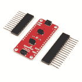

# SparkFun 三轴加速度计分线点- BMA400 (Qwiic)连接指南

> 原文：<https://learn.sparkfun.com/tutorials/sparkfun-triple-axis-accelerometer-breakout---bma400-qwiic-hookup-guide>

## 介绍

SparkFun 三轴加速度计分线板- BMA400 (Qwiic) ( [标准](https://www.sparkfun.com/products/21208)和[微型](https://www.sparkfun.com/products/21207))在易于使用的 Qwiic 分线板上提供一个适合超低功耗应用的三轴加速度传感器。Qwiic 系统允许集成到您的 I ² C 系统中，无需焊接。标准尺寸的 Qwiic 分线点还包括 0.1 英寸间距的 PTH 引脚，连接到传感器的通信接口和中断引脚，用于需要传统焊接连接的应用。

[](https://www.sparkfun.com/products/21208) 

将**添加到您的[购物车](https://www.sparkfun.com/cart)中！**

 **### [【spark fun 三轴加速度计 Breakout - BMA400 (Qwiic)](https://www.sparkfun.com/products/21208)

[In stock](https://learn.sparkfun.com/static/bubbles/ "in stock") SEN-21208

他 SparkFun Qwiic BMA400 三轴加速度计突破提供了一个 3 轴加速度传感器，非常适合超低功耗应用。

$8.95[Favorited Favorite](# "Add to favorites") 1[Wish List](# "Add to wish list")****[](https://www.sparkfun.com/products/21207) 

将**添加到您的[购物车](https://www.sparkfun.com/cart)中！**

 **### [【spark fun 微型三轴加速度计 Breakout - BMA400 (Qwiic)](https://www.sparkfun.com/products/21207)

[In stock](https://learn.sparkfun.com/static/bubbles/ "in stock") SEN-21207

SparkFun Qwiic BMA400 微型三轴加速度计突破提供了一个 3 轴加速度传感器完美的超低…

$9.95[Favorited Favorite](# "Add to favorites") 0[Wish List](# "Add to wish list")**** ****[https://www.youtube.com/embed/Ahq-novteJk/?autohide=1&border=0&wmode=opaque&enablejsapi=1](https://www.youtube.com/embed/Ahq-novteJk/?autohide=1&border=0&wmode=opaque&enablejsapi=1)

来自博世 Sensortech 的 BMA400 具有 2/ 4/ 8/ 16g 的满量程加速范围，并且在最高性能设置下运行时具有极低的电流消耗< 14.5 A。该传感器还包括一套完整的片内中断功能，包括计步、活动识别、方向检测和点击/双击。

本指南将详细介绍 BMA400 的特性和这些板上的硬件，以及如何使用 SparkFun BMA400 Arduino 库将其集成到 Qwiic 电路中。

### 所需材料

按照本指南，您需要一个微控制器来与 BMA400 通信。以下是一些开箱即用的 Qwiic 选项:

[](https://www.sparkfun.com/products/15663) 

将**添加到您的[购物车](https://www.sparkfun.com/cart)中！**

 **### [【spark fun Thing Plus-ESP32 WROOM(微-B)](https://www.sparkfun.com/products/15663)

[Out of stock](https://learn.sparkfun.com/static/bubbles/ "out of stock") WRL-15663

SparkFun ESP32 Thing Plus 是开始使用 Espressif 物联网概念的下一步，同时还可以享受所有的便利设施

$22.5010[Favorited Favorite](# "Add to favorites") 48[Wish List](# "Add to wish list")****[](https://www.sparkfun.com/products/18158) 

将**添加到您的[购物车](https://www.sparkfun.com/cart)中！**

 **### [SparkFun RedBoard 加](https://www.sparkfun.com/products/18158)

[In stock](https://learn.sparkfun.com/static/bubbles/ "in stock") DEV-18158

RedBoard Plus 是一款兼容 Arduino 的开发板，拥有 Arduino Uno 所需的一切，并具有额外的额外功能…

$21.504[Favorited Favorite](# "Add to favorites") 12[Wish List](# "Add to wish list")****[](https://www.sparkfun.com/products/15574) 

将**添加到您的[购物车](https://www.sparkfun.com/cart)中！**

 **### [火花趣事 Plus——阿尔忒弥斯](https://www.sparkfun.com/products/15574)

[25 available](https://learn.sparkfun.com/static/bubbles/ "25 available") WRL-15574

SparkFun Artemis Thing Plus 采用了我们流行的羽毛足迹，并添加了强大的 Artemis 模块，以实现终极功能

$22.50[Favorited Favorite](# "Add to favorites") 28[Wish List](# "Add to wish list")****[](https://www.sparkfun.com/products/15444) 

将**添加到您的[购物车](https://www.sparkfun.com/cart)中！**

 **### [SparkFun RedBoard Artemis](https://www.sparkfun.com/products/15444)

[In stock](https://learn.sparkfun.com/static/bubbles/ "in stock") DEV-15444

RedBoard Artemis 采用 SparkFun 的功能强大的 Artemis 模块，并将其包装在一个易于使用和熟悉的环境中…

$21.509[Favorited Favorite](# "Add to favorites") 32[Wish List](# "Add to wish list")******** ********如果您选择的微控制器尚未启用 Qwiic，您可以添加以下一项或多项功能:

[](https://www.sparkfun.com/products/15081) 

将**添加到您的[购物车](https://www.sparkfun.com/cart)中！**

 **### [SparkFun Qwiic 线缆套件](https://www.sparkfun.com/products/15081)

[In stock](https://learn.sparkfun.com/static/bubbles/ "in stock") KIT-15081

为了更容易上手，我们用 50 毫米到 500 毫米的各种 Qwiic 电缆组装了 Qwiic 电缆套件…

$8.9516[Favorited Favorite](# "Add to favorites") 58[Wish List](# "Add to wish list")****[](https://www.sparkfun.com/products/14495) 

将**添加到您的[购物车](https://www.sparkfun.com/cart)中！**

 **### [SparkFun Qwiic 适配器](https://www.sparkfun.com/products/14495)

[In stock](https://learn.sparkfun.com/static/bubbles/ "in stock") DEV-14495

SparkFun Qwiic 适配器提供了将任何旧 I ² C 板改造成支持 Qwiic 的板的完美方法。

$1.601[Favorited Favorite](# "Add to favorites") 53[Wish List](# "Add to wish list")****[](https://www.sparkfun.com/products/14352) 

将**添加到您的[购物车](https://www.sparkfun.com/cart)中！**

 **### [ArduinoT3 的 SparkFun Qwiic 盾](https://www.sparkfun.com/products/14352)

[In stock](https://learn.sparkfun.com/static/bubbles/ "in stock") DEV-14352

SparkFun Qwiic Shield 是一种易于组装的板，它提供了一种简单的方法来将 Qwiic Connect 系统与

$7.508[Favorited Favorite](# "Add to favorites") 39[Wish List](# "Add to wish list")****[](https://www.sparkfun.com/products/16790) 

将**添加到您的[购物车](https://www.sparkfun.com/cart)中！**

 **### [SparkFun Qwiic 盾为物加](https://www.sparkfun.com/products/16790)

[In stock](https://learn.sparkfun.com/static/bubbles/ "in stock") DEV-16790

SparkFun Qwiic Shield for Thing Plus 使您可以使用 spark fun 的 Qwiic connect 生态系统和开发板来测试

$4.95[Favorited Favorite](# "Add to favorites") 7[Wish List](# "Add to wish list")******** ********您还需要至少一根 Qwiic 电缆将传感器连接到微控制器。

[](https://www.sparkfun.com/products/14427) 

将**添加到您的[购物车](https://www.sparkfun.com/cart)中！**

 **### [Qwiic 线缆- 100mm](https://www.sparkfun.com/products/14427)

[In stock](https://learn.sparkfun.com/static/bubbles/ "in stock") PRT-14427

这是一条 100 毫米长的 4 芯电缆，带有 1 毫米 JST 端接。它旨在将支持 Qwiic 的组件连接在一起…

$1.50[Favorited Favorite](# "Add to favorites") 32[Wish List](# "Add to wish list")****[](https://www.sparkfun.com/products/14429) 

将**添加到您的[购物车](https://www.sparkfun.com/cart)中！**

 **### [Qwiic 线缆- 500mm](https://www.sparkfun.com/products/14429)

[In stock](https://learn.sparkfun.com/static/bubbles/ "in stock") PRT-14429

这是一根 500mm 长的 4 芯电缆，带有 1mm JST 端接。它旨在将支持 Qwiic 的组件连接在一起…

$1.951[Favorited Favorite](# "Add to favorites") 25[Wish List](# "Add to wish list")****[](https://www.sparkfun.com/products/14426) 

将**添加到您的[购物车](https://www.sparkfun.com/cart)中！**

 **### [Qwiic 线缆- 50mm](https://www.sparkfun.com/products/14426)

[In stock](https://learn.sparkfun.com/static/bubbles/ "in stock") PRT-14426

这是一根 50 毫米长的 4 芯电缆，带有 1 毫米 JST 端接。它旨在将支持 Qwiic 的组件连接在一起…

$0.95[Favorited Favorite](# "Add to favorites") 29[Wish List](# "Add to wish list")****[](https://www.sparkfun.com/products/14428) 

### [Qwiic 线缆- 200mm](https://www.sparkfun.com/products/14428)

[Out of stock](https://learn.sparkfun.com/static/bubbles/ "out of stock") PRT-14428

这是一根 200 毫米长的 4 芯电缆，带有 1 毫米 JST 端接。它旨在将支持 Qwiic 的组件连接在一起…

[Favorited Favorite](# "Add to favorites") 21[Wish List](# "Add to wish list")****** ******### 推荐阅读

如果你不熟悉 Qwiic 系统，我们推荐你在这里阅读[以获得一个概述](https://www.sparkfun.com/qwiic)。

| [](https://www.sparkfun.com/qwiic) |

如果你不熟悉以下教程中的概念，我们也建议你看一看它们。如果您正在使用上面列出的 Qwiic Shields 之一，在开始使用 SparkFun 三轴加速度计 Breakout - BMA400 (Qwiic)之前，您可能还需要通读它们各自的连接指南。

[](https://learn.sparkfun.com/tutorials/i2c) [### I2C](https://learn.sparkfun.com/tutorials/i2c) An introduction to I2C, one of the main embedded communications protocols in use today.[Favorited Favorite](# "Add to favorites") 128[](https://learn.sparkfun.com/tutorials/terminal-basics) [### 串行终端基础知识](https://learn.sparkfun.com/tutorials/terminal-basics) This tutorial will show you how to communicate with your serial devices using a variety of terminal emulator applications.[Favorited Favorite](# "Add to favorites") 46[](https://learn.sparkfun.com/tutorials/qwiic-shield-for-arduino--photon-hookup-guide) [### Arduino 和光子连接指南的 Qwiic 屏蔽](https://learn.sparkfun.com/tutorials/qwiic-shield-for-arduino--photon-hookup-guide) Get started with our Qwiic ecosystem with the Qwiic shield for Arduino or Photon.[Favorited Favorite](# "Add to favorites") 5[](https://learn.sparkfun.com/tutorials/sparkfun-qwiic-shield-for-arduino-nano-hookup-guide) [### Arduino Nano 连接指南的 SparkFun Qwiic 盾](https://learn.sparkfun.com/tutorials/sparkfun-qwiic-shield-for-arduino-nano-hookup-guide) Hookup Guide for the SparkFun Qwiic Shield for Arduino Nano.[Favorited Favorite](# "Add to favorites") 1

## 硬件概述

让我们仔细看看 BMA400 和这些 Qwiic 分会场上的其他硬件特性。

### BMA400 三轴加速度计

Bosch Sensortec 的 BMA400 三轴加速度计是一款超低功耗运动传感器，具有多种中断特性，非常适合电池供电的活动监控应用。

| [](https://cdn.sparkfun.com/assets/learn_tutorials/2/7/5/9/Qwiic_BMA400_-_Sensor.jpg) | [](https://cdn.sparkfun.com/assets/learn_tutorials/2/7/5/9/Qwiic_Micro_BMA400_-_Sensor.jpg) |

BMA400 具有 2/ 4/ 8/ 16g 四个用户可选范围，在最高性能设置下测量加速度数据时，功耗仅为 14.5 A。BMA400 还包括一个强大的中断功能集:

*   自动唤醒
*   自动低功耗
*   步进计数器
*   活动识别(跑步、行走、静止不动)
*   方向检测
*   点击并双击

传感器有两个中断引脚可用于上述所有中断条件。下表列出了 BMA400 的一些感应和操作参数。有关 BMA400 的完整概述，请参考[数据表](https://cdn.sparkfun.com/assets/e/9/e/6/0/BMA400-Datasheet.pdf)。

| 参数 | 量滴 | 典型。 | 最大值 | 单位 | 笔记 |
| 电源电压 | One point seven two | One point eight | Three point six | V | 突破运行 BMA400 在 3.3V。 |
| 正常模式电流消耗 |  | Fourteen point five |  | A | 过采样率设为 3 |
| 低功率模式电流消耗 |  | Zero point eight five |  | 过采样率设置为 0 |
| 睡眠模式电流消耗 |  | Zero point one six |  |  |
| 加速度范围 |  | ±2 |  | g | 灵敏度为 1024 磅/克 |
|  | ±4 |  | 灵敏度为 512 磅/克 |
|  | ±8 |  | 灵敏度为 256LSB/g |
|  | ±16 |  | 灵敏度为 128LSB/g |
| 输出数据速率(ODR) | Twelve point five |  | eight hundred | 赫兹 | 低功率模式下的 ODR 为 25Hz |

### 通信接口- I ² C & SPI

默认情况下，这些 Qwiic 分线点的标准尺寸版本通过 I ² C 进行通信，但也支持使用 SPI 进行通信。Qwiic 微型版仅支持通过板上的 Qwiic 连接器进行 I ² C 通信。

| [](https://cdn.sparkfun.com/assets/learn_tutorials/2/7/5/9/Qwiic_BMA400_-_Interfaces.jpg) | [](https://cdn.sparkfun.com/assets/learn_tutorials/2/7/5/9/Qwiic_Micro_BMA400_-_Interfaces.jpg) |

标准尺寸将 I ² C 接口连接到一对 Qwiic 连接器和一个 0.1 英寸间距的 PTH 接头，适合喜欢 SPI 或传统焊接连接的用户。标准尺寸分线点将 INT1 和 INT2 路由至一对 PTH 引脚。Qwiic Micro 仅将 INT1 路由至 PTH 引脚。

两块板默认设置 BMA400 的 I ² C 地址为 **0x14** 。调整 ADR 跳线以更改到备用地址( **0x15** )或将其完全打开以使用 SPI 接口(仅标准尺寸)。有关该跳线的更多信息，请参见下面的“焊料跳线”部分。

### 焊料跳线

标准尺寸分接头有四个焊接跳线，分别标有 **PWR** 、 **ADR** 、 **I2C** 和 **CS** 。除了 **CS** 跳线之外，微型型号都有，因为微型版本不支持 SPI。而是微版把 CS 引脚拉到 **3.3V** 。下表概述了跳线的标签、默认状态、功能以及关于其使用的任何注意事项。

| [](https://cdn.sparkfun.com/assets/learn_tutorials/2/7/5/9/Qwiic_BMA400_-_Solder_Jumpers.jpg) | [](https://cdn.sparkfun.com/assets/learn_tutorials/2/7/5/9/Qwiic_Micro_BMA400_-_Solder_Jumpers.jpg) |

| 标签 | 默认状态 | 功能 | 笔记 |
| 压水反应堆 | 关闭的 | 完成电源 LED 电路。 | 打开以禁用电源指示灯。 |
| 纠纷调解 | 参见注释 | 设置传感器的 I ² C 地址。 | 地址默认为 0x14。切断“中心”和“左”焊盘之间的走线，连接“中心”和“右”焊盘，切换到 0x15。完全打开，以便在 SPI 上使用 BMA400(仅限标准尺寸。) |
| I2C | 关闭的 | 通过一对 2.2k &ohm;电阻将 SDA/SCL 线连接到 VCC (3.3V)。 | 打开跳线以禁用 I2C 线上的上拉电阻。 |
| CS* | 关闭的 | 通过 10k &ohm;电阻将 BMA400 的芯片选择(CS)引脚拉至 VCC (3.3V)。 | *仅标准尺寸。打开以禁用 CS 上的上拉电阻。 |

### 电路板尺寸

这些板符合 Qwiic 分线点的标准和微型外形规格，尺寸为 1 英寸 x 1 英寸(标准)和 0.5 英寸 x 0.3 英寸(微型)。标准分接头有四个安装孔，微型有一个。所有安装孔都适合一个尺寸为 [4-40](https://www.sparkfun.com/products/10453) 的螺钉。

| [](https://cdn.sparkfun.com/assets/7/a/3/1/e/SparkFun_Triple_Axis_Accelerometer_Breakout_-_BMA400__Qwiic__Dimensions.png) | [](https://cdn.sparkfun.com/assets/6/8/c/2/2/SparkFun_Micro_Triple_Axis_Accelerometer_Breakout_-_BMA400__Qwiic__Dimensions.png) |

## 硬件装配

现在我们已经熟悉了 BMA400，我们可以开始组装电路了。

### Qwiic/I ² C 总成

开始使用分线点最快、最简单的方法是将分线点上的 Qwiic 连接器连接到支持 Qwiic 的开发板，如 SparkFun RedBoard Artemis，使用 Qwiic 电缆，如下图所示。

[](https://cdn.sparkfun.com/assets/learn_tutorials/2/7/5/9/Qwiic_BMA400_-_Assembly.jpg)

如果您希望与标准尺寸的分线点实现更安全、更持久的连接，您可以将接头焊接或接线至电路板上的 PTH 接头。

### SPI 组件(仅标准尺寸)

设置分线点以通过 SPI 与传感器通信需要完全打开 ADR 跳线，我们建议焊接到 PTH 接头进行连接。如果您不熟悉通孔焊接，请通读本教程:

[](https://learn.sparkfun.com/tutorials/how-to-solder-through-hole-soldering) [### 如何焊接:通孔焊接

#### 2013 年 9 月 19 日](https://learn.sparkfun.com/tutorials/how-to-solder-through-hole-soldering) This tutorial covers everything you need to know about through-hole soldering.[Favorited Favorite](# "Add to favorites") 70

除了焊接工具，你还需要一些连接线或接头和跳线。切断 ADR 跳线的“中心”和“右侧”焊盘之间的走线，切换到 SPI 模式。打开该跳线后，将分线器连接到控制器的 SPI 总线引脚。

请记住，BMP384 在 **3.3V 逻辑**下运行，因此请确保连接到运行在相同[逻辑电平](https://learn.sparkfun.com/tutorials/logic-levels)的电路板，如 [RedBoard Artemis](https://www.sparkfun.com/products/15444) 或使用[电平转换器](https://www.sparkfun.com/categories/361)将其调整到正确的电压。

[](https://cdn.sparkfun.com/assets/learn_tutorials/2/7/5/9/Qwiic_BMA400_-_Address_Jumper.jpg)*Open the ADR jumper completely to use SPI.*

## BMA400 Arduino 库

**注意:**该库假设您在桌面上使用的是最新版本的 Arduino IDE。如果这是你第一次使用 Arduino，请回顾我们关于[安装 Arduino IDE 的教程。](https://learn.sparkfun.com/tutorials/installing-arduino-ide)如果您之前没有安装 Arduino 库，请查看我们的[安装指南。](https://learn.sparkfun.com/tutorials/installing-an-arduino-library)

SparkFun BMA400 Arduino 库基于 Bosch 的传感器 API，让用户开始从传感器读取数据并使用各种中断选项。通过 Arduino 库管理器工具搜索**“spark fun BMA 400”**安装库。喜欢手动安装库的用户可以通过点击下面的按钮从 GitHub 库下载一个副本:

[SparkFun BMA400 Arduino Library (ZIP)](https://github.com/sparkfun/SparkFun_BMA400_Arduino_Library/archive/refs/heads/main.zip)

### 库函数

下表概述并描述了 SparkFun BMA400 Arduino 库中可用的功能。有关可用参数和所有功能使用的详细信息，请参考[。库](https://github.com/sparkfun/SparkFun_BMA400_Arduino_Library/blob/main/src/SparkFun_BMA400_Arduino_Library.cpp)中的 cpp 文件。

#### 传感器初始化和配置

*   `int8_t BMA400::beginI2C(uint8_t address, TwoWire& wirePort);` -在指定的地址和端口通过 I ² C 初始化传感器。
*   `int8_t BMA400::beginSPI(uint8_t csPin, uint32_t clockFrequency);` -用指定的片选引脚和时钟频率通过 SPI 初始化传感器。
*   `int8_t setMode(uint8_t mode);` -设置电源模式。
*   `int8_t getMode(uint8_t* mode);` -返回电源模式的设置。
*   `int8_t setAutoWakeup(bma400_auto_wakeup_conf* config);` -启用自动唤醒。
*   `int8_t setAutoLowPower(bma400_auto_lp_conf* config);` -启用自动低功耗
*   `int8_t setRange(uint8_t range);` -设置测量范围。
*   `int8_t getRange(uint8_t* range);` -返回为测量范围存储的值。
*   `int8_t setODR(uint8_t odr);` -设置输出数据速率。
*   `int8_t getODR(uint8_t* odr);` -返回为输出数据速率存储的值。
*   `int8_t setOSRLP(uint8_t osrLP);` -设置低功率输出数据速率。
*   `int8_t getOSRLP(uint8_t* osrLP);` -返回为低功率输出数据速率存储的值。
*   `int8_t setDataSource(uint8_t source);` -设置数据源过滤器。选项默认为可变 ODR、100Hz ODR 和 100Hz 带宽 1Hz。
*   `int8_t getDataSource(uint8_t* source);` -返回数据源的值。
*   `int8_t setFilter1Bandwidth(uint8_t bw);` -设置低通滤波器带宽。
*   `int8_t getFilter1Bandwidth(uint8_t* bw);` -返回低通滤波器带宽的设定值。
*   `int8_t getStepCount(uint32_t* count, uint8_t* activityType);` -返回测量的步数以及活动类型(静止、行走和跑步)。
*   `int8_t selfTest();` -运行自检以确定传感器是否正常工作。

#### 传感器数据

*   `int8_t getSensorData(bool sensorTime = false);` -向 BMA400 请求加速度数据。必须调用它来更新数据结构。
*   `int8_t getTemperature(float* temp);` -返回以摄氏度为单位记录的温度数据

#### 中断控制和功能选择

*   `int8_t setInterruptPinMode(bma400_int_chan channel, uint8_t mode);` -设置中断引脚模式。选项有推挽式和高/低电平有效。
*   `int8_t enableInterrupt(bma400_int_type intType, bool enable);` -启用中断条件。
*   `int8_t getInterruptStatus(uint16_t* status);` -返回各种中断条件(唤醒、活动、步进等)的中断状态标志。).
*   `int8_t setDRDYInterruptChannel(bma400_int_chan channel);` -选择数据就绪中断条件的中断引脚。
*   `int8_t setGeneric1Interrupt(bma400_gen_int_conf* config);` -设置通用 1 中断配置。
*   `int8_t setGeneric2Interrupt(bma400_gen_int_conf* config);` -设置通用 2 中断配置。
*   `int8_t setOrientationChangeInterrupt(bma400_orient_int_conf* config);` -设置方向改变中断配置。
*   `int8_t setTapInterrupt(bma400_tap_conf* config);` -设置 tap 中断配置。
*   `int8_t setStepCounterInterrupt(bma400_step_int_conf* config);` -设置步进计数器中断配置。
*   `int8_t setActivityChangeInterrupt(bma400_act_ch_conf* config);` -设置活动改变中断配置。
*   `int8_t setWakeupInterrupt(bma400_wakeup_conf* config);` -设置设备唤醒中断配置。

#### FIFO 缓冲控制

*   `int8_t setFIFOConfig(bma400_fifo_conf* config);` -启用并配置 FIFO 缓冲器。
*   `int8_t getFIFOLength(uint16_t* numData);` -设置存储在 FIFO 缓冲器中的样本数量。
*   `int8_t getFIFOData(BMA400_SensorData* data, uint16_t* numData);` -提取存储在 FIFO 缓冲器中的数据。
*   `int8_t flushFIFO();` -清空 FIFO 缓冲器。

## Arduino 示例

BMA400 Arduino 库包括 12 个示例，涵盖了加速度计的所有主要特性。在这一节中，我们将仔细研究其中的三种。

### 示例 1 -基本读数 I ² C

示例 1 演示了如何设置 BMA400 通过 I ² C 传输基本运动数据。导航至**文件>示例> SparkFun BMA400 Arduino 库>示例 01_BasicReadingsI2C** 打开示例。选择您的主板和端口，然后单击上传。上传完成后，打开[串行监视器](https://learn.sparkfun.com/tutorials/terminal-basics)，波特率设置为 **115200** ，观看运动数据打印输出。

如果您已调整 ADR 跳线，以更改为 BMA400 注释的备用 I ² C 地址/取消注释具有正确值的行:

```
language:c
uint8_t i2cAddress = BMA400_I2C_ADDRESS_DEFAULT; // 0x14
//uint8_t i2cAddress = BMA400_I2C_ADDRESS_SECONDARY; // 0x15 
```

该示例尝试使用 I ² C 中指定地址的默认设置初始化传感器。如果无法正确初始化，代码会在 over serial 中打印出一个错误:

```
language:c
while(accelerometer.beginI2C(i2cAddress) != BMA400_OK)
    {
        // Not connected, inform user
        Serial.println("Error: BMA400 not connected, check wiring and I2C address!");

        // Wait a bit to see if connection is established
        delay(1000);
    } 
```

如果您看到此错误，请仔细检查传感器是否连接正确，是否设置了正确的 I ² C 地址，并重置开发板或重新上传代码。

该循环使用“getSensorData()；”每 20 毫秒轮询 BMA400 一次加速度数据函数并打印出所有三个轴的加速度，单位为 g:

```
language:c
void loop()
{
    // Get measurements from the sensor. This must be called before accessing
    // the acceleration data, otherwise it will never update
    accelerometer.getSensorData();

    // Print acceleration data
    Serial.print("Acceleration in g's");
    Serial.print("\t");
    Serial.print("X: ");
    Serial.print(accelerometer.data.accelX, 3);
    Serial.print("\t");
    Serial.print("Y: ");
    Serial.print(accelerometer.data.accelY, 3);
    Serial.print("\t");
    Serial.print("Z: ");
    Serial.println(accelerometer.data.accelZ, 3);

    // Print 50x per second
    delay(20);
} 
```

向不同方向移动传感器，观察加速度数据随运动的变化。

### 示例 6 -运动检测

示例 6 -运动检测演示了如何配置 BMA400 的一个中断引脚(INT1 ),以在传感器检测到 Z 轴上超过 1g 的运动时触发。

代码默认使用“D2”作为连接开发板的中断引脚。如果您的开发板不支持“D2”上的外部中断，请更改此处的值:

```
language:c
int interruptPin = 2; 
```

如果您不确定主板上的哪些引脚支持外部中断，[该参考页](https://www.arduino.cc/reference/en/language/functions/external-interrupts/attachinterrupt/)列出了大多数常见 Arduino 开发板的可用中断引脚。

通过 I ² C 初始化 BMA400 后，代码配置中断功能:

```
language:c
bma400_gen_int_conf config =
    {
        .gen_int_thres = 5, // 8mg resolution (eg. gen_int_thres=5 results in 40mg)
        .gen_int_dur = 5, // 10ms resolution (eg. gen_int_dur=5 results in 50ms)
        .axes_sel = BMA400_AXIS_XYZ_EN, // Which axes to evaluate for interrupts (X/Y/Z in any combination)
        .data_src = BMA400_DATA_SRC_ACCEL_FILT_2, // Which filter to use (must be 100Hz, datasheet recommends filter 2)
        .criterion_sel = BMA400_ACTIVITY_INT, // Trigger interrupts when active or inactive
        .evaluate_axes = BMA400_ANY_AXES_INT, // Logical combining of axes for interrupt condition (OR/AND)
        .ref_update = BMA400_UPDATE_EVERY_TIME, // Whether to automatically update reference values
        .hysteresis = BMA400_HYST_96_MG, // Hysteresis acceleration for noise rejection
        .int_thres_ref_x = 0, // Raw 12-bit acceleration value
        .int_thres_ref_y = 0, // Raw 12-bit acceleration value
        .int_thres_ref_z = 512, // Raw 12-bit acceleration value (at 4g range (default), 512 = 1g)
        .int_chan = BMA400_INT_CHANNEL_1 // Which pin to use for interrupts
    };
    accelerometer.setGeneric1Interrupt(&config);

    // Here we configure the INT1 pin to push/pull mode, active high
    accelerometer.setInterruptPinMode(BMA400_INT_CHANNEL_1, BMA400_INT_PUSH_PULL_ACTIVE_1);

    // Enable generic 1 interrupt condition
    accelerometer.enableInterrupt(BMA400_GEN1_INT_EN, true);

    // Setup interrupt handler
    attachInterrupt(digitalPinToInterrupt(interruptPin), bma400InterruptHandler, RISING); 
```

这将配置 INT1 在推/拉模式下工作，并且每当 BMA400 报告 Z 轴运动超过 1g 以及其他设置时，int 1 为高电平有效。它还启用中断条件并设置中断处理程序。

主循环等待中断事件发生，并在发生中断和检测到运动时打印输出。

### 示例 10 步计数器

示例 10 步计数器显示了如何使用 BMA400 的步数计数器功能，该功能常见于智能手表和其他活动监视器。传感器处理步数检测和计数，因此我们将这些设置保留为默认设置。它们在技术上可以被改变，但是我们不建议这样做，因为它没有被很好地记录，并且会导致不可预知的行为。

初始化传感器后，我们为中断选择并配置 INT1，并启用步数计数:

```
language:c
bma400_step_int_conf config =
    {
        .int_chan = BMA400_INT_CHANNEL_1 // Which pin to use for interrupts
    };
    accelerometer.setStepCounterInterrupt(&config);

    // Here we configure the INT1 pin to push/pull mode, active high
    accelerometer.setInterruptPinMode(BMA400_INT_CHANNEL_1, BMA400_INT_PUSH_PULL_ACTIVE_1);

    // Enable step counter interrupt condition. This must be set to enable step
    // counting at all, even if you don't want interrupts to be generated.
    // In that case,  set the interrupt channel above to BMA400_UNMAP_INT_PIN
    accelerometer.enableInterrupt(BMA400_STEP_COUNTER_INT_EN, true);

    // Setup interrupt handler
    attachInterrupt(digitalPinToInterrupt(interruptPin), bma400InterruptHandler, RISING); 
```

主循环检查步进检测中断事件，并通过串行打印步进计数和活动类型。尝试移动传感器或将其连接到手腕上，以模拟智能手表并四处走动/跑步。您应该看到数据更新了新的步长值和活动状态。

## 解决纷争

### 常规故障排除

**Not working as expected and need help?**

If you need technical assistance and more information on a product that is not working as you expected, we recommend heading on over to the [SparkFun Technical Assistance](https://www.sparkfun.com/technical_assistance) page for some initial troubleshooting.

[SparkFun Technical Assistance Page](https://www.sparkfun.com/technical_assistance)

If you don't find what you need there, the [SparkFun Forums](https://forum.sparkfun.com/index.php) are a great place to find and ask for help. If this is your first visit, you'll need to [create a Forum Account](https://forum.sparkfun.com/ucp.php?mode=register) to search product forums and post questions. 

## 资源和更进一步

本教程到此为止。有关 BMA400 和这些分组讨论的更多信息，请查看以下资源:

*   图表
    *   [标准](https://cdn.sparkfun.com/assets/0/2/5/5/b/SparkFun_Triple_Axis_Accelerometer_Breakout_-_BMA400__Qwiic_.pdf)
    *   [微](https://cdn.sparkfun.com/assets/8/1/1/9/3/SparkFun_Micro_Triple_Axis_Accelerometer_Breakout_-_BMA400__Qwiic_.pdf)
*   Eagle 文件
    *   [标准](https://cdn.sparkfun.com/assets/6/b/9/5/3/SparkFun_Triple_Axis_Accelerometer_Breakout_-_BMA400__Qwiic_.zip)
    *   [微](https://cdn.sparkfun.com/assets/b/e/2/2/7/SparkFun_Micro_Triple_Axis_Accelerometer_Breakout_-_BMA400__Qwiic_.zip)
*   电路板尺寸
    *   [标准](https://cdn.sparkfun.com/assets/7/a/3/1/e/SparkFun_Triple_Axis_Accelerometer_Breakout_-_BMA400__Qwiic__Dimensions.png)
    *   [微](https://cdn.sparkfun.com/assets/6/8/c/2/2/SparkFun_Micro_Triple_Axis_Accelerometer_Breakout_-_BMA400__Qwiic__Dimensions.png)
*   [数据表](https://cdn.sparkfun.com/assets/e/9/e/6/0/BMA400-Datasheet.pdf) (BMA400)
*   [Qwiic 信息页面](https://www.sparkfun.com/qwiic)
*   [BMA400 Arduino 库](https://github.com/sparkfun/SparkFun_BMA400_Arduino_Library)
*   [GitHub 硬件回购](https://github.com/sparkfun/SparkFun_Qwiic_Accelerometer_BMA400)

使用 BMA400 进行运动感应项目需要一些灵感吗？下面的教程可能会帮助你想出一些主意:

[](https://learn.sparkfun.com/tutorials/itg-3200-hookup-guide) [### ITG-3200 连接指南](https://learn.sparkfun.com/tutorials/itg-3200-hookup-guide) Learn how to interact with the ITG-3200 Triple Axis Gyroscope.[Favorited Favorite](# "Add to favorites") 2[](https://learn.sparkfun.com/tutorials/accelerometer-basics) [### 加速度计基础知识](https://learn.sparkfun.com/tutorials/accelerometer-basics) A quick introduction to accelerometers, how they work, and why they're used.[Favorited Favorite](# "Add to favorites") 29[](https://learn.sparkfun.com/tutorials/apds-9960-rgb-and-gesture-sensor-hookup-guide) [### APDS-9960 RGB 和手势传感器连接指南](https://learn.sparkfun.com/tutorials/apds-9960-rgb-and-gesture-sensor-hookup-guide) Getting started guide for the Avago APDS-9960 color, proximity, and gesture sensor.[Favorited Favorite](# "Add to favorites") 6[](https://learn.sparkfun.com/tutorials/photon-imu-shield-hookup-guide) [### 光子 IMU 屏蔽连接指南](https://learn.sparkfun.com/tutorials/photon-imu-shield-hookup-guide) Learn how to use the SparkFun Photon IMU Shield for your Photon device which houses an on-board LSM9DS1 system-in-a-chip that houses a 3-axis accelerometer, 3-axis gyroscope, and 3-axis magnetometer.[Favorited Favorite](# "Add to favorites") 5**************************