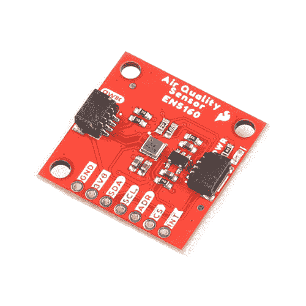

# SparkFun 室内空气质量传感器- ENS160 (Qwiic)连接指南

> 原文：<https://learn.sparkfun.com/tutorials/sparkfun-indoor-air-quality-sensor---ens160-qwiic-hookup-guide>

## 介绍

[SparkFun 室内空气质量传感器- ENS160 (Qwiic)](http://www.sparkfun.com/products/20844) 采用 ScioSense 的 ENS160，这是一种带有四个传感器元件的数字多气体传感器解决方案，可用于楼宇自动化、智能家居和暖通空调等广泛应用。独立的加热板控制允许以极高的灵敏度检测挥发性有机化合物(VOC ),包括乙醇、甲苯、氢气和氧化气体。ENS160 支持智能算法来处理片内原始传感器测量值。这些算法计算二氧化碳当量、TVOC、空气质量指数(AQIs)，并执行湿度和温度补偿以及基线管理，所有这些都在芯片上完成。可以读取原始传感器测量值，以便进一步定制。让我们开始吧！

 

将**添加到您的[购物车](https://www.sparkfun.com/cart)中！**

### [spark fun 室内空气质量传感器-ENS160(Qwiic)](https://www.sparkfun.com/products/20844)

[In stock](https://learn.sparkfun.com/static/bubbles/ "in stock") SEN-20844

ENS160 是一种数字多气体传感器解决方案，有四个传感器元件，可用于各种空气质量和环境

$19.95[Favorited Favorite](# "Add to favorites") 8[Wish List](# "Add to wish list")** **[https://www.youtube.com/embed/6E3sYbAJ78s/?autohide=1&border=0&wmode=opaque&enablejsapi=1](https://www.youtube.com/embed/6E3sYbAJ78s/?autohide=1&border=0&wmode=opaque&enablejsapi=1)

### 所需材料

要跟随本教程，您将需要以下材料。你可能不需要所有的东西，这取决于你拥有什么。将它添加到您的购物车，通读指南，并根据需要调整购物车。**