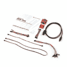
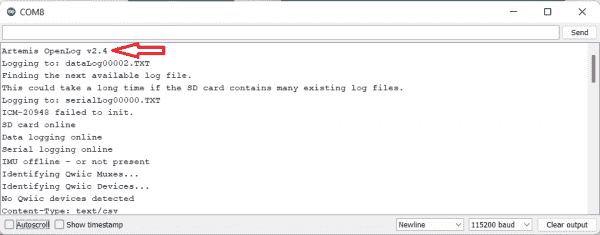
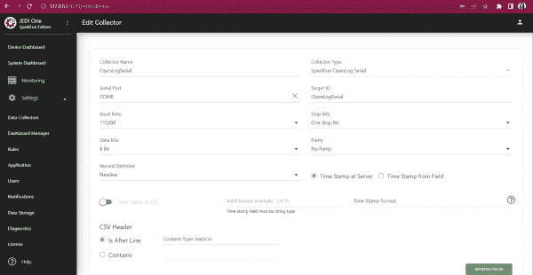

# machinecat 入门

> 原文：<https://learn.sparkfun.com/tutorials/getting-started-with-machinechat>

## 介绍

[SparkFun OpenLog Artemis(无 IMU)](https://www.sparkfun.com/products/19426) 是一款开源数据记录器，预编程为自动记录 GPS、串行数据和各种压力、湿度和距离数据，并且能够扩展到任何数量的 Qwiic 传感器。这使得它非常适合数据收集，但是数据显示呢？接下来是机器聊天和绝地一号！

Machinechat 的 JEDI One 为物联网数据收集、转换、可视化和报告提供了易于使用、可定制的一站式仪表板解决方案。内置的 HTTP 和 TCP 服务器允许您在几分钟内开始从传感器和设备收集数据，自定义插件允许您从几乎任何传感器或设备收集数据。此外，完全集成的自包含 MQTT 代理使得集成任何基于 MQTT 的设备或传感器变得容易。不需要为 MQTT 设置单独的代理或使用 Azure 或 AWS。配置一下就行了！

[https://www.youtube.com/embed/QViUWvfRTeM/?autohide=1&border=0&wmode=opaque&enablejsapi=1](https://www.youtube.com/embed/QViUWvfRTeM/?autohide=1&border=0&wmode=opaque&enablejsapi=1)

### 所需材料

开始时，你真的只需要 [SparkFun OpenLog Artemis(不带 IMU)](https://www.sparkfun.com/products/19426) 和一个[绝地一号许可证](https://www.sparkfun.com/products/20674)，但你也可以使用这些套件中的任何一个:

 

将**添加到您的[购物车](https://www.sparkfun.com/cart)中！**

 **### [SparkFun OpenLog 数据采集器带 Machinechat -环境监测](https://www.sparkfun.com/products/20683)

[Only 10 left!](https://learn.sparkfun.com/static/bubbles/ "only 10 left!") KIT-20683

带有 Machinechat 的 OpenLog 数据收集器工具包的环境监测版本允许您显示您的数据

$144.95[Favorited Favorite](# "Add to favorites") 0[Wish List](# "Add to wish list")**** 

将**添加到您的[购物车](https://www.sparkfun.com/cart)中！**

 **### [带 Machinechat 的 SparkFun OpenLog 数据采集器-空气质量监测](https://www.sparkfun.com/products/20684)

[25 available](https://learn.sparkfun.com/static/bubbles/ "25 available") KIT-20684

空气质量监测版本的 OpenLog 数据收集器工具包与 Machinechat 允许您显示您的数据

$149.95[Favorited Favorite](# "Add to favorites") 0[Wish List](# "Add to wish list")**** 

将**添加到您的[购物车](https://www.sparkfun.com/cart)中！**

 **### [SparkFun OpenLog 数据采集器，带 Machinechat - Base 套件](https://www.sparkfun.com/products/20673)

[22 available](https://learn.sparkfun.com/static/bubbles/ "22 available") KIT-20673

带有 Machinechat 的 SparkFun OpenLog 数据收集器工具包的基础版本是一种组织和显示数据的简单方法…

$124.95[Favorited Favorite](# "Add to favorites") 0[Wish List](# "Add to wish list")****** ******### 推荐阅读

如果你不熟悉 Qwiic 系统，我们推荐你在这里阅读[以获得一个概述](https://www.sparkfun.com/qwiic)。

|  |

如果你不熟悉下面的教程，我们也建议你看一看。根据您拥有的套件或计划使用的 Qwiic 板，您可能还需要通读它们各自的连接指南。

 [### I2C](https://learn.sparkfun.com/tutorials/i2c) An introduction to I2C, one of the main embedded communications protocols in use today.[Favorited Favorite](# "Add to favorites") 128 [### 物联网的连通性](https://learn.sparkfun.com/tutorials/connectivity-of-the-internet-of-things) An overview of the different protocols that can be used for the development of Internet of Things (IoT)-based projects.[Favorited Favorite](# "Add to favorites") 26 [### MQTT 简介](https://learn.sparkfun.com/tutorials/introduction-to-mqtt) An introduction to MQTT, one of the main communication protocols used with the Internet of Things (IoT).[Favorited Favorite](# "Add to favorites") 26 [### OpenLog Artemis 连接指南](https://learn.sparkfun.com/tutorials/openlog-artemis-hookup-guide) How to use and re-program the OpenLog Artemis, an open source datalogger. The OLA comes preprogrammed to automatically log data. The OLA can also record serial data, analog voltages, or readings from external Qwiic-enabled I2C devices. Some of these Qwiic-enabled devices include GPS/GNSS modules, pressure, altitude, humidity, temperature, air quality, environment, distance, and weight sensors.[Favorited Favorite](# "Add to favorites") 1

## 软件安装

Machinechat 有许多安装包，具体取决于您的平台。对于本指南，我们使用的是 Windows 上的 JEDIOne PC Mac 安装。下面的按钮会将你重定向到 Jedi 下载页面:

[JEDIOne Installation Downloads](https://www.machinechat.io/jedione-pcmac)

继续下载适合您平台的正确安装包。

解压缩您安装程序，点击 mcjedi 可执行文件，您应该看到 MachineChat 服务器开始运行。它应该是这样的:

## 登录

一旦服务器开始运行，您就可以在 web 浏览器中查看仪表板。要导航到您的仪表板，您需要访问 http:// <ipaddress>:9123/ -如果您在服务器所在的同一台机器上运行 web 浏览器，您只需输入 [http://127.0.0.1:9123/](http://127.0.0.1:9123/) 。</ipaddress>

首次登录 JEDI One 时，您将使用“admin”作为登录名和密码。首次登录后，系统会提示您更改密码以供将来使用。更多详情可以在这里找到[:首次登录绝地一号](https://support.machinechat.io/hc/en-us/articles/360048802974-Log-in-to-JEDI-One-for-the-first-time)。

*Having a hard time seeing the details? Click the image for a closer look.*

## 固件

为了在 MachineChat 中使用 OpenLog Artemis，您需要确保您的 OpenLog Artemis 板具有 2.4 版或更高版本的固件。如果您不知道您的 OpenLog Artemis 上的版本，请插入您的板并在正确的端口上打开一个[串行监视器](https://learn.sparkfun.com/tutorials/terminal-basics)。吐出来的数据会告诉你运行的是什么版本:

*Having a hard time seeing the details? Click the image for a closer look.*

如果您确实需要更新固件，可以在此处找到[稳定版 2.4，或者点击下面的按钮:](https://github.com/sparkfun/OpenLog_Artemis/releases)

[Artemis OpenLog Firmware v2.4](https://github.com/sparkfun/OpenLog_Artemis/releases)

关于如何更新固件的说明包含在 [OpenLog Artemis 连接指南](https://learn.sparkfun.com/tutorials/openlog-artemis-hookup-guide)中。

 [### OpenLog Artemis 连接指南

#### 2020 年 8 月 20 日](https://learn.sparkfun.com/tutorials/openlog-artemis-hookup-guide) How to use and re-program the OpenLog Artemis, an open source datalogger. The OLA comes preprogrammed to automatically log data. The OLA can also record serial data, analog voltages, or readings from external Qwiic-enabled I2C devices. Some of these Qwiic-enabled devices include GPS/GNSS modules, pressure, altitude, humidity, temperature, air quality, environment, distance, and weight sensors.[Favorited Favorite](# "Add to favorites") 1

本教程中有很多非常有用的信息，但是如果你想跳过这些，直接进入“更新固件”部分，请随意点击下面的按钮:

[Updating the Artemis OpenLog Firmware](https://learn.sparkfun.com/tutorials/openlog-artemis-hookup-guide/all#updating-firmware)

## 配置您的仪表板

一旦你登录到机器聊天，你应该能够点击**设置**->-**数据采集器**，OpenLogSerial 将会被列出。继续点击 ***编辑收集器*** 按钮。

*Having a hard time seeing the details? Click the image for a closer look.*

您可能需要更改一些设置-验证您是否选择了正确的串行端口，并将其余设置设置为:

*   波特率(115200)
*   数据位(8)
*   奇偶校验(无奇偶校验)
*   停止位(一个停止位)
*   记录分隔符(换行符)
*   服务器上的时间戳
*   位于行后(已选择),文本条目应为内容类型:text/csv。

*Having a hard time seeing the details? Click the image for a closer look.*

检查完以上所有内容后，点击页面底部的保存。

您将被重定向回数据收集器页面；如果 OpenLog 收集器被禁用，请单击绿色的**启用收集器**图标。

*Having a hard time seeing the details? Click the image for a closer look.*

如果您再次点击**编辑收集器**按钮，您应该能够向下滚动并看到从 OpenLog Artemis 收集的变量和数据。这些是我们将用来创建仪表板视图的变量！

*Having a hard time seeing the details? Click the image for a closer look.*

## 显示数据

现在我们可以做有趣的事情了！

转到数据仪表板，点击橙色的**添加图表**按钮。

*Having a hard time seeing the details? Click the image for a closer look.*

请继续填写你认为合适的内容。您需要单击绿色加号按钮来添加数据源:

*Having a hard time seeing the details? Click the image for a closer look.*

单击**数据源**右侧的绿色加号按钮，为您的数据表添加数据源，然后单击添加:

*Having a hard time seeing the details? Click the image for a closer look.*

确保您已经满意地填写了此页面，然后单击绿色的“添加”按钮。

*Having a hard time seeing the details? Click the image for a closer look.*

啊哈，瞧！

*Having a hard time seeing the details? Click the image for a closer look.*

花些时间四处看看——你可以添加你认为合适的图表和数据——包括来自 Qwiic 分组讨论板的数据。这是一个系统仪表盘，显示了来自环境和空气质量传感器的一些数据:

*Having a hard time seeing the details? Click the image for a closer look.*

## 解决纷争

### Artemis OpenLog 故障排除

《Artemis OpenLog 连接指南》中有一个精彩的章节介绍了该板的故障排除。如果您需要有关 Artemis OpenLog 的帮助，请访问[OpenLog Artemis 连接指南](https://learn . spark fun . com/tutorials/open log-Artemis-hook up-Guide)或点击下面的按钮直接转到连接指南的故障排除和常见问题部分:

[Artemis OpenLog Troubleshooting and FAQs](https://learn.sparkfun.com/tutorials/openlog-artemis-hookup-guide/troubleshooting-and-faqs)

### machinecat 故障排除

MachineChat 有自己的故障排除和支持渠道-单击下面的按钮可重定向到他们的网站:

[MachineChat Help center](https://support.machinechat.io/hc/en-us)

## 资源和更进一步

现在你已经有了基础，是时候扩展了！看看我们的 [Qwiic 环境传感器](https://www.sparkfun.com/categories/tags/qwiic-environmental)、 [Qwiic 距离传感器](https://www.sparkfun.com/categories/tags/qwiic-distance)或[其他 Qwiic 传感器](https://www.sparkfun.com/categories/tags/qwiic-other)！

MachineChat 有一些很棒的资源——请查看以下内容:

*   [绝地一号下载页面](https://www.machinechat.io/jedione-pcmac)
*   [所有 JEDI 产品 3.1 版本发布说明](https://support.machinechat.io/hc/en-us/articles/9178681712279-Release-Notes-for-all-JEDI-products-v3-1-September-27-2022)
*   [设置 SparkFun OpenLog 串行数据采集器](https://support.machinechat.io/hc/en-us/articles/9046984101271-Setting-up-the-SparkFun-OpenLog-serial-data-collector)
*   [向数据仪表板添加控件](https://support.machinechat.io/hc/en-us/articles/8801281468183-Adding-Controls-to-Data-Dashboards)
*   [构建通用传感器中枢](https://www.machinechat.io/build-a-universal-sensor-hub)

需要灵感？查看我们的 Qwiic 或其他 Artemis 项目！

 [### SparkFun SAMD21 Pro 射频连接指南](https://learn.sparkfun.com/tutorials/sparkfun-samd21-pro-rf-hookup-guide) Using the super blazing, nay blinding, fast SAMD21 whipping clock cycles at 48MHz and the RFM96 module to connect to the Things Network (and other Radio woodles).[Favorited Favorite](# "Add to favorites") 6 [### LTE 卡特彼勒 M1/NB-IoT 屏蔽连接指南](https://learn.sparkfun.com/tutorials/lte-cat-m1nb-iot-shield-hookup-guide) The SparkFun LTE CAT M1/NB-IoT Shield equips your Arduino or Arduino-compatible microcontroller with access to data networks across the globe. This shield adds wireless, high-bandwidth cellular functionality to your IoT project 3 [### Qwiic 载板连接指南](https://learn.sparkfun.com/tutorials/qwiic-carrier-board-hookup-guide) The Qwiic carrier board is the latest way to rapid prototype with the included M.2 socket to swap processor boards and Qwiic connectors to easily connect I2C devices.[Favorited Favorite](# "Add to favorites") 0 [### RP2040 mikroBUS 开发板连接指南](https://learn.sparkfun.com/tutorials/rp2040-mikrobus-development-board-hookup-guide) The RP2040 is the first microcontroller from the Raspberry Pi Foundation. Updated with the new mikroBUS™ socket, the RP2040 development board expands its horizons with a growing ecosystem of +1100 drop-in Click boards™. Click to learn more.[Favorited Favorite](# "Add to favorites") 0 [### SparkFun RedBoard Artemis Nano 的连接指南](https://learn.sparkfun.com/tutorials/hookup-guide-for-the-sparkfun-redboard-artemis-nano) Get started with the powerful RedBoard Artemis Nano[Favorited Favorite](# "Add to favorites") 2 [### 微模压所有引脚(ATP)载板](https://learn.sparkfun.com/tutorials/micromod-all-the-pins-atp-carrier-board) Access All The Pins (ATP) of the MicroMod Processor Board with the Carrier Board 0 [### 用 Arduino IDE 开发 Artemis](https://learn.sparkfun.com/tutorials/artemis-development-with-the-arduino-ide) This is an in-depth guide on developing in the Arduino IDE for the Artemis module and any Artemis microcontroller development board. Inside, users will find setup instructions and simple examples from blinking an LED and taking ADC measurements; to more complex features like BLE and I2C.[Favorited Favorite](# "Add to favorites") 3 [### Qwiic ToF 成像仪- VL53L5CX 连接指南](https://learn.sparkfun.com/tutorials/qwiic-tof-imager---vl53l5cx-hookup-guide) Hookup Guide for the Qwiic ToF Imager - VL53L5CX[Favorited Favorite](# "Add to favorites") 1******