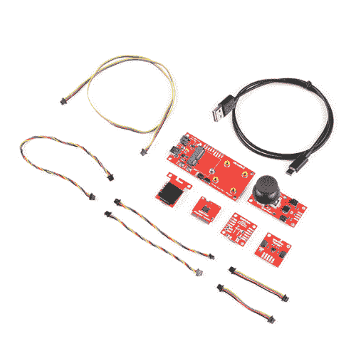
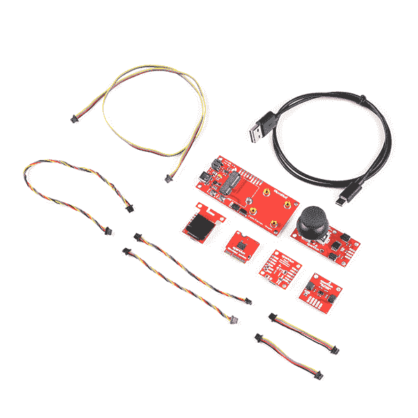
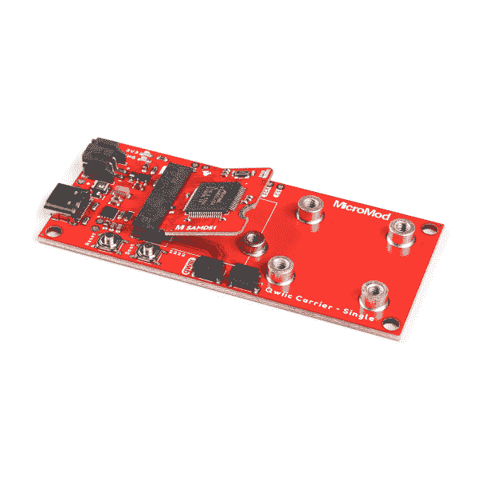
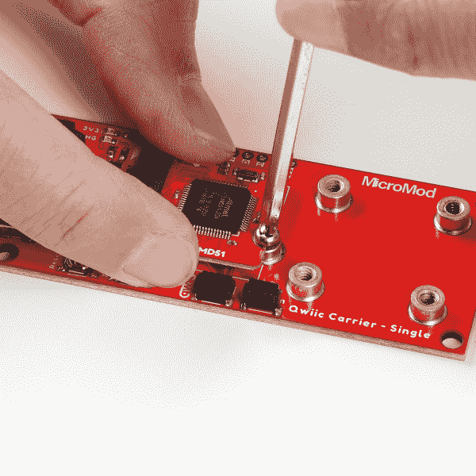
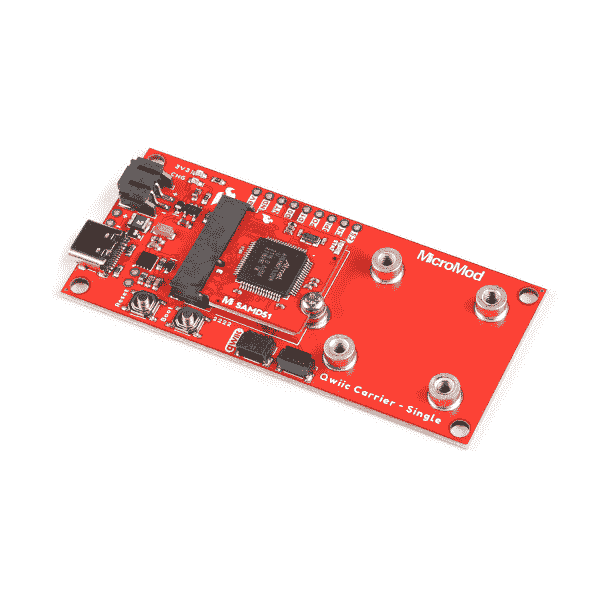
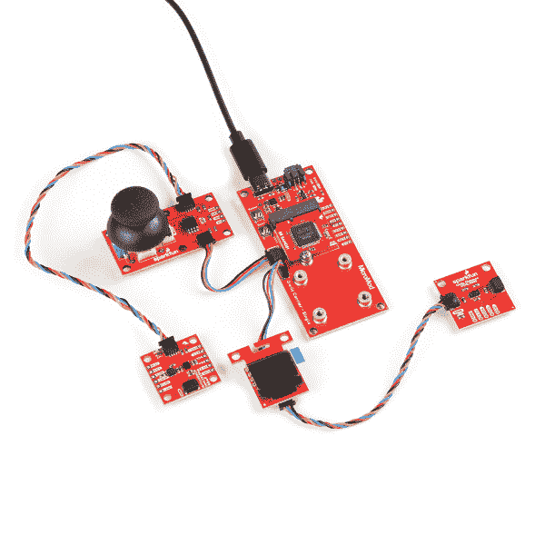
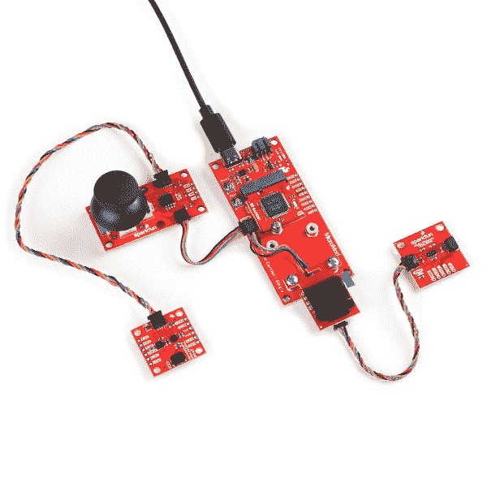
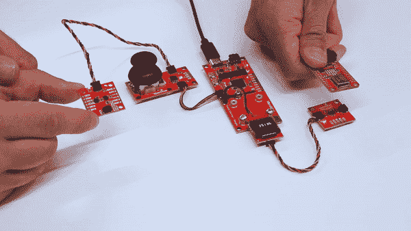

# MicroMod Qwiic Pro 套件项目指南

> 原文：<https://learn.sparkfun.com/tutorials/micromod-qwiic-pro-kit-project-guide>

## 介绍

**Note:** If you are looking for the previous version of this tutorial, head over to the [Qwiic Pro Kit Project Guide](https://learn.sparkfun.com/tutorials/qwiic-pro-kit-project-guide).

MicroMod Qwiic Pro 套件旨在允许用户在不需要焊接或试验板的情况下开始使用 Arduino。我们包括三个输入(操纵杆、加速度计和接近传感器)和一个显示器，可以通过菊花链连接到您的 Arduino。有了 MicroMod 和 Qwiic 生态系统，将一些输入和输出连接到 Arduino 从未如此容易！

 

将**添加到您的[购物车](https://www.sparkfun.com/cart)中！**

### [spark fun micro mod Qwiic Pro 套件](https://www.sparkfun.com/products/20407)

[30 available](https://learn.sparkfun.com/static/bubbles/ "30 available") KIT-20407

该套件为您提供了一个微型模块底座、两个传感器、一个操纵杆和一个有机发光二极管屏幕以及您需要的所有电缆…

$99.95[Favorited Favorite](# "Add to favorites") 1[Wish List](# "Add to wish list")** **### 推荐阅读

如果你不熟悉 MicroMod 生态系统，我们推荐你阅读这里的[来了解](https://www.sparkfun.com/micromod)的概况。如果你决定利用 Qwiic 连接器，我们推荐阅读[这里的概述](https://www.sparkfun.com/qwiic)。

|  |  |
| *[微模式生态系统](https://www.sparkfun.com/micromod)* | *[Qwiic 连接系统](https://www.sparkfun.com/qwiic)* |

我们也建议看一下下面的教程来设置 RedBoard Turbo，并感受一下每个 Qwiic 组件。

 [### Qwiic 载板连接指南

#### 2021 年 3 月 18 日](https://learn.sparkfun.com/tutorials/qwiic-carrier-board-hookup-guide) The Qwiic carrier board is the latest way to rapid prototype with the included M.2 socket to swap processor boards and Qwiic connectors to easily connect I2C devices.[Favorited Favorite](# "Add to favorites") 0 [### MicroMod SAMD51 处理器板连接指南

#### 2020 年 10 月 21 日](https://learn.sparkfun.com/tutorials/micromod-samd51-processor-board-hookup-guide) This tutorial covers the basic functionality of the MicroMod SAMD51 and highlights the features of the ARM Cortex-M4F development board.[Favorited Favorite](# "Add to favorites") 0 [### Qwiic 微型有机发光二极管连接指南](https://learn.sparkfun.com/tutorials/qwiic-micro-oled-hookup-guide) Get started displaying things with the Qwiic Micro OLED.[Favorited Favorite](# "Add to favorites") 7 [### Qwiic 操纵杆连接指南](https://learn.sparkfun.com/tutorials/qwiic-joystick-hookup-guide) Looking for an easy way to implement a joystick to your next Arduino or Raspberry Pi project? This hookup guide will walk you through using the Qwiic Joystick with the Arduino IDE on a RedBoard Qwiic and in Python on a Raspberry Pi.[Favorited Favorite](# "Add to favorites") 4 [### Qwiic 接近传感器(VCNL4040)连接指南](https://learn.sparkfun.com/tutorials/qwiic-proximity-sensor-vcnl4040-hookup-guide) The SparkFun Qwiic Proximity Sensor is a great, qualitative proximity (up to 20 cm) and light sensor. This hookup guide covers a few examples to retrieve basic sensor readings.[Favorited Favorite](# "Add to favorites") 2 [### Qwiic 9DoF - ISM330DHCX，MMC5983MA 连接指南](https://learn.sparkfun.com/tutorials/qwiic-9dof---ism330dhcx-mmc5983ma-hookup-guide) Find all your degrees of freedom with this little Qwiic breakout board combining the ISM330DHCX 6Dof and the MMC5983MA Magnetometer 1

## 套件内容

你可以在工具箱中找到以下零件。

*   1x [MicroMod Qwiic 载板-单个](https://www.sparkfun.com/products/17723)
*   1x [MicroMod SAMD51 处理器](https://www.sparkfun.com/products/16791)
*   1x [可逆 USB A 到 USB C 电缆- 0.8 米](https://www.sparkfun.com/products/15425)
*   1x [微型螺丝刀](https://www.sparkfun.com/products/19012)
*   输入
    *   1x [Qwiic 操纵杆](https://www.sparkfun.com/products/15168)
    *   1x [Qwiic 9DoF IMU 传感器](https://www.sparkfun.com/products/19895)
    *   1x [Qwiic 接近传感器(VCNL4040)](https://www.sparkfun.com/products/15177)
*   输出
    *   1x [Qwiic 微型有机发光二极管显示器](https://www.sparkfun.com/products/14532)
*   Qwiic 电缆
    *   2x[50 毫米](https://www.sparkfun.com/products/17260)
    *   2x[100 毫米](https://www.sparkfun.com/products/17259)
    *   1x[200 毫米](https://www.sparkfun.com/products/14428)
    *   1x [500mm](https://www.sparkfun.com/products/14429)
    *   1x [SparkFun 迷你螺丝刀](https://www.sparkfun.com/products/9146)

**Note:** Prior to MicroMod Qwiic Pro Kit was the Qwiic Pro Kit. Instead of the RedBoard Turbo with SAMD21 and USB micro-b cable , the MicroMod Qwiic Pro Kit includes the MicroMod SAMD51 Processor Board, Qwiic Carrier Board - Single, USB C Cable, and a MicroMod screwdriver. The Qwiic Triple Axis Accelerometer Breakout - MMA8452Q is also replaced by the 9DoF IMU Breakout - ISM330DHCX, MMC5983MA (Qwiic).

## 硬件连接

如果您还没有，请务必查看【MicroMod 入门:硬件连接以获取有关将处理器板插入载板的信息。 [MicroMod Qwiic 载板连接指南](https://learn.sparkfun.com/tutorials/qwiic-carrier-board-hookup-guide#hardware-assembly)也讲述了如何将电路板连接在一起！

 [### MicroMod 入门

#### 2020 年 10 月 21 日](https://learn.sparkfun.com/tutorials/getting-started-with-micromod) Dive into the world of MicroMod - a compact interface to connect a microcontroller to various peripherals via the M.2 Connector 3

拆下 MicroMod Qwiic 载板对面的螺丝-单个。然后将 MicroMod SAMD51 处理器板插入 M.2 插座。处理器板将以一定角度(大约 25°)竖起，如此处所示。

压住板子，用十字头拧紧螺丝。

一旦连接好，你的电路板应该被固定到 MicroMod Qwiic 载板上——如下图所示。

将您选择的 Qwiic 电缆插入每个板之间。你可以按你喜欢的任何方式把这些板用菊花链连接起来。然而，我们发现通过将 9DoF 的加速度计放在末端并连接更长的 Qwiic 电缆，可以更容易地控制 9 DOF 的加速度计。根据玩家的不同，你需要确定 9DoF 的加速度计相对于球拍的方向。垂直和水平 Qwiic 连接器也连接到同一个端口，因此您可以连接到任何一个端口。我们还发现，将带有 VCNL4040 的 Qwiic 距离传感器连接到另一端也更容易。然后连接你的电脑和 MicroMod Qwiic 载板之间的 USB 线-单。

**Warning!** You will need to connect all of the boards together when using the demo code in this tutorial. Otherwise, you will need to comment out lines of code for the Qwiic board that is not connected to the daisy chain.

### 将 Qwiic 板安装到支架上

您也可以将 Qwiic 微型有机发光二极管分线架安装到两个支架的末端，如下所示。取下覆盖安装孔的黄色胶带。将安装孔与支座对齐。在 Qwiic 微型有机发光二极管的安装孔之间插入一个 4-40 螺钉并拧紧。你将需要使用一些肘油脂驱动每个 4-40 螺丝到立场，因为他们稍微偏移。确保小心最靠近安装孔的 Qwiic 连接器。支座的高度和连接器的位置会使连接器推压 Qwiic 承载板的一端-单个。然而，这足以压住显示器。

我们建议不要安装 Qwiic 距离传感器、Qwiic 操纵杆和 Qwiic 9DoF，以便坐在对面的用户能够在不妨碍显示器的情况下控制他们的操纵杆。

[**Note:**](#redboard-qwiic) The code used in this tutorial is also compatible with Atmega328P-based Arduinos like the RedBoard Qwiic! If you purchased the components separately or Qwiic Ideation Kit, the setup is the same. Instead of the MicroMod SAMD51 Processor Board, you would be using the RedBoard Qwiic. Check the [note below for more information](https://learn.sparkfun.com/tutorials/qwiic-pro-kit-project-guide#atmega328p) when compiling for the Atmega328P-based microcontrollers! You can also swap out different MicroMod Processor Boards with Arduino Cores as well!

 

将**添加到您的[购物车](https://www.sparkfun.com/cart)中！**

### [spark fun RedBoard Qwiic](https://www.sparkfun.com/products/15123)

[In stock](https://learn.sparkfun.com/static/bubbles/ "in stock") DEV-15123

SparkFun RedBoard Qwiic 是一款 Arduino 兼容开发板，内置 Qwiic 连接器，无需…

$21.5014[Favorited Favorite](# "Add to favorites") 49[Wish List](# "Add to wish list")**** 

将**添加到您的[购物车](https://www.sparkfun.com/cart)中！**

### [SparkFun MicroMod Artemis 处理器](https://www.sparkfun.com/products/16401)

[24 available](https://learn.sparkfun.com/static/bubbles/ "24 available") DEV-16401

该处理器具有 Artemis 模块，能够进行机器学习、蓝牙、I2C、GPIO、PWM、SPI，并打包以适应…

$14.95[Favorited Favorite](# "Add to favorites") 14[Wish List](# "Add to wish list")**** ****## 安装主板插件和驱动程序

**Note:** This code/library has been written and tested on Arduino IDE version v1.8.12\. Otherwise, make sure you are using the latest stable version of the Arduino IDE on your desktop. If this is your first time using Arduino, please review our tutorial on [installing the Arduino IDE.](https://learn.sparkfun.com/tutorials/installing-arduino-ide)

在将代码上传到 MicroMod SAMD51 处理器板之前，需要安装一些插件。如果您还没有安装 SAMD51 和 SparkFun 板附件，请务必查看 MicroMod SAMD51 处理器板连接指南。

[Installing the SAMD and SparkFun Board Add-Ons](https://learn.sparkfun.com/tutorials/micromod-samd51-processor-board-hookup-guide/setting-up-the-arduino-ide)

### 司机

**Heads up!** Please be aware that the MicroMod SAMD51 Processor Board is **NOT currently supported on Windows 8** due to a lack of support drivers for those specific OS's.

由于有了 [UF2 引导程序](https://learn.sparkfun.com/tutorials/redboard-turbo-hookup-guide#uf2-bootloader)，MicroMod SAMD51 处理器板现在比以往任何时候都更容易编程。有了这个引导程序，MicroMod SAMD51 处理器板就可以作为 USB 存储设备**出现在你的电脑上，而无需安装 Windows 10、Mac 和 Linux 的驱动程序**！

## 安装库

**Note:** If you have not previously installed an Arduino library, please check out our [installation guide.](https://learn.sparkfun.com/tutorials/installing-an-arduino-library)

SparkFun 为 Qwiic 启用的操纵杆、9DoF IMU (ISM330DHCX，MMC5983MA)、接近传感器(VCNL4040)和 64x48 微型有机发光二极管编写了一个库。您可以通过 Arduino 库管理器获得这些库。搜索下列术语以自动安装每个库的最新版本。如果您在编译时遇到问题，您可能需要下载下面列出的相应库版本。

*   [SparkFun 操纵杆](https://github.com/sparkfun/SparkFun_Qwiic_Joystick_Arduino_Library) (v1.0.4)
*   [SparkFun 6DoF ISM330DHCX -加速度计和陀螺仪](https://github.com/sparkfun/SparkFun_6DoF_ISM330DHCX_Arduino_Library) (v1.0.0)
*   [SparkFun MMC5983MA 磁力计](https://github.com/sparkfun/SparkFun_MMC5983MA_Magnetometer_Arduino_Library)(版本 1.0.0)
*   【vcnl4040 的踢板 (v1.0.2)
*   [SparkFun 微型有机发光二极管](https://github.com/sparkfun/SparkFun_Micro_OLED_Arduino_Library) (v1.2.5)

如果您喜欢手动下载这些库，您可以从各自的 GitHub 库中获取它们。

[SparkFun Qwiic Joystick Arduino Library (ZIP)](https://github.com/sparkfun/SparkFun_Qwiic_Joystick_Arduino_Library/archive/master.zip)[SparkFun 6DoF ISM330DHCX - Accelerometer and Gyro Arduino Library (ZIP)](https://github.com/sparkfun/SparkFun_6DoF_ISM330DHCX_Arduino_Library/archive/refs/heads/main.zip)[SparkFun MMC5983MA - Magnetometer Arduino Library (ZIP)](https://github.com/sparkfun/SparkFun_MMC5983MA_Magnetometer_Arduino_Library/archive/refs/heads/main.zip)[SparkFun VCNL4040 Arduino Library (ZIP)](https://github.com/sparkfun/SparkFun_VCNL4040_Arduino_Library/archive/master.zip)[SparkFun Micro OLED Arduino Library (ZIP)](https://github.com/sparkfun/SparkFun_Micro_OLED_Arduino_Library/archive/master.zip)**Note:** The demo code currently just uses the accelerometer to control the paddle. We have linked the library in this section in case you use the magnetometer in case you decide to use it as well!

## 示例代码

我们建议从 GitHub 库获取代码。否则，您可以从下面的链接下载压缩文件。

[Download the MicroMod Qwiic Pro Kit Code (ZIP)](https://github.com/sparkfun/Qwiic-Pro-Kit-Code/archive/master.zip)

下载后解压文件，打开*micromodqwiicstarter example . ino*草图。它应该位于下载文件夹中，路径如下:**.../Firmware/Arduino/micromodqwiicstarter example/micromodqwiicstarter example . ino**。在 Arduino IDE 中打开代码，选择板卡(即 **SparkFun SAMD51 MicroMod** )，以及板卡枚举的 COM 端口。然后点击上传按钮。

和一个朋友一起，尝试沿着 x 轴来回摇动 9DoF，或者在接近传感器上方移动你的手来控制每个挡板。你也可以拿一个 PCB 或者平面的物体，如下图 GIF 所示，这样更容易控制。记住，你需要确定 9 自由度的加速度计相对于球拍的方向(如果你在 GIF 中注意到，玩家 1 让板子的方向与球拍的控制方向相反)。您需要调整微型有机发光二极管的方向，使桨位于玩家的 Qwiic 板一侧。只要球碰到球拍并弹到另一边，游戏就会继续。当一方未能将球弹回对方时，另一方将赢得一轮比赛。下一场比赛前会短暂显示当前比分。努力获得比对手更多的分数！

**Heads up!** As with any distance sensor, there is a minimum distance at which the sensor can detect an object accurately. If your hand or finger is too close to the sensor, the readings for the distance can jump to a higher value causing the paddle to move off the screen. Make sure to be within the range to successfully hit the ball or try adjusting the code to include a minimum and maximum range for the paddle.

默认代码使用 9DoF 的加速度计作为玩家 1，使用接近传感器作为玩家 2。尝试通过添加和删除单行注释来调整代码，以便为其中一个玩家使用游戏杆。操纵杆将沿着“垂直”y 轴控制桨。每个棋盘只能分配一名玩家。看看能否尝试从菊花链中移除未使用的 Qwiic 板，并注释掉相关板的每个实例。或者尝试调整代码，用磁力计和磁铁控制船桨！

## 解决纷争

**Not working as expected and need help?**

If you need technical assistance and more information on a product that is not working as you expected, we recommend heading on over to the [SparkFun Technical Assistance](https://www.sparkfun.com/technical_assistance) page for some initial troubleshooting.

[SparkFun Technical Assistance Page](https://www.sparkfun.com/technical_assistance)
If you don't find what you need there, the [SparkFun Forums](https://forum.sparkfun.com/index.php) are a great place to find and ask for help. If this is your first visit, you'll need to [create a Forum Account](https://forum.sparkfun.com/ucp.php?mode=register) to search product forums and post questions.

[Create New Forum Account](https://forum.sparkfun.com/ucp.php?mode=register)   [Log Into SparkFun Forums](https://forum.sparkfun.com/index.php)

## 资源和更进一步

现在你已经成功地安装并运行了你的 MicroMod Qwiic Pro 套件，你还会构建什么呢？有关更多信息，请查看以下资源:

*   Arduino 图书馆
    *   [踢腿操纵杆](https://github.com/sparkfun/SparkFun_Qwiic_Joystick_Arduino_Library)
    *   [SparkFun 6DoF ISM330DHCX -加速度计和陀螺仪](https://github.com/sparkfun/SparkFun_6DoF_ISM330DHCX_Arduino_Library)
    *   [SparkFun MMC5983MA 磁力计](https://github.com/sparkfun/SparkFun_MMC5983MA_Magnetometer_Arduino_Library)
    *   [SparkFun VCNL4040 -接近传感器](https://github.com/sparkfun/SparkFun_VCNL4040_Arduino_Library)
    *   [SparkFun 微型有机发光二极管](https://github.com/sparkfun/SparkFun_Micro_OLED_Arduino_Library)
*   [MicroMod Qwiic Pro 套件代码](https://github.com/sparkfun/Qwiic-Pro-Kit-Code)

你的下一个项目需要一些灵感吗？查看一些相关教程:

 [### Arduino 和光子连接指南的 Qwiic 屏蔽](https://learn.sparkfun.com/tutorials/qwiic-shield-for-arduino--photon-hookup-guide) Get started with our Qwiic ecosystem with the Qwiic shield for Arduino or Photon.[Favorited Favorite](# "Add to favorites") 5 [### Qwiic 微型有机发光二极管连接指南](https://learn.sparkfun.com/tutorials/qwiic-micro-oled-hookup-guide) Get started displaying things with the Qwiic Micro OLED.[Favorited Favorite](# "Add to favorites") 7 [### 使用 Qwiic 声音触发器和 u-blox ZED-F9x 进行声音定位](https://learn.sparkfun.com/tutorials/sound-location-with-the-qwiic-sound-trigger-and-the-u-blox-zed-f9x) [Favorited Favorite](# "Add to favorites") 2 [### 通过 LoRa 发送传感器数据](https://learn.sparkfun.com/tutorials/sending-sensor-data-over-lora) This tutorial will show you how setup a simple peer-to-peer connection to send and receive sensor data using LoRa.[Favorited Favorite](# "Add to favorites") 4******