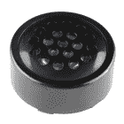

# Qwiic 扬声器放大器(TPA2016D2)连接指南

> 原文：<https://learn.sparkfun.com/tutorials/qwiic-speaker-amp-tpa2016d2-hookup-guide>

## 介绍

[SparkFun Qwiic 扬声器放大器](https://www.sparkfun.com/products/20690)包括德州仪器 TPA2016D2 立体声、无滤波器 D 类音频功率放大器。其高效的 D 类操作也意味着驱动 4 &欧姆时的低发热和长电池寿命；立体声高达 2.8W 的扬声器，8 &欧姆；立体声扬声器功率高达 1.7W。它不会震动体育场，但会为您的音频项目提供充足的音量。

[](https://www.sparkfun.com/products/20690) 

将**添加到您的[购物车](https://www.sparkfun.com/cart)中！**

 **### [SparkFun Qwiic 音箱功放](https://www.sparkfun.com/products/20690)

[Only 2 left!](https://learn.sparkfun.com/static/bubbles/ "only 2 left!") DEV-20690

SparkFun Qwiic 扬声器放大器包括德州仪器 TPA2016D2 类立体声音频放大器。

$10.95[Favorited Favorite](# "Add to favorites") 4[Wish List](# "Add to wish list")** **[https://www.youtube.com/embed/WfPM8q6Ed0Q/?autohide=1&border=0&wmode=opaque&enablejsapi=1](https://www.youtube.com/embed/WfPM8q6Ed0Q/?autohide=1&border=0&wmode=opaque&enablejsapi=1)

**Note:** The [LilyPad MP3 Trigger](https://www.sparkfun.com/products/11013) uses the same TPA2016D2 for the amplifier! The Qwiic Speaker Amp was based of the designs off the LilyPad MP3 Trigger by Mike Grusin. The amplifier was connected to the I²C pins on the Arduino microcontroller as well but the [Arduino example code only used basic settings](https://github.com/sparkfun/LilyPad_MP3_Player/blob/master/Arduino/LilyPad%20MP3%20Player/Examples/Trigger_I2C/Trigger_I2C.ino).

### 所需材料

要完成本教程，您至少需要以下材料。你可能不需要所有的东西，这取决于你拥有什么。将它添加到您的购物车，通读指南，并根据需要调整购物车。

### 最少零件

至少，您将需要一个电缆和差分扬声器与 Qwiic 扬声器放大器。你还需要一个电源和一些电线。这是假设您有一个带 TRS 音频输出的媒体播放器(即智能手机、电脑或便携式数字播放器),并且扬声器有电线连接到终端。

[](https://www.sparkfun.com/products/15312) 

将**添加到您的[购物车](https://www.sparkfun.com/cart)中！**

 **### [【墙上适配器电源- 5VDC，2A(桶形插孔)](https://www.sparkfun.com/products/15312)

[In stock](https://learn.sparkfun.com/static/bubbles/ "in stock") TOL-15312

这是一个高品质的开关“壁式电源”交流到 DC 5V 2000 毫安桶形插座壁式电源，专为…

$6.502[Favorited Favorite](# "Add to favorites") 13[Wish List](# "Add to wish list")****[](https://www.sparkfun.com/products/20690) 

将**添加到您的[购物车](https://www.sparkfun.com/cart)中！**

 **### [SparkFun Qwiic 音箱功放](https://www.sparkfun.com/products/20690)

[Only 2 left!](https://learn.sparkfun.com/static/bubbles/ "only 2 left!") DEV-20690

SparkFun Qwiic 扬声器放大器包括德州仪器 TPA2016D2 类立体声音频放大器。

$10.95[Favorited Favorite](# "Add to favorites") 4[Wish List](# "Add to wish list")****[](https://www.sparkfun.com/products/10288) 

将**添加到您的[购物车](https://www.sparkfun.com/cart)中！**

 **### [DC 筒式千斤顶适配器——母](https://www.sparkfun.com/products/10288)

[In stock](https://learn.sparkfun.com/static/bubbles/ "in stock") PRT-10288

此适配器允许您将筒式插孔连接器连接到裸线。一端有螺丝端子，另一端有一个 5.5…

$3.501[Favorited Favorite](# "Add to favorites") 24[Wish List](# "Add to wish list")****[](https://www.sparkfun.com/products/15350) 

将**添加到您的[购物车](https://www.sparkfun.com/cart)中！**

 **### [薄音箱- 0.5W](https://www.sparkfun.com/products/15350)

[In stock](https://learn.sparkfun.com/static/bubbles/ "in stock") COM-15350

这个 0.5W，8 欧姆的扬声器直径只有 40 毫米，厚度只有 4 毫米多一点，就像你在那些“talki…

$1.05[Favorited Favorite](# "Add to favorites") 12[Wish List](# "Add to wish list")****[](https://www.sparkfun.com/products/18983) 

将**添加到您的[购物车](https://www.sparkfun.com/cart)中！**

 **### [音频线 TRS-1m](https://www.sparkfun.com/products/18983)

[In stock](https://learn.sparkfun.com/static/bubbles/ "in stock") CAB-18983

这种电缆两端都有一个标准的 TRS 3.5 毫米插头，可以轻松连接到任何 3.5 毫米插孔。

$1.95[Favorited Favorite](# "Add to favorites") 0[Wish List](# "Add to wish list")****[](https://www.sparkfun.com/products/16662) 

将**添加到您的[购物车](https://www.sparkfun.com/cart)中！**

 **### [跳线高级 6in。M/M - 2 包(红色和黑色)](https://www.sparkfun.com/products/16662)

[In stock](https://learn.sparkfun.com/static/bubbles/ "in stock") PRT-16662

这些红色和黑色跳线可以用于几乎所有东西，包括试验板、Arduinos 和任何 0.1 英寸的间距…

$1.05[Favorited Favorite](# "Add to favorites") 1[Wish List](# "Add to wish list")**************************Note:** Click below for a wishlist of the minimum parts.

[Qwiic Speaker Amp Minimum Parts Wishlist](https://www.sparkfun.com/wish_lists/169349)

### 使用 Arduino 连接

对于想要用 Arduino 库配置 TPA2016D2 的用户，您将需要一个 Arduino 微控制器。我们将在 ATmega328P 上使用 RedBoard Plus。如果您决定使用立体声输出，请务必在购物车中添加两个扬声器。

[](https://www.sparkfun.com/products/18158) 

将**添加到您的[购物车](https://www.sparkfun.com/cart)中！**

 **### [SparkFun RedBoard 加](https://www.sparkfun.com/products/18158)

[In stock](https://learn.sparkfun.com/static/bubbles/ "in stock") DEV-18158

RedBoard Plus 是一款兼容 Arduino 的开发板，拥有 Arduino Uno 所需的一切，并具有额外的额外功能…

$21.504[Favorited Favorite](# "Add to favorites") 12[Wish List](# "Add to wish list")****[](https://www.sparkfun.com/products/15312) 

将**添加到您的[购物车](https://www.sparkfun.com/cart)中！**

 **### [【墙上适配器电源- 5VDC，2A(桶形插孔)](https://www.sparkfun.com/products/15312)

[In stock](https://learn.sparkfun.com/static/bubbles/ "in stock") TOL-15312

这是一个高品质的开关“壁式电源”交流到 DC 5V 2000 毫安桶形插座壁式电源，专为…

$6.502[Favorited Favorite](# "Add to favorites") 13[Wish List](# "Add to wish list")****[](https://www.sparkfun.com/products/20690) 

将**添加到您的[购物车](https://www.sparkfun.com/cart)中！**

 **### [SparkFun Qwiic 音箱功放](https://www.sparkfun.com/products/20690)

[Only 2 left!](https://learn.sparkfun.com/static/bubbles/ "only 2 left!") DEV-20690

SparkFun Qwiic 扬声器放大器包括德州仪器 TPA2016D2 类立体声音频放大器。

$10.95[Favorited Favorite](# "Add to favorites") 4[Wish List](# "Add to wish list")****[](https://www.sparkfun.com/products/15424) 

将**添加到您的[购物车](https://www.sparkfun.com/cart)中！**

 **### [可逆 USB A 转 C 线- 2m](https://www.sparkfun.com/products/15424)

[18 available](https://learn.sparkfun.com/static/bubbles/ "18 available") CAB-15424

这些 2 米长的电缆稍加修改后，就可以插入其端口，而不用考虑其在 U…

$8.951[Favorited Favorite](# "Add to favorites") 4[Wish List](# "Add to wish list")****[](https://www.sparkfun.com/products/14428) 

### [Qwiic 线缆- 200mm](https://www.sparkfun.com/products/14428)

[Out of stock](https://learn.sparkfun.com/static/bubbles/ "out of stock") PRT-14428

这是一根 200 毫米长的 4 芯电缆，带有 1 毫米 JST 端接。它旨在将支持 Qwiic 的组件连接在一起…

[Favorited Favorite](# "Add to favorites") 21[Wish List](# "Add to wish list")[](https://www.sparkfun.com/products/10288) 

将**添加到您的[购物车](https://www.sparkfun.com/cart)中！**

 **### [DC 筒式千斤顶适配器——母](https://www.sparkfun.com/products/10288)

[In stock](https://learn.sparkfun.com/static/bubbles/ "in stock") PRT-10288

此适配器允许您将筒式插孔连接器连接到裸线。一端有螺丝端子，另一端有一个 5.5…

$3.501[Favorited Favorite](# "Add to favorites") 24[Wish List](# "Add to wish list")****[](https://www.sparkfun.com/products/15350) 

将**添加到您的[购物车](https://www.sparkfun.com/cart)中！**

 **### [薄音箱- 0.5W](https://www.sparkfun.com/products/15350)

[In stock](https://learn.sparkfun.com/static/bubbles/ "in stock") COM-15350

这个 0.5W，8 欧姆的扬声器直径只有 40 毫米，厚度只有 4 毫米多一点，就像你在那些“talki…

$1.05[Favorited Favorite](# "Add to favorites") 12[Wish List](# "Add to wish list")****[](https://www.sparkfun.com/products/18983) 

将**添加到您的[购物车](https://www.sparkfun.com/cart)中！**

 **### [音频线 TRS-1m](https://www.sparkfun.com/products/18983)

[In stock](https://learn.sparkfun.com/static/bubbles/ "in stock") CAB-18983

这种电缆两端都有一个标准的 TRS 3.5 毫米插头，可以轻松连接到任何 3.5 毫米插孔。

$1.95[Favorited Favorite](# "Add to favorites") 0[Wish List](# "Add to wish list")****[](https://www.sparkfun.com/products/16662) 

将**添加到您的[购物车](https://www.sparkfun.com/cart)中！**

 **### [跳线高级 6in。M/M - 2 包(红色和黑色)](https://www.sparkfun.com/products/16662)

[In stock](https://learn.sparkfun.com/static/bubbles/ "in stock") PRT-16662

这些红色和黑色跳线可以用于几乎所有东西，包括试验板、Arduinos 和任何 0.1 英寸的间距…

$1.05[Favorited Favorite](# "Add to favorites") 1[Wish List](# "Add to wish list")******************************Note:** Click below for a wishlist when connecting an Arduino.

[Qwiic Speaker Amp and Arduino Parts Wishlist](https://www.sparkfun.com/wish_lists/169350)**Note:** Click below for the kit with the minimum parts to control the Qwiic Speaker Amp with an Artemis Nano. When using the Artemis Nano, make sure to [install the appropriate board definitions and select the correct board when uploading code](https://learn.sparkfun.com/tutorials/installing-board-definitions-in-the-arduino-ide).

[](https://www.sparkfun.com/products/21230) 

将**添加到您的[购物车](https://www.sparkfun.com/cart)中！**

 **### [SparkFun Qwiic 音箱套装](https://www.sparkfun.com/products/21230)

[30 available](https://learn.sparkfun.com/static/bubbles/ "30 available") KIT-21230

SparkFun Qwiic 扬声器套件通过一个简单的 Qwiic 接口为您提供开始使用立体声音响所需的一切

$39.95[Favorited Favorite](# "Add to favorites") 2[Wish List](# "Add to wish list")** **### 配件

有许多方法可以连接到 Qwiic 扬声器放大器。以下是一些你可以使用的配件。

#### 扬声器

下面是目录中的一些[扬声器，您可以将其用作输出。您可能希望选择如下所列的差动扬声器(不要被压电蜂鸣器所迷惑)。请注意，某些扬声器在某些频率下可能比其他扬声器表现更好，而其他扬声器则在某个频率范围内工作。选择扬声器时，请务必查看扬声器的数据表。](https://www.sparkfun.com/categories/344)

[](https://www.sparkfun.com/products/15350) 

将**添加到您的[购物车](https://www.sparkfun.com/cart)中！**

 **### [薄音箱- 0.5W](https://www.sparkfun.com/products/15350)

[In stock](https://learn.sparkfun.com/static/bubbles/ "in stock") COM-15350

这个 0.5W，8 欧姆的扬声器直径只有 40 毫米，厚度只有 4 毫米多一点，就像你在那些“talki…

$1.05[Favorited Favorite](# "Add to favorites") 12[Wish List](# "Add to wish list")****[](https://www.sparkfun.com/products/20660) 

将**添加到您的[购物车](https://www.sparkfun.com/cart)中！**

 **### [通孔扬声器](https://www.sparkfun.com/products/20660)

[In stock](https://learn.sparkfun.com/static/bubbles/ "in stock") PRT-20660

这是一个小的 15 毫米圆形扬声器，工作在可听的 2 千赫范围内。

$2.95[Favorited Favorite](# "Add to favorites") 1[Wish List](# "Add to wish list")****[](https://www.sparkfun.com/products/11089) 

将**添加到您的[购物车](https://www.sparkfun.com/cart)中！**

 **### [扬声器- PCB 安装](https://www.sparkfun.com/products/11089)

[In stock](https://learn.sparkfun.com/static/bubbles/ "in stock") COM-11089

这款通孔扬声器非常适合那些你需要比压电蜂鸣器更好的声音，但又不需要麦克风的项目

$2.103[Favorited Favorite](# "Add to favorites") 26[Wish List](# "Add to wish list")****[](https://www.sparkfun.com/products/9151) 

将**添加到您的[购物车](https://www.sparkfun.com/cart)中！**

 **### [扬声器- 0.5W (8 欧姆)](https://www.sparkfun.com/products/9151)

[In stock](https://learn.sparkfun.com/static/bubbles/ "in stock") COM-09151

一款小型音频扬声器，非常适合无线电和放大器项目，并且小到足以适合机器人项目。

$2.45[Favorited Favorite](# "Add to favorites") 29[Wish List](# "Add to wish list")******** ********请注意，有些扬声器的额定功率可能更高(超过 Qwiic 扬声器放大器的输出功率)。瓦数更高的扬声器仍然可以播放声音，但不会完全通电。

[](https://www.sparkfun.com/products/18379) 

将**添加到您的[购物车](https://www.sparkfun.com/cart)中！**

 **### [宽频率范围扬声器- 3in。(聚丙烯锥)](https://www.sparkfun.com/products/18379)

[In stock](https://learn.sparkfun.com/static/bubbles/ "in stock") COM-18379

这款扬声器是要求高保真音乐或高清晰度语音/通讯的小型应用的绝佳选择

$11.95[Favorited Favorite](# "Add to favorites") 2[Wish List](# "Add to wish list")****[](https://www.sparkfun.com/products/19102) 

将**添加到您的[购物车](https://www.sparkfun.com/cart)中！**

 **### [表面换能器——大型](https://www.sparkfun.com/products/19102)

[In stock](https://learn.sparkfun.com/static/bubbles/ "in stock") COM-19102

表面传感器给你强大的力量，几乎可以把任何表面变成扬声器。

$24.95[Favorited Favorite](# "Add to favorites") 3[Wish List](# "Add to wish list")**** ****#### 连接器、电线和电缆

对于通过媒体播放器连接的用户，您需要一根 TRS 电缆。用户也可以自己制作，用 TRS 音频插头连接。

[](https://www.sparkfun.com/products/18983) 

将**添加到您的[购物车](https://www.sparkfun.com/cart)中！**

 **### [音频线 TRS-1m](https://www.sparkfun.com/products/18983)

[In stock](https://learn.sparkfun.com/static/bubbles/ "in stock") CAB-18983

这种电缆两端都有一个标准的 TRS 3.5 毫米插头，可以轻松连接到任何 3.5 毫米插孔。

$1.95[Favorited Favorite](# "Add to favorites") 0[Wish List](# "Add to wish list")****[](https://www.sparkfun.com/products/retired/15438) 

### [TRS 音频插头- 3.5mm(金属)](https://www.sparkfun.com/products/retired/15438)

[Retired](https://learn.sparkfun.com/static/bubbles/ "Retired") COM-15438

插头(两个导体和一个接地)和护罩，以黑客或维修或添加一个三导体音频插孔到您的项目。

1 **Retired**[Favorited Favorite](# "Add to favorites") 4[Wish List](# "Add to wish list")** **根据连接情况，您可能需要电源、音频输入和/或扬声器输出跳线。下面是一些来自目录的[电线。请注意，其他电线可能太粗，可能不适合螺丝端子。如果扬声器上的端子足够大，你也可以使用 spade quick disconnects。](https://www.sparkfun.com/categories/141)

[](https://www.sparkfun.com/products/13191) 

将**添加到您的[购物车](https://www.sparkfun.com/cart)中！**

 **### [【带辫子的鳄鱼夹(4 个装)](https://www.sparkfun.com/products/13191)

[In stock](https://learn.sparkfun.com/static/bubbles/ "in stock") CAB-13191

这是一个 4 包电线，预先终止于一端的鳄鱼夹和另一端的连接尾纤。阿利加…

$3.50[Favorited Favorite](# "Add to favorites") 21[Wish List](# "Add to wish list")****[](https://www.sparkfun.com/products/18382) 

将**添加到您的[购物车](https://www.sparkfun.com/cart)中！**

 **### [](https://www.sparkfun.com/products/18382)

[In stock](https://learn.sparkfun.com/static/bubbles/ "in stock") PRT-18382

非常适合项目间的一般连接(低电流或高电流应用)。

$5.95[Favorited Favorite](# "Add to favorites") 0[Wish List](# "Add to wish list")****[](https://www.sparkfun.com/products/8867) 

将**添加到您的[购物车](https://www.sparkfun.com/cart)中！**

 **### [](https://www.sparkfun.com/products/8867)

[Out of stock](https://learn.sparkfun.com/static/bubbles/ "out of stock") PRT-08867

标准 22 AWG 黑色绞合线。使用这种焊丝或任何项目中，你需要灵活的电线。搁浅的电线…

$3.50[Favorited Favorite](# "Add to favorites") 6[Wish List](# "Add to wish list")****[](https://www.sparkfun.com/products/8865) 

将**添加到您的[购物车](https://www.sparkfun.com/cart)中！**

 **### [【挂钩绞线-红色(22 AWG)](https://www.sparkfun.com/products/8865)

[In stock](https://learn.sparkfun.com/static/bubbles/ "in stock") PRT-08865

标准 22 AWG 红色绞合线。使用这种焊丝或任何项目中，你需要灵活的电线。有小号的…

$3.50[Favorited Favorite](# "Add to favorites") 5[Wish List](# "Add to wish list")****[](https://www.sparkfun.com/products/16662) 

将**添加到您的[购物车](https://www.sparkfun.com/cart)中！**

 **### [跳线高级 6in。M/M - 2 包(红色和黑色)](https://www.sparkfun.com/products/16662)

[In stock](https://learn.sparkfun.com/static/bubbles/ "in stock") PRT-16662

这些红色和黑色跳线可以用于几乎所有东西，包括试验板、Arduinos 和任何 0.1 英寸的间距…

$1.05[Favorited Favorite](# "Add to favorites") 1[Wish List](# "Add to wish list")****[](https://www.sparkfun.com/products/14166) 

将**添加到您的[购物车](https://www.sparkfun.com/cart)中！**

 **### [【铲形连接器线-3 英尺，母(2 个装)](https://www.sparkfun.com/products/14166)

[In stock](https://learn.sparkfun.com/static/bubbles/ "in stock") CAB-14166

这些简单的 24AWG 电线的一端是一个绝缘的凹形扁平连接器，另一端是一根编织线导线

$2.10[Favorited Favorite](# "Add to favorites") 1[Wish List](# "Add to wish list")****[](https://www.sparkfun.com/products/14407) 

将**添加到您的[购物车](https://www.sparkfun.com/cart)中！**

 **### [【快速接头-母 1/4”(5 件装)](https://www.sparkfun.com/products/14407)

[In stock](https://learn.sparkfun.com/static/bubbles/ "in stock") PRT-14407

有时被称为“铲形连接器”，这些快速断开装置作为电源连接器在原型或…

$0.95 $0.24[Favorited Favorite](# "Add to favorites") 3[Wish List](# "Add to wish list")************** ************对于那些想利用支持 qw IC 的设备的人来说，你会想要一根 qw IC 电缆。

[](https://www.sparkfun.com/products/15081) 

将**添加到您的[购物车](https://www.sparkfun.com/cart)中！**

 **### [SparkFun Qwiic 线缆套件](https://www.sparkfun.com/products/15081)

[In stock](https://learn.sparkfun.com/static/bubbles/ "in stock") KIT-15081

为了更容易上手，我们用 50 毫米到 500 毫米的各种 Qwiic 电缆组装了 Qwiic 电缆套件…

$8.9516[Favorited Favorite](# "Add to favorites") 58[Wish List](# "Add to wish list")****[](https://www.sparkfun.com/products/14427) 

将**添加到您的[购物车](https://www.sparkfun.com/cart)中！**

 **### [Qwiic 线缆- 100mm](https://www.sparkfun.com/products/14427)

[In stock](https://learn.sparkfun.com/static/bubbles/ "in stock") PRT-14427

这是一条 100 毫米长的 4 芯电缆，带有 1 毫米 JST 端接。它旨在将支持 Qwiic 的组件连接在一起…

$1.50[Favorited Favorite](# "Add to favorites") 32[Wish List](# "Add to wish list")****[](https://www.sparkfun.com/products/14429) 

将**添加到您的[购物车](https://www.sparkfun.com/cart)中！**

 **### [Qwiic 线缆- 500mm](https://www.sparkfun.com/products/14429)

[In stock](https://learn.sparkfun.com/static/bubbles/ "in stock") PRT-14429

这是一根 500mm 长的 4 芯电缆，带有 1mm JST 端接。它旨在将支持 Qwiic 的组件连接在一起…

$1.951[Favorited Favorite](# "Add to favorites") 25[Wish List](# "Add to wish list")****[](https://www.sparkfun.com/products/14425) 

将**添加到您的[购物车](https://www.sparkfun.com/cart)中！**

 **### [Qwiic 电缆-试验板跳线(4 针)](https://www.sparkfun.com/products/14425)

[In stock](https://learn.sparkfun.com/static/bubbles/ "in stock") PRT-14425

这是一根跳线适配器电缆，一端带有一个 Qwiic JST 母接头，另一端带有一个试验板连接…

$1.50[Favorited Favorite](# "Add to favorites") 34[Wish List](# "Add to wish list")******** ********#### 力量

要为评估板供电，可以为 Qwiic 音频放大器使用单独的电源。对于安装，您可以使用 5V 壁式电源适配器和筒式插孔适配器。对于便携式应用，您可以使用 LiPo 电池和升压转换器实现恒定电压输入。

[](https://www.sparkfun.com/products/14411) 

将**添加到您的[购物车](https://www.sparkfun.com/cart)中！**

 **### [SparkFun LiPo 充电器/升压器- 5V/1A](https://www.sparkfun.com/products/14411)

[In stock](https://learn.sparkfun.com/static/bubbles/ "in stock") PRT-14411

SparkFun 5V/1A 脂肪充电器/升压器是一个从 5V 的锂聚合物电池产生一安培的可靠电路。…

$17.501[Favorited Favorite](# "Add to favorites") 32[Wish List](# "Add to wish list")****[](https://www.sparkfun.com/products/18286) 

将**添加到您的[购物车](https://www.sparkfun.com/cart)中！**

 **### [锂离子电池-1250 mah(T2 认证)](https://www.sparkfun.com/products/18286)

[In stock](https://learn.sparkfun.com/static/bubbles/ "in stock") PRT-18286

基于锂离子化学的超薄超轻电池。每个电池在 1250 毫安时输出 3.7V 的标称电压，即…

$10.951[Favorited Favorite](# "Add to favorites") 8[Wish List](# "Add to wish list")****[](https://www.sparkfun.com/products/15312) 

将**添加到您的[购物车](https://www.sparkfun.com/cart)中！**

 **### [【墙上适配器电源- 5VDC，2A(桶形插孔)](https://www.sparkfun.com/products/15312)

[In stock](https://learn.sparkfun.com/static/bubbles/ "in stock") TOL-15312

这是一个高品质的开关“壁式电源”交流到 DC 5V 2000 毫安桶形插座壁式电源，专为…

$6.502[Favorited Favorite](# "Add to favorites") 13[Wish List](# "Add to wish list")****[](https://www.sparkfun.com/products/10288) 

将**添加到您的[购物车](https://www.sparkfun.com/cart)中！**

 **### [DC 筒式千斤顶适配器——母](https://www.sparkfun.com/products/10288)

[In stock](https://learn.sparkfun.com/static/bubbles/ "in stock") PRT-10288

此适配器允许您将筒式插孔连接器连接到裸线。一端有螺丝端子，另一端有一个 5.5…

$3.501[Favorited Favorite](# "Add to favorites") 24[Wish List](# "Add to wish list")******** ********### 工具

为了固定螺丝端子中的电线，您需要一套袖珍螺丝刀。请注意，一些[螺丝刀平头可能太大](https://www.sparkfun.com/products/9146)而无法拧入螺钉。袖珍螺丝刀套件包括一个螺丝刀头，它与焊接在 Qwiic 扬声器放大器上的螺钉端子兼容。还有另一个驱动位，您也可以使用它将电线固定到筒式插孔适配器上。

[](https://www.sparkfun.com/products/12891) 

将**添加到您的[购物车](https://www.sparkfun.com/cart)中！**

 **### [袖珍螺丝刀套装](https://www.sparkfun.com/products/12891)

[In stock](https://learn.sparkfun.com/static/bubbles/ "in stock") TOL-12891

每个黑客都应该拥有什么？没错，一把螺丝刀(你必须以某种方式进入那些箱子)。什么…

$4.505[Favorited Favorite](# "Add to favorites") 24[Wish List](# "Add to wish list")** **将电线焊接到扬声器或修改跳线时，您可能需要烙铁、焊料和[通用焊接附件](https://www.sparkfun.com/categories/49)。

[](https://www.sparkfun.com/products/14456) 

将**添加到您的[购物车](https://www.sparkfun.com/cart)中！**

 **### [【烙铁- 60W(可调温度)](https://www.sparkfun.com/products/14456)

[In stock](https://learn.sparkfun.com/static/bubbles/ "in stock") TOL-14456

当你不想倾家荡产，但又需要一个可靠的烙铁时，这个可调节温度的烙铁是一个很好的工具…

$16.5016[Favorited Favorite](# "Add to favorites") 43[Wish List](# "Add to wish list")****[](https://www.sparkfun.com/products/9163) 

将**添加到您的[购物车](https://www.sparkfun.com/cart)中！**

 **### [无铅焊料- 15 克管](https://www.sparkfun.com/products/9163)

[In stock](https://learn.sparkfun.com/static/bubbles/ "in stock") TOL-09163

这是你的无铅焊料的基本管，带有不干净的水溶性树脂芯。0.031 英寸规格，15 克

$3.954[Favorited Favorite](# "Add to favorites") 14[Wish List](# "Add to wish list")****[](https://www.sparkfun.com/products/15220) 

将**添加到您的[购物车](https://www.sparkfun.com/cart)中！**

 **### [剥线钳- 20-30AWG](https://www.sparkfun.com/products/15220)

[In stock](https://learn.sparkfun.com/static/bubbles/ "in stock") TOL-15220

这些是 Jonard Industries 的高级剥线钳，具有舒适的弯曲手柄，是一种经济实惠的选择…

$11.951[Favorited Favorite](# "Add to favorites") 8[Wish List](# "Add to wish list")****[](https://www.sparkfun.com/products/9200) 

将**添加到您的[购物车](https://www.sparkfun.com/cart)中！**

 **### [爱好刀](https://www.sparkfun.com/products/9200)

[In stock](https://learn.sparkfun.com/static/bubbles/ "in stock") TOL-09200

就像一把 Xacto 刀，只是更好。我们在处理多氯联苯时广泛使用这些技术。这些小刀子很适合切割…

$3.502[Favorited Favorite](# "Add to favorites") 18[Wish List](# "Add to wish list")******************Bundled Kits!** Check out the following tool kits with some of the soldering irons and accessories listed earlier!

[](https://www.sparkfun.com/products/11805) 

将**添加到您的[购物车](https://www.sparkfun.com/cart)中！**

 **### [SparkFun 豪华工具包](https://www.sparkfun.com/products/11805)

[Only 4 left!](https://learn.sparkfun.com/static/bubbles/ "only 4 left!") TOL-11805

这些工具非常适合那些有工具使用经验但需要一套新零件的人…

$246.50[Favorited Favorite](# "Add to favorites") 21[Wish List](# "Add to wish list")****[](https://www.sparkfun.com/products/14681) 

将**添加到您的[购物车](https://www.sparkfun.com/cart)中！**

 **### [SparkFun 初学者工具包](https://www.sparkfun.com/products/14681)

[Out of stock](https://learn.sparkfun.com/static/bubbles/ "out of stock") TOL-14681

这些工具非常适合那些需要一套坚实的工具来启动工作台的人！

$62.50[Favorited Favorite](# "Add to favorites") 14[Wish List](# "Add to wish list")**** ****### 推荐阅读

如果您不熟悉 Qwiic 系统，我们建议您阅读此处的[以了解概述](https://www.sparkfun.com/qwiic)，如果您决定利用 Qwiic 连接器。

| [](https://www.sparkfun.com/qwiic) |
| *[Qwiic 连接系统](https://www.sparkfun.com/qwiic)* |

如果你不熟悉下面的教程，我们也建议你看一看。

[](https://learn.sparkfun.com/tutorials/how-to-power-a-project) [### 如何为项目提供动力](https://learn.sparkfun.com/tutorials/how-to-power-a-project) A tutorial to help figure out the power requirements of your project.[Favorited Favorite](# "Add to favorites") 67[](https://learn.sparkfun.com/tutorials/working-with-wire) [### 使用导线](https://learn.sparkfun.com/tutorials/working-with-wire) How to strip, crimp, and work with wire.[Favorited Favorite](# "Add to favorites") 50[](https://learn.sparkfun.com/tutorials/i2c) [### I2C](https://learn.sparkfun.com/tutorials/i2c) An introduction to I2C, one of the main embedded communications protocols in use today.[Favorited Favorite](# "Add to favorites") 128[](https://learn.sparkfun.com/tutorials/redboard-plus-hookup-guide) [### RedBoard Plus 连接指南](https://learn.sparkfun.com/tutorials/redboard-plus-hookup-guide) This tutorial covers the basic functionality of the RedBoard Plus. This tutorial also covers how to get started blinking an LED and using the Qwiic system.[Favorited Favorite](# "Add to favorites") 2

## 硬件概述

在本节中，我们将重点介绍 Qwiic 扬声器放大器(TPA2016D2)上的硬件和引脚。欲了解有关放大器的更多信息，请查看我们的[资源和进一步的](https://learn.sparkfun.com/tutorials/qwiic-speaker-amp-tpa2016d2-hookup-guide#resources-and-going-further)。

[](https://cdn.sparkfun.com/assets/learn_tutorials/2/7/4/9/20690_SparkFun_Qwiic_Speaker_Amp-TPA2016D2_IC.jpg)

### 放大器到放大器(几个 SparkFun 音频放大器的比较)

这款音频放大器与其他音频放大器的区别在于，它具有音量控制(即增益)、动态范围压缩(DRC)、自动增益控制(AGC)、启用/禁用放大器以及通过 I ² C 通过软件进行配置的能力。其高效的 D 类操作也意味着在驱动 4 & ohm 时热量低、电池寿命长；立体声扬声器高达 2.8W，8 &欧姆；立体声扬声器功率高达 1.7W。这比[单声道放大器(TPA2005D1)](https://www.sparkfun.com/products/11044) 或[嘈杂的蟋蟀立体声放大器(LM4853)](https://www.sparkfun.com/products/14475) 的功率要大得多。它不会震动体育场，但会为您的音频项目提供充足的音量。

| [, release date September 2022")](https://www.sparkfun.com/products/20690) | [, SparkFun release date April 2018")](https://www.sparkfun.com/products/14475) | [, SparkFun release date March 2012")](https://www.sparkfun.com/products/11044) |
| *Qwiic 扬声器放大器
(TPA 2016d 2)
[[DEV-20690](https://www.sparkfun.com/products/20690)]* | *嘈杂的蟋蟀立体声放大器
(lm 4853)
[[DEV-14475](https://www.sparkfun.com/products/14475)]* | *单声道放大器
(TPA 2005d 1)
[鲍勃-11044](https://www.sparkfun.com/products/11044)* |

与其他音频放大器相比，DRC 和 AGC 是独一无二的。这是一个强大的功能，可让您“均衡”音频输入中的大声部分和安静部分。它还允许您最大限度地提高扬声器的音量。通过微调设置，您可以获得最大音量以防止音频信号失真。单独使用 DRC、AGC 和/或限幅器可以保护您的扬声器免受过大音量播放的损坏。我们已经编写了一个丰富的 Arduino 库(在本教程的后面显示),允许您轻松控制放大器的所有功能，从简单的增益控制到高级 AGC。请注意，您需要在每次电源循环时将配置发送到 TPA2016D2。

### 力量

有两种方式为电路板供电:

*   螺丝接线端
*   Qwiic 电缆

⚡ **Danger:** Make sure to only apply power through either the screw terminal or Qwiic cable. You can damage Qwiic-enabled boards that are daisy chained to the Qwiic Speaker Amp if there is a solder jumper on JP1 and you apply power to VIN.

#### 电源螺丝端子

Qwiic 扬声器放大器要求输入电压在 **2.5V** 和 **5.5V** 之间。你可以通过标有 **VIN** 和 **GND** 的两个销钉螺丝端子插入电线。使用更接近建议输入电压的较高电压将更好地驱动扬声器，并提供更大的声音。

[](https://cdn.sparkfun.com/assets/learn_tutorials/2/7/4/9/20690_SparkFun_Qwiic_Speaker_Amp-TPA2016D2_Speaker_Power_Pins.jpg)

#### 电源 Qwiic 电缆

您也可以通过 Qwiic 连接器供电。这将为放大器提供 3.3V 电压。只需在开发板和 qw IC 扬声器放大器之间插入一根 qw IC 电缆。

[](https://cdn.sparkfun.com/assets/learn_tutorials/2/7/4/9/20690_SparkFun_Qwiic_Speaker_Amp-TPA2016D2_Speaker_Qwiic_Connector.jpg)

如果您通过 Qwiic 连接器给电路板供电，请确保在 **JP1** 上添加一个焊接跳线。

[](https://cdn.sparkfun.com/assets/learn_tutorials/2/7/4/9/20690_SparkFun_Qwiic_Speaker_Amp-TPA2016D2_JP1.jpg)**Warning:** For users powering the Qwiic Speaker Amp through the Qwiic cable, the development board's 3.3V voltage regulator might not be able to fully power the Qwiic Speaker Amp, your microcontroller, and Qwiic-enabled device that is daisy chained.

### 热耗散

虽然 TPA2016D2 具有热保护功能，但电路板底部 IC 正下方的裸露铜浇注也是为了更好地散热。

[](https://cdn.sparkfun.com/assets/learn_tutorials/2/7/4/9/20690_SparkFun_Qwiic_Speaker_Amp-TPA2016D2_Copper_Pour.jpg)

### I ² C 和 Qwiic

为了与放大器通信，你需要一条 I ² C 总线。Qwiic 系统可通过 Qwiic 连接器轻松将 TPA2016D2 连接到您的项目。您可以在放大器和开发板之间添加 Qwiic 电缆来配置 TPA2016D2。TPA2016D2 的 I ² C 地址为 **0x58** (未移位)。有两个 2.2k &欧姆；连接到 SDA 和 SCL 线的上拉电阻。

[](https://cdn.sparkfun.com/assets/learn_tutorials/2/7/4/9/20690_SparkFun_Qwiic_Speaker_Amp-TPA2016D2_Speaker_Qwiic_Connector.jpg)

### 音频输入

有两种方法为 Qwiic 扬声器放大器提供音频信号。

*   3.5 毫米 TRS 连接器
*   螺丝端子

#### 音频输入3.5 毫米 TRS 接口

提供音频信号的一种方法是通过 3.5 毫米 TRS 连接器(标记为**输入**)。这是如果你有一个 3.5 毫米 TRS 接口的媒体播放器。尖端连接到左音频输入，环连接到右音频输入，套管接地。

[](https://cdn.sparkfun.com/assets/learn_tutorials/2/7/4/9/20690_SparkFun_Qwiic_Speaker_Amp-TPA2016D2_Speaker_3.5mm_TRS_Connector.jpg)

#### 音频输入螺丝端子

另一种方法是将音频信号连接到螺丝端子上断开的左( **AUD IN** 、 **L** )和右( **AUD IN** 、 **R** )引脚的音频输入端。请确保接地。

[](https://cdn.sparkfun.com/assets/learn_tutorials/2/7/4/9/20690_SparkFun_Qwiic_Speaker_Amp-TPA2016D2_Audio_Input_Screw_Terminal.jpg)

### 关机

我们通过音频输入引脚爆出关机引脚(标注为 **SHDN** )。此引脚低电平有效。用导线将此引脚连接到接地引脚将手动关闭 Qwiic 扬声器放大器。

[](https://cdn.sparkfun.com/assets/learn_tutorials/2/7/4/9/20690_SparkFun_Qwiic_Speaker_Amp-TPA2016D2_Shutdown.jpg)

### 扬声器输出

该板包括左右扬声器的差分立体声输出。以下是数据手册中的一些规格，显示了基于扬声器阻抗和电压输入的每个通道的预期性能。

*   5V 时每通道 1.7W 进入 8 个&ohm;
*   3.6V 时每个通道 750mW 进入 8 个&ohm;
*   5V 时每个通道 2.8W 进入 4 个&ohm;
*   3.6V 时每通道 1.5W 进入 4 个&ohm;

对于左侧的模拟输入( **AUD IN** ， **L** ，确保将扬声器放置在左侧“ **SPK OUT** ， **+** ”和“ **SPK OUT** ， **-** ”引脚上。对于右侧的模拟输入( **AUD IN** ， **R** )，确保将扬声器放置在右侧的“ **SPK 输出**， **+** ”和“ **SPK 输出**， **-** ”引脚上。

[](https://cdn.sparkfun.com/assets/learn_tutorials/2/7/4/9/20690_SparkFun_Qwiic_Speaker_Amp-TPA2016D2_Speaker_Output_Pins.jpg)**Note:** When wiring differential speakers to speaker out terminals, make sure to match the "+" to "+" and "-" to "-" for both speakers. If one of the stereo speakers is wired "+" to "-" and "-" to +" while the other speaker is wired "+" to "+" and "-" to "-", the audio signals will interfere and cancel each other out. If there are no labels on the speakers, just make sure to wire the speakers consistently.

### 发光二极管

Qwiic 扬声器放大器通电时，会有一个 LED 指示灯来指示。这被标记为 PWR。当主板的 VIN 通电时，LED 将会亮起。如果跳线 JP1 闭合，当板通过 Qwiic 电缆连接到板时，LED 将亮起。

[](https://cdn.sparkfun.com/assets/learn_tutorials/2/7/4/9/20690_SparkFun_Qwiic_Speaker_Amp-TPA2016D2_LED.jpg)

### 针织套衫

**Note:** If this is your first time working with jumpers, check out the [How to Work with Jumper Pads and PCB Traces](https://learn.sparkfun.com/tutorials/how-to-work-with-jumper-pads-and-pcb-traces/all) tutorial for more information.

包括以下三种跳线。

*   **LED** -默认情况下，该跳线关闭，位于电路板底部。切断此迹线，禁用连接到 3.3V 的电源 LED。
*   **I2C**-I²C 跳线默认关闭。通过切断跳线焊盘之间的走线，它将断开 I ² C 总线的 2.2kΩ上拉电阻。大多数时候你可以不去管这些，除非你的项目需要你[连接上拉电阻](https://learn.sparkfun.com/tutorials/i2c/all#i2c-at-the-hardware-level)。
*   **JP1** -该跳线默认打开。对于只想通过 Qwiic 电缆的 3.3V 线为 TPA2016D2 供电的用户，请在焊盘上添加一个跳线。根据您使用的 3.3V 电压调节器，您可能没有足够的功率来驱动扬声器发挥最大潜能，如前所述。

[](https://cdn.sparkfun.com/assets/learn_tutorials/2/7/4/9/20690_SparkFun_Qwiic_Speaker_Amp-TPA2016D2_Jumpers.jpg)

### 电路板尺寸

总长度和宽度约为 1.70 英寸 x 1.00 英寸。这还不包括稍微伸出主板的 3.5 毫米 TRS 连接器的长度。主板边缘有 4 个安装孔。

[](https://cdn.sparkfun.com/assets/0/1/5/6/3/SparkFun_Qwiic_Speaker_Amp-TPA2016D2_Board_Dimensions.png)

## 硬件连接

⚡ **Danger:** While there is short circuit protection, we recommend removing power when connecting the boards and components together. We still managed to blow out the IC by shorting the speaker output terminals during our stress tests.

该板非常适合需要为小型差分扬声器放大音频信号的项目。当它与您的智能手机、计算机、便携式数字播放器或任何音频板(如 MP3 触发器、Tsunami Super WAV 触发器、MP3 播放器保护罩或音乐乐器保护罩等)配对时，这种突破也很棒！在本节中，我们将向您展示几种连接 Qwiic 扬声器放大器的方法。

### 焊丝与快速断开

根据您的设置，在将扬声器或电源连接到 Qwiic 扬声器放大器之前，您可能需要[剥去一些电线](https://learn.sparkfun.com/tutorials/how-to-solder-through-hole-soldering)并将[的末端焊接到端子](https://learn.sparkfun.com/tutorials/how-to-solder-through-hole-soldering)上。也可以使用带公引脚的跳线。

[](https://learn.sparkfun.com/tutorials/working-with-wire) [### 使用导线

#### 2013 年 2 月 8 日](https://learn.sparkfun.com/tutorials/working-with-wire) How to strip, crimp, and work with wire.[Favorited Favorite](# "Add to favorites") 50[](https://learn.sparkfun.com/tutorials/how-to-solder-through-hole-soldering) [### 如何焊接:通孔焊接

#### 2013 年 9 月 19 日](https://learn.sparkfun.com/tutorials/how-to-solder-through-hole-soldering) This tutorial covers everything you need to know about through-hole soldering.[Favorited Favorite](# "Add to favorites") 70

一个例子是 8 个小的锥形扬声器。这些接头没有连接电线。连接锥形扬声器的最佳方法是将电线焊接到翼片上。在这种情况下，带有插针的跳线被焊接在两端。您也可以使用鳄鱼夹临时连接到拉环上。但是，您需要确保鳄鱼夹没有接触到扬声器框架，因为这将导致扬声器引脚短路，并烧坏 Qwiic 扬声器放大器。

[](https://cdn.sparkfun.com/assets/learn_tutorials/2/7/4/9/Cone_Speakers_Connection.jpg)⚡ **Danger:** The alligator clips connecting to the terminals in the image are a temporary connection and not recommended for the small cone speakers. A small bump can cause the alligator clips to touch the frame and cause a short. As a result, the TPA2016D2 can blow out from the speaker output terminals shorting.

对于较大的扬声器(如[宽频率范围扬声器-3 英寸](https://www.sparkfun.com/products/18379))有 1/4 英寸的标签。你可以使用 [1/4 "带压接电线的铲式快速断开器](https://www.sparkfun.com/products/14166)来确保安全连接，或者[自己压接](https://www.sparkfun.com/products/14407)。

| [](https://www.sparkfun.com/products/18379) | [](https://www.sparkfun.com/products/14166) |
| *宽频率范围扬声器- 3in
[ [COM-18379](https://www.sparkfun.com/products/18379) ]* | *铲形连接器线母
[ [COM-14166](https://www.sparkfun.com/products/14166) ]* |

### 音频输入通过 3.5 毫米 TRS 音频插孔

要快速连接音频板和带有 3.5 毫米 TRS 音频插孔的便携式数字播放器，您可以在两者之间连接 TRS 电缆。

[](https://cdn.sparkfun.com/assets/learn_tutorials/2/7/4/9/20690_SparkFun_Qwiic_Speaker_Amp_TRS_Audio_Input.jpg)

### 音频通过螺丝端子输入

您也可以从音频板将跳线插入 R、L 和 GND。在这种情况下，我们使用一个旧的海啸超级 WAV 触发器连接到 Qwiic 扬声器放大器。根据您使用的声卡，可能需要额外的焊接。只要确保连接两块板之间的立体声输出(即板之间的 R 到 R，L 到 L，GND 到 GND)。

[](https://cdn.sparkfun.com/assets/learn_tutorials/2/7/4/9/20690_SparkFun_Qwiic_Speaker_Amp_PTH_Pins_WAV_Trigger.jpg)

### 通过螺丝端子供电

对于更响的输出，你需要一个单独的电源，如下图所示。将电源插入电源和 Qwiic 扬声器放大器之间的“VIN”和“GND”端子。确保施加到“VIN”端子的电压在 **2.5V** 和 **5V** 之间。在这种情况下，我们使用了一个 [5V 带插孔的墙壁适配器](https://www.sparkfun.com/products/15312)，即母插孔适配器。然后，我们将一些剥开的电线从“+”连接到“VIN”，从“-”连接到“GND”。

[](https://cdn.sparkfun.com/assets/learn_tutorials/2/7/4/9/20690_SparkFun_Qwiic_Speaker_Amp_Power_Wall_Adapter.jpg)

### 通过 Qwiic 电缆供电

如果您想使用 Qwiic 电缆为 Arduino 主板供电，只需在两个连接器之间插入 Qwiic 电缆即可。在这种情况下，我们使用 RedBoard Plus 为 Qwiic Spaker 放大器供电。

[](https://cdn.sparkfun.com/assets/learn_tutorials/2/7/4/9/20690_SparkFun_Qwiic_Speaker_Amp_RedBoard_Plus.jpg)

如硬件概述中所述，如果您决定通过 Qwiic 电缆为 Qwiic 扬声器放大器供电，请确保焊接了 JP1 跳线。

[](https://cdn.sparkfun.com/assets/learn_tutorials/2/7/4/9/20690_SparkFun_Qwiic_Speaker_Amp-TPA2016D2_JP1.jpg)**Warning:** For users powering the Qwiic Speaker Amp through the Qwiic cable, the development board's 3.3V voltage regulator might not be able to fully power the Qwiic Speaker Amp, your microcontroller, and Qwiic-enabled device that is daisy chained.

### 扬声器输出

将您选择的扬声器连接到输出端。在本教程的范围内，我们将使用已经连接了电线的 8 &ohm;薄扬声器。将两个通道的“+”连接到“+”,将“-”连接到“-”。然后拧紧螺丝进行固定。

[](https://cdn.sparkfun.com/assets/learn_tutorials/2/7/4/9/20690_SparkFun_Qwiic_Speaker_Amp_Speakers.jpg)**Note:** For a secure connection, you may want to apply hot glue the thin wires and speaker terminals for strain relief. You could also solder your own wire to the speaker pins as shown in the image with the blue wires.**Note:** The speakers have magnets and can stick to each other magnetically. Make sure to secure the speakers or spread out the speakers when audio is being played.**Note:** When wiring differential speakers to speaker out terminals, make sure to match the "+" to "+" and "-" to "-" for both speakers. If one of the stereo speakers is wired "+" to "-" and "-" to +" while the other speaker is wired "+" to "+" and "-" to "-", the audio signals will interfere and cancel each other out. If there are no labels on the speakers, just make sure to wire the speakers consistently.

Qwiic 扬声器放大器还可以为 4 个&ohm;大型表面传感器供电。虽然大型表面换能器的额定功率为 10W，但当将其应用于表面时，它仍然能够发出相当大的声音。下面的例子显示了一个表面传感器连接到一个通道。如果您决定只连接一个扬声器，请确保也匹配输入端的连接(即左音频输入和左扬声器输出)。

[](https://cdn.sparkfun.com/assets/learn_tutorials/2/7/4/9/20690_SparkFun_Qwiic_Speaker_Amp_Surface_Transducer.jpg)

### 连接音频设备

Qwiic 扬声器放大器可以在没有 Arduino 微控制器的情况下工作。只需通过 TRS 连接器、扬声器和电源将媒体播放器连接到主板上。打开面板，点击播放你最喜欢的曲目。Qwiic 扬声器放大器将放大信号，并使用其默认设置输出到扬声器。当然，如前所述，您也可以通过螺丝端子连接音频板。

[](https://cdn.sparkfun.com/assets/learn_tutorials/2/7/4/9/20690_SparkFun_Qwiic_Speaker_Amp_Smartphone_TRS.jpg)

### 连接音频设备和 Arduino

要控制增益和配置 Qwiic 扬声器放大器，您需要一个 Arduino 微控制器。设置与前一部分非常相似。然而，我们将 Arduino 的 I ² C 引脚连接到 Qwiic 扬声器放大器的 Qwiic 连接器。您还需要使用单独的电源为 Arduino 供电。你可以用电脑的 USB 接口来编程和供电。当您根据示例代码编写完程序后，您可以使用 5V USB 壁式适配器供电。

[](https://cdn.sparkfun.com/assets/learn_tutorials/2/7/4/9/20690_SparkFun_Qwiic_Speaker_Amp_Arduino.jpg)

根据您的设置，您可能需要额外的电源适配器。以下示例显示了带有附加电源的 MP3 触发器。

[](https://cdn.sparkfun.com/assets/learn_tutorials/2/7/4/9/20690_SparkFun_Qwiic_Speaker_Amp_MP3_Trigger_RedBoard_Plus.jpg)

## 示例 0:没有 Arduino

如硬件连接末尾所述，您只需给电路板加电，并向 Qwiic 扬声器放大器发送音频信号。当一切都连接和安全，电源的 Qwiic 扬声器放大器，并开始播放您最喜爱的曲目！

[](https://cdn.sparkfun.com/assets/learn_tutorials/2/7/4/9/20690_SparkFun_Qwiic_Speaker_Amp_Smartphone_TRS.jpg)**Note:** The default gain for the TPA2016D2 is 6dB. For a larger gain and a louder volume from the speakers, you will need an Arduino microcontroller to configure the gain settings.

## 安装驱动程序

我们将使用 RedBoard Plus 来控制和配置 Qwiic 扬声器放大器。您可能需要安装驱动程序来上传代码。如果有必要，看看下面的教程。如果您使用不同的 USB 转串行转换器，您将需要安装不同的驱动程序。查看与 Arduino 微控制器相关的教程，了解更多信息。

[](https://learn.sparkfun.com/tutorials/how-to-install-ch340-drivers) [### 如何安装 CH340 驱动程序

#### 2019 年 8 月 6 日](https://learn.sparkfun.com/tutorials/how-to-install-ch340-drivers) How to install CH340 drivers (if you need them) on Windows, Mac OS X, and Linux.[Favorited Favorite](# "Add to favorites") 9

## 软件安装

**Note:** If this is your first time using Arduino IDE, library, or board add-on, please review the following tutorials.

*   [安装 Arduino IDE](https://learn.sparkfun.com/tutorials/installing-arduino-ide)
*   [安装 Arduino 库](https://learn.sparkfun.com/tutorials/installing-an-arduino-library)
*   [在 Arduino IDE 中安装板卡定义](https://learn.sparkfun.com/tutorials/installing-board-definitions-in-the-arduino-ide)

Qwiic Speaker Amp 的 Arduino 库可以通过搜索'**spark fun Qwiic Speaker Amp(TPA 2016d 2)**'使用 Arduino 库管理器下载，或者您可以从 [GitHub 资源库](https://github.com/sparkfun/SparkFun_Qwiic_Speaker_Amp)中抓取此处的 zip 进行手动安装。

[SparkFun Qwiic Speaker Amp Arduino Library (ZIP)](https://github.com/sparkfun/SparkFun_Qwiic_Speaker_Amp/archive/refs/heads/main.zip)

## 示例 1:增益控制

让我们上传草图，使用 Arduino 微控制器来控制 Qwiic 扬声器放大器的增益。

[](https://cdn.sparkfun.com/assets/learn_tutorials/2/7/4/9/20690_SparkFun_Qwiic_Speaker_Amp_Arduino.jpg)

从菜单中选择以下:**文件** > **示例** > 自定义库示例|**spark fun TPA 2016 D2 Arduino 库** > **示例 _ 01 _ 增益**。

或者，您可以在 Arduino IDE 中复制并粘贴以下代码。从菜单中选择正确的板卡定义(本例中为**工具** > **板卡** > **Arduino Uno** )。然后选择板卡枚举到的正确 COM 端口(本例中为 **COM13** )。点击上传按钮。

```
language:c
/******************************************************************************
  Example _01_Gain.ino
  Sets a few different gain values on the TPA2016D2 speaker amp.

  Note, when gain is "0", it still passes sound through.
  To turn the sound off, use shutdown or enable/disable examples.

  Note, you can't REALLY turn off the AGC on the TPA2016D2,
  But if you disable the limiter, noisegate, and set fast release/attack
  times, then it only minimally effects gain changes.

  SparkFun TPA2016D2 Arduino Library
  Pete Lewis @ SparkFun Electronics
  September 8, 2022
  https://github.com/sparkfun/SparkFun_TPA2016D2_Arduino_Library

  This code was originally created by Mike Grusin at SparkFun Electronics
  Included with the LilyPad MP3 example code found here:
  Revision history: version 1.0 2012/07/24 MDG Initial release
  https://github.com/sparkfun/LilyPad_MP3_Player

  Do you like this library? Help support SparkFun. Buy a board!

    SparkFun Qwiic Speaker Amp - TPA2016D2
    https://www.sparkfun.com/products/20690

  Development environment specifics:

    IDE: Arduino 1.8.19
    Hardware Platform: SparkFun Redboard Qwiic
    SparkFun Qwiic Speaker Amp - TPA2016D2 Version: 1.0

  Hardware Connections:
  Use a qwiic cable to connect from the Redboard Qwiic to the Qwiic Speaker Amp.
  Connect audio-in, speakers, and power to the Qwiic Speaker Amp.

    For information on the data sent to and received from the amplifier,
    refer to the TPA2016D2 datasheet at:
    http://www.ti.com/lit/ds/symlink/tpa2016d2.pdf

  This program is distributed in the hope that it will be useful,
  but WITHOUT ANY WARRANTY; without even the implied warranty of
  MERCHANTABILITY or FITNESS FOR A PARTICULAR PURPOSE. See the
  GNU General Public License for more details.

  You should have received a copy of the GNU General Public License
  along with this program.  If not, see <http://www.gnu.org/licenses/>.
******************************************************************************/

#include <Wire.h>
#include <SparkFun_TPA2016D2_Arduino_Library.h> //Click here to get the library: http://librarymanager/All#SparkFun_TPA2016D2
TPA2016D2 amp;

void setup()
{
  Serial.begin(115200);
  Serial.println("Example 1 - Setting Gain Values.");

  Wire.begin();

  if (amp.begin() == false) //Begin communication over I2C
  {
    Serial.println("The device did not respond. Please check wiring.");
    while (1); //Freeze
  }
  Serial.println("Device is connected properly.");

  // for gain control to react to changes quickly, we need to adjust some of the AGC settings as so...
  amp.disableLimiter(); // note this also changes compression ratio to 1:1, then disables limiter.
  amp.disableNoiseGate(); // disabling the noisegate allows us to always change the gain, even with very little sound at the source.
  amp.writeRelease(1); // 1-63 are valid values. 1 being the shortest (aka fastest) release setting, this allows gain increases to happen quickly.
  amp.writeAttack(1); // 1-63 are valid values. 1 being the shortest (aka fastest) attack setting, this allows gain decreases to happen quickly.

  Serial.println("gain:+30 (max)");
  amp.writeFixedGain(30); // aka "full gain at +30dB", accepts values from 0 to 30
  delay(5000);

  Serial.println("gain:+15 (mid)");
  amp.writeFixedGain(15);
  delay(5000);

  Serial.println("gain:0 (min)");
  amp.writeFixedGain(0);
  delay(5000);

  Serial.println("Example complete. Hit Reset to try again.");
}

void loop()
{
  // nothing to see here.
} 
```

点击便携式数字播放器上的播放按钮，开始向放大器和扬声器发送音频。确保您设备上的音量也已调高。如果需要查看增益调整时的串行输出，打开 **115200** 处的 [Arduino 串行监视器](https://learn.sparkfun.com/tutorials/terminal-basics/arduino-serial-monitor-windows-mac-linux)。您应该看到示例根据设置调整了一次增益，音频每 5 秒变得更安静。

[](https://cdn.sparkfun.com/assets/learn_tutorials/2/7/4/9/Arduino_Serial_Plotter_TPA2016D2_Serial_Output-Gain.JPG)

请注意，增益为“0”仍会将音频信号传递到扬声器。如果您希望完全关闭扬声器(即“0”音量)，请尝试添加示例 2 中的代码来禁用通道，或者添加示例 3 中的代码来关闭放大器。

**Note:** You will need to send the configuration to the TPA2016D2 upon every power cycle. Hit the reset button to resend the commands if the gain is not changing fast enough.

```
 // for gain control to react to changes quickly, we need to adjust some of the AGC settings as so...
  amp.disableLimiter(); // note this also changes compression ratio to 1:1, then disables limiter.
  amp.disableNoiseGate(); // disabling the noisegate allows us to always change the gain, even with very little sound at the source.
  amp.writeRelease(1); // 1-63 are valid values. 1 being the shortest (aka fastest) release setting, this allows gain increases to happen quickly.
  amp.writeAttack(1); // 1-63 are valid values. 1 being the shortest (aka fastest) attack setting, this allows gain decreases to happen quickly.
```

## 示例 2:启用通道

让我们上传草图，使用 Arduino 微控制器控制 Qwiic 扬声器放大器的通道。

[](https://cdn.sparkfun.com/assets/learn_tutorials/2/7/4/9/20690_SparkFun_Qwiic_Speaker_Amp_Arduino.jpg)

从菜单中选择以下:**文件** > **示例** > 自定义库示例|**spark fun TPA 2016 D2 Arduino 库** > **示例 _ 02 _ 启用 _ 通道**。

或者，您可以在 Arduino IDE 中复制并粘贴以下代码。从菜单中选择正确的板卡定义(本例中为**工具** > **板卡** > **Arduino Uno** )。然后选择板卡枚举到的正确 COM 端口(本例中为 **COM13** )。点击上传按钮。

```
language:c
/******************************************************************************
  Example _02_Enable_Channel.ino
  Enables and Disables each channel individually on the TPA2016D2 speaker amp.

  SparkFun TPA2016D2 Arduino Library
  Pete Lewis @ SparkFun Electronics
  September 8, 2022
  https://github.com/sparkfun/SparkFun_TPA2016D2_Arduino_Library

  This code was originally created by Mike Grusin at SparkFun Electronics
  Included with the LilyPad MP3 example code found here:
  Revision history: version 1.0 2012/07/24 MDG Initial release
  https://github.com/sparkfun/LilyPad_MP3_Player

  Do you like this library? Help support SparkFun. Buy a board!

    SparkFun Qwiic Speaker Amp - TPA2016D2
    https://www.sparkfun.com/products/20690

  Development environment specifics:

    IDE: Arduino 1.8.19
    Hardware Platform: SparkFun Redboard Qwiic
    SparkFun Qwiic Speaker Amp - TPA2016D2 Version: 1.0

  Hardware Connections:
  Use a qwiic cable to connect from the Redboard Qwiic to the Qwiic Speaker Amp.
  Connect audio-in, speakers, and power to the Qwiic Speaker Amp.

    For information on the data sent to and received from the amplifier,
    refer to the TPA2016D2 datasheet at:
    http://www.ti.com/lit/ds/symlink/tpa2016d2.pdf

  This program is distributed in the hope that it will be useful,
  but WITHOUT ANY WARRANTY; without even the implied warranty of
  MERCHANTABILITY or FITNESS FOR A PARTICULAR PURPOSE. See the
  GNU General Public License for more details.

  You should have received a copy of the GNU General Public License
  along with this program.  If not, see <http://www.gnu.org/licenses/>.
******************************************************************************/

#include <Wire.h>
#include <SparkFun_TPA2016D2_Arduino_Library.h> //Click here to get the library: http://librarymanager/All#SparkFun_TPA2016D2
TPA2016D2 amp;

void setup()
{
  Serial.begin(115200);
  Serial.println("Example 2 - Enabling and Disabling Channels");

  Wire.begin();

  if (amp.begin() == false) //Begin communication over I2C
  {
    Serial.println("The device did not respond. Please check wiring.");
    while(1); //Freeze
  }
  Serial.print("Device is connected properly.");
}

void loop()
{
  Serial.println("Left and Right ON");
  amp.enableRightSpeaker();
  amp.enableLeftSpeaker();
  delay(3000);

  Serial.println("Left and Right OFF");
  amp.disableRightSpeaker();
  amp.disableLeftSpeaker();
  delay(3000);

  Serial.println("Left Only");
  amp.disableRightSpeaker();
  amp.enableLeftSpeaker();
  delay(3000);

  Serial.println("Right Only");
  amp.enableRightSpeaker();
  amp.disableLeftSpeaker();
  delay(3000);
} 
```

点击音频设备上的播放按钮，开始向放大器和扬声器发送音频。确保您设备上的音量也已调高。该示例每 3 秒钟打开和关闭一次每个频道。如果需要查看通道启用/禁用时的串行输出，请打开 **115200** 处的 [Arduino 串行监视器](https://learn.sparkfun.com/tutorials/terminal-basics/arduino-serial-monitor-windows-mac-linux)。

[](https://cdn.sparkfun.com/assets/learn_tutorials/2/7/4/9/Arduino_Serial_Plotter_TPA2016D2_Serial_Output-Enable_Audio_Channel.JPG)

## 示例 3:关机

让我们上传草图，使用 Arduino 微控制器关闭 Qwiic 扬声器放大器。

[](https://cdn.sparkfun.com/assets/learn_tutorials/2/7/4/9/20690_SparkFun_Qwiic_Speaker_Amp_Arduino.jpg)

从菜单中选择以下:**文件** > **示例** > 自定义库示例|**spark fun TPA 2016 D2 Arduino 库** > **示例 _ 03 _ 关机**。

或者，您可以在 Arduino IDE 中复制并粘贴以下代码。从菜单中选择正确的板卡定义(本例中为**工具** > **板卡** > **Arduino Uno** )。然后选择板卡枚举到的正确 COM 端口(本例中为 **COM15** )。点击上传按钮。

```
language:c
/******************************************************************************
  Example _03_Shutdown.ino
  Demonstrates how to shutdown the TPA2016D2 via software command.
  Enables and disables shutdown once every 5 seconds. "blinks" the sound :)

  SparkFun TPA2016D2 Arduino Library
  Pete Lewis @ SparkFun Electronics
  September 8, 2022
  https://github.com/sparkfun/SparkFun_TPA2016D2_Arduino_Library

  This code was originally created by Mike Grusin at SparkFun Electronics
  Included with the LilyPad MP3 example code found here:
  Revision history: version 1.0 2012/07/24 MDG Initial release
  https://github.com/sparkfun/LilyPad_MP3_Player

  Do you like this library? Help support SparkFun. Buy a board!

    SparkFun Qwiic Speaker Amp - TPA2016D2
    https://www.sparkfun.com/products/20690

  Development environment specifics:

  IDE: Arduino 1.8.19
  Hardware Platform: SparkFun Redboard Qwiic
  SparkFun Qwiic Speaker Amp - TPA2016D2 Version: 1.0

  Hardware Connections:
  Use a qwiic cable to connect from the Redboard Qwiic to the Qwiic Speaker Amp.
  Connect audio-in, speakers, and power to the Qwiic Speaker Amp.

  For information on the data sent to and received from the amplifier,
  refer to the TPA2016D2 datasheet at:
  http://www.ti.com/lit/ds/symlink/tpa2016d2.pdf

  This program is distributed in the hope that it will be useful,
  but WITHOUT ANY WARRANTY; without even the implied warranty of
  MERCHANTABILITY or FITNESS FOR A PARTICULAR PURPOSE. See the
  GNU General Public License for more details.

  You should have received a copy of the GNU General Public License
  along with this program.  If not, see <http://www.gnu.org/licenses/>.
******************************************************************************/

#include <Wire.h>
#include <SparkFun_TPA2016D2_Arduino_Library.h> //Click here to get the library: http://librarymanager/All#SparkFun_TPA2016D2
TPA2016D2 amp;

void setup()
{
  Serial.begin(115200);
  Serial.println("Example 3 - Shutdown");

  Wire.begin();

  if (amp.begin() == false) //Begin communication over I2C
  {
    Serial.println("The device did not respond. Please check wiring.");
    while (1); //Freeze
  }
  Serial.println("Device is connected properly.");
}

void loop()
{
  amp.enableShutdown();
  Serial.println("Shutdown enabled.");
  delay(5000);

  amp.disableShutdown();
  Serial.println("ITS ALIVE!");
  delay(5000);
} 
```

点击音频设备上的播放按钮，开始向放大器和扬声器发送音频。确保您设备上的音量也已调高。该示例每 5 秒关闭一次 TPA2016D2。如果需要查看 TPA2016D2 关机时的串行输出，打开 **115200** 处的 [Arduino 串行监视器](https://learn.sparkfun.com/tutorials/terminal-basics/arduino-serial-monitor-windows-mac-linux)。

[](https://cdn.sparkfun.com/assets/learn_tutorials/2/7/4/9/Arduino_Serial_Plotter_TPA2016D2_Serial_Output-Shutdown.JPG)**Note:** You can also manually shutdown the Qwiic Speaker Amp. The shutdown pin (SHDN) is active low. Using a jumper wire and grounding the pin will shutdown the amplifier.

## 更多例子！

确保查看 SparkFun TPA2016D2 Arduino 库中列出的其他示例，以检测故障(即扬声器通道短路或过热)、控制限幅器和/或控制自动增益控制(AGC)。

[GitHub: SparkFun TPA2016D2 Arduino Library - Examples](https://github.com/sparkfun/SparkFun_TPA2016D2_Arduino_Library/tree/main/examples)⚡ **Danger:** Caution is advised when testing and reading the short circuit fault. **DO NOT** connect speakers leads while sound is playing through speaker. This should only be used to detect shorts on speaker lines **BEFORE** actually turning on your source.

While there is short circuit protection, we recommend removing power when connecting the boards and components together. We still managed to blow out the IC by shorting the speaker output terminals during our stress tests.

## 解决纷争

**Not working as expected and need help?**

If you need technical assistance and more information on a product that is not working as you expected, we recommend heading on over to the [SparkFun Technical Assistance](https://www.sparkfun.com/technical_assistance) page for some initial troubleshooting.

[SparkFun Technical Assistance Page](https://www.sparkfun.com/technical_assistance)
If you don't find what you need there, our [SparkFun Forums](https://forum.sparkfun.com/viewforum.php?f=143) are a great place to find and ask for help.

[SparkFun Forums](https://forum.sparkfun.com/)

### Qwiic 扬声器放大器响应缓慢

默认情况下，TPA2016D2 可能需要几秒钟才能应用对其配置的更改。尝试按照示例 1 中的应用笔记禁用限幅器、噪声门，并将释放/附加值调整为 1。这些更改不会在每次重启时保存。如果 Qwiic 扬声器放大器断电，您需要再次发送配置。

### 扬声器没有声音

两个扬声器都听不到任何声音？尝试检查您的连接并确保是安全的。

*   连接在细扬声器上的细电线可能没有完全进入螺丝端子。
*   如果您使用鳄鱼夹，请确保它们不会碰到扬声器的框架。8 &ohm;小型锥形扬声器在耳片和框架之间没有太多空间。轻微碰撞可能会导致鳄鱼夹接触金属框架，造成短路，并损坏放大器。
*   确保有足够的电源连接到板上，并且 PWR LED 亮起(假设跳线仍然闭合)。
*   确保 TRS 电缆或电线完全连接到音源。
*   检查音量，确保音频源上的音量未设置为 0。
*   确保音频板上有电源。

## 资源和更进一步

既然您已经成功安装并运行了 Qwiic 扬声器放大器(TPA2016D2 ),是时候将它整合到您自己的项目中了！有关更多信息，请查看以下资源:

*   [示意图(PDF)](https://cdn.sparkfun.com/assets/1/5/7/4/9/SparkFun_Qwiic_Speaker_Amp_TPA2016D2_v10_Schematic.pdf)
*   [老鹰文件(ZIP)](https://cdn.sparkfun.com/assets/0/3/0/5/0/SparkFun_Qwiic_Speaker_Amp-TPA2016D2_v10.zip)
*   [纸板尺寸(PNG)](https://cdn.sparkfun.com/assets/0/1/5/6/3/SparkFun_Qwiic_Speaker_Amp-TPA2016D2_Board_Dimensions.png)
*   [数据表(PDF)](https://cdn.sparkfun.com/assets/e/2/8/d/3/tpa2016d2.pdf) (TPA2016D2)
*   [Arduino 库](https://github.com/sparkfun/SparkFun_TPA2016D2_Arduino_Library)
*   [GitHub 硬件回购](https://github.com/sparkfun/SparkFun_Qwiic_Speaker_Amp)
*   [SFE 展示区](https://www.youtube.com/watch?v=WfPM8q6Ed0Q)

你的下一个项目需要一些灵感吗？查看一些相关的教程来寻找灵感。将 Qwiic 扬声器放大器添加到您的下一个便携式项目中，如鬼魅万圣节南瓜的声音效果、可穿戴服装、道具、会说话的贺卡或 USB 扬声器。

[](https://learn.sparkfun.com/tutorials/mbed-starter-kit-experiment-guide) [### mbed 入门套件实验指南](https://learn.sparkfun.com/tutorials/mbed-starter-kit-experiment-guide) This Experiment Guide will get you started with the wonderful world of mbed microcontrollers. Need to find that next step after mastering the Arduino? This a great place to take those skills to the next level.[Favorited Favorite](# "Add to favorites") 8[](https://learn.sparkfun.com/tutorials/cackling-apple-head-witch) [### 咯咯叫的苹果头女巫](https://learn.sparkfun.com/tutorials/cackling-apple-head-witch) Make your own cackling apple head witch to scare all of the trick or treaters this Halloween 0[](https://learn.sparkfun.com/tutorials/mp3-player-shield-hookup-guide-v15) [### MP3 播放器防护罩连接指南 V15](https://learn.sparkfun.com/tutorials/mp3-player-shield-hookup-guide-v15) How to get your Arduino groovin' using the MP3 Player Shield.[Favorited Favorite](# "Add to favorites") 6[](https://learn.sparkfun.com/tutorials/that-ingenius-and-outsmarts-breakout-hookup-guide) [### InGenius 和 OutSmarts 突破连接指南](https://learn.sparkfun.com/tutorials/that-ingenius-and-outsmarts-breakout-hookup-guide) Learn about the benefits of balanced signal transmission, and how to apply the THAT InGenius and OutSmarts breakouts.[Favorited Favorite](# "Add to favorites") 5************************************************************************************