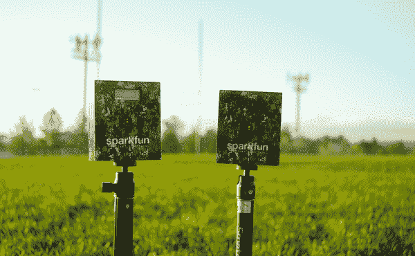

# 无线计时项目

> 原文：<https://learn.sparkfun.com/tutorials/wireless-timing-project>

## 野马之乡，让我们比赛吧！

标准的“联合”评估是评估整个 NFL 运动员表现的黄金标准。2022 年 NFL 选秀大会在世界各地拥有超过 5500 万观众，40 码冲刺时间是最热门的讨论之一。

运动员 40 码短跑有两种计时方法:手动计时和全自动电子计时。你可能知道，手动计时包括运动员跨过起跑线和终点线时手动开始和停止的时间。全自动电子计时方法用于减少人为错误，运动员的动作将开始和停止计时。通常，如果使用全自动计时系统计时，运动员的 40 码短跑时间会“更慢”。这些电子系统非常昂贵，一次安装一般要花费 600 多美元。受 40 码短跑的意义及其昂贵市场的启发，我们开始仅使用 SparkFun 组件复制这一计时系统。

本教程中使用的组件比当今市场上的平均计时系统便宜得多。这个系统带来了在工作场所适度胡闹的好主意，但是，当然，安全第一，而不是第三。我们决定举办一次公司 40 码短跑比赛，获胜者可以带回家炫耀，并获得一张 visa 礼品卡。

在本教程中，您将学习如何使用 ESP32 WIFI 系统创建无线计时系统。该系统可用于包括计时在内的无限应用，例如跑步、驾驶、赛狗、机器人比赛等。硬件包括一对 [ESP32-S2 东西加](https://www.sparkfun.com/products/20168)，两个 [SparkFun 距离传感器分接头 4 米 VL53L1X](https://www.sparkfun.com/products/14722) ，两个[金属按钮](https://www.sparkfun.com/products/11966)，一个 [SparkFun Qwiic 线缆套件](https://www.sparkfun.com/products/15081)，一个 [SparkFun qwiic 有机发光二极管显示器](https://www.sparkfun.com/products/17153)，两个[锂离子电池](https://www.sparkfun.com/products/18286)。您可以使用下面的愿望列表将所有组件添加到购物车中:

### 所需材料

要跟随本教程，您需要以下材料。