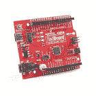

# GNSS 接收机分线点- MAX-M10S (Qwiic)连接指南

> 原文：<https://learn.sparkfun.com/tutorials/gnss-receiver-breakout---max-m10s-qwiic-hookup-guide>

## 介绍

[spark fun u-blox MAX-M10S breakout](https://www.sparkfun.com/products/18037)是一款超低功耗、高性能、小型化 GNSS 板，非常适合电池供电、空间不太大的应用，如资产追踪器和可穿戴设备。在本教程中，我们将快速让您使用 Qwiic 生态系统和 Arduino 进行设置，以便您可以开始阅读输出！

[](https://www.sparkfun.com/products/18037) 

将**添加到您的[购物车](https://www.sparkfun.com/cart)中！**

 **### [](https://www.sparkfun.com/products/18037)

[In stock](https://learn.sparkfun.com/static/bubbles/ "in stock") GPS-18037

SparkFun MAX-M10S Breakout 是一款超低功耗 GNSS 板，非常适合电池供电的应用

$44.951[Favorited Favorite](# "Add to favorites") 6[Wish List](# "Add to wish list")** **[https://www.youtube.com/embed/Yh8pLKs7aaY/?autohide=1&border=0&wmode=opaque&enablejsapi=1](https://www.youtube.com/embed/Yh8pLKs7aaY/?autohide=1&border=0&wmode=opaque&enablejsapi=1)

### 所需材料

要跟随本教程，您将需要以下材料。你可能不需要所有的东西，这取决于你拥有什么。将它添加到您的购物车，通读指南，并根据需要调整购物车。

[](https://www.sparkfun.com/products/18037) 

将**添加到您的[购物车](https://www.sparkfun.com/cart)中！**

 **### [](https://www.sparkfun.com/products/18037)

[In stock](https://learn.sparkfun.com/static/bubbles/ "in stock") GPS-18037

SparkFun MAX-M10S Breakout 是一款超低功耗 GNSS 板，非常适合电池供电的应用

$44.951[Favorited Favorite](# "Add to favorites") 6[Wish List](# "Add to wish list")****[](https://www.sparkfun.com/products/14986) 

将**添加到您的[购物车](https://www.sparkfun.com/cart)中！**

 **### [【GPS/GNSS 磁悬挂天线- 3m (SMA)](https://www.sparkfun.com/products/14986)

[In stock](https://learn.sparkfun.com/static/bubbles/ "in stock") GPS-14986

这款出色的 GPS/GNSS 天线专为 GPS 和 GLONASS 接收而设计。

$13.953[Favorited Favorite](# "Add to favorites") 7[Wish List](# "Add to wish list")****[](https://www.sparkfun.com/products/18158) 

将**添加到您的[购物车](https://www.sparkfun.com/cart)中！**

 **### [SparkFun RedBoard 加](https://www.sparkfun.com/products/18158)

[In stock](https://learn.sparkfun.com/static/bubbles/ "in stock") DEV-18158

RedBoard Plus 是一款兼容 Arduino 的开发板，拥有 Arduino Uno 所需的一切，并具有额外的额外功能…

$21.504[Favorited Favorite](# "Add to favorites") 12[Wish List](# "Add to wish list")****[](https://www.sparkfun.com/products/14426) 

将**添加到您的[购物车](https://www.sparkfun.com/cart)中！**

 **### [Qwiic 线缆- 50mm](https://www.sparkfun.com/products/14426)

[In stock](https://learn.sparkfun.com/static/bubbles/ "in stock") PRT-14426

这是一根 50 毫米长的 4 芯电缆，带有 1 毫米 JST 端接。它旨在将支持 Qwiic 的组件连接在一起…

$0.95[Favorited Favorite](# "Add to favorites") 29[Wish List](# "Add to wish list")****[](https://www.sparkfun.com/products/15424) 

将**添加到您的[购物车](https://www.sparkfun.com/cart)中！**

 **### [可逆 USB A 转 C 线- 2m](https://www.sparkfun.com/products/15424)

[18 available](https://learn.sparkfun.com/static/bubbles/ "18 available") CAB-15424

这些 2 米长的电缆稍加修改后，就可以插入其端口，而不用考虑其在 U…

$8.951[Favorited Favorite](# "Add to favorites") 4[Wish List](# "Add to wish list")********** **********#### 附加 GPS 天线选项

以下是一些其他的 GPS 天线选项。

[](https://www.sparkfun.com/products/177) 

将**添加到您的[购物车](https://www.sparkfun.com/cart)中！**

 **### [GPS 嵌入式天线 SMA](https://www.sparkfun.com/products/177)

[Out of stock](https://learn.sparkfun.com/static/bubbles/ "out of stock") GPS-00177

适合小型移动应用的嵌入式天线。带 LNA 的基本无包装天线。5 英寸电缆端接标准公…

$12.95[Favorited Favorite](# "Add to favorites") 10[Wish List](# "Add to wish list")****[](https://www.sparkfun.com/products/14987) 

将**添加到您的[购物车](https://www.sparkfun.com/cart)中！**

 **### [](https://www.sparkfun.com/products/14987)

[33 available](https://learn.sparkfun.com/static/bubbles/ "33 available") GPS-14987

这款三频 GNSS 天线非常适合 GPS L1、GLONASS L1 和北斗 B2 接收。

$64.50[Favorited Favorite](# "Add to favorites") 3[Wish List](# "Add to wish list")**** ****### 推荐阅读

如果你不熟悉 Qwiic 系统，我们推荐你在这里阅读[以获得一个概述](https://www.sparkfun.com/qwiic)。

| [](https://www.sparkfun.com/qwiic) |
| *[Qwiic 连接系统](https://www.sparkfun.com/qwiic)* |

如果您不熟悉以下概念，我们也建议您在继续之前先查阅一些教程。

[](https://learn.sparkfun.com/tutorials/gps-basics) [### GPS 基础知识](https://learn.sparkfun.com/tutorials/gps-basics) The Global Positioning System (GPS) is an engineering marvel that we all have access to for a relatively low cost and no subscription fee. With the correct hardware and minimal effort, you can determine your position and time almost anywhere on the globe.[Favorited Favorite](# "Add to favorites") 31[](https://learn.sparkfun.com/tutorials/i2c) [### I2C](https://learn.sparkfun.com/tutorials/i2c) An introduction to I2C, one of the main embedded communications protocols in use today.[Favorited Favorite](# "Add to favorites") 128[](https://learn.sparkfun.com/tutorials/serial-basic-hookup-guide) [### 串行基本连接指南](https://learn.sparkfun.com/tutorials/serial-basic-hookup-guide) Get connected quickly with this Serial to USB adapter.[Favorited Favorite](# "Add to favorites") 10[](https://learn.sparkfun.com/tutorials/redboard-plus-hookup-guide) [### RedBoard Plus 连接指南](https://learn.sparkfun.com/tutorials/redboard-plus-hookup-guide) This tutorial covers the basic functionality of the RedBoard Plus. This tutorial also covers how to get started blinking an LED and using the Qwiic system.[Favorited Favorite](# "Add to favorites") 2

## 硬件概述

我们已经将 u-blox MAX-M10S 模块分解为一个突破。本节重点介绍电路板的相关功能。要了解关于 IC 的更多信息，请查阅参考资料。

[](https://cdn.sparkfun.com/assets/learn_tutorials/1/7/5/9/18037-SparkFun_GNSS_Receiver_Breakout_MAX-M10S_Qwiic_u-blox.jpg)

### 力量

该板的电源应为 **3.3V** 。电路板侧面的 PTH 接头上有一个 3.3V 引脚，但您也可以通过 Qwiic 连接器供电。

| [](https://cdn.sparkfun.com/assets/learn_tutorials/1/7/5/9/18037-SparkFun_GNSS_Receiver_Breakout_MAX-M10S_Qwiic-Top_Power.jpg) | [](https://cdn.sparkfun.com/assets/learn_tutorials/1/7/5/9/18037-SparkFun_GNSS_Receiver_Breakout_MAX-M10S_Qwiic-Bottom_Power.jpg) |
| *俯视图* | *仰视图* |

### 通信端口

**Note:** The MAX-M10S differs from other modules as it only has I²C and UART. It is important to note that the board does not have SPI pins.[](https://cdn.sparkfun.com/assets/learn_tutorials/1/7/5/9/18037-SparkFun_GNSS_Receiver_Breakout_MAX-M10S_Qwiic.jpg)

### Qwiic 和 I ² C(也称为 DDC)

标记为`SDA`和`SCL`的两个 PTH 表示 I ² C 数据线。同样，你可以只使用 Qwiic 连接器来提供电源，并连接到 I ² C 引脚。 [Qwiic 生态系统](https://www.sparkfun.com/qwiic)无需焊接，可实现快速原型制作。您只需将 qw IC 电缆插入 qw IC 连接器，瞧！

| [](https://cdn.sparkfun.com/assets/learn_tutorials/1/7/5/9/18037-SparkFun_GNSS_Receiver_Breakout_MAX-M10S_Qwiic-Top_I2C.jpg) | [](https://cdn.sparkfun.com/assets/learn_tutorials/1/7/5/9/18037-SparkFun_GNSS_Receiver_Breakout_MAX-M10S_Qwiic-Bottom_I2C.jpg) |
| *俯视图* | *仰视图* |

**Note:** The only I2C address for this and all u-Blox GPS products is **0x42**, though each can have their address changed through software.

### 通用非同步收发传输器(Universal Asynchronous Receiver/Transmitter)

对于喜欢通过 UART 进行通信的用户，我们确保将 UART 引脚分组配置为行业标准，以确保其能够轻松连接到[串行基本](https://www.sparkfun.com/products/15096)。额外的 UART 引脚也在电路板的另一边断开。端口默认设置为 **38400 波特**。

| [](https://cdn.sparkfun.com/assets/learn_tutorials/1/7/5/9/18037-SparkFun_GNSS_Receiver_Breakout_MAX-M10S_Qwiic-Top_UART.jpg) | [](https://cdn.sparkfun.com/assets/learn_tutorials/1/7/5/9/18037-SparkFun_GNSS_Receiver_Breakout_MAX-M10S_Qwiic-Bottom_UART.jpg) |
| *俯视图* | *仰视图* |

### 控制引脚

这些引脚用于 MAX-M10 的各种额外控制。下面突出显示了控制引脚。

| [](https://cdn.sparkfun.com/assets/learn_tutorials/1/7/5/9/18037-SparkFun_GNSS_Receiver_Breakout_MAX-M10S_Qwiic-Bottom_Control_Pins.jpg) | [](https://cdn.sparkfun.com/assets/learn_tutorials/1/7/5/9/18037-SparkFun_GNSS_Receiver_Breakout_MAX-M10S_Qwiic-Bottom_Control_Pins.jpg) |
| *俯视图* | *仰视图* |

*   **PPS:** 每秒脉冲输出引脚。当模块获得基本 GPS/GNSS 位置锁定时，开始以 1Hz 的频率闪烁。
*   **RST :** 复位输入引脚。将此线拉低以复位模块。
*   **保险箱 :** Safeboot 输入 pin。这是模块固件更新所必需的，通常不应使用或连接。为了节省空间，丝印标签在电路板的底部。
*   **EINT:** 中断输入/输出引脚。可以使用 U-Center 进行配置，以将模块从深度睡眠中唤醒，或者针对各种模块状态输出中断。

### 天线的 SMA 接头

电路板上安装了一个 SMA 连接器，用于安全连接到贴片天线。

[](https://cdn.sparkfun.com/assets/learn_tutorials/1/7/5/9/18037-SparkFun_GNSS_Receiver_Breakout_MAX-M10S_Qwiic-Top_SMA_Connector.jpg)

### 发光二极管

该板包括两个状态指示灯，如下图所示。

[](https://cdn.sparkfun.com/assets/learn_tutorials/1/7/5/9/18037-SparkFun_GNSS_Receiver_Breakout_MAX-M10S_Qwiic-Top_LEDs.jpg)

*   **PPS:** 一旦达到位置锁定，每秒脉冲 LED 将每秒点亮一次。
*   **PWR:** 当通过 Qwiic 总线或任何 3.3V PTH 引脚提供 3.3V 电压时，电源 LED 将点亮。

### 针织套衫

板子的背面有四根跳线。如需了解更多信息，请查看我们的[教程，了解如何使用跳线焊盘和 PCB 走线](https://learn.sparkfun.com/tutorials/how-to-work-with-jumper-pads-and-pcb-traces/all)，如果您决定用业余爱好刀切割走线。

[](https://cdn.sparkfun.com/assets/learn_tutorials/1/7/5/9/18037-SparkFun_GNSS_Receiver_Breakout_MAX-M10S_Qwiic-Bottom_Jumpers.jpg)

*   **PWR:** 连接到电路板顶部的 PWR LED。切断它会禁用 LED。
*   **MEAS:** 电流测量的简称。默认情况下，MEAs 是关闭的。切断跳线并焊接到 PTH 焊盘上，可以插入电流表，精确监控应用消耗的电流。
*   **PPS:** 它连接到电路板顶部的 PPS LED。切断它会禁用 LED。
*   I²C:I²C 跳线默认打开。通过向跳线添加焊料，它将连接到 2.2k &欧姆；I ² C 总线的上拉电阻。大多数时候你可以不去管这些，除非你的项目需要[连接上拉电阻](https://learn.sparkfun.com/tutorials/i2c/all#i2c-at-the-hardware-level)。

### 备用电池

MS621FE 充电电池维持 GNSS 模块上的电池后备 RAM (BBR)。这允许更快的位置锁定(又名热启动)。BBR 也用于模块配置保持。当通电时，电池会自动涓流充电，并应在断电的情况下保持设置和 GNSS 轨道数据长达两周。

[](https://cdn.sparkfun.com/assets/learn_tutorials/1/7/5/9/18037-SparkFun_GNSS_Receiver_Breakout_MAX-M10S_Qwiic-Top_Backup_Battery.jpg)

### 电路板尺寸

天线连接器的总长度和宽度约为 1.74 英寸 x 1.20 英寸。电路板的每个角上都有四个安装孔。

[](https://cdn.sparkfun.com/assets/e/8/8/9/8/SparkFun_u-blox_MAX-M10S_Board_Dimensions.png)

## 硬件装配

至少，您需要将外部天线连接到 MAX-M10S，提供 3.3V 电源，并连接到主板的一个外设。

### 连接外部天线

将带有 SMA 连接器的贴片天线插入 GPS 板。用六角螺母固定连接，直到用手指拧紧为止。

[](https://cdn.sparkfun.com/assets/learn_tutorials/1/7/5/9/18037-SparkFun_GNSS_Receiver_Breakout_MAX-M10S_Qwiic_Antenna.jpg)

### I ² C

与 MAX-M10S 通信的一种方法是通过 I²c。qw IIC connect 系统使使用极化电缆将电路板连接到您的系统变得快速简单。对于嵌入式项目，您可以使用支持 Qwiic 的 Arduino 开发板，如 [RedBoard Plus](https://www.sparkfun.com/products/18158) 及其[相关 USB 电缆](https://www.sparkfun.com/products/15425)。然后在 RedBoard Plus 和 SparkFun MAX-M10S 之间插一根 Qwiic 线。

[](https://cdn.sparkfun.com/assets/learn_tutorials/1/7/5/9/18037-SparkFun_GNSS_Receiver_Breakout_-_MAX-M10S_Qwiic_RedBoard_Plus_Hookup.jpg)**Note:** The RedBoard Plus includes a switch to adjust the logic levels to either 5V or 3.3V. It does not matter what side the switch is on for this setup to communicate with the MAX-M10S since there are logic level converters included before the Qwiic connector.

如果您要将焊接到 I ² C 功能的通孔引脚，那么只需在您选择的微控制器的 I ² C 和 MAX-M10S 之间连接以下线路:

*   SDA 至 SDA
*   SCL 到 SCL
*   3.3V 至 3.3V
*   GND 两个 GND

### 通用非同步收发传输器(Universal Asynchronous Receiver/Transmitter)

与 MAX-M10S 通信的第二种方法是通过其串行 UART。您可以通过将 USB 转串行转换器连接到工业标准串行连接(也称为“FTDI”引脚)，将 GPS 直接连接到计算机。在这种情况下，我们使用 CH340，但您也可以使用另一种 USB 转串行转换器，如 FTDI。只要确保匹配丝网印刷(GRN 到 GRN 和 BLK 到 BLK)。为了安全连接，您需要将[插头引脚或电线焊接到 MAX-M10S 上。](https://learn.sparkfun.com/tutorials/how-to-solder-through-hole-soldering)

[](https://cdn.sparkfun.com/assets/learn_tutorials/1/7/5/9/18037-SparkFun_GNSS_Receiver_Breakout_MAX-M10S_Qwiic_Serial_UART_u-blox.jpg)

您也可以将这些引脚连接到 RedBoard Plus 等微控制器，只要在电路板上电之前，逻辑电平开关切换到 3.3V 侧即可。与使用 Qwiic connect 系统相比，您需要做更多的工作。您需要在所选微控制器的 UART 和 MAX-M10S 之间连接以下线路:

*   Tx 至 Rx
*   Rx 至 Tx
*   3.3V 至 3.3V
*   GND 两个 GND

## 软件设置和编程

**Note:** This example assumes you are using the latest version of the Arduino IDE on your desktop. If this is your first time using Arduino, please review our tutorial on [installing the Arduino IDE.](https://learn.sparkfun.com/tutorials/installing-arduino-ide) If you have not previously installed an Arduino library, please check out our [installation guide.](https://learn.sparkfun.com/tutorials/installing-an-arduino-library)

If you've never connected an FTDI or CH340 to your computer before, you may need to install drivers for the USB-to-serial converter. Check out our [How to Install FTDI Drivers](https://learn.sparkfun.com/tutorials/how-to-install-ftdi-drivers) or [How to Install CH340 Drivers](https://learn.sparkfun.com/tutorials/sparkfun-serial-basic-ch340c-hookup-guide#drivers-if-you-need-them) tutorial for help with the installation.

我们所有基于 u-blox 的 GPS 板共享同一个库:这个板，它们的[前后继](https://learn.sparkfun.com/tutorials/sparkfun-gps-breakout-zoe-m8q-and-sam-m8q-hookup-guide)和更高[精度](https://www.sparkfun.com/products/15005) [u-blox 表兄弟](https://www.sparkfun.com/products/15136)。SparkFun u-blox Arduino 库可以通过搜索' **SparkFun u-blox GNSS** '使用 Arduino 库管理器下载，或者您可以从 [GitHub 存储库](https://github.com/sparkfun/SparkFun_u-blox_GNSS_Arduino_Library)获取 zip 文件以手动安装:

[SparkFun U-blox Arduino Library (ZIP)](https://github.com/sparkfun/SparkFun_u-blox_GNSS_Arduino_Library/archive/main.zip)

提供了几个利用 I ² C 总线让你从太空接收信息的示例草图。我们将在本教程中复习一个例子。

**Note:** Example 2 uses the '**MicroNMEA**' library by **Steve Marple**. Make sure to install the library as well by searching for it in the Arduino library manager. You could also grab the zip here from the [GitHub repository](https://github.com/stevemarple/MicroNMEA) to manually install.

[MicroNMEA Arduino Library (ZIP)](https://github.com/stevemarple/MicroNMEA/archive/master.zip)

## 示例代码

我们只看示例二(即“ **Example2_NMEAParsing.ino** ”)，在我看来，它清楚地表明了这些 GPS 接收机的神奇之处。也就是说，与卫星对话，找出你在世界上的什么地方。

```
language:c
#include <Wire.h> //Needed for I2C to GPS

#include "SparkFun_u-blox_GNSS_Arduino_Library.h" //Click here to get the library: http://librarymanager/All#SparkFun_u-blox_GNSS
SFE_UBLOX_GNSS myGNSS;

void setup()
{
  Serial.begin(115200);
  Serial.println("SparkFun u-blox Example");

  Wire.begin();

  if (myGNSS.begin() == false)
  {
    Serial.println(F("u-blox GNSS module not detected at default I2C address. Please check wiring. Freezing."));
    while (1);
  }

  //This will pipe all NMEA sentences to the serial port so we can see them
  myGNSS.setNMEAOutputPort(Serial);
}

void loop()
{
  myGNSS.checkUblox(); //See if new data is available. Process bytes as they come in.

  delay(250); //Don't pound too hard on the I2C bus
} 
```

当你上传这段代码时，你必须等待 24 秒才能锁定任何卫星。在第一次锁定之后，板上的备用电池将为一些内部系统提供电力，这将允许下次打开板时进行**热启动**。**热启动**只持续四个小时，但允许你在一秒钟内锁定。锁定后，[串行终端](https://learn.sparkfun.com/tutorials/terminal-basics/arduino-serial-monitor-windows-mac-linux)将开始列出经度和纬度坐标，如下图所示。确保将串行监视器设置为 **115200 波特**。

[](https://cdn.sparkfun.com/assets/learn_tutorials/8/6/9/nmeaCapture-ublox2.jpg)*These are the coordinates for SparkFun HQ*

## 解决纷争

**Not working as expected and need help?**

If you need technical assistance and more information on a product that is not working as you expected, we recommend heading on over to the [SparkFun Technical Assistance](https://www.sparkfun.com/technical_assistance) page for some initial troubleshooting.

[SparkFun Technical Assistance Page](https://www.sparkfun.com/technical_assistance)
If you don't find what you need there, the [SparkFun Forums](https://forum.sparkfun.com/index.php) are a great place to find and ask for help. If this is your first visit, you'll need to [create a Forum Account](https://forum.sparkfun.com/ucp.php?mode=register) to search product forums and post questions.

[Create New Forum Account](https://forum.sparkfun.com/ucp.php?mode=register)   [Log Into SparkFun Forums](https://forum.sparkfun.com/index.php)

## 资源和更进一步

既然您已经成功启动并运行了您的 MAX-M10，那么是时候将它整合到您自己的项目中了！有关更多信息，请查看以下资源:

*   [示意图(PDF)](https://cdn.sparkfun.com/assets/f/3/f/b/4/SparkFun_u-blox_GNSS_MAX-M10S_Schematic_v10.pdf)
*   [鹰(ZIP)](https://cdn.sparkfun.com/assets/c/5/9/6/8/SparkFun_u-blox_GNSS_MAX-M10S_Board_Files_v10.zip)
*   [板尺寸(PNG)](https://cdn.sparkfun.com/assets/e/8/8/9/8/SparkFun_u-blox_MAX-M10S_Board_Dimensions.png)
*   [数据表(PDF)](https://cdn.sparkfun.com/assets/7/5/9/a/a/MAX-M10S_DataSheet_UBX-20035208.pdf)
*   [协议手册(PDF)](https://cdn.sparkfun.com/assets/1/f/9/e/5/M10-FW500_InterfaceDescription_UBX-20053845.pdf)
*   [集成手册(PDF)](https://cdn.sparkfun.com/assets/5/c/a/0/b/MAX-M10S_IntegrationManual_UBX-20053088.pdf)
*   [产品摘要(PDF)](https://cdn.sparkfun.com/assets/9/6/d/6/5/MAX-M10_ProductSummary_UBX-20017987.pdf)
*   [发行说明(PDF)](https://cdn.sparkfun.com/assets/2/0/d/7/4/u-blox_M10_ROM_5.00_ReleaseNotes_UBX-20050981.pdf)
*   [u-blox ECCN (PDF)](https://cdn.sparkfun.com/assets/9/b/5/5/8/Ublox_ECCN.pdf)
*   [Arduino 库](https://github.com/sparkfun/SparkFun_u-blox_GNSS_Arduino_Library)
*   [GitHub 硬件回购](https://github.com/sparkfun/SparkFun_u-blox_MAX-M10S)
*   [SFE 产品展示区](https://youtu.be/Yh8pLKs7aaY)

或者查看其他与 GPS 和 GNSS 相关的[教程](https://learn.sparkfun.com/tutorials/tags/gps):

[](https://learn.sparkfun.com/tutorials/copernicus-ii-hookup-guide) [### 哥白尼 II 连接指南](https://learn.sparkfun.com/tutorials/copernicus-ii-hookup-guide) A guide for how to get started with the Copernicus II GPS module.[Favorited Favorite](# "Add to favorites") 2[](https://learn.sparkfun.com/tutorials/alphanumeric-gps-wall-clock) [### 字母数字 GPS 挂钟](https://learn.sparkfun.com/tutorials/alphanumeric-gps-wall-clock) This is a GPS controlled clock - a clock you truly never have to set! Using GPS and some formulas, we figure out what day of the week and if we are in or out of daylight savings time.[Favorited Favorite](# "Add to favorites") 13[](https://learn.sparkfun.com/tutorials/gps-logger-shield-hookup-guide) [### GPS 记录器屏蔽连接指南](https://learn.sparkfun.com/tutorials/gps-logger-shield-hookup-guide) How to assemble and hookup the SparkFun GPS Logger Shield. Never lose track of your Arduino again 6[](https://learn.sparkfun.com/tutorials/micromod-update-tool-hookup-guide) [### MicroMod 更新工具连接指南](https://learn.sparkfun.com/tutorials/micromod-update-tool-hookup-guide) Follow this guide to learn how to use the MicroMod Update Tool to interact directly with the UART on the MicroMod Asset Tracker's SARA-R5\. Using this board you can talk directly to the module using u-blox's m-center software as well as update the firmware using EasyFlash.[Favorited Favorite](# "Add to favorites") 0****************