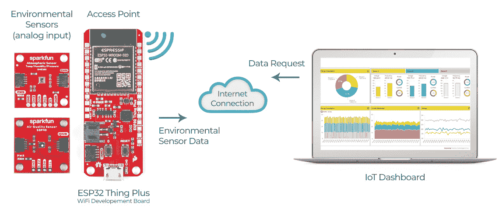
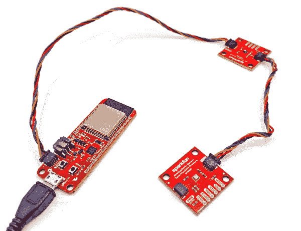

# 从任何地方监控传感器数据

> 原文：<https://learn.sparkfun.com/tutorials/monitor-sensor-data-from-anywhere>

## 介绍

我们都很熟悉 WiFi。它管理我们的家，让我们观看我们最喜欢的电影，让我们在咖啡店时不必与其他人交谈。但是，除了简单地通过不同的应用程序访问互联网，还有更多使用 WiFi 的方式！

借鉴之前的 Wifi 教程[通过 WiFi 发送传感器数据](https://learn.sparkfun.com/tutorials/sending-sensor-data-over-wifi)，我们展示了如何创建一个简单、封闭的点对点网络，该网络能够从环境传感器读取数据，并在串行 LCD 上远程输出。下一个合乎逻辑的步骤是采用相同的想法，并将其扩展到物联网项目中，并通过互联网连接从世界任何地方查看传感器读数。

*^(Now, no matter where in the world I find myself, I can always check in on conditions at home!)*

## 项目:从任何地方无线监控温度、湿度和气压！

如果你已经通读了第一篇关于通过 WiFi 发送传感器数据的教程[，那么你应该知道第一步是找到你的主板的 MAC 地址，第二步是连接硬件。对于本教程，我们不需要 MAC 地址，硬件设置就像我们的](https://learn.sparkfun.com/tutorials/sending-sensor-data-over-wifi) [Qwiic Connect 系统](/qwiic)一样简单。只需使用一根 qw IC 电缆将我们的 [ESP32 Thing Plus](https://www.sparkfun.com/products/15663) 连接到一个 qw IC 传感器分线点。它是如此的快速和简单，以至于凭良心我甚至不能称之为一个步骤。

*^(The setup for this project is a simple daisy-chain with two Qwiic cables.)*