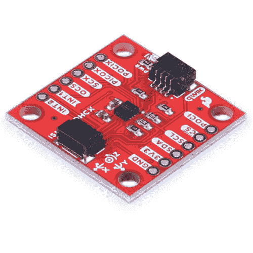
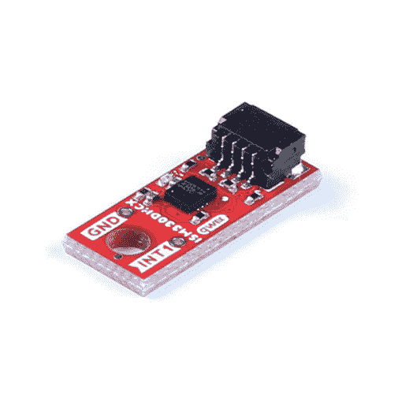

# Qwiic 6DoF - ISM330DHCX 连接指南

> 原文：<https://learn.sparkfun.com/tutorials/qwiic-6dof---ism330dhcx-hookup-guide>

## 介绍

需要 6 个自由度吗？我们有。请看[spark fun Qwiic 6 DOF-ism 330 dhcx](https://www.sparkfun.com/products/19764)和 [SparkFun Micro 6DoF IMU 分线架-ism 330 dhcx(qw IIC)](https://www.sparkfun.com/products/20176)——这两款分线架均支持 qw IIC，采用意法半导体的 ism 330 dhcx；一款高性能 3D 数字加速度计和 3D 数字陀螺仪，专为工业 4.0 应用量身定制，如平台、光学成像和镜头稳定、机器人和工业自动化、导航系统、振动监控和补偿等。

 

将**添加到您的[购物车](https://www.sparkfun.com/cart)中！**

 **### [【spark fun 6 DOF IMU Breakout-ism 330 dhcx(Qwiic)](https://www.sparkfun.com/products/19764)

[In stock](https://learn.sparkfun.com/static/bubbles/ "in stock") SEN-19764

SparkFun Qwiic ISM330DHCX 6DoF IMU 是一款标准尺寸的 1"x1 "突破型 IMU，具有高性能 3D 数字加速度计…

$24.951[Favorited Favorite](# "Add to favorites") 4[Wish List](# "Add to wish list")**** 

将**添加到您的[购物车](https://www.sparkfun.com/cart)中！**

 **### [【spark fun Micro 6 DOF IMU-ism 330 dhcx(Qwiic)](https://www.sparkfun.com/products/20176)

[In stock](https://learn.sparkfun.com/static/bubbles/ "in stock") SEN-20176

SparkFun Qwiic Micro ISM330DHCX 六自由度 IMU 是一款 0.75 英寸乘 0.30 英寸的微型传感器，采用 STMicroel…

$25.95[Favorited Favorite](# "Add to favorites") 2[Wish List](# "Add to wish list")**** ****这两款加速度计均具有 2/ 4/ 8/ 16 g 的满量程加速度范围和 125/ 250/ 500/ 1000/ 2000/ 4000 dps 的宽角速率范围，因而具有广泛的应用前景。一组无与伦比的嵌入式功能(机器学习内核、可编程 FSM、FIFO、传感器集线器、事件解码和中断)有助于实现智能复杂的传感器节点，以极低的功耗提供高性能。

全尺寸 SparkFun Qwiic 6DoF - ISM330DHCX 拥有标准的 1x1”外形尺寸，而微型 6DoF IMU 突破尺寸仅为 0.75 x 0.3 英寸！

### 所需材料

要跟随本教程，您将需要以下材料。你可能不需要所有的东西，这取决于你拥有什么。将它添加到您的购物车，通读指南，并根据需要调整购物车。****