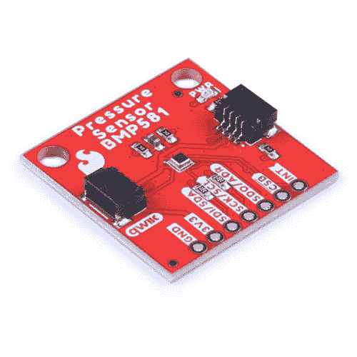
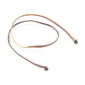
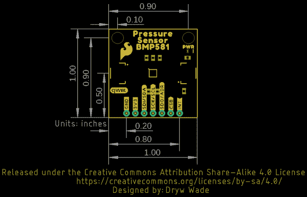

# Qwiic 压力传感器(BMP581)连接指南

> 原文：<https://learn.sparkfun.com/tutorials/qwiic-pressure-sensor-bmp581-hookup-guide>

## 介绍

SparkFun [压力传感器- BMP581 (Qwiic)](https://www.sparkfun.com/products/20170) 和[微型压力传感器- BMP581 (Qwiic)](https://www.sparkfun.com/products/20171) 采用博世 Sensortec 的 BMP581 绝对压力传感器。BMP581 拥有出色的分辨率和精度，并使用片内线性化和温度补偿来提供压力和温度的真实绝对数据。

[](https://www.sparkfun.com/products/20170) 

将**添加到您的[购物车](https://www.sparkfun.com/cart)中！**

 **### [【spark fun 压力传感器- BMP581 (Qwiic)](https://www.sparkfun.com/products/20170)

[In stock](https://learn.sparkfun.com/static/bubbles/ "in stock") SEN-20170

SparkFun Qwiic BMP581 压力传感器是一个标准尺寸，1 英寸。1in 前。博世传感器的绝对压力传感器分线点…

$19.951[Favorited Favorite](# "Add to favorites") 4[Wish List](# "Add to wish list")****[](https://www.sparkfun.com/products/20171) 

将**添加到您的[购物车](https://www.sparkfun.com/cart)中！**

 **### [【spark fun 微型压力传感器- BMP581 (Qwiic)](https://www.sparkfun.com/products/20171)

[In stock](https://learn.sparkfun.com/static/bubbles/ "in stock") SEN-20171

SparkFun Qwiic Micro BMP581 压力传感器是一种标准尺寸的 0.75 英寸乘 0.3 英寸绝对压力传感器，从…

$20.95[Favorited Favorite](# "Add to favorites") 0[Wish List](# "Add to wish list")**** ****[https://www.youtube.com/embed/eGXE8o36e4E/?autohide=1&border=0&wmode=opaque&enablejsapi=1](https://www.youtube.com/embed/eGXE8o36e4E/?autohide=1&border=0&wmode=opaque&enablejsapi=1)

本指南将带您了解这些 Qwiic 分线点上的硬件，将它们连接到 Qwiic 电路，并将 BMP581 与 SparkFun BMP581 Arduino 库配合使用。

### 所需材料

按照本指南，您需要一个微控制器与 BMP581 通信。以下是一些开箱即用的 Qwiic 选项:

[](https://www.sparkfun.com/products/15663) 

将**添加到您的[购物车](https://www.sparkfun.com/cart)中！**

 **### [【spark fun Thing Plus-ESP32 WROOM(微-B)](https://www.sparkfun.com/products/15663)

[Out of stock](https://learn.sparkfun.com/static/bubbles/ "out of stock") WRL-15663

SparkFun ESP32 Thing Plus 是开始使用 Espressif 物联网概念的下一步，同时还可以享受所有的便利设施

$22.5010[Favorited Favorite](# "Add to favorites") 48[Wish List](# "Add to wish list")****[](https://www.sparkfun.com/products/15574) 

将**添加到您的[购物车](https://www.sparkfun.com/cart)中！**

 **### [火花趣事 Plus——阿尔忒弥斯](https://www.sparkfun.com/products/15574)

[25 available](https://learn.sparkfun.com/static/bubbles/ "25 available") WRL-15574

SparkFun Artemis Thing Plus 采用了我们流行的羽毛足迹，并添加了强大的 Artemis 模块，以实现终极功能

$22.50[Favorited Favorite](# "Add to favorites") 28[Wish List](# "Add to wish list")****[](https://www.sparkfun.com/products/15444) 

将**添加到您的[购物车](https://www.sparkfun.com/cart)中！**

 **### [SparkFun RedBoard Artemis](https://www.sparkfun.com/products/15444)

[In stock](https://learn.sparkfun.com/static/bubbles/ "in stock") DEV-15444

RedBoard Artemis 采用 SparkFun 的功能强大的 Artemis 模块，并将其包装在一个易于使用和熟悉的环境中…

$21.509[Favorited Favorite](# "Add to favorites") 32[Wish List](# "Add to wish list")****[](https://www.sparkfun.com/products/14713) 

将**添加到您的[购物车](https://www.sparkfun.com/cart)中！**

 **### [SparkFun 的东西 Plus-samd 51](https://www.sparkfun.com/products/14713)

[Out of stock](https://learn.sparkfun.com/static/bubbles/ "out of stock") DEV-14713

SparkFun SAMD51 Thing Plus 采用 32 位 ARM Cortex-M4F MCU，是我们迄今为止最强大的微控制器板之一！

$21.502[Favorited Favorite](# "Add to favorites") 26[Wish List](# "Add to wish list")******** ********如果您选择的微控制器尚未启用 Qwiic，您可以添加以下一项或多项功能:

[](https://www.sparkfun.com/products/15081) 

将**添加到您的[购物车](https://www.sparkfun.com/cart)中！**

 **### [SparkFun Qwiic 线缆套件](https://www.sparkfun.com/products/15081)

[In stock](https://learn.sparkfun.com/static/bubbles/ "in stock") KIT-15081

为了更容易上手，我们用 50 毫米到 500 毫米的各种 Qwiic 电缆组装了 Qwiic 电缆套件…

$8.9516[Favorited Favorite](# "Add to favorites") 58[Wish List](# "Add to wish list")****[](https://www.sparkfun.com/products/14495) 

将**添加到您的[购物车](https://www.sparkfun.com/cart)中！**

 **### [SparkFun Qwiic 适配器](https://www.sparkfun.com/products/14495)

[In stock](https://learn.sparkfun.com/static/bubbles/ "in stock") DEV-14495

SparkFun Qwiic 适配器提供了将任何旧 I ² C 板改造成支持 Qwiic 的板的完美方法。

$1.601[Favorited Favorite](# "Add to favorites") 53[Wish List](# "Add to wish list")****[](https://www.sparkfun.com/products/14352) 

将**添加到您的[购物车](https://www.sparkfun.com/cart)中！**

 **### [ArduinoT3 的 SparkFun Qwiic 盾](https://www.sparkfun.com/products/14352)

[In stock](https://learn.sparkfun.com/static/bubbles/ "in stock") DEV-14352

SparkFun Qwiic Shield 是一种易于组装的板，它提供了一种简单的方法来将 Qwiic Connect 系统与

$7.508[Favorited Favorite](# "Add to favorites") 39[Wish List](# "Add to wish list")****[](https://www.sparkfun.com/products/16790) 

将**添加到您的[购物车](https://www.sparkfun.com/cart)中！**

 **### [SparkFun Qwiic 盾为物加](https://www.sparkfun.com/products/16790)

[In stock](https://learn.sparkfun.com/static/bubbles/ "in stock") DEV-16790

SparkFun Qwiic Shield for Thing Plus 使您可以使用 spark fun 的 Qwiic connect 生态系统和开发板来测试

$4.95[Favorited Favorite](# "Add to favorites") 7[Wish List](# "Add to wish list")******** ********您还需要至少一根 Qwiic 电缆将传感器连接到微控制器。

[](https://www.sparkfun.com/products/14427) 

将**添加到您的[购物车](https://www.sparkfun.com/cart)中！**

 **### [Qwiic 线缆- 100mm](https://www.sparkfun.com/products/14427)

[In stock](https://learn.sparkfun.com/static/bubbles/ "in stock") PRT-14427

这是一条 100 毫米长的 4 芯电缆，带有 1 毫米 JST 端接。它旨在将支持 Qwiic 的组件连接在一起…

$1.50[Favorited Favorite](# "Add to favorites") 32[Wish List](# "Add to wish list")****[](https://www.sparkfun.com/products/14429) 

将**添加到您的[购物车](https://www.sparkfun.com/cart)中！**

 **### [Qwiic 线缆- 500mm](https://www.sparkfun.com/products/14429)

[In stock](https://learn.sparkfun.com/static/bubbles/ "in stock") PRT-14429

这是一根 500mm 长的 4 芯电缆，带有 1mm JST 端接。它旨在将支持 Qwiic 的组件连接在一起…

$1.951[Favorited Favorite](# "Add to favorites") 25[Wish List](# "Add to wish list")****[](https://www.sparkfun.com/products/14426) 

将**添加到您的[购物车](https://www.sparkfun.com/cart)中！**

 **### [Qwiic 线缆- 50mm](https://www.sparkfun.com/products/14426)

[In stock](https://learn.sparkfun.com/static/bubbles/ "in stock") PRT-14426

这是一根 50 毫米长的 4 芯电缆，带有 1 毫米 JST 端接。它旨在将支持 Qwiic 的组件连接在一起…

$0.95[Favorited Favorite](# "Add to favorites") 29[Wish List](# "Add to wish list")****[](https://www.sparkfun.com/products/14428) 

### [Qwiic 线缆- 200mm](https://www.sparkfun.com/products/14428)

[Out of stock](https://learn.sparkfun.com/static/bubbles/ "out of stock") PRT-14428

这是一根 200 毫米长的 4 芯电缆，带有 1 毫米 JST 端接。它旨在将支持 Qwiic 的组件连接在一起…

[Favorited Favorite](# "Add to favorites") 21[Wish List](# "Add to wish list")****** ******### 推荐阅读

如果你不熟悉 Qwiic 系统，我们推荐你在这里阅读[以获得一个概述](https://www.sparkfun.com/qwiic)。

| [](https://www.sparkfun.com/qwiic) |

如果你不熟悉下面的教程，我们也建议你看一看。如果您正在使用上面列出的 Qwiic 屏蔽板之一，您可能也想在阅读本指南之前阅读一下它们各自的连接指南。

[](https://learn.sparkfun.com/tutorials/i2c) [### I2C](https://learn.sparkfun.com/tutorials/i2c) An introduction to I2C, one of the main embedded communications protocols in use today.[Favorited Favorite](# "Add to favorites") 128[](https://learn.sparkfun.com/tutorials/terminal-basics) [### 串行终端基础知识](https://learn.sparkfun.com/tutorials/terminal-basics) This tutorial will show you how to communicate with your serial devices using a variety of terminal emulator applications.[Favorited Favorite](# "Add to favorites") 46[](https://learn.sparkfun.com/tutorials/qwiic-shield-for-arduino--photon-hookup-guide) [### Arduino 和光子连接指南的 Qwiic 屏蔽](https://learn.sparkfun.com/tutorials/qwiic-shield-for-arduino--photon-hookup-guide) Get started with our Qwiic ecosystem with the Qwiic shield for Arduino or Photon.[Favorited Favorite](# "Add to favorites") 5[](https://learn.sparkfun.com/tutorials/sparkfun-qwiic-shield-for-arduino-nano-hookup-guide) [### Arduino Nano 连接指南的 SparkFun Qwiic 盾](https://learn.sparkfun.com/tutorials/sparkfun-qwiic-shield-for-arduino-nano-hookup-guide) Hookup Guide for the SparkFun Qwiic Shield for Arduino Nano.[Favorited Favorite](# "Add to favorites") 1

## 硬件概述

在这一节中，我们将更仔细地了解这些 Qwiic 压力传感器- BMP581 分线点上的硬件。

### BMP581 压力传感器

BMP581 是 Bosch Sensortec 公司的一款极其精确和多功能的绝对压力传感器，它利用片内线性化和温度补偿来提供真实的绝对压力和温度数据。

| [](https://cdn.sparkfun.com/assets/learn_tutorials/2/5/5/0/BMP581_Qwiic-Sensor.jpg) | [](https://cdn.sparkfun.com/assets/learn_tutorials/2/5/5/0/BMP581_Qwiic_Micro-BMP581.jpg) |

BMP581 具有宽压力检测范围(30 至 125 kPa)，压力数据分辨率为 1/64 Pa，在整个检测范围内具有出色的精度(最大 0.5 hPa)，输出数据速率最高可达 622 Hz。所有这些都包含在仅 2.0 毫米 ² 的封装尺寸中！

传感器接受从 **1.71V** 到 **3.6V** 的电源电压，尽管电路板在 **3.3V** 运行传感器。BMP581 包括一个最多可存储 32 个样本的 FIFO 缓冲器、用户可编程低通滤波和可配置 IIR 设置，有助于抵消环境压力变化(如门窗开关或风经过传感器)产生的噪声。最后，BMP581 甚至有 6 字节的用户可编程非易失性存储器。

下表列出了 BMP581 的一些检测参数。欲全面了解 BMP581，请参考[数据手册](https://cdn.sparkfun.com/assets/9/a/4/4/f/BMP581-Datasheet.pdf)。

| 参数 | 量滴 | 典型。 | 最大值 | 单位 | 笔记 |
| 工作温度 | -40 | Twenty-five | eighty-five | C |  |
| 操作压力 | Thirty | - | One hundred and twenty-five | 千帕斯卡(kilopascal) |  |
| 相对精度 | - | ±0.06 | - | 高功率放大器（high-power amplifier 的缩写） | 每 10 千帕一步。 |
| 绝对精度 | - | - | ±0.5 | 高功率放大器（high-power amplifier 的缩写） |  |
| 在…之时柯夫。抵消 | - | ±0.5 | - | 帕/克 | 在 900 百帕和 25-40 摄氏度时 |
| 压力噪音 ^([1](#BMP581_Note)) | - | Zero point seven eight | .095 | 帕尔马斯 | 过采样率设置为“最低功率”。 |
| - | Zero point two one | Zero point two five | 帕尔马斯 | 过采样率设置为“高分辨率”。 |
| - | Zero point zero eight |  | 帕尔马斯 | 过采样率设置为“最高分辨率”。 |
| 输出数据速率 ^([1](#BMP581_Note)) | Zero point one two five | - | Two hundred and forty | 赫兹 | 范围适用于正常模式。 |

下表列出了传感器的七种工作模式。有关可用或所需的电源模式和配置设置的完整信息，请参考[数据表](https://cdn.sparkfun.com/assets/9/a/4/4/f/BMP581-Datasheet.pdf)的第 4.3 节:

| 工况 | 功耗(25°C 时，VDDIO/VDD=3.3V) | 笔记 |
| 备用的 | (.类型) | 保存最后测量的压力/温度值以及 FIFO 数据(如果启用)。 |
| 深度待机 | (类型) | 最有效的功耗。进入深度待机需要一组特定的条件。更多信息请参考数据手册第 4.3.2 节。 |
| 强迫的 |  | 根据测量和滤波器选项进行单次测量。传感器返回睡眠模式。数据寄存器上可读取的测量值。必须将传感器返回到强制模式，以便进行下一次测量。 |
| 常态 | 260 安培(最大值) | 传感器在设定为输出数据速率(ODR)的配置频率上进行测量。传感器在活动测量和待机期间之间循环。 |
| 低功耗正常 | (类型) | 操作与正常模式相同，但在测量周期之间进入深度待机模式。 |
| 连续的 | 260 安培(最大值) | 传感器以所选过采样设置的最大可能频率进行测量。传感器保持在活动测量状态，不会循环到待机状态。 |
| 睡眠 |  | 在任何工作模式之间转换时，传感器必须进入睡眠模式。 |

[**1.**](https://learn.sparkfun.com/tutorials/qwiic-pressure-sensor-bmp581-hookup-guide#BMP581_Note) Refer to section 4.4.2 of the BMP581 datasheet for more information on how oversampling settings/ratios affect pressure RMS noise and output data rate.

### 通信接口- I ² C & SPI

默认情况下，标准尺寸的 Qwiic 压力传感器(BMP581)通过 I ² C 通信，但也支持通过 SPI 使用 BMP581。Qwiic 微型版仅支持 I ² C 超过板上的 Qwiic 连接器。

| [](https://cdn.sparkfun.com/assets/learn_tutorials/2/5/5/0/BMP581_Qwiic-Interfaces.jpg) | [](https://cdn.sparkfun.com/assets/learn_tutorials/2/5/5/0/BMP581_Qwiic_Micro-Qwiic_PTHs.jpg) |

分线点将 I ² C 接口连接到一对 Qwiic 连接器和一个 0.1 英寸间距的 PTH 接头，供喜欢传统焊接连接的用户使用。该 PTH 接头共享 SPI 连接，也包括中断引脚。

默认情况下，板卡将 BMP581 的 I ² C 地址设置为 **0x77** 。调整 ADR 跳线以更改到备用地址( **0x76** )或保持完全打开以使用 SPI 接口(仅标准尺寸)。有关该跳线的更多信息，请参见下面的“焊料跳线”部分。

### 焊料跳线

If you have never worked with solder jumpers and PCB traces before or would like a quick refresher, check out our [How to Work with Solder Jumpers and PCB Traces](https://learn.sparkfun.com/tutorials/how-to-work-with-jumper-pads-and-pcb-traces) tutorial for detailed instructions and tips.

标准尺寸分接头有四个焊接跳线，分别标有: **I2C** 、 **ADR** 、 **CSB** 和 **LED** 。除了 **CSB** 跳线之外，微型分线点具有所有跳线，因为微型版本不支持 SPI。

| [](https://cdn.sparkfun.com/assets/learn_tutorials/2/5/5/0/BMP581_Qwiic-Solder_Jumpers.png) | [](https://cdn.sparkfun.com/assets/learn_tutorials/2/5/5/0/BMP581_Qwiic_Micro-Solder_Jumpers.jpg) |

I ² C 跳线连接一对 **2.2k &欧姆；**SDA/SCL 线的电阻。除非你在同一总线上有大量的 I ² C 设备，否则保持这些使能。

ADR 跳线默认将 BMP581 的 I ² C 地址设置为**0x 47**(**0x 46**备用)。它还控制是通过 I ² C 还是 SPI 操作。完全打开跳线，将 BMP581 设置为通过 SPI 通信。

CSB 跳线通过一个 **10k &欧姆将片选引脚拉到 VDD(**3.3V**)；**电阻器。打开跳线以禁用上拉。

LED 跳线完成电源 LED 电路。如果需要，打开跳线以禁用电源指示灯。

### 电路板尺寸

标准尺寸的 Qwiic 分线点与带有两个安装孔的 Qwiic 分线点的 1.0 英寸 x 1.0 英寸(25.4 毫米 x 25.4mm 毫米)外形相匹配，这两个安装孔可安装尺寸为 [4-40 的螺钉](https://www.sparkfun.com/products/10453)。这种分线装置的微型版本与 Qwiic 微型外形相匹配，尺寸为 0.75 英寸 x 0.30 英寸(24.65 毫米 x 7.62mm 毫米)，有一个安装孔，可安装 4-40 号螺钉。

| []((https://cdn.sparkfun.com/assets/learn_tutorials/2/5/5/0/SparkFun_Pressure_Sensor_BMP581_Qwiic-Dimensions.png) | [](https://cdn.sparkfun.com/assets/learn_tutorials/2/5/5/0/SparkFun_Micro_Pressure_Sensor_BMP581_Qwiic-Dimensions.png) |

## 硬件装配

现在我们已经熟悉了 Qwiic 压力传感器(BMP581)，我们可以开始组装电路了。

### Qwiic/I ² C 总成

开始使用分线点最快、最简单的方法是将分线点上的 Qwiic 连接器连接到支持 Qwiic 的开发板，如 SparkFun RedBoard Artemis，使用 Qwiic 电缆，如下图所示。

[](https://cdn.sparkfun.com/assets/learn_tutorials/2/5/5/0/SparkFun_Pressure_Sensor_BMP581_Qwiic-Assembly.jpg)

如果您更喜欢与标准尺寸版本的更安全和永久的连接，您可以将接头焊接或接线到板上的 PTH 接头。

### SPI 组件(仅标准尺寸)

设置分线点以通过 SPI 与传感器通信需要完全打开 ADR 跳线，我们建议焊接到 PTH 接头进行连接。如果您不熟悉通孔焊接，请通读本教程:

[](https://learn.sparkfun.com/tutorials/how-to-solder-through-hole-soldering) [### 如何焊接:通孔焊接

#### 2013 年 9 月 19 日](https://learn.sparkfun.com/tutorials/how-to-solder-through-hole-soldering) This tutorial covers everything you need to know about through-hole soldering.[Favorited Favorite](# "Add to favorites") 70

除了焊接工具，你还需要一些连接线或接头和跳线。切断 ADR 跳线的“中心”和“右侧”焊盘之间的走线，告知 BMP581 使用 SPI 进行通信。打开此跳线后，将 BMP581 连接到控制器的 SPI 引脚。

[](https://cdn.sparkfun.com/assets/learn_tutorials/2/5/5/0/BMP581_Qwiic-ADR_Jumper.png)

请记住，BMP581 在 **3.3V 逻辑**下运行，因此请确保连接到运行在相同[逻辑电平](https://learn.sparkfun.com/tutorials/logic-levels)的电路板，如 [RedBoard Artemis](https://www.sparkfun.com/products/15444) 或使用[电平转换器](https://www.sparkfun.com/categories/361)将其调整到安全电压。

## SparkFun BMP581 Arduino 库

**注意:**该库假设您在桌面上使用的是最新版本的 Arduino IDE。如果这是你第一次使用 Arduino，请回顾我们关于[安装 Arduino IDE 的教程。](https://learn.sparkfun.com/tutorials/installing-arduino-ide)如果您之前没有安装 Arduino 库，请查看我们的[安装指南。](https://learn.sparkfun.com/tutorials/installing-an-arduino-library)

SparkFun BMP581 Arduino 库基于博世传感器的 API。通过 Arduino 库管理器工具搜索**“spark fun BMP 581”**安装库。喜欢手动安装库的用户可以通过点击下面的按钮从 GitHub 库下载一个副本:

[SparkFun BMP581 Arduino Library (ZIP)](https://github.com/sparkfun/SparkFun_BMP581_Arduino_Library/archive/refs/heads/main.zip)**Heads Up!** We recommend choosing a development board with plenty of available RAM like the RedBoard Artemis shown in the Hardware Assembly section if you want to use the FIFO buffer as it is read all at once which causes some microcontrollers like the ATMega328 on the RedBoard/Uno to run out of RAM after just a few samples. All other use cases of the Arduino Library will work with most microcontrollers.

### 库函数

下表概述并描述了 SparkFun BMP581 库中可用的功能:

*   `int8_t beginI2C(uint8_t address = BMP581_I2C_ADDRESS_DEFAULT, TwoWire& wirePort = Wire);` -将 BMP581 初始化为指定线路端口上的默认 I ² C 地址。
*   `int8_t beginSPI(uint8_t csPin, uint32_t clockFrequency = 100000);` -使用定义的片选引脚通过 SPI 初始化 BMP581，并设置时钟频率(默认为 100kHz)。
*   `int8_t init();` -初始化 BMP581 传感器。begin 函数自动处理这个问题。
*   `int8_t setMode(bmp5_powermode mode);` -设置运行模式。有效选项包括:。begin 函数自动处理这个问题。
*   `int8_t getMode(bmp5_powermode* mode);` -返回运行模式的设定值。
*   `int8_t enablePress(uint8_t pressEnable);` -启用压力和温度感应。begin 函数自动处理这个问题。

#### 传感器数据和设置

*   `int8_t getSensorData(bmp5_sensor_data* data);` -从传感器获取压力和温度数据。
*   `int8_t setODRFrequency(uint8_t odr);` -设置输出数据速率频率。
*   `int8_t getODRFrequency(uint8_t* odr);` -返回为输出数据速率频率设置的值
*   `int8_t setOSRMultipliers(bmp5_osr_odr_press_config* config);` -设置过采样乘数。
*   `int8_t getOSRMultipliers(bmp5_osr_odr_press_config* config);` -返回为过采样乘法器存储的值。
*   `int8_t getOSREffective(bmp5_osr_odr_eff* osrOdrEffective);`
*   `int8_t setFilterConfig(bmp5_iir_config* iirConfig);` -设置 IIR 滤波器配置。
*   `int8_t setOORConfig(bmp5_oor_press_configuration* oorConfig);` -设置 OOR(超范围)配置。
*   `int8_t setInterruptConfig(BMP581_InterruptConfig* config);` -设置中断设置(输出模式、电平、锁存和数据就绪)。有关设置和使用中断引脚的详细演示，请参考 Arduino 库中的[示例 3 -中断](https://github.com/sparkfun/SparkFun_BMP581_Arduino_Library/blob/main/examples/Example3_Interrupts/Example3_Interrupts.ino)。
*   `int8_t getInterruptStatus(uint8_t* status);` -返回中断的设置。

#### FIFO 缓冲控制

有关设置和使用 FIFO 缓冲器的详细示例，请参考 Arduino 库中的[示例 6 - FIFO 缓冲器](https://github.com/sparkfun/SparkFun_BMP581_Arduino_Library/tree/main/examples/Example6_FIFOBuffer)。

*   `int8_t setFIFOConfig(bmp5_fifo* fifoConfig);` -设置 FIFO 缓冲设置。
*   `int8_t getFIFOLength(uint8_t* numData);` -设置一次存储在 FIFO 缓冲器中的样本数量。
*   `int8_t getFIFOData(bmp5_sensor_data* data, uint8_t numData);` -提取存储在 BMP581 上的 FIFO 数据。
*   `int8_t flushFIFO();` -清空 FIFO 缓冲器。

#### NVM 控制

*   `int8_t readNVM(uint8_t addr, uint16_t* data);` -读取存储在非易失性存储器中的数据。
*   `int8_t writeNVM(uint8_t addr, uint16_t data);` -将数据写入非易失性存储器。

#### 错误代码

如果调用正确，此列表中的大多数函数都会返回特定的错误代码(而不是真/假布尔值)。这些示例演示了如何设置和调用错误代码。有关错误代码的信息，请参考 BMP581 API 中的 [BMP581 defs.h](https://github.com/sparkfun/SparkFun_BMP581_Arduino_Library/blob/main/src/bmp5_api/bmp5_defs.h) 文件。

## Arduino 示例

安装了 Arduino 库之后，是时候上传一些代码来使用 BMP581 了。在这一节中，我们将仔细查看库中包含的几个示例。

### 示例 1 -基本读数(I ² C)

第一个示例使用默认设置初始化 BMP581，通过 I ² C 进行通信。导航至**文件** **示例> SparkFun BMP581 Arduino 库>Example _ 1 _ Basic _ readings I2C**打开示例。选择您的主板和端口，然后单击上传。上传完成后，打开[串行监视器](https://learn.sparkfun.com/tutorials/terminal-basics)，将波特率设置为 **115200** ，观察压力数据(帕斯卡)的打印结果。

如果您已经切换到备用地址，请用正确的值注释/取消注释该行:

```
language:c
uint8_t i2cAddress = BMP581_I2C_ADDRESS_DEFAULT; // 0x47
//uint8_t i2cAddress = BMP581_I2C_ADDRESS_SECONDARY; // 0x46 
```

代码试图用 I ² C 中指定地址的默认设置初始化传感器，如果无法正确初始化，则打印出错误信息:

```
language:c
while(pressureSensor.beginI2C(i2cAddress) != BMP5_OK)
{
    // Not connected, inform user
    Serial.println("Error: BMP581 not connected, check wiring and I2C address!");

    // Wait a bit to see if connection is established
    delay(1000);
} 
```

初始化后，主循环每秒轮询 BMP581 的压力和温度数据。如果数据轮询失败，代码将打印出一个错误代码用于调试。试着上下移动传感器，只要移动几英寸，你就会看到压力读数的明显差异。

```
language:c
void loop()
{
    // Get measurements from the sensor
    bmp5_sensor_data data = {0};
    int8_t err = pressureSensor.getSensorData(&data);

    // Check whether data was acquired successfully
    if(err == BMP5_OK)
    {
        // Acquisistion succeeded, print temperature and pressure
        Serial.print("Temperature (C): ");
        Serial.print(data.temperature);
        Serial.print("\t\t");
        Serial.print("Pressure (Pa): ");
        Serial.println(data.pressure);
    }
    else
    {
        // Acquisition failed, most likely a communication error (code -2)
        Serial.print("Error getting data from sensor! Error code: ");
        Serial.println(err);
    }

    // Only print every second
    delay(1000);
} 
```

### 示例 3 -中断

示例 3 显示了如何在 BME581 上设置和使用超量程(OOR)中断条件来触发所连接的微控制器上的中断例程。如果你不熟悉处理器中断，[这篇教程](https://learn.sparkfun.com/tutorials/processor-interrupts-with-arduino)很好地介绍了如何在 Arduino 中使用它们。

组装中断电路时，确保将分接头上的 INT 引脚连接到能够接受外部中断的引脚。代码将`D2`设置为中断引脚，因此如果您的微控制器不支持该引脚上的外部中断，请调整该线路:

```
language:c
// Pin used for interrupt detection
int interruptPin = 2; 
```

代码会创建一个标志来识别中断条件何时发生，并将超量程条件规格设置为 50 Pa，中间值为 84000 Pa:

```
language:c    
// Flag to know when interrupts occur
volatile bool interruptOccurred = false;

// OOR range specification
uint32_t oorCenter = 84000;
uint8_t oorWindow = 50; 
```

### 示例 7 -非易失性存储器

正如硬件概述部分所述，BMP581 包括 6 字节的非易失性存储器(NVM ),您可以对其进行读写操作。示例 7 演示了如何与 NVM 交互。

除了其他标准定义和调用，我们还需要设置要写入 NVM 的数据。您可以存储任意 6 个字节的数据，但在本例中，我们将存储一些字符:

```
language:c
char dataToWrite[] = "Hello!"; 
```

在初始化 BMP581 中的传感器并验证其已连接后，代码会尝试将上面声明的数据写入 NVM。如果成功，代码将打印出存储的数据:

```
language:c
Serial.println("Writing data to NVM: ");
Serial.println(dataToWrite);

// The BMP581 contains non-volatile memory (NVM) that is primarily used for
// calibration data internally by the sensor. However 6 bytes are user programmable,
// stored in 3 2-byte locations (0x20 - 0x22).
uint16_t dataIndex = 0;
for(uint8_t addr = BMP5_NVM_START_ADDR; addr <= BMP5_NVM_END_ADDR; addr++)
{
    uint16_t data = dataToWrite[dataIndex] | (dataToWrite[dataIndex+1] << 8);
    dataIndex += 2;

    pressureSensor.writeNVM(addr, data);
}

Serial.println("Data read back from NVM: ");

// Now we can read back the data and display it
for(uint8_t addr = BMP5_NVM_START_ADDR; addr <= BMP5_NVM_END_ADDR; addr++)
{
    uint16_t data = 0;
    pressureSensor.readNVM(addr, &data);
    char first = data & 0xFF;
    char second = (data >> 8) & 0xFF;
    Serial.print(first);
    Serial.print(second);
} 
```

### 示例 8 -低功率

示例 8 演示了如何使用深度待机和强制模式以及 BMP581 的中断引脚来降低 BMP581 电路的功耗。每当 BMP581 读取数据并触发中断时，中断引脚可以用来唤醒微控制器。该代码使用`D5`作为中断引脚，因此如果您的微控制器不支持该引脚上的外部中断，请调整该代码行:

```
language:c
int interruptPin = 5; 
```

代码初始化 I ² C 总线上的传感器，将其设置为深度待机模式，并使中断引脚在数据准备就绪时触发(当传感器进入强制模式时):

```
language:c
err = pressureSensor.setMode(BMP5_POWERMODE_DEEP_STANDBY);
if(err != BMP5_OK)
{
    // Interrupt settings failed, most likely a communication error (code -2)
    Serial.print("Set mode failed! Error code: ");
    Serial.println(err);
} 
```

在传感器从深度待机模式转换到强制模式之前，主循环包括一秒钟的延迟。该延迟可以用将微控制器设置为低功率模式的功率序列来代替。

转换到强制模式后，代码会执行一系列检查，以防测量就绪条件超时，以及中断就绪或获取状态调用失败。检查通过后，代码检查中断状态是否与数据就绪状态匹配，从 BMP581 中提取温度和压力数据，并通过串行接口打印出来:

```
language:c
if(interruptStatus & BMP5_INT_ASSERTED_DRDY)
{
    // Get measurements from the sensor
    bmp5_sensor_data data = {0};
    int8_t err = pressureSensor.getSensorData(&data);

    // Check whether data was acquired successfully
    if(err == BMP5_OK)
    {
        // Acquisistion succeeded, print temperature and pressure
        Serial.print("Temperature (C): ");
        Serial.print(data.temperature);
        Serial.print("\t\t");
        Serial.print("Pressure (Pa): ");
        Serial.println(data.pressure);
    }
    else
    {
        // Acquisition failed, most likely a communication error (code -2)
        Serial.print("Error getting data from sensor! Error code: ");
        Serial.println(err);
    }
}
else
{
    Serial.println("Wrong interrupt condition!");
} 
```

### 示例 9 -快速测量

最后一个例子演示了如何使用连续模式进行最大速度测量。本例使用连续模式，即传感器在前一次测量完成后立即进行测量。该示例与其他示例略有不同，因为它仅报告在一秒钟间隔内进行的测量的*号*，而不打印传感器测量的实际数据。

该代码将过采样率设置为 1 倍，因此传感器可以在最高 500Hz 的连续模式下执行测量，并配置中断引脚，以便在每次执行测量时触发中断:

```
language:c
err = pressureSensor.setMode(BMP5_POWERMODE_CONTINOUS);
if(err != BMP5_OK)
{
    // Interrupt settings failed, most likely a communication error (code -2)
    Serial.print("Set mode failed! Error code: ");
    Serial.println(err);
}

// Configure the BMP581 to trigger interrupts whenever a measurement is performed
BMP581_InterruptConfig interruptConfig =
{
    .enable   = BMP5_INTR_ENABLE,    // Enable interrupts
    .drive    = BMP5_INTR_PUSH_PULL, // Push-pull or open-drain
    .polarity = BMP5_ACTIVE_HIGH,    // Active low or high
    .mode     = BMP5_PULSED,         // Latch or pulse signal
    .sources  =
    {
        .drdy_en = BMP5_ENABLE,        // Trigger interrupts when data is ready
        .fifo_full_en = BMP5_DISABLE,  // Trigger interrupts when FIFO is full
        .fifo_thres_en = BMP5_DISABLE, // Trigger interrupts when FIFO threshold is reached
        .oor_press_en = BMP5_DISABLE   // Trigger interrupts when pressure goes out of range
    }
}; 
```

主循环检查是否到了打印时间(一秒钟)，然后打印打印期间的测量次数:

```
language:c
if(millis() > lastPrintTime + printPeriod)
    {
        // Print out number of measurements this period
        Serial.print("Number of measurements in ");
        Serial.print(printPeriod);
        Serial.print("ms: ");
        Serial.println(measurementsThisPeriod);

        // Reset number of measurements for next period
        measurementsThisPeriod = 0;

        // Increment last print time
        lastPrintTime += printPeriod;
    } 
```

## 解决纷争

### 作为高度的压力数据

如果您想要使用来自 BMP581 的压力数据来确定传感器的高度，请参考我们的 MPL3115A2 分线连接指南的[本节](https://learn.sparkfun.com/tutorials/mpl3115a2-pressure-sensor-hookup-guide#pressure-vs-altimeter-setting)以了解有关如何操作和正确解释压力数据的更多信息。

### 错误代码

如果调用正确，此列表中的大多数函数都会返回特定的错误代码(而不是真/假布尔值)。这些示例演示了如何设置和调用错误代码。有关错误代码的信息，请参考 BMP581 API 中的 [BMP581 defs.h](https://github.com/sparkfun/SparkFun_BMP581_Arduino_Library/blob/main/src/bmp5_api/bmp5_defs.h) 文件。

### 常规故障排除

**Not working as expected and need help?**

If you need technical assistance and more information on a product that is not working as you expected, we recommend heading on over to the [SparkFun Technical Assistance](https://www.sparkfun.com/technical_assistance) page for some initial troubleshooting.

[SparkFun Technical Assistance Page](https://www.sparkfun.com/technical_assistance)

If you don't find what you need there, the [SparkFun Forums](https://forum.sparkfun.com/index.php) are a great place to find and ask for help. If this is your first visit, you'll need to [create a Forum Account](https://forum.sparkfun.com/ucp.php?mode=register) to search product forums and post questions.

[Create New Forum Account](https://forum.sparkfun.com/ucp.php?mode=register)   [Log Into SparkFun Forums](https://forum.sparkfun.com/index.php)

## 资源和更进一步

有关 SparkFun 压力传感器- BMP581 (Qwiic 和 Qwiic Micro)的更多信息，请查看以下资源:

*   图表
    *   [标准](https://cdn.sparkfun.com/assets/0/8/a/7/a/SparkFun_Pressure_Sensor_BMP581_Qwiic-Schematic.pdf)
    *   [微](https://cdn.sparkfun.com/assets/2/6/7/0/b/SparkFun_Micro_Pressure_Sensor_BMP581_Qwiic-Schematic.pdf)
*   Eagle 文件
    *   [标准](https://cdn.sparkfun.com/assets/9/a/5/b/8/SparkFun_Pressure_Sensor_BMP581_Qwiic.zip)
    *   [微](https://cdn.sparkfun.com/assets/a/b/e/6/8/SparkFun_Micro_Pressure_Sensor_BMP581_Qwiic.zip)
*   电路板尺寸
    *   [标准](https://cdn.sparkfun.com/assets/learn_tutorials/2/5/5/0/SparkFun_Pressure_Sensor_BMP581_Qwiic-Dimensions.png)
    *   [微](https://cdn.sparkfun.com/assets/learn_tutorials/2/5/5/0/SparkFun_Micro_Pressure_Sensor_BMP581_Qwiic-Dimensions.png)
*   [数据表](https://cdn.sparkfun.com/assets/9/a/4/4/f/BMP581-Datasheet.pdf) (BMP581)
*   [Qwiic 信息页面](https://www.sparkfun.com/qwiic)
*   [BMP581 Arduino 库](https://github.com/sparkfun/SparkFun_BMP581_Arduino_Library)
*   [GitHub 硬件回购](https://github.com/sparkfun/SparkFun_Qwiic_Pressure_Sensor_BMP581)

为你的下一个环境传感项目寻找灵感？下面的教程可以帮助您开始:

[](https://learn.sparkfun.com/tutorials/ccs811bme280-qwiic-environmental-combo-breakout-hookup-guide) [### CCS811/BME280 (Qwiic)环境组合分线连接指南](https://learn.sparkfun.com/tutorials/ccs811bme280-qwiic-environmental-combo-breakout-hookup-guide) Sense various environmental conditions such as temperature, humidity, barometric pressure, eCO2 and tVOCs with the CCS811 and BME280 combo breakout board.[Favorited Favorite](# "Add to favorites") 2[](https://learn.sparkfun.com/tutorials/qwiic-uv-sensor-veml6075-hookup-guide) [### Qwiic 紫外线传感器(VEML6075)连接指南](https://learn.sparkfun.com/tutorials/qwiic-uv-sensor-veml6075-hookup-guide) Learn how to connect your VEML6075 UV Sensor and figure out just when you should put some sunscreen on.[Favorited Favorite](# "Add to favorites") 2[](https://learn.sparkfun.com/tutorials/sparkfun-environmental-sensor-breakout---bme68x-qwiic-hookup-guide) [### SparkFun 环境传感器分线点- BME68x (Qwiic)连接指南](https://learn.sparkfun.com/tutorials/sparkfun-environmental-sensor-breakout---bme68x-qwiic-hookup-guide) A hookup guide to get started with the BME68x Environmental Sensor from Bosch. Monitor the air quality, temperature, humidity, and barometric pressure with this Qwiic sensor 1[](https://learn.sparkfun.com/tutorials/sparkfun-absolute-digital-barometer---lps28dfw-qwiic-hookup-guide) [### SparkFun 绝对数字气压计- LPS28DFW (Qwiic)连接指南](https://learn.sparkfun.com/tutorials/sparkfun-absolute-digital-barometer---lps28dfw-qwiic-hookup-guide) Get started adding water-resistant pressure sensing using the SparkFun Absolute Digital Barometer - LPS28DFW (Qwiic) following this guide.[Favorited Favorite](# "Add to favorites") 0**************************