# SparkFun RTK 刻面 L 波段连接指南

> 原文：<https://learn.sparkfun.com/tutorials/sparkfun-rtk-facet-l-band-hookup-guide>

## 介绍

SparkFun 的 RTK Facet L 波段是我们迄今为止最先进的 GNSS 接收器。这是您的高精度地理定位和测量需求的一站式商店。对于基本用户来说，它非常容易启动和运行，对于高级用户来说，RTK Facet L-Band 是一个灵活而强大的工具。

 

将**添加到您的[购物车](https://www.sparkfun.com/cart)中！**

### [SparkFun RTK 刻面 L 波段](https://www.sparkfun.com/products/20000)

[34 available](https://learn.sparkfun.com/static/bubbles/ "34 available") GPS-20000

RTK Facet L-Band 是您满足高精度地理定位和勘测需求的一站式商店，无需基座或漫游车…

$1,499.955[Favorited Favorite](# "Add to favorites") 5[Wish List](# "Add to wish list")** **只需几分钟的设置，RTK Facet L-Band 是目前市场上进行厘米级测量的最快产品。

*Surveying with a monopod and SW Maps**An RTK Fix with 14mm accuracy in SW Maps*

只需按下按钮，RTK Facet L-Band 是进行厘米级测量的最快方式。借助内置校正功能，不到一分钟即可实现 14 毫米实时动态定位。通过蓝牙将您的手机连接到 RTK Facet L 波段，您的手机或平板电脑可以接收 NMEA 输出并运行大多数 GIS 软件。这正是 10，000 美元的测量设备在过去十年中的运作方式——我们只是让它更快、更精确、更经济。

### 所需材料

RTK Facet L-Band 将您需要的所有功能集成在一个小单元中。此外， [RTK Facet L-Band 套件](https://www.sparkfun.com/products/20000)也包括你*可能*需要的一切。你唯一需要添加的就是你自己的平板或者手机(目前支持安卓；iOS 支持计划)。

不需要外部无线电链路或 RTCM 校正。RTK Facet L-Band 利用 u-blox 的 PointPerfect 服务从地球同步 Inmarsat 卫星广播的校正。唯一需要的设置是 WiFi SSID 和密码。一旦进入，设备将自动配置并定期(每月一次)更新使用 PointPerfect 服务所需的解密密钥。RTK Facet L-Band 的价格包含 12 个月的订阅。可以购买额外的服务年限。

要给 RTK Facet 充电，你需要一根 USB C 线和一个电源。这些都包括在套件中，但任何 USB C 端口应以每小时 1A 的最大速率为刻面充电。

 

将**添加到您的[购物车](https://www.sparkfun.com/cart)中！**

### [USB 2.0 Type-C 线缆- 1 米](https://www.sparkfun.com/products/16905)

[In stock](https://learn.sparkfun.com/static/bubbles/ "in stock") CAB-16905

1 米 USB C 型到 C 型电缆 USB 2.0 数据传输能力。

$4.951[Favorited Favorite](# "Add to favorites") 4[Wish List](# "Add to wish list")**** 

将**添加到您的[购物车](https://www.sparkfun.com/cart)中！**

### [可逆 USB A 转 C 线- 0.8m](https://www.sparkfun.com/products/15425)

[15 available](https://learn.sparkfun.com/static/bubbles/ "15 available") CAB-15425

这些 0.8 米电缆稍作修改，允许它们插入其端口，而不管它们在…

$5.502[Favorited Favorite](# "Add to favorites") 5[Wish List](# "Add to wish list")**** 

将**添加到您的[购物车](https://www.sparkfun.com/cart)中！**

### [USB 壁式充电器- 5V，2A](https://www.sparkfun.com/products/16893)

[In stock](https://learn.sparkfun.com/static/bubbles/ "in stock") TOL-16893

这个 USB 交流到 DC 的电源将在 2A 做 5V！

$6.501[Favorited Favorite](# "Add to favorites") 2[Wish List](# "Add to wish list")**** 

将**添加到您的[购物车](https://www.sparkfun.com/cart)中！**

### [USB-C 壁式适配器- 5.1V，3A(黑色)](https://www.sparkfun.com/products/16272)

[In stock](https://learn.sparkfun.com/static/bubbles/ "in stock") TOL-16272

这是一个 USB Type-C 电源，与 Raspberry Pi 4 兼容。

$5.501[Favorited Favorite](# "Add to favorites") 5[Wish List](# "Add to wish list")******** ********### 推荐阅读

GNSS RTK 是一项令人难以置信的工程壮举，功能强大的 GNSS 接收机，如 u-blox 的 ZED-F9P(RTK Facet 内的接收机)，使其易于使用。设置 RTK 系统的过程将在本教程中介绍，但如果你想了解更多关于 RTK 的知识，这里有一些很好的教程供你温习:

 [### 什么是 GPS RTK？](https://learn.sparkfun.com/tutorials/what-is-gps-rtk) Learn about the latest generation of GPS and GNSS receivers to get 14mm positional accuracy 9 [### u-blox 的 U-Center 入门](https://learn.sparkfun.com/tutorials/getting-started-with-u-center-for-u-blox) Learn the tips and tricks to use the u-blox software tool to configure your GPS receiver.[Favorited Favorite](# "Add to favorites") 2 [### GPS-RTK2 连接指南](https://learn.sparkfun.com/tutorials/gps-rtk2-hookup-guide) Get precision down to the diameter of a dime with the new ZED-F9P from u-blox.[Favorited Favorite](# "Add to favorites") 9 [### 设置基于流动站的 RTK 系统](https://learn.sparkfun.com/tutorials/setting-up-a-rover-base-rtk-system) Getting GNSS RTCM correction data from a base to a rover is easy with a serial telemetry radio! We'll show you how to get your high precision RTK GNSS system setup and running.[Favorited Favorite](# "Add to favorites") 15 [### 如何建立一个 DIY GNSS 参考站](https://learn.sparkfun.com/tutorials/how-to-build-a-diy-gnss-reference-station) Learn how to affix a GNSS antenna, use PPP to get its ECEF coordinates and then broadcast your own RTCM data over the internet and cellular using NTRIP to increase rover reception to 10km 14

## RTK Facet L 波段的工作原理

SparkFun RTK Facet L-Band 的独特之处在于，它从地球同步 Inmarsat 卫星的 PointPerfect 服务广播中接收校正。不需要基站，不需要外部无线电链路，不需要互联网连接或 RTCM 校正来实现 RTK 定位。RTK Facet L-Band 不需要在任何地方创建帐户，不需要复制和粘贴密钥、证书或任何其他材料。所有东西都集成在一个单元中，尽可能易于使用。

**这是什么魔法？**

一个正常的 RTK 设置需要一个基地和漫游者。该基地静止不动，通过无线电或互联网链接向漫游车提供 RTCM 校正。这些校正有助于流动站的位置计算，使其能够消除电离层和对流层的微小失真。当它全部工作的时候，你可以实现 14 毫米的 X，Y，Z *精度*。对于许多应用来说，这很好，但是对于各种应用来说，单元通常位于远离蜂窝连接的地方，或者基站设置是不可能的。因此，u-blox 在美国和欧盟的 48 个州建立了一个大型基站网络。来自这些台站的校正数据被汇总成一系列校正反馈。然后，这些信号被上传到另一家名为 Inmarsat 的公司运营的地球同步卫星，并由该卫星进行广播。在美国，卫星以 1.55629GHz 进行广播，而在欧洲，不同的 Inmarsat 以 1.54526GHz 进行广播。这些频率非常方便，因为它们与 GNSS 卫星处于相同的波段:L 波段。 [L 波段](https://en.wikipedia.org/wiki/L_band)是 1 到 2 GHz 的任意频率。这些频率能够穿透云、雾和其他自然天气现象，因此对于定位应用特别有用。

RTK Facet L 波段顶部的单天线是一种独特的元件组合，旨在接收 GNSS 信号(L1/L2)以及 1.55GHz PointPerfect 校正信号。这些信号被发送到 ZED-F9P，用于传统的全球导航卫星系统位置计算(例如，产生设备的纬度、经度和高度)，并被发送到 NEO-D9S。NEO-D9S 是一个卫星接收器，其唯一目的是调谐到一个频率(在我们的情况下约为 1.55GHz)并输出数据。该数据是 SPARTN 格式的加密校正数据。RTK Facet L-Band 接收这些数据包并将其传递给 ZED-F9P。启动时，ESP32 向 ZED-F9P 提供解密密钥。通过数据包和密钥，ZED-F9P 能够解密数据，并使用它来校正其 GNSS 定位，从而将精度从约 300 毫米提高到 RTK 精度的 10 至 20 毫米。

有趣的是，GNSS 卫星具有中等地球轨道，每 12 小时绕地球一周，并且在地球上方大约 22，200 公里(12，551 英里)处具有轨道。而 Inmarsat 卫星在大约 1.5GHz 广播完美校正值，是地球同步的，因此必须位于更远的地方，大约 35，786 公里(22，236 英里)。

**RTK 刻面 L 波段在哪里可以操作？**

*point perfect Corrections 的美国和欧盟覆盖地图*

目前，u-blox PointPerfect 服务仅面向美国相邻的 48 个州和欧盟。请访问 u-blox 网站了解更多信息。如果 L 波段覆盖范围在您所在的地区不可用，RTK Facet L 波段仍然能够提供优于 300 毫米的现成精度，当使用标准基座/流动站设置提供 RTCM 校正时，精度为 14 毫米。

这要花多少钱？

RTK Facet L-Band 的费用包括订阅 u-blox 的 PointPerfect L-Band 服务 12 个月。u-blox 目前没有向个人提供 PointPerfect L-Band 服务。SparkFun 与 u-blox 建立了合作关系，允许 SparkFun 用户通过 SparkFun 的账户获得 L 波段服务。

“钥匙”是如何工作的？

我们在 SparkFun 的一句口头禅是*不要让我认为*是基于[史蒂夫·克鲁格](https://www.google.com/search?q=don%27t+make+me+think)的一本书。RTK Facet L-Band 不需要在任何地方创建帐户，不需要复制和粘贴密钥、证书或任何其他材料。供应过程**复杂**，所以我们在 RTK Facet L 波段内设计了固件来处理一切。用户唯一必须提供的是“家庭”WiFi 网络 ID 和密码。我们使用“家庭”一词，但它是设备最有可能打开的网络，例如测量员的办公室、学校或住宅。一旦这些细节通过 WiFi 或串行输入，该设备将负责其他一切。

**L 波段键是如何工作的？**

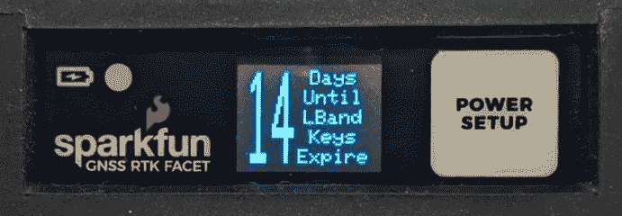

通过 Inmarsats 广播的校正数据是加密的。解密密钥每 28 天到期，在每次更新过程中提供两个密钥。这意味着 RTK Facet L-Band 可以在没有任何互联网连接的情况下最多工作 56 天，最坏情况下 29 天。每次设备启动时，RTK Facet L-Band 将尝试连接到其“家庭”WiFi。如果成功，密钥将被自动更新和存储。整个过程不到 10 秒(最坏的情况)。RTK Facet L-Band 将显示一系列屏幕，指示它在做什么，但该设备被设计为在没有关注或监督的情况下使用。

12 个月后会发生什么？

RTK Facet L-Band 的零售价格包括 12 个月的完美校正。12 个月后，该设备将无法获得密钥，并且该设备将作为正常的、非常高精度的 GNSS 接收器运行。如果需要额外的 PointPerfect 校正，可以通过联系 [SparkFun 客户服务](https://www.sparkfun.com/support)以每年 500 美元的价格购买。

**我可以不订阅而获得一个单位吗？**

u-blox 目前没有向个人提供 PointPerfect L-Band 服务。如果您有兴趣购买大量 RTK Facet L-Band，我们可以与您合作提供免订阅设备，但是否提供 L-Band 服务取决于您的组织。RTK 刻面 L 波段允许定制*设备配置文件令牌*。一旦您在 u-blox 上设置了一个帐户，就需要将此令牌输入到所有 RTK Facet L-Band 设备中，它们可以通过正常的 PointPerfect API 进行配置。详情请联系 [SparkFun 客服](https://www.sparkfun.com/support)。

L 波段校正的缺点是什么？

缺点:

*   使用 L 波段的 RTK 定位时间为 45 至 60 秒，而基于 RTCM 的 RTK 需要几秒钟。
*   通过 u-blox 的订阅费增加了成本。
*   精确度从 30 毫米到 60 毫米不等，通常可以看到 14 毫米到 20 毫米。

优点:

*   无需任何设置的高精度 RTK 修复。
*   非常容易设置和使用。没有基地，没有无线电，不需要互联网。

## 硬件概述

RTK Facet L-Band 是一个完全封闭的预编程设备。需要担心或配置的东西很少，但是我们将介绍一些基础知识。

### 电源/设置按钮

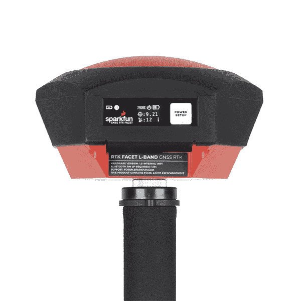

RTK Facet L-Band 有一个按钮用于现场配置更改的**电源**和**设置**。按住电源按钮将会打开或关闭电源。短按该按钮将导致 RTK Facet L-Band 改变模式。

该设备可用于五种模式:

*   GNSS 定位(约 30 厘米精度)-也称为“漫游者”
*   使用 RTK L 波段的 GNSS 定位(1.4 至 6 厘米精度)-也称为“使用 L 波段 RTK 定位的漫游者”
*   带 RTK 的 GNSS 定位(1.4 厘米精度)-也称为“带 RTK 定位的漫游者”
*   GNSS 基站
*   GNSS 基站 NTRIP 服务器

在*上电*时，设备将进入漫游或基本模式；设备在最后一次断电时所处的状态。瞬间按下电源/设置按钮时，会出现一个菜单，将 RTK Facet L-Band 更改为漫游或基本模式。显示屏会用一个小车或旗帜图标来指示变化。

在*漫游模式*中，RTK Facet L-Band 将检查 WiFi 是否可用，并更新任何所需的 L-Band 密钥(密钥每 56 天过期一次)。该设备将自动开始接收和解密位置校正数据。同时，RTK L 波段将接收来自四个星座(全球定位系统、GLONASS、伽利略和北斗)的 L1 和 L2 全球导航卫星系统信号。该设备将基于 GNSS 和校正信号的组合来计算位置。接收器将快速(在 60 秒内)获得 RTK 浮点值，然后修正。与标准等级的 GPS 接收机类似，RTK Facet L-Band 将以 4Hz 的频率输出行业标准的 NMEA 句子，并通过任何配对的蓝牙设备广播它们。最终用户将需要使用常见的移动应用程序、GIS 产品或嵌入式设备(有许多开源库)来解析 NMEA 的句子。与精度为 2500 毫米的标准等级 GPS 接收机不同，这种模式下的精度约为 14 至 60 毫米水平位置精度。

如果设备处于*漫游模式*但 L 波段不可用，基于常规 RTCM 的 RTK 仍然可用。当 RTCM 校正数据通过蓝牙发送或进入无线电端口时，设备将自动进入 RTK 定位模式。在这种模式下，RTK Facet L 波段将从天线接收 L1/L2 信号，并从基站接收校正数据。接收器将快速(在一秒钟内)获得一个 RTK 浮点，然后修复。NMEA 句子的水平精度将提高到 14 毫米，垂直精度将提高到 10 毫米。使用手机上的免费应用程序(参见 SW Maps 或 Lefebure NTRIP ),通过互联网最容易获得 RTCM 校正数据，并通过蓝牙发送到 RTK Facet L-Band，但 RTCM 也可以通过外部蜂窝或无线电链路发送到作为基站的第二 RTK Facet、Surveyor、Express 等设置。

在*漫游模式*中，RTK Facet L 波段将接收来自四个星座(GPS、GLONASS、伽利略和北斗)的 L1 和 L2 GNSS 信号，并根据这些信号计算位置。与标准等级的 GPS 接收机类似，RTK Facet L-Band 将以 4Hz 的频率输出行业标准的 NMEA 句子，并通过任何配对的蓝牙设备广播它们。最终用户将需要使用常见的移动应用程序、GIS 产品或嵌入式设备(有许多开源库)来解析 NMEA 的句子。与精度为 2500 毫米的标准等级 GPS 接收机不同，这种模式下的精度约为 300 毫米水平位置精度。

在*基本模式*中，设备将进入基站模式。当设备安装在固定位置(如三脚架或屋顶)时使用。RTK Facet L-Band 将启动一项调查。60 至 120 秒后，勘测将完成，RTK Facet L 波段将开始从无线电端口传输 RTCM 校正数据。底座通常与设置为“漫游”的第二个 RTK Facet L-Band(或 RTK Surveyor、Express、Express Plus 等)单元结合使用，以获得 14 毫米的精度。换句话说，基地静止不动，并向漫游车发送校正数据，以便漫游车可以输出真正准确的位置。

#### 力量

*RTK Facet L-Band startup display with firmware version number*

电源按钮打开和关闭设备。按住电源按钮，直到显示屏亮起。任何时候按住电源按钮都可以关闭本机。

*RTK Facet L-Band showing the battery level*

RTK Facet L-Band 有一个大型的内置 6000mAh 锂聚合物电池，充电后可在野外使用 25 小时以上。如果需要更多的时间，可以连接一个通用 USB 电源组，将现场时间增加到所需的任何时间。

### 充电 LED

[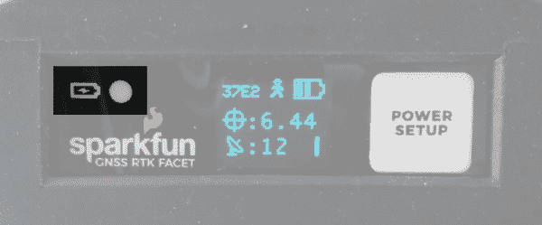](https://cdn.sparkfun.com/assets/learn_tutorials/2/1/8/8/SparkFun_RTK_Facet_-_Front_Face_-_Charge_LED.jpg)

充电指示灯位于正面。只要有外部电源，它就会亮起，当内部电池充满电时，它就会熄灭。在设备完全断电的情况下，使用 1A 壁式电源充电约需 6 小时，使用标准 USB 端口充电约需 12 小时。RTK Facet L 波段可以在充电时运行，但会增加充电时间。支持使用外部 USB 电池组长时间运行设备，或使用永久性墙壁电源运行设备。

### 连接器

*The SparkFun RTK Facet L-Band connectors shown with the dust cover removed*

有多种连接器受到防尘盖的保护。

#### 通用串行总线

[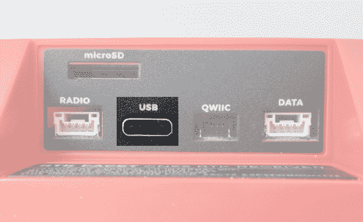](https://cdn.sparkfun.com/assets/learn_tutorials/2/1/8/8/SparkFun_RTK_Facet_-_Ports_-_USB.jpg)

该 USB C 连接器有四个用途:

*   给设备充电
*   配置 RTK Facet L-Band，并重新编程 ESP32
*   根据需要更新 ZED-F9P 的固件
*   根据需要更新 NEO-D9S 的固件

RTK Facet L 波段内置一个 USB 集线器。当您将该设备连接到您的计算机时，它将枚举为三个 COM 端口。

[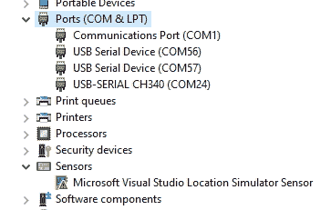](https://cdn.sparkfun.com/assets/learn_tutorials/2/5/8/3/SparkFun_RTK_Facet_L-Band_Ports.jpg)

上图中，`USB-SERIAL CH340`是 ESP32，`USB Serial Device`是 ZED-F9P 和 NEO-D9S。

**Don't See 'USB-Serial CH340'?** If you've never connected a CH340 device to your computer before, you may need to install drivers for the USB-to-serial converter. Check out our section on ["How to Install CH340 Drivers"](https://learn.sparkfun.com/tutorials/sparkfun-serial-basic-ch340c-hookup-guide#drivers-if-you-need-them) for help with the installation.**Don't See 'USB Serial Device'?** The first time a u-blox module is connected to a computer you may need to adjust the COM driver. Check out our section on ["How to Install u-blox Drivers"](https://learn.sparkfun.com/tutorials/getting-started-with-u-center-for-u-blox#install-drivers) for help with the installation.

通过串行文本菜单，可通过 *USB 串行 CH340* COM 端口配置 RTK 刻面 L 波段。各种调试消息以 115200bps 的速度打印到该端口，并且可以打开一个串行菜单来配置高级设置。配置 ZED-F9P 可以使用 [u-center](https://learn.sparkfun.com/tutorials/getting-started-with-u-center-for-u-blox/all) 通过 *USB 串行设备*端口进行配置。这在正常操作中不是必需的，但对于根据特定应用定制接收机来说却很方便。作为额外的好处，ZED-F9P 可以被一些手机和平板电脑自动检测到。如果需要，接收器可以直接连接到兼容的手机或平板电脑，无需蓝牙连接。

#### 收音机

[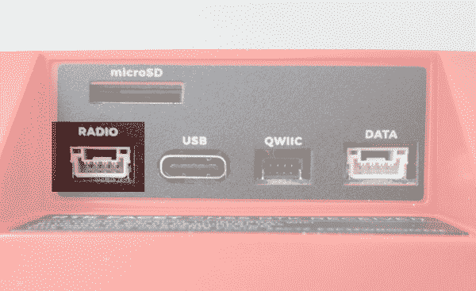](https://cdn.sparkfun.com/assets/learn_tutorials/2/1/8/8/SparkFun_RTK_Facet_-_Ports_-_Radio.jpg)

当需要外部蜂窝或无线电链路时，使用此端口。如果您通过蓝牙将 RTCM 从手机传输到 RTK Facet L-Band，此端口*不*使用。

这种 4 针 JST 连接器可用于在设备充当流动站时允许 RTCM 校正数据流入设备，或在设备充当基站时允许数据流出设备。该连接器是一个 4 针锁定 1.25 毫米 JST SMD 连接器(零件号:SM04B-GHS-TB，配套连接器零件号:GHR-04V-S)。RTK Facet L-Band 配有一根电缆来连接该连接器，但可以购买额外的电缆。如果你无法在互联网上访问校正源，你最有可能将这个端口连接到我们的[串行遥测无线电](https://www.sparkfun.com/products/19032)之一。引脚排列从左到右分别是 **3.5-5.5V** / TX / RX / GND 如图。 **3.5V 至 5.5V** 由该连接器提供，为收音机提供取决于电源的电压。如果 USB 连接到 RTK Facet L-Band，则该端口上的电压将为 **5V** (+/-10%)。如果使用内部电池，则此端口上的电压将随电池电压而变化(根据充电状态， **3.5V** 至 **4.2V** )。该端口能够提供高达 600mA 的电流，并受 PTC(可复位保险丝)保护。该端口不应连接到电源。

#### 数据

[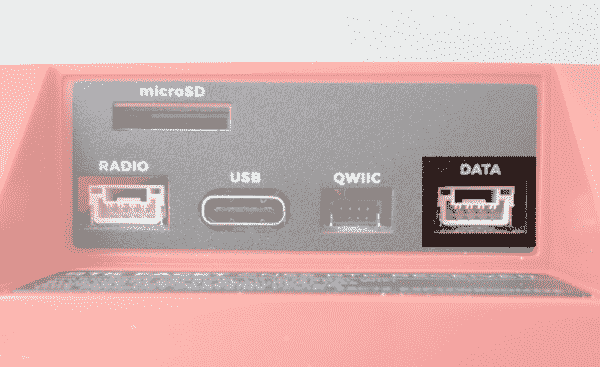](https://cdn.sparkfun.com/assets/learn_tutorials/2/1/8/8/SparkFun_RTK_Facet_-_Ports_-_Data.jpg)

该端口用于连接外部系统，如漫游车、汽车、计时设备、相机触发器等。如果您通过蓝牙从 RTK Facet L 波段向您的手机传输 NMEA 位置数据，此端口*不*使用。

该 4 引脚 JST 连接器用于向 RTK Facet L 波段输出和输入各种数据。该连接器是一个 4 针锁定 1.25 毫米 JST SMD 连接器(零件号:SM04B-GHS-TB，配套连接器零件号:GHR-04V-S)。RTK Facet L-Band 配有一根电缆来连接该连接器，但可以购买额外的电缆。

数据连接器内部连接到数字多路复用器，允许四种软件可选设置之一。参见[端口菜单](https://sparkfun.github.io/SparkFun_RTK_Firmware/configure_ports/)了解每个选项的描述。：

*   **NMEA**-TX 引脚输出任何使能的消息(NMEA、UBX 和 RTCM)，默认值为 460，800bps(可配置为 9600 至 921600bps)。RX 引脚可以接收 RTK 的 RTCM，如果需要，还可以接收 UBX 配置命令。
*   **PPS/Trigger**-TX 引脚输出精确到 30ns RMS 的每秒脉冲信号。RX 引脚连接到 ZED-F9P 的 EXTINT 引脚，允许以令人难以置信的精确纳秒分辨率测量事件。对于音频三角测量这样的事情很有用。
*   I ² C -在 I2C 总线上，TX 引脚作为 SCL 工作，RX 引脚作为 SDA 工作。这允许额外的传感器连接到 I2C 总线。
*   **GPIO**-TX 引脚作为 ESP32 上支持 DAC 的 GPIO。RX 引脚用作 ESP32 的 ADC 使能输入。这对自定义应用程序很有用。

大多数应用程序不需要使用该端口，而是通过蓝牙发送 NMEA 位置数据。该端口可用于向嵌入式微控制器或单板计算机发送位置数据。引脚排列为 **3.3V** / TX / RX / GND。 **3.3V** 如图从左到右，由该连接器提供，用于在需要时为远程设备供电。虽然该端口能够提供高达 600mA 的电流，但我们不建议超过 300mA。该端口不应连接到电源。

#### microSD

[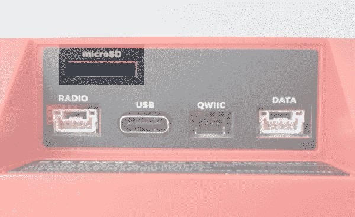](https://cdn.sparkfun.com/assets/learn_tutorials/2/1/8/8/SparkFun_RTK_Facet_-_Ports_-_microSD.jpg)

该插槽支持最高 32GB 的 FAT16 或 FAT32 格式的标准 microSD 卡。所有星座都支持以高达 4Hz 的频率记录 67 条消息中的任何一条。

日志记录支持以下 67 条消息:

| NMEA-GSA | NMEA 商品及服务税 | NMEA-GSV |
| NMEA-RMC | NMEA-VLW | NMEA-VTG |
| • NMEA-ZDA | 导航时钟 | 导航 DOP |
| • NAV-EOE | 导航地理围栏 | NAV-HPPOSECEF |
| NAV-HPPOSLLH | • NAV-ODO | 导航球 |
| 导航-POSECEF | 导航位置 | • NAV-PVT |
| 导航-重新定位 | 导航卫星系统 | • NAV-SIG |
| 导航状态 | • NAV-SVIN | • NAV-TIMEBDS |
| • NAV-TIMEGAL | 导航时间表 | • NAV-TIMEGPS |
| 导航时间 | • NAV-TIMEUTC | • NAV-VELECEF |
| • NAV-VELNED | RXM-MEASX | • RXM-RAWX |
| RXM-RLM | RXM-RTCM | XM-sfbx |
| MON 通信 | MON-HW2 | MON-HW3 |
| MON-HW | MON-IO | mon-msgid PP |
| MON-RF | mon-xbuf | 周一至 RXR |
| MON-TXBUF | 蒂姆·TM2 | • TIM-TP |
| TIM-VRFY | rtcm3x-1005 | RTCM3x-1074 |
| RTCM3x-1077 作业系统 | RTCM3x-1084 | RTCM3x-1087 |
| rtcm3x-1094 | RTCM3x-1097 | RTCM3x-1124 |
| RTCM3x-1127 | RTCM3x-1230 | rtcm3x-4072-0 |
| rtcm3x-4072-1 |  |  |

#### Qwiic

[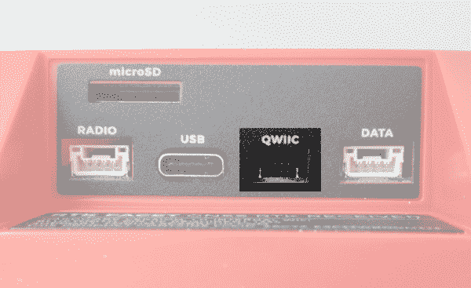](https://cdn.sparkfun.com/assets/learn_tutorials/2/1/8/8/SparkFun_RTK_Facet_-_Ports_-_Qwiic.jpg)

这个 4 针 [Qwiic 连接器](https://www.sparkfun.com/qwiic)暴露了 ESP32 WROOM 模块的 I2C 总线。目前，没有固件支持将 I ² C 设备添加到 RTK Facet L 波段，但未来可能会添加支持。

#### 天线

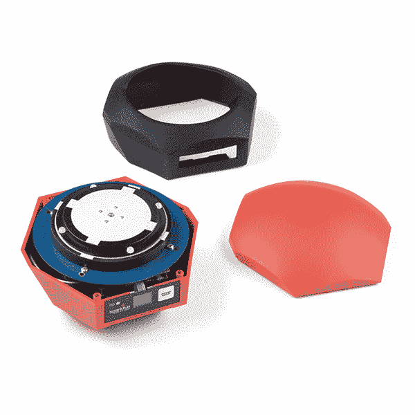

它是内置的！位于 RTK Facet L 波段圆顶下的是一个 L1/L2/L 波段勘测级天线。该天线是一种独特的元件组合，旨在接收 GNSS 信号(L1/L2)以及 1.55GHz PointPerfect 校正信号。内置天线从底座到 L1 天线测量点的 ARP 为 69 毫米，到 L2 天线测量点的 ARP 为 68 毫米。

[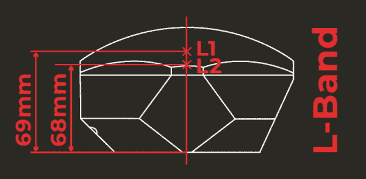](https://cdn.sparkfun.com/assets/learn_tutorials/2/5/8/3/SparkFun_RTK_Facet_L-Band_ARP.jpg)*SparkFun RTK Facet L-Band Antenna Reference Points*

内置天线从底座到 L1 天线测量点的 ARP[为 61.4 毫米，到 L2 天线测量点的 ARP 为 57.4 毫米。](https://geodesy.noaa.gov/ANTCAL/FAQ.xhtml#faq4)

### 力量

*RTK Facet L-Band Display showing three battery bars*

RTK Facet L-Band 内置 6000mAh 电池，在蓝牙连接激活和 GNSS 完全跟踪的情况下，最差功耗约为 240mA。这将允许在野外使用大约 25 小时。如果在野外需要更多时间，可以连接一个标准的 USB 电源组。如果连接一个 10，000mAh 的电池组，假设 RTK Facet L-Band 内的电源组和充电电路的效率损失了 25%,则可以估计运行时间为 56 小时。

RTK Facet L-Band 可以从任何 USB 端口或适配器充电。充电电路的额定电流为 1000 毫安，因此 USB 2.0 端口的充电电流为 500 毫安，USB 3.0+端口的充电电流为 1A。

要快速查看充电状态，请打开设备。电池图标将指示以下内容:

*   3 格:剩余 75%以上的容量
*   2 巴:剩余超过 50%的容量
*   1 巴:剩余 25%以上容量
*   0 小节:剩余容量小于 25%

## 硬件概述-高级功能

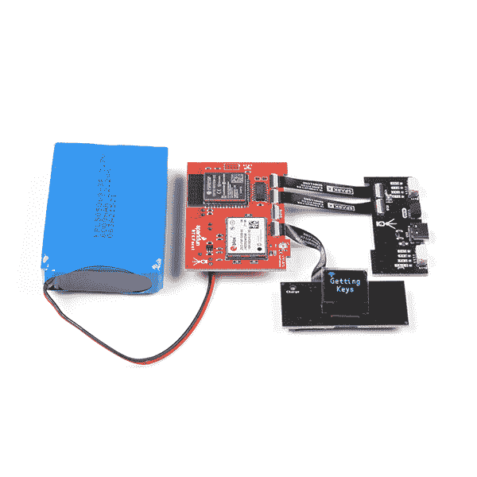*The boards that make up the RTK Facet L-Band*

RTK 刻面 L 波段是一个黑客的喜悦。在 RTK Facet L 波段的引擎盖下是一个连接到 ZED-F9P 以及一些外围硬件(LiPo 燃料计、microSD 等)的 ESP32 WROOM。它是用 Arduino 编程的，最终用户可以根据自己的需要进行定制。

[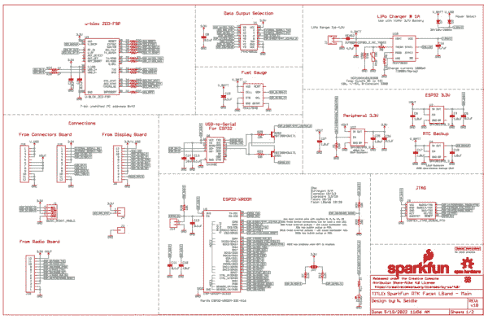](https://cdn.sparkfun.com/assets/d/4/b/3/1/SparkFun_RTK_Facet_L-Band_-_Main.pdf)*Click on the image to get a closer look at the Schematic!*[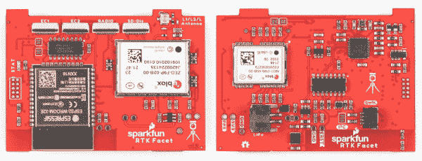](https://cdn.sparkfun.com/assets/learn_tutorials/2/5/8/3/SparkFun_RTK_Facet_L-Band_Main_Board.jpg)*The Facet L-Band Main Board*

### ZED-F9P 全球导航卫星系统接收器

[ZED-F9P GNSS 接收机](https://www.sparkfun.com/products/16481)配置在 I ² C 上，使用两个 UART 输出 NMEA (UART1)和输入/输出 RTCM (UART2)。一般而言，ESP32 从 ZED-F9Ps UART1 获取数据，用于蓝牙传输和记录至 SD。

### NEO-D9S L 波段接收机

NEO-D9S 通过 I ² C 进行配置。ESP32 在启动时向 ZED-F9P 发送解密密钥，然后从 NEO-D9S 获取加密的 PMP 数据，并通过 I ² C 向 ZED-F9P 发送数据包

### ESP32

[ESP32](https://www.sparkfun.com/products/15663) 使用标准 USB 转串行转换 IC ( [CH340](https://learn.sparkfun.com/tutorials/how-to-install-ch340-drivers/all) )对设备进行编程。你可以将 ESP32 内核用于 Arduino 或 Espressif 的[物联网开发框架(IDF)](https://www.espressif.com/en/support/download/all) 。

CH340 会自动重置，并根据需要将 ESP32 置于引导加载模式。然而，如果需要外部复位按钮，则 ESP32 的复位引脚被引出至外部 2 引脚 0.1 英寸尺寸。

**Note:** If you've never connected a CH340 device to your computer before, you may need to install drivers for the USB-to-serial converter. Check out our section on ["How to Install CH340 Drivers"](https://learn.sparkfun.com/tutorials/sparkfun-serial-basic-ch340c-hookup-guide#drivers-if-you-need-them) for help with the installation.

### 脂肪和充电

RTK 刻面 L 波段内置一个标准的 [6000mAh 3.7V LiPo](https://www.sparkfun.com/products/13856) 。充电电路设置为 1A，因此使用合适的电源，给空电池充电应该需要六个多小时。RTK Facet L-Band 上的 USB C 配置为 2A 汲取，因此如果用户连接到 USB 3.0 端口，充电电路应在 1A 最大值附近工作。如果用户连接到 USB 2.0 端口，充电电路将在 500mA 下工作。这种充电电路还包括一个 42℃的温度上限，以确保在危险的条件下不能充电。

### 燃油表和加速计

[MAX17048](https://cdn.sparkfun.com/assets/learn_tutorials/1/4/6/3/MAX17048-MAX17049.pdf) 是一款简单易用的燃油表 IC，它为用户提供一份基本上是 0-100%报告的充电状态(SOC)。MAX17048 有一个复杂的算法来计算基于电池电压的 SOC，这超出了本教程的范围，但出于我们的目的，允许我们在单元打开时可靠地查看电池电量。

RTK Facet L-Band 还集成了一个 [LIS2DH12](https://cdn.sparkfun.com/assets/learn_tutorials/1/8/5/7/lis2dh12_accelerometer_datasheet.pdf) 三轴加速度计，有助于现场调平。

### Qwiic

该装置包括一个内部 [Qwiic 连接器](https://www.sparkfun.com/qwiic)用于未来扩展。目前，stock RTK Facet L-Band 不支持任何额外的 Qwiic 传感器或显示器，但用户可以为自己的应用添加支持。

### microSD

一个 microSD 插座位于 ESP32 SPI 总线上。支持最高 32GB 的任何 microSD。RTK Facet L-Band 支持 RAWX 和 NMEA 记录到 SD 卡。还可以设置最大日志记录时间(默认为 24 小时)，以避免数千兆字节的文本文件。有关 RAWX 和 PPP 的更多信息，请参见本教程。

### 数据端口和数字多路复用器

74HC4052 模拟多路复用器控制哪些数字信号路由至外部数据端口。这允许各种定制的最终用户应用。其中最有趣的是事件日志。由于 ZED-F9P 对输入数字信号具有微秒级精度，因此可以创建定制固件，根据接收器的位置和多个捕获事件之间的时间延迟对事件进行三角测量。目前，支持 TM2 事件日志记录。

此外，该多路复用器可以配置为连接 ESP 引脚 26(支持 DAC)和引脚 39(支持 ADC ),用于最终用户定制应用。

## 硬件装配

RTK Facet L 波段设计用于低成本的现成设备。RTK Facet L-Band 旨在使用 u-blox 的 PointPerfect 系统提供的校正，因此不需要基地/流动站设置。然而，如果服务不可用，RTK Facet L 波段仍可用于传统的基站/流动站设置。在这里，我们将描述如何组装一个漫游者和基地。

### 测量(漫游模式)

[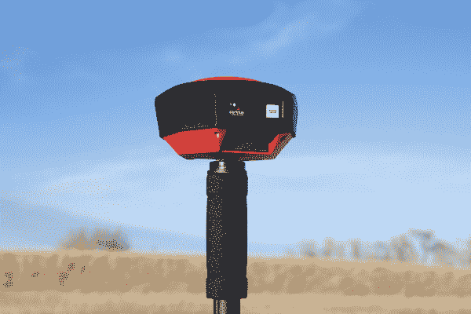](https://cdn.sparkfun.com/assets/learn_tutorials/2/1/8/8/SparkFun_RTK_Facet_-_On_Monopod.jpg)*Basic RTK Facet L-Band Rover setup with RTCM over Bluetooth*

上面显示的是最常见的 RTK 漫游者设置。使用为照相机设计的单极天线。单极天线的“相机线[适用于⅝”11-TPI](https://www.sparkfun.com/products/17546)，RTK 刻面 l 波段安装在顶部。不需要无线电，因为 RTCM 校正数据由电话通过蓝牙提供。

如果你要买一个单极天线(又名独脚架)，买一个长度为 65 英寸或更长的，以确保天线在你的头顶上。我们在亚马逊基础品牌上运气很好。

如果你喜欢将平板电脑或手机安装在单极天线上，一定要准备一个与单极天线的直径相匹配的夹子，并且要有一个旋钮来增加夹子的压力。我们的单极天线直径为 27 毫米，因此设备夹具需要能够处理该直径。

[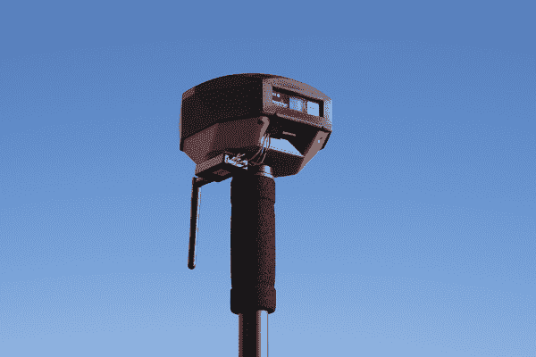](https://cdn.sparkfun.com/assets/learn_tutorials/2/1/8/8/SparkFun_RTK_Facet_-_External_Radio.jpg)*2nd most common setup with a 915MHz Radio providing RTCM*

如果您通过无线电链路接收 RTCM 校正数据，建议您在 RTK Facet L 波段的底部连接一个无线电。

[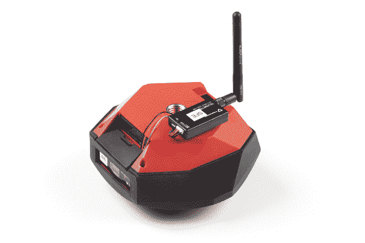](https://cdn.sparkfun.com/assets/learn_tutorials/2/1/8/8/SparkFun_RTK_Facet_-_External_Radio_Positioning.jpg)

来自 3M 公司的图片挂带是一个不错的半永久挂架。将 RTK Facet L-Band 附带的 4 针至 6 针 JST 电缆从**无线电**端口插入任一[串行遥测无线电](https://www.sparkfun.com/products/19032)(成对装运)。我们真的很喜欢这些无线电，因为它们是开箱即用的，既可以发送也可以接收(所以哪个无线电连接到基站或漫游器并不重要)，而且它们的覆盖范围很大。我们用 100mW 无线电和底座上的[大 915MHz 天线](https://www.sparkfun.com/products/retired/14868)实现了超过 1 英里的范围(接近 1.5 英里或 2.4 公里)。

### 临时基地

当您在现场距离校正源和/或蜂窝接收太远时，需要临时或移动基站设置。第二个 RTK Facet L-Band 安装在三脚架上，用于完成勘测(也称为自身定位)，然后开始广播 RTCM 校正数据。这些数据(每秒约 1000 字节)被发送到用户选择的连接无线电。出于我们的目的，使用 915MHz 100mW 遥测无线电，因为它们在我们的基地和漫游者之间提供了基本上是串行的电缆。

*Temporary RTK Facet L-Band Base setup*

任何带“相机线”的三脚架都可以。亚马逊基础三脚架工作得很好，但是有点轻而且不稳。“相机线是[适应⅝”11-TPI](https://www.sparkfun.com/products/17546)和 RTK 刻面 l 波段附在顶部。

一旦基地已经设置了一个清晰的天空视图，打开 RTK 刻面 L 波段。一旦打开，按下*设置*按钮，将设备置于基本模式。显示屏将显示调查屏幕 60-120 秒。一旦测量完成，显示器将显示“x 拟合”显示，并开始产生 RTCM 校正数据。您可以通过查看遥测无线电上的 LED 来验证这一点(当从 RTK Facet L-Band 接收到串行数据时，红色小 LED 将闪烁)。RTK Facet L-Band 的设计遵循 u-blox 建议的 60s 勘测范围和所有定位的平均 3D 标准偏差 5m。如果调查未能达到这些要求，它将在 10 分钟后自动重启。

**注意:**移动基站非常适合在野外快速移动。然而，不建议将测量方法用于最高精度的测量，因为基座的位置精度将直接转化为漫游者的精度。换句话说，如果你的基地的计算位置偏离了 100 厘米，那么你的漫游者的每个读数都会偏离。如果你在寻找最大的精确度，考虑安装一个带固定天线的[静态基座](https://learn.sparkfun.com/tutorials/how-to-build-a-diy-gnss-reference-station#static-base-setup--lasers)。我们能够使用 PPP 以令人难以置信的精度 [+/-2mm 的精度](https://cdn.sparkfun.com/assets/learn_tutorials/1/4/6/3/SparkFun_PPP_Results.png)精确定位 SparkFun 顶部的天线！

## 蓝牙和 NTRIP

RTK Facet L-Band 通过蓝牙串行端口配置文件(SPP)以 4Hz 和 115200bps 传输完整的 NMEA 句子。这意味着几乎所有可以通过串行端口接收 NMEA 数据的 GIS 应用程序(几乎所有都可以)都可以使用 RTK Facet L 波段。只要您的设备可以通过蓝牙(也称为 SPP)打开串行端口，您的设备就可以检索行业标准的 NMEA 位置数据。

请参见 [SparkFun RTK 产品手册](https://sparkfun.github.io/SparkFun_RTK_Firmware/connecting_bluetooth/)获取分步说明。

## 显示

RTK Facet L 波段具有 0.96 英寸高对比度有机发光二极管显示器。虽然很小，但它包含了各种情况数据，这些数据在野外可能会有所帮助。请参见 [SparkFun RTK 产品手册](https://sparkfun.github.io/SparkFun_RTK_Firmware/displays/)了解每个显示器的说明。

## 系统配置

开箱即用，SparkFun RTK 产品是出色的开箱即用 GNSS 接收机，只需很少或无需配置即可使用。此外，SparkFun 的 RTK 产品系列非常易于配置。请参见 [SparkFun RTK 产品手册](https://sparkfun.github.io/SparkFun_RTK_Firmware/intro/)了解 RTK 产品上所有可用功能的详细描述。

## 固件更新和定制

RTK Facet 是开源硬件，这意味着你可以完全访问[固件](https://github.com/sparkfun/SparkFun_RTK_Firmware)和[硬件](https://github.com/sparkfun/SparkFun_RTK_Facet)。

SparkFun 将不时发布 RTK 产品线的新固件，以增加和改进功能。我们已经尽可能容易地更新固件。请参见[更新 RTK 固件](https://sparkfun.github.io/SparkFun_RTK_Firmware/firmware_update/)获取分步指南。

## 解决纷争

**Not working as expected and need help?**

If you need technical assistance and more information on a product that is not working as you expected, we recommend heading on over to the [SparkFun Technical Assistance](https://www.sparkfun.com/technical_assistance) page for some initial troubleshooting.

[SparkFun Technical Assistance Page](https://www.sparkfun.com/technical_assistance)

If you don't find what you need there, the [SparkFun Forums](https://forum.sparkfun.com/index.php) are a great place to find and ask for help. If this is your first visit, you'll need to [create a Forum Account](https://forum.sparkfun.com/ucp.php?mode=register) to search product forums and post questions.

[Create New Forum Account](https://forum.sparkfun.com/ucp.php?mode=register)   [Log Into SparkFun Forums](https://forum.sparkfun.com/index.php)

## 资源和更进一步

我们希望你像我们一样喜欢使用 RTK Facet L 波段！

以下是 RTK Facet L 波段的相关技术文档:

*   [RTK 产品手册](https://sparkfun.github.io/SparkFun_RTK_Firmware/intro/)
*   [ZED-F9P 数据表](https://cdn.sparkfun.com/assets/a/8/5/f/5/ZED-F9P-04B_DataSheet_UBX-21044850.pdf)
*   [NEO-D9S 数据表](https://cdn.sparkfun.com/assets/0/0/4/f/7/NEO-D9S-00B_DataSheet_UBX-18012996.pdf)
*   [MAX17048 燃油表 IC](https://cdn.sparkfun.com/assets/learn_tutorials/1/4/6/3/MAX17048-MAX17049.pdf)
*   [spark fun RTK Facet GitHub Repo](https://github.com/sparkfun/SparkFun_RTK_Facet)(包含开源硬件电子设备和外壳)
*   [SparkFun RTK 固件 GitHub Repo](https://github.com/sparkfun/SparkFun_RTK_Surveyor) (包含运行 SparkFun RTK 产品的固件)

查看这些附加教程，供您阅读:

 [### GPS 记录器屏蔽连接指南](https://learn.sparkfun.com/tutorials/gps-logger-shield-hookup-guide) How to assemble and hookup the SparkFun GPS Logger Shield. Never lose track of your Arduino again 6 [### 建造自主车辆:蝙蝠战车](https://learn.sparkfun.com/tutorials/building-an-autonomous-vehicle-the-batmobile) Documenting a six-month project to race autonomous Power Wheels at the SparkFun Autonomous Vehicle Competition (AVC) in 2016\.[Favorited Favorite](# "Add to favorites") 8 [### GNSS 芯片天线连接指南](https://learn.sparkfun.com/tutorials/gnss-chip-antenna-hookup-guide) You've always wanted to experiment with those tiny GPS antennas. Now you can 1 [### GNSS 校正数据接收器(NEO-D9S)连接指南](https://learn.sparkfun.com/tutorials/gnss-correction-data-receiver-neo-d9s-hookup-guide) Add GNSS correction data to your high precision GNSS (HPG) receiver with the u-blox NEO-D9S! This tutorial will get you started with the ZED-F9P, NEO-D9S, and the ESP32 IoT RedBoard.[Favorited Favorite](# "Add to favorites") 1 [### ESP32 Thing Plus 连接指南](https://learn.sparkfun.com/tutorials/esp32-thing-plus-hookup-guide) Hookup guide for the ESP32 Thing Plus (Micro-B) using the ESP32 WROOM's WiFi/Bluetooth system-on-chip in Arduino.[Favorited Favorite](# "Add to favorites") 8 [### 如何安装 CH340 驱动程序](https://learn.sparkfun.com/tutorials/how-to-install-ch340-drivers) How to install CH340 drivers (if you need them) on Windows, Mac OS X, and Linux.[Favorited Favorite](# "Add to favorites") 9 [### 设置基于流动站的 RTK 系统](https://learn.sparkfun.com/tutorials/setting-up-a-rover-base-rtk-system) Getting GNSS RTCM correction data from a base to a rover is easy with a serial telemetry radio! We'll show you how to get your high precision RTK GNSS system setup and running.[Favorited Favorite](# "Add to favorites") 15 [### 如何建立一个 DIY GNSS 参考站](https://learn.sparkfun.com/tutorials/how-to-build-a-diy-gnss-reference-station) Learn how to affix a GNSS antenna, use PPP to get its ECEF coordinates and then broadcast your own RTCM data over the internet and cellular using NTRIP to increase rover reception to 10km 14**********