# Qwiic 压力传感器(BMP384)连接指南

> 原文：<https://learn.sparkfun.com/tutorials/qwiic-pressure-sensor-bmp384-hookup-guide>

## 介绍

SparkFun [压力传感器- BMP384 Qwiic](https://www.sparkfun.com/products/19662) 和[微型压力传感器- BMP384 (Qwiic)](https://www.sparkfun.com/products/19833) 采用博世^(T5 的 BMP384 数字压力传感器。BMP384 在高分辨率测量(高达 21 位)方面表现出色，并使用凝胶填充的空腔来提供对液体(水和其他化学物质)的额外抵抗，使其成为在各种环境中监控压力的绝佳选择，尽管传感器不是*防水的。*)

[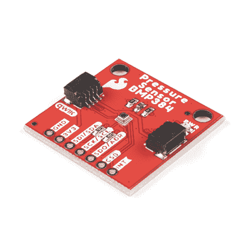](https://www.sparkfun.com/products/19662) 

将**添加到您的[购物车](https://www.sparkfun.com/cart)中！**

 **### [](https://www.sparkfun.com/products/19662)

[In stock](https://learn.sparkfun.com/static/bubbles/ "in stock") SEN-19662

SparkFun Qwiic 压力传感器采用 BMP384，擅长高分辨率测量(最高 21 位)。

$15.95[Favorited Favorite](# "Add to favorites") 2[Wish List](# "Add to wish list")****[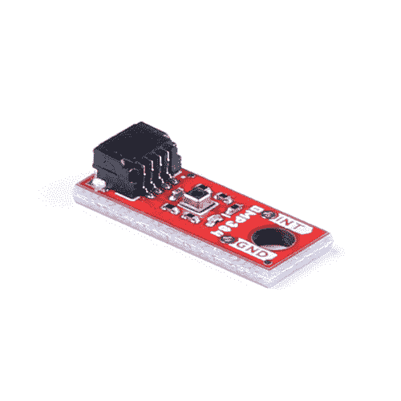](https://www.sparkfun.com/products/19833) 

将**添加到您的[购物车](https://www.sparkfun.com/cart)中！**

 **### [【spark fun 微型压力传感器- BMP384 (Qwiic)](https://www.sparkfun.com/products/19833)

[In stock](https://learn.sparkfun.com/static/bubbles/ "in stock") SEN-19833

SparkFun Qwiic 微型压力传感器采用 BMP384，擅长高分辨率测量(高达 21 位)，所有 o…

$16.95[Favorited Favorite](# "Add to favorites") 0[Wish List](# "Add to wish list")**** ****[https://www.youtube.com/embed/eGXE8o36e4E/?autohide=1&border=0&wmode=opaque&enablejsapi=1](https://www.youtube.com/embed/eGXE8o36e4E/?autohide=1&border=0&wmode=opaque&enablejsapi=1)

本指南将带您了解这些 Qwiic 分线点上的硬件，如何将它们连接到 Qwiic 电路，以及如何将传感器与 SparkFun BMP384 Arduino 库配合使用。

### 所需材料

按照本指南，您需要一个微控制器与 BMP384 通信。以下是一些开箱即用的 Qwiic 选项:

[](https://www.sparkfun.com/products/15663) 

将**添加到您的[购物车](https://www.sparkfun.com/cart)中！**

 **### [【spark fun Thing Plus-ESP32 WROOM(微-B)](https://www.sparkfun.com/products/15663)

[Out of stock](https://learn.sparkfun.com/static/bubbles/ "out of stock") WRL-15663

SparkFun ESP32 Thing Plus 是开始使用 Espressif 物联网概念的下一步，同时还可以享受所有的便利设施

$22.5010[Favorited Favorite](# "Add to favorites") 48[Wish List](# "Add to wish list")****[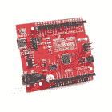](https://www.sparkfun.com/products/18158) 

将**添加到您的[购物车](https://www.sparkfun.com/cart)中！**

 **### [SparkFun RedBoard 加](https://www.sparkfun.com/products/18158)

[In stock](https://learn.sparkfun.com/static/bubbles/ "in stock") DEV-18158

RedBoard Plus 是一款兼容 Arduino 的开发板，拥有 Arduino Uno 所需的一切，并具有额外的额外功能…

$21.504[Favorited Favorite](# "Add to favorites") 12[Wish List](# "Add to wish list")****[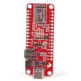](https://www.sparkfun.com/products/15574) 

将**添加到您的[购物车](https://www.sparkfun.com/cart)中！**

 **### [火花趣事 Plus——阿尔忒弥斯](https://www.sparkfun.com/products/15574)

[25 available](https://learn.sparkfun.com/static/bubbles/ "25 available") WRL-15574

SparkFun Artemis Thing Plus 采用了我们流行的羽毛足迹，并添加了强大的 Artemis 模块，以实现终极功能

$22.50[Favorited Favorite](# "Add to favorites") 28[Wish List](# "Add to wish list")****[](https://www.sparkfun.com/products/15444) 

将**添加到您的[购物车](https://www.sparkfun.com/cart)中！**

 **### [SparkFun RedBoard Artemis](https://www.sparkfun.com/products/15444)

[In stock](https://learn.sparkfun.com/static/bubbles/ "in stock") DEV-15444

RedBoard Artemis 采用 SparkFun 的功能强大的 Artemis 模块，并将其包装在一个易于使用和熟悉的环境中…

$21.509[Favorited Favorite](# "Add to favorites") 32[Wish List](# "Add to wish list")******** ********如果您选择的微控制器尚未启用 Qwiic，您可以添加以下一项或多项功能:

[](https://www.sparkfun.com/products/15081) 

将**添加到您的[购物车](https://www.sparkfun.com/cart)中！**

 **### [SparkFun Qwiic 线缆套件](https://www.sparkfun.com/products/15081)

[In stock](https://learn.sparkfun.com/static/bubbles/ "in stock") KIT-15081

为了更容易上手，我们用 50 毫米到 500 毫米的各种 Qwiic 电缆组装了 Qwiic 电缆套件…

$8.9516[Favorited Favorite](# "Add to favorites") 58[Wish List](# "Add to wish list")****[](https://www.sparkfun.com/products/14495) 

将**添加到您的[购物车](https://www.sparkfun.com/cart)中！**

 **### [SparkFun Qwiic 适配器](https://www.sparkfun.com/products/14495)

[In stock](https://learn.sparkfun.com/static/bubbles/ "in stock") DEV-14495

SparkFun Qwiic 适配器提供了将任何旧 I ² C 板改造成支持 Qwiic 的板的完美方法。

$1.601[Favorited Favorite](# "Add to favorites") 53[Wish List](# "Add to wish list")****[](https://www.sparkfun.com/products/14352) 

将**添加到您的[购物车](https://www.sparkfun.com/cart)中！**

 **### [ArduinoT3 的 SparkFun Qwiic 盾](https://www.sparkfun.com/products/14352)

[In stock](https://learn.sparkfun.com/static/bubbles/ "in stock") DEV-14352

SparkFun Qwiic Shield 是一种易于组装的板，它提供了一种简单的方法来将 Qwiic Connect 系统与

$7.508[Favorited Favorite](# "Add to favorites") 39[Wish List](# "Add to wish list")****[](https://www.sparkfun.com/products/16790) 

将**添加到您的[购物车](https://www.sparkfun.com/cart)中！**

 **### [SparkFun Qwiic 盾为物加](https://www.sparkfun.com/products/16790)

[In stock](https://learn.sparkfun.com/static/bubbles/ "in stock") DEV-16790

SparkFun Qwiic Shield for Thing Plus 使您可以使用 spark fun 的 Qwiic connect 生态系统和开发板来测试

$4.95[Favorited Favorite](# "Add to favorites") 7[Wish List](# "Add to wish list")******** ********您还需要至少一根 Qwiic 电缆将传感器连接到微控制器。

[](https://www.sparkfun.com/products/14427) 

将**添加到您的[购物车](https://www.sparkfun.com/cart)中！**

 **### [Qwiic 线缆- 100mm](https://www.sparkfun.com/products/14427)

[In stock](https://learn.sparkfun.com/static/bubbles/ "in stock") PRT-14427

这是一条 100 毫米长的 4 芯电缆，带有 1 毫米 JST 端接。它旨在将支持 Qwiic 的组件连接在一起…

$1.50[Favorited Favorite](# "Add to favorites") 32[Wish List](# "Add to wish list")****[](https://www.sparkfun.com/products/14429) 

将**添加到您的[购物车](https://www.sparkfun.com/cart)中！**

 **### [Qwiic 线缆- 500mm](https://www.sparkfun.com/products/14429)

[In stock](https://learn.sparkfun.com/static/bubbles/ "in stock") PRT-14429

这是一根 500mm 长的 4 芯电缆，带有 1mm JST 端接。它旨在将支持 Qwiic 的组件连接在一起…

$1.951[Favorited Favorite](# "Add to favorites") 25[Wish List](# "Add to wish list")****[](https://www.sparkfun.com/products/14426) 

将**添加到您的[购物车](https://www.sparkfun.com/cart)中！**

 **### [Qwiic 线缆- 50mm](https://www.sparkfun.com/products/14426)

[In stock](https://learn.sparkfun.com/static/bubbles/ "in stock") PRT-14426

这是一根 50 毫米长的 4 芯电缆，带有 1 毫米 JST 端接。它旨在将支持 Qwiic 的组件连接在一起…

$0.95[Favorited Favorite](# "Add to favorites") 29[Wish List](# "Add to wish list")****[](https://www.sparkfun.com/products/14428) 

### [Qwiic 线缆- 200mm](https://www.sparkfun.com/products/14428)

[Out of stock](https://learn.sparkfun.com/static/bubbles/ "out of stock") PRT-14428

这是一根 200 毫米长的 4 芯电缆，带有 1 毫米 JST 端接。它旨在将支持 Qwiic 的组件连接在一起…

[Favorited Favorite](# "Add to favorites") 21[Wish List](# "Add to wish list")****** ******### 推荐阅读

如果你不熟悉 Qwiic 系统，我们推荐你在这里阅读[以获得一个概述](https://www.sparkfun.com/qwiic)。

| [](https://www.sparkfun.com/qwiic) |

如果你不熟悉下面的教程，我们也建议你看一看。如果您正在使用上面列出的 Qwiic Shields 之一，在开始使用 SparkFun 压力传感器- BMP384 (Qwiic)之前，您可能也想通读它们各自的连接指南。

[](https://learn.sparkfun.com/tutorials/i2c) [### I2C](https://learn.sparkfun.com/tutorials/i2c) An introduction to I2C, one of the main embedded communications protocols in use today.[Favorited Favorite](# "Add to favorites") 128[](https://learn.sparkfun.com/tutorials/terminal-basics) [### 串行终端基础知识](https://learn.sparkfun.com/tutorials/terminal-basics) This tutorial will show you how to communicate with your serial devices using a variety of terminal emulator applications.[Favorited Favorite](# "Add to favorites") 46[](https://learn.sparkfun.com/tutorials/qwiic-shield-for-arduino--photon-hookup-guide) [### Arduino 和光子连接指南的 Qwiic 屏蔽](https://learn.sparkfun.com/tutorials/qwiic-shield-for-arduino--photon-hookup-guide) Get started with our Qwiic ecosystem with the Qwiic shield for Arduino or Photon.[Favorited Favorite](# "Add to favorites") 5[](https://learn.sparkfun.com/tutorials/sparkfun-qwiic-shield-for-arduino-nano-hookup-guide) [### Arduino Nano 连接指南的 SparkFun Qwiic 盾](https://learn.sparkfun.com/tutorials/sparkfun-qwiic-shield-for-arduino-nano-hookup-guide) Hookup Guide for the SparkFun Qwiic Shield for Arduino Nano.[Favorited Favorite](# "Add to favorites") 1

## 硬件概述

让我们仔细看看 BMP384 传感器和这些 Qwiic 分会场上的其他硬件。

### BMP384 压力传感器

BMP384 是博世公司的高分辨率数字压力传感器，具有宽测量范围(300hPa 至 1250hPa)和出色的精度。

| [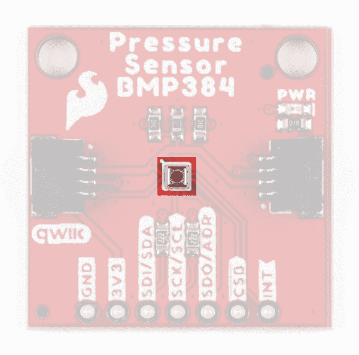](https://cdn.sparkfun.com/assets/learn_tutorials/2/4/2/0/Qwiic_BMP384-Sensor.jpg) | [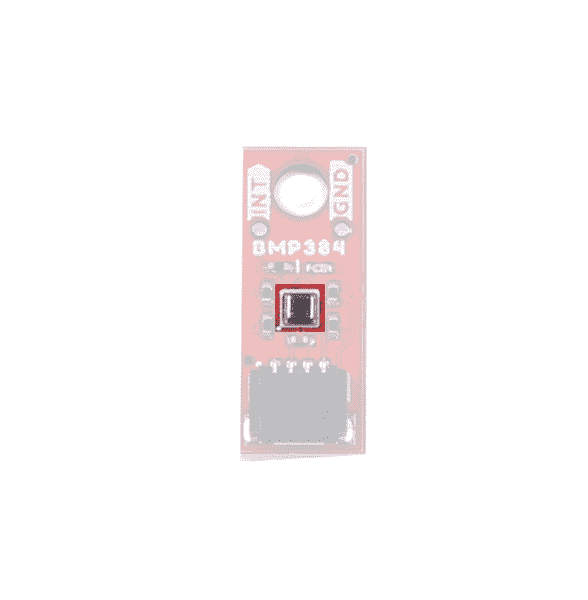](https://cdn.sparkfun.com/assets/learn_tutorials/2/4/2/0/Qwiic_Micro_BMP381-Sensor.jpg) |

该传感器测量压力和温度的平均精度分别为 0.09 百帕(300 百帕至 1250 百帕)和 0.35 摄氏度(25 摄氏度时)。该传感器支持最高 21 位分辨率、过采样、低通滤波和最大 200Hz 采样速率，适合各种应用。它使用凝胶填充的空腔来提高传感器的防潮性能(尽管不防水)，因此它在传感器可能暴露于液体的应用中工作良好(户外传感器、无人机、气象气球等)。).有关传感器的完整概述，请参考[数据表](https://cdn.sparkfun.com/assets/0/c/d/5/3/bmp384-datasheet.pdf)。

BMP384 接受的电源电压在 **1.65V** 到 **3.6V** 之间。当连接到 Qwiic 系统时，分线点在 **3.3V** 电源和逻辑下运行传感器。BMP384 在 I ² C 上支持最高 3.4MHz 的数据传输速度，在 SPI 上支持最高 10MHz 的数据传输速度。该传感器还包括一个可配置的中断引脚，该引脚连接到 PTH 接头上的一个引脚。

BMP384 有三种工作模式:睡眠模式(复位后默认)、正常模式和强制模式。在睡眠模式下，传感器处于空闲状态，功耗约为 2 A。在正常模式下，传感器自动在测量和待机期间循环，测量期间峰值功耗约为 700 A。强制模式允许直接控制测量，以将传感器从睡眠模式唤醒，进行单次测量，并将设备返回睡眠模式。

| 参数 | 量滴 | 典型。 | 最大值 | 单位 | 笔记 |
| 工作温度 | -40 | Twenty-five | eighty-five | C |  |
| 操作压力 | Three hundred | - | One thousand two hundred and fifty | 高功率放大器（high-power amplifier 的缩写） |  |
| 相对精度 | - | ±9 | - | Pa | 在 900-1110 百帕和 25-40 摄氏度时 |
| 绝对精度 | - | ±50 | - | Pa | 在 300-1100 百帕和 0-65 摄氏度时 |
| 在…之时柯夫。抵消 | - | ±1.0 | - | 帕/克 | 在 900 百帕和 25-40 摄氏度时 |
| 压力均方根噪声 ^([1](#BMP384_Note)) | - | One point two | - | Pa | 全带宽，最高分辨率。 |
| - | Zero point zero three | - | Pa | 最低带宽，最高分辨率。 |
| 采样率 ^([2](#BMP384_Note2)) | - | - | Two hundred | 赫兹 | 取决于过采样设置 *osr_t* 和 *osr_p* 。 |

[**1.**](https://learn.sparkfun.com/tutorials/qwiic-pressure-sensor-bmp384-hookup-guide#BMP384_Note) Refer to section 3.4.4 of the BMP384 datasheet for more information.
[**2.**](https://learn.sparkfun.com/tutorials/qwiic-pressure-sensor-bmp384-hookup-guide#BMP384_Note2) Refer to section 3.9 of the BMP384 datasheet for more information.

### 通信接口- I ² C & SPI

默认情况下，Qwiic 压力传感器(BMP384)分线点通过 I ² C 进行通信。标准尺寸的分线点还支持通过 SPI 使用 BMP384(遗憾的是，Qwiic 微型版上没有 SPI)。

| [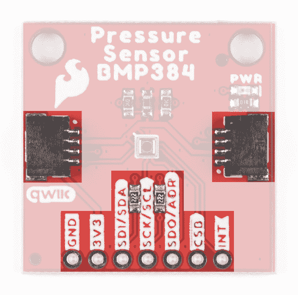](https://cdn.sparkfun.com/assets/learn_tutorials/2/4/2/0/Qwiic_BMP384-I2C_SPI.jpg) | [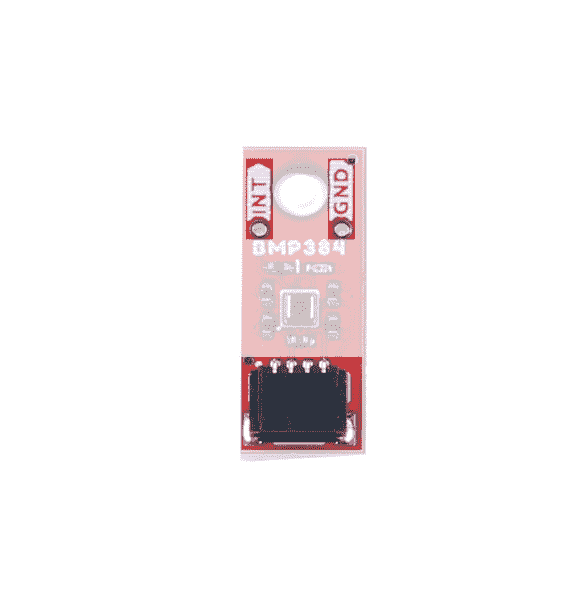](https://cdn.sparkfun.com/assets/learn_tutorials/2/4/2/0/Qwiic_Micro_BMP381-Qwiic_PTHs.jpg) |

标准分线点将 I ² C 接口连接到一对 Qwiic 连接器和一个 0.1 英寸间距的 PTH 接头，适合喜欢传统焊接连接的用户。该 PTH 接头共享 SPI 连接，也包括中断引脚。

微型分线点将 I ² C 接口连接到一个 Qwiic 连接器，并包括中断引脚的 PTH 以及需要该连接的项目的第二个接地引脚。

默认情况下，这些板将 BMP384 的 I ² C 地址设置为 **0x77** 。调整 ADR 跳线以切换到备用地址( **0x76** )或保持完全打开以使用 SPI 接口。有关该跳线的更多信息，请参见下面的“焊料跳线”部分。

### 焊料跳线

If you have never worked with solder jumpers and PCB traces before or would like a quick refresher, check out our [How to Work with Solder Jumpers and PCB Traces](https://learn.sparkfun.com/tutorials/how-to-work-with-jumper-pads-and-pcb-traces) tutorial for detailed instructions and tips.

分线点有三个焊接跳线，标记为: **I2C** 、 **ADR** 和 **LED** 。

| [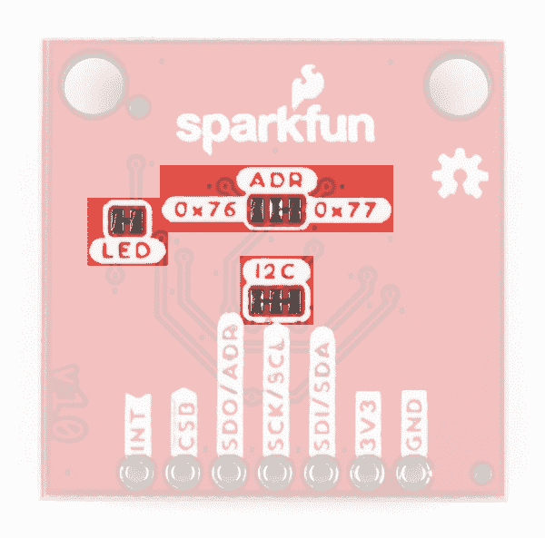](https://cdn.sparkfun.com/assets/learn_tutorials/2/4/2/0/Qwiic_BMP384-Solder_Jumpers.jpg) | [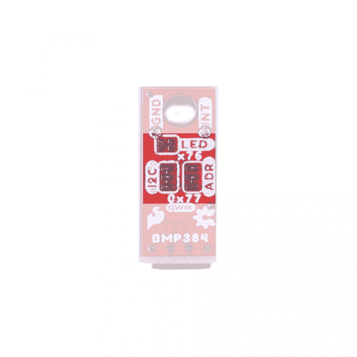](https://cdn.sparkfun.com/assets/learn_tutorials/2/4/2/0/Qwiic_Micro_BMP381-Solder_Jumpers.jpg) |

I ² C 跳线连接一对 **2.2k &欧姆；**SDA/SCL 线的电阻。除非你在同一条总线上有大量的 I ² C 设备，否则保持启用状态。

ADR 跳线默认将 BMP384 的 I ² C 地址设置为**0x 77**(**0x 76**备用)。它还控制是通过 I ² C 还是 SPI 操作。完全打开跳线，将 BMP384 设置为通过 SPI 通信(仅限标准尺寸)。

LED 跳线完成电源 LED 电路。如果需要，打开跳线以禁用电源指示灯。

### 电路板尺寸

标准尺寸的 Qwiic 分线点与带有两个安装孔的 Qwiic 分线点的 1.0 英寸 x 1.0 英寸(25.4 毫米 x 25.4mm 毫米)外形相匹配，这两个安装孔可安装尺寸为 [4-40 的螺钉](https://www.sparkfun.com/products/10453)。这种分线装置的微型版本与 Qwiic 微型外形相匹配，尺寸为 0.75 英寸 x 0.30 英寸(24.65 毫米 x 7.62mm 毫米)，有一个安装孔，可安装 4-40 号螺钉。

| [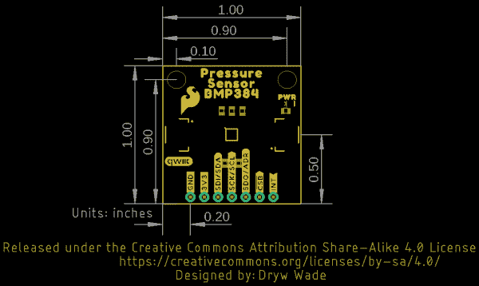](https://cdn.sparkfun.com/assets/learn_tutorials/2/4/2/0/Qwiic_BMP384-Dimensions.png) | [](https://cdn.sparkfun.com/assets/learn_tutorials/2/4/2/0/Qwiic_BMP384_Micro-Dimensions.png) |

## 硬件装配

现在我们已经熟悉了 Qwiic 压力传感器(BMP384)，我们可以开始组装电路了。

### Qwiic/I ² C 总成

开始使用分线点最快、最简单的方法是将分线点上的 Qwiic 连接器连接到支持 Qwiic 的开发板，如 SparkFun RedBoard Artemis，使用 Qwiic 电缆，如下图所示。

[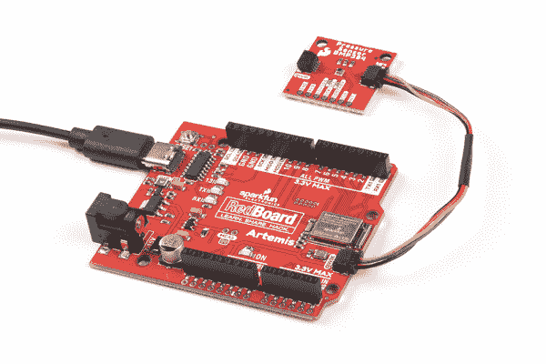](https://cdn.sparkfun.com/assets/learn_tutorials/2/4/2/0/Qwiic_BMP384-Arduino_Assembly.jpg)

如果您希望与标准尺寸的分线点实现更安全、更持久的连接，您可以将接头焊接或接线至电路板上的 PTH 接头。

### SPI 组件(仅标准尺寸)

设置分线点以通过 SPI 与传感器通信需要完全打开 ADR 跳线，我们建议焊接到 PTH 接头进行连接。如果您不熟悉通孔焊接，请通读本教程:

[](https://learn.sparkfun.com/tutorials/how-to-solder-through-hole-soldering) [### 如何焊接:通孔焊接

#### 2013 年 9 月 19 日](https://learn.sparkfun.com/tutorials/how-to-solder-through-hole-soldering) This tutorial covers everything you need to know about through-hole soldering.[Favorited Favorite](# "Add to favorites") 70

除了焊接工具，你还需要一些连接线或接头和跳线。切断 ADR 跳线的“中心”和“右侧”焊盘之间的走线，切换到 SPI 模式。打开此跳线后，将 BMP384 连接到控制器的 SPI 总线引脚。

[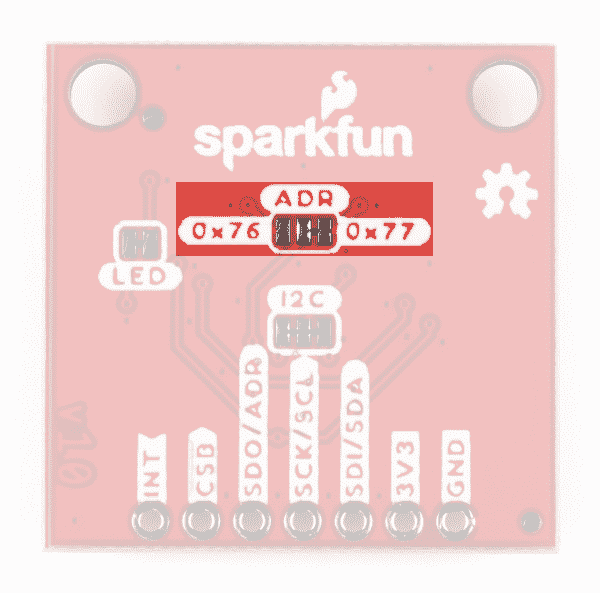](https://cdn.sparkfun.com/assets/learn_tutorials/2/4/2/0/Qwiic_BMP384-ADR_Jumper.jpg)

请记住，BMP384 在 **3.3V 逻辑**下运行，因此请确保连接到运行在相同[逻辑电平](https://learn.sparkfun.com/tutorials/logic-levels)的电路板，如 [RedBoard Artemis](https://www.sparkfun.com/products/15444) 或使用[电平转换器](https://www.sparkfun.com/categories/361)将其调整到安全电压。

## SparkFun BMP384 Arduino 库

**注意:**该库假设您在桌面上使用的是最新版本的 Arduino IDE。如果这是你第一次使用 Arduino，请回顾我们关于[安装 Arduino IDE 的教程。](https://learn.sparkfun.com/tutorials/installing-arduino-ide)如果您之前没有安装 Arduino 库，请查看我们的[安装指南。](https://learn.sparkfun.com/tutorials/installing-an-arduino-library)

SparkFun BMP384 Arduino 库基于 Bosch 传感器的 API。通过 Arduino 库管理器工具搜索**“spark fun BMP 384”**安装库。喜欢手动安装库的用户可以通过点击下面的按钮从 GitHub 库下载一个副本:

[SparkFun BMP384 Arduino Library (ZIP)](https://github.com/sparkfun/SparkFun_BMP384_Arduino_Library/archive/refs/heads/main.zip)**Heads Up!** We recommend choosing a development board with plenty of available RAM like the RedBoard Artemis shown in the Hardware Assembly section if you want to use the FIFO buffer as it is read all at once which causes some microcontrollers like the ATMega328 on the RedBoard/Uno to run out of RAM after just a few samples. All other use cases of the Arduino Library will work with most microcontrollers.

### 库函数

下表概述并描述了 SparkFun BMP384 库中可用的功能:

#### 传感器初始化和模式选择

*   `int8_t beginI2C(uint8_t address = BMP384_I2C_ADDRESS_DEFAULT, TwoWire& wirePort = Wire);` -初始化 I ² C 中指定地址和指定有线端口上的 BMP384。
*   `int8_t beginSPI(uint8_t csPin, uint32_t clockFrequency = 100000);` -以指定频率(默认值为 100000)在 SPI 模式下初始化 BMP384，并设置片选引脚。
*   `int8_t init();` -初始化 BMP384。begin 函数自动执行此操作。
*   `int8_t setMode(uint8_t mode);` -手动设置 BMP384 的工作模式。在 begin 函数中默认设置为 Normal。
*   `int8_t enablePressAndTemp(uint8_t pressEnable, uint8_t tempEnable);` -启用压力和温度测量。在 begin 函数中默认启用。

#### 传感器数据

*   `int8_t getSensorData(bmp3_data* data);` -从传感器返回压力和温度数据。
*   `int8_t getSensorStatus(bmp3_sens_status* sensorStatus);` -返回命令就绪、压力数据就绪&温度和通电复位参数的状态。
*   `int8_t setODRFrequency(uint8_t odr);` -设置输出数据速率频率。
*   `int8_t getODRFrequency(uint8_t* odr);` -检索为输出数据速率频率存储的值。
*   `int8_t setOSRMultipliers(bmp3_odr_filter_settings osrMultipliers);` -设置过采样率乘数。
*   `int8_t getOSRMultipliers(bmp3_odr_filter_settings* osrMultipliers);` -检索为过采样乘法器设置的值。
*   `int8_t setFilterCoefficient(uint8_t coefficient);` -设置低通滤波器系数。
*   `int8_t setInterruptSettings(bmp3_int_ctrl_settings interruptSettings);` -设置中断设置(输出模式、电平、锁存和数据就绪)。有关设置和使用中断引脚的详细演示，请参考 Arduino 库中的[示例 3 -中断](https://github.com/sparkfun/SparkFun_BMP384_Arduino_Library/blob/main/examples/Example3_Interrupts/Example3_Interrupts.ino)。
*   `int8_t getInterruptStatus(bmp3_int_status* interruptStatus);` -返回中断的设置。

#### FIFO 缓冲控制

有关设置和使用 FIFO 缓冲器的详细示例，请参考 Arduino 库中的[示例 6 - FIFO 缓冲器](https://github.com/sparkfun/SparkFun_BMP384_Arduino_Library/blob/main/examples/Example6_FIFOBuffer/Example6_FIFOBuffer.ino)。

*   `int8_t setFIFOSettings(bmp3_fifo_settings fifoSettings);` -设置 FIFO 缓冲设置。
*   `int8_t setFIFOWatermark(uint8_t numData);` -设置 FIFO 水印的样本数。
*   `int8_t getFIFOLength(uint8_t* numData);` -返回 FIFO 缓冲器中数据样本的数量。
*   `int8_t getFIFOData(bmp3_data* data, uint8_t numData);` -提取存储在 BMP384 上的 FIFO 数据。
*   `int8_t flushFIFO();` -清除 FIFO 缓冲器。

## Arduino 示例

让我们仔细看看 SparkFun BMP384 Arduino 库中包含的几个示例。

### 示例 1 -基本读数 I ² C

第一个示例使用默认设置初始化 BMP384，以通过 I ² C 进行通信。导航至**文件** **示例> SparkFun BMP384 Arduino 库>Example _ 1 _ Basic _ readings I2C**打开示例。选择您的主板和端口，然后单击上传。上传完成后，打开[串行监视器](https://learn.sparkfun.com/tutorials/terminal-basics)，将波特率设置为 **115200** ，观察压力数据(帕斯卡)的打印结果。

如果您已经切换到备用地址，请用正确的值注释/取消注释该行:

```
language:c
uint8_t i2cAddress = BMP384_I2C_ADDRESS_DEFAULT; // 0x77
//uint8_t i2cAddress = BMP384_I2C_ADDRESS_SECONDARY; // 0x76 
```

代码试图用 I ² C 中指定地址的默认设置初始化传感器，如果无法正确初始化，则打印出错误信息:

```
language:c
while(pressureSensor.beginI2C(i2cAddress) != BMP3_OK)
{
    // Not connected, inform user
    Serial.println("Error: BMP384 not connected, check wiring and I2C address!");

    // Wait a bit to see if connection is established
    delay(1000);
} 
```

初始化后，主循环每秒轮询一次 BMP384 的压力和温度数据。如果数据轮询失败，代码将打印出一个错误代码用于调试。试着上下移动传感器，只要移动几英寸，你就会看到压力读数的明显差异。

```
language:c
void loop()
{
    // Get measurements from the sensor
    bmp3_data data = {0};
    int8_t err = pressureSensor.getSensorData(&data);

    // Check whether data was acquired successfully
    if(err == BMP3_OK)
    {
        // Acquisistion succeeded, print temperature and pressure
        Serial.print("Temperature (C): ");
        Serial.print(data.temperature);
        Serial.print("\t\t");
        Serial.print("Pressure (Pa): ");
        Serial.println(data.pressure);
    }
    else
    {
        // Acquisition failed, most likely a communication error (code -2)
        Serial.print("Error getting data from sensor! Error code: ");
        Serial.println(err);
    }

    // Only print every second
    delay(1000);
} 
```

### 示例 4 -过滤

示例 4 演示了如何为 BMP384 数据设置低通滤波器，以平滑输出。初始化传感器后，代码创建一个事例来打印 API 调用返回的错误代码，并设置过滤系数:

```
language:c
// Variable to track errors returned by API calls
int8_t err = BMP3_OK;

// By default, the filter coefficient is set to 0 (no filtering). We can
// smooth out the measurements by increasing the coefficient
err = pressureSensor.setFilterCoefficient(BMP3_IIR_FILTER_COEFF_127);
if(err)
{
    // Setting coefficient failed, most likely an invalid coefficient (code -3)
    Serial.print("Error setting filter coefficient! Error code: ");
    Serial.println(err);
} 
```

### 示例 5 -过采样

示例 5 显示了如何设置 BMP384 的过采样速率，以便在每次测量之间执行多次采样，从而提高分辨率并降低噪声。该代码将压力测量的过采样率设置为 32 倍，温度测量的过采样率设置为 2 倍:

```
language:c
bmp3_odr_filter_settings osrMultipliers =
{
    .press_os = BMP3_OVERSAMPLING_32X,
    .temp_os = BMP3_OVERSAMPLING_2X
};
err = pressureSensor.setOSRMultipliers(osrMultipliers);
if(err)
{
    // Setting OSR failed, most likely an invalid multiplier (code -3)
    Serial.print("Error setting OSR! Error code: ");
    Serial.println(err);
} 
```

调整过采样速率也需要调整输出数据速率。`setOSRMultipliers()`功能自动调整它，代码轮询传感器以返回数据速率，单位为 Hz:

```
language:c
uint8_t odr = 0;
err = pressureSensor.getODRFrequency(&odr);
if(err)
{
    // Interrupt settings failed, most likely a communication error (code -2)
    Serial.print("Error getting ODR! Error code: ");
    Serial.println(err);
}

// The true ODR frequency in Hz is [200 / (2^odr)]
Serial.print("ODR Frequency: ");
Serial.print(200 / pow(2, odr));
Serial.println("Hz"); 
```

### 示例 6 - FIFO 缓冲器

**Reminder** We recommend using a microcontroller with plenty of RAM like the [RedBoard Artemis](https://www.sparkfun.com/products/15444) as the BMP384 reads the entire FIFO buffer all at once. This causes some microcontrollers like the ATMega328 on the RedBoard or Uno to run out of RAM after just a few samples.

示例 6 演示了如何启用、读取和刷新 BMP384 上的 FIFO 缓冲器。该示例使用 BMP384 的中断引脚来触发外部中断，以便连接的微控制器监控 FIFO 缓冲器何时达到指定阈值，在这种情况下，当 FIFO 缓冲器中存储 5 个样本时，代码将被触发。

代码将 D2 设置为中断引脚，因此请确保将中断引脚连接到 D2，并确保您的微控制器支持 D2 上的外部中断。如果没有，请将针调整到可以的位置。

```
language:c
int interruptPin = 2;

// Flag to know when interrupts occur
volatile bool interruptOccurred = false;

// Create a buffer for FIFO data
// Note - on some systems (eg. Arduino Uno), warnings will be generated
// when numSamples is large (eg. >= 5)
const uint8_t numSamples = 5;
bmp3_data fifoData[numSamples]; 
```

设置初始化 I ² C 总线上的 BMP384，然后设置 FIFO 缓冲器设置:

```
language:c
bmp3_fifo_settings fifoSettings =
{
    .mode            = BMP3_ENABLE,  // Enable the FIFO buffer
    .stop_on_full_en = BMP3_DISABLE, // Stop writing to FIFO once full, or overwrite oldest data
    .time_en         = BMP3_DISABLE, // Enable sensor time, only 1 frame at end of buffer
    .press_en        = BMP3_ENABLE,  // Enable pressure sensor recording
    .temp_en         = BMP3_ENABLE,  // Enable temperature sensor recording
    .down_sampling   = BMP3_FIFO_NO_SUBSAMPLING, // Set downsampling factor
    .filter_en       = BMP3_DISABLE, // Enable data filtering
    .fwtm_en         = BMP3_ENABLE,  // Trigger interrupt on FIFO watermark
    .ffull_en        = BMP3_DISABLE  // Trigger interrupt on FIFO full
}; 
```

请注意，FIFO 设置包括中断条件。这种情况下，中断被配置为在代码中更低位置的 FIFO 水印(5 个样本)上触发。

完成所有设置后，主循环监控 FIFO 缓冲区，打印当前存储的样本数，直到样本数达到水印阈值。一旦样本数达到水印，中断条件触发，代码打印出 FIFO 缓冲器中存储的每个样本的数据。

## 解决纷争

### 温度偏移

BMP384 报告在传感器包内*测得的温度，因此它的读数比环境温度高几度。该温度偏移应该相当稳定，因此希望从传感器获得精确环境温度的用户可以减去该偏移。*

### 作为高度的压力数据

如果您想要使用来自 BMP384 的压力数据来确定传感器的高度，请参考我们的 MPL3115A2 分线连接指南的[本节](https://learn.sparkfun.com/tutorials/mpl3115a2-pressure-sensor-hookup-guide#pressure-vs-altimeter-setting)以了解有关如何操作和正确解释压力数据的更多信息。

### 常规故障排除

**Not working as expected and need help?**

If you need technical assistance and more information on a product that is not working as you expected, we recommend heading on over to the [SparkFun Technical Assistance](https://www.sparkfun.com/technical_assistance) page for some initial troubleshooting.

[SparkFun Technical Assistance Page](https://www.sparkfun.com/technical_assistance)

If you don't find what you need there, the [SparkFun Forums](https://forum.sparkfun.com/index.php) are a great place to find and ask for help. If this is your first visit, you'll need to [create a Forum Account](https://forum.sparkfun.com/ucp.php?mode=register) to search product forums and post questions.

[Create New Forum Account](https://forum.sparkfun.com/ucp.php?mode=register)   [Log Into SparkFun Forums](https://forum.sparkfun.com/index.php)

## 资源和更进一步

有关 SparkFun 压力传感器- BMP384 (Qwiic)的更多信息，请查阅以下资源:

*   图表
    *   [标准](https://cdn.sparkfun.com/assets/8/6/8/e/8/SparkFun_BMP384_Breakout.pdf)
    *   [微](https://cdn.sparkfun.com/assets/3/4/d/0/d/SparkFun_BMP384_Pressure_Sensor_Qwiic_Micro.sch)
*   Eagle 文件
    *   [标准](https://cdn.sparkfun.com/assets/5/d/1/2/8/SparkFun_BMP384_Breakout.zip)
    *   [微](https://cdn.sparkfun.com/assets/6/9/f/8/1/SparkFun_BMP384_Pressure_Sensor_Qwiic_Micro.zip)
*   电路板尺寸
    *   [标准](https://cdn.sparkfun.com/assets/learn_tutorials/2/4/2/0/Qwiic_BMP384-Dimensions.png)
    *   [微](https://cdn.sparkfun.com/assets/learn_tutorials/2/4/2/0/Qwiic_BMP384_Micro-Dimensions.png)
*   [数据表](https://cdn.sparkfun.com/assets/0/c/d/5/3/bmp384-datasheet.pdf) (BMP384)
*   [GitHub 硬件回购](https://github.com/sparkfun/SparkFun_Qwiic_Pressure_Sensor_BMP384)
*   [BMP384 Arduino 库](https://github.com/sparkfun/SparkFun_BMP384_Arduino_Library)

为你的下一个环境传感项目寻找灵感？下面的教程可以帮助您开始:

[](https://learn.sparkfun.com/tutorials/photon-remote-water-level-sensor) [### 光子远程水位传感器](https://learn.sparkfun.com/tutorials/photon-remote-water-level-sensor) Learn how to build a remote water level sensor for a water storage tank and how to automate a pump based off the readings 15[](https://learn.sparkfun.com/tutorials/blynk-board-project-guide) [### Blynk 板项目指南](https://learn.sparkfun.com/tutorials/blynk-board-project-guide) A series of Blynk projects you can set up on the Blynk Board without ever re-programming it.[Favorited Favorite](# "Add to favorites") 18[](https://learn.sparkfun.com/tutorials/esp32-environment-sensor-shield-hookup-guide) [### ESP32 环境传感器屏蔽连接指南](https://learn.sparkfun.com/tutorials/esp32-environment-sensor-shield-hookup-guide) SparkFun's ESP32 Environment Sensor Shield provides sensors and hookups for monitoring environmental conditions. This tutorial will show you how to connect your sensor suite to the Internet and post weather data online.[Favorited Favorite](# "Add to favorites") 1[](https://learn.sparkfun.com/tutorials/rht03-dht22-humidity-and-temperature-sensor-hookup-guide) [### RHT03 (DHT22)湿度和温度传感器连接指南](https://learn.sparkfun.com/tutorials/rht03-dht22-humidity-and-temperature-sensor-hookup-guide) Measure relative humidity and temperature or your environment with the RHT03 (a.k.a DHT22) low cost sensor on a single wire digital interface connected to an Arduino 4**************************