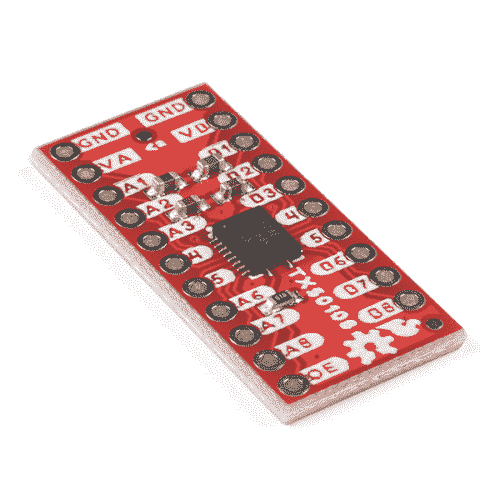
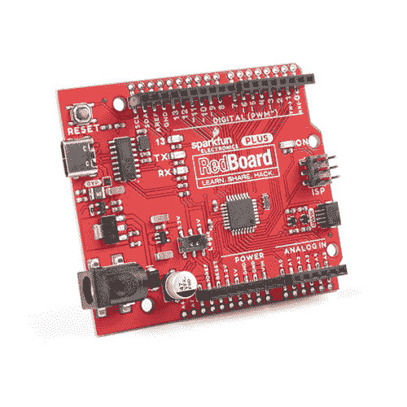
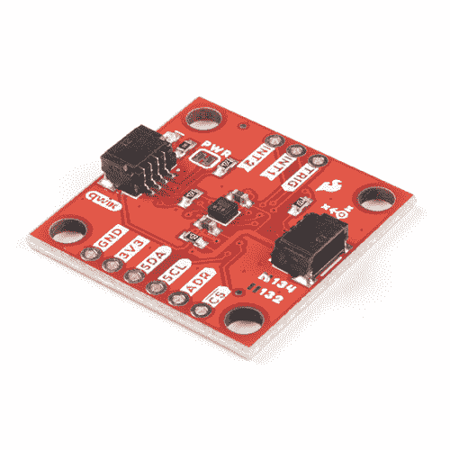
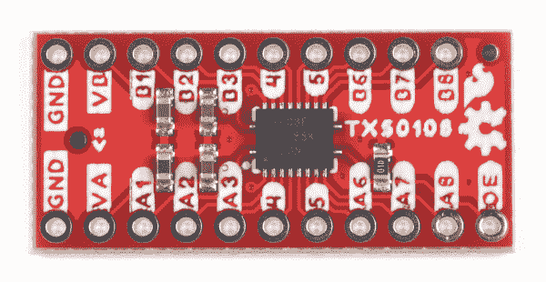
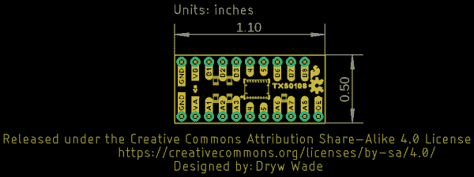
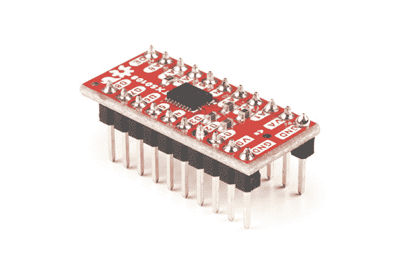
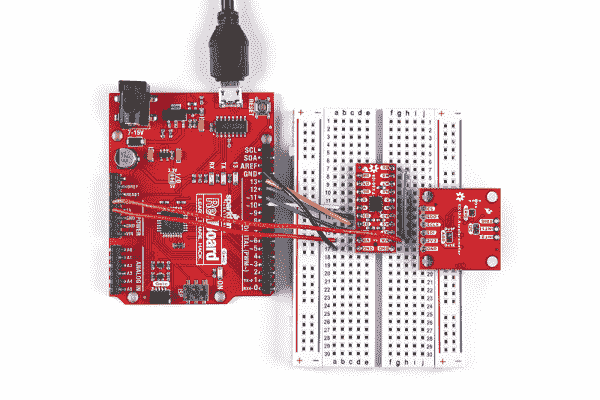

# 电平转换器- 8 通道(TXS0108E)连接指南

> 原文：<https://learn.sparkfun.com/tutorials/level-shifter---8-channel-txs0108e-hookup-guide>

## 介绍

[SparkFun 电平转换器- 8 通道(TXS0108E)](https://www.sparkfun.com/products/19626) 采用德州仪器(ti)的 txs 0108 e^(8 位双向逻辑电平转换器，可在运行于不同常见微控制器电压(如 1.8V、3.3V 和 5V)的器件之间转换。TXS0108E 可以以 110Mbps(推/拉)或 1.2Mbps(开漏)的最大速度在端口之间传输数据，因此您可以使用 3.3V SPI 设备和 5V 微控制器，如 [SparkFun RedBoard Plus](https://www.sparkfun.com/products/18158) ，而不会牺牲数据传输速度。)

 

将**添加到您的[购物车](https://www.sparkfun.com/cart)中！**

 **### [【spark fun 电平移位器- 8 通道(TXS0108E)](https://www.sparkfun.com/products/19626)

[In stock](https://learn.sparkfun.com/static/bubbles/ "in stock") BOB-19626

SparkFun 8 通道电平转换器采用德州仪器公司的 TXS0108E 8 位双向逻辑电平转换器

$4.95[Favorited Favorite](# "Add to favorites") 12[Wish List](# "Add to wish list")** **在本指南中，我们将讨论 TXS0108E 的规格，以及如何将其连接到电平转换电路中。

### 所需材料

为了遵循本指南，您需要在 TXS0108E 分线点之间进行电平转换的设备。“硬件组装”部分中的示例电路使用以下项目来演示从 5V 微控制器到 3.3V SPI 器件的转换:

 

将**添加到您的[购物车](https://www.sparkfun.com/cart)中！**

 **### [SparkFun RedBoard 加](https://www.sparkfun.com/products/18158)

[In stock](https://learn.sparkfun.com/static/bubbles/ "in stock") DEV-18158

RedBoard Plus 是一款兼容 Arduino 的开发板，拥有 Arduino Uno 所需的一切，并具有额外的额外功能…

$21.504[Favorited Favorite](# "Add to favorites") 12[Wish List](# "Add to wish list")**** 

将**添加到您的[购物车](https://www.sparkfun.com/cart)中！**

 **### [【spark fun 三轴加速度计分线点- KX134 (Qwiic)](https://www.sparkfun.com/products/17589)

[In stock](https://learn.sparkfun.com/static/bubbles/ "in stock") SEN-17589

这个 SparkFun 三轴加速度计突破是一个简单的 Qwiic 突破的 KX134 数字加速度计从 Kionix。

$21.95[Favorited Favorite](# "Add to favorites") 4[Wish List](# "Add to wish list")**** ****### 所需工具

使用这种分接头需要通孔焊接，因此您可能需要以下一些工具和焊接附件:

 

将**添加到您的[购物车](https://www.sparkfun.com/cart)中！**

 **### [破开头球——直击](https://www.sparkfun.com/products/116)

[In stock](https://learn.sparkfun.com/static/bubbles/ "in stock") PRT-00116

一排标题-打破适应。40 个引脚，可切割成任何尺寸。用于定制 PCB 或通用定制接头。

$1.7520[Favorited Favorite](# "Add to favorites") 133[Wish List](# "Add to wish list")**** 

### [威勒 WLC100 焊台](https://www.sparkfun.com/products/14228)

[Out of stock](https://learn.sparkfun.com/static/bubbles/ "out of stock") TOL-14228

Weller 的 WLC100 是一款多功能的 5 瓦至 40 瓦焊台，非常适合业余爱好者、DIY 爱好者和学生。…

2[Favorited Favorite](# "Add to favorites") 17[Wish List](# "Add to wish list") 

将**添加到您的[购物车](https://www.sparkfun.com/cart)中！**

 **### [无铅焊料- 15 克管](https://www.sparkfun.com/products/9163)

[In stock](https://learn.sparkfun.com/static/bubbles/ "in stock") TOL-09163

这是你的无铅焊料的基本管，带有不干净的水溶性树脂芯。0.031 英寸规格，15 克

$3.954[Favorited Favorite](# "Add to favorites") 14[Wish List](# "Add to wish list")**** 

将**添加到您的[购物车](https://www.sparkfun.com/cart)中！**

 **### [烙铁- 30W(美国，110V)](https://www.sparkfun.com/products/9507)

[33 available](https://learn.sparkfun.com/static/bubbles/ "33 available") TOL-09507

这是一个非常简单的固定温度，快速加热，30W 110/120 VAC 烙铁。我们真的很喜欢使用更贵的 iro…

$10.957[Favorited Favorite](# "Add to favorites") 21[Wish List](# "Add to wish list")****** ******### 推荐阅读

本教程假设读者对以下教程中的主题有所了解。如果您不熟悉其中涵盖的概念或需要复习，我们建议您在继续阅读本指南之前通读这些内容:

 [### 如何焊接:通孔焊接](https://learn.sparkfun.com/tutorials/how-to-solder-through-hole-soldering) This tutorial covers everything you need to know about through-hole soldering.[Favorited Favorite](# "Add to favorites") 70 [### 使用导线](https://learn.sparkfun.com/tutorials/working-with-wire) How to strip, crimp, and work with wire.[Favorited Favorite](# "Add to favorites") 50 [### 如何使用试验板](https://learn.sparkfun.com/tutorials/how-to-use-a-breadboard) Welcome to the wonderful world of breadboards. Here we will learn what a breadboard is and how to use one to build your very first circuit.[Favorited Favorite](# "Add to favorites") 79 [### 什么是 Arduino？](https://learn.sparkfun.com/tutorials/what-is-an-arduino) What is this 'Arduino' thing anyway? This tutorials dives into what an Arduino is and along with Arduino projects and widgets.[Favorited Favorite](# "Add to favorites") 50 [### 逻辑电平](https://learn.sparkfun.com/tutorials/logic-levels) Learn the difference between 3.3V and 5V devices and logic levels.[Favorited Favorite](# "Add to favorites") 82

## 硬件概述

让我们在这个分会场上仔细看看 TXS0108E 电平转换 IC 和其它元件。

### TXS0108E 电平转换器

TXS0108E 是一款 8 通道、双向、电平转换电压转换器，可在开漏和推挽工作模式下工作。它在 A 端口接受的供电电压范围为 **1.4V** 至 **3.6V** ，在 B 端口接受的供电电压范围为 **1.65V** 至**5.5V**(VCC _ A≤VCC _ B)。

TXS0108E 采用传输门电路架构，集成边沿速率(单次触发)加速器，在开漏操作中支持高达 1.2Mbps 的数据传输速度，在推挽操作中支持高达 110Mbps 的数据传输速度。它还内置了用于开漏应用的上拉电阻，因此无需外部电阻。有关 TXS0108E 的完整信息，请参考[数据表](https://cdn.sparkfun.com/assets/1/8/1/e/2/txs0108e.pdf)。

### PTH Headers

电路板将所有 TXS0108E 的引脚分成一对 0.1 英寸间距的 PTH 接头；每个端口一个。OE 输入引脚也在端口 A“侧”断开，因为它参考 VCCA。板卡通过一个 **110k &欧姆拉动 OE`LOW`；**默认情况下禁用 I/O 引脚的电阻。确保将 OE 引脚连接到 VCCA 以启用该设备。

### 电路板尺寸

SparkFun 电平移位器- 8 通道(TXS0108E)的尺寸为 1.10 英寸 x 0.50 英寸(27.94 毫米 x 12.70mm 毫米)。

## 硬件装配

在本节中，我们将演示如何将这个分线点组装到 5V 开发板 [RedBoard Plus](https://www.sparkfun.com/products/18158) 和 3.3V SPI 器件 [SparkFun 三轴加速度计分线点- KX134 (Qwiic)](https://www.sparkfun.com/products/17589) 之间的电平转换电路中。我们将在这里使用[试验板](https://learn.sparkfun.com/tutorials/how-to-use-a-breadboard)来简化电平转换电路的构建，并尽可能缩短连接。

### 焊接组件

这种分线需要一些通孔焊接来将电路板集成到电平转换电路中。由于演示电路使用试验板，我们将把一组[分离式公接头](https://www.sparkfun.com/products/116)焊接到板上，这样我们就可以轻松地将其插入试验板。

### Arduino 装配

将电平转换器分接头插入试验板，然后用电线连接到电路板。构建电路时，保持电路断电，以避免因短路或不正确连接而损坏任何东西。

*Having trouble seeing the detail in the image? Click on it for a larger view.*

提醒一下，VCC_A 必须小于或等于 VCC_B，OE 需要连接到 VCC_A。我们的 SPI 器件在 **3.3V** 下运行，因此我们将外设引脚连接到端口 A 上的通道，并将匹配的微控制器信号连接到端口 B

## 解决纷争

### 信号振荡

一些用户可能会遇到通信线路(例如 SPI/I ² C)上的振荡或“振铃”,这会抑制设备之间的通信。信号线上的电容或电感会导致 TXS0108E 的边沿速率加速器检测到错误的上升/下降沿。

使用 TXS0108E 时，我们建议设备之间的电线尽可能短，因为在测试过程中，我们发现即使像标准跳线这样的 6 英寸电线也可能导致这种振荡问题。此外，确保禁用所连接设备上的任何上拉电阻。当在 I/O 设备之间进行电平转换时，这种转换器在较长的线路上工作良好。

TXS0108E 专为短距离、高速应用而设计，因此，如果您需要一个用于长距离通信总线的电平转换器，我们推荐您使用我们的另一款[电平转换器](https://www.sparkfun.com/categories/361)。

### 电压要求和运行经验

提醒，提供给 VCC_A 的电压必须小于或等于 VCC_B。此外，分线点将 OE 拉低，因此确保将 OE 引脚连接到 VCC_A 以使能 TXS0108E。

### 常规故障排除

**Not working as expected and need help?**

If you need technical assistance and more information on a product that is not working as you expected, we recommend heading on over to the [SparkFun Technical Assistance](https://www.sparkfun.com/technical_assistance) page for some initial troubleshooting.

[SparkFun Technical Assistance Page](https://www.sparkfun.com/technical_assistance)

If you don't find what you need there, the [SparkFun Forums](https://forum.sparkfun.com/index.php) are a great place to find and ask for help. If this is your first visit, you'll need to [create a Forum Account](https://forum.sparkfun.com/ucp.php?mode=register) to search product forums and post questions.

[Create New Forum Account](https://forum.sparkfun.com/ucp.php?mode=register)   [Log Into SparkFun Forums](https://forum.sparkfun.com/index.php)

## 资源和更进一步

如需了解更多有关此次分组讨论的信息，请查看以下资源:

*   [示意图](https://cdn.sparkfun.com/assets/9/a/5/a/a/TXS0108_Breakout.pdf)
*   [老鹰档案](https://cdn.sparkfun.com/assets/6/9/5/c/0/TXS0108_Breakout.zip)
*   [电路板尺寸](https://cdn.sparkfun.com/assets/e/9/f/d/2/TXS01018E-Dimensions.png)
*   [数据表(PDF)](https://cdn.sparkfun.com/assets/1/8/1/e/2/txs0108e.pdf) - TXS0108E
*   [硬件 GitHub 库](https://github.com/sparkfun/8_channel_level_shifter_TXS0108E)************