# MicroMod Alorium Sno M2 处理器板连接指南

> 原文：<https://learn.sparkfun.com/tutorials/micromod-alorium-sno-m2-processor-board-hookup-guide>

## 介绍

[MicroMod Alorium Sno M2 处理器板](https://www.sparkfun.com/products/18030)采用 Alorium Technology 的 SNS 系统级模块(SoM ),适用于 MicroMod M.2 处理器外形。SNS 的 FPGA 提供了一个可重新配置的硬件平台，可托管 8 位 AVR 指令集，与 ATmega328 兼容，使 SNS 与 Arduino IDE 完全兼容。snsom 具有紧凑的尺寸，非常适合空间受限的应用，是我们用于原型制作的 MicroMod 外形的明显补充。

Alorium 技术通过 Arduino IDE 提供了一个名为 Xcelerator Blocks (XBs)的自定义逻辑库，可以加速 8 位微控制器速度慢、有问题甚至不可能实现的特定功能。该库包括 XB，如伺服控制、正交、浮点数学、NeoPixel 和增强型模数转换器。Alorium 还指出了 XB 的路线图，未来的 XBs 将根据早期采用者和新的潜在客户的反馈来实现。

[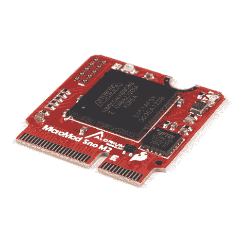](https://www.sparkfun.com/products/18030) 

将**添加到您的[购物车](https://www.sparkfun.com/cart)中！**

### [SparkFun micro mod Alorium Sno M2 处理器](https://www.sparkfun.com/products/18030)

[Out of stock](https://learn.sparkfun.com/static/bubbles/ "out of stock") DEV-18030

SparkFun MicroMod Alorium Sno 处理器采用 SNS 系统级模块(SoM ),适用于 MicroMod M.2 处理器

$49.95[Favorited Favorite](# "Add to favorites") 6[Wish List](# "Add to wish list")** **[https://www.youtube.com/embed/SYiLQFMpgXU/?autohide=1&border=0&wmode=opaque&enablejsapi=1](https://www.youtube.com/embed/SYiLQFMpgXU/?autohide=1&border=0&wmode=opaque&enablejsapi=1)

### 所需材料

要跟随本教程，您将需要以下材料。你可能不需要所有的东西，这取决于你拥有什么。将它添加到您的购物车，通读指南，并根据需要调整购物车。

[](https://www.sparkfun.com/products/18030) 

将**添加到您的[购物车](https://www.sparkfun.com/cart)中！**

### [SparkFun micro mod Alorium Sno M2 处理器](https://www.sparkfun.com/products/18030)

[Out of stock](https://learn.sparkfun.com/static/bubbles/ "out of stock") DEV-18030

SparkFun MicroMod Alorium Sno 处理器采用 SNS 系统级模块(SoM ),适用于 MicroMod M.2 处理器

$49.95[Favorited Favorite](# "Add to favorites") 6[Wish List](# "Add to wish list")****[](https://www.sparkfun.com/products/16885) 

将**添加到您的[购物车](https://www.sparkfun.com/cart)中！**

### [SparkFun MicroMod ATP 载板](https://www.sparkfun.com/products/16885)

[In stock](https://learn.sparkfun.com/static/bubbles/ "in stock") DEV-16885

如果您需要“大量”带有简单 to 编程、准备上市模块的 GPIO，ATP 是您需要的解决方案。

$19.951[Favorited Favorite](# "Add to favorites") 13[Wish List](# "Add to wish list")****[](https://www.sparkfun.com/products/14743) 

将**添加到您的[购物车](https://www.sparkfun.com/cart)中！**

### [USB 3.1 线 A 到 C - 3 脚](https://www.sparkfun.com/products/14743)

[In stock](https://learn.sparkfun.com/static/bubbles/ "in stock") CAB-14743

USB C 棒极了。但是，在我们将所有的集线器、充电器和端口转换为 USB C 之前，这是您要使用的电缆…

$5.504[Favorited Favorite](# "Add to favorites") 9[Wish List](# "Add to wish list")****[](https://www.sparkfun.com/products/9146) 

将**添加到您的[购物车](https://www.sparkfun.com/cart)中！**

### [SparkFun 迷你螺丝刀](https://www.sparkfun.com/products/9146)

[In stock](https://learn.sparkfun.com/static/bubbles/ "in stock") TOL-09146

这只是你的基本可逆螺丝刀口袋大小！有平头和十字头可供选择。配有别针和…

$1.053[Favorited Favorite](# "Add to favorites") 11[Wish List](# "Add to wish list")******** ********### 推荐阅读

如果你不熟悉 MicroMod 生态系统，我们推荐你阅读这里的[来了解](https://www.sparkfun.com/micromod)的概况。如果你决定利用 Qwiic 连接器，我们推荐阅读[这里的概述](https://www.sparkfun.com/qwiic)。

| [](https://www.sparkfun.com/micromod) | [](https://www.sparkfun.com/qwiic) |
| *[微模式生态系统](https://www.sparkfun.com/micromod)* | *[Qwiic 连接系统](https://www.sparkfun.com/qwiic)* |

如果您不熟悉以下概念，我们也建议您在继续之前查看这些教程。

[](https://learn.sparkfun.com/tutorials/getting-started-with-micromod) [### MicroMod 入门](https://learn.sparkfun.com/tutorials/getting-started-with-micromod) Dive into the world of MicroMod - a compact interface to connect a microcontroller to various peripherals via the M.2 Connector 3[](https://learn.sparkfun.com/tutorials/how-does-an-fpga-work) [### FPGA 是如何工作的？](https://learn.sparkfun.com/tutorials/how-does-an-fpga-work) The What, How, Why, and When of Field Programmable Gate Arrays, aka FPGAs[Favorited Favorite](# "Add to favorites") 11[](https://learn.sparkfun.com/tutorials/micromod-all-the-pins-atp-carrier-board) [### 微模压所有引脚(ATP)载板](https://learn.sparkfun.com/tutorials/micromod-all-the-pins-atp-carrier-board) Access All The Pins (ATP) of the MicroMod Processor Board with the Carrier Board 0

## 硬件概述

### M.2 连接器

我们所有的 MicroMod 处理器板都配备了 **M.2 MicroMod 连接器**，它利用 [M.2 标准](https://en.wikipedia.org/wiki/M.2)和规范，允许您将 MicroMod 处理器板安装在您选择的载板上。大多数引脚使用公共引脚排列，以确保跨平台兼容性。

[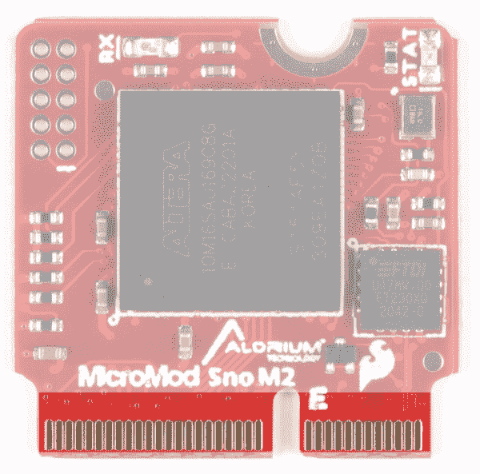](https://cdn.sparkfun.com/assets/learn_tutorials/2/2/8/7/18030-SparkFun_MicroMod_Alorium_Sno_Processor_Board-M2Connector.jpg)

### Alorium Technology Sno M2 处理器

Alorium Technology Sno FPGA 提供了一个可重新配置的硬件平台，用于托管 ATmega328 指令集兼容型微控制器。FPGA 还提供了实现定制逻辑的能力，以加速特定功能，这些功能对于 8 位微控制器来说是缓慢的、有问题的甚至是不可能的。

[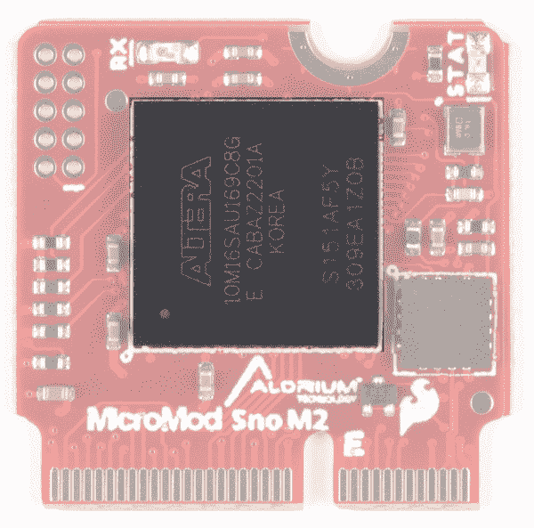](https://cdn.sparkfun.com/assets/learn_tutorials/2/2/8/7/18030-SparkFun_MicroMod_Alorium_Sno_Processor_Board-Processor.jpg)

### JTAG

Sno M2 上的 JTAG 接口主要用于在制造过程中加载生产 FPGA 映像。对于高级用户，JTAG 可用于创建裸机 FPGA 设计，并直接向 FPGA 刷新新图像。

**Important Note:** Using JTAG to load the MAX10 FPGA with a custom image will erase the production Sno M2 functionality, permanently delete the integrated 8-bit microcontroller subsystem, and not allow recovery back to the factory production image.

The Sno M2 FPGA has been designed to be modified and extended by using Alorium’s OpenXLR8 Methodology. This flow provides a path to create custom XBs in the FPGA fabric that can easily interface to the on-chip microcontroller and preserve full factory functionality.

[Learn More about OpenXLR8 here.](https://www.aloriumtech.com/openxlr8)[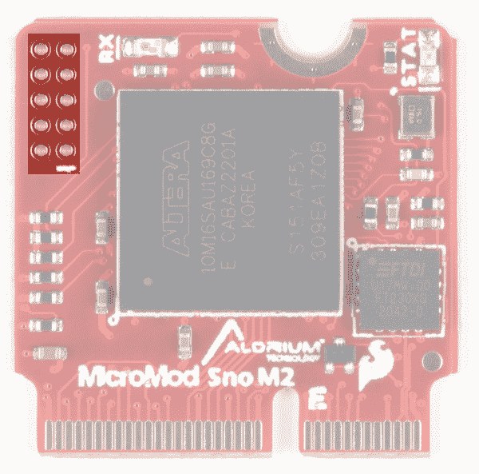](https://cdn.sparkfun.com/assets/learn_tutorials/2/2/8/7/18030-SparkFun_MicroMod_Alorium_Sno_Processor_Board-JTAG.jpg)

### FTDI

FTDI 有助于 USB 通信-可能需要安装 FTDI 芯片的驱动程序。如果您需要安装这些驱动程序的帮助，请参见[如何安装 FTDI 驱动程序教程](https://learn.sparkfun.com/tutorials/how-to-install-ftdi-drivers)。

[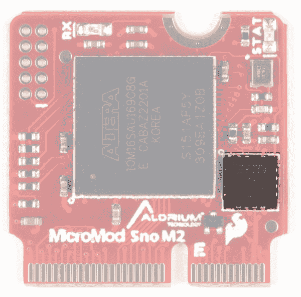](https://cdn.sparkfun.com/assets/learn_tutorials/2/2/8/7/18030-SparkFun_MicroMod_Alorium_Sno_Processor_Board-FTDI.jpg)

### 发光二极管

Sno 处理器板上有两个指示灯。一个接收 LED 和一个统计 LED。

[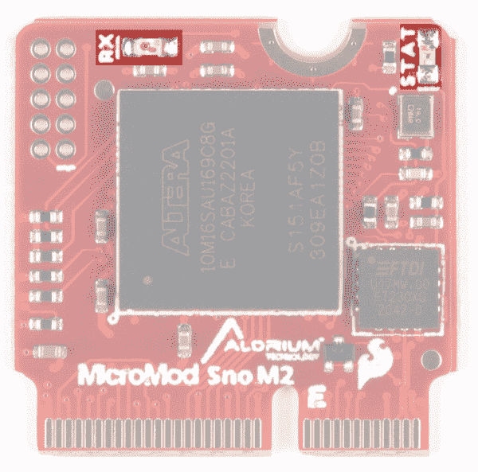](https://cdn.sparkfun.com/assets/learn_tutorials/2/2/8/7/18030-SparkFun_MicroMod_Alorium_Sno_Processor_Board-BothLEDs.jpg)

*   **RX LED**-RX LED 指示 USB 串行端口上的活动。

*   **STAT LED** -电路板顶部增加了一个 STAT LED。这对于调试或作为状态指示器非常有用。

### MicroMod Alorium Sno M2 处理器引脚功能

这里显示了完整的引脚图，或者您可以参考[原理图](https://cdn.sparkfun.com/assets/5/c/6/9/0/18030_MicroModAloriumSnoPB_Schematic.pdf)。你也可以在这里下载[图钉的 PDF 版本。](https://cdn.sparkfun.com/assets/learn_tutorials/2/2/8/7/PinOutMap.pdf)

[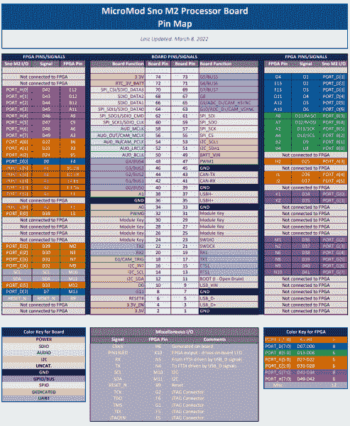](https://cdn.sparkfun.com/assets/learn_tutorials/2/2/8/7/AloriumSnoM2PinMap.png)*Click on image for a closer view of the pin map.**Pin Map courtesy of Alorium Technology*

### 电路板尺寸

该板采用标准 MicroMod 外形。

[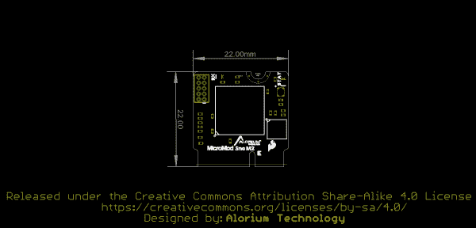](https://cdn.sparkfun.com/assets/4/d/2/7/3/18030_MicroModAloriumSnoPB_BoardOutline_Cropped.png)

## 硬件装配

如果您还没有，请务必查看【MicroMod 入门:硬件连接以获取有关将处理器板插入载板的信息。

[](https://learn.sparkfun.com/tutorials/getting-started-with-micromod) [### MicroMod 入门

#### 2020 年 10 月 21 日](https://learn.sparkfun.com/tutorials/getting-started-with-micromod) Dive into the world of MicroMod - a compact interface to connect a microcontroller to various peripherals via the M.2 Connector 3

将 MicroMod Alorium Sno M2 处理器板插入载板后，您的设置可能如下所示。

[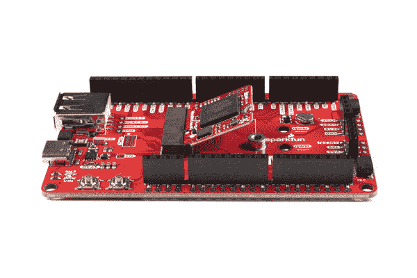](https://cdn.sparkfun.com/assets/learn_tutorials/2/2/8/7/MicroMod_Alorium_Sno_Processor_Hookup_Guide-03.jpg)*Click on image for a closer view.*

轻轻按下处理器板并拧紧螺丝(不过不要拧得太紧)，将它固定住。

[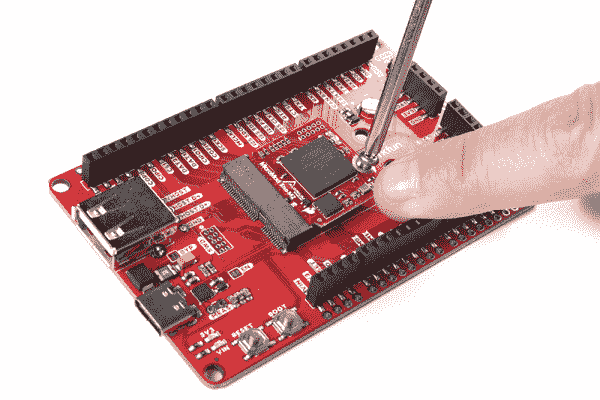](https://cdn.sparkfun.com/assets/learn_tutorials/2/2/8/7/MicroMod_Alorium_Sno_Processor_Hookup_Guide-02.jpg)*Click on image for a closer view.*

为简单起见，我们将使用 MicroMod ATP 载板对电路板进行编程。使用 MicroMod Alorium Sno M2 处理器板时，您的设置至少应该如下图所示。

[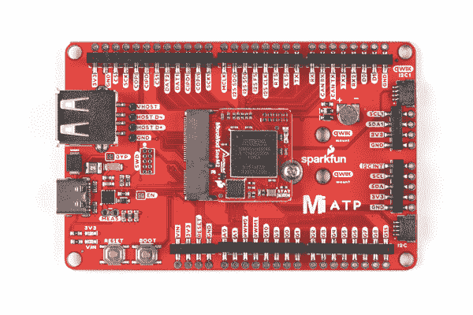](https://cdn.sparkfun.com/assets/learn_tutorials/2/2/8/7/MicroMod_Alorium_Sno_Processor_Hookup_Guide-01.jpg)*Click on image for a closer view.*

## 软件安装

**Note:** This example assumes you are using the latest version of the Arduino IDE on your desktop. If this is your first time using Arduino, please review our tutorial on [installing the Arduino IDE.](https://learn.sparkfun.com/tutorials/installing-arduino-ide) If you have not previously installed an Arduino library, please check out our [installation guide.](https://learn.sparkfun.com/tutorials/installing-an-arduino-library)

### 安装 Arduino 板定义

在 Arduino IDE 菜单栏中，转到**文件** > **首选项**并找到“附加电路板管理器 URL”输入字段。将以下 URL 粘贴到“附加 Boards Manager URLs”输入字段:

```
language:json
https://raw.githubusercontent.com/AloriumTechnology/Arduino_Boards/master/package_aloriumtech_index.json 
```

它应该如下所示:

[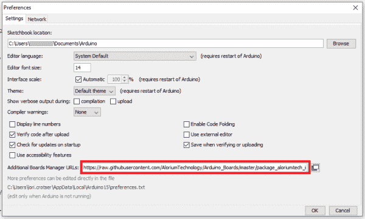](https://cdn.sparkfun.com/assets/learn_tutorials/2/2/8/7/ArduinoPreferences.png)*Click on image for a closer view.*

### 安装 Alorium 的 XLR8 板包

首先进入**工具** > **电路板** > **电路板管理器**。在搜索栏中键入“Alorium”，您将看到一个为 Alorium Arduino 兼容板安装板文件的选项。选择“Alorium XLR8 板”包，然后单击“安装”。

[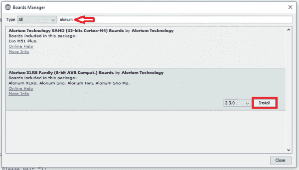](https://cdn.sparkfun.com/assets/learn_tutorials/2/2/8/7/AloriumXLR8FamilyPackage-Updated.png)*Click on image for a closer view.*

进入**工具** > **板**。您应该会看到一个名为“Alorium XLR8 系列”的新部分已经存在。在这个新的标题下应该是 **Sno M2** 董事会。您可以像通常选择“Arduino/Genuino Uno”板一样选择“Sno M2”板。

[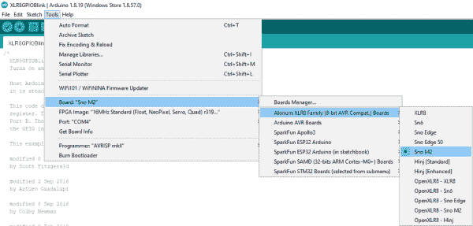](https://cdn.sparkfun.com/assets/learn_tutorials/2/2/8/7/ChooseXLR8Board-Correct.png)*Click on image for a closer view.*

选择 Sno M2 后，您会在**工具** > **FPGA 图像**中找到一个新的菜单项，在这里您会找到许多提供不同操作速度和不同 XB 配置的 FPGA 图像。

[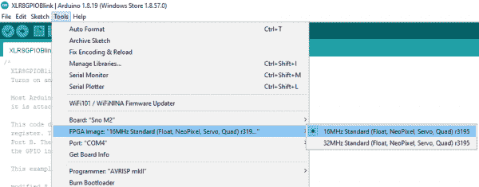](https://cdn.sparkfun.com/assets/learn_tutorials/2/2/8/7/ChooseFPGA-Correct.png)*Click on image for a closer view.*

### XLR8 库

安装 XLR8 板支持也将安装一组缺省的库，需要这些库来利用 SNS 的额外功能。你可以看到这些库列在**草图** > **包含库**菜单中。

使用库管理器可以安装其他可用的库。在 Arduino IDE 中，进入菜单**草图** > **包括库** > **管理库**，这将在一个新窗口中打开库管理器。在搜索栏中输入“Alorium ”,您将找到各种可用的 XLR8 和 snu 库的条目。

您可以安装许多库来支持我们的各种板功能和 Xcelerator 块。出于本入门指南的目的，找到“XLR8Info”库并单击它。

[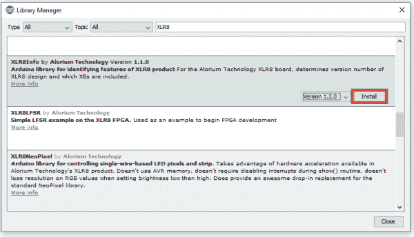](https://cdn.sparkfun.com/assets/learn_tutorials/2/2/8/7/InstallXLR8InfoLibrary.png)*Click on image for a closer view.*

会出现一个**安装**按钮。点击**安装**按钮，当安装完成时，你会看到库现在被标记为已安装。

添加库后，您会在菜单**草图** > **包含库**中找到它，在贡献的库下(如果您没有看到它，可能需要重新启动 IDE)。

你也可以在库名下的**文件** > **示例**菜单中找到一些示例草图。

## 示例 1:眨眼

Sno 处理器板插入 M.2 插槽并固定后，用 USB 电缆将 ATP 板连接到计算机。确保您有正确的板、FPGA 映像、上传动作和端口，如下所示。

[](https://cdn.sparkfun.com/assets/learn_tutorials/2/2/8/7/ChooseFPGA-Correct.png)*Click on image for a closer view.*

进入**工具** > **板**选择 Sno M.2 .然后进入**文件** > **示例** > **01。基本操作**并选择*闪烁*。

[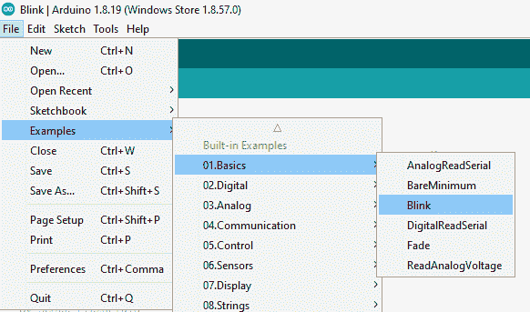](https://cdn.sparkfun.com/assets/learn_tutorials/2/2/8/7/BlinkExample-Updated.png)*Click on image for a closer view.*

上传你在这里看到的草图:

[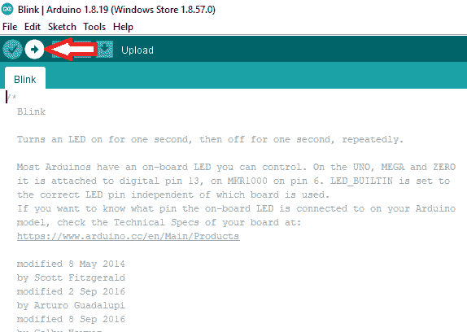](https://cdn.sparkfun.com/assets/learn_tutorials/2/2/8/7/BlinkUpload.png)*Click on image for a closer view.*

如果一切顺利，您应该会看到类似下面的 gif:

[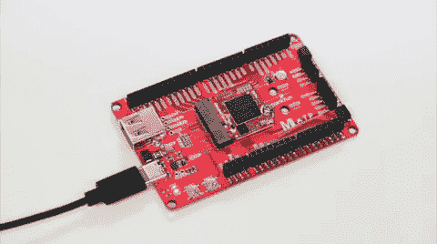](https://cdn.sparkfun.com/assets/learn_tutorials/2/2/8/7/MM_Sno_Alorium.gif)

## 示例 2:使用 Xcelerator 块运行(XB)

要使用 XLR8Info XB 和资料库运行，请执行以下操作:

使用 USB 电缆将 SNS 连接到电脑，并像平常一样设置端口和串行监视器。转到**工具** > **端口**并验证 Arduino IDE 是否连接到 XLR8 USB 串行端口。

进入**工具** > **板卡**选择 XLR8 板卡。然后进入**文件** > **实例** > **XLR8Info** 选择“GetXLR8Version”。

[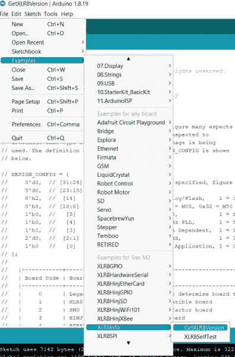](https://cdn.sparkfun.com/assets/learn_tutorials/2/2/8/7/GetXLR8InfoExampleMenu.jpg)*Click on image for a closer view.*

在 GetXLR8Version 草图窗口中，单击上传按钮

[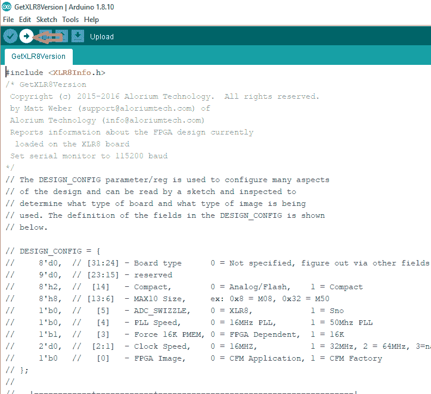](https://cdn.sparkfun.com/assets/learn_tutorials/2/2/8/7/UploadExample.png)*Click on image for a closer view.*

检查串行监视器窗口的输出，它应该类似于下面的输出。**注意，您需要将串行监视器的波特率设置为 115200，以便该草图正确显示输出**。

[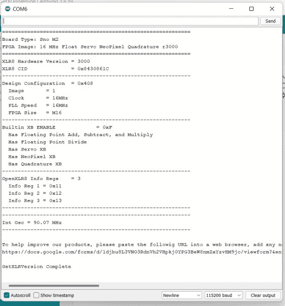](https://cdn.sparkfun.com/assets/learn_tutorials/2/2/8/7/GetInfoExampleOutput.jpg)*Click on image for a closer view.*

## 解决纷争

### 一般故障排除帮助和技术支持

**Not working as expected and need help?**

If you need technical assistance or more information regarding this or another SparkFun product that is not working as you expected, we recommend heading on over to the [SparkFun Technical Assistance](https://www.sparkfun.com/technical_assistance) page for some initial troubleshooting.

[SparkFun Technical Assistance Page](https://www.sparkfun.com/technical_assistance)

If you don't find what you need there, the [SparkFun Forums: MicroMod](https://forum.sparkfun.com/viewforum.php?f=180) are a great place to find and ask for help. If this is your first visit, you'll need to [create a Forum Account](https://forum.sparkfun.com/ucp.php?mode=register) to search product forums and post questions.

[SparkFun Forums: MicroMod](https://forum.sparkfun.com/viewforum.php?f=180)

## 资源和更进一步

有关更多信息，请查看以下资源:

*   [示意图](https://cdn.sparkfun.com/assets/5/c/6/9/0/18030_MicroModAloriumSnoPB_Schematic.pdf)
*   [老鹰档案](https://cdn.sparkfun.com/assets/7/f/e/7/9/18030_MicroModAloriumSnoPB_EagleFiles.zip)
*   [电路板轮廓](https://cdn.sparkfun.com/assets/4/d/2/7/3/18030_MicroModAloriumSnoPB_BoardOutline_Cropped.png)
*   [Alorium 技术 OEM 模块页面](https://aloriumtech.com/sno/)
*   [SNS 产品简介](https://aloriumtech.com/documents/Sno_Product_Brief.pdf)
*   [GitHub 回购](https://github.com/sparkfun/MicroMod_Sno_Processor_Board)

有关 SparkFun MicroMod 生态系统的更多信息，请查看以下链接:

*   [micro mod 入门](https://learn.sparkfun.com/tutorials/getting-started-with-micromod)
*   [用微模块设计](https://learn.sparkfun.com/tutorials/designing-with-micromod)
*   [MicroMod 信息页面](https://www.sparkfun.com/micromod)
*   [MicroMod 论坛](https://forum.sparkfun.com/viewforum.php?f=180)

需要一些使用 Alorium Sno 处理器的项目灵感吗？下面的教程可以帮助你开始！

[](https://learn.sparkfun.com/tutorials/micromod-wifi-function-board---esp32-hookup-guide) [### MicroMod WiFi 功能板- ESP32 连接指南](https://learn.sparkfun.com/tutorials/micromod-wifi-function-board---esp32-hookup-guide) The MicroMod ESP32 Function Board adds additional wireless options to MicroMod Processor Boards that do not have that capability. This special function board acts as a coprocessor that takes advantage of Espressif's ESP32 WROOM to add WiFi and Bluetooth® to your applications.[Favorited Favorite](# "Add to favorites") 0[](https://learn.sparkfun.com/tutorials/micromod-mikrobus-carrier-board-hookup-guide) [### MicroMod mikroBUS 载板连接指南](https://learn.sparkfun.com/tutorials/micromod-mikrobus-carrier-board-hookup-guide) This carrier board takes advantage of the MicroMod, Qwiic, and the mikroBUS™ ecosystems and allows users to take advantage of the growing number of 7 MicroMod processor boards, 83 Qwiic (add-on) boards, and +1100 drop-in Click boards™, which equates to +51M different board combinations. Click to learn more.[Favorited Favorite](# "Add to favorites") 1[](https://learn.sparkfun.com/tutorials/micromod-gnss-function-board---zed-f9p-hookup-guide) [### MicroMod GNSS 功能板- ZED-F9P 连接指南](https://learn.sparkfun.com/tutorials/micromod-gnss-function-board---zed-f9p-hookup-guide) Add millimeter precision location data to your MicroMod project with this guide for the SparkFun MicroMod GNSS Function Board - ZED-F9P.[Favorited Favorite](# "Add to favorites") 1[](https://learn.sparkfun.com/tutorials/cellular-function-board---blues-wireless-notecarrier)[New!

### 蜂窝功能板- Blues 无线笔记本](https://learn.sparkfun.com/tutorials/cellular-function-board---blues-wireless-notecarrier) Add a global cellular module to your MicroMod project with the SparkFun Cellular Function Board - Blues Wireless Notecarrier. With this Function board you can not only send data to and from your MicroMod project, you can even update the firmware on the STM32 MicroMod Processor.[Favorited Favorite](# "Add to favorites") 0**********