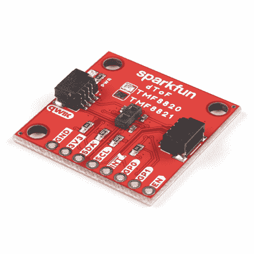
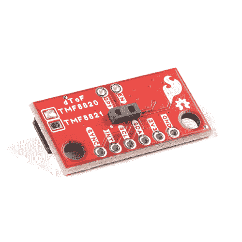

# Qwiic dToF 成像仪(TMF882X)连接指南

> 原文：<https://learn.sparkfun.com/tutorials/qwiic-dtof-imager-tmf882x-hookup-guide>

## 介绍

SparkFun Qwiic dToF 成像仪-[tmf 8820](https://www.sparkfun.com/products/19036)/[tmf 8821](https://www.sparkfun.com/products/19037)是一种直接飞行时间(dToF)传感器，包括单个模块化封装，带有来自 AMS 的相关垂直腔面发射激光器(VCSEL)。dToF 设备基于单光子雪崩光电二极管(SPAD)、时间数字转换器(TDC)和直方图技术，实现了 5000 mm 的检测范围。由于其在 SPAD 上的镜头，TMF8820 支持 3x3 多区域输出数据，而 TMF8821 支持 3x3、4x4 和 3x6 多区域输出数据。每个 dToF 成像仪上的镜头提供了非常宽的、动态可调的视野。VCSEL 上方封装内的多透镜阵列(MLA)拓宽了 FoI(照明区域)。原始数据的所有处理都在片内执行，TMF8820/TMF8821 在其 I ² C 接口上提供距离信息和置信值。高性能片内滤光器可阻挡大部分环境光，支持在黑暗和日光环境下进行距离测量。

这些传感器非常适合相机自动对焦的距离测量-激光检测自动对焦- LDAF(手机)、存在检测(计算和通信)、物体检测和碰撞避免(机器人)以及光幕(工业)等项目。

 

将**添加到您的[购物车](https://www.sparkfun.com/cart)中！**

 **### [SparkFun Qwiic dToF 成像仪- TMF8820](https://www.sparkfun.com/products/19036)

[In stock](https://learn.sparkfun.com/static/bubbles/ "in stock") SEN-19036

SparkFun Qwiic dToF TMF8820 成像仪是一款直接飞行时间传感器，包括一个带有相关组件的模块化封装。

$19.95[Favorited Favorite](# "Add to favorites") 3[Wish List](# "Add to wish list")**** 

将**添加到您的[购物车](https://www.sparkfun.com/cart)中！**

 **### [SparkFun Qwiic 迷你 dToF 成像仪- TMF8820](https://www.sparkfun.com/products/19218)

[In stock](https://learn.sparkfun.com/static/bubbles/ "in stock") SEN-19218

SparkFun Qwiic Mini dToF TMF8820 成像仪是一款直接飞行时间传感器，包括一个模块化封装和一个…

$20.50[Favorited Favorite](# "Add to favorites") 3[Wish List](# "Add to wish list")**** 

将**添加到您的[购物车](https://www.sparkfun.com/cart)中！**

 **### [SparkFun Qwiic dToF 成像仪- TMF8821](https://www.sparkfun.com/products/19037)

[In stock](https://learn.sparkfun.com/static/bubbles/ "in stock") SEN-19037

SparkFun Qwiic dToF TMF8821 成像仪是一款直接飞行时间传感器，包括一个带有相关组件的模块化封装。

$20.951[Favorited Favorite](# "Add to favorites") 5[Wish List](# "Add to wish list")**** 

将**添加到您的[购物车](https://www.sparkfun.com/cart)中！**

 **### [SparkFun Qwiic 迷你 dToF 成像仪- TMF8821](https://www.sparkfun.com/products/19451)

[In stock](https://learn.sparkfun.com/static/bubbles/ "in stock") SEN-19451

SparkFun Qwiic Mini dToF TMF8821 成像仪是一款直接飞行时间传感器，包括一个模块化封装和一个…

$21.50[Favorited Favorite](# "Add to favorites") 5[Wish List](# "Add to wish list")******** ********[https://www.youtube.com/embed/NbxuoxD3H8w/?autohide=1&border=0&wmode=opaque&enablejsapi=1](https://www.youtube.com/embed/NbxuoxD3H8w/?autohide=1&border=0&wmode=opaque&enablejsapi=1)

### 所需材料

**Note:** We recommend a microcontroller with enough flash to run your program code. Sorry, Uno's (or any development board using the ATmega328P) are out. But didn't you want an excuse to try out something new? We recommend choosing either an [Artemis Thing Plus](https://www.sparkfun.com/products/15574) or an [ESP32 Thing Plus](https://www.sparkfun.com/products/15663) board as your development board.

要跟随本教程，您将需要以下材料。你可能不需要所有的东西，这取决于你拥有什么。将它添加到您的购物车，通读指南，并根据需要调整购物车。请注意，以下愿望清单包括 RedBoard Artemis 和 TMF8821。根据您的应用，您可以针对不同的处理器板或传感器版本调整购物车。********