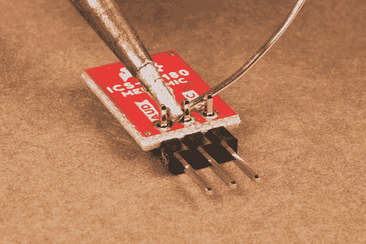

# 模拟 MEMS 麦克风分线点- SPH8878LR5H-1 连接指南

> 原文：<https://learn.sparkfun.com/tutorials/analog-mems-microphone-breakout---sph8878lr5h-1-hookup-guide>

## 介绍

**Note:** This tutorial covers the latest version of the SparkFun Analog MEMS Microphone Breakout ([BOB-19389](https://www.sparkfun.com/products/19389)). We designed the updated version as a drop-in replacement so users with the previous versions of this breakout board ([BOB-9868](https://www.sparkfun.com/products/retired/9868) or [BOB-18011](https://www.sparkfun.com/products/18011)) can follow along with this tutorial. For specific details regarding the microphone ICs, refer to the Documents tab on their product pages or the previous release of this Hookup Guide:
[ADMP401 & ICS-40180 MEMS Microphone Hookup Guide](https://learn.sparkfun.com/tutorials/mems-microphone-hookup-guide)

[SparkFun 模拟 MEMS 麦克风 Breakout - SPH8878LR5H-1](https://www.sparkfun.com/products/19389) 是一款简单易用的麦克风，适用于各种声音检测项目。板载麦克风是一款低功耗、全向麦克风，具有模拟输出。它既适用于近距离使用，也适用于远距离使用，并且由于其低功耗，特别适合便携式应用。可能的应用包括:智能手机、数码摄像机，以及在你不在的时候帮你的宠物“留意”。

[](https://www.sparkfun.com/products/19389) 

将**添加到您的[购物车](https://www.sparkfun.com/cart)中！**

 **### [SparkFun 模拟 MEMS 麦克风分线点- SPH8878LR5H-1](https://www.sparkfun.com/products/19389)

[In stock](https://learn.sparkfun.com/static/bubbles/ "in stock") BOB-19389

SparkFun 模拟 MEMS 麦克风突破使使用 Knowles 的 SPH8878LR5H-1 模拟麦克风变得非常容易。

$6.952[Favorited Favorite](# "Add to favorites") 5[Wish List](# "Add to wish list")** **阅读本指南，了解分线板的概况及其使用方法，包括其技术规格、如何将其连接到微控制器，以及入门示例代码！

### 所需材料

跟随本教程学习时，您将需要这些物品以及 MEMS 麦克风分组讨论。首先，您需要一个微控制器为麦克风供电并监控其输出:

[](https://www.sparkfun.com/products/15123) 

将**添加到您的[购物车](https://www.sparkfun.com/cart)中！**

 **### [spark fun RedBoard Qwiic](https://www.sparkfun.com/products/15123)

[In stock](https://learn.sparkfun.com/static/bubbles/ "in stock") DEV-15123

SparkFun RedBoard Qwiic 是一款 Arduino 兼容开发板，内置 Qwiic 连接器，无需…

$21.5014[Favorited Favorite](# "Add to favorites") 49[Wish List](# "Add to wish list")****[](https://www.sparkfun.com/products/17743) 

将**添加到您的[购物车](https://www.sparkfun.com/cart)中！**

 **### [spark fun Thing Plus-ESP32-S2 WROOM](https://www.sparkfun.com/products/17743)

[In stock](https://learn.sparkfun.com/static/bubbles/ "in stock") WRL-17743

SparkFun ESP32-S2 WROOM Thing Plus 是一款高度集成的羽毛外形开发板，配备 2.4 GH…

$21.502[Favorited Favorite](# "Add to favorites") 16[Wish List](# "Add to wish list")****[](https://www.sparkfun.com/products/14812) 

将**添加到您的[购物车](https://www.sparkfun.com/cart)中！**

 **### [spark fun red Board Turbo-samd 21 开发板](https://www.sparkfun.com/products/14812)

[In stock](https://learn.sparkfun.com/static/bubbles/ "in stock") DEV-14812

如果你准备从旧的 8 位/16MHz 微控制器升级你的 Arduino 游戏，SparkFun RedBoard Turbo 是一种形式…

$26.958[Favorited Favorite](# "Add to favorites") 27[Wish List](# "Add to wish list")****[](https://www.sparkfun.com/products/15423) 

将**添加到您的[购物车](https://www.sparkfun.com/cart)中！**

 **### [spark fun Qwiic Micro-samd 21 开发板](https://www.sparkfun.com/products/15423)

[In stock](https://learn.sparkfun.com/static/bubbles/ "in stock") DEV-15423

SparkFun Qwiic Micro 的成型符合我们的标准 1" x 1" Qwiic 板尺寸，这使它成为我们最小的 SAMD21 微控制器…

$22.505[Favorited Favorite](# "Add to favorites") 18[Wish List](# "Add to wish list")******** ********使用这种分接头构建电路需要一些组装和焊接。您可能已经有了其中的一些项目，但如果没有，下面的工具和硬件可以帮助您进行组装:

[](https://www.sparkfun.com/products/116) 

将**添加到您的[购物车](https://www.sparkfun.com/cart)中！**

 **### [破开头球——直击](https://www.sparkfun.com/products/116)

[In stock](https://learn.sparkfun.com/static/bubbles/ "in stock") PRT-00116

一排标题-打破适应。40 个引脚，可切割成任何尺寸。用于定制 PCB 或通用定制接头。

$1.7520[Favorited Favorite](# "Add to favorites") 133[Wish List](# "Add to wish list")****[](https://www.sparkfun.com/products/11375) 

将**添加到您的[购物车](https://www.sparkfun.com/cart)中！**

 **### [](https://www.sparkfun.com/products/11375)

[In stock](https://learn.sparkfun.com/static/bubbles/ "in stock") PRT-11375

各种颜色的电线:你知道这是一个美丽的东西。六种不同颜色的绞线装在一个纸板盒里…

$22.5019[Favorited Favorite](# "Add to favorites") 46[Wish List](# "Add to wish list")****[](https://www.sparkfun.com/products/14456) 

将**添加到您的[购物车](https://www.sparkfun.com/cart)中！**

 **### [【烙铁- 60W(可调温度)](https://www.sparkfun.com/products/14456)

[In stock](https://learn.sparkfun.com/static/bubbles/ "in stock") TOL-14456

当你不想倾家荡产，但又需要一个可靠的烙铁时，这个可调节温度的烙铁是一个很好的工具…

$16.5016[Favorited Favorite](# "Add to favorites") 43[Wish List](# "Add to wish list")****[](https://www.sparkfun.com/products/9163) 

将**添加到您的[购物车](https://www.sparkfun.com/cart)中！**

 **### [无铅焊料- 15 克管](https://www.sparkfun.com/products/9163)

[In stock](https://learn.sparkfun.com/static/bubbles/ "in stock") TOL-09163

这是你的无铅焊料的基本管，带有不干净的水溶性树脂芯。0.031 英寸规格，15 克

$3.954[Favorited Favorite](# "Add to favorites") 14[Wish List](# "Add to wish list")******** ********### 推荐阅读

要成功使用 SparkFun MEMS 麦克风分线板，您需要熟悉 Arduino 微控制器、模拟(即 ADC)输入和声波。对于不熟悉这些主题的人来说，可以查看下面的参考资料，感受一下本教程中使用的概念和措辞。

[](https://learn.sparkfun.com/tutorials/what-is-an-arduino) [### 什么是 Arduino？](https://learn.sparkfun.com/tutorials/what-is-an-arduino) What is this 'Arduino' thing anyway? This tutorials dives into what an Arduino is and along with Arduino projects and widgets.[Favorited Favorite](# "Add to favorites") 50[](https://learn.sparkfun.com/tutorials/installing-arduino-ide) [### 安装 Arduino IDE](https://learn.sparkfun.com/tutorials/installing-arduino-ide) A step-by-step guide to installing and testing the Arduino software on Windows, Mac, and Linux.[Favorited Favorite](# "Add to favorites") 16[](https://learn.sparkfun.com/tutorials/analog-vs-digital) [### 模拟与数字](https://learn.sparkfun.com/tutorials/analog-vs-digital) This tutorial covers the concept of analog and digital signals, as they relate to electronics.[Favorited Favorite](# "Add to favorites") 66[](https://learn.sparkfun.com/tutorials/redboard-qwiic-hookup-guide) [### RedBoard Qwiic 连接指南](https://learn.sparkfun.com/tutorials/redboard-qwiic-hookup-guide) This tutorial covers the basic functionality of the RedBoard Qwiic. This tutorial also covers how to get started blinking an LED and using the Qwiic system.[Favorited Favorite](# "Add to favorites") 5

## 硬件概述

SparkFun 模拟 MEMS 麦克风分线点使用 SPH8878LR5H-1 麦克风，并通过 OPA344 运算放大器放大信号。让我们仔细看看 SPH8878LR5H-1 和板上的其他硬件。

### SPH8878LR5H-1 麦克风

Knowles Electronics 的 SPH8878LR5H-1 麦克风是一款底部端口模拟麦克风，支持单端和差分模式。

[](https://cdn.sparkfun.com/assets/learn_tutorials/2/2/9/0/MEMS_SPH8878LR5H-1_Mic_Breakout-Front.jpg)

我们在这个分线点上选择了单端输出设计，因此它可以作为以前版本 SparkFun MEMS 麦克风分线点用户的替代产品。左边的输出引脚连接到一个测试点，因此希望在差分模式下使用该麦克风的精明用户可以通过一些仔细的焊接来接入该信号。

下表概述了 SPH8878LR5H-1 的一些相关规格。有关麦克风的完整技术概述，请参考[数据表](https://cdn.sparkfun.com/assets/0/5/8/b/1/SPH8878LR5H-1_Lovato_DS.pdf)。

| 参数 | 福建话 | 典型 | 最大 | 单位 | 笔记 |
| 灵敏度 | -45 | -44 | -43 | dBV/Pa | 94 dB SPL @ 1kHz，单端模式 |
| 信噪比(“SNR”) | - | Sixty-six | - | dBV/Pa | 94 dB SPL @ 1kHz，A 加权单端模式 |
| 频率范围 | seven | - | Thirty-six | 赫兹(最小值)/千赫兹(最大值) |  |
| 声学霸王点 | - | One hundred and thirty-four | - | dB SPL |  |

麦克风从电路板底部接收音频输入。该板将电源引脚(VCC 和地)与麦克风的音频输出(AUD)分开:

[](https://cdn.sparkfun.com/assets/learn_tutorials/2/2/9/0/MEMS_SPH8878LR5H-1_Mic_Breakout-Back.jpg)

*   **AUD** -音频信号输出。
*   **VCC** -电压输入( **2.3V 到 3.6V** )。电源电流约为 265 A
*   **GND**——地面。

### 运算放大器

SparkFun 分线板包括一个 OPA344 运算放大器，增益为*64，频率响应范围为 7.2Hz-19.7KHz。当麦克风检测不到声音时，放大器的 AUD 输出浮动在二分之一 VCC。当手持并对着话筒讲话时，放大器将产生大约 200 mV 的峰峰值输出。

### 电路板尺寸

该板的尺寸为 0.50 英寸 x 0.40 英寸(12.70 毫米 x 10.16mm 毫米)。

[](https://cdn.sparkfun.com/assets/c/e/3/6/4/SparkFun_Analog_MEMS_Microphone_Breakout_SPH8878LR5H-1_Dimensions.png)

## 硬件装配

现在我们已经熟悉了麦克风转接，让我们将它连接到微控制器并监听一些声音！

### 麦克风分线连接

对于永久连接，我们建议将[三根](https://learn.sparkfun.com/tutorials/how-to-solder-through-hole-soldering)[电线](https://learn.sparkfun.com/tutorials/working-with-wire)(或接头)焊接到分接头上的 PTH。我们选择将电线焊接到 PTH 连接器上，以便快速永久连接到分线点。对于原型制作期间的临时连接，您可以使用像[和](https://www.sparkfun.com/products/9741)这样的 IC 钩子。

我们建议使用以下颜色的电线，以方便区分信号，但如果您喜欢，也可以选择不同的颜色(或者没有可用的颜色)。

*   **红色** 为 VCC
*   **黑色** 为 GND
*   **(或其他非红非黑的颜色)为 AUD**

**[](https://cdn.sparkfun.com/assets/learn_tutorials/2/2/9/0/MEMS_SPH8878LR5H-1_Mic_Breakout-Wires_Back.jpg)**Note:** You can use any connection as explained above to connect. If you decide to solder straight header pins, we recommend inserting the straight header pin's tail from the top of the board so that the audio input for the microphone is facing away from a surface. However, depending on your application, you can also insert the pins on the side as well. For a low profile application, you will want to use right angle header pins.

| [](https://cdn.sparkfun.com/assets/learn_tutorials/2/9/7/Analog_MEMS_Microphone_ICS-40180_Straight_Headers.jpg) | [](https://cdn.sparkfun.com/assets/learn_tutorials/2/9/7/Analog_MEMS_Microphone_ICS-40180_Right_Angle_Headers.jpg) |
| *直头引脚焊接到 MEMS 麦克风。* | *直角接头引脚焊接到 MEMS 麦克风。* |

### 连接到微控制器

接下来，我们将分线点连接到一个微控制器，用来监控音频信号输出。在本教程中，我们使用了一个 [SparkFun RedBoard Qwiic](https://www.sparkfun.com/products/15123) 。在分线点和 RedBoard Qwiic(或您选择的任何微控制器)之间进行以下连接:

| RedBoard/Arduino | MEMS 麦克风 |
| A0 | 澳元 |
| GND | GND |
| 3.3V | VCC |

完成的电路应该看起来像下面的照片:

[](https://cdn.sparkfun.com/assets/learn_tutorials/2/2/9/0/MEMS_SPH8878LR5H-1_Mic_Breakout-Assembly.jpg)

请继续阅读下一节 Arduino 示例代码，使用麦克风分线点监控音量。

## Arduino 软件示例

**Note:** If this is your first time using Arduino IDE or board add-on, please review the following tutorials.

*   [安装 Arduino IDE](https://learn.sparkfun.com/tutorials/installing-arduino-ide)
*   [在 Arduino IDE 中安装板卡定义](https://learn.sparkfun.com/tutorials/installing-board-definitions-in-the-arduino-ide)

### 解释音频输出信号

SPH8878LR5H-1 信号输出是一个变化的电压。当一切安静时，AUD 输出浮动在电源电压的一半。例如，对于 3.3V 电源，AUD 输出将约为 1.65V。在下图中，示波器屏幕左侧的黄色标记标记了电压的零轴(又名 V = 0)。该脉冲是手指靠近麦克风时的 AUD 输出。

[](https://cdn.sparkfun.com/assets/learn_tutorials/2/9/7/TestingSensor_Oscilloscope1.jpg)

#### 将 ADC 转换为电压

微控制器模拟(ADC)输入将我们的音频信号转换为整数。可能的 ADC 值范围取决于您使用的微控制器。对于采用 ATmega328P 的 Arduino 微控制器，模拟分辨率为 10 位。该范围介于 0 和 1023 之间，因此我们的 ADC 测量分辨率为 1024。为了将模拟测量值转换为电压，我们使用以下公式:

[](https://cdn.sparkfun.com/assets/3/9/0/b/6/51140300ce395f777e000002.png)

在我们的例子中， *ADC 分辨率*为 1024，*系统电压*为 3.3 V。我们需要在代码中添加该等式，将 *ADC 读数*转换为电压。

### 但是等等，我们实际测量的是什么？？

对于许多处理声音(即波)的应用，我们最感兴趣的是信号的 [**、振幅**](https://en.wikipedia.org/wiki/Amplitude) 。一般来说，并且为了简单起见，较大的振幅意味着声音较大，较小的振幅意味着声音较轻(而声波频率大致对应[音高](https://en.wikipedia.org/wiki/Sound#Pitch))。了解我们的音频信号的幅度，可以让我们构建一个[声音可视化器](https://www.youtube.com/watch?v=0jW1Kuw79hA)，一个音量单位(“VU”)计量器，设置一个音量阈值触发器，以及其他很酷很有用的项目！

为了找到音频信号幅度，在小时间范围内(例如，50 毫秒，人类可以听到的最低频率)进行一系列测量。找出该时间范围内的最小和最大读数，并将两者相减，得到[峰间振幅](https://en.wikipedia.org/wiki/Amplitude#Peak-to-peak_amplitude)。我们可以保持不变，或者将峰峰值振幅除以 2，得到波振幅。我们可以使用 ADC 整数值，或者如上所述将其转换为电压。

[](https://cdn.sparkfun.com/assets/learn_tutorials/2/9/7/MEMS_OutputTable_012017.jpg)

### 示例代码

**Note:** For a simple test to see if your microphone is working, try using the example below! Select your Arduino board, COM port, and hit the upload button.

```
/***************************
  Simple Example Sketch for the SparkFun MEMS Microphone Breakout Board

**************************/

// Connect the MEMS AUD output to the Arduino A0 pin
int mic = A0;

// Variable to hold analog values from mic
int micOut;

void setup() {
  Serial.begin(9600);

}

void loop() {
  // read the input on analog pin 0:
  micOut = analogRead(mic);

  // print out the value you read:
  Serial.println(micOut);

}
```

Open the [Serial Monitor](https://learn.sparkfun.com/tutorials/terminal-basics/arduino-serial-monitor-windows-mac-linux) or Serial Plotter to view the output. Snap, clap, or speak into the microphone and observe the readings. The raw value will be higher as the microphone picks up louder sounds. For a more refined example, check out the example code below! You can also view the raw output in the example code below but it requires a little bit more effort.

下面是一个简单的草图示例，帮助您开始使用 MEMS 麦克风分线板。您也可以在 [GitHub repo](https://github.com/jenfoxbot/MEMSMicHookUpGuide) 中找到代码。为 Arduino 微控制器编写的代码包括一个从 ADC 读数到电压的转换方程，一个查找音频信号峰峰值幅度的函数，以及一个输出到 Arduino [串行监视器](https://learn.sparkfun.com/tutorials/terminal-basics/arduino-serial-monitor-windows-mac-linux)的简单 VU 计。为了获得更直观的输出，还可以使用串行绘图仪。

请务必阅读代码中的注释，以了解它是如何工作的，并根据您的需要进行调整。选择你的 Arduino 板，COM 端口，点击上传按钮。

```
language:c
/***************************
 * Example Sketch for the SparkFun MEMS Microphone Breakout Board
 * Written by jenfoxbot <jenfoxbot@gmail.com>
 * Code is open-source, beer/coffee-ware license.
 */

// Connect the MEMS AUD output to the Arduino A0 pin
int mic = A0;

// Variables to find the peak-to-peak amplitude of AUD output
const int sampleTime = 50; 
int micOut;

//previous VU value
int preValue = 0; 

void setup() {
  Serial.begin(9600);
}

void loop() {
   int micOutput = findPTPAmp();
   VUMeter(micOutput);   
}   

// Find the Peak-to-Peak Amplitude Function
int findPTPAmp(){
// Time variables to find the peak-to-peak amplitude
   unsigned long startTime= millis();  // Start of sample window
   unsigned int PTPAmp = 0; 

// Signal variables to find the peak-to-peak amplitude
   unsigned int maxAmp = 0;
   unsigned int minAmp = 1023;

// Find the max and min of the mic output within the 50 ms timeframe
   while(millis() - startTime < sampleTime) 
   {
      micOut = analogRead(mic);
      if( micOut < 1023) //prevent erroneous readings
      {
        if (micOut > maxAmp)
        {
          maxAmp = micOut; //save only the max reading
        }
        else if (micOut < minAmp)
        {
          minAmp = micOut; //save only the min reading
        }
      }
   }

  PTPAmp = maxAmp - minAmp; // (max amp) - (min amp) = peak-to-peak amplitude
  double micOut_Volts = (PTPAmp * 3.3) / 1024; // Convert ADC into voltage

  //Uncomment this line for help debugging (be sure to also comment out the VUMeter function)
  //Serial.println(PTPAmp); 

  //Return the PTP amplitude to use in the soundLevel function. 
  // You can also return the micOut_Volts if you prefer to use the voltage level.
  return PTPAmp;   
}

// Volume Unit Meter function: map the PTP amplitude to a volume unit between 0 and 10.
int VUMeter(int micAmp){

  // Map the mic peak-to-peak amplitude to a volume unit between 0 and 10.
   // Amplitude is used instead of voltage to give a larger (and more accurate) range for the map function.
   // This is just one way to do this -- test out different approaches!
  int fill = map(micAmp, 23, 750, 0, 10); 

  // Only print the volume unit value if it changes from previous value
  while(fill != preValue)
  {
    Serial.println(fill);
    preValue = fill;
  }
} 
```

## 资源和更进一步

现在，您已经连接了 MEMS 麦克风分线点，是时候将它整合到您自己的项目中了！有关主板的更多信息，请查看以下资源:

*   [数据表](https://cdn.sparkfun.com/assets/0/5/8/b/1/SPH8878LR5H-1_Lovato_DS.pdf) (SPH8878LR5H-1)
*   [示意图](https://cdn.sparkfun.com/assets/7/5/6/e/d/SparkFun_Analog_MEMS_Microphone_Breakout_SPH8878LR5H-1.pdf)
*   [老鹰档案](https://cdn.sparkfun.com/assets/4/a/f/6/b/SparkFun_Analog_MEMS_Microphone_Breakout_SPH8878LR5H-1.zip)
*   [电路板尺寸](https://cdn.sparkfun.com/assets/c/e/3/6/4/SparkFun_Analog_MEMS_Microphone_Breakout_SPH8878LR5H-1_Dimensions.png)
*   [硬件 GitHub 库](https://github.com/sparkfun/SparkFun_Analog_MEMS_Microphone_Breakout_SPH8878LR5H-1)
*   [示例代码 GitHub 库](https://github.com/jenfoxbot/MEMSMicHookUpGuide)

如果您在获取或理解来自 MEMS 麦克风分线板的音频信号输出时遇到困难，请尝试使用[万用表](https://learn.sparkfun.com/tutorials/how-to-use-a-multimeter/all)和/或[示波器](https://learn.sparkfun.com/tutorials/how-to-use-an-oscilloscope)在安静和嘈杂的设置下测量信号的电压输出。如果您仍然遇到问题，请查看我们的论坛，我们将帮助您解决问题。

了解 MEMS 麦克风并很好地处理信号输出后，您就可以开始将其用于实际麦克风应用了！以下是一些让你开始的想法:

1.  建立一个音乐可视化！[这里有一个音乐可视化工具的草图](https://github.com/sparkfun/MEMS_Mic_Breakout-ADMP401/blob/V_1.3/Firmware/SparkFun_ADMP401_Simple_Sketch/SparkFun_INMP401.ino)，显示在 [SparkFun 简单草图示例](https://www.youtube.com/watch?v=0jW1Kuw79hA)中。

    [https://www.youtube.com/embed/0jW1Kuw79hA/?autohide=1&border=0&wmode=opaque&enablejsapi=1](https://www.youtube.com/embed/0jW1Kuw79hA/?autohide=1&border=0&wmode=opaque&enablejsapi=1)

2.  录制声音并回放！你还需要一个[扬声器](https://www.sparkfun.com/products/9151)，一个[放大晶体管](https://www.sparkfun.com/products/521)，一些[按钮](https://www.sparkfun.com/search/results?term=pushbutton)，以及一些代码。[这里有一个开源的 mbed 例子](https://developer.mbed.org/users/rayxke/notebook/sparkfun-mems-microphone-breakout---inmp401-admp40/)。(该示例最初是为 ADMP401 编写的，但在最新版本中应该可以正常工作)。
3.  做一个[声音反应 EL 线服装](https://learn.sparkfun.com/tutorials/sound-reactive-el-wire-costume?_ga=1.74922449.279642071.1481099413)用 MEMS 麦克风代替声音检测器！
4.  用树莓皮做一个[吠叫宠物监视器](https://learn.sparkfun.com/tutorials/bark-back-interactive-pet-monitor)来记录你家里的声音水平，上传数据 MQTT，并在音量达到阈值时触发音频播放器。

或者看看下面这些音频相关的教程。

[](https://learn.sparkfun.com/tutorials/sparkpunk-sequencer-theory-and-applications-guide) [### 火花朋克音序器理论和应用指南](https://learn.sparkfun.com/tutorials/sparkpunk-sequencer-theory-and-applications-guide) Examine the inner workings of the SparkPunk Sequencer, then explore some modifications and alternate applications.[Favorited Favorite](# "Add to favorites") 3[](https://learn.sparkfun.com/tutorials/electret-mic-breakout-board-hookup-guide) [### 驻极体话筒分线板连接指南](https://learn.sparkfun.com/tutorials/electret-mic-breakout-board-hookup-guide) An introduction to working with the Electret Mic Breakout Board.[Favorited Favorite](# "Add to favorites") 3[](https://learn.sparkfun.com/tutorials/little-soundie-audio-player-hookup-guide) [### 小 Soundie 音频播放器连接指南](https://learn.sparkfun.com/tutorials/little-soundie-audio-player-hookup-guide) Add sound effects to your project, prop or costume with Little Soundie Audio Player.[Favorited Favorite](# "Add to favorites") 2[](https://learn.sparkfun.com/tutorials/sound-location-part-2-with-the-qwiic-sound-trigger-and-the-u-blox-zed-f9x) [### 声音定位第 2 部分，带 Qwiic 声音触发器和 u-blox ZED-F9x](https://learn.sparkfun.com/tutorials/sound-location-part-2-with-the-qwiic-sound-trigger-and-the-u-blox-zed-f9x) [Favorited Favorite](# "Add to favorites") 2********************