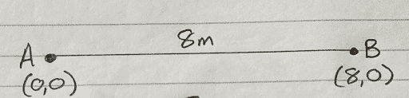
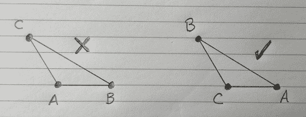

# 声音定位第 2 部分，带 Qwiic 声音触发器和 u-blox ZED-F9x

> 原文：<https://learn.sparkfun.com/tutorials/sound-location-part-2-with-the-qwiic-sound-trigger-and-the-u-blox-zed-f9x>

## 介绍

在[之前的教程](https://learn.sparkfun.com/tutorials/sound-location-with-the-qwiic-sound-trigger-and-the-u-blox-zed-f9x)中，我们向您展示了如何使用新的 [SparkX Qwiic 声音触发器](https://www.sparkfun.com/products/17979)和 [u-blox ZED-F9P GNSS 接收器](https://www.sparkfun.com/products/16481)来计算声音的位置。

[](https://www.sparkfun.com/products/16481) 

将**添加到您的[购物车](https://www.sparkfun.com/cart)中！**

 **### [踢腿式 GPS-RTK-SMA 突围-zed-F9(qwiic)T3](https://www.sparkfun.com/products/16481)

[In stock](https://learn.sparkfun.com/static/bubbles/ "in stock") GPS-16481

SparkFun GPS-RTK-SMA 提高了高精度 GPS 的标准，是一系列功能强大的 RTK 板中最新的一款

$274.9511[Favorited Favorite](# "Add to favorites") 33[Wish List](# "Add to wish list")****[](https://www.sparkfun.com/products/retired/17979) 

### [Qwiic 声音触发](https://www.sparkfun.com/products/retired/17979)

[Retired](https://learn.sparkfun.com/static/bubbles/ "Retired") SPX-17979

Qwiic 声音触发器基于 Vesper Technologies 的 VM1010 和 TI PCA9536 GPIO 扩展器。VM1010 是一款…

**Retired**[Favorited Favorite](# "Add to favorites") 3[Wish List](# "Add to wish list")** **qw IC 声音触发器可以单独使用，也可以作为 qw IC 系统的一部分。它基于 Vesper Technologies 的 VM1010 和 TI PCA9536 GPIO 扩展器。VM1010 是一个聪明的小设备，可以被置于一个非常低功耗的“声音唤醒”模式。当它检测到声音时，它被唤醒并将 TRIG (D [OUT] 引脚拉高。然后，通过拉低 mode 引脚，可以将 VM1010 置于“正常”模式；然后，它就像一个普通的麦克风。模拟麦克风信号可在音频(V [输出]引脚上获得。所有这些都发生得非常快，在 50 微秒内(比电容式 MEMS 麦克风快得多)，因此您不会错过音频信号的开始。这使得它非常适合用作声音触发器！

u-blox ZED-F9P GNSS 接收机是老朋友了。它是高精度 GNSS 定位解决方案的顶级模块，包括具有 10 毫米三维精度的 RTK。有了这个板，你将能够知道你(或任何物体)的 X，Y，Z 位置在大约你指甲宽度的范围内！没有得到足够讨论的一点是，ZED-F9P 还可以以 ***纳秒*** 的分辨率捕捉其 INT 引脚上的信号时序！它是通过一个叫做蒂姆·TM2 的 UBX 消息来实现的。

在本教程中，我们把它带到下一个维度。真的！上次，我们用了两个声音触发系统来计算声音从一个触发器到另一个触发器的路线上的来源。那是一个一维(1D)系统。如果我们添加第三个声音触发器，我们可以*三角测量*声音在二维空间(2D)的位置，允许我们在 X 和 Y 或东和北绘制位置！

先说一下*三角测量* …。

## 声源三角测量

上次，我们了解到，我们可以通过测量声音在两个声音触发点的到达时间的*差*来计算声音的位置。在我们的 1D 例子中，我们:

*   将时差转换成距离(乘以声速)
*   从两个声音触发器之间的距离中减去这个距离
*   然后除以 2 来计算离最近的触发器(最先检测到声音的触发器)的距离

在 2D，涉及到更多的数学问题。我们姑且称我们的三个声音触发系统为 A、B、c，A 是我们的参照物或者说*原点*。如果我们把触发器 B 放在 A 的正东方，我们可以把 A 和 B 的连线称为 X 轴。还记得你以前在数学课上画图表吗？原点在图纸的左下角，水平向右画出 X 轴。我们在这里做着同样的事情。触发器 A 是我们在 X = 0，Y = 0 的原点。我们把它写成(0，0)。如果触发器 B 离 A 有 8 米远，那么它的位置是 X = 8，Y = 0。我们把它写成(8，0)。

[](https://cdn.sparkfun.com/assets/learn_tutorials/2/3/2/0/SoundTutorial2_1.png)

到目前为止，一切顺利。现在，我们应该把触发器 C 放在哪里？实际上，这并不重要。我们可以定位 C，使 ABC 形成一个完美的等边三角形(一个三边都等长的三角形)。那会给我们这个地区最好的覆盖。但是 C 的坐标应该是(4，6.93)。不愉快。

[](https://cdn.sparkfun.com/assets/learn_tutorials/2/3/2/0/SoundTutorial2_2.png)

为了简化本例中的数学计算，让我们将 C 定位在距离 a 正北的 6m 处。C 的坐标为 X = 0，Y = 6。我们把它写成(0，6)。

[](https://cdn.sparkfun.com/assets/learn_tutorials/2/3/2/0/SoundTutorial2_3.png)

我们知道从 A 到 B 的距离是 8 米，从 A 到 C 的距离是 6 米。但是 B 到 C 的距离呢？我们也需要知道。如果我们拿出卷尺测量，我们会发现它正好是 10 米。如果你还记得数学课上的毕达哥拉斯定理，*斜边上的平方等于其他两边的平方之和*，我们可以通过下式计算 B 到 C 的距离:

*   从 A 到 B 的距离的平方(自乘):8 x 8 = 64
*   从 A 到 C 的距离的平方(乘以自身):6 x 6 = 36
*   将它们相加:64 + 36 = 100
*   计算平方根:√100 = 10

[](https://cdn.sparkfun.com/assets/learn_tutorials/2/3/2/0/SoundTutorial2_4.png)

同样，为了让数学更简单，让我们假设声速是 1 米每秒(1 米/秒)，而不是 343.42 米/秒

现在，假设我们的声音触发系统正在运行，它检测到一种声音:

*   触发器 A 记录的时间是 10:00:03.605551
*   触发器 B 记录的时间是 10:00:05.385165
*   触发器 C 记录的时间是 10:00:05.000000

让我们计算一下这些时间的差异:

*   a 首先记录声音，所以我们将使用它作为我们的参考
*   b 在 10:00:05.385165-10:00:03.605551 = 1.779614 秒后录制声音
*   c 录制 10:00:05.000000-10:00:03.605551 = 1.394449 秒后的声音

由于声速为 1 米/秒，我们现在知道声音在传播到 B 时比传播到 a 时多传播了 1.779614 米，并且我们知道声音在传播到 C 时比传播到 a 时多传播了 1.394449 米

我们不知道声音传播了多远到达 a，这是我们需要计算的第一件事。

我们把声音的位置叫做:S，我们把 S 的坐标叫做:(x，y)。我们把 S 到 A 的距离叫做:d。

如果我们画一张草图——不按比例——它看起来像这样:

[](https://cdn.sparkfun.com/assets/learn_tutorials/2/3/2/0/SoundTutorial2_5.png)

我们知道:

*   从 S 到 A 的距离是 D 米
*   从 S 到 B 的距离是 D + 1.779614 米
*   从 S 到 C 的距离是 D + 1.394449 米

为了找到 S 的位置，我们需要使用三角形。这就是为什么这种技术被称为“三角测量”。在三角学和几何学中，三角测量是通过由已知点形成三角形来确定点的位置的过程。

如果我们把图表分成更多的三角形:

[](https://cdn.sparkfun.com/assets/learn_tutorials/2/3/2/0/SoundTutorial2_6.png)

我们可以使用毕达哥拉斯定理来计算我们需要的距离:

*   d²= x²+y²
*   (D+1.779614)²=(8-x)²+y²
*   (D+1.394449)²= x²+(6-y)²

我们可以这样写:

*   d²= x²+y²
*   y²=(D+1.779614)²-(8-x)²
*   x²=(D+1.394449)²-(6-y)²

我们需要求解 d。首先，让我们将第二个等式中 y ² 的值代入第一个等式:

*   D²= x²+(D+1.779614)²-(8-x)²

乘以括号，就变成了:

*   D²= x²+D²+1.779614 . D+1.779614 . D+1.779614²-(8²-8x-8x+x²

简化后，它变成了:

*   D²= x²+D²+3.559228 . D+3.167026-(64-16 . x+x²)

如果我们去掉括号:

*   D²= x²+D²+3.559228 . D+3.167026-64+16 . x-x²

D ² 抵消，x ² 离开也是如此:

*   0 = 3.559228.D + 3.167026 - 64 + 16.x

最后一次重新排列树叶:

*   16.x = -3.559228.D + 60.832974

如果我们除以 16，剩下的是:

*   x = -0.222452.D + 3.802061

现在让我们回到我们的三个三角形:

*   d²= x²+y²
*   y²=(D+1.779614)²-(8-x)²
*   x²=(D+1.394449)²-(6-y)²

这一次，让我们将第三个等式中 x ² 的值代入第一个等式:

*   D²=(D+1.394449)²-(6-y)²+y²

乘以括号，就变成了:

*   D²= D²+1.394449D+1.394449D+1.944488-(36-6y-6y+y²)+y²

如果我们去掉括号:

*   D²= D²+1.394449D+1.394449D+1.944488-36+6y+6y-y²+y²

同样，D ² 抵消，y ² 离开:

*   0 = 2.788898.D + 1.944488 - 36 + 12.y

最后一次重新排列树叶:

*   12.y = -2.788898.D + 34.055512

如果我们除以 12，剩下的是:

*   y = -0.232408.D + 2.837959

现在，我们可以将 x 和 y 的值放回到第一个等式中:

*   d²= x²+y²

*   d²=(-0.222452 . d+3.802061)²+(-0.232408 . d+2.837959)²

将括号相乘，我们得到:

*   d²= 0.049485 . d²-1.691552 . d+14.455668+0.054013 . d²-1.319129 . d+8.054011

简化:

*   0.896502 . d²+3.010681 . d-22.509679 = 0

现在，我相信你也会记得数学课上的二次方程。我们可以使用以下等式求解 D:

*   (-b +/- √(b ² - 4.a.c ) ) / 2.a

*   a = 0.896502

*   b = 3.010681
*   c = -22.509679

插入我们的值，D 是:

*   ( -3.010681 +/- √(9.064200 + 80.719889) ) / 1.793004

等于:

*   3.605550 或-6.963804

我们可以忽略负值，因为它不在我们的三角形内。现在我们知道 D 是 3.605550m！

回头看看我们的 x 和 y 方程:

*   x = -0.222452.D + 3.802061
*   y = -0.232408.D + 2.837959

如果我们插入 D 的值，我们最终可以计算 S 的 x 和 y 坐标:

*   ( -0.802062 + 3.802061 , -0.837959 + 2.837959 )

那就是:

*   ( 3.000 , 2.000 )

[](https://cdn.sparkfun.com/assets/learn_tutorials/2/3/2/0/SoundTutorial2_7.png)

真想不到！

这种技术可以用于触发位置的任何配置。它们不需要排列成整齐的直角三角形。如果你想证明这一点，并且想看看解决这个问题的数学方法，看看名为[这里有龙的部分吧！](https://learn.sparkfun.com/tutorials/sound-location-part-2-with-the-qwiic-sound-trigger-and-the-u-blox-zed-f9x#here-there-be-dragons)

## 好消息是

谢谢你坚持和我们在一起。好消息是，我们已经编写了更多的 Python 代码来为您做这些计算！

[GitHub 硬件报告](https://github.com/sparkfunX/Qwiic_Sound_Trigger)包含[声音触发器的两个例子](https://github.com/sparkfunX/Qwiic_Sound_Trigger/tree/master/Examples)。您可以在 Arduino IDE 中运行这些程序。第二个例子是取悦大众！它运行在 [MicroMod 数据记录载板](https://www.sparkfun.com/products/16829)和 [Artemis 处理器板](https://www.sparkfun.com/products/16401)上，但它应该可以与我们的任何处理器板一起正常工作。它与我们的 [ZED-F9P 分线点](https://www.sparkfun.com/products/16481)和 [Qwiic 声音触发器](https://www.sparkfun.com/products/17979)通信，以捕捉声音事件并将其作为 u-blox UBX TIM_TM2 消息记录到 SD 卡中。

[](https://www.sparkfun.com/products/16829) 

将**添加到您的[购物车](https://www.sparkfun.com/cart)中！**

 **### [SparkFun MicroMod 数据记录载板](https://www.sparkfun.com/products/16829)

[20 available](https://learn.sparkfun.com/static/bubbles/ "20 available") DEV-16829

MicroMod 数据记录载体提供了一个使用 MicroMod 系统的低功耗数据记录平台，允许您选择 y…

$21.50[Favorited Favorite](# "Add to favorites") 9[Wish List](# "Add to wish list")****[](https://www.sparkfun.com/products/16401) 

将**添加到您的[购物车](https://www.sparkfun.com/cart)中！**

 **### [SparkFun MicroMod Artemis 处理器](https://www.sparkfun.com/products/16401)

[24 available](https://learn.sparkfun.com/static/bubbles/ "24 available") DEV-16401

该处理器具有 Artemis 模块，能够进行机器学习、蓝牙、I2C、GPIO、PWM、SPI，并打包以适应…

$14.95[Favorited Favorite](# "Add to favorites") 14[Wish List](# "Add to wish list")**** ****一旦你有了三个声音事件 UBX TIM_TM2 文件，我们的[Sound _ Trigger _ Analyzer _ 2d . py](https://github.com/sparkfunX/Qwiic_Sound_Trigger/tree/master/Utils)将为你处理这些文件并计算声音事件的位置！

*   从第一个系统的 SD 卡上复制 TIM_TM2.ubx 文件。重命名该文件，以便知道它来自哪个系统。你可能想把它叫做蒂姆 TM2 ubx
*   对第二个和第三个系统中的 TIM_TM2.ubx 文件执行相同的操作。同样，重命名它们，以便知道它们来自哪个系统。
*   将所有三个文件放在与 Sound _ Trigger _ Analyzer _ 2d . py Python 文件相同的文件夹/目录中

通过调用以下命令运行 Python 代码:

```
language:python
python Sound_Trigger_Analyzer_2D.py TIM_TM2_A.ubx TIM_TM2_B.ubx TIM_TM2_C.ubx 8.0 6.0 10.0 20.0 
```

*   用第一个系统(A)中的文件名替换蒂姆·TM2·A·ubx
*   用第二个系统(B)中的文件名替换蒂姆·TM2·B·ubx
*   将 TIM_TM2_C.ubx 替换为第三个系统的文件名(C)
*   将 8.0、6.0 和 10.0 替换为以米为单位的声音触发器之间的距离
    *   你必须按正确的顺序输入它们: **A-B** 然后是 **A-C** 然后是 **B-C**
*   20.0 是可选的。这是摄氏温度。为了更加准确，将它改为你的实际温度

Python 代码将计算并显示它找到的任何有效声音事件的(x，y)坐标。坐标系使用 A 的位置作为原点，从 A 到 B 的直线作为 X 轴。Y 轴(当然)是从 x 逆时针 90 度。

计算代码假设 C 的 X 坐标是 A 和 B 之间的*，如果 C 位于 A 的左边，或者 B 的右边，那么你需要重命名你的点。如果 C 在 A 的左边，那么 B 变成 A，C 变成 B，A 变成 C:*

[](https://cdn.sparkfun.com/assets/learn_tutorials/2/3/2/0/SoundTutorial2_8.png)

享受你的坐标！

## 这里有龙！

Sound_Trigger_Analyzer_2D.py 可以在任意配置的触发位置下工作(只要 C 的 X 坐标在 A 和 B 之间*)。它们不需要排列成 A-C 指向北方的直角三角形。不相信我？想要证据吗？对你有好处！好的。振作起来。开始了…这是 Sound_Trigger_Analyzer_2D.py 中使用的实际数学。*

### 传感器坐标

假设我们的三个声音触发器排列成三角形 ABC:

[](https://cdn.sparkfun.com/assets/learn_tutorials/2/3/2/0/SoundTutorial2_9.png)

我们知道边的长度:AB，AC 和 BC。

我们知道 A 和 b 的坐标，A 是我们的原点，位于(0，0)。b 在 A 的正东方，定义了我们的 X 轴。所以我们说 B 位于(AB，0)。但是我们还不知道 c 的*位置*，我们需要计算它。我们称 C 的位置(C [X] ，C [Y] )。

如果我们从 C 画一条线，使它与 A-B 线成直角:

[](https://cdn.sparkfun.com/assets/learn_tutorials/2/3/2/0/SoundTutorial2_10.png)

毕达哥拉斯定理告诉我们:

*   **等式 1:**AC²= C[X]2+C[Y]²
*   **等式 2:**BC²=(a b-C[X])²+C[Y]²

如果我们重新排列这些等式，将 C [Y] ² 移到左边，乘以括号，我们得到:

*   C[Y]T2 2= AC²-C[X]2
*   c[Y]2= BC²-AB²+2。AB . C[X]C[X]2

因为这两个等式是相等的，所以我们可以将它们排列如下:

*   AC²-C[X]²= BC²-AB²+2。AB . C[X]-C[X]2

两个 C[X]2 相互抵消。重新排列，我们得到:

*   c[X]=(AC²-BC²+AB²)/2。AB 型血

我们可以通过将 C [X] 的值插入到我们之前的一个等式中来找到 C [Y] :

*   C[Y]T2 2= AC²-C[X]2

所以:

*   C[Y]=√(AC²-C[X]2

我们现在有了 C 的坐标:(C [X] ，C [Y]

### 声音事件计时

现在，让我们假设我们的声音触发系统正在运行，它检测到一个声音。我们来调用声音 S 的位置，给它坐标(S [X] ，S [Y] ):

[](https://cdn.sparkfun.com/assets/learn_tutorials/2/3/2/0/SoundTutorial2_11.png)

我们的三个系统记录声音到达每个传感器的时间(非常准确！).

声音到达 A 所用的时间是:从 S 到 A 的距离除以声速。对于 B 和 c 也是如此。

如果所有三个系统在完全相同的时间听到声音，那么我们知道声音从 S 传播到 A、B 和 c 需要相等的时间。这是一个特殊情况，其中距离 s a、SB 和 SC 相等(*等距*)。但是通常传感器 B 和 C 将在不同的时间听到声音，因为距离 s B 和 SC 与 SA 不同。我们需要在计算中包括这些距离上的差异。为了节省打字，让我们称这个距离为萨:D

*   SB = D + D [diffB]
*   SC = D + D [diffC]

D [diffB] 是 SB 和 D 之间的差异。同样，D [diffC] 是 SC 和 D 之间的差异。请注意，如果声源距离 B 或 C 比距离 a 更近，D [diffB] 或 D [diffC] 可能为负值

根据 D [diffB] 和 D [diffC] ，传感器 B 和 C 会比 A 更早或更晚听到声音。

我们不知道声音从 S 传播到 A 需要多长时间，因为我们不知道距离 d。这是我们需要计算的，

我们所知道的是声音到达我们三个传感器的时间差。如果我们将三组传感器数据放在一起，我们可以计算到达每个传感器的时间的*差*。假设:

*   触发器 A 记录的时间是时间 A
*   触发器 B 记录的时间是 timeB
*   触发器 C 记录的时间是 timeC

让我们计算一下这些时间的差异:

*   T [diffB] = timeB - timeA
*   T [diffC] = timeC - timeA

同样，如果声源比 a 更靠近 B 或 C，T [diffB] 和 T [diffC] 可能是负值

### 声音事件坐标

我们可以通过乘以声速将这些时间差转化为距离差:

*   D [diffB] = T [diffB] *声速
*   D [diffC] = T [diffC] *声速

现在，我们可以像以前一样使用毕达哥拉斯定理来研究我们的三角形:

*   d²= S[X]²+S[Y]2
*   (D+D[diffB])²=(a b-S[X])²+S[Y]²

我们需要添加一个额外的三角形来包含 SC:

[](https://cdn.sparkfun.com/assets/learn_tutorials/2/3/2/0/SoundTutorial2_12.png)

新三角形的宽度为:

*   c[X]S[X]

新三角形的高度是:

*   C [Y] - S [Y]

所以，再次使用毕达哥拉斯定理:

*   (D+D[diffC])²=(C[X]-S[X])²+(C[Y]-S[Y])²

我们现在有了三个方程:

*   **等式 3:**D²= S[X]2+S[Y]²
*   **等式 4:**(D+D[diffB])²=(a b-S[X])²+S[Y]²
*   **等式 5:**(D+D[diffC])²=(C[X]-S[X])²+(C[Y]-S[Y])²

我们需要求解 D .首先，让我们将第二个方程中 S [Y] ² 的值代入第一个方程，这样我们就可以找到 D 和 S [X] 之间的关系:

*   D²= S[X]²+(D+D[diffB])²-(a b-S[X])²

乘以括号，就变成了:

*   D²= S[X]²+D²+2。D [diffB] 。D+D[diffB]²-AB²+2。AB . S[X]-S[X]2

和以前一样，D ² 取消，S[X]2 也取消:

*   0 = 2.D [diffB] 。D+D[diffB]²-AB²+2。AB.S [X]

重新排列:

*   2.AB.S [X] = AB ² - 2。D [diffB] 。D-D[diffB]2

除以 2。AB:

*   S [X] = ( AB ² - 2。D [diffB] 。D-D[diffB]2)/2。AB 型血

让我们让自己的生活变得更轻松，并说:

*   **等式 6:** S [X] = S [Xa] 。D + S [Xb]

其中:

*   S [Xa] = ( -2。D [diffB] ) / 2。AB 型血
*   s[Xb]=(AB²-D[diffB]²)/2。AB 型血

我们可以计算这两个值，因为我们知道 AB，并且可以计算 D [diffB] :

*   D [diffB] = T [diffB] *声速=(时间 B -时间 A ) *声速

再次看等式 3:

*   d²= S[X]²+S[Y]2

如果我们用(S [Xa] 代替 S [X] 。D + S [Xb] ，我们得到:

*   D ² = ( S [Xa] 。d+S[Xb])²+S[Y]²

重新排列:

*   S[Y]²= D²-(S[Xa]。D + S [Xb] ) ²

乘以括号，就变成了:

*   S[Y]2= D²-S[Xa]2。D ² - 2。S [Xa] 。S [Xb] 。d-S[Xb]2

简化:

*   S[Y]2=(1-S[Xa]2)。D ² - 2。S [Xa] 。S [Xb] 。d-S[Xb]2

所以:

*   **等式 7:**S[Y]=√((1-S[Xa]2)。D ² - 2。S [Xa] 。S [Xb] 。d-S[Xb]2

这有点可怕，但是让我们继续吧…

现在我们有了用 D 表示的 S [X] 和 S [Y] 的值，我们可以将它们代入等式 5:

*   (D+D[diffC])²=(C[X]-S[X])²+(C[Y]-S[Y])²

代入 S [X] 和 S [Y] 我们得到:

*   (D+D[diffC])²=(C[X]-(S[Xa])。d+S[Xb])²+(C[Y]-√((1-S[Xa]²)。D ² - 2。Xa 。S [Xb] 。d-S[Xb]2)²

乘以括号得出(打起精神！):

*   D ² + 2。D [难度]。D + D [难度]^(【2】)= c[²-2。C [X] 。S [Xa] 。D - 2 员额。C [X] 。s[XB]+s[【xa】]。D ² + 2。S [Xa] 。s〔t28〕XB〔t29〕。d+s[XB]^(+c[和] ² - 2。C [和]。(1-s[xa]t422。d²2。s〔t46〕xa〔t47〕。s〔t48〕XB〔t49〕。d-s[XB]^(【2】)+(1-s[【xa】]^(【2】)。d〔t58〕2〔t59〕2。S [Xa] 。S [Xb] 。d-s[【XB】]^(【2】))]

简化并向左移动除根以外的所有内容，得到:

*   (1-s[xa]^(^(-(1-s[【xa】]^()；D ² + ( 2)。D [难度] + 2。C [X] 。s[xa]2 .S [Xa] 。S [Xb] + 2。s〔t20〕xa〔t21〕。s〔t22〕XB〔t23〕。D + D [难度]^(【2】)-c[【x]²+2。C [X] 。s[XB]-s[【XB】]^(【2】[[^(【2】)+s[【XB】]t【t】C [和]。√1-s〔T50〕xa〔t51〕t52〔2〕t53〕。d〔t54〕2〔t55〕2。s〔t56〕xa〔t57〕。s〔t58〕XB〔t59〕。d-s[XB]t62【2】]]))))

幸运的是，D ² 项完全抵消了，这是个好消息。如果不是这样，我们就有一个四次方程要解，而不是二次方程…

简化:

*   ( 2.D [diffC] + 2。C [X] 。S [Xa] )。D+D[diffC]²-C[X]²+2。C [X] 。s[Xb]-C[Y]2=-2。C [Y] 。√((1-S[Xa]2)。D ² - 2。S [Xa] 。S [Xb] 。d-S[Xb]2

除以-2。C [Y] 给出:

*   ( ( 2.D [diffC] + 2。C [X] 。S [Xa] )。D+D[diffC]²-C[X]²+2。C [X] 。s[Xb]-C[Y]2/-2。c[Y]=√((1-S[Xa]2)。D ² - 2。S [Xa] 。S [Xb] 。d-S[Xb]2

我们现在需要双方广场，以消除根源。痛苦…但我们需要这样做…但首先，为了让自己的生活更轻松，让我们进一步简化，说:

*   达。d+db =√((1-S[Xa]2)。D ² - 2。S [Xa] 。S [Xb] 。d-S[Xb]2

其中:

*   da = ( 2。D [diffC] + 2。C [X] 。S [Xa] ) / -2。C [Y]
*   db =(D[diffC]2-C[X]2+2。C [X] 。s[Xb]-C[Y]²)/-2。C [Y]

请记住，我们已经可以计算 da 和 db 的值，因为我们知道或者可以计算:D [diffC] 的值；c[X]；s[Xb]；和 C [Y] 。

两边都是方形:

*   da ² 。d²+2 . da . db . d+db²=(1-s[xa]2。d²2。S [Xa] 。S [Xb] 。D - S [Xb] ²

将右边的术语移到左边:

*   (达²-(1-S[Xa]²))。D ² + ( 2.da.db + 2。S [Xa] 。S [Xb] )。d+db²+S[Xb]2= 0

那是一个二次方程，我们可以用通常的方法求解。让我们来制作:

*   QA = da²-1+S[Xa]2
*   qb = 2.da.db + 2。S [Xa] 。S [Xb]
*   QC = db²+S[Xb]2

请记住，我们已经可以计算 qa、qb 和 qc 的值，因为我们已经知道:da；s[Xa]；db；还有 S [Xb] 。

求解二次方程:

*   d =(-q b+/-√( QB²-4 . QA . QC))/2 . QA

这给了我们两个可能的 d 值，一个是负的或者无效的，剩下一个 d 值。

然后，我们可以将 D 的值代入等式 6，以找到 S 的 X 坐标，因为我们已经知道 S [Xa] 和 S [Xb] 的值:

*   S [X] = S [Xa] 。D + S [Xb]

然后，我们可以使用等式 3 计算 S 的 Y 坐标:

*   d²= S[X]²+S[Y]2
*   S[Y]=√(D²-S[X]2

享受你的坐标！******