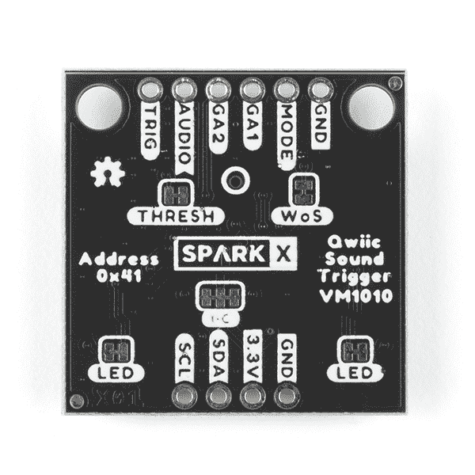
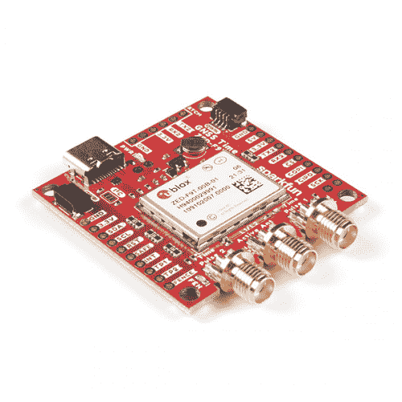
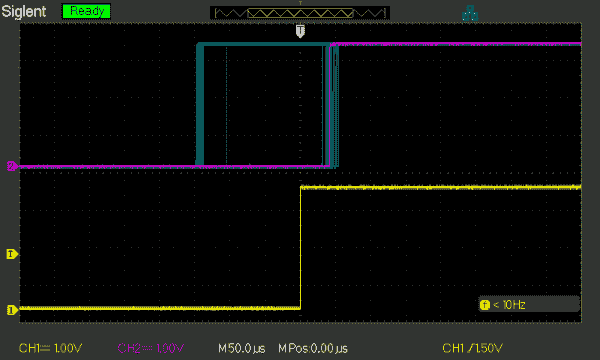
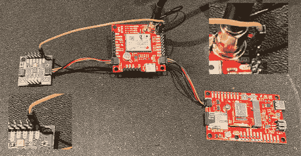

# 使用 Qwiic 声音触发器和 u-blox ZED-F9x 进行声音定位

> 原文：<https://learn.sparkfun.com/tutorials/sound-location-with-the-qwiic-sound-trigger-and-the-u-blox-zed-f9x>

## 介绍

在本教程中，我们将向您展示如何使用 [SparkX Qwiic 声音触发器](https://www.sparkfun.com/products/17979)和 [u-blox ZED-F9P GNSS 接收器](https://www.sparkfun.com/products/16481)来计算声音的位置。

[](https://www.sparkfun.com/products/16481) 

将**添加到您的[购物车](https://www.sparkfun.com/cart)中！**

### [踢腿式 GPS-RTK-SMA 突围-zed-F9(qwiic)T3](https://www.sparkfun.com/products/16481)

[In stock](https://learn.sparkfun.com/static/bubbles/ "in stock") GPS-16481

SparkFun GPS-RTK-SMA 提高了高精度 GPS 的标准，是一系列功能强大的 RTK 板中最新的一款

$274.9511[Favorited Favorite](# "Add to favorites") 33[Wish List](# "Add to wish list")****[](https://www.sparkfun.com/products/retired/17979) 

### [Qwiic 声音触发](https://www.sparkfun.com/products/retired/17979)

[Retired](https://learn.sparkfun.com/static/bubbles/ "Retired") SPX-17979

Qwiic 声音触发器基于 Vesper Technologies 的 VM1010 和 TI PCA9536 GPIO 扩展器。VM1010 是一款…

**Retired**[Favorited Favorite](# "Add to favorites") 3[Wish List](# "Add to wish list")** **qw IC 声音触发器可以单独使用，也可以作为 qw IC 系统的一部分。它基于 Vesper Technologies 的 VM1010 和 TI PCA9536 GPIO 扩展器。VM1010 是一个聪明的小设备，可以被置于一个非常低功耗的“声音唤醒”模式。当它检测到声音时，它被唤醒并将 TRIG (D [OUT] 引脚拉高。然后，通过拉低 mode 引脚，可以将 VM1010 置于“正常”模式；然后，它就像一个普通的麦克风。模拟麦克风信号可在音频(V [输出]引脚上获得。所有这些都发生得非常快，在 50 微秒内(比电容式 MEMS 麦克风快得多)，因此您不会错过音频信号的开始。这使得它非常适合用作声音触发器！如果你把 Qwiic 声音触发器翻过来，你会看到一个白色圈起来的小洞。那是麦克风的开口。你需要让板子的背面指向你的声源，而不是正面。

[](https://cdn.sparkfun.com/assets/learn_tutorials/2/3/1/9/17979-Qwiic_Sound_Trigger-03.jpg)

u-blox ZED-F9P GNSS 接收机是老朋友了。它是高精度 GNSS 定位解决方案的顶级模块，包括具有 10 毫米三维精度的 RTK。有了这个板，你将能够知道你(或任何物体)的 X，Y，Z 位置在大约你指甲宽度的范围内！没有得到足够讨论的一点是，ZED-F9P 还可以以 ***纳秒*** 的分辨率捕捉其 INT 引脚上的信号时序！它是通过一个叫做蒂姆·TM2 的 UBX 消息来实现的。

这两块板共同构成了我们噪声源定位系统的核心。想知道声音是从哪里来的吗？这些板让你做到这一点！

我们还将向您展示如何使用 MicroMod 数据记录载板和 Artemis 处理器板将来自 ZED-F9P 的 TIM_TM2 数据记录到 SD 卡中。但是如果需要，我们的示例代码可以适用于任何电路板。然后，我们将继续展示如何使用我们的示例 Python 代码来处理数据并计算声音的位置！

但首先，让我们谈谈声音本身…

## 声音的速度

我们都知道声音传播得比光慢。如果你看到一道闪电，可能要过几秒钟你才能听到雷声。大概是每英里 5 秒。数到 15 秒，风暴就离你 3 英里了。但是让我们用公制。

音速约为每秒 343.42 米(767 英里/小时)。但是它随温度和湿度而变化。在 20°C(68°F)、湿度为 0%时的速度为 343.42 米/秒。在热天、冷天或雨天，天气会发生变化。它也随着压力/高度而变化，因为空气的温度通过理想气体定律与其压力联系在一起。你可能记得在学校的化学课上学过。

我们将使用的声速公式是:

| 声速(米/秒)= 331.3+0.606 吨 |

其中 T 是摄氏温度，而不是开尔文。

因此，速度大约改变了。每秒 0.6 米或温度每度变化 0.2%。我们会把它包括在我们的计算中。

## 计算声音的位置

现在我们知道了声音传播的速度，我们可以谈谈如何计算声音的位置。

假设我们有两个声音触发器，一个在走廊的一端，我们想计算脚步声来自哪里。如果声音触发器相距 10 米(10m ),并且脚步声来自一个触发器 3 米远的地方，来自另一个触发器 7 米远的地方，则:

*   声音到达第一个声音触发器需要 3 / 343.42 = 8.74x10 ^(-3) 秒(8.74 毫秒)
*   声音到达第二个声音触发器需要 7 / 343.42 = 20.38x10 ^(-3) 秒(20.38 毫秒)

但是，如果我们只有每个声音触发器听到脚步声的时间，我们如何计算位置呢？像这样:

*   我们在每一端都有一个 ZED-F9P，并非常精确地标记每个触发事件的时间戳
*   两个时间戳之间的*差值*将为 11.65 毫秒(20.38 毫秒-8.74 毫秒)
*   我们可以利用时间差来计算位置，因为我们知道声音触发器之间的距离
*   在 11.65 毫秒内，声音传播 343.42 * 0.01165 = 4.0 米
*   我们可以通过从 10.0 米减去 4.0 米，然后除以 2 来计算距离第一个声音触发的距离
*   我们的声音来自离第一个声音触发器 3.0 米远的地方

如果我们想计算声音在二维空间的位置，X 和 Y，或者东和北，那么我们需要三个声音触发器，这样我们就可以用 T2 三角测量位置。我们将在下一个教程中向您展示如何做到这一点！

## 精确度和误差来源

查看 ZED-F9P 高精度 GNSS 模块的数据手册，我们发现其 60 纳秒时间脉冲信号的精度为 99%。如果我们看看 ZED-F9T 高精度计时模块的数据手册，我们会发现它提供了一个很大的改进:在绝对计时模式下，时间脉冲的精度为 5 纳秒；和 8 纳秒时间标记分辨率。所以，真的，如果我们想要最高的精度，我们应该使用 ZED-F9T。

[](https://www.sparkfun.com/products/18774) 

将**添加到您的[购物车](https://www.sparkfun.com/cart)中！**

### [【spark fun GNSS 定时突破- ZED-F9T (Qwiic)](https://www.sparkfun.com/products/18774)

[21 available](https://learn.sparkfun.com/static/bubbles/ "21 available") GPS-18774

SparkFun GNSS 定时突破为 SparkFun 的地理空间目录提供了一个独特的入口，其中包含 ZED-F9T GNSS 接收…

$299.95[Favorited Favorite](# "Add to favorites") 6[Wish List](# "Add to wish list")** **现在 60ns 真的不是很长了。它是 0.00000006 秒。但是声音在 60 纳秒里能走多远呢？如果我们将 343.42 乘以 0.00000006，我们得到 20.6 x 10 ^(-6) 米。或者 0.02 毫米。好的。那挺好的！所以我们不需要太担心 ZED-F9P 的计时精度。不要忘记，捕获我们的时间标记或中断的蒂姆·TM2 消息具有纳秒级的分辨率。

但是我们的 VM1010 声音触发器呢？好吧，数据手册没有包含我们真正需要的数字，即从声音越过检测阈值到 TRIG (D [OUT] )信号变高的最小和最大延迟。但是，只要芯片与芯片之间没有太大的差异，延迟并不重要。如果时间延迟是固定的，它将在我们的计算中被抵消。但是，如果一个芯片与另一个芯片的延迟不同，就会影响精度。所以我们来测量一下吧！

这是在两个 VM1010 上检测到的 100 个声音事件的示波器轨迹。黄色轨迹上的一个 VM1010 触发了示波器。紫色轨迹是来自第二个 VM1010 的 TRIG (D [OUT] )信号。它们是由一只训练狗的辅助设备发出的短促的“咔哒”声触发的。是的，我们小心翼翼地确保它们与点击的距离相同！

[](https://cdn.sparkfun.com/assets/learn_tutorials/2/3/1/9/SoundTutorial1_1.png)

我注意到的一件有趣的事情是，当我**按下狗训练辅助设备上的**按钮，以产生一对咔哒声中的第一个时，第二个 VM1010 的输出信号在第一个之前大约 140 微秒**跟随上升沿组。当我**松开训练辅助设备上的**按钮，进行第二次点击时，第二个 VM1010 的输出在第一个**之后大约 50 微秒**之后。我还没有一个理论来解释为什么会这样……但这肯定与每次点击的强度或频谱的细微差异有关。**

无论如何，如果我们将这两个 VM1010 之间的最差情况误差定为 140 微秒，则对应的距离为 343.42 * 0.00014 = 0.048 米或 4.8 厘米。这仍然是相当可观的，与我们测量每个感测点的位置时所能预期的精度相差不远。

总之，我们可以挥舞着手说，我们可以期待我们的声音定位系统的精度优于 10 厘米。快乐的日子！

## 示例代码

[GitHub 硬件报告](https://github.com/sparkfunX/Qwiic_Sound_Trigger)包含[声音触发器的两个例子](https://github.com/sparkfunX/Qwiic_Sound_Trigger/tree/master/Examples)。您可以在 Arduino IDE 中运行这些程序。

第一个例子，顾名思义，非常简单。它使用 Qwiic (I ² C / Wire)总线与声音触发器上的 PCA9536 通信。如果检测到声音事件，您会看到一条串行消息，显示距离上次声音事件有多长时间。然后该事件被清除(复位)为下一个事件做好准备。声音触发器上的红色 LED 将在每次事件时短暂亮起。每次事件发生时，主板上的 LED(LED _ BUILTIN)将闪烁一整秒钟。

第二个例子是取悦大众！它运行在 [MicroMod 数据记录载板](https://www.sparkfun.com/products/16829)和 [Artemis 处理器板](https://www.sparkfun.com/products/16401)上，但它应该可以与我们的任何处理器板一起正常工作。它与我们的 [ZED-F9P 分线点](https://www.sparkfun.com/products/16481)和 [Qwiic 声音触发器](https://www.sparkfun.com/products/17979)通信，以捕捉声音事件并将其作为 u-blox UBX TIM_TM2 消息记录到 SD 卡中。

[](https://www.sparkfun.com/products/16829) 

将**添加到您的[购物车](https://www.sparkfun.com/cart)中！**

### [SparkFun MicroMod 数据记录载板](https://www.sparkfun.com/products/16829)

[20 available](https://learn.sparkfun.com/static/bubbles/ "20 available") DEV-16829

MicroMod 数据记录载体提供了一个使用 MicroMod 系统的低功耗数据记录平台，允许您选择 y…

$21.50[Favorited Favorite](# "Add to favorites") 9[Wish List](# "Add to wish list")****[](https://www.sparkfun.com/products/16401) 

将**添加到您的[购物车](https://www.sparkfun.com/cart)中！**

### [SparkFun MicroMod Artemis 处理器](https://www.sparkfun.com/products/16401)

[24 available](https://learn.sparkfun.com/static/bubbles/ "24 available") DEV-16401

该处理器具有 Artemis 模块，能够进行机器学习、蓝牙、I2C、GPIO、PWM、SPI，并打包以适应…

$14.95[Favorited Favorite](# "Add to favorites") 14[Wish List](# "Add to wish list")**** ****## 硬件连接

*   将一排 6 路接头引脚焊接到 Qwiic 声音触发器上，以便您可以访问 TRIG 引脚。
*   请参见[数据记录连接指南](https://learn.sparkfun.com/tutorials/micromod-data-logging-carrier-board-hookup-guide)
*   将 Artemis 处理器插入 MicroMod 数据记录载板，并用螺钉固定。
*   使用 Qwiic 电缆将 ZED-F9P GNSS 分线点连接到载板。
*   将天线连接到您的 GNSS 板。天线必须能清楚地看到天空。如果需要，将电缆延伸并穿过窗户。
*   将已格式化的 micro-SD 卡插入载板的插槽中。
*   使用第二根 qw IC 电缆将 qw IC 声音触发器连接到 ZED-F9P。
*   使用跨接电缆将 Qwiic 声音触发器上的 TRIG 引脚连接到 ZED-F9P 分线盒上的 INT 引脚。
*   使用 USB-C 电缆将载板连接到您的计算机。

[](https://cdn.sparkfun.com/assets/learn_tutorials/2/3/1/9/SoundTutorial1_2.png)

为了最大限度地减少 I ² C 总线错误，最好打开 MicroMod 数据记录载板上的 I ² C 上拉分离焊盘链接以及 u-blox 模块分线点和 Qwiic 声音触发器。

## 软件设置

*   确保您安装了 SparkFun Apollo3 板
*   此代码已在 Arduino IDE 1.8.13 上使用 1.2.1 版本的 Apollo3 板进行了测试。
*   选择“SparkFun Artemis MicroMod”作为电路板类型。
*   按上传将代码上传到 Artemis。
*   以 115200 波特打开串行监视器查看输出。

每当 Qwiic 声音触发器检测到声音时，它会将其 TRIG 引脚拉高。ZED-F9P 将在其 INT 引脚上检测到这一情况，并生成一个 TIM_TM2 消息。阿耳忒弥斯将把蒂姆·TM2 的信息记录到 SD 卡上。然后你就可以用纳秒的分辨率来研究声音脉冲的定时，计算声音的位置！

该代码将对声音事件进行“去抖”,并在 250 毫秒后为下一个事件重置 VM1010。

注意:对于每个导航解决方案，蒂姆·TM2 只能捕捉一个上升沿和一个下降沿的时序。因此，当 setNavigationFrequency 设置为 4Hz 时，我们只能看到每 250ms 一个上升沿的时序。代码“去抖”每个声音事件，以确保每个导航解决方案只有一个上升沿事件。

只有在 ZED-F9P 的 INT 引脚上检测到上升沿或下降沿时，才会产生 TIM_TM2 消息。如果您断开 TRIG 至 INT 跳线，消息将停止。

数据以 u-blox UBX 格式记录。请参阅 u-blox 协议规范了解更多详细信息。如果需要，您可以使用 [u-center](https://www.u-blox.com/en/product/u-center) 回放和分析数据。

## 分析蒂姆·TM2 的数据

我们的 [Python 示例](https://github.com/sparkfunX/Qwiic_Sound_Trigger/tree/master/Utils)将为您处理 UBX 文件以计算声音事件的位置！

对于最简单的双音触发设置:

*   从第一个系统的 SD 卡上复制 TIM_TM2.ubx 文件。重命名该文件，以便知道它来自哪个系统。你可能想把它叫做蒂姆·TM2 1 号
*   对第二个系统中的 TIM_TM2.ubx 文件执行相同的操作。再次，重命名它，这样你就知道它来自哪个系统。
*   将这两个文件放在与 Sound _ Trigger _ Analyzer _ 1d . py Python 文件相同的文件夹/目录中

通过调用以下命令运行 Python 代码:

```
language:python
python Sound_Trigger_Analyzer_1D.py TIM_TM2_1.ubx TIM_TM2_2.ubx 10.0 20.0 
```

*   根据需要，用第一个系统中的文件名替换蒂姆·TM2 1 . ubx
*   根据需要，用第二个系统中的文件名替换蒂姆·TM2 2 . ubx
*   将 10.0 替换为两个声音触发器之间的距离，单位为米
*   20.0 是可选的。这是摄氏温度。为了更加准确，将它改为你的实际温度

Python 代码将打开并分析这两个 UBX 文件，并从蒂姆·TM2 数据中提取声音事件的时间。然后，它将寻找时间上足够接近的事件对。对于它找到的每一对，它将计算来自传感器 1 的声音的距离。如果你在走廊里测试，从传感器 1 走向传感器 2，你会看到距离随着脚步的增加而逐渐增加。

下一次，我们将利用三个系统进行 2D 声音定位，从而更上一层楼！敬请关注…********