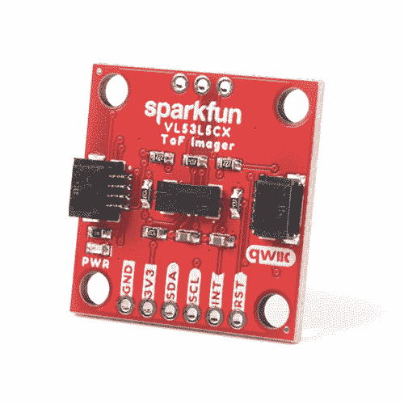
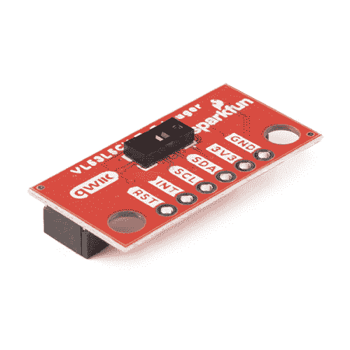

# Qwiic ToF 成像仪- VL53L5CX 连接指南

> 原文：<https://learn.sparkfun.com/tutorials/qwiic-tof-imager---vl53l5cx-hookup-guide>

## 介绍

[Qwiic ToF 成像仪- VL53L5CX](https://www.sparkfun.com/products/18642) 和 [Qwiic 迷你 ToF 成像仪- VL53L5CX](https://www.sparkfun.com/products/19013) 都在这里！这些小分线板是围绕 ST Electronics 的 VL53L5CX 构建的；先进的飞行时间(ToF)多区域测距传感器，增强了 ST FlightSense 产品系列。该芯片集成了 SPAD 阵列、物理红外滤光器和衍射光学元件(DOE ),可在各种环境光照条件下利用各种盖玻片材料实现最佳测距性能。

多区域距离测量最多可达 8×8 区域，具有 63°对角线宽视场，可通过软件缩小。得益于 ST 直方图专利算法，VL53L5CX 能够检测 FoV 内的不同物体。直方图还提供了对超过 60 cm 的玻璃盖串扰的抗扰度。

该传感器上的 Qwiic 连接器使集成变得容易，是 3D 房间映射、机器人障碍检测、手势识别、物联网、激光辅助自动对焦和 AR/VR 增强的理想选择。

 

将**添加到您的[购物车](https://www.sparkfun.com/cart)中！**

### [SparkFun Qwiic ToF 成像仪- VL53L5CX](https://www.sparkfun.com/products/18642)

[In stock](https://learn.sparkfun.com/static/bubbles/ "in stock") SEN-18642

SparkFun Qwiic ToF 成像仪是围绕 ST Electronics 的 VL53L5CX 打造的；最先进的，飞行时间(ToF)，多区域…

$24.952[Favorited Favorite](# "Add to favorites") 9[Wish List](# "Add to wish list")**** 

将**添加到您的[购物车](https://www.sparkfun.com/cart)中！**

### [SparkFun Qwiic 迷你 ToF 成像仪-VL 53 l5 CX](https://www.sparkfun.com/products/19013)

[In stock](https://learn.sparkfun.com/static/bubbles/ "in stock") SEN-19013

SparkFun Qwiic 迷你 ToF 成像仪是围绕 ST Electronics 的 VL53L5CX 打造的；最先进的，飞行时间(ToF)，mu…

$25.501[Favorited Favorite](# "Add to favorites") 11[Wish List](# "Add to wish list")**** ****[https://www.youtube.com/embed/TkAV8aNZ5a4/?autohide=1&border=0&wmode=opaque&enablejsapi=1](https://www.youtube.com/embed/TkAV8aNZ5a4/?autohide=1&border=0&wmode=opaque&enablejsapi=1)

### 所需材料

要跟随本教程，您将需要以下材料。你可能不需要所有的东西，这取决于你拥有什么。将它添加到您的购物车，通读指南，并根据需要调整购物车。****