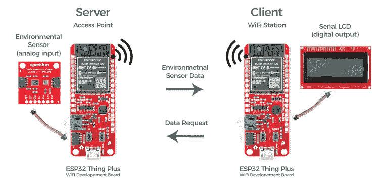

# 通过 WiFi 发送传感器数据

> 原文：<https://learn.sparkfun.com/tutorials/sending-sensor-data-over-wifi>

## 介绍

我们都很熟悉 WiFi。它管理着我们的家，让我们观看我们最喜欢的电影，让我们在咖啡店时不必与其他人交谈。但是，除了简单地通过不同的应用程序访问互联网，还有更多使用 WiFi 的方式。在本教程中，我们将向您展示如何设置您自己的对等网络，在不需要任何互联网连接或路由器的情况下，从一个区域感测数据，并将数据发送到其他地方的 LCD 屏幕。这是能够从任何嵌入式物理计算应用中移除电线的伟大的第一步。

## 项目:无线监控温度、湿度和气压

对于这一构建，我们将创建一个简单的点对点封闭 WiFi 系统，该系统从环境传感器读取数据，并将其发送到其他地方的显示器。我们将通过使用我们的硬件，利用 [Qwiic 连接系统](http://www.example.com)来连接我们的硬件，而不需要焊接，从而尽可能简化这个示例。硬件包括一对 [ESP32 Thing Plus Wroom](https://www.sparkfun.com/products/15663) 模块，一个 [Qwiic 环保组合分线](https://www.sparkfun.com/products/14348)，一个 [SparkFun Qwiic 单继电器](https://www.sparkfun.com/products/15093)，几根 [Qwiic 线缆](https://www.sparkfun.com/products/15081)。(当然，每个都有一个电源——电池或壁式充电器。)您可以使用下面的愿望列表将本教程的所有商品添加到您的购物车中。