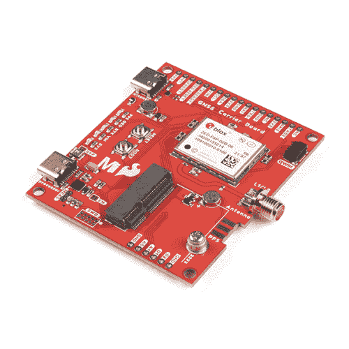

# MicroMod GNSS 载板(ZED-F9P)连接指南

> 原文：<https://learn.sparkfun.com/tutorials/micromod-gnss-carrier-board-zed-f9p-hookup-guide>

## 介绍

[SparkFun MicroMod GNSS 载板(ZED-F9P)](https://www.sparkfun.com/products/17722) 将高精度 GPS 和 MicroMod 的灵活性结合在一块板上。利用 u-blox 的 ZED-F9P 模块，MicroMod GNSS 载板能够达到 10 毫米 3 维精度。是的，你没看错，这些板可以输出你的 X，Y，Z 位置，大概是你指甲的宽度。强大的能力带来了一些要求:高精度 GPS 需要清晰的天空视野(抱歉，没有室内位置)和来自 RTCM 源的一系列校正数据。我们将在后面的章节中对此进行更深入的讨论，但只要您有两个 ZED-F9P 分线板，或者可以访问在线校正源，您的 ZED-F9P 就可以以厘米级的精度输出纬度、经度和高度。

 

将**添加到您的[购物车](https://www.sparkfun.com/cart)中！**

 **### [【spark fun micro mod GNSS 载板(ZED-F9P)](https://www.sparkfun.com/products/17722)

[In stock](https://learn.sparkfun.com/static/bubbles/ "in stock") GPS-17722

SparkFun MicroMod GNSS 载板具有 GNSS 实时运动学(RTK)的准确性和微型计算机的灵活性

$324.95[Favorited Favorite](# "Add to favorites") 6[Wish List](# "Add to wish list")** **[https://www.youtube.com/embed/wkfgzFLIOLU/?autohide=1&border=0&wmode=opaque&enablejsapi=1](https://www.youtube.com/embed/wkfgzFLIOLU/?autohide=1&border=0&wmode=opaque&enablejsapi=1)

### 所需材料

要学习本教程，您至少需要以下材料。你可能不需要所有的东西，这取决于你拥有什么。将它添加到您的购物车，通读指南，并根据需要调整购物车。为了充分利用 ZED-F9P，您需要一个校正源。根据您的设置，您可能需要第二个 ZED-F9P 或访问在线校正源。**