# 红帽公司实验室机器人手套件课程指南

> 原文：<https://learn.sparkfun.com/tutorials/red-hat-colab-robotic-hand-kit-curriculum-guide>

## 介绍

在这个套件中，您将找到理解连续旋转(CR)伺服和传感器基础所需的一切。

[https://www.youtube.com/embed/l0QTRCFZhHc/?autohide=1&border=0&wmode=opaque&enablejsapi=1](https://www.youtube.com/embed/l0QTRCFZhHc/?autohide=1&border=0&wmode=opaque&enablejsapi=1)

Red Hat 机械手套件将帮助您:

1.  通过使用 CR 伺服系统试验简单电路，了解试验板的工作原理。
2.  设计并制作一只可以弯曲和释放的手。

[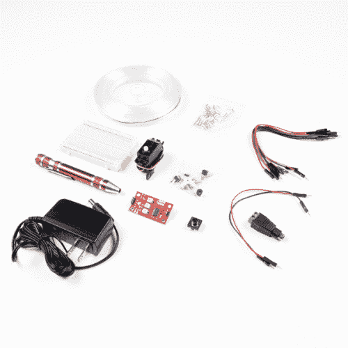](https://www.sparkfun.com/products/18483) 

将**添加到您的[购物车](https://www.sparkfun.com/cart)中！**

 **### [红帽公司实验室机械手套件](https://www.sparkfun.com/products/18483)

[Only 9 left!](https://learn.sparkfun.com/static/bubbles/ "only 9 left!") CUST-18483

在这个工具包中，您将在制作自己的机器人手时学习导电性是如何工作的。

$49.95[Favorited Favorite](# "Add to favorites") 0[Wish List](# "Add to wish list")** **## 开始之前

在你开始组装你的工具包之前，你可以提前做一些事情来确保你的项目成功。下面的信息将告诉你在每个部分上你预计要花多少时间，你需要什么工具和材料，以及在你开始你的项目之前你能做什么。

[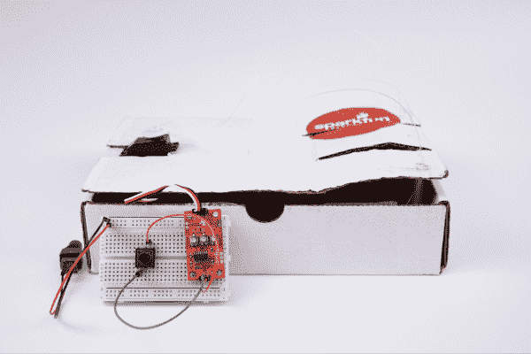](https://cdn.sparkfun.com/assets/learn_tutorials/2/1/2/4/image10.png)

**推荐年龄和必备技能**

这项活动最适合 12-15 岁的孩子。除了会打结和使用剪刀之外，完成这个项目不需要任何特定的技能。不需要预先了解电路。

**时间要求**

*   第一部分:创造一只“手”——30 分钟
*   第二部分:连续旋转伺服和字符串- 45 分钟

**工具和材料**

1.  红帽公司实验室机器人手套件
2.  盒子:用来做我们的手
3.  剪刀:用于修改实验纸板(剪切纸板)

**识别零件**

在建造之前了解你将使用的部件是很有帮助的。在你面前的一张纸上展开零件。当你把它们摆出来的时候，把它们捡起来，逐一检查。它有多少个别针？上面有什么颜色？组件的每一条腿都一样长吗？你能根据它的样子或它的名字猜出它是做什么的吗？在每个部分旁边写下这些观察结果，因为这将帮助你在开始探索和构建时组织这些部分。

当你为你的项目布置部件的时候，确保你有工具箱里没有的其他需要的材料(纸板盒和一把剪刀)。

至此，您已经:

1.  识别每个部分(并贴上标签，以便更容易找到)。
2.  数了每一部分，以确保你有正确的数字。
3.  检查了每一部分，以确保它没有损坏。

现在你已经完成了设置，你可以开始设计和实验。

[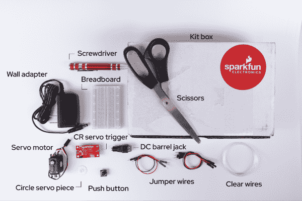](https://cdn.sparkfun.com/assets/learn_tutorials/2/1/2/4/image3.png)

## 资源

以下是对该套件中各部分的深入描述。

*   [Circuits](https://learn.sparkfun.com/tutorials/what-is-a-circuit) :电路工作原理的基础知识，以及更多信息的链接。
*   [试验板](https://learn.sparkfun.com/tutorials/how-to-use-a-breadboard):彻底检查试验板的内部结构。
*   [连续旋转伺服](https://learn.sparkfun.com/tutorials/continuous-rotation-servo-trigger-hookup-guide):CR 伺服的说明。
*   [伺服](https://www.sparkfun.com/servos):伺服的一般解释。

 [### 什么是电路？](https://learn.sparkfun.com/tutorials/what-is-a-circuit) Every electrical project starts with a circuit. Don't know what a circuit is? We're here to help.[Favorited Favorite](# "Add to favorites") 82 [### 如何使用试验板](https://learn.sparkfun.com/tutorials/how-to-use-a-breadboard) Welcome to the wonderful world of breadboards. Here we will learn what a breadboard is and how to use one to build your very first circuit.[Favorited Favorite](# "Add to favorites") 79 [### 连续旋转伺服触发器连接导轨](https://learn.sparkfun.com/tutorials/continuous-rotation-servo-trigger-hookup-guide) How to use the SparkFun Continuous Rotation Servo Trigger with continuous rotation servos, without any programming 11

## 第 1 部分:创造一只“手”

手是做什么的？

人类的手是一台复杂的机器，由皮肤、骨骼、肌肉、神经、肌腱和韧带组成。我们的手允许我们以多种方式、不同程度的力量和灵巧来抓握物品。复制一只手是非常困难的，因为它有许多组成部分和触觉。想象一下你举起一支铅笔写字的方式，你举起一个沉重的袋子的方式，以及你开门的方式之间的区别。这些活动中的每一项都需要不同的动作、不同的手指和不同水平的力量来完成任务。作为实验的一部分，我们将专注于如何用电路和纸板盒复制几个手指的抓握动作。

我们怎样才能复制一只手？

首先从装工具包的纸板箱中取出一些碎片。打开盖子，取下通常在关闭时会塞入盒子的每个侧翼。

[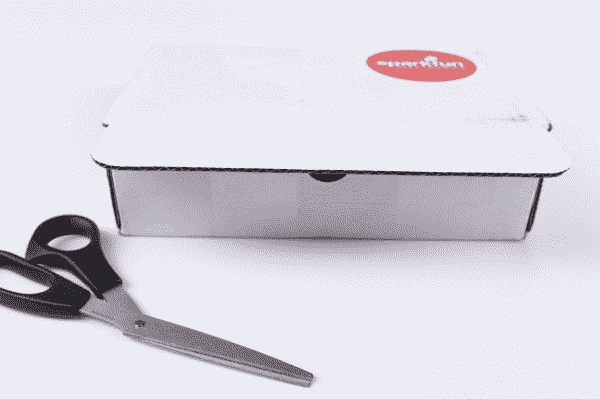](https://cdn.sparkfun.com/assets/learn_tutorials/2/1/2/4/image12.png)

接下来，让盒子开口的一边面向你(也是靠近顶部切下一个半圆的一边)，在左手边切一个长方形。这是您将插入伺服的地方—您可以使用该部分来测量要创建的槽的大小。

在长方形的另一端，剪下小缺口，形成三个手指。这些间隙应该类似于非常薄的矩形。

使用钢笔或螺丝刀最细的一端，在每个手指的中心戳几个洞。最好的方法是打开盖子，把它翻过来，这样你就能看到纸板箱的棕色一面。然后，轻轻施加压力，在纸板上形成尽可能小的洞。

接下来，复制手指弯曲的方式。这意味着在大约相同的位置稍微折一下每个手指。这些将复制第二个指关节和手指与手的连接处。然后，弯曲整个盖子，刚好在薄矩形的下面，模仿手如何折叠。

现在你有了手的开端。下一步，测量出三个单一的清晰的电线。每个盒子的长度应该是盒子长度的一半。要做到这一点，采取明确的线和线轴足够运行的长度长的一部分，然后足够运行沿同样的一半，直到你得到半圈。

[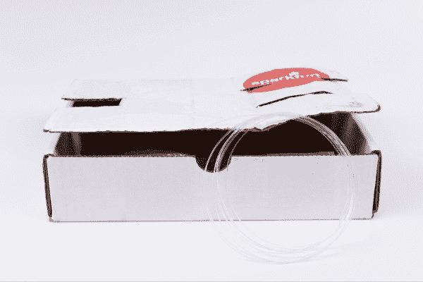](https://cdn.sparkfun.com/assets/learn_tutorials/2/1/2/4/image13.png)

对于每根电线，将一端穿过您创建的指孔，使结位于底部。将另一端向上穿过圆形伺服片上的孔，使其在顶部打结。

## 第 2 部分:试验板和 CR 伺服系统

下面的演练展示了第 2 部分的步骤。

**什么是电路？**

电路是一个闭合的回路，电流可以在其中流动。最基本的，电路由三部分组成:

*   A **电压源**:电路的电源。
*   一个**负载**:被供电的东西，比如伺服系统，蜂鸣器，或者灯。I .**电路路径**:电流在电路中流动的连续路径。

简单电路的一个例子是电源(如电池)、负载(如 LED)和电路路径(连接它们的电线)。

**制作电路**

**1。电源/电压源**

这个工具包带有一个连接到 DC 桶形插孔的墙壁适配器。与使用 9V 或 AA 电池不同，该套件要求我们直接从墙上的插座获取电源。不到最后一步，我们不会把适配器插到墙上。同时，准备好千斤顶。将筒式插孔连接到试验板的方法是使用跳线，跳线长度很短，可以快速轻松地连接元件。

套件中的跳线两侧都有小金属针。跳线的颜色与您工具箱中的任何东西都不对应。然而，习惯上使用红色电缆连接正极(+)和黑色电缆连接负极(-)。筒式连接器上的黑色塑料标有(+)和(-)符号，分别表示正极和负极。将跳线的一端滑入正极(+)绿色筒式插孔连接器，并将其与试验板右侧相应的正极(+)点匹配。对负极(-)连接重复此步骤。

[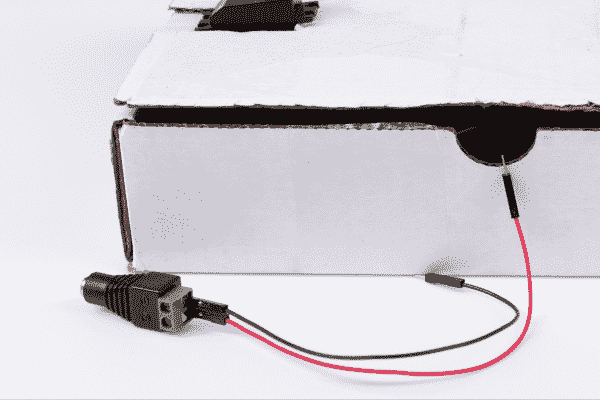](https://cdn.sparkfun.com/assets/learn_tutorials/2/1/2/4/image1.png)

**2。负载**

对于这一步，使用一个连接到由按钮触发的伺服机构的 CR 电路。停下来看看这些部分实际上是做什么的。

CR 伺服触发器是一个小型机器人板，可以简化伺服电机的控制。当外部开关或信号改变状态时，伺服触发器能够告诉连接的伺服从位置 A 移动到位置 b。要使用伺服触发器，连接一个爱好伺服和一个开关，然后使用板载电位计来调整开始/停止位置和过渡时间。通过这种方式，您可以在项目中使用业余爱好伺服，而无需进行任何编程。值得注意的是，CR 伺服触发器有三组引脚与之相连。一组三个引脚将用于连接到实际的伺服电机。一组两个引脚将用于连接跳线到按钮。这将启动和停止伺服系统的运行。最后一组两个引脚指向与其他引脚相反的方向，将用于直接将伺服触发器插入试验板电源轨。在遵循本指南后面的说明之前，请务必记下这些不同的引脚配置。

[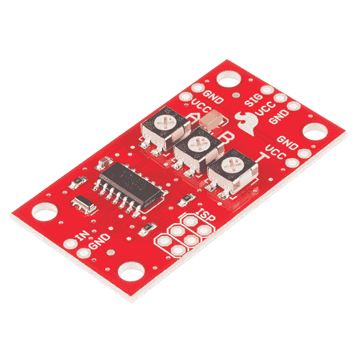](https://cdn.sparkfun.com/assets/learn_tutorials/2/1/2/4/image5.jpg)

伺服机构可以指已经存在了一段时间的许多不同的机器。从重型机械到汽车动力转向，从机器人到各种各样的电子产品，伺服系统无处不在。如果你打开一个标准的业余爱好伺服电机，你通常会发现三个核心部件，一个 DC 电机，一个控制器电路，一个电位计或类似的反馈机制。DC 电机连接到齿轮箱和输出/驱动轴，以增加电机的速度和扭矩。DC 电机驱动输出轴。控制器电路解释控制器发送的信号，电位计作为控制器电路的反馈来监控输出轴的位置。几乎所有的业余伺服系统都有一个标准的三针连接器来供电和控制伺服系统。有了伺服系统，你只需要三根电线就可以控制输出轴的方向、速度和位置。

[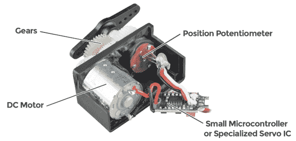](https://cdn.sparkfun.com/assets/learn_tutorials/2/1/2/4/image9.png)

开关是控制电路打开或关闭的部件。它允许对电路中的电流进行控制(无需实际进入电路并手动切割或拼接电线)。开关是任何需要用户交互或控制的电路中的关键元件。开关只能处于两种状态之一:打开或关闭。在 **off** 状态下，开关看起来像电路中的开路。实际上，这看起来像一个**开路**，阻止电流流动。在 **on** 状态下，开关就像一根导线。这个**闭合电路**，开启系统并允许电流不受阻碍地流过系统的其余部分。

[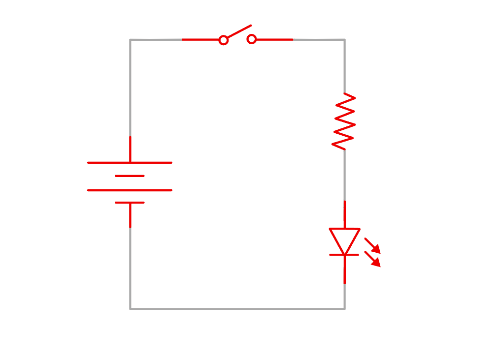](https://cdn.sparkfun.com/assets/learn_tutorials/2/1/2/4/image6.gif)

**3。电路路径**

要使电路正常工作，电源的通路不能中断——所有部件都必须接触。幸运的是，你有一个试验板，这是一个有用的工具，可以用来快速插入项目并保持连接。您还可以创建、修复小错误，并使用组件进行练习。

什么是试验板？

首先，看看您的套件中包含的试验板:

首先，注意在棋盘的两边有两个长长的洞，一个旁边有一条红线，一个旁边有一条黑线。这些被称为电源轨，单个电源轨中的所有孔都是相互连接的。如果电源连接到柱中的一个孔，它就连接到柱中的所有其他孔。

从墙上插座出来的电线末端的塑料模制件上有两个孔。将一根跨接导线插入这些孔中，并将另一端插入(+)电源轨和(-)电源轨。

[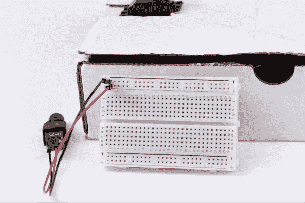](https://cdn.sparkfun.com/assets/learn_tutorials/2/1/2/4/image16.png)

第二，一个编号行中的所有孔都是相互连接的，但是这种连接在沿着板的中心延伸的小沟或凹痕处断开。每一侧可以是它自己的独立电路。我们的项目将使用跳线跳过沟渠，来回发送电力。

您可以将试验板视为一系列列(标记为 A-E 和 F-J)和行(标记为 1-30)。记住，中间的分隔线意味着 A5 没有连接到 F5。当你看到下面的说明时，你将使用这个行列系统来标记应该在哪里进行连接(A6、E3、H23 等。).

[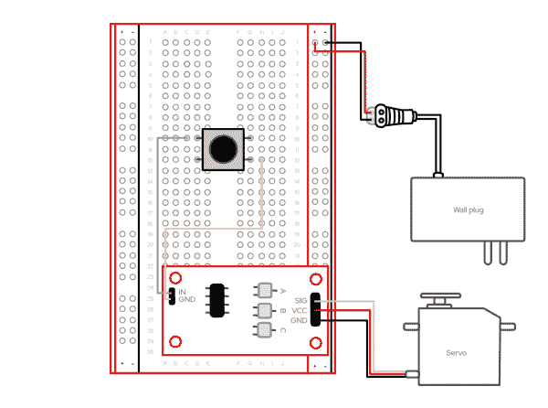](https://cdn.sparkfun.com/assets/learn_tutorials/2/1/2/4/image2.png)

复制上图所示的电路(步骤如下)。您将只使用几根跳线，但要特别小心地将它们放入试验板上的适当坐标点。不到最后一步，我们不会连接电源适配器。

**按如下方式创建电路:**

1.  找到与其他插针连接器指向相反方向的一组两个插针。放置 CR 伺服触发电路，使这些引脚与试验板右侧的正极(+)和负极(-)电源轨对齐。轻轻按压到位。
2.  连接按钮，使左侧固定在 D10 和 D12 中，右侧固定在 G10 和 G12 中。
3.  找到伺服触发器上指向上方的两个针脚。将跨接导线的插孔侧连接到标有 in 的针脚上，将跨接导线的针脚侧连接到 C10 上。
4.  将第二根跨接导线的插孔侧连接到标有“GND”的针脚上，针脚侧连接到 H12 上。
5.  将黑色三针连接器从伺服连接到伺服触发器上的其余三针连接器，使黑线连接到标有 GND 的针。
6.  确保桶形插孔电源的黑线和红线按照上述电路部分的讨论进行连接。

**测试**

一旦你完成了上面的步骤，把 DC 电源插到墙上，你就可以开始摆弄你的机械手了。要测试你的构建，只需点击按钮，观察伺服移动。在这一点上，你会想要修补连续旋转伺服触发器上的白色旋钮。在电路板上，你会发现三个电位计:“A”设置开关打开时伺服机构所处的位置，“B”设置开关闭合时伺服机构移动到的位置，“T”设置从 A 到 B 再返回所需的时间。

当你点击按钮时，你会发现旋转伺服触发器上标有“B”的白色旋钮会改变伺服的方向。

[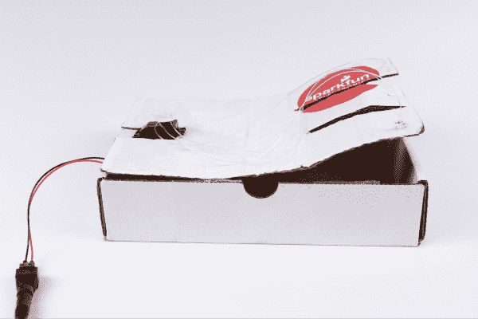](https://cdn.sparkfun.com/assets/learn_tutorials/2/1/2/4/image7.png)

## 解决纷争

如果你的项目没有成功，这里有一些东西可以参考(关于这些的一些很棒的插图和进一步的解释，见科学伙伴网站上的[“常见错误】)。)](https://www.sciencebuddies.org/science-fair-projects/references/how-to-use-a-breadboard#common-mistakes)

1.  检查您的连接

    1.  仔细检查说明中的坐标，确保引脚完全插入试验板上的匹配孔中。
    2.  确保元件完全安装在试验板上。当元件完全插入时，它应该进入试验板至少 4-5 毫米(或者比铅笔的厚度稍小)。
    3.  检查短裤。当组件意外连接时，可能会导致短路。
    4.  检查电容器的极性，确保它们符合说明。
2.  检查你的能量

    1.  确保您的电池完全插入。
    2.  确保你的电池工作正常。

**全套装备内容列表**

如果你需要更换一个零件，这里有一个组成 Red Hat 公司实验室机器人手套件的单个组件的列表。

*   1x [试验板](https://www.sparkfun.com/products/12002)
*   1x [伺服连续旋转(微小尺寸)](https://www.sparkfun.com/products/10189)
*   1x [SparkFun 伺服触发器-连续旋转，带割台](https://www.sparkfun.com/products/13872)
*   1x [墙壁适配器电源-5v 直流，2A(桶形插孔)](https://www.sparkfun.com/products/15312)
*   1x [DC 筒式千斤顶适配器-内螺纹](https://www.sparkfun.com/products/10288)
*   1x [袖珍螺丝刀套件](https://www.sparkfun.com/products/12891)
*   1x [跳线 M/M 2 件装](https://www.sparkfun.com/products/16662)
*   1x [跳线 M/F 10 件装](https://www.sparkfun.com/products/9140)
*   1x [瞬时按钮](https://www.sparkfun.com/products/9190)
*   1 根结实的透明尼龙钓鱼线

## 资源和更进一步

在你制造出你的机器人手之后，看看红帽开源故事电影，E-enable。这部电影向我们展示了我们如何为那些能力不同的人设计和创造，同时培养我们对那些以不同方式体验世界的人的同情心。

[https://www.youtube.com/embed/_-VXnMf6ct8/?autohide=1&border=0&wmode=opaque&enablejsapi=1](https://www.youtube.com/embed/_-VXnMf6ct8/?autohide=1&border=0&wmode=opaque&enablejsapi=1)

想要更多吗？在[red.ht/colab-kits](https://www.redhat.com/en/open-source-stories/colab/kits)查看额外的红帽公司实验室套件。**