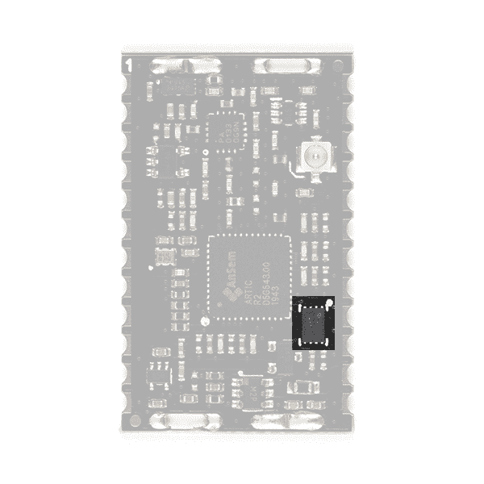

# IOTA(北极 R2)卫星通信模块连接指南

> 原文：<https://learn.sparkfun.com/tutorials/iota-artic-r2-satellite-communication-module-hookup-guide>

## 介绍

[](https://www.sparkfun.com/products/17984) 

将**添加到您的[购物车](https://www.sparkfun.com/cart)中！**

### [【spark fun IOTA】卫星通信模块(北极 R2)](https://www.sparkfun.com/products/17984)

[Only 8 left!](https://learn.sparkfun.com/static/bubbles/ "only 8 left!") SPX-17984

你的项目与环境保护、意识或研究有关，还是与保护人类生命有关？也许你正在发展…

$199.95[Favorited Favorite](# "Add to favorites") 5[Wish List](# "Add to wish list")** **为您的下一个项目寻找卫星通信板？这可能是一个！

我们提供三种 ARGOS 北极 R2 卫星收发器产品:

[](https://www.sparkfun.com/products/17236) 

将**添加到您的[购物车](https://www.sparkfun.com/cart)中！**

### [ARGOS 卫星收发器防护罩-北极 R2](https://www.sparkfun.com/products/17236)

[Only 10 left!](https://learn.sparkfun.com/static/bubbles/ "only 10 left!") SPX-17236

你的项目与环境保护、意识或研究有关，还是与保护人类生命有关？也许你正在发展…

$199.95[Favorited Favorite](# "Add to favorites") 7[Wish List](# "Add to wish list")****[](https://www.sparkfun.com/products/18618) 

将**添加到您的[购物车](https://www.sparkfun.com/cart)中！**

### [【北极精灵 R2】](https://www.sparkfun.com/products/18618)

[Out of stock](https://learn.sparkfun.com/static/bubbles/ "out of stock") SPX-18618

我们的红纸板很棒。但是他们有时候是不是显得有点* * _ 大 _**？！进入* * SML * *，这是一个新系列的主板，它…

$199.95[Favorited Favorite](# "Add to favorites") 5[Wish List](# "Add to wish list")****[](https://www.sparkfun.com/products/17984) 

将**添加到您的[购物车](https://www.sparkfun.com/cart)中！**

### [【spark fun IOTA】卫星通信模块(北极 R2)](https://www.sparkfun.com/products/17984)

[Only 8 left!](https://learn.sparkfun.com/static/bubbles/ "only 8 left!") SPX-17984

你的项目与环境保护、意识或研究有关，还是与保护人类生命有关？也许你正在发展…

$199.95[Favorited Favorite](# "Add to favorites") 5[Wish List](# "Add to wish list")****** ******如果您准备将 ARGOS 收发器集成到您的设计中，这款板[IOTA-ARGOS 的集成开源收发器](https://www.sparkfun.com/products/17984)是理想之选。它的城堡形焊盘可以根据需要回流或手工焊接。如果您的认证过程需要，它也有射频屏蔽罐插槽。堞形垫和 u.FL 连接器均提供天线连接。你会在 [SparkFun 鹰图书馆](https://github.com/sparkfun/SparkFun-Eagle-Libraries) [射频图书馆](https://github.com/sparkfun/SparkFun-Eagle-Libraries/blob/main/SparkFun-RF.lbr)找到 IOTA 的鹰符号和足迹。

阿尔戈斯卫星收发器防护罩——北极 R2 ，是三个中最大的，也是最容易上手的。它与我们的 Feather 兼容的 Thing Plus 板具有相同的尺寸，旨在直接堆叠在 Thing Plus 之上，以便于开发。如果您正在寻找一款能够让您了解 ARGOS 卫星通信如何工作的主板，或者刚刚开始您的产品开发，或者想要一款可以插入试验板的主板，或者不担心让您的跟踪系统尽可能紧凑，那么这款主板就是您的理想之选。

R2 北极号是三艘船中最小的一艘，但它仍然和它的兄弟姐妹们一样强大。如果您正在开发用于跟踪鲸鱼的小型飞镖，或用于跟踪鸟类的小型背包，或非常离散的卫星跟踪器，那么 SML ARTIC R2 就是您的理想之选。

[](https://cdn.sparkfun.com/assets/learn_tutorials/2/1/2/1/ARGOS_Comparison_Photo_Tutorial.jpg)*Having a hard time seeing? Click the image for a closer look.*[](https://cdn.sparkfun.com/assets/learn_tutorials/2/1/2/1/Trinity.png)

所有三块板都使用相同的北极 R2 卫星收发器芯片。三者都有相同的功率放大器，具有相同的最大输出功率和可调增益。三者具有相同的接收灵敏度。这三个都有包含北极 R2 固件和平台 ID 的板载闪存。所有这三个都由我们全面的 [Arduino 库](https://github.com/sparkfun/SparkFun_ARGOS_ARTIC_R2_Arduino_Library)支持，其中包括一整套经过测试的[示例](https://github.com/sparkfun/SparkFun_ARGOS_ARTIC_R2_Arduino_Library/tree/main/examples)。

如果您想了解 ARGOS 卫星网络本身的更多信息，请访问我们的 ARGOS(北极 R2)卫星通信指南:

[SparkFun ARGOS (ARTIC R2) Satellite Communication Guide](https://learn.sparkfun.com/tutorials/argos-artic-r2-satellite-communication-guide)

## 阿尔戈斯和北极 R2

ARGOS 卫星系统已经存在很长时间了。它于 1978 年由法国航天局(CNES)、美国国家航空航天局(NASA)和美国国家海洋和大气管理局(NOAA)创建，最初是作为收集和转发世界各地气象和海洋学数据的科学工具。今天，ARGOS 正在革新卫星通信，增加了 25 颗纳卫星星座，以补充 7 颗携带 ARGOS 仪器的传统卫星。其中的第一个，天使，已经在运行，SparkFun 是第一批在 2020 年 10 月向天使传输数据的用户之一。当星座完成时，卫星通过之间最多有 10-15 分钟的间隔。

北极 R2 是一个集成的，低功耗，小尺寸 ARGOS 2/3/4 单芯片收发器。ARTIC 实现了一个基于消息的无线接口。对于卫星上行链路通信，ARTIC 将对提供的用户信息进行编码、调制和传输。对于下行链路通信，ARTIC 将锁定下行链路，解调和解码并提取卫星消息。根据 ARGOS 卫星系统规范，ARTIC 可以在 400MHz 左右的频带中发射信号，并在 466MHz 左右的频带中接收信号。

IOTA 已经过 Kiné is 的测试和认证。与其他卫星通信系统相比，北极 R2 具有低得多的电流消耗，并且将与非常简单、非常轻便的四分之一波长线天线一起工作。IOTA 上的北极 R2 芯片组采用 3.3V 供电，板载闪存可实现快速启动。如果您不需要全部发射功率，或者想延长电池寿命，也可以通过光隔离增益控制降低发射功率。

我们的 [Arduino 库](https://github.com/sparkfun/SparkFun_ARGOS_ARTIC_R2_Arduino_Library)让启动和运行 ARGOS 变得非常容易。我们已经提供了一套完整的例子，将让你:配置北极 R2 芯片组；预测下一次卫星通过；接收所有广播和单独编码的消息；使用 ARGOS 2、3 和 4 编码传输消息。

* * *

The ARGOS satellite system is **currently** restricted to specific programs and applications. Please check that your project meets these requirements before buying hardware. [CLS (France)](https://www.cls-telemetry.com/argos-solutions/) and the [Woods Hole Group (America)](https://www.clsamerica.com/science-with-argos) will be able to advise if your project meets the requirements. *"To meet system use requirements, all programs using Argos have to be related in some way or other to environmental protection, awareness or study, or to protecting human life."* Please see our [ARGOS ARTIC R2 Communication Guide](https://learn.sparkfun.com/tutorials/argos-artic-r2-satellite-communication-guide#who-can-use-argos) for more details.

* * *

## 硬件概述

在本节中，我们将介绍 IOTA(北极 R2)卫星通信模块包含的内容。

### 北极 R2

IOTA 的核心当然是北极 R2 收发器本身。这是一个包含数字信号处理器(DSP)的智能芯片，可以调制发送消息和解调接收消息。DSP 可以通过 SPI 从片上闪存或外部微控制器引导。发射时，它产生一个 1mW (0dBm)的输出信号，该信号被馈送到一个单独的功率放大器。

[](https://cdn.sparkfun.com/assets/learn_tutorials/2/1/2/2/17984-SparkFun_IOTA_04_ARTIC_R2.jpg)

我们的 [Arduino 库](https://github.com/sparkfun/SparkFun_ARGOS_ARTIC_R2_Arduino_Library)会为您完成所有繁重的工作。默认情况下，该库将告诉北极 R2 DSP 从板载闪存启动。不过，只需更改一行代码，您就可以通过 SPI 引导，由微控制器为 DSP 提供固件。

### 射频放大器

发射期间，RFPA0133 功率放大器放大来自北极 R2 的 0dBm (1mW)信号。

[](https://cdn.sparkfun.com/assets/learn_tutorials/2/1/2/2/17984-SparkFun_IOTA_04_RF_Amp.jpg)

使用全增益时，放大器将信号提升至约 25.7dBm (370mW)。如果你使用 ARGOS 2 或 3 调制，并从一个“嘈杂”的环境(如城市)传输，那么你可能需要使用最大功率来确保你的信息通过。但是，如果您使用 ARGOS 4 调制和/或从一个“安静”的环境中传输，如苔原或海洋，那么您将能够以较低的功率传输。

### 增益控制

您可以通过软件和板载光隔离增益控制电路来调整发射增益。

[](https://cdn.sparkfun.com/assets/learn_tutorials/2/1/2/2/17984-SparkFun_IOTA_04_Gain.jpg)

我们的 [Arduino 库](https://github.com/sparkfun/SparkFun_ARGOS_ARTIC_R2_Arduino_Library)可以为你降低增益。如果您拨打:

```
language:c
myARTIC.attenuateTXgain(true); 
```

从代码内部，光隔离器会将 RFPA0133 的 G8 引脚拉低，从而将增益降低约 5dB。这还具有将发射电流降低约 80mA 的优势。

### 闪存

默认情况下，北极 R2 内部的 DSP 将从板载闪存启动。(但是，如上所述，您也可以选择通过 SPI 引导。)

[](https://cdn.sparkfun.com/assets/learn_tutorials/2/1/2/2/17984-SparkFun_IOTA_04_Flash.jpg)

在 SparkFun 进行生产测试期间，我们使用北极 R2 固件(北极 006)和 CLS 分配的平台 ID 对闪存进行编程。您需要在 ARGOS 帐户上注册平台 ID 来激活它。Arduino 库从内存中读取平台 ID，并在传输中使用它。

### 天线

在 IOTA 上，您可以选择天线连接:u . FL 或者齿形垫。

[](https://cdn.sparkfun.com/assets/learn_tutorials/2/1/2/2/17984-SparkFun_IOTA_04_Antenna.jpg)

* * *

**Warning:** Always connect a 401MHz antenna to your IOTA before connecting the power. Transmitting with no antenna attached will damage the RF power amplifier.

* * *

如果你以前没有使用过 u.FL，请查看我们的教程:

[](https://learn.sparkfun.com/tutorials/three-quick-tips-about-using-ufl) [### 关于使用 U.FL 的三个快速提示](https://learn.sparkfun.com/tutorials/three-quick-tips-about-using-ufl) Quick tips regarding how to connect, protect, and disconnect U.FL connectors.[Favorited Favorite](# "Add to favorites") 14

### 电力网

IOTA 需要一个**3.3V&pm；0.1V** DC 电源可应对 230mA 的最大发射电流。

电源电路包括:浪涌和过流保护；3.0V 和 1.8V 稳压器。

[](https://cdn.sparkfun.com/assets/learn_tutorials/2/1/2/2/17984-SparkFun_IOTA_04_Power.jpg)

### 筛选可以

IOTA 有用于射频屏蔽罐的插槽和接地垫，如果您的认证过程需要的话。

你可以在形状的[上找到屏蔽罐的设计。你可以右击图形文档选项卡，选择**导出...**以多种格式导出设计。](https://cad.onshape.com/documents/0fc72eb42eb448b1d611b621/w/5ca05817afae11501b84b0d0/e/ea75b8212d03f01bf10558e5)

[](https://cad.onshape.com/documents/0fc72eb42eb448b1d611b621/w/5ca05817afae11501b84b0d0/e/ea75b8212d03f01bf10558e5)[](https://cad.onshape.com/documents/0fc72eb42eb448b1d611b621/w/5ca05817afae11501b84b0d0/e/ea75b8212d03f01bf10558e5)

## 齿形垫

IOTA 具有 24 个齿形垫。根据您的需要，它可以回流或手工焊接到 PCB 上。

你会在[spark fun Eagle Libraries](https://github.com/sparkfun/SparkFun-Eagle-Libraries)[RF Library](https://github.com/sparkfun/SparkFun-Eagle-Libraries/blob/main/SparkFun-RF.lbr)中找到 IOTA 的鹰符号和足迹。

下面的照片是 IOTA 的底部。垫 1 在**右上**。

[](https://cdn.sparkfun.com/assets/learn_tutorials/2/1/2/2/17984-SparkFun_IOTA_03.jpg)

下表描述了 IOTA 的每个齿形垫的功能。从上面看 IOTA，pad 1 是**左上**。焊盘编号是逆时针的。

[](https://cdn.sparkfun.com/assets/learn_tutorials/2/1/2/2/17984-SparkFun_IOTA_04_Pad1.jpg)

| 垫号 | 名字 | 功能 | 描述 |
| **1** | **G8** | 投入 | 上拉至 3.3V，将 RFPA0133 发射功率设置为最大。如果将此引脚拉低或保持开路，发射功率将降低约 5dB。 |
| **2** | **3.0V 输出** | 输出 | 该焊盘允许测量模块的内部 3.0V 电源轨。 |
| **3** | **开机** | 投入 | 连接到 ARTIC BOOT 引脚。通过 100k 电阻上拉至 3.3V。高电平时，ARTIC 从外部闪存启动。如果 MCU 将通过 SPI 下载 ARTIC 固件，则拉低。 |
| **4** | **INT1** | 输出 | 连接到 ARTIC INT1 引脚。将被 ARTIC 上拉到 3.3V 以指示(例如)RX_VALID_MESSAGE。 |
| **5** | **INT2** | 输出 | 连接到 ARTIC INT2 引脚。将被 ARTIC 上拉到 3.3V 以指示(例如)RX_BUFFER_OVERFLOW。 |
| **6** | **RESETB** | 投入 | 连接到 ARTIC reset 引脚。通过 100k 电阻上拉至 3.3V。拉低以重置 ARTIC。 |
| **7** | **CS** | 投入 | SPI 接口片选。3.3V 低电平有效。 |
| **8** | **SCLK** | 投入 | SPI 接口时钟信号。通常为 1MHz。3.3V。有关允许的时钟速度，请参见北极 R2 数据手册。 |
| **9** | **COPI** | 投入 | SPI 接口:控制器输出外设输入。3.3V。 |
| **10** | **笑话** | 输出 | SPI 接口:控制器输入外设输出。3.3V。 |
| **11** | **1.8V 输出** | 输出 | 该焊盘允许测量模块的内部 1.8V 供电轨。 |
| **12** | **GND** |  | 电源接地/ 0V。 |
| **13** | **GND** |  | 电源接地/ 0V。 |
| **14** | **VIN** | 投入 | 模块的 3.3V 电源。**电压必须为:3.3V +/- 0.1V** 。电流限制:500mA。 |
| **15** | **PWR EN** | 投入 | 通过 10k 电阻拉低。上拉至 3.3V，为 arti R2 启用电源。 |
| **16** | **FLASH_PWR** | 投入 | 内部闪存的 3.3V 电源。**连接到第 17 针(3.3V 输出)**。 |
| **17** | **3.3V 输出** | 输出 | 连接到模块的内部 3.3V 供电轨(开关)，并为内部闪存供电。**连接到引脚 16 (FLASH PWR)** 。 |
| **18** | FLSH·SCLK |  | 内部 SST25VF020B 2-Mbit SPI 串行闪存的时钟信号。编程内部闪存时使用。**保持不连接**。 |
| **19** | flsh si |  | 内部 SST 25 VF 020 b 2 Mbit SPI 串行闪存的串行数据输入。编程内部闪存时使用。**保持不连接**。 |
| **20** | **FLSH 如此这般** |  | 内部 SST 25 VF 020 b 2 Mbit SPI 串行闪存的串行数据输出。编程内部闪存时使用。**保持不连接**。 |  |
| **21** | flsh cen |  | 内部 SST25VF020B 2-Mbit SPI 串行闪存的芯片使能。编程内部闪存时使用。**保持不连接**。 |
| **22** | **GND** |  | 电源接地/ 0V。 |
| **23** | **天线** | 无线电频率(radio frequency) | 天线连接(50 欧姆)。内部连接到 u.FL 连接器的中心引脚。 |
| **24** | **GND** |  | 电源接地/ 0V。 |

## Arduino 示例:卫星探测

* * *

**Warning:** Always connect a 401MHz antenna to your IOTA before connecting the power. Transmitting with no antenna attached will damage the RF power amplifier.

* * *

SparkFun ARGOS ARTIC R2 Arduino 库包含全套[经过测试的例子](https://github.com/sparkfun/SparkFun_ARGOS_ARTIC_R2_Arduino_Library/tree/main/examples)，可以在任何 Arduino 板上运行，但是你需要修改代码中的 pin 定义来匹配你的板。

本指南假设您已经安装了 Arduino IDE 和 ARGOS ARTIC R2 库，并选择了正确的 Arduino 板。如果你需要任何帮助，请查看阿尔戈斯北极 R2 盾连接指南。

下面的代码是[example 4 _ satellite detection](https://github.com/sparkfun/SparkFun_ARGOS_ARTIC_R2_Arduino_Library/blob/main/examples/Example4_SatelliteDetection/Example4_SatelliteDetection.ino)的精简版。将代码复制并粘贴到 Arduino IDE 的一个新窗口中:

```
language:c
#include <SPI.h>
#include "SparkFun_ARGOS_ARTIC_R2_Arduino_Library.h" // http://librarymanager/All#SparkFun_ARGOS_ARTIC_R2
ARTIC_R2 myARTIC;

// Pin assignments - change these if required
int CS_Pin = 24;
int GAIN8_Pin = 3;
int BOOT_Pin = 4;
int INT1_Pin = 5;
int INT2_Pin = 6;
int RESET_Pin = 7;
int IOTA_PWR_EN_Pin = 8;

void setup()
{
  Serial.begin(115200);
  Serial.println(F("ARGOS ARTIC R2 Example"));

  Serial.println(F("ARTIC R2 is booting..."));

  SPI.begin();

  //myARTIC.enableDebugging(); // Uncomment this line to enable debug messages on Serial

  // Begin the ARTIC: enable power and boot from flash
  if (myARTIC.beginIOTA(CS_Pin, RESET_Pin, BOOT_Pin, IOTA_PWR_EN_Pin, INT1_Pin, INT2_Pin, GAIN8_Pin) == false)
  {
    Serial.println("ARTIC R2 not detected. Freezing...");
    while (1)
      ; // Do nothing more
  }

  Serial.println(F("ARTIC R2 boot was successful."));

  // Read the Platform ID from flash memory
  uint32_t platformID = myARTIC.readPlatformID();
  if (platformID == 0)
  {
    Serial.println(F("You appear to have an early version of the SparkFun board."));
    Serial.println(F("For the transmit examples, you will need to use the Library Manager to select version 1.0.9 of this library."));
  }
  else
  {
    Serial.print(F("Your Platform ID is: 0x"));
    Serial.println(platformID, HEX);
  }

  myARTIC.setTCXOControl(1.8, true); // Set the TCXO voltage to 1.8V and autoDisable to 1

  myARTIC.setSatelliteDetectionTimeout(600); // Set the satellite detection timeout to 600 seconds

  Serial.println(F("Starting satellite detection..."));

  // Start satellite detection
  // The ARTIC will start looking for a satellite for the specified amount of time.
  myARTIC.sendMCUinstruction(INST_SATELLITE_DETECTION);
}

void loop()
{
  delay(1000);

  // Read the ARTIC R2 status register
  ARTIC_R2_Firmware_Status status;
  myARTIC.readStatusRegister(&status);

  // Check the interrupt 2 flag. This will go high if satellite detection times out
  if (status.STATUS_REGISTER_BITS.DSP2MCU_INT2)
  {
    Serial.println(F("INT2 pin is high. Satellite detection has timed out!"));
  }
  // Check the interrupt 1 flag. This will go high when a satellite is detected
  else if (status.STATUS_REGISTER_BITS.DSP2MCU_INT1)
  {
    Serial.println(F("INT1 pin is high. Satellite detected!"));
  }

  // Check the instruction progress
  // checkMCUinstructionProgress will return true if the instruction is complete
  ARTIC_R2_MCU_Instruction_Progress progress;
  boolean instructionComplete = myARTIC.checkMCUinstructionProgress(&progress);

  if (instructionComplete)
  {
    Serial.println(F("Satellite detection is complete! Freezing..."));
    while (1)
      ; // Do nothing more
  }
} 
```

保存文件并点击上传按钮，将示例上传到 Arduino 板上。打开*工具\串行监视器*查看串行信息。检查波特率是否设置为 **115200** :

[](https://cdn.sparkfun.com/assets/learn_tutorials/2/1/2/1/Satellite_Detection_2.png)

一旦北极 R2 启动，代码将从闪存中读取预编程的平台 ID。如果它没有找到，你会看到一条消息，提醒你安装 1.0.9 版的北极 R2 图书馆。

北极 R2 号将尝试探测一颗卫星长达 10 分钟。在运行本示例之前，您可能希望登录 ARGOS 网站并预测下一次卫星通过的时间。

## 电流消耗

在计算电池寿命时，了解 IOTA 消耗的电流当然非常重要。

我们使用神奇的 [Otii 电弧功率分析仪](https://www.sparkfun.com/products/18585)测量了北极 R2 盾的电流消耗。IOTA 在功能上与屏蔽相同，并且电流消耗相同。Otii Arc 配置为输出 3.6V，我们将其连接到 Shield 的 VBATT 引脚，以复制一个 LiPo 电池。

*   电流消耗:
    *   睡眠(PWR EN 和 RF EN 低电平):51 A
    *   空闲(启用电源指示灯):7.2 毫安(AVG)
    *   接收:32.9 毫安
    *   发射(全功率，G8 引脚高电平):226mA
    *   发射(降低增益，G8 引脚为低电平):170mA

以下是 Otii Arc 在全功率传输 ARGOS 3 ZE 数据时捕获的数据:

[](https://cdn.sparkfun.com/assets/learn_tutorials/2/1/2/1/Shield_Current_TX_Full.png)*Having a hard time seeing? Click the image for a closer look.*

以下是以较低功率传输 ARGOS 3 ZE 数据时的电流消耗:

[](https://cdn.sparkfun.com/assets/learn_tutorials/2/1/2/1/Shield_Current_TX_Reduced.png)*Having a hard time seeing? Click the image for a closer look.*

## 证书

IOTA 已经过负责 ARGOS 系统运行的[kine is](https://www.kineis.com/en/our-history/)的测试和认证。您可以在下面找到测试证书的副本。

*   ARGOS 4 VLD 证书 (IOTA)
*   ARGOS 2 证书 (ARGOS 北极 R2 卫星收发器屏蔽)
*   ARGOS 3 证书 (ARGOS 北极 R2 卫星收发器屏蔽)

我们非常感谢 kinis 花费时间和精力测试 SparkFun ARTIC R2 产品。

## 解决纷争

**Not working as expected and need help?** [SparkX](https://www.sparkfun.com/sparkx) products are rapidly produced to bring you the most cutting edge technology as it becomes available. These products are tested but come with no guarantees. Live technical support is not available for SparkX products. Head on over to our [forum](https://forum.sparkfun.com/viewforum.php?f=123) for support or to ask a question and we will get back to you as soon as we can.

## 资源和更进一步

有关 IOTA 的更多信息，请查看以下链接:

**IOTA 文档:**

*   [示意图](https://cdn.sparkfun.com/assets/learn_tutorials/2/1/2/2/Schematic.pdf)
*   [老鹰档案](https://cdn.sparkfun.com/assets/learn_tutorials/2/1/2/2/ARTIC_R2_Module_2.zip)
*   [SparkFun Eagle 射频库](https://github.com/sparkfun/SparkFun-Eagle-Libraries/blob/main/SparkFun-RF.lbr)
    *   [鹰库安装指南](https://learn.sparkfun.com/tutorials/how-to-install-and-setup-eagle#using-the-sparkfun-libraries)
*   [ARGOS 芯片组信息表](https://cdn.sparkfun.com/assets/2/d/c/6/6/ARGOS-Chipset-Info-sheet.pdf)
*   [R2 用户数据表 v1.1 版](https://cdn.sparkfun.com/assets/c/0/8/d/4/ENA303_ARTIC_R2_User_Datasheet_1v10.pdf)
*   [GitHub 硬件回购](https://github.com/sparkfunX/IOTA-ARTIC-R2-Module)
*   [Arduino 示例](https://github.com/sparkfun/SparkFun_ARGOS_ARTIC_R2_Arduino_Library/tree/main/examples)
*   [SparkFun ARGOS ARTIC R2 Arduino 图书馆](https://github.com/sparkfun/SparkFun_ARGOS_ARTIC_R2_Arduino_Library)

**阿尔戈斯北极 R2 文档:**

*   [阿尔戈斯北极 R2 卫星通信指南](https://learn.sparkfun.com/tutorials/argos-artic-r2-satellite-communication-guide)

* * *

**Thanks!** The ARTIC R2 circuit is a remix of the reference design kindly provided by the [Arribada Initiative](https://arribada.org/) and Icoteq Ltd.********