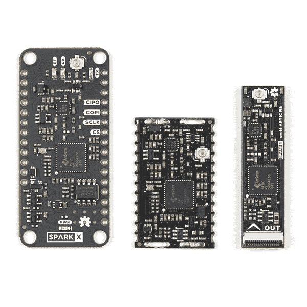

# ARGOS(北极 R2)卫星通信指南

> 原文：<https://learn.sparkfun.com/tutorials/argos-artic-r2-satellite-communication-guide>

## 介绍

为您的下一个项目寻找卫星通信板？我们有三个选择！

[](https://www.sparkfun.com/products/17236) 

将**添加到您的[购物车](https://www.sparkfun.com/cart)中！**

 **### [ARGOS 卫星收发器防护罩-北极 R2](https://www.sparkfun.com/products/17236)

[Only 10 left!](https://learn.sparkfun.com/static/bubbles/ "only 10 left!") SPX-17236

你的项目与环境保护、意识或研究有关，还是与保护人类生命有关？也许你正在发展…

$199.95[Favorited Favorite](# "Add to favorites") 7[Wish List](# "Add to wish list")****[](https://www.sparkfun.com/products/18618) 

将**添加到您的[购物车](https://www.sparkfun.com/cart)中！**

 **### [【北极精灵 R2】](https://www.sparkfun.com/products/18618)

[Out of stock](https://learn.sparkfun.com/static/bubbles/ "out of stock") SPX-18618

我们的红纸板很棒。但是他们有时候是不是显得有点* * _ 大 _**？！进入* * SML * *，这是一个新系列的主板，它…

$199.95[Favorited Favorite](# "Add to favorites") 5[Wish List](# "Add to wish list")****[](https://www.sparkfun.com/products/17984) 

将**添加到您的[购物车](https://www.sparkfun.com/cart)中！**

 **### [【spark fun IOTA】卫星通信模块(北极 R2)](https://www.sparkfun.com/products/17984)

[Only 8 left!](https://learn.sparkfun.com/static/bubbles/ "only 8 left!") SPX-17984

你的项目与环境保护、意识或研究有关，还是与保护人类生命有关？也许你正在发展…

$199.95[Favorited Favorite](# "Add to favorites") 5[Wish List](# "Add to wish list")****** ******阿尔戈斯卫星收发器防护罩——北极 R2 ，是三个中最大的，也是最容易上手的。它与我们的 Feather 兼容的 Thing Plus 板具有相同的尺寸，旨在直接堆叠在 Thing Plus 之上，以便于开发。如果您正在寻找一款能够让您了解 ARGOS 卫星通信如何工作的主板，或者刚刚开始您的产品开发，或者想要一款可以插入试验板的主板，或者不担心让您的跟踪系统尽可能紧凑，那么这款主板就是您的理想之选。

如果您准备将 ARGOS 收发器整合到您的设计中，IOTA-ARGOS 的集成开源收发器是理想之选。它的城堡形焊盘可以根据需要回流或手工焊接。如果您的认证过程需要，它也有射频屏蔽罐插槽。堞形垫和 u.FL 连接器均提供天线连接。你会在 [SparkFun 鹰图书馆](https://github.com/sparkfun/SparkFun-Eagle-Libraries) [射频图书馆](https://github.com/sparkfun/SparkFun-Eagle-Libraries/blob/main/SparkFun-RF.lbr)找到 IOTA 的鹰符号和足迹。

R2 北极号是三艘船中最小的一艘，但它仍然和它的兄弟姐妹们一样强大。如果您正在开发用于跟踪鲸鱼的小型飞镖，或用于跟踪鸟类的小型背包，或非常离散的卫星跟踪器，那么 SML ARTIC R2 就是您的理想之选。

[](https://cdn.sparkfun.com/assets/learn_tutorials/2/1/2/1/ARGOS_Comparison_Photo_Tutorial.jpg)*Having a hard time seeing? Click the image for a closer look.*[](https://cdn.sparkfun.com/assets/learn_tutorials/2/1/2/1/Trinity.png)

所有三块板都使用相同的北极 R2 卫星收发器芯片。三者都有相同的功率放大器，具有相同的最大输出功率和可调增益。三者具有相同的接收灵敏度。这三个都有包含北极 R2 固件和平台 ID 的板载闪存。所有这三个都由我们全面的 [Arduino 库](https://github.com/sparkfun/SparkFun_ARGOS_ARTIC_R2_Arduino_Library)支持，其中包括一整套经过测试的[示例](https://github.com/sparkfun/SparkFun_ARGOS_ARTIC_R2_Arduino_Library/tree/main/examples)。

本指南提供了 ARGOS 卫星系统和北极 R2 卫星收发器芯片组的背景信息。如果您正在寻找有关我们三种主板的具体信息，您可以点击下面的按钮打开它们各自的连接指南:

[ARGOS ARTIC R2 Shield Hookup Guide](https://learn.sparkfun.com/tutorials/argos-artic-r2-satellite-transceiver-shield-hookup-guide)[IOTA Satellite Communication Module Hookup Guide](https://learn.sparkfun.com/tutorials/iota-artic-r2-satellite-communication-module-hookup-guide)[smôl ARTIC R2 Hookup Guide](https://learn.sparkfun.com/tutorials/sml-artic-r2-hookup-guide)

## ARGOS 卫星系统

[](https://learn.sparkfun.com/tutorials/argos-artic-r2-satellite-communication-guide#credits)Image credits: Copyright David Ducros

ARGOS 卫星系统已经存在很长时间了。它于 1978 年由法国航天局(CNES)、美国国家航空航天局(NASA)和美国国家海洋和大气管理局(NOAA)创建，最初是作为收集和转发世界各地气象和海洋学数据的科学工具。今天，ARGOS 正在革新卫星通信，增加了一个由 25 颗纳米卫星组成的星座，以补充携带 ARGOS 仪器的 6 颗传统卫星。其中的第一个，天使，已经在运行，SparkFun 是第一批在 2020 年 10 月向天使传输数据的用户之一。当星座完成时，卫星通过之间最多有 10-15 分钟的间隔。

ARGOS 使用一组低地球轨道(LEO)极地轨道卫星提供全球双向数据通信。一个由地面接收站和两个数据处理中心组成的全球网络为连续、全天候的操作提供支持。

ARGOS 可以使用多普勒定位来确定发射机的位置。只需发送一个唯一的 28 位序列号(平台 ID)，ARGOS 就可以确定发射机的位置，而无需 GPS / GNSS。这是一件大事，因为这意味着数据传输可以保持非常短，大大延长了发射机的电池寿命。传输的次数越多，定位精度就越高，但 ARGOS 可以通过一次传输来估计您的位置。

ARGOS 还针对低功耗运行进行了优化。ARGOS 传输(上行链路)集中在 401 兆赫，接近超高频无线电波段的底端。卫星的下行链路集中在 466 兆赫。卫星上的接收器*非常*敏感，这意味着与其他卫星系统相比，你可以使用低得多的功率进行传输，这又一次大大延长了发射机的电池寿命。我们已经看到卫星可靠地接收消息，接收信号强度低至-140dBm！

## 卫星

以下是携带 ARGOS 仪器的七颗卫星的详细信息:

| 名字 | 指定 | 替代名称 | 发射 | 使用仪器 |
| NOAA-K | 日本海事协会 | NOAA-15 | One thousand nine hundred and ninety-eight | ARGOS-2 |
| 诺阿-N | 神经网络 | NOAA-18 | Two thousand and five | ARGOS-2 |
| NOAA-P | NP(或 NN’) | NOAA-19 | Two thousand and nine | ARGOS-3 |
| METOP-B | 医学学士 |  | Two thousand and twelve | ARGOS-3 |
| METOP-C | 主持人 |  | Two thousand and eighteen | ARGOS-3 |
| 莎拉 | 立体弧度 |  | Two thousand and thirteen | ARGOS-3 |
| 天使 | 一流的 |  | Two thousand and nineteen | ARGOS-4 ^* |

新的孩子在块是天使-阿尔戈斯近地天体通用经济光卫星。天使 A1 于 2019 年 12 月发射，于 2020 年 10 月开始用于 ARGOS 数据。天使是一颗 12U 纳米卫星，重量只有 20 公斤！天使是重要的，因为它支持 ARGOS-4，支持更低的信号强度，进一步延长您的发射机的电池寿命。天使纳米卫星格式将用于接下来的 25 颗 ARGOS 卫星。

^* 注:天使 A1 携带 ARGOS-NEO (ARGOS-4 Light)仪器。它不支持 A4 高清，也没有 A4 下行链路。

卫星仪器是向后兼容的。天使支持阿尔戈斯 2，3 和 4。METOP 卫星支持 ARGOS 2 和 3。

## 谁能使用阿尔戈斯？

在撰写本文时，ARGOS 系统目前只限于以某种方式与环境保护、意识或研究或保护人类生命相关的项目。

如果您的项目合格，那么 ARGOS 卫星系统和我们的北极 R2 产品是完美的解决方案。卫星上的 ARGOS 仪器非常敏感，这意味着您的设备可以以 100 mW 甚至更低的功率传输 ARGOS-4 VLD，从而大大延长您的电池寿命。我们的 article R2 产品的功耗比同等的 Iridium 或 Swarm 产品低得多。

然而，ARGOS 的环境限制即将改变！ARGOS 系统的继承者 Kinéis 正在 ANGELS 上测试 399.9 兆赫和 400.05 兆赫之间的新频带，为发射由 25 颗纳米卫星组成的新星座做准备。这个新的 MSS(移动卫星服务)频段是 ***不局限于*** 环境节目。Kinéis 将成为真正的物联网通信提供商——面向所有人开放！

新的 399.9MHz 至 400.05MHz 频段需要通过国家认证，因此并非在所有国家都可用。

对于卫星通信来说，这是一个激动人心的时刻。您可能会喜欢以下新闻链接:

*   [火箭实验室将为 Kiné is 部署 25 颗新的纳米卫星](https://www.kineis.com/en/rocket-lab-lands-deal-to-launch-entire-iot-satellite-constellation-for-kineis/)
*   [Kinéis 在美国获得新许可证](https://www.kineis.com/en/kineis-obtains-new-licenses-in-the-united-states-and-accelerates-its-development-across-the-atlantic/)
*   [天使提供阿尔戈斯 4 VLD](https://www.kineis.com/en/angels-offers-a-new-very-low-data-rate-modulation-for-iot/)

## 这要花多少钱？

如果你是普通用户、商业用户或个人用户，或者是 T2 政府或机构(教育)用户，那么 ARGOS 的费用是不同的。 ^(*****)

收取费用的货币取决于您的地理位置。如果你在美国或加拿大，费用以美元计算。如果你在欧洲，费用以欧元计算。

每一个活跃的平台都有月费，加上你传输的任何一天的日费。然而，每日费用是有上限的，允许以有竞争力的固定费用无限制地每月使用——目前:普通、商业或个人用户每月 87 美元/欧元；政府或机构(教育)用户每月 63 美元/欧元。 ^(*****)

您可以通过 ARGOS Web 免费访问您的数据，或者选择支付额外的费用通过电子邮件、FTP 或 SMS 接收您的数据。

这与其他服务提供商相比如何？直接比较很棘手。这是看待这些数字的一种方式:

*   群集:
    *   一个群数据计划(750 个包，每个包 192 字节= 144000 字节)每月花费 5 美元
    *   Swarm 允许你每个设备最多堆叠 4 个数据计划(3000 * 192 = 576000 字节)，每月花费 20 美元
    *   每 1000 字节的成本是 0.035 美元
*   铱星通信通过 Rock7:
    *   费用为每月 12 英镑，外加每条信息 0.13 至 0.04 英镑的话费，具体取决于一次购买多少话费
    *   每发送(或接收)50 字节(或不足 50 字节)收取一个消息信用费
    *   每月发送 144000 字节的费用为:12 加 115.20 英镑(按每笔 0.04 英镑计算)= 127.20 英镑(大约。$169)
    *   每 1000 字节的成本约为。$1.17
*   ARGOS(商业/个人):
    *   ARGOS 收取独立于数据使用的月费和日费
    *   A3 HD 支持长达 4636 字节的消息长度(参见下面的 [ARGOS 消息格式](https://learn.sparkfun.com/tutorials/argos-artic-r2-satellite-communication-guide#argos-message-formats))
    *   比如说每天传输十次:每天 10 * 4636 字节=每天 46360 字节=每月 1390800 字节，每月 87 美元 ^(*****)
    *   每 1000 字节的成本约为。$0.063

^(**注:2021 年 12 月 2 日汇率和价格正确。价格不含税。**)

^(***请注意，2022 年的 ARGOS 定价仍在审核中。对于较低的传输速率、大量的平台或概念验证，可能会有折扣。**)

## 北极 R2

北极 R2 是一个集成的，低功耗，小尺寸 ARGOS 2/3/4 单芯片收发器。ARTIC 实现了一个基于消息的无线接口。对于卫星上行链路通信，ARTIC 将对提供的用户信息进行编码、调制和传输。对于下行链路通信，ARTIC 将锁定下行链路，解调和解码并提取卫星消息。根据 ARGOS 卫星系统规范，ARTIC 可以在 401MHz 左右的频带中发射信号，并在 466MHz 左右的频带中接收信号。

北极 R2 支持:

*   上行链路:
    *   阿尔戈斯 2/3/4
*   下行链路:
    *   阿尔戈斯 3/4

## ARGOS 信息格式

下表总结了北极 R2 支持的每种 ARGOS 消息格式的属性:

| 消息格式 | 方式 | Data Rate

^(**#**) (比特/秒)

 | Min Length

^(*****)

 | Max Length

^(*****)

 | 笔记 |
| 主动脉第二声 | ARGOS-2 | four hundred | fifty-two | Two hundred and seventy-six |  |
| A3 号 | ARGOS-3 | four hundred | fifty-two | Two hundred and seventy-six |  |
| 区带电泳 | ARGOS-3 | four hundred | Twenty-eight | Twenty-eight |  |
| A3 高清 | ARGOS-3 | Four thousand eight hundred | Sixty | Four thousand six hundred and thirty-six | HD =高数据速率 |
| A4 高清 | ARGOS-4 | Four thousand eight hundred | Nine hundred and ninety-two | Four thousand nine hundred and sixty | HD =高数据速率 |
| A4 MD | ARGOS-4 | One thousand two hundred | Four hundred and eighty | Nine hundred and sixty | MD =中等数据速率 |
| A4 规格的 VLD | ARGOS-4 | Two hundred | Twenty-eight | Eighty-four | VLD =非常低的数据速率 |

^(**#**) 表中引用的数据比特率为卷积编码前的比特率*(使用时)*

^(*****)*表中引用的消息长度包括*28 位平台 ID，但*不包括*消息长度标识符或任何所需的尾部位。ARTIC R2 总是计算并传输 A3 HD 的 FEC 和 A4 HD/MD 的 FCS。引用的最大消息长度*不包括*FEC/FCS。

ARGOS-4 VLD 模式令人兴奋，因为与其他模式相比，上行链路可以使用低得多的发射功率(100mW 或更低)。消息很短，仅包括 28 位平台 ID，或者平台 ID 加上 56 位用户数据。但 56 位足以[编码 GNSS 位置(经纬度)](https://learn.sparkfun.com/tutorials/argos-artic-r2-satellite-communication-guide#encoding-latitude-and-longitude)到小数点后 4 位，精确到&pm；赤道 5.55 米。

ARGOS-3 ZE 和 ARGOS-4 VLD(短)消息仅包含*28 位平台 ID。ARGOS 仍然能够使用多普勒定位来计算发射机的位置。*

如果您想进一步了解消息格式和编码方案，它们在 CNES *物理层要求*中有定义:

| 消息格式 | CNES 物理层要求 |
| 主动脉第二声 | CNES |
| A3 +它们 | CNES |
| A3 高清 | CNES |
| A4 高清/MD | A4-SS-TER-SP-0078-CNES |
| A4 规格的 VLD | A4-SS-TER-SP-0079-CNES |

* * *

**Don't Panic!** Our [ARGOS ARTIC R2 Arduino Library](https://github.com/sparkfun/SparkFun_ARGOS_ARTIC_R2_Arduino_Library) does all of the message encoding for you!

* * *

## 卫星通过预测

目前只有七颗卫星携带 ARGOS 仪器。这意味着经常会出现头顶上没有卫星的情况，如果你想避免浪费传输，你需要等到下一颗卫星升起。

根据你的电池容量，你希望你的追踪器有多复杂，以及你从哪里发射，你可能会决定简单地希望当你发射时有一颗卫星在你头顶上是最好的前进方式。然而，能够预测下一颗卫星何时升起当然是非常有益的。

有两种主要方法可以做到这一点:

## ARGOS 网站

当您登录 ARGOS 网络帐户时，您可以使用卫星通过预测工具生成未来几天卫星通过时间的表格或电子表格。您可以基于所选的纬度和经度，或者基于单个 ARGOS ID 的最后已知位置来生成该表。

纬度和经度以度为单位输入。经线以西的经度输入为负数。预测工具也会询问海拔高度(单位为千米)。你还需要输入最小卫星仰角:如果你对地平线有清晰的视野，5 度是一个很好的最小值；对于城市或森林地区，较高的海拔是合理的。

[](https://cdn.sparkfun.com/assets/learn_tutorials/2/1/2/3/Satellite_Prediction_1.png)*Having a hard time seeing? Click the image for a closer look.*

点击**模拟**，计算并显示卫星轨迹:

[](https://cdn.sparkfun.com/assets/learn_tutorials/2/1/2/3/Satellite_Prediction_2.png)*Having a hard time seeing? Click the image for a closer look.*

默认情况下，该表按日期/时间顺序列出卫星通道，但您可以选择按卫星、中间(最高)高度、通道持续时间等列出它们..

**中间日期/时间**是卫星将处于其最高高度的日期和时间——它通过的最高点。时间是 UTC(世界时间坐标)，您需要加上/减去您的时区来转换为当地时间。

**中间高度**表示卫星在最高点时在天空中的高度。传球越高当然越好。

**方位角**数据显示卫星将上升、到达最高点和落下的方向。方位角是相对于地理北极，而不是磁北极。如果您的天空视图在某个特定方向被遮挡，您可以选择忽略该方向中间高度较低的通道。

**持续时间**是有用的。它表示卫星通道从上升到下降的时间。更长的持续时间将允许您尝试更多的传输。ARGOS 传输通常相隔 90 秒(“重复间隔”)，并带有强制性的&pm；间隔上 10%的抖动或抖动。在一次典型的传递中，通常有五次传输的时间。你不应该试图比你的重复间隔更频繁地传输。

* * *

**Don't Panic!** Our [ARGOS ARTIC R2 Arduino Library](https://github.com/sparkfun/SparkFun_ARGOS_ARTIC_R2_Arduino_Library) examples handle the repetition interval and jitter/dither for you!

* * *

你会注意到-对于北纬 55 度-从 12:10 到 17:12 有一个间隔(“死区”)，这时头顶上没有卫星。目前这很正常。当天使星座完成时，卫星通过之间最多有 10-15 分钟的间隔。

您可以点击**导出**按钮，以多种格式导出数据。

## 通过预测代码

能够使用 ARGOS Web 来预测卫星经过是有用的，但是如果您希望您的跟踪器能够自己预测经过呢？不要害怕！我们的[阿尔戈斯北极 R2](https://github.com/sparkfun/SparkFun_ARGOS_ARTIC_R2_Arduino_Library) 前来救援！我们的库包含了一个基于 CLS 提供的代码的 pass 预测计算器。如果您的跟踪项目中包含 GPS / GNSS 接收器，您可以使用纬度、经度和时间来计算下一次卫星通过的时间。几个[库的例子](https://github.com/sparkfun/SparkFun_ARGOS_ARTIC_R2_Arduino_Library/tree/main/examples)包括路径预测。

如果您的跟踪器将被限制在特定的地理区域，您可能不需要 GNSS 接收器。仅仅知道时间就足以预测下一次经过。

## 适应轨道参数

通过预测代码还需要知道卫星的轨道参数，以便预测每次通过。您将看到“WithPrediciton”示例开头包含的参数:

```
language:c
const char AOP[] =      " MA A 5 3 0 2020 10  1 22  7 29  7195.569  98.5114  336.036  -25.341  101.3592   0.00 MB 9 3 0 0 2020 10  1 23 21 58  7195.654  98.7194  331.991  -25.340  101.3604   0.00 MC B 7 3 0 2020 10  1 22 34 23  7195.569  98.6883  344.217  -25.340  101.3587   0.00 15 5 0 0 0 2020 10  1 22 44 11  7180.495  98.7089  308.255  -25.259  101.0408   0.00 18 8 0 0 0 2020 10  1 21 50 32  7225.981  99.0331  354.556  -25.498  102.0000  -0.79 19 C 6 0 0 2020 10  1 22  7  6  7226.365  99.1946  301.174  -25.499  102.0077  -0.54 SR D 4 3 0 2020 10  1 22 33 38  7160.233  98.5416  110.362  -25.154  100.6146  -0.12"; 
```

卫星的轨道确实会随着时间而改变或漂移。AOP 数据的有效期最长为六个月，但是 Kinéis 建议每 2 到 3 个月更新一次。

您可以点击卫星路径预测页面上的**下载卫星 AOP** 按钮，从 ARGOS 网站下载 AOP 数据。然后，您可以将 AOP 数据直接复制并粘贴到您的代码中。

或者，您可以下载 JSON 格式的轨道参数。点击**系统**按钮，然后点击**卫星直播信息**选项。然后你会看到一个下载 allcast 数据的选项。

[](https://cdn.sparkfun.com/assets/learn_tutorials/2/1/2/3/Satellite_Prediction_3.png)*Having a hard time seeing? Click the image for a closer look.*[](https://cdn.sparkfun.com/assets/learn_tutorials/2/1/2/3/Satellite_Prediction_4.png)*Having a hard time seeing? Click the image for a closer look.*

我们 ARGOS ARTIC R2 库中的示例 9 展示了如何使用 JSON 格式的数据。它占用大量内存，所以我们不推荐它用于内存有限的 Arduino 平台。

卫星本身也广播它们的 AOP 数据，所以你的跟踪器可以在现场更新轨道参数，而不需要访问 ARGOS 网络。我们的 ARGOS 北极 R2 图书馆中的示例 7 演示了如何下载数据并将其记录为 pass 预测代码所需的格式。

## 编码纬度和经度

我们通常认为 GNSS 纬度和经度都需要 32 位存储，要么是整数，要么是浮点值。那么，有没有可能在一条 ARGOS-4 VLD (Long)信息中同时发送 56 位的纬度和经度呢？嗯，是的，当然是！但你必须对你如何做到这一点有点小技巧。

* * *

**Thanks!** The following encoding scheme was recommended by Lucas Nicolle at CLS.

* * *

如果我们想将纬度和经度编码到小数点后四位，那么我们在赤道的精确度为 5.55 米:

*   经度在 0.0000 到 180.0000 度的范围内
    *   如果我们为符号分配一位(正/负或东/西)
    *   如果我们把经度乘以 10000，并把它变成一个整数
    *   我们需要 21 个二进制位来编码 1800000 [10] (21 位可以编码高达 2 ^(21) - 1 = 2097151 的值)
    *   包括符号在内，我们需要 22 个二进制位来编码经度
*   纬度在 0.0000 到 90.0000 度的范围内
    *   如果我们为符号分配一位(正/负或北/南)
    *   如果我们把纬度乘以 10000，并把它变成一个整数
    *   我们需要 20 个二进制位来编码 900000 个 [10 个] (20 个位最多可以编码 2 个 ^(20 个) - 1 = 1048575)
    *   包括符号在内，我们需要 21 个二进制位来编码纬度

我们在 ARGOS ARTIC R2 Arduino 库示例中使用了相同的格式。如果您要求 CLS 或伍兹霍尔集团将 **SPARKFUN_GPS** 模板应用到您在 ARGOS Web 上的帐户，纬度、经度、南部和西部字段将自动出现在您的数据中:

[](https://cdn.sparkfun.com/assets/learn_tutorials/2/1/2/3/Satellite_Prediction_5.png)*Having a hard time seeing? Click the image for a closer look.*

现在，我们应该如何处理剩余的 13 位！？我们将把那留给你。你可能想把海拔高度编码为海拔 1000 米.13 位将允许你对高达 8191 米的高度进行编码。对于高海拔地区，您可能希望将海拔高度编码为 10 米？

## 平台 ID

每个 ARGOS 发射机都有一个唯一的平台 ID 号。当您从 SparkFun 购买阿尔戈斯北极 R2 板时，您将收到一张卡片，上面显示:

*   您的十进制平台 ID
    *   这在 ARGOS 网络中使用和显示
*   28 位十六进制平台 ID
    *   这是编程到北极 R2 的闪存，并在所有传输中使用
*   传输重复间隔
    *   默认时间间隔是 90 秒

您需要要求 CLS /伍兹霍尔集团将平台 ID 添加到您的帐户中，以便查看您的数据。

你需要获得 CLS /伍兹霍尔集团的特别许可才能使用短于 90 秒的重复间隔。

CLS 指示我们将(十六进制)平台 ID 编程到闪存中，这样就不会意外地将错误的 ID 输入到代码中。(输入错误的号码已经发生-一只正在通过 ARGOS 跟踪的北极熊突然出现在非洲！)

* * *

If you have one of our very first ARGOS ARTIC R2 Transceiver Shields, it may not have the Platform ID programmed into flash memory. For those boards, and only those boards, it is necessary to: request a Platform ID from CLS / Woods Hole Group; use v1.0.9 of the ARGOS ARTIC R2 Arduino Library; and enter the ***HEXADECIMAL*** Platform ID into your code. Please see the [Shield Hookup Guide](https://learn.sparkfun.com/tutorials/argos-artic-r2-satellite-transceiver-shield-hookup-guide#software-setup) for more details.

* * *

## 资源和更进一步

**阿尔戈斯资源:**

*   [阿尔戈斯系统](https://www.argos-system.org/argos/who-we-are/international-cooperation/)
*   【ARGOS 如何工作
*   [注册成为 ARGOS 用户](https://www.argos-system.org/become-a-user/)
*   [ARGOS 出版物和资源](https://www.argos-system.org/argos-publications/)
*   [ARGOS 网站登录](https://argos-system.cls.fr/argos-cwi2/login.html)
*   [到处都是物联网](https://www.kineis.com/en/)
*   [ARGOS 芯片组信息表](https://cdn.sparkfun.com/assets/2/d/c/6/6/ARGOS-Chipset-Info-sheet.pdf)
*   [R2 用户数据表 v1.1 版](https://cdn.sparkfun.com/assets/c/0/8/d/4/ENA303_ARTIC_R2_User_Datasheet_1v10.pdf)

**Arduino 库:**

*   [Arduino 示例](https://github.com/sparkfun/SparkFun_ARGOS_ARTIC_R2_Arduino_Library/tree/main/examples)
*   [SparkFun ARGOS ARTIC R2 Arduino 图书馆](https://github.com/sparkfun/SparkFun_ARGOS_ARTIC_R2_Arduino_Library)

**SparkFun 连接指南:**

[ARGOS ARTIC R2 Shield Hookup Guide](https://learn.sparkfun.com/tutorials/argos-artic-r2-satellite-transceiver-shield-hookup-guide)[IOTA Satellite Communication Module Hookup Guide](https://learn.sparkfun.com/tutorials/iota-artic-r2-satellite-communication-module-hookup-guide)[smôl ARTIC R2 Hookup Guide](https://learn.sparkfun.com/tutorials/sml-artic-r2-hookup-guide)

## 信用

* * *

**Image Credits:** The image of the ANGELS satellite is Copyright David Ducross.

* * *******