# 阿尔戈斯北极 R2 卫星收发器屏蔽连接指南

> 原文：<https://learn.sparkfun.com/tutorials/argos-artic-r2-satellite-transceiver-shield-hookup-guide>

## 介绍

[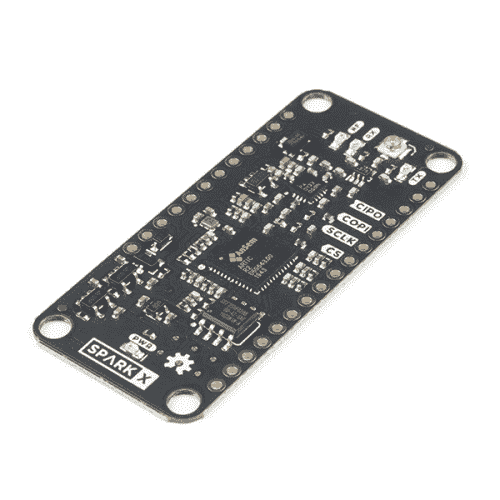](https://www.sparkfun.com/products/17236) 

将**添加到您的[购物车](https://www.sparkfun.com/cart)中！**

### [ARGOS 卫星收发器防护罩-北极 R2](https://www.sparkfun.com/products/17236)

[Only 10 left!](https://learn.sparkfun.com/static/bubbles/ "only 10 left!") SPX-17236

你的项目与环境保护、意识或研究有关，还是与保护人类生命有关？也许你正在发展…

$199.95[Favorited Favorite](# "Add to favorites") 7[Wish List](# "Add to wish list")** **为您的下一个项目寻找卫星通信板？这可能是一个！

我们提供三种 ARGOS 北极 R2 卫星收发器产品:

[](https://www.sparkfun.com/products/17236) 

将**添加到您的[购物车](https://www.sparkfun.com/cart)中！**

### [ARGOS 卫星收发器防护罩-北极 R2](https://www.sparkfun.com/products/17236)

[Only 10 left!](https://learn.sparkfun.com/static/bubbles/ "only 10 left!") SPX-17236

你的项目与环境保护、意识或研究有关，还是与保护人类生命有关？也许你正在发展…

$199.95[Favorited Favorite](# "Add to favorites") 7[Wish List](# "Add to wish list")****[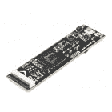](https://www.sparkfun.com/products/18618) 

将**添加到您的[购物车](https://www.sparkfun.com/cart)中！**

### [【北极精灵 R2】](https://www.sparkfun.com/products/18618)

[Out of stock](https://learn.sparkfun.com/static/bubbles/ "out of stock") SPX-18618

我们的红纸板很棒。但是他们有时候是不是显得有点* * _ 大 _**？！进入* * SML * *，这是一个新系列的主板，它…

$199.95[Favorited Favorite](# "Add to favorites") 5[Wish List](# "Add to wish list")****[](https://www.sparkfun.com/products/17984) 

将**添加到您的[购物车](https://www.sparkfun.com/cart)中！**

### [【spark fun IOTA】卫星通信模块(北极 R2)](https://www.sparkfun.com/products/17984)

[Only 8 left!](https://learn.sparkfun.com/static/bubbles/ "only 8 left!") SPX-17984

你的项目与环境保护、意识或研究有关，还是与保护人类生命有关？也许你正在发展…

$199.95[Favorited Favorite](# "Add to favorites") 5[Wish List](# "Add to wish list")****** ******这个板子，ARGOS 卫星收发器屏蔽-北极 R2 ，是三个中最大的，也是最容易上手的！它与我们的 Feather 兼容的 Thing Plus 板具有相同的尺寸，旨在直接堆叠在 Thing Plus 之上，以便于开发。如果您正在寻找一款能够让您了解 ARGOS 卫星通信如何工作的主板，或者刚刚开始您的产品开发，或者想要一款可以插入试验板的主板，或者不担心让您的跟踪系统尽可能紧凑，那么这款主板就是您的理想之选！

如果您准备将 ARGOS 收发器集成到您的设计中，那么集成的 ARGOS 开源收发器是理想的选择。它的城堡形焊盘可以根据需要回流或手工焊接。如果您的认证过程需要，它也有射频屏蔽罐插槽。堞形垫和 u.FL 连接器均提供天线连接。

R2 北极号是三艘船中最小的一艘，但它仍然和它的兄弟姐妹们一样强大。如果您正在开发用于跟踪鲸鱼的小型飞镖，或用于跟踪鸟类的小型背包，或非常离散的卫星跟踪器，那么 SML ARTIC R2 就是您的理想之选。

[](https://cdn.sparkfun.com/assets/learn_tutorials/2/1/2/1/ARGOS_Comparison_Photo_Tutorial.jpg)*Having a hard time seeing? Click the image for a closer look.*[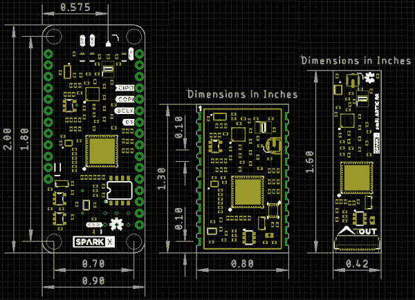](https://cdn.sparkfun.com/assets/learn_tutorials/2/1/2/1/Trinity.png)

所有三块板都使用相同的北极 R2 卫星收发器芯片。三者都有相同的功率放大器，具有相同的最大输出功率和可调增益。三者具有相同的接收灵敏度。这三个都有包含北极 R2 固件和平台 ID 的板载闪存。所有这三个都由我们全面的 [Arduino 库](https://github.com/sparkfun/SparkFun_ARGOS_ARTIC_R2_Arduino_Library)支持，其中包括一整套经过测试的[示例](https://github.com/sparkfun/SparkFun_ARGOS_ARTIC_R2_Arduino_Library/tree/main/examples)。

如果您想了解 ARGOS 卫星网络本身的更多信息，请访问我们的 ARGOS(北极 R2)卫星通信指南:

[SparkFun ARGOS (ARTIC R2) Satellite Communication Guide](https://learn.sparkfun.com/tutorials/argos-artic-r2-satellite-communication-guide)

## 阿尔戈斯和北极 R2

ARGOS 卫星系统已经存在很长时间了。它于 1978 年由法国航天局(CNES)、美国国家航空航天局(NASA)和美国国家海洋和大气管理局(NOAA)创建，最初是作为收集和转发世界各地气象和海洋学数据的科学工具。今天，ARGOS 正在革新卫星通信，增加了 25 颗纳卫星星座，以补充 7 颗携带 ARGOS 仪器的传统卫星。其中的第一个，天使，已经在运行，SparkFun 是第一批在 2020 年 10 月向天使传输数据的用户之一。当星座完成时，卫星通过之间最多有 10-15 分钟的间隔。

北极 R2 是一个集成的，低功耗，小尺寸 ARGOS 2/3/4 单芯片收发器。ARTIC 实现了一个基于消息的无线接口。对于卫星上行链路通信，ARTIC 将对提供的用户信息进行编码、调制和传输。对于下行链路通信，ARTIC 将锁定下行链路，解调和解码并提取卫星消息。根据 ARGOS 卫星系统规范，ARTIC 可以在 400MHz 左右的频带中发射信号，并在 466MHz 左右的频带中接收信号。

我们的北极 R2 卫星收发器防护罩已经过 Kiné is 的测试和认证。与其他卫星通信系统相比，北极 R2 具有低得多的电流消耗，并且将与非常简单、非常轻便的四分之一波长线天线一起工作。我们主板上的北极 R2 芯片组采用 3.3V 电源供电，板载闪存支持快速启动。如果您不需要全部发射功率，或者想延长电池寿命，也可以通过光隔离增益控制降低发射功率。

我们的 [Arduino 库](https://github.com/sparkfun/SparkFun_ARGOS_ARTIC_R2_Arduino_Library)让启动和运行 ARGOS 变得非常容易。我们已经提供了一套完整的例子，将让你:配置北极 R2 芯片组；预测下一次卫星通过；接收所有广播和单独编码的消息；使用 ARGOS 2、3 和 4 编码传输消息。

* * *

The ARGOS satellite system is **currently** restricted to specific programs and applications. Please check that your project meets these requirements before buying hardware. [CLS (France)](https://www.cls-telemetry.com/argos-solutions/) and the [Woods Hole Group (America)](https://www.clsamerica.com/science-with-argos) will be able to advise if your project meets the requirements. *"To meet system use requirements, all programs using Argos have to be related in some way or other to environmental protection, awareness or study, or to protecting human life."* Please see our [ARGOS ARTIC R2 Communication Guide](https://learn.sparkfun.com/tutorials/argos-artic-r2-satellite-communication-guide#who-can-use-argos) for more details.

* * *

## 硬件概述

在这一节中，我们将介绍 ARGOS 北极 R2 卫星收发器屏蔽的内容。

### 北极 R2

阿尔戈斯北极 R2 卫星收发器屏蔽的核心当然是北极 R2 收发器本身。这是一个包含数字信号处理器(DSP)的智能芯片，可以调制发送消息和解调接收消息。DSP 可以通过 SPI 从片上闪存或外部微控制器引导。发射时，它产生一个 1mW (0dBm)的输出信号，该信号被馈送到一个单独的功率放大器。

[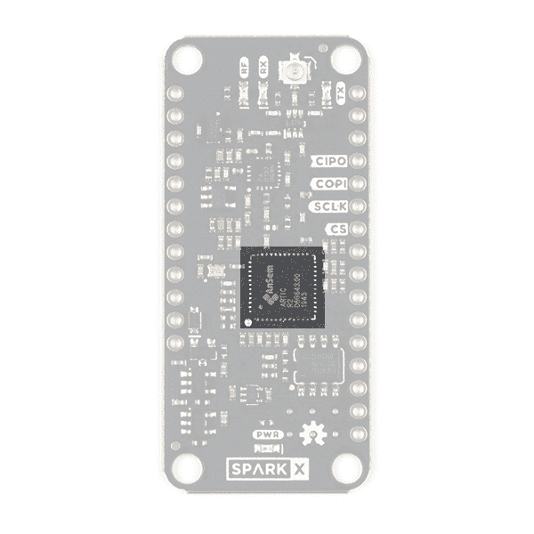](https://cdn.sparkfun.com/assets/learn_tutorials/2/1/2/1/17236-Artic_R2_Breakout-04a_ARTIC_R2.jpg)

我们的 [Arduino 库](https://github.com/sparkfun/SparkFun_ARGOS_ARTIC_R2_Arduino_Library)会为您完成所有繁重的工作。默认情况下，该库将告诉北极 R2 DSP 从板载闪存启动。不过，只需更改一行代码，您就可以通过 SPI 引导，由微控制器为 DSP 提供固件。

### 射频放大器

发射期间，RFPA0133 功率放大器放大来自北极 R2 的 0dBm (1mW)信号。

[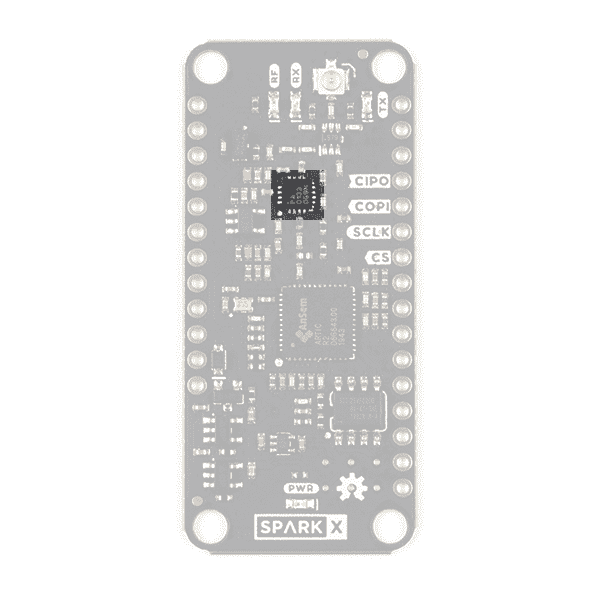](https://cdn.sparkfun.com/assets/learn_tutorials/2/1/2/1/17236-Artic_R2_Breakout-04a_RF_Amp.jpg)

使用全增益时，放大器将信号提升至约 25.8dBm (380mW)。如果你使用 ARGOS 2 或 3 调制，并从一个“嘈杂”的环境(如城市)传输，那么你可能需要使用最大功率来确保你的信息通过。但是，如果您使用 ARGOS 4 调制和/或从一个“安静”的环境中传输，如苔原或海洋，那么您将能够以较低的功率传输。

### 增益控制

您可以通过软件和板载光隔离增益控制电路来调整发射增益。

[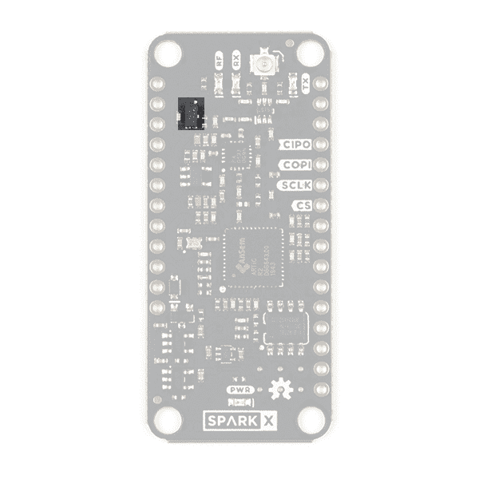](https://cdn.sparkfun.com/assets/learn_tutorials/2/1/2/1/17236-Artic_R2_Breakout-04a_Gain.jpg)

我们的 [Arduino 库](https://github.com/sparkfun/SparkFun_ARGOS_ARTIC_R2_Arduino_Library)可以为你降低增益。如果您拨打:

```
language:c
myARTIC.attenuateTXgain(true); 
```

从代码内部，光隔离器会将 RFPA0133 的 G8 引脚拉低，从而将增益降低约 5dB。这还具有将发射电流降低约 80mA 的优势。

### 闪存

默认情况下，北极 R2 内部的 DSP 将从板载闪存启动。(但是，如上所述，您也可以选择通过 SPI 引导。)

[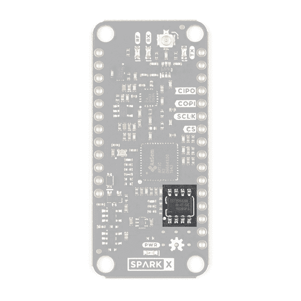](https://cdn.sparkfun.com/assets/learn_tutorials/2/1/2/1/17236-Artic_R2_Breakout-04a_Flash.jpg)

在 SparkFun 进行生产测试期间，我们使用北极 R2 固件(北极 006)和 CLS 分配的平台 ID 对闪存进行编程。您需要在您的 ARGOS 帐户上注册平台 ID 来激活它。Arduino 库从内存中读取平台 ID，并在传输中使用它。

The original batch of boards we manufactured do not have the Platform ID pre-programmed into flash memory. For these boards - and only these boards - you will need to use v1.0.9 of the Arduino Library, request a Platform ID from CLS and include that ID in your code. Please see the [ARGOS ARTIC R2 Satellite Communication Guide](https://learn.sparkfun.com/tutorials/argos-artic-r2-satellite-communication-guide) for more details.

### 天线

北极 R2 的天线连接是 u.FL

[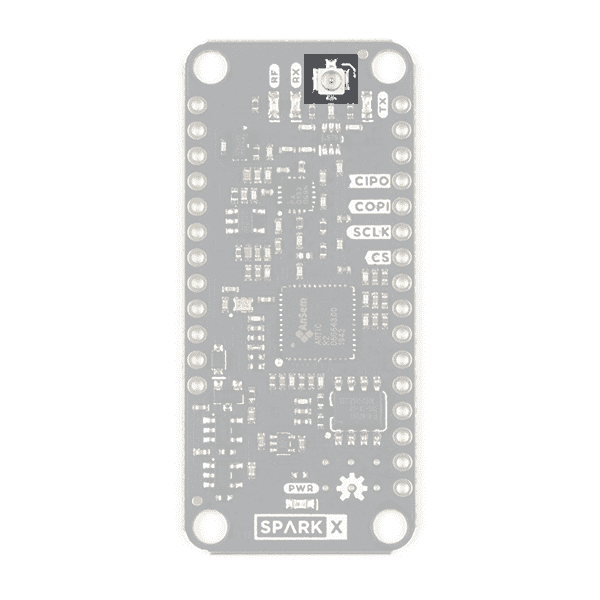](https://cdn.sparkfun.com/assets/learn_tutorials/2/1/2/1/17236-Artic_R2_Breakout-04a_uFL.jpg)

* * *

**Warning:** Always connect a 401MHz antenna to your shield before connecting the power. Transmitting with no antenna attached will damage the RF power amplifier.

* * *

如果你以前没有使用过 u.FL，请查看我们的教程:

[](https://learn.sparkfun.com/tutorials/three-quick-tips-about-using-ufl) [### 关于使用 U.FL 的三个快速提示](https://learn.sparkfun.com/tutorials/three-quick-tips-about-using-ufl) Quick tips regarding how to connect, protect, and disconnect U.FL connectors.[Favorited Favorite](# "Add to favorites") 14

### 电力网

ARGOS 北极 R2 卫星收发器屏蔽可以从标准的 Thing Plus / Feather **VUSB** 和/或 **VBATT** 引脚获取电力。如果连接，屏蔽将优先从 VUSB 获取 5V 功率，但也可以通过 VBATT 由标准 3.6V LiPo 电池供电。

该电源电路包括:用于选择 VUSB 或 VBATT 的自动切换电路；3.3V、3.0V 和 1.8V 稳压器。

[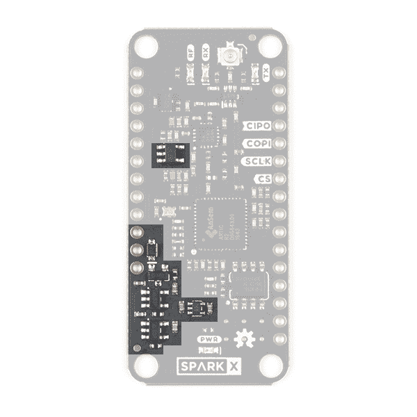](https://cdn.sparkfun.com/assets/learn_tutorials/2/1/2/1/17236-Artic_R2_Breakout-04a_Power_2.jpg)

### 发光二极管

ARGOS 北极 R2 卫星收发器屏蔽有四个发光二极管，指示电路板是否通电，是否正在发送或接收。

[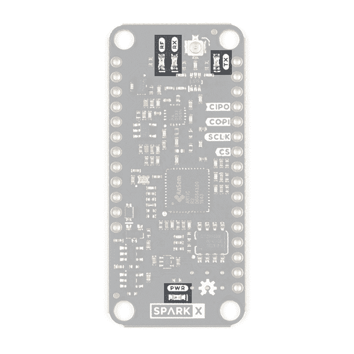](https://cdn.sparkfun.com/assets/learn_tutorials/2/1/2/1/17236-Artic_R2_Breakout-04a_LEDs.jpg)

亮起时，led 指示:

*   **射频**:射频放大器上电
*   **RX** :北极 R2 正在接收
*   北极 R2 正在发射
*   **PWR** :北极 R2 屏蔽电源电路开启

如果您想省电，可以通过切断主板背面的跳线链路来禁用 led:

[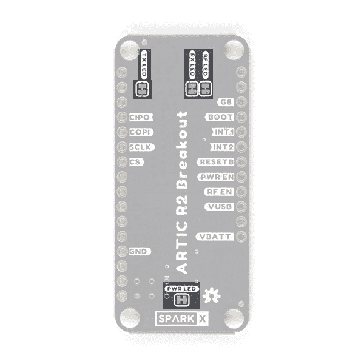](https://cdn.sparkfun.com/assets/learn_tutorials/2/1/2/1/17236-Artic_R2_Breakout-03a_Jumpers.jpg)

如果你以前没有用过跳线，请查看我们的教程。

[](https://learn.sparkfun.com/tutorials/how-to-work-with-jumper-pads-and-pcb-traces) [### 如何使用跳线焊盘和 PCB 走线](https://learn.sparkfun.com/tutorials/how-to-work-with-jumper-pads-and-pcb-traces) Handling PCB jumper pads and traces is an essential skill. Learn how to cut a PCB trace, add a solder jumper between pads to reroute connections, and repair a trace with the green wire method if a trace is damaged.[Favorited Favorite](# "Add to favorites") 11

## 分线销

下表描述了 ARGOS 北极 R2 卫星收发器屏蔽引线的功能:

[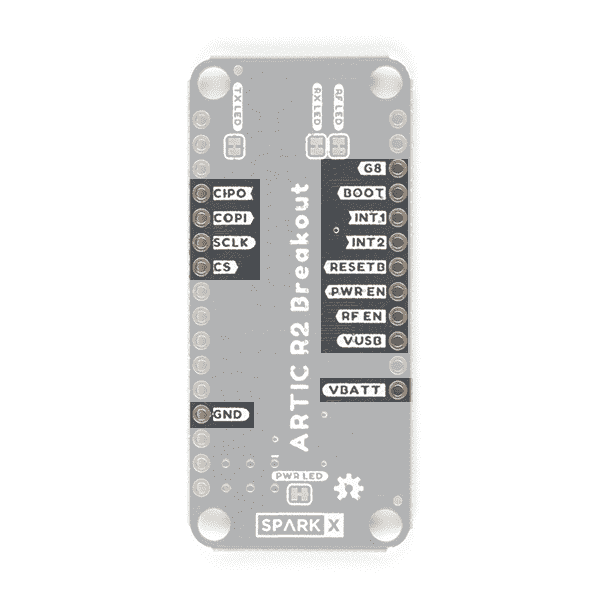](https://cdn.sparkfun.com/assets/learn_tutorials/2/1/2/1/17236-Artic_R2_Breakout-03a_Pins.jpg)

| Pin 名称 | 功能 | 描述 | 笔记 |
| **女鞋**女鞋**** | 输出 | SPI 接口:控制器输入外设输出。 | 逻辑电平为 **3.3V** 。 |
| **COPI** | 投入 | SPI 接口:控制器输出外设输入。 | 逻辑电平为 **3.3V** 。 |
| **SCLK****** | 投入 | SPI 接口时钟信号。 | 逻辑电平为 **3.3V** 。通常为 1MHz。有关允许的时钟速度，请参见北极 R2 数据表。 |
| **CS****** | 投入 | SPI 接口芯片选择。 | 逻辑电平为 **3.3V** 。 |
| **GND****** |  | 电源接地/ 0V。 |  |
| **G8****** | 投入 | 获得控制权。 | 逻辑电平为 **3.3V** 。拉高可将 RFPA0133 发射功率设置为最大。如果将此引脚拉低或保持开路，发射功率将降低约 5dB。 |
| **开机** | 投入 | 连接到北极 R2 启动引脚。 | 逻辑电平为 **3.3V** 。通过一个 100k 电阻拉高。高电平时，ARTIC 从板载闪存启动。如果 MCU 将通过 SPI 下载 ARTIC 固件，则拉低。 |
| **int 1****** | 输出 | 连接到 ARTIC INT1 引脚。 | 逻辑电平为 **3.3V** 。将被 ARTIC 拉高以指示(例如)RX_VALID_MESSAGE。 |
| **int 2****** | 输出 | 连接到 ARTIC INT2 引脚。 | 逻辑电平为 **3.3V** 。将被 ARTIC 拉高以指示(例如)RX_BUFFER_OVERFLOW。 |
| **RESETB****** | 投入 | 连接到 ARTIC reset 引脚。 | 逻辑电平为 **3.3V** 。通过一个 100k 电阻拉高。拉低以重置 ARTIC。 |
|  | 投入 | 屏蔽电源电路使能。 | 逻辑电平为 **3.3V** 。通过一个 100k 电阻拉低。拉高以启用北极 R2 的电源。 |
| **RF EN****** | 投入 | RF 放大器使能。 | 逻辑电平为 **3.3V** 。通过一个 100k 电阻拉低。拉高以使能 RF 放大器的电源。 |
| **VUSB****** | 力量 | 来自(例如)USB 的电源输入。 | 通常为 5V。最大 6.5V。 |
| **VBATT** | 力量 | 来自(例如)LiPo 电池的功率输入。 | 典型 3.6V - 4.2V. **最大 6.5V。** |

电源可以通过 VBATT 引脚或 VUSB 引脚或两者同时提供。如果连接，屏蔽将优先从 USB 获取电力。板载 3.3V 和 1.8V 稳压器调节北极 R2 和射频放大器的 USB 或电池电源。典型 VBATT 电流消耗见下面的[。](https://learn.sparkfun.com/tutorials/argos-artic-r2-satellite-transceiver-shield-hookup-guide#current-draw)

## 硬件连接

阿尔戈斯北极 R2 卫星收发器屏蔽设计为直接安装在我们的羽毛兼容的东西加板之一的顶部。你会发现 [Arduino 库](https://github.com/sparkfun/SparkFun_ARGOS_ARTIC_R2_Arduino_Library/tree/main/examples)中的例子是为[spark fun Thing Plus-Artemis](https://www.sparkfun.com/products/15574)编写的，但它们可以通过改变代码中的 pin 定义来适用于任何电路板。如果你正在寻找一个开箱即用的解决方案，那么[spark fun Thing Plus-Artemis](https://www.sparkfun.com/products/15574)就是你要找的。

如果您正在寻找一套完整的工具包来帮助您入门，以下是您需要的零件:

[](https://www.sparkfun.com/products/13855) 

将**添加到您的[购物车](https://www.sparkfun.com/cart)中！**

### [锂离子电池- 2Ah](https://www.sparkfun.com/products/13855)

[In stock](https://learn.sparkfun.com/static/bubbles/ "in stock") PRT-13855

这是基于锂离子化学的非常薄、非常轻的电池。每个电池在 200 伏时输出一个标称的 3.7 伏电压…

$13.959[Favorited Favorite](# "Add to favorites") 43[Wish List](# "Add to wish list")****[](https://www.sparkfun.com/products/116) 

将**添加到您的[购物车](https://www.sparkfun.com/cart)中！**

### [破开头球——直击](https://www.sparkfun.com/products/116)

[In stock](https://learn.sparkfun.com/static/bubbles/ "in stock") PRT-00116

一排标题-打破适应。40 个引脚，可切割成任何尺寸。用于定制 PCB 或通用定制接头。

$1.7520[Favorited Favorite](# "Add to favorites") 133[Wish List](# "Add to wish list")****[](https://www.sparkfun.com/products/15574) 

将**添加到您的[购物车](https://www.sparkfun.com/cart)中！**

### [火花趣事 Plus——阿尔忒弥斯](https://www.sparkfun.com/products/15574)

[25 available](https://learn.sparkfun.com/static/bubbles/ "25 available") WRL-15574

SparkFun Artemis Thing Plus 采用了我们流行的羽毛足迹，并添加了强大的 Artemis 模块，以实现终极功能

$22.50[Favorited Favorite](# "Add to favorites") 28[Wish List](# "Add to wish list")****[](https://www.sparkfun.com/products/115) 

将**添加到您的[购物车](https://www.sparkfun.com/cart)中！**

### [女标题](https://www.sparkfun.com/products/115)

[In stock](https://learn.sparkfun.com/static/bubbles/ "in stock") PRT-00115

单排 40 孔，内螺纹接头。可以用一把钢丝钳切割成合适的尺寸。标准 0.1 英寸间距。我们广泛使用它们…

$1.758[Favorited Favorite](# "Add to favorites") 71[Wish List](# "Add to wish list")****[](https://www.sparkfun.com/products/17236) 

将**添加到您的[购物车](https://www.sparkfun.com/cart)中！**

### [ARGOS 卫星收发器防护罩-北极 R2](https://www.sparkfun.com/products/17236)

[Only 10 left!](https://learn.sparkfun.com/static/bubbles/ "only 10 left!") SPX-17236

你的项目与环境保护、意识或研究有关，还是与保护人类生命有关？也许你正在发展…

$199.95[Favorited Favorite](# "Add to favorites") 7[Wish List](# "Add to wish list")****[](https://www.sparkfun.com/products/14743) 

将**添加到您的[购物车](https://www.sparkfun.com/cart)中！**

### [USB 3.1 线 A 到 C - 3 脚](https://www.sparkfun.com/products/14743)

[In stock](https://learn.sparkfun.com/static/bubbles/ "in stock") CAB-14743

USB C 棒极了。但是，在我们将所有的集线器、充电器和端口转换为 USB C 之前，这是您要使用的电缆…

$5.504[Favorited Favorite](# "Add to favorites") 9[Wish List](# "Add to wish list")****[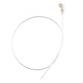](https://www.sparkfun.com/products/17523) 

将**添加到您的[购物车](https://www.sparkfun.com/cart)中！**

### [ARGOS 全向天线- 401MHz](https://www.sparkfun.com/products/17523)

[In stock](https://learn.sparkfun.com/static/bubbles/ "in stock") WRL-17523

这款四分之一波长天线专为 401MHz 的发射和接收而设计，是 ARGOS ARTIC R2 卫星的完美搭档

$6.95[Favorited Favorite](# "Add to favorites") 1[Wish List](# "Add to wish list")************** ************如果您想在套件中添加 GNSS 功能，以便能够准确传输您的位置和/或根据您的位置预测下一次卫星通过，您还需要(例如):

[](https://www.sparkfun.com/products/15210) 

将**添加到您的[购物车](https://www.sparkfun.com/cart)中！**

### [【spark fun】GPS 分线芯片天线，SAM-M8Q (Qwiic)](https://www.sparkfun.com/products/15210)

[In stock](https://learn.sparkfun.com/static/bubbles/ "in stock") GPS-15210

SparkFun SAM-M8Q GPS Breakout 是一款高质量的 GPS 板，具有同样令人印象深刻的配置选项。

$42.954[Favorited Favorite](# "Add to favorites") 17[Wish List](# "Add to wish list")****[](https://www.sparkfun.com/products/14427) 

将**添加到您的[购物车](https://www.sparkfun.com/cart)中！**

### [Qwiic 线缆- 100mm](https://www.sparkfun.com/products/14427)

[In stock](https://learn.sparkfun.com/static/bubbles/ "in stock") PRT-14427

这是一条 100 毫米长的 4 芯电缆，带有 1 毫米 JST 端接。它旨在将支持 Qwiic 的组件连接在一起…

$1.50[Favorited Favorite](# "Add to favorites") 32[Wish List](# "Add to wish list")**** ****或者:

[](https://www.sparkfun.com/products/15193) 

将**添加到您的[购物车](https://www.sparkfun.com/cart)中！**

### [【spark fun GPS Breakout-ZOE-M8Q(Qwiic)](https://www.sparkfun.com/products/15193)

[In stock](https://learn.sparkfun.com/static/bubbles/ "in stock") GPS-15193

SparkFun ZOE-M8Q GPS Breakout 是一款高精度、小型化的 GPS 板，非常适合不支持

$49.957[Favorited Favorite](# "Add to favorites") 8[Wish List](# "Add to wish list")****[](https://www.sparkfun.com/products/17260) 

将**添加到您的[购物车](https://www.sparkfun.com/cart)中！**

### [柔性 Qwiic 线缆- 50mm](https://www.sparkfun.com/products/17260)

[Out of stock](https://learn.sparkfun.com/static/bubbles/ "out of stock") PRT-17260

这种极化 I2C 电缆绝缘是由硅制成的，比我们原来的 Qwiic 电缆更灵活，特别是在

$1.05[Favorited Favorite](# "Add to favorites") 8[Wish List](# "Add to wish list")****[](https://www.sparkfun.com/products/15246) 

将**添加到您的[购物车](https://www.sparkfun.com/cart)中！**

### [【Molex】柔性 GNSS 天线-U . FL](https://www.sparkfun.com/products/15246)

[In stock](https://learn.sparkfun.com/static/bubbles/ "in stock") GPS-15246

具有 U.FL 连接器和背胶的柔性纸薄 GNSS 天线。

$4.501[Favorited Favorite](# "Add to favorites") 7[Wish List](# "Add to wish list")****** ******我们最喜欢的连接阿尔戈斯护盾和阿耳忒弥斯的方法是使用堆叠头。将我们的[母头](https://www.sparkfun.com/products/115)焊接到 Artemis 的顶部。(如果您愿意，这将允许您将跳线连接到电路板。)焊接长度我们的[公脱离头-直](https://www.sparkfun.com/products/116)到 ARGOS 屏蔽的下面。(如果你愿意，这将允许你在试验板上安装盾牌。)焊接全部完成。如果你以前没有焊接过，你会发现我们的教程很有用:

[](https://learn.sparkfun.com/tutorials/how-to-solder-through-hole-soldering) [### 如何焊接:通孔焊接](https://learn.sparkfun.com/tutorials/how-to-solder-through-hole-soldering) This tutorial covers everything you need to know about through-hole soldering.[Favorited Favorite](# "Add to favorites") 70

将两块板连接在一起，瞧，你就要准备好摇滚了！

在你忘记之前，把你的阿尔戈斯天线连到护盾上！

* * *

**Warning:** Always connect a 401MHz antenna to your shield before connecting the power. Transmitting with no antenna attached will damage the RF power amplifier.

* * *

如果你现在将你的 LiPo 电池连接到 Thing Plus Artemis，它将在你连接 USB 电源时充电。

一开始你不需要 GNSS 接收器，但如果你现在想把它挂起来，就去吧！对于 [ZOE-M8Q](https://www.sparkfun.com/products/15193) ，GNSS 天线夹在 GNSS 板上的 u.FL 连接器上。如果你以前没有使用过 u.FL，请查看我们的教程:

[](https://learn.sparkfun.com/tutorials/three-quick-tips-about-using-ufl) [### 关于使用 U.FL 的三个快速提示](https://learn.sparkfun.com/tutorials/three-quick-tips-about-using-ufl) Quick tips regarding how to connect, protect, and disconnect U.FL connectors.[Favorited Favorite](# "Add to favorites") 14

使用 [Qwiic 电缆(提供电源和 I ² C 数据)](https://www.sparkfun.com/qwiic)将 GNSS 板连接到 Thing Plus。

最后，USB-C 电缆将 Thing Plus 连接到您的计算机。如果你以前没有使用过 CH340 USB 接口，你会想先安装驱动程序。下面的章节描述了如何做到这一点。

### 跳线连接

如果你用过推荐的东西加上 Artemis 和 stacking headers，就不需要担心接哪些信号了。都为你做好了。但是，如果您想要使用不同的 Arduino 板，并使用跳线连接您的屏蔽，以下是连接方式:

*   功率:
    *   将 **GND** 连接到 Arduino 板上的 GND(地)/ 0V 引脚
    *   如果您希望 Arduino 板为 ARGOS ARTIC R2 屏蔽提供电源，我们建议将屏蔽的 **VUSB** 引脚连接到 Arduino 板上的 5V 引脚
*   SPI:
    *   将 **CIPO** 、 **COPI** 和 **SCLK** 连接到 Arduino 板上的 SPI 引脚
    *   将 **CS** (芯片选择)引脚连接到合适的 I/O 引脚
*   输入/输出(基本):
    *   将 **RESETB** 、 **BOOT** 、 **PWR EN** 、 **RF EN** 、 **INT1** 和 **INT2** 引脚连接到 Arduino 板上合适的 I/O 引脚。记下 pin 码，因为您需要将它们输入到代码中。
*   I/O (Optional):
    *   如果您希望能够通过软件控制发射增益，请将 **G8** 增益控制引脚连接到 Arduino 板上的另一个 I/O 引脚。如果此引脚悬空，RF 放大器将以降低的增益发射。将此引脚上拉至 3.3V，以最大增益发射。

* * *

**Warning:** while the ARGOS ARTIC R2 Satellite Transceiver Shield can operate using 5V (USB) power, all of the SPI and I/O connections are **3.3V**. Do not connect these signals directly to an Arduino board with 5V I/O such as the classic Arduino UNO or MEGA.

* * *

### **注:**羽毛和东西加别针

在一些 Feather 和 Thing Plus 板上，您可能会发现 ARGOS Shield 的 RF EN 引脚下方的引脚是数字引脚 13，也连接到板上的内置 LED。在某些主板上，当引导加载程序正在运行且代码正在上传到主板时，LED 会快速闪烁。这将导致屏蔽的射频电源电路快速打开和关闭。虽然这不太可能损坏 RF 放大器，但最好避免。总部位于 SAMD 的董事会是罪魁祸首。

### **注:** Molex GNSS 天线

我们的 [Molex GNSS 天线](https://www.sparkfun.com/products/15246)非常轻便，具有自粘性。这是微型卫星跟踪项目的理想选择。然而，当天线距离接地层至少 40 毫米时，效果最佳。不要试图将天线固定在接地层、金属外壳甚至是你的脂肪电池上。如果你这样做，你会得到很少或没有 GNSS 信号。更多详情请参考[应用规范](https://cdn.sparkfun.com/assets/d/b/4/4/1/2065600050-AS.pdf)。

## 软件设置

如果您不熟悉 Arduino 和 IDE，本指南将帮助您入门和运行:

[](https://learn.sparkfun.com/tutorials/installing-arduino-ide) [### 安装 Arduino IDE](https://learn.sparkfun.com/tutorials/installing-arduino-ide) A step-by-step guide to installing and testing the Arduino software on Windows, Mac, and Linux.[Favorited Favorite](# "Add to favorites") 16

如果您之前没有安装 Arduino 库，以下是您需要的指南:

[](https://learn.sparkfun.com/tutorials/installing-an-arduino-library) [### 安装 Arduino 库](https://learn.sparkfun.com/tutorials/installing-an-arduino-library) How do I install a custom Arduino library? It's easy! This tutorial will go over how to install an Arduino library using the Arduino Library Manager. For libraries not linked with the Arduino IDE, we will also go over manually installing an Arduino library.[Favorited Favorite](# "Add to favorites") 22

如果你以前没有用过 Artemis Thing Plus，本指南将告诉你你需要知道的一切:

[](https://learn.sparkfun.com/tutorials/hookup-guide-for-the-sparkfun-artemis-thing-plus) [### SparkFun Artemis 的连接指南](https://learn.sparkfun.com/tutorials/hookup-guide-for-the-sparkfun-artemis-thing-plus) Get started with our SparkFun Artemis Thing Plus - our popular Thing Plus footprint with the powerful Artemis module for ultimate functionality.[Favorited Favorite](# "Add to favorites") 1

您可以在本指南中找到有关如何安装 Artemis(Apollo 3)Arduino 核心的更多具体信息。关于 [Arduino 安装](https://learn.sparkfun.com/tutorials/artemis-development-with-arduino#arduino-installation)的部分需要详细阅读。

[](https://learn.sparkfun.com/tutorials/artemis-development-with-arduino) [### 用 Arduino 开发 Artemis](https://learn.sparkfun.com/tutorials/artemis-development-with-arduino) Get our powerful Artemis based boards (Artemis Nano, BlackBoard Artemis, and BlackBoard Artemis ATP) blinking in less than 5 minutes using the SparkFun Artemis Arduino Core 6

Artemis Thing Plus 使用 CH340 接口芯片在 USB 上通信。如果您以前没有安装 CH340 的驱动程序，本指南将告诉您需要了解的一切:

[](https://learn.sparkfun.com/tutorials/how-to-install-ch340-drivers) [### 如何安装 CH340 驱动程序](https://learn.sparkfun.com/tutorials/how-to-install-ch340-drivers) How to install CH340 drivers (if you need them) on Windows, Mac OS X, and Linux.[Favorited Favorite](# "Add to favorites") 9

### 清单

*   [安装 Arduino IDE](https://learn.sparkfun.com/tutorials/installing-arduino-ide)
*   [将 SparkFun 板添加到*首选项\附加板管理器 URL*并安装 SparkFun Apollo3 板包](https://learn.sparkfun.com/tutorials/artemis-development-with-arduino#arduino-installation)
*   关闭 IDE
*   [安装 CH340 COM 口驱动](https://learn.sparkfun.com/tutorials/how-to-install-ch340-drivers)
*   重新打开 IDE
*   点击*工具\板*并选择*spark fun Apollo 3 \ spark fun Artemis Thing Plus*

[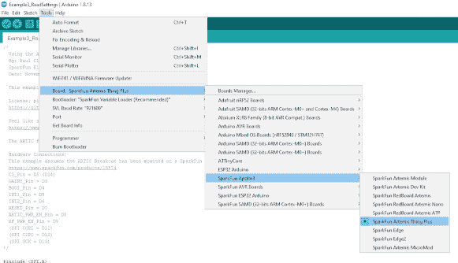](https://cdn.sparkfun.com/assets/learn_tutorials/2/1/2/1/HookUp1.JPG)

*   点击*工具\管理库...*打开图书馆管理器
*   在搜索框中，输入 *SparkFun ARGOS ARTIC R2*
*   点击*安装*按钮安装阿尔戈斯北极 R2 图书馆
    *   如果你的盾带有 ARGOS 平台 ID 卡，显示哪个 ID 被预编程到盾的闪存中，你可以安装最新版本的库

The original batch of ARTIC R2 Shields we manufactured do not have the Platform ID pre-programmed into flash memory. For these boards - and only these boards - you will need to use v1.0.9 of the Arduino Library, request a Platform ID from CLS and include that ID in your code. Please see the [ARGOS ARTIC R2 Satellite Communication Guide](https://learn.sparkfun.com/tutorials/argos-artic-r2-satellite-communication-guide) for more details.[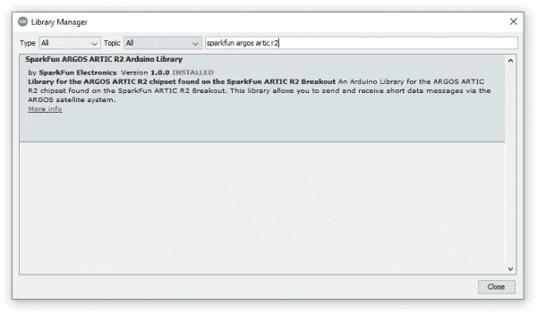](https://cdn.sparkfun.com/assets/learn_tutorials/2/1/2/1/HookUp2.JPG)

或者，你可以直接从 [GitHub](https://github.com/sparkfun/SparkFun_ARGOS_ARTIC_R2_Arduino_Library) 下载这个库，或者点击下面的按钮下载成 zip 文件:

[SparkFun ARGOS ARTIC R2 Arduino Library (ZIP)](https://github.com/sparkfun/SparkFun_ARGOS_ARTIC_R2_Arduino_Library/archive/main.zip)

如果您有我们生产的第一批主板，您可以通过单击下面的链接下载库的 1.0.9 版 zip 文件:

[SparkFun ARGOS ARTIC R2 Arduino Library **v1.0.9** (ZIP)](https://github.com/sparkfun/SparkFun_ARGOS_ARTIC_R2_Arduino_Library/archive/d05d4d83f4e0c65f57733e63f508b14a7ce1eb2d.zip)

* * *

**Warning:** Ensure you have a 401MHz antenna connected to your shield before connecting the USB cable. Transmitting with no antenna attached will damage the RF power amplifier.

* * *

*   使用 USB-C 电缆将 Thing Plus 连接到您的计算机
    *   如果您使用的是 Windows，您应该会听到常见的 USB 连接提示音
*   点击*工具\端口*并选择 Artemis 的 COM 端口

[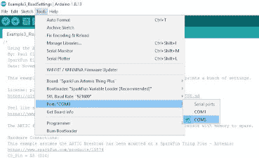](https://cdn.sparkfun.com/assets/learn_tutorials/2/1/2/1/HookUp4.JPG)

## Arduino 示例:卫星探测

SparkFun ARGOS ARTIC R2 Arduino 库包含一整套[经过测试的例子](https://github.com/sparkfun/SparkFun_ARGOS_ARTIC_R2_Arduino_Library/tree/main/examples)，当连接到 ARTIC R2 盾时，它们将在 Artemis Thing Plus 上运行。示例将在其他 Arduino 板上运行，但是您需要更改代码中的引脚定义以匹配您的板。

下面的代码是[example 4 _ satellite detection](https://github.com/sparkfun/SparkFun_ARGOS_ARTIC_R2_Arduino_Library/blob/main/examples/Example4_SatelliteDetection/Example4_SatelliteDetection.ino)的精简版。将代码复制并粘贴到 Arduino IDE 的一个新窗口中:

```
language:c
#include <SPI.h>
#include "SparkFun_ARGOS_ARTIC_R2_Arduino_Library.h" // http://librarymanager/All#SparkFun_ARGOS_ARTIC_R2
ARTIC_R2 myARTIC;

// Pin assignments for the SparkFun Thing Plus - Artemis
// (Change these if required)
int CS_Pin = 24;
int GAIN8_Pin = 3;
int BOOT_Pin = 4;
int INT1_Pin = 5;
int INT2_Pin = 6;
int RESET_Pin = 7;
int ARTIC_PWR_EN_Pin = 8;
int RF_PWR_EN_Pin = 9;

void setup()
{
  Serial.begin(115200);
  Serial.println(F("ARGOS ARTIC R2 Example"));

  Serial.println(F("ARTIC R2 is booting..."));

  SPI.begin();

  //myARTIC.enableDebugging(); // Uncomment this line to enable debug messages on Serial

  // Begin the ARTIC: enable power and boot from flash
  if (myARTIC.begin(CS_Pin, RESET_Pin, BOOT_Pin, ARTIC_PWR_EN_Pin, RF_PWR_EN_Pin, INT1_Pin, INT2_Pin, GAIN8_Pin) == false)
  {
    Serial.println("ARTIC R2 not detected. Freezing...");
    while (1)
      ; // Do nothing more
  }

  Serial.println(F("ARTIC R2 boot was successful."));

  // Read the Platform ID from flash memory
  uint32_t platformID = myARTIC.readPlatformID();
  if (platformID == 0)
  {
    Serial.println(F("You appear to have an early version of the SparkFun board."));
    Serial.println(F("For the transmit examples, you will need to use the Library Manager to select version 1.0.9 of this library."));
  }
  else
  {
    Serial.print(F("Your Platform ID is: 0x"));
    Serial.println(platformID, HEX);
  }

  myARTIC.setTCXOControl(1.8, true); // Set the TCXO voltage to 1.8V and autoDisable to 1

  myARTIC.setSatelliteDetectionTimeout(600); // Set the satellite detection timeout to 600 seconds

  Serial.println(F("Starting satellite detection..."));

  // Start satellite detection
  // The ARTIC will start looking for a satellite for the specified amount of time.
  myARTIC.sendMCUinstruction(INST_SATELLITE_DETECTION);
}

void loop()
{
  delay(1000);

  // Read the ARTIC R2 status register
  ARTIC_R2_Firmware_Status status;
  myARTIC.readStatusRegister(&status);

  // Check the interrupt 2 flag. This will go high if satellite detection times out
  if (status.STATUS_REGISTER_BITS.DSP2MCU_INT2)
  {
    Serial.println(F("INT2 pin is high. Satellite detection has timed out!"));
  }
  // Check the interrupt 1 flag. This will go high when a satellite is detected
  else if (status.STATUS_REGISTER_BITS.DSP2MCU_INT1)
  {
    Serial.println(F("INT1 pin is high. Satellite detected!"));
  }

  // Check the instruction progress
  // checkMCUinstructionProgress will return true if the instruction is complete
  ARTIC_R2_MCU_Instruction_Progress progress;
  boolean instructionComplete = myARTIC.checkMCUinstructionProgress(&progress);

  if (instructionComplete)
  {
    Serial.println(F("Satellite detection is complete! Freezing..."));
    while (1)
      ; // Do nothing more
  }
} 
```

保存文件并点击上传按钮，将示例上传到 Artemis:

[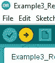](https://cdn.sparkfun.com/assets/learn_tutorials/2/1/2/1/HookUp5.JPG)

打开*工具\串行监视器*查看来自 Artemis 的串行信息。

检查波特率是否设置为 **115200** :

[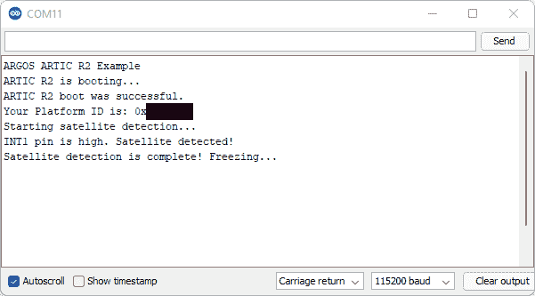](https://cdn.sparkfun.com/assets/learn_tutorials/2/1/2/1/Satellite_Detection_2.png)

当代码运行时，卫星收发器屏蔽上的两个红色电源 LED 和黄色 RX LED 将亮起。

一旦北极 R2 启动，代码将从闪存中读取预编程的平台 ID。如果它没有找到，你会看到一条消息，提醒你安装 1.0.9 版的北极 R2 图书馆。

北极 R2 号将尝试探测一颗卫星长达 10 分钟。在运行本示例之前，您可能希望登录 ARGOS 网站并预测下一次卫星通过的时间。

## 电流消耗

在计算电池寿命时，了解北极 R2 屏蔽的电流当然非常重要。

我们使用神奇的 [Otii 电弧功率分析仪](https://www.sparkfun.com/products/18585)测量了北极 R2 盾的电流消耗。Otii Arc 配置为输出 3.6V，我们将其连接到 Shield 的 VBATT 引脚，以复制一个 LiPo 电池。

*   电流消耗:
    *   睡眠(PWR EN 和 RF EN 低电平):51 A
    *   空闲(启用电源指示灯):7.2 毫安(AVG)
    *   接收:32.9 毫安
    *   发射(全功率，G8 引脚高电平):226mA
    *   发射(降低增益，G8 引脚为低电平):170mA

以下是 Otii Arc 在全功率传输 ARGOS 3 ZE 数据时捕获的数据:

[](https://cdn.sparkfun.com/assets/learn_tutorials/2/1/2/1/Shield_Current_TX_Full.png)*Having a hard time seeing? Click the image for a closer look.*

以下是以较低功率传输 ARGOS 3 ZE 数据时的电流消耗:

[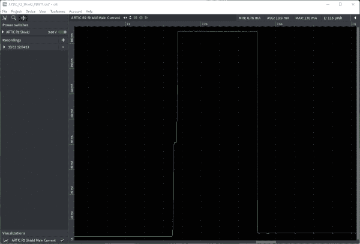](https://cdn.sparkfun.com/assets/learn_tutorials/2/1/2/1/Shield_Current_TX_Reduced.png)*Having a hard time seeing? Click the image for a closer look.*

## 证书

ARGOS 北极 R2 卫星收发器屏蔽已经由负责 ARGOS 系统操作的 [Kinéis](https://www.kineis.com/en/our-history/) 进行了测试和认证。您可以在下面找到 ARGOS 2、3 和 4 证书的副本。

*   [ARGOS 2 证书](https://cdn.sparkfun.com/assets/learn_tutorials/2/1/2/1/SparkFunLDA2_Certificate.pdf)
*   [ARGOS 3 证书](https://cdn.sparkfun.com/assets/learn_tutorials/2/1/2/1/SparkFunLDA3_Certificate.pdf)
*   [ARGOS 4 VLD 证书](https://cdn.sparkfun.com/assets/learn_tutorials/2/1/2/1/SparkFunVLDA4_Certificate.pdf)

我们非常感谢 kinis 花费时间和精力测试 SparkFun ARTIC R2 产品。

## 解决纷争

**Not working as expected and need help?** [SparkX](https://www.sparkfun.com/sparkx) products are rapidly produced to bring you the most cutting edge technology as it becomes available. These products are tested but come with no guarantees. Live technical support is not available for SparkX products. Head on over to our [forum](https://forum.sparkfun.com/viewforum.php?f=123) for support or to ask a question and we will get back to you as soon as we can.

## 资源和更进一步

有关阿尔戈斯北极 R2 卫星收发器屏蔽的更多信息，请查看以下链接:

阿尔戈斯北极 R2 卫星收发器屏蔽文件:

*   [示意图](https://cdn.sparkfun.com/assets/learn_tutorials/2/1/2/1/Schematic.pdf)
*   [老鹰档案](https://cdn.sparkfun.com/assets/learn_tutorials/2/1/2/1/ARTIC_R2_2.zip)
*   [ARGOS 芯片组信息表](https://cdn.sparkfun.com/assets/2/d/c/6/6/ARGOS-Chipset-Info-sheet.pdf)
*   [R2 用户数据表 v1.1 版](https://cdn.sparkfun.com/assets/c/0/8/d/4/ENA303_ARTIC_R2_User_Datasheet_1v10.pdf)
*   [GitHub 硬件回购](https://github.com/sparkfunX/ARGOS-ARTIC-R2-Shield)
*   [Arduino 示例](https://github.com/sparkfun/SparkFun_ARGOS_ARTIC_R2_Arduino_Library/tree/main/examples)
*   [SparkFun ARGOS ARTIC R2 Arduino 图书馆](https://github.com/sparkfun/SparkFun_ARGOS_ARTIC_R2_Arduino_Library)

**阿尔戈斯北极 R2 文档:**

*   [阿尔戈斯北极 R2 卫星通信指南](https://learn.sparkfun.com/tutorials/argos-artic-r2-satellite-communication-guide)

* * *

**Thanks!** The ARTIC R2 circuit is a remix of the reference design kindly provided by the [Arribada Initiative](https://arribada.org/) and Icoteq Ltd.******************************