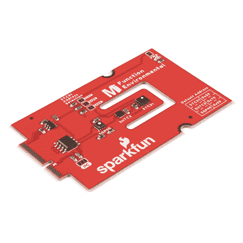
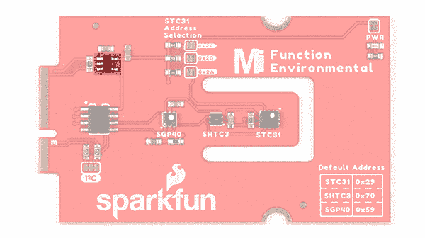
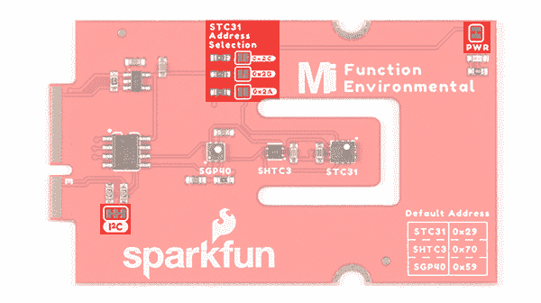

# MicroMod 环境功能板连接指南

> 原文：<https://learn.sparkfun.com/tutorials/micromod-environmental-function-board-hookup-guide>

## 介绍

[SparkFun MicroMod 环境功能板](https://www.sparkfun.com/products/18632)为 MicroMod 处理器板增加了额外的感测选项。该功能板包括三个传感器，用于监控室内环境中的空气质量(SGP40)、湿度&温度(SHTC3)和一氧化碳 [2] 浓度(STC31)。为了使它更容易使用，所有的通信都是通过微模块的 I ² C 总线！在本教程中，我们将讨论如何连接电路板和读取传感器。

[](https://www.sparkfun.com/products/18632) 

将**添加到您的[购物车](https://www.sparkfun.com/cart)中！**

 **### [SparkFun MicroMod 环境功能板](https://www.sparkfun.com/products/18632)

[In stock](https://learn.sparkfun.com/static/bubbles/ "in stock") SEN-18632

MicroMod 环境功能板包括三个传感器，用于监控空气质量、湿度/温度和二氧化碳浓度

$149.95[Favorited Favorite](# "Add to favorites") 3[Wish List](# "Add to wish list")** **[https://www.youtube.com/embed/GeeHryO9D8k/?autohide=1&border=0&wmode=opaque&enablejsapi=1](https://www.youtube.com/embed/GeeHryO9D8k/?autohide=1&border=0&wmode=opaque&enablejsapi=1)

### 所需材料

要完成本教程，您至少需要以下材料。你可能不需要所有的东西，这取决于你拥有什么。将它添加到您的购物车，通读指南，并根据需要调整购物车。

[](https://www.sparkfun.com/products/12891) 

将**添加到您的[购物车](https://www.sparkfun.com/cart)中！**

 **### [袖珍螺丝刀套装](https://www.sparkfun.com/products/12891)

[In stock](https://learn.sparkfun.com/static/bubbles/ "in stock") TOL-12891

每个黑客都应该拥有什么？没错，一把螺丝刀(你必须以某种方式进入那些箱子)。什么…

$4.505[Favorited Favorite](# "Add to favorites") 24[Wish List](# "Add to wish list")****[](https://www.sparkfun.com/products/15424) 

将**添加到您的[购物车](https://www.sparkfun.com/cart)中！**

 **### [可逆 USB A 转 C 线- 2m](https://www.sparkfun.com/products/15424)

[18 available](https://learn.sparkfun.com/static/bubbles/ "18 available") CAB-15424

这些 2 米长的电缆稍加修改后，就可以插入其端口，而不用考虑其在 U…

$8.951[Favorited Favorite](# "Add to favorites") 4[Wish List](# "Add to wish list")****[](https://www.sparkfun.com/products/16401) 

将**添加到您的[购物车](https://www.sparkfun.com/cart)中！**

 **### [SparkFun MicroMod Artemis 处理器](https://www.sparkfun.com/products/16401)

[24 available](https://learn.sparkfun.com/static/bubbles/ "24 available") DEV-16401

该处理器具有 Artemis 模块，能够进行机器学习、蓝牙、I2C、GPIO、PWM、SPI，并打包以适应…

$14.95[Favorited Favorite](# "Add to favorites") 14[Wish List](# "Add to wish list")****[](https://www.sparkfun.com/products/18575) 

将**添加到您的[购物车](https://www.sparkfun.com/cart)中！**

 **### [SparkFun 微电机主板-单个](https://www.sparkfun.com/products/18575)

[In stock](https://learn.sparkfun.com/static/bubbles/ "in stock") DEV-18575

MicroMod 主板是一个专门的载板，允许您将一个 MicroMod 处理器板与一个单…

$14.95[Favorited Favorite](# "Add to favorites") 4[Wish List](# "Add to wish list")****[](https://www.sparkfun.com/products/18632) 

将**添加到您的[购物车](https://www.sparkfun.com/cart)中！**

 **### [SparkFun MicroMod 环境功能板](https://www.sparkfun.com/products/18632)

[In stock](https://learn.sparkfun.com/static/bubbles/ "in stock") SEN-18632

MicroMod 环境功能板包括三个传感器，用于监控空气质量、湿度/温度和二氧化碳浓度

$149.95[Favorited Favorite](# "Add to favorites") 3[Wish List](# "Add to wish list")****[](https://www.sparkfun.com/products/15107) 

将**添加到您的[购物车](https://www.sparkfun.com/cart)中！**

 **### [microSD 卡-1GB(4 类)](https://www.sparkfun.com/products/15107)

[In stock](https://learn.sparkfun.com/static/bubbles/ "in stock") COM-15107

当你只需要一张基本的 SD 卡时，这张卡就适合你了。1GB 的容量足以存储 MP3 或日志环境…

$5.50[Favorited Favorite](# "Add to favorites") 6[Wish List](# "Add to wish list")************ ************#### MicroMod 主板

要容纳处理器和功能板，您需要一块主板。根据您的应用，您可以选择一个或两个功能板。

[](https://www.sparkfun.com/products/18576) 

### [SparkFun MicroMod 主板-双](https://www.sparkfun.com/products/18576)

[Out of stock](https://learn.sparkfun.com/static/bubbles/ "out of stock") DEV-18576

MicroMod 主板是一种专用载板，允许您将 MicroMod 处理器板与多达两个…

[Favorited Favorite](# "Add to favorites") 4[Wish List](# "Add to wish list")[](https://www.sparkfun.com/products/18575) 

将**添加到您的[购物车](https://www.sparkfun.com/cart)中！**

 **### [SparkFun 微电机主板-单个](https://www.sparkfun.com/products/18575)

[In stock](https://learn.sparkfun.com/static/bubbles/ "in stock") DEV-18575

MicroMod 主板是一个专门的载板，允许您将一个 MicroMod 处理器板与一个单…

$14.95[Favorited Favorite](# "Add to favorites") 4[Wish List](# "Add to wish list")** **#### 微型模块功能板

要为处理器板添加额外的功能，在将它们连接到主板时，您需要包括一个或两个功能板。除了本教程重点介绍的 MicroMod 环境功能板之外，您还可以决定添加 WiFi 功能板。确保调整推车并包括 MicroMod 主板-当使用两个功能板时，是双主板而不是单主板。查看其他功能板的 SparkFun 目录。

[](https://www.sparkfun.com/products/18632) 

将**添加到您的[购物车](https://www.sparkfun.com/cart)中！**

 **### [SparkFun MicroMod 环境功能板](https://www.sparkfun.com/products/18632)

[In stock](https://learn.sparkfun.com/static/bubbles/ "in stock") SEN-18632

MicroMod 环境功能板包括三个传感器，用于监控空气质量、湿度/温度和二氧化碳浓度

$149.95[Favorited Favorite](# "Add to favorites") 3[Wish List](# "Add to wish list")****[](https://www.sparkfun.com/products/18430) 

将**添加到您的[购物车](https://www.sparkfun.com/cart)中！**

 **### [SparkFun MicroMod WiFi 功能板- ESP32](https://www.sparkfun.com/products/18430)

[In stock](https://learn.sparkfun.com/static/bubbles/ "in stock") WRL-18430

SparkFun MicroMod ESP32 功能板为不具备以下功能的 MicroMod 处理器板增加了额外的无线选项

$14.95[Favorited Favorite](# "Add to favorites") 4[Wish List](# "Add to wish list")**** ****### 工具

您需要一把螺丝刀来固定处理器和功能板。

[](https://www.sparkfun.com/products/9146) 

将**添加到您的[购物车](https://www.sparkfun.com/cart)中！**

 **### [SparkFun 迷你螺丝刀](https://www.sparkfun.com/products/9146)

[In stock](https://learn.sparkfun.com/static/bubbles/ "in stock") TOL-09146

这只是你的基本可逆螺丝刀口袋大小！有平头和十字头可供选择。配有别针和…

$1.053[Favorited Favorite](# "Add to favorites") 11[Wish List](# "Add to wish list")** **### 推荐阅读

如果你不熟悉 MicroMod 生态系统，我们推荐你阅读这里的[来了解](https://www.sparkfun.com/micromod)的概况。

| [](https://www.sparkfun.com/micromod) |
| *[微模式生态系统](https://www.sparkfun.com/micromod)* |

如果您不熟悉以下概念，我们也建议您在继续之前先查阅一些教程。请务必查看处理器板和功能板各自的连接指南，以确保安装了正确的 USB 转串行转换器。您可能还需要遵循本教程中未列出的附加说明来安装适当的软件。

[](https://learn.sparkfun.com/tutorials/what-is-an-arduino) [### 什么是 Arduino？](https://learn.sparkfun.com/tutorials/what-is-an-arduino) What is this 'Arduino' thing anyway? This tutorials dives into what an Arduino is and along with Arduino projects and widgets.[Favorited Favorite](# "Add to favorites") 50[](https://learn.sparkfun.com/tutorials/installing-arduino-ide) [### 安装 Arduino IDE](https://learn.sparkfun.com/tutorials/installing-arduino-ide) A step-by-step guide to installing and testing the Arduino software on Windows, Mac, and Linux.[Favorited Favorite](# "Add to favorites") 16[](https://learn.sparkfun.com/tutorials/how-to-install-ch340-drivers) [### 如何安装 CH340 驱动程序](https://learn.sparkfun.com/tutorials/how-to-install-ch340-drivers) How to install CH340 drivers (if you need them) on Windows, Mac OS X, and Linux.[Favorited Favorite](# "Add to favorites") 9[](https://learn.sparkfun.com/tutorials/sparkfun-humidity-sensor-breakout---shtc3-qwiic-hookup-guide) [### SparkFun 湿度传感器分线点- SHTC3 (Qwiic)连接指南](https://learn.sparkfun.com/tutorials/sparkfun-humidity-sensor-breakout---shtc3-qwiic-hookup-guide) A Hookup Guide to get started using the SHTC3 breakout.[Favorited Favorite](# "Add to favorites") 0[](https://learn.sparkfun.com/tutorials/getting-started-with-micromod) [### MicroMod 入门](https://learn.sparkfun.com/tutorials/getting-started-with-micromod) Dive into the world of MicroMod - a compact interface to connect a microcontroller to various peripherals via the M.2 Connector 3[](https://learn.sparkfun.com/tutorials/air-quality-sensor---sgp40-qwiic-hookup-guide) [### 空气质量传感器- SGP40 (Qwiic)连接指南](https://learn.sparkfun.com/tutorials/air-quality-sensor---sgp40-qwiic-hookup-guide) Get started measuring indoor air quality with the SparkFun Air Quality Sensor - SGP40 (Qwiic) Hookup Guide.[Favorited Favorite](# "Add to favorites") 0

## 硬件概述

本节介绍 MicroMod 环境功能板上的重要特性。当然，我们建议查看参考资料，进一步了解每个传感器的更多信息。

### 力量

要给主板供电，您需要给 SparkFun 主板供电。施加的电源将连接到功能板的 VIN 引脚，该引脚将通过 AP2112 3.3V/600mA 稳压器为板的其余部分降压。

[](https://cdn.sparkfun.com/assets/learn_tutorials/2/0/0/1/18632-SparkFun_MicroMod_Environmental_Function_Board_Voltage_Regulator.jpg)

### SGP40

该板包括 Sensirion SGP40 传感器 IC，用于测量空气质量。为 SGP40 保留的 I ² C 地址是 **0x59** 。为了便于参考，SGP40 的默认地址标在板上。

[](https://cdn.sparkfun.com/assets/learn_tutorials/2/0/0/1/18632-SparkFun_MicroMod_Environmental_Function_Board_SGP40.jpg)

### SHTC3

该板包括 Sensirion SHTC3 传感器 IC，用于测量湿度和温度。为 SHTC3 保留的 I ² C 地址是 **0x70** 。为便于参考，SHTC3 的默认地址标在板上。

[](https://cdn.sparkfun.com/assets/learn_tutorials/2/0/0/1/18632-SparkFun_MicroMod_Environmental_Function_Board_SHTC3.jpg)**Note:** A multiplexer/Mux is required to communicate to multiple SHTC3 sensors on a single bus. The SHTC3 uses the same address as the Qwiic Mux (**0x70**). For advanced users that are using multiple SHTC3's with the Qwiic Mux, you will need to adjust the Qwiic Mux's default address.

### STC31

该板包括 Sensirion STC31 传感器 IC，可测量空气中 N [2] 和 CO [2] 的 CO [2] 浓度。STC31 的保留 I ² C 地址为 **0x29** 。为便于参考，STC31 的默认地址标在板上。

[](https://cdn.sparkfun.com/assets/learn_tutorials/2/0/0/1/18632-SparkFun_MicroMod_Environmental_Function_Board_STC31.jpg)

### 电可擦可编程只读存储器

该板包括一个 I ² C EEPROM。不幸的是，这对于用户来说是不可用的，而是用来保存板的特定信息。

[](https://cdn.sparkfun.com/assets/learn_tutorials/2/0/0/1/18632-SparkFun_MicroMod_Environmental_Function_Board_EEPROM.JPG)

### 发光二极管

有一个 LED 指示何时有电可用。您可以使用 PWR 跳线禁用 LED

[](https://cdn.sparkfun.com/assets/learn_tutorials/2/0/0/1/18632-SparkFun_MicroMod_Environmental_Function_Board_LED.jpg)

### 针织套衫

**Note:** If this is your first time working with jumpers, check out the [How to Work with Jumper Pads and PCB Traces](https://learn.sparkfun.com/tutorials/how-to-work-with-jumper-pads-and-pcb-traces/all) tutorial for more information.

以下跳线用于配置电路板。

*   **PWR** -默认情况下，标签为`PWR`的跳线是关闭的。该跳线连接 3.3V 线和 LED。切断此跳线将禁用 LED。
*   **I ² C 上拉电阻**——默认情况下，这个标有`I²C`的三路跳线闭合，将两个上拉电阻连接到 I ² C 数据线。如果你的 I ² C 数据线上有[多个器件，那么你可以考虑切掉这两个跳线。](https://learn.sparkfun.com/tutorials/i2c/all#i2c-at-the-hardware-level)
*   **STC31 地址选择** -板上有三个跳线可用于调整 STC31 的地址。默认情况下，跳线是打开的。传感器的备选地址为 **0x2A** 、 **0x2B** 和 **0x2C** 。要选择地址，您需要通过向其中一个焊料跳线添加一个焊料滴来闭合跳线。

[](https://cdn.sparkfun.com/assets/learn_tutorials/2/0/0/1/18632-SparkFun_MicroMod_Environmental_Function_Board_Jumpers.jpg)

### 微型功能板引脚排列

根据您的窗口大小，您可能需要使用表格底部的水平滚动条来查看附加的 pin 功能。请注意，相对两侧的 M.2 连接器引脚相互偏移，如底部引脚所示(未连接)*。主功能下有“-”的引脚没有连接。

*   [MicroMod 环境功能板引脚表](#environment)
*   [MicroMod 通用处理器引脚表](#MMGen)
*   [MicroMod 通用引脚描述](#MMDescript)

| **音频** | **UART** | **GPIO/总线** | **I ² C** | **SDIO** 的缩写形式 | **SPI0** | **专用** |

| 功能 | 底部
销 | 顶部
销 | 功能 |
|  |  |  | (未连接) |  | **75** | GND |  |  |  |
|  |  |  | 3.3V | **74** | **73** | G5 /总线 5 |  |  |  |
|  |  |  | RTC _ 3V _ 电池 | **72** | **71** | G6 /总线 6 |  |  |  |
|  |  | SPI_CS1# | SDIO _ 数据 3(输入输出) | **70** | **69** | G7 /总线 7 |  |  |  |
|  |  |  | SDIO _ 数据 2(输入输出) | **68** | **67** | 八国集团(Group of Eight) |  |  |  |
|  |  |  | SDIO _ 数据 1(输入输出) | **66** | **65** | G9 | ADC_D- | CAM_HSYNC |  |
|  |  | 睡吧 | SDIO _ 数据 0(输入输出) | **64** | **63** | G10 | ADC_D+ | CAM_VSYNC |  |
|  |  | SPI COPI1 | SDIO_CMD (I/O) | **62** | **61** | 睡吧 |  |  |  |
|  |  | SPI SCK1 | SDIO_SCK(或) | **60** | **59** | SPI_COPI (O) | LED_DAT |  |  |
|  |  |  | AUD_MCLK (O) | **58** | **57** | SPI_SCK(或) | LED |  |  |
| 凯姆 | PCM_OUT | I2S 出局 | AUD_OUT | **56** | **55** | SPI_CS# |  |  |  |
| cam _ pclk | PCM_IN | I2S 因 | 澳元 _ 美元 | **54** | **53** | I2C_SCL1(输入/输出) |  |  |  |
| PDM_DATA | PCM_SYNC | i2s WS | AUD_LRCLK | **52** | **51** | I2C_SDA1(输入输出) |  |  |  |
| PDM_CLK | PCM_CLK | SCK i2s | 奥德 _BCLK | **50** | **49** | BATT_VIN / 3 (I - ADC) (0 至 3.3V) |  |  |  |
|  |  |  | G4 /总线 4 | **48** | **47** | PWM1 |  |  |  |
|  |  |  | G3 /总线 3 | **46** | **45** | GND |  |  |  |
|  |  |  | G2 /总线 2 | **44** | **43** | CAN_TX |  |  |  |
|  |  |  | G1 /巴士 1 | **42** | **41** | CAN_RX |  |  |  |
|  |  |  | G0 /总线 0 | **40** | **39** | GND |  |  |  |
|  |  |  | 一流的 | **38** | **37** | USBHOST_D- |  |  |  |
|  |  |  | GND | **36** | **35** | USBHOST_D+ |  |  |  |
|  |  |  | A0 | **34** | **33** | GND |  |  |  |
|  |  |  | PWM0 | **32** | **31** | 模块密钥 |  |  |  |
|  |  |  | 模块密钥 | **30** | **29** | 模块密钥 |  |  |  |
|  |  |  | 模块密钥 | **28** | **27** | 模块密钥 |  |  |  |
|  |  |  | 模块密钥 | **26** | **25** | 模块密钥 |  |  |  |
|  |  |  | 模块密钥 | **24** | **23** | SWDIO |  |  |  |
|  |  |  | UART_TX2 (O) | **22** | **21** | SWDCK |  |  |  |
|  |  |  | UART_RX2 (I) | **20** | **19** | UART_RX1 (I) |  |  |  |
|  |  | CAM_TRIG | D1 | **18** | **17** | UART_TX1 (0) |  |  |  |
|  |  |  | I2C INT # | **16** | **15** | UART_CTS1 (I) |  |  |  |
|  |  |  | S7-1200 可编程控制器 | **14** | **13** | UART_RTS1 (O) |  |  |  |
|  |  |  | I2C SDA(输入/输出) | **12** | **11** | 行李箱(I 型开式排放) |  |  |  |
|  |  |  | D0 | **10** | **9** | USB_VIN |  |  |  |
|  |  | 浅部白色甲癣 | G11 | **8** | **7** | GND |  |  |  |
|  |  |  | 复位# (I -开漏) | **6** | **5** | USB_D- |  |  |  |
|  |  |  | 3.3V_EN | **4** | **3** | USB_D+ |  |  |  |
|  |  |  | 3.3V | **2** | **1** | GND |  |  |  |

| 替代功能 | 基函数 | 底部
销 | 顶部
销 | 基函数 | 替代功能 |
|  | (未连接) |  | **75** | GND |  |
|  | 车辆识别号码 | **74** | **73** | 3.3V |  |
|  | 车辆识别号码 | **72** | **71** | powermen(消歧义) |  |
|  | - | **70** | **69** | - |  |
|  | - | **66** | **65** | - |  |
|  | - | **64** | **63** | - |  |
|  | - | **62** | **61** | - |  |
|  | - | **60** | **59** | - |  |
|  | - | **58** | **57** | - |  |
|  | - | **56** | **55** | - |  |
|  | - | **54** | **53** | - |  |
|  | - | **52** | **51** | - |  |
|  | - | **50** | **49** | - |  |
|  | - | **48** | **47** | - |  |
|  | - | **46** | **45** | GND |  |
|  | - | **44** | **43** | - |  |
|  | - | **42** | **41** | - |  |
|  | - | **40** | **39** | GND |  |
|  | - | **38** | **37** | - |  |
|  | EEPROM_A0 | **36** | **35** | - |  |
|  | EEPROM_A1 | **34** | **33** | GND |  |
|  | EEPROM_A2 | **32** | **31** | 模块密钥 |  |
|  | 模块密钥 | **30** | **29** | 模块密钥 |  |
|  | 模块密钥 | **28** | **27** | 模块密钥 |  |
|  | 模块密钥 | **26** | **25** | 模块密钥 |  |
|  | 模块密钥 | **24** | **23** | - |  |
|  | - | **22** | **21** | i2c _ scl |  |
|  | - | **20** | **19** | I2C SDA |  |
|  | - | **18** | **17** | - |  |
|  | - | **16** | **15** | - |  |
|  | - | **14** | **13** | - |  |
|  | - | **12** | **11** | - |  |
|  | - | **10** | **9** | - |  |
|  | - | **8** | **7** | - |  |
|  | - | **6** | **5** | - |  |
|  | - | **4** | **3** | - |  |
|  | - | **2** | **1** | GND |  |

| 信号群 | 信号 | 输入－输出 | 描述 | 电压 |
| 力量 | 3.3V | 我 | 3.3V 电源 | 3.3V |
| GND |  | 返回电流路径 | 0V |
| USB_VIN | 我 | USB VIN 符合 USB 2.0 规范。连接到处理器板上要求 5V USB 功能的引脚 | 4.8-5.2V |
| RTC _ 3V _ 电池 | 我 | 3V 由外部纽扣电池或迷你电池提供。最大功耗=100μA，连接到引脚，在掉电期间保持 RTC。可以左 NC。 | 3V |
| 3.3V_EN | O | 控制载板的主电压调节器。1V 以上的电压将启用 3.3V 电源路径。 | 3.3V |
| BATT_VIN/3 | 我 | 载板原始电压超过 3。1/3 电阻分压器在载板上实现。根据需要放大整个 0-3.3V 范围的模拟信号 | 3.3V |
| 重置 | 重置 | 我 | 处理器的输入。处理器板上带上拉电阻的开漏。拉低复位处理器。 | 3.3V |
| 靴子 | 我 | 处理器的输入。处理器板上带上拉电阻的开漏。拉低使处理器进入特殊启动模式。可以左 NC。 | 3.3V |
| 通用串行总线 | USB_D | 输入－输出 | USB 数据。符合 USB 2.0 规范的差分串行数据接口。如果编程需要 UART，USB 必须连接到处理器板上的 USB 转串行转换 IC。 |  |
| USB 主机 | USBHOST_D | 输入－输出 | 对于支持 USB 主机模式的处理器。USB 数据。符合 USB 2.0 规范的差分串行数据接口。可以左 NC。 |  |
| 能 | CAN_RX | 我 | CAN 总线接收数据。 | 3.3V |
| CAN_TX | O | CAN 总线传输数据。 | 3.3V |
| 通用非同步收发传输器(Universal Asynchronous Receiver/Transmitter) | UART_RX1 | 我 | UART 接收数据。 | 3.3V |
| UART_TX1 | O | UART 发送数据。 | 3.3V |
| UART_RTS1 | O | UART 准备发送。 | 3.3V |
| UART_CTS1 | 我 | UART 清零发送。 | 3.3V |
| UART_RX2 | 我 | 第二个 UART 接收数据。 | 3.3V |
| UART_TX2 | O | 第二个 UART 发送数据。 | 3.3V |
| I2C | i2c _ scl | 输入－输出 | I ² C 时钟。载板上拉的开漏。 | 3.3V |
| I2C SDA | 输入－输出 | I ² C 数据。载板上有上拉电阻的开漏 | 3.3V |
| I2C INT # | 我 | 从载板到处理器的中断通知。载板上拉的开漏。低电平有效 | 3.3V |
| I2C_SCL1 号文件 | 输入－输出 | 2nd I ² C 时钟。载板上拉的开漏。 | 3.3V |
| I2C sda 1 | 输入－输出 | 2nd I ² C 数据。载板上拉的开漏。 | 3.3V |
| 精力 | SPI_COPI | O | SPI 控制器输出/外设输入。 | 3.3V |
| 睡吧，婊子 | 我 | SPI 控制器输入/外设输出。 | 3.3V |
| SPI | O | SPI 时钟。 | 3.3V |
| SPI_CS# | O | SPI 片选。低电平有效。如果不使用硬件 CS，可以路由到 GPIO。 | 3.3V |
| SPI/SDIO | SPI_SCK1/SDIO_CLK | O | 第二个 SPI 时钟。次要用途是 SDIO 钟。 | 3.3V |
| SPI_COPI1/SDIO_CMD | 输入－输出 | 第二 SPI 控制器输出/外设输入。次要用途是 SDIO 命令界面。 | 3.3V |
| spi _ 塞浦路斯 1/SDIO_DATA0 | 输入－输出 | 第二个 SPI 外设输入/控制器输出。次要用途是 SDIO 数据交换位 0。 | 3.3V |
| SDIO_DATA1 | 输入－输出 | SDIO 数据交换位 1。 | 3.3V |
| SDIO_DATA2 | 输入－输出 | SDIO 数据交换位 2。 | 3.3V |
| SPI _ CS1/SDIO _ 数据 3 | 输入－输出 | 第二个 SPI 芯片选择。次要用途是 SDIO 数据交换位 3。 | 3.3V |
| 声音的 | 奥地利马克 | O | 音频主时钟。 | 3.3V |
| AUD _ OUT/PCM _ OUT/i2s _ OUT/CAM _ MCLK | O | 音频数据输出。PCM 同步数据输出。I2S 串行数据输出。相机主时钟。 | 3.3V |
| 澳大利亚/PCM _ IN/i2s _ IN/卡姆 _PCLK | 我 | 音频数据输入。PCM 同步数据输入。I2S 串行数据输入。照相机外围时钟。 | 3.3V |
| AUD _ LRC lk/PCM _ SYNC/i2s _ WS/PDM _ DATA | 输入－输出 | 音频左/右时钟。PCM 同步数据同步。I2S 单词精选。PDM 数据。 | 3.3V |
| 澳大利亚 BCLK/CLK PCM/CLK i2s/CLK PDM | O | 音频位时钟。PCM 时钟。I2S 连续串行时钟。PDM 时钟。 | 3.3V |
| 社署 | SWDIO | 输入－输出 | 串行线调试 I/O。如果处理器板支持 SWD，则连接。可以左 NC。 | 3.3V |
| SWDCK | 我 | 串行线调试时钟。如果处理器板支持 SWD，则连接。可以左 NC。 | 3.3V |
| 物理输出核心 | A0 | 我 | 模数转换器 0。根据需要放大模拟信号，以实现完整的 0-3.3V 范围。 | 3.3V |
| 一流的 | 我 | 模数转换器 1。根据需要放大模拟信号，以实现完整的 0-3.3V 范围。 | 3.3V |
| 脉宽调制（pulse-width modulating 的缩写） | PWM0 | O | 脉宽调制输出 0。 | 3.3V |
| PWM1 | O | 脉宽调制输出 1。 | 3.3V |
| 数字的 | D0 | 输入－输出 | 通用数字输入/输出引脚。 | 3.3V |
| D1/CAM_TRIG | 输入－输出 | 通用数字输入/输出引脚。相机触发器。 | 3.3V |
| 常规/公共汽车 | G0/总线 0 | 输入－输出 | 通用引脚。任何未使用的处理器引脚都应分配给 Gx，具有 ADC + PWM 功能的引脚优先(0、1、2 等。)岗位。目的是保证各 ADC/PWM/数字引脚上的 PWM、ADC 和数字引脚功能。Gx 引脚不保证 ADC/PWM 功能。另一种用途是引脚可以支持快速读/写 8 位或 4 位宽总线。 | 3.3V |
| G1/巴士 1 | 输入－输出 | 3.3V |
| G2/总线 2 | 输入－输出 | 3.3V |
| G3/总线 3 | 输入－输出 | 3.3V |
| G4/总线 4 | 输入－输出 | 3.3V |
| G5/总线 5 | 输入－输出 | 3.3V |
| g6/总线 6 | 输入－输出 | 3.3V |
| G7/总线 7 | 输入－输出 | 3.3V |
| 八国集团(Group of Eight) | 输入－输出 | 通用引脚 | 3.3V |
| G9/ADC_D-/CAM_HSYNC | 输入－输出 | 差分 ADC 输入(如有)。相机水平同步。 | 3.3V |
| G10/ADC_D+/CAM_VSYNC | 输入－输出 | 差分 ADC 输入(如有)。相机垂直同步。 | 3.3V |
| G11/SWO | 输入－输出 | 通用引脚。串行线输出 | 3.3V |

### 电路板尺寸

该板采用标准的 MicroMod 功能板尺寸，尺寸约为 1.50"x2.56 "。

[](https://cdn.sparkfun.com/assets/c/6/e/6/d/MicroMod_Environmental_Function_Board_SGP40_SHTC3_STC31_Board_Dimensions.png)

## 硬件连接

如果您还没有，请务必查看【MicroMod 入门:硬件连接以获取有关将处理器和功能板插入主板的信息。

[](https://learn.sparkfun.com/tutorials/getting-started-with-micromod) [### MicroMod 入门

#### 2020 年 10 月 21 日](https://learn.sparkfun.com/tutorials/getting-started-with-micromod) Dive into the world of MicroMod - a compact interface to connect a microcontroller to various peripherals via the M.2 Connector 3

将处理器和功能板固定到主板后，您的设置应该如下图所示。连接 USB 型电缆，开始对处理器板进行编程。在这个案例中，我们使用了 MicroMod 主板- Single、MicroMod Artemis 处理器和 MicroMod 环境功能板。

[](https://cdn.sparkfun.com/assets/learn_tutorials/2/0/0/1/SparkFun_MicroMod_Main_Board_-Single_Processor_and_Function_Board.jpg)

## 软件安装

**Note:** This example assumes you are using the latest version of the Arduino IDE on your desktop. If this is your first time using Arduino, please review the following tutorials.

*   [安装 Arduino IDE](https://learn.sparkfun.com/tutorials/installing-arduino-ide)
*   [在 Arduino IDE 中安装板卡定义](https://learn.sparkfun.com/tutorials/installing-board-definitions-in-the-arduino-ide)
*   [安装 Arduino 库](https://learn.sparkfun.com/tutorials/installing-an-arduino-library)

### Arduino 板定义和驱动程序

我们假设您已经为处理器板安装了必要的板文件和驱动程序。在这种情况下，我们使用 MicroMod Artemis 处理器板，它使用 CH340 USB 转串行转换器。如果您使用的是处理器板，请务必查看处理器板的连接指南。

[](https://learn.sparkfun.com/tutorials/installing-board-definitions-in-the-arduino-ide) [### 在 Arduino IDE 中安装电路板定义

#### 2020 年 9 月 9 日](https://learn.sparkfun.com/tutorials/installing-board-definitions-in-the-arduino-ide) How do I install a custom Arduino board/core? It's easy! This tutorial will go over how to install an Arduino board definition using the Arduino Board Manager. We will also go over manually installing third-party cores, such as the board definitions required for many of the SparkFun development boards.[Favorited Favorite](# "Add to favorites") 3[](https://learn.sparkfun.com/tutorials/micromod-artemis-processor-board-hookup-guide) [### MicroMod Artemis 处理器板连接指南

#### 2020 年 10 月 21 日](https://learn.sparkfun.com/tutorials/micromod-artemis-processor-board-hookup-guide) Get started with the Artemis MicroMod Processor Board in this tutorial 0[](https://learn.sparkfun.com/tutorials/how-to-install-ch340-drivers) [### 如何安装 CH340 驱动程序

#### 2019 年 8 月 6 日](https://learn.sparkfun.com/tutorials/how-to-install-ch340-drivers) How to install CH340 drivers (if you need them) on Windows, Mac OS X, and Linux.[Favorited Favorite](# "Add to favorites") 9

### Arduino 图书馆

SparkFun SGP40、SHTC3 和 STC3X Arduino 库可以通过搜索' **SparkFun SGP40** 、' ' **SHTC3** 、'和' **STC3X** '用 Arduino 库管理器下载。或者，您可以从各个 GitHub 存储库( [SGP40](https://github.com/sparkfun/SparkFun_SGP40_Arduino_Library) 、 [SHTC3](https://github.com/sparkfun/SparkFun_SHTC3_Arduino_Library) 、 [STC3X](https://github.com/sparkfun/SparkFun_STC3x_Arduino_Library) )获取 zip 文件，手动安装:

[SparkFun SGP40 Arduino Library (ZIP)](https://github.com/sparkfun/SparkFun_SGP40_Arduino_Library/archive/refs/heads/main.zip)

[SparkFun SHTC3 Arduino Library (ZIP)](https://github.com/sparkfun/SparkFun_SHTC3_Arduino_Library/archive/refs/heads/master.zip)

[SparkFun STC3X Arduino Library (ZIP)](https://github.com/sparkfun/SparkFun_STC3x_Arduino_Library/archive/refs/heads/main.zip)

## Arduino 示例

### 示例 1:读取 SHTC3、STC31 和 SGP40

下面是读取 SHTC3、STC31 和 SGP40 的组合示例。如果您还没有，选择您的板(在这种情况下是 **MicroMod Artemis** )和相关的 COM 端口。将下面的代码复制并粘贴到 Arduino IDE 中。点击上传按钮，将串行监视器设置为 **115200** 波特。

```
language:c
/******************************************************************************

  WRITTEN BY: Ho Yun "Bobby" Chan
  @ SparkFun Electronics
  DATE: 10/19/2021
  GITHUB REPO: https://github.com/sparkfun/MicroMod_Environmental_Sensor_Function_Board
  DEVELOPMENT ENVIRONMENT SPECIFICS:
    Firmware developed using Arduino IDE v1.8.12

  ========== DESCRIPTION==========
  This example code combines example codes from the SHTC3, STC31, and SGP40 libraries.
  Most of the steps to obtain the measurements are the same as the example code.
  Generic object names were renamed (e.g. mySensor => mySGP40 and mySTC3x).

     Example 1: Basic Relative Humidity and Temperature Readings  w/ SHTC3; Written by Owen Lyke
     Example 2: PHT (SHTC3) Compensated CO2 Readings w/ STC31; Written by Paul Clark and based on earlier code by Nathan Seidle
     Example 1: Basic VOC Index w/ SGP40; Written by Paul Clark

  Open a Serial Monitor at 115200 baud to view the readings!

  Note: You may need to wait about ~5 minutes after starting up the code before VOC index
  has any values.

  ========== HARDWARE CONNECTIONS ==========
  MicroMod Artemis Processor Board => MicroMod Main Board => MicroMod Environmental Function Board (with SHTC3, STC31, and SGP40)

  Feel like supporting open source hardware?
  Buy a board from SparkFun!
       MicroMod MicroMod Artemis Processor   | https://www.sparkfun.com/products/16401
       MicroMod Main Board - Single          | https://www.sparkfun.com/products/18575
       MicroMod Environmental Function Board | https://www.sparkfun.com/products/18632

  You can also get the sensors individually.

       Qwiic SHTC3 | https://www.sparkfun.com/products/16467
       Qwiic STC31 | https://www.sparkfun.com/products/18385
       Qwiic SGP40 | https://www.sparkfun.com/products/17729

  LICENSE: This code is released under the MIT License (http://opensource.org/licenses/MIT)

******************************************************************************/

#include <Wire.h>

#include "SparkFun_SHTC3.h" //Click here to get the library: http://librarymanager/All#SparkFun_SHTC3
SHTC3 mySHTC3; // Create an object of the SHTC3 class

#include "SparkFun_STC3x_Arduino_Library.h" //Click here to get the library: http://librarymanager/All#SparkFun_STC3x
STC3x mySTC3x; // Create an object of the mySTC3x class

#include "SparkFun_SGP40_Arduino_Library.h" // Click here to get the library: http://librarymanager/All#SparkFun_SGP40
SGP40 mySGP40; //Create an object of the SGP40 class

float RH = 0.00; // Variable to keep track of SHTC3 temperature compensation for the STC31
float temperature = 0.00; // Variable to keep track of SHTC3 relative humidity compensation for the STC31

void setup() {

  Serial.begin(115200);
  //while (!Serial) ; // Wait for Serial Monitor/Plotter to open for Processors with Native USB (i.e. SAMD51)
  Serial.println(F("Initializing Combined Example w/ SGP40, SHTC3, and STC31."));
  Wire.begin();

  //mySTC3x.enableDebugging(); // Uncomment this line to get helpful debug messages on Serial
  //mySGP40.enableDebugging(); // Uncomment this line to print useful debug messages to Serial

  if (mySHTC3.begin() != SHTC3_Status_Nominal)
  {
    Serial.println(F("SHTC3 not detected. Please check wiring. Freezing..."));
    while (1)
      ; // Do nothing more
  }

  if (mySTC3x.begin() == false)
  {
    Serial.println(F("STC3x not detected. Please check wiring. Freezing..."));
    while (1)
      ; // Do nothing more
  }

  if (mySGP40.begin() == false)
  {
    Serial.println(F("SGP40 not detected. Check connections. Freezing..."));
    while (1)
      ; // Do nothing more
  }

  //We need to tell the STC3x what binary gas and full range we are using
  //Possible values are:
  //  STC3X_BINARY_GAS_CO2_N2_100   : Set binary gas to CO2 in N2\.  Range: 0 to 100 vol%
  //  STC3X_BINARY_GAS_CO2_AIR_100  : Set binary gas to CO2 in Air. Range: 0 to 100 vol%
  //  STC3X_BINARY_GAS_CO2_N2_25    : Set binary gas to CO2 in N2\.  Range: 0 to 25 vol%
  //  STC3X_BINARY_GAS_CO2_AIR_25   : Set binary gas to CO2 in Air. Range: 0 to 25 vol%
  if (mySTC3x.setBinaryGas(STC3X_BINARY_GAS_CO2_AIR_25) == false)
  {
    Serial.println(F("Could not set the binary gas! Freezing..."));
    while (1)
      ; // Do nothing more
  }

  //We can compensate for temperature and relative humidity using the readings from the SHTC3

  if (mySHTC3.update() != SHTC3_Status_Nominal) // Request a measurement
  {
    Serial.println(F("Could not read the RH and T from the SHTC3! Freezing..."));
    while (1)
      ; // Do nothing more
  }

  //In case the ‘Set temperature command’ has been used prior to the measurement command,
  //the temperature value given out by the STC31 will be that one of the ‘Set temperature command’.
  //When the ‘Set temperature command’ has not been used, the internal temperature value can be read out.
  temperature = mySHTC3.toDegC(); // "toDegC" returns the temperature as a floating point number in deg C
  Serial.print(F("Setting STC3x temperature to "));
  Serial.print(temperature, 2);
  Serial.print(F("C was "));
  if (mySTC3x.setTemperature(temperature) == false)
    Serial.print(F("not "));
  Serial.println(F("successful"));

  RH = mySHTC3.toPercent(); // "toPercent" returns the percent humidity as a floating point number
  Serial.print(F("Setting STC3x RH to "));
  Serial.print(RH, 2);
  Serial.print(F("% was "));
  if (mySTC3x.setRelativeHumidity(RH) == false)
    Serial.print(F("not "));
  Serial.println(F("successful"));

  //If we have a pressure sensor available, we can compensate for ambient pressure too.
  //As an example, let's set the pressure to 840 mbar (== SF Headquarters)
  uint16_t pressure = 840;
  Serial.print(F("Setting STC3x pressure to "));
  Serial.print(pressure);
  Serial.print(F("mbar was "));
  if (mySTC3x.setPressure(pressure) == false)
    Serial.print(F("not "));
  Serial.println(F("successful"));

  Serial.println(F("Note: Relative humidity and temperature compensation for the STC31 will be updated frequently in the main loop() function."));

} //end setup()

void loop() {

  //==============================
  //==========READ SHTC3==========
  //==============================
  //minimum update rate = ~100Hz

  SHTC3_Status_TypeDef result = mySHTC3.update();           // Call "update()" to command a measurement, wait for measurement to complete, and update the RH and T members of the object

  RH = mySHTC3.toPercent();                                 // "toPercent" returns the percent humidity as a floating point number
  Serial.print(F("RH = "));
  Serial.print(RH);

  Serial.print(F("%, T = "));
  Serial.print(mySHTC3.toDegF());                           // "toDegF" return the temperature as a flaoting point number in deg F
  Serial.print(F(" deg F, "));

  temperature = mySHTC3.toDegC();                           // "toDegC" returns the temperature as a floating point number in deg C
  Serial.print(temperature);
  Serial.print(F(" deg C"));

  if (mySHTC3.lastStatus == SHTC3_Status_Nominal)           // You can also assess the status of the last command by checking the ".lastStatus" member of the object
  {
    Serial.println("");                                         //Sample data good, no need to output a message
  }
  else {
    Serial.print(F(",     Update failed, error: "));        //notify user if there is an error
    errorDecoder(mySHTC3.lastStatus);
    Serial.println("");
  }

  //==============================
  //==========READ STC31==========
  //==============================
  //minimum update rate = 1Hz

  if (mySTC3x.setRelativeHumidity(RH) == false)
    Serial.print(F("Unable to set STC31 Relative Humidity with SHTC3."));

  if (mySTC3x.setTemperature(temperature) == false)
    Serial.println(F("Unable to set STC31 Temperature with SHTC3."));

  Serial.print(F("CO2(%): "));

  if (mySTC3x.measureGasConcentration())                   // measureGasConcentration will return true when fresh data is available
  {
    Serial.println(mySTC3x.getCO2(), 2);
  }
  else
  {
    Serial.print(mySTC3x.getCO2(), 2);
    Serial.println(F(",     (old STC3 sample reading, STC31 was not able to get fresh data yet)"));  //output this note to indicate  when we are not able to obtain a new measurement
  }

  //==============================
  //==========READ SGP40==========
  //==============================
  //minimum update rate = 1Hz

  Serial.print(F("VOC Index is: "));
  Serial.println(mySGP40.getVOCindex()); //Get the VOC Index using the default RH (50%) and T (25C)

  //================================
  //=========SPACE & DELAY==========
  //================================
  //Serial.println("");// Uncomment this line to add some space between readings for the Serial Monitor
  delay(1000); //Wait 1 second - the Sensirion VOC and CO2 algorithms expects a sample rate of 1Hz

}//end loop()

void errorDecoder(SHTC3_Status_TypeDef message)                             // The errorDecoder function prints "SHTC3_Status_TypeDef" results in a human-friendly way
{
  switch (message)
  {
    case SHTC3_Status_Nominal : Serial.print("Nominal"); break;
    case SHTC3_Status_Error : Serial.print("Error"); break;
    case SHTC3_Status_CRC_Fail : Serial.print("CRC Fail"); break;
    default : Serial.print("Unknown return code"); break;
  }
} 
```

### 示例 2:读取 CSV 中的 SHTC3、STC31 和 SGP40

下面是相同的组合代码，但格式为 CSV。如果您还没有，选择您的板(在这种情况下是 **MicroMod Artemis** )和相关的 COM 端口。将下面的代码复制并粘贴到 Arduino IDE 中。点击上传按钮，将串行监视器设置为 **115200** 波特。

```
language:c
/******************************************************************************

  WRITTEN BY: Ho Yun "Bobby" Chan
  @ SparkFun Electronics
  DATE: 10/19/2021
  GITHUB REPO: https://github.com/sparkfun/MicroMod_Environmental_Sensor_Function_Board
  DEVELOPMENT ENVIRONMENT SPECIFICS:
    Firmware developed using Arduino IDE v1.8.12

  ========== DESCRIPTION==========
  This example code combines example codes from the SHTC3, STC31, and SGP40 libraries.
  Most of the steps to obtain the measurements are the same as the example code.
  Generic object names were renamed (e.g. mySensor => mySGP40 and mySTC3x).

     Example 1: Basic Relative Humidity and Temperature Readings  w/ SHTC3; Written by Owen Lyke
     Example 2: PHT (SHTC3) Compensated CO2 Readings w/ STC31; Written by Paul Clark and based on earlier code by Nathan Seidle
     Example 1: Basic VOC Index w/ SGP40; Written by Paul Clark

  Open a Serial Monitor/Plotter at 115200 baud to view the readings!

  Note: You may need to wait about ~5 minutes after starting up the code before VOC index
  has any values.

  ========== HARDWARE CONNECTIONS ==========
  MicroMod Artemis Processor Board => MicroMod Main Board => MicroMod Environmental Function Board (with SHTC3, STC31, and SGP40)

  Feel like supporting open source hardware?
  Buy a board from SparkFun!
       MicroMod MicroMod Artemis Processor   | https://www.sparkfun.com/products/16401
       MicroMod Main Board - Single          | https://www.sparkfun.com/products/18575
       MicroMod Environmental Function Board | https://www.sparkfun.com/products/18632

  You can also get the sensors individually.
       SHTC3 | https://www.sparkfun.com/products/16467
       STC31 | https://www.sparkfun.com/products/18385
       SGP40 | https://www.sparkfun.com/products/17729

  LICENSE: This code is released under the MIT License (http://opensource.org/licenses/MIT)

******************************************************************************/

#include <Wire.h>

#include "SparkFun_SHTC3.h" //Click here to get the library: http://librarymanager/All#SparkFun_SHTC3
SHTC3 mySHTC3; // Create an object of the SHTC3 class

#include "SparkFun_STC3x_Arduino_Library.h" //Click here to get the library: http://librarymanager/All#SparkFun_STC3x
STC3x mySTC3x; // Create an object of the STC3x class

#include "SparkFun_SGP40_Arduino_Library.h" // Click here to get the library: http://librarymanager/All#SparkFun_SGP40
SGP40 mySGP40; //Create an object of the SGP40 class

float RH = 0.00; // Variable to keep track of SHTC3 temperature compensation for the STC31
float temperature = 0.00; // Variable to keep track of SHTC3 relative humidity compensation for the STC31

//Debug mode, comment one of these lines out using a syntax
//for a single line comment ("//"):
#define DEBUG 0     //0 = Output for Serial Plotter, CSV
//#define DEBUG 1     //1 = Output for Serial Monitor

void setup() {

  Serial.begin(115200);
  //while (!Serial) ; // Wait for Serial Monitor/Plotter to open for Processors with Native USB (i.e. SAMD51)

#if DEBUG
  Serial.println(F("Initializing Combined Example w/ SGP40, SHTC3, and STC31."));
#else
  Serial.println(F("RH,degF,degC,SHTC3_Valid,RH_Compensate_Valid,degC_Compensate_Valid,CO2%,STC31_Valid,VOC_Index"));
#endif

  Wire.begin();

  //mySTC3x.enableDebugging(); // Uncomment this line to get helpful debug messages on Serial
  //mySGP40.enableDebugging(); // Uncomment this line to print useful debug messages to Serial

  if (mySHTC3.begin() != SHTC3_Status_Nominal)
  {
#if DEBUG
    Serial.println(F("SHTC3 not detected. Please check wiring. Freezing..."));
#endif
    while (1)
      ; // Do nothing more
  }

  if (mySTC3x.begin() == false)
  {
#if DEBUG
    Serial.println(F("STC3x not detected. Please check wiring. Freezing..."));
#endif
    while (1)
      ; // Do nothing more
  }

  if (mySGP40.begin() == false)
  {
#if DEBUG
    Serial.println(F("SGP40 not detected. Check connections. Freezing..."));
#endif
    while (1)
      ; // Do nothing more
  }

  //We need to tell the STC3x what binary gas and full range we are using
  //Possible values are:
  //  STC3X_BINARY_GAS_CO2_N2_100   : Set binary gas to CO2 in N2\.  Range: 0 to 100 vol%
  //  STC3X_BINARY_GAS_CO2_AIR_100  : Set binary gas to CO2 in Air. Range: 0 to 100 vol%
  //  STC3X_BINARY_GAS_CO2_N2_25    : Set binary gas to CO2 in N2\.  Range: 0 to 25 vol%
  //  STC3X_BINARY_GAS_CO2_AIR_25   : Set binary gas to CO2 in Air. Range: 0 to 25 vol%
  if (mySTC3x.setBinaryGas(STC3X_BINARY_GAS_CO2_AIR_25) == false)
  {
#if DEBUG
    Serial.println(F("Could not set the binary gas! Freezing..."));
#endif
    while (1)
      ; // Do nothing more
  }

  //We can compensate for temperature and relative humidity using the readings from the SHTC3

  if (mySHTC3.update() != SHTC3_Status_Nominal) // Request a measurement
  {
#if DEBUG
    Serial.println(F("Could not read the RH and T from the SHTC3! Freezing..."));
#endif
    while (1)
      ; // Do nothing more
  }

  //In case the ‘Set temperature command’ has been used prior to the measurement command,
  //the temperature value given out by the STC31 will be that one of the ‘Set temperature command’.
  //When the ‘Set temperature command’ has not been used, the internal temperature value can be read out.
  temperature = mySHTC3.toDegC(); // "toDegC" returns the temperature as a floating point number in deg C
#if DEBUG
  Serial.print(F("Setting STC3x temperature to "));
  Serial.print(temperature, 2);
  Serial.print(",");
  Serial.print(F("C was "));
#endif

  if (mySTC3x.setTemperature(temperature) == false) {
#if DEBUG
    Serial.print(F("not "));
#endif
  }
#if DEBUG
  Serial.println(F("successful"));
#endif

  RH = mySHTC3.toPercent(); // "toPercent" returns the percent humidity as a floating point number

#if DEBUG
  Serial.print(F("Setting STC3x RH to "));
  Serial.print(RH, 2);
  Serial.print(",");
  Serial.print(F("% was "));
#endif

  if (mySTC3x.setRelativeHumidity(RH) == false) {
#if DEBUG
    Serial.print(F("not "));
#endif
  }
#if DEBUG
  Serial.println(F("successful"));
#endif

  //If we have a pressure sensor available, we can compensate for ambient pressure too.
  //As an example, let's set the pressure to 840 mbar (== SF Headquarters)
  uint16_t pressure = 840;

#if DEBUG
  Serial.print(F("Setting STC3x pressure to "));
  Serial.print(pressure);
  Serial.print(F("mbar was "));
#endif

  if (mySTC3x.setPressure(pressure) == false) {
#if DEBUG
    Serial.print(F("not "));
#endif
  }
#if DEBUG
  Serial.println(F("successful"));

  Serial.println(F("Note: Relative humidity and temperature compensation for the STC31 will be updated frequently in the main loop() function."));
#endif

} //end setup()

void loop() {

  //==============================
  //======DEBUG TURNED ON=========
  //==============================
#if DEBUG
  //==============================
  //==========READ SHTC3==========
  //==============================
  //minimum update rate = ~100Hz

  SHTC3_Status_TypeDef result = mySHTC3.update();           // Call "update()" to command a measurement, wait for measurement to complete, and update the RH and T members of the object

  RH = mySHTC3.toPercent();                                 // "toPercent" returns the percent humidity as a floating point number
  Serial.print(F("RH = "));
  Serial.print(RH);

  Serial.print(F("%, T = "));
  Serial.print(mySHTC3.toDegF());                           // "toDegF" return the temperature as a flaoting point number in deg F
  Serial.print(F(" deg F, "));

  temperature = mySHTC3.toDegC();                           // "toDegC" returns the temperature as a floating point number in deg C
  Serial.print(temperature);
  Serial.print(F(" deg C"));

  if (mySHTC3.lastStatus == SHTC3_Status_Nominal)           // You can also assess the status of the last command by checking the ".lastStatus" member of the object
  {
    Serial.println("");                                         //Sample data good, no need to output a message
  }
  else {
    Serial.print(F(",     Update failed, error: "));        //notify user if there is an error
    errorDecoder(mySHTC3.lastStatus);
    Serial.println("");
  }

  //==============================
  //==========READ STC31==========
  //==============================
  //minimum update rate = 1Hz

  if (mySTC3x.setRelativeHumidity(RH) == false)
    Serial.print(F("Unable to set STC31 Relative Humidity with SHTC3."));

  if (mySTC3x.setTemperature(temperature) == false)
    Serial.println(F("Unable to set STC31 Temperature with SHTC3."));

  Serial.print(F("CO2(%): "));

  if (mySTC3x.measureGasConcentration())                   // measureGasConcentration will return true when fresh data is available
  {
    Serial.println(mySTC3x.getCO2(), 2);
  }
  else
  {
    Serial.print(mySTC3x.getCO2(), 2);
    Serial.println(F(",     (old STC3 sample reading, STC31 was not able to get fresh data yet)"));  //output this note to indicate  when we are not able to obtain a new measurement
  }

  //==============================
  //==========READ SGP40==========
  //==============================
  //minimum update rate = 1Hz

  Serial.print(F("VOC Index is: "));
  Serial.println(mySGP40.getVOCindex()); //Get the VOC Index using the default RH (50%) and T (25C)

  //==============================
  //=====DEBUG TURNED OFF=========
  //==============================
#else
  //==============================
  //==========READ SHTC3==========
  //==============================
  //minimum update rate = ~100Hz

  SHTC3_Status_TypeDef result = mySHTC3.update();           // Call "update()" to command a measurement, wait for measurement to complete, and update the RH and T members of the object

  RH = mySHTC3.toPercent();
  Serial.print(RH);
  Serial.print(",");
  Serial.print(mySHTC3.toDegF());
  Serial.print(",");
  temperature = mySHTC3.toDegC();                           // "toDegC" returns the temperature as a floating point number in deg C
  Serial.print(temperature);
  Serial.print(",");

  if (mySHTC3.lastStatus == SHTC3_Status_Nominal)           // You can also assess the status of the last command by checking the ".lastStatus" member of the object
  {
    Serial.print("1");                                         //Sample data good, no need to output a message
    Serial.print(",");
  }
  else
  {
    Serial.print("0");                                         //Sample data bad, no need to output a message
    Serial.print(",");
  }

  //==============================
  //==========READ STC31==========
  //==============================
  //minimum update rate = 1Hz

  if (mySTC3x.setRelativeHumidity(RH) == false)
  {
    //Serial.print(F("Unable to set STC31 Relative Humidity with SHTC3."));
    Serial.print("0");
    Serial.print(",");
  }
  else
  {
    Serial.print("1");
    Serial.print(",");
  }

  if (mySTC3x.setTemperature(temperature) == false)
  {
    //Serial.println(F("Unable to set STC31 Temperature with SHTC3."));
    Serial.print("0");
    Serial.print(",");
  }
  else
  {
    Serial.print("1");
    Serial.print(",");
  }

  if (mySTC3x.measureGasConcentration())                   // measureGasConcentration will return true when fresh data is available
  {
    Serial.print(mySTC3x.getCO2(), 2);
    Serial.print(",");
    Serial.print("1");                                     //Fresh Data
    Serial.print(",");
  }
  else
  {
    Serial.print(mySTC3x.getCO2(), 2);
    Serial.print(",");
    Serial.print("0");                                     //Data not fresh
    Serial.print(",");
  }

  //==============================
  //==========READ SGP40==========
  //==============================
  //minimum update rate = 1Hz

  Serial.println(mySGP40.getVOCindex()); //Get the VOC Index using the default RH (50%) and T (25C)

#endif

  //================================
  //=========SPACE & DELAY==========
  //================================
  //Serial.println("");// Uncomment this line to add some space between readings for the Serial Monitor
  delay(1000); //Wait 1 second - the Sensirion VOC algorithm expects a sample rate of 1Hz

}//end loop()

void errorDecoder(SHTC3_Status_TypeDef message)                             // The errorDecoder function prints "SHTC3_Status_TypeDef" resultsin a human-friendly way
{
  switch (message)
  {
    case SHTC3_Status_Nominal : Serial.print("Nominal"); break;
    case SHTC3_Status_Error : Serial.print("Error"); break;
    case SHTC3_Status_CRC_Fail : Serial.print("CRC Fail"); break;
    default : Serial.print("Unknown return code"); break;
  }
} 
```

## 解决纷争

**Not working as expected and need help?**

If you need technical assistance and more information on a product that is not working as you expected, we recommend heading on over to the [SparkFun Technical Assistance](https://www.sparkfun.com/technical_assistance) page for some initial troubleshooting.

[SparkFun Technical Assistance Page](https://www.sparkfun.com/technical_assistance)

If you don't find what you need there, the [SparkFun Forums: MicroMod](https://forum.sparkfun.com/viewforum.php?f=180) are a great place to find and ask for help. If this is your first visit, you'll need to [create a Forum Account](https://forum.sparkfun.com/ucp.php?mode=register) to search product forums and post questions.

[SparkFun Forums: MicroMod](https://forum.sparkfun.com/viewforum.php?f=180)

## 资源和更进一步

既然您已经成功地启动并运行了您的 MicroMod 环境功能板，那么是时候将它合并到您自己的项目中了！有关更多信息，请查看以下资源:

*   [示意图(PDF)](https://cdn.sparkfun.com/assets/e/6/8/5/8/MicroMod_Environmental_Function_Board_SGP40_SHTC3_STC31_Schematic.pdf)
*   [老鹰文件(ZIP)](https://cdn.sparkfun.com/assets/4/0/1/9/9/MicroMod_Environmental_Function_Board_SGP40_SHTC3_STC31.zip)
*   [板尺寸(PNG)](https://cdn.sparkfun.com/assets/c/6/e/6/d/MicroMod_Environmental_Function_Board_SGP40_SHTC3_STC31_Board_Dimensions.png)
*   SGP40
    *   [SGP40 数据表(PDF)](https://cdn.sparkfun.com/assets/e/6/2/6/d/Sensirion_Gas_Sensors_SGP40_Datasheet.pdf)
    *   [专家 VOC 指数(PDF)](https://cdn.sparkfun.com/assets/e/9/3/f/e/GAS_AN_SGP40_VOC_Index_for_Experts_D1.pdf)
    *   [SGP40 设计指南(PDF)](https://cdn.sparkfun.com/assets/6/c/d/d/7/GAS_SGP4x_Design-In_Guide_D1.pdf)
    *   [SGP40 快速测试指南(PDF)](https://cdn.sparkfun.com/assets/d/c/d/b/0/Sensirion_Gas_Sensors_Datasheet_GAS_AN_SGP40_Quick_Testing_Guide_D1.pdf)
*   SHTC3
    *   [SHTC3 数据表(PDF)](https://cdn.sparkfun.com/assets/1/1/f/3/b/Sensirion_Humidity_Sensors_SHTC3_Datasheet.pdf)
*   STC31
    *   [STC31 数据表(PDF)](https://cdn.sparkfun.com/assets/6/2/4/0/0/Sensirion_Thermal_Conductivity_Datasheet_STC31_D1.pdf)
    *   [STC 现场校准指南(PDF)](https://cdn.sparkfun.com/assets/4/5/3/1/a/Sensirion_TC_AN_STCxx_FieldCalibration_D1.pdf)
    *   [STC 设计导入指南(PDF)](https://cdn.sparkfun.com/assets/4/b/a/8/1/Sensirion_TC_AN_STCxx_Design-In_Guide_D1.pdf)
*   Arduino 图书馆
    *   [SGP40](https://github.com/sparkfun/SparkFun_SGP40_Arduino_Library)
    *   [SHTC3](https://github.com/sparkfun/SparkFun_SHTC3_Arduino_Library)
    *   [STC3X](https://github.com/sparkfun/SparkFun_STC3x_Arduino_Library)
*   [GitHub 硬件回购](https://github.com/sparkfun/MicroMod_Environmental_Sensor_Function_Board)
*   [SFE 产品展示区](https://youtu.be/GeeHryO9D8k)

你的下一个项目需要一些灵感吗？查看一些与 MicroMod 相关的教程:

[](https://learn.sparkfun.com/tutorials/getting-started-with-micromod) [### MicroMod 入门](https://learn.sparkfun.com/tutorials/getting-started-with-micromod) Dive into the world of MicroMod - a compact interface to connect a microcontroller to various peripherals via the M.2 Connector 3[](https://learn.sparkfun.com/tutorials/micromod-stm32-processor-hookup-guide) [### MicroMod STM32 处理器连接指南](https://learn.sparkfun.com/tutorials/micromod-stm32-processor-hookup-guide) Get started with the MicroMod Ecosystem and the STM32 Processor Board 0[](https://learn.sparkfun.com/tutorials/micromod-gnss-function-board---neo-m9n-hookup-guide) [### MicroMod GNSS 功能板- NEO-M9N 连接指南](https://learn.sparkfun.com/tutorials/micromod-gnss-function-board---neo-m9n-hookup-guide) The u-blox NEO-M9N is a powerful GPS unit that now comes populated on a MicroMod Function Board! In this tutorial, we will quickly get you set up using it with the MicroMod ecosystem and Arduino so that you can start reading the output.[Favorited Favorite](# "Add to favorites") 2[](https://learn.sparkfun.com/tutorials/micromod-ethernet-function-board---w5500-hookup-guide) [### MicroMod 以太网功能板- W5500 连接指南](https://learn.sparkfun.com/tutorials/micromod-ethernet-function-board---w5500-hookup-guide) Add Ethernet and PoE capabilities to your MicroMod project using the Ethernet Function Board - W5500\.[Favorited Favorite](# "Add to favorites") 1

或者看看这篇相关的博文。

[](https://www.sparkfun.com/news/4401 "March 24, 2022: We are testing out how much soldering really changes air quality using the MicroMod Ethernet Function board and the MicroMod Environmental Function board!") [### 使用以太网的远程工业 VOC 传感器

March 24, 2022](https://www.sparkfun.com/news/4401 "March 24, 2022: We are testing out how much soldering really changes air quality using the MicroMod Ethernet Function board and the MicroMod Environmental Function board!")[Favorited Favorite](# "Add to favorites") 0**********************