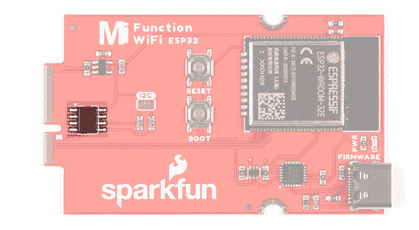
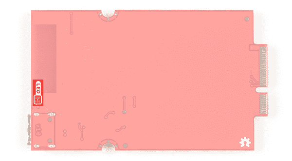

# MicroMod WiFi 功能板- ESP32 连接指南

> 原文：<https://learn.sparkfun.com/tutorials/micromod-wifi-function-board---esp32-hookup-guide>

## 介绍

[SparkFun MicroMod ESP32 功能板](https://www.sparkfun.com/products/18430)为不具备该功能的 MicroMod 处理器板增加了额外的无线选项。这种特殊的功能板充当协处理器，利用 Espressif 的 ESP32 WROOM 为您的应用程序添加 WiFi 和蓝牙。

[](https://www.sparkfun.com/products/18430) 

将**添加到您的[购物车](https://www.sparkfun.com/cart)中！**

### [SparkFun MicroMod WiFi 功能板- ESP32](https://www.sparkfun.com/products/18430)

[In stock](https://learn.sparkfun.com/static/bubbles/ "in stock") WRL-18430

SparkFun MicroMod ESP32 功能板为不具备以下功能的 MicroMod 处理器板增加了额外的无线选项

$14.95[Favorited Favorite](# "Add to favorites") 4[Wish List](# "Add to wish list")** **[https://www.youtube.com/embed/GeeHryO9D8k/?autohide=1&border=0&wmode=opaque&enablejsapi=1](https://www.youtube.com/embed/GeeHryO9D8k/?autohide=1&border=0&wmode=opaque&enablejsapi=1)

### 所需材料

要完成本教程，您至少需要以下材料。你可能不需要所有的东西，这取决于你拥有什么。将它添加到您的购物车，通读指南，并根据需要调整购物车。

[](https://www.sparkfun.com/products/15424) 

将**添加到您的[购物车](https://www.sparkfun.com/cart)中！**

### [可逆 USB A 转 C 线- 2m](https://www.sparkfun.com/products/15424)

[18 available](https://learn.sparkfun.com/static/bubbles/ "18 available") CAB-15424

这些 2 米长的电缆稍加修改后，就可以插入其端口，而不用考虑其在 U…

$8.951[Favorited Favorite](# "Add to favorites") 4[Wish List](# "Add to wish list")****[](https://www.sparkfun.com/products/16401) 

将**添加到您的[购物车](https://www.sparkfun.com/cart)中！**

### [SparkFun MicroMod Artemis 处理器](https://www.sparkfun.com/products/16401)

[24 available](https://learn.sparkfun.com/static/bubbles/ "24 available") DEV-16401

该处理器具有 Artemis 模块，能够进行机器学习、蓝牙、I2C、GPIO、PWM、SPI，并打包以适应…

$14.95[Favorited Favorite](# "Add to favorites") 14[Wish List](# "Add to wish list")****[](https://www.sparkfun.com/products/18575) 

将**添加到您的[购物车](https://www.sparkfun.com/cart)中！**

### [SparkFun 微电机主板-单个](https://www.sparkfun.com/products/18575)

[In stock](https://learn.sparkfun.com/static/bubbles/ "in stock") DEV-18575

MicroMod 主板是一个专门的载板，允许您将一个 MicroMod 处理器板与一个单…

$14.95[Favorited Favorite](# "Add to favorites") 4[Wish List](# "Add to wish list")****[](https://www.sparkfun.com/products/18430) 

将**添加到您的[购物车](https://www.sparkfun.com/cart)中！**

### [SparkFun MicroMod WiFi 功能板- ESP32](https://www.sparkfun.com/products/18430)

[In stock](https://learn.sparkfun.com/static/bubbles/ "in stock") WRL-18430

SparkFun MicroMod ESP32 功能板为不具备以下功能的 MicroMod 处理器板增加了额外的无线选项

$14.95[Favorited Favorite](# "Add to favorites") 4[Wish List](# "Add to wish list")******** ********#### MicroMod 主板

要固定处理器板和功能板，您需要一块主板。根据您的应用，您可以选择一个或两个额外的功能板。

[](https://www.sparkfun.com/products/18576) 

### [SparkFun MicroMod 主板-双](https://www.sparkfun.com/products/18576)

[Out of stock](https://learn.sparkfun.com/static/bubbles/ "out of stock") DEV-18576

MicroMod 主板是一种专用载板，允许您将 MicroMod 处理器板与多达两个…

[Favorited Favorite](# "Add to favorites") 4[Wish List](# "Add to wish list")[](https://www.sparkfun.com/products/18575) 

将**添加到您的[购物车](https://www.sparkfun.com/cart)中！**

### [SparkFun 微电机主板-单个](https://www.sparkfun.com/products/18575)

[In stock](https://learn.sparkfun.com/static/bubbles/ "in stock") DEV-18575

MicroMod 主板是一个专门的载板，允许您将一个 MicroMod 处理器板与一个单…

$14.95[Favorited Favorite](# "Add to favorites") 4[Wish List](# "Add to wish list")** **#### MicroMod 处理器板

有多种 MicroMod 处理器板可供选择。您可能希望避免使用相同的处理器和功能板，因为这两种类型的板上都有一个 ESP32。

[](https://www.sparkfun.com/products/16781) 

将**添加到您的[购物车](https://www.sparkfun.com/cart)中！**

### [SparkFun MicroMod ESP32 处理器](https://www.sparkfun.com/products/16781)

[In stock](https://learn.sparkfun.com/static/bubbles/ "in stock") WRL-16781

该板将 Espressif 的 ESP32 与我们的 M.2 连接器接口相结合，为我们的 Micro…

$16.951[Favorited Favorite](# "Add to favorites") 6[Wish List](# "Add to wish list")****[](https://www.sparkfun.com/products/16791) 

将**添加到您的[购物车](https://www.sparkfun.com/cart)中！**

### [SparkFun MicroMod SAMD51 处理器](https://www.sparkfun.com/products/16791)

[Out of stock](https://learn.sparkfun.com/static/bubbles/ "out of stock") DEV-16791

SparkFun MicroMod SAMD51 处理器板采用 32 位 ARM Cortex-M4F MCU，是一款功能强大的微控制器，封装在一个

$18.951[Favorited Favorite](# "Add to favorites") 8[Wish List](# "Add to wish list")****[](https://www.sparkfun.com/products/16984) 

将**添加到您的[购物车](https://www.sparkfun.com/cart)中！**

### [SparkFun micro mod NRF 52840 处理器](https://www.sparkfun.com/products/16984)

[In stock](https://learn.sparkfun.com/static/bubbles/ "in stock") WRL-16984

SparkFun MicroMod nRF52840 处理器提供了 ARM Cortex-M4 CPU 和 2.4 GHz 蓝牙收发器的强大组合…

$21.50[Favorited Favorite](# "Add to favorites") 9[Wish List](# "Add to wish list")****[](https://www.sparkfun.com/products/19935) 

将**添加到您的[购物车](https://www.sparkfun.com/cart)中！**

### [SparkFun micro mod mikroBUS 入门套件](https://www.sparkfun.com/products/19935)

[In stock](https://learn.sparkfun.com/static/bubbles/ "in stock") KIT-19935

SparkFun MicroMod mikroBUS 入门套件旨在为您提供开始使用 MicroMod 和 Clic 所需的一切…

$79.95[Favorited Favorite](# "Add to favorites") 1[Wish List](# "Add to wish list")******** ********#### 微型模块功能板

要为处理器板添加额外的功能，在将它们连接到主板时，您需要包括一个或两个功能板。

[](https://www.sparkfun.com/products/18632) 

将**添加到您的[购物车](https://www.sparkfun.com/cart)中！**

### [SparkFun MicroMod 环境功能板](https://www.sparkfun.com/products/18632)

[In stock](https://learn.sparkfun.com/static/bubbles/ "in stock") SEN-18632

MicroMod 环境功能板包括三个传感器，用于监控空气质量、湿度/温度和二氧化碳浓度

$149.95[Favorited Favorite](# "Add to favorites") 3[Wish List](# "Add to wish list")****[](https://www.sparkfun.com/products/18430) 

将**添加到您的[购物车](https://www.sparkfun.com/cart)中！**

### [SparkFun MicroMod WiFi 功能板- ESP32](https://www.sparkfun.com/products/18430)

[In stock](https://learn.sparkfun.com/static/bubbles/ "in stock") WRL-18430

SparkFun MicroMod ESP32 功能板为不具备以下功能的 MicroMod 处理器板增加了额外的无线选项

$14.95[Favorited Favorite](# "Add to favorites") 4[Wish List](# "Add to wish list")**** ****### 工具

您需要一把螺丝刀来固定处理器和功能板。

[](https://www.sparkfun.com/products/9146) 

将**添加到您的[购物车](https://www.sparkfun.com/cart)中！**

### [SparkFun 迷你螺丝刀](https://www.sparkfun.com/products/9146)

[In stock](https://learn.sparkfun.com/static/bubbles/ "in stock") TOL-09146

这只是你的基本可逆螺丝刀口袋大小！有平头和十字头可供选择。配有别针和…

$1.053[Favorited Favorite](# "Add to favorites") 11[Wish List](# "Add to wish list")** **### 推荐阅读

如果你不熟悉 MicroMod 生态系统，我们推荐你阅读这里的[来了解](https://www.sparkfun.com/micromod)的概况。

| [](https://www.sparkfun.com/micromod) |
| *[微模式生态系统](https://www.sparkfun.com/micromod)* |

如果您不熟悉以下概念，我们也建议您在继续之前先查阅一些教程。请务必查看处理器板和功能板各自的连接指南，以确保安装了正确的 USB 转串行转换器。您可能还需要遵循本教程中未列出的附加说明来安装适当的软件。

[](https://learn.sparkfun.com/tutorials/what-is-an-arduino) [### 什么是 Arduino？](https://learn.sparkfun.com/tutorials/what-is-an-arduino) What is this 'Arduino' thing anyway? This tutorials dives into what an Arduino is and along with Arduino projects and widgets.[Favorited Favorite](# "Add to favorites") 50[](https://learn.sparkfun.com/tutorials/installing-arduino-ide) [### 安装 Arduino IDE](https://learn.sparkfun.com/tutorials/installing-arduino-ide) A step-by-step guide to installing and testing the Arduino software on Windows, Mac, and Linux.[Favorited Favorite](# "Add to favorites") 16[](https://learn.sparkfun.com/tutorials/how-to-install-ch340-drivers) [### 如何安装 CH340 驱动程序](https://learn.sparkfun.com/tutorials/how-to-install-ch340-drivers) How to install CH340 drivers (if you need them) on Windows, Mac OS X, and Linux.[Favorited Favorite](# "Add to favorites") 9[](https://learn.sparkfun.com/tutorials/getting-started-with-micromod) [### MicroMod 入门](https://learn.sparkfun.com/tutorials/getting-started-with-micromod) Dive into the world of MicroMod - a compact interface to connect a microcontroller to various peripherals via the M.2 Connector 3

## 硬件概述

### ESP32

MicroMod WiFi 功能板包括带 AT 命令固件的 ESP32-WROOM 模块。可以通过串行 UART 引脚访问该模块。

[](https://cdn.sparkfun.com/assets/learn_tutorials/1/9/9/8/18430-SparkFun_MicroMod_ESP32_Function_Board_ESP32_WROOM_Module.jpg)

### 通用串行总线

**Note:** The CP2101X is powered through the Main Board's VIN pin. Make sure to connect a second USB cable to the Main Board.

该板包括一个 USB 型连接器，用于更新 ESP32 的固件。你需要一个主板和第二根 USB 线来更新固件。

[](https://cdn.sparkfun.com/assets/learn_tutorials/1/9/9/8/18430-SparkFun_MicroMod_ESP32_Function_Board_USB.jpg)

### 力量

要给主板供电，您需要给 SparkFun 主板供电。施加的电源将连接到功能板的 VIN 引脚，该引脚将通过 AP2112 3.3V/600mA 稳压器为板的其余部分降压。用户可以使用处理器板的 I/O 引脚控制 3.3V 电压调节器。欲了解更多信息，[查看 MicroMod 主板示例](https://learn.sparkfun.com/tutorials/micromod-main-board#example)切换引脚。

[](https://cdn.sparkfun.com/assets/learn_tutorials/1/9/9/8/18430-SparkFun_MicroMod_ESP32_Function_Board_Voltage_Regulator.jpg)

### CP2102

该板装有 CP2102 USB 到串行转换器，可通过其 USB Type C 连接器更新 ESP32 上的固件。这使得主板在计算机的串行(或 COM)端口上显示为一个设备。你需要一个主板和第二根 USB 线来更新固件。

[](https://cdn.sparkfun.com/assets/learn_tutorials/1/9/9/8/18430-SparkFun_MicroMod_ESP32_Function_Board_CP2102_USB-to-Serial_Converter.jpg)

### 重置和启动按钮

reset 按钮允许用户在不拔掉电路板的情况下重置在 ESP32 模块上运行的程序。To boot 按钮允许用户手动将新固件刷新到 ESP32。

[](https://cdn.sparkfun.com/assets/learn_tutorials/1/9/9/8/18430-SparkFun_MicroMod_ESP32_Function_Board_Reset_Boot_Buttons.jpg)

### 晶体管

USB 转串行转换器旁边的 IC 包括两个晶体管。USB 到串行转换器使用它来在更新其固件时自动重置 ESP32。

[](https://cdn.sparkfun.com/assets/learn_tutorials/1/9/9/8/18430-SparkFun_MicroMod_ESP32_Function_Board_Transistor.jpg)

### 电可擦可编程只读存储器

该板包括一个 I ² C EEPROM。不幸的是，这对于用户来说是不可用的，而是用来保存板的特定信息。

[](https://cdn.sparkfun.com/assets/learn_tutorials/1/9/9/8/18430-SparkFun_MicroMod_ESP32_Function_Board_EEPROM.jpg)

### 发光二极管

只有一个指示灯可用，即 PWR 指示灯。当 3.3V 电压调节器可用于 ESP32 和 CP2102 时，LED 会亮起。你可以通过切断电路板背面的跳线来禁用它。

[](https://cdn.sparkfun.com/assets/learn_tutorials/1/9/9/8/18430-SparkFun_MicroMod_ESP32_Function_Board_LED.jpg)

### 针织套衫

**Note:** If this is your first time working with jumpers, check out the [How to Work with Jumper Pads and PCB Traces](https://learn.sparkfun.com/tutorials/how-to-work-with-jumper-pads-and-pcb-traces/all) tutorial for more information.

以下跳线用于配置电路板。

*   **PWR** -默认情况下，标签为`PWR`的跳线是关闭的。该跳线连接 3.3V 线和 LED。切断此跳线将禁用 LED。
*   **I ² C 上拉电阻**——默认情况下，这个标有`I²C`的三路跳线闭合，将两个上拉电阻连接到 I ² C 数据线。如果你的 I ² C 数据线上有[多个器件，那么你可以考虑切掉这两个跳线。](https://learn.sparkfun.com/tutorials/i2c/all#i2c-at-the-hardware-level)

| [](https://cdn.sparkfun.com/assets/learn_tutorials/1/9/9/8/18430-SparkFun_MicroMod_ESP32_Function_Board_Top_Jumpers.jpg) | [](https://cdn.sparkfun.com/assets/learn_tutorials/1/9/9/8/18430-SparkFun_MicroMod_ESP32_Function_Board_Bottom_Jumper.jpg) |
| *I ² C 上拉电阻跳线* | *PWR LED 跳线* |

### 硬件引脚排列

根据您的窗口大小，您可能需要使用表格底部的水平滚动条来查看附加的 pin 功能。请注意，相对两侧的 M.2 连接器引脚相互偏移，如底部引脚所示(未连接)*。主功能下有“-”的引脚没有连接。

*   [MicroMod WiFi 功能板- ESP32 引脚表](#esp32)
*   [MicroMod 通用处理器引脚表](#MMGen)
*   [MicroMod 通用引脚描述](#MMDescript)

| **音频** | **UART** | **GPIO/总线** | **I ² C** | **SDIO** 的缩写形式 | **SPI0** | **专用** |

| 功能 | 底部
销 | 顶部
销 | 功能 |
|  |  |  | (未连接) |  | **75** | GND |  |  |  |
|  |  |  | 3.3V | **74** | **73** | G5 /总线 5 |  |  |  |
|  |  |  | RTC _ 3V _ 电池 | **72** | **71** | G6 /总线 6 |  |  |  |
|  |  | SPI_CS1# | SDIO _ 数据 3(输入输出) | **70** | **69** | G7 /总线 7 |  |  |  |
|  |  |  | SDIO _ 数据 2(输入输出) | **68** | **67** | 八国集团(Group of Eight) |  |  |  |
|  |  |  | SDIO _ 数据 1(输入输出) | **66** | **65** | G9 | ADC_D- | CAM_HSYNC |  |
|  |  | 睡吧 | SDIO _ 数据 0(输入输出) | **64** | **63** | G10 | ADC_D+ | CAM_VSYNC |  |
|  |  | SPI COPI1 | SDIO_CMD (I/O) | **62** | **61** | 睡吧 |  |  |  |
|  |  | SPI SCK1 | SDIO_SCK(或) | **60** | **59** | SPI_COPI (O) | LED_DAT |  |  |
|  |  |  | AUD_MCLK (O) | **58** | **57** | SPI_SCK(或) | LED |  |  |
| 凯姆 | PCM_OUT | I2S 出局 | AUD_OUT | **56** | **55** | SPI_CS# |  |  |  |
| cam _ pclk | PCM_IN | I2S 因 | 澳元 _ 美元 | **54** | **53** | I2C_SCL1(输入/输出) |  |  |  |
| PDM_DATA | PCM_SYNC | i2s WS | AUD_LRCLK | **52** | **51** | I2C_SDA1(输入输出) |  |  |  |
| PDM_CLK | PCM_CLK | SCK i2s | 奥德 _BCLK | **50** | **49** | BATT_VIN / 3 (I - ADC) (0 至 3.3V) |  |  |  |
|  |  |  | G4 /总线 4 | **48** | **47** | PWM1 |  |  |  |
|  |  |  | G3 /总线 3 | **46** | **45** | GND |  |  |  |
|  |  |  | G2 /总线 2 | **44** | **43** | CAN_TX |  |  |  |
|  |  |  | G1 /巴士 1 | **42** | **41** | CAN_RX |  |  |  |
|  |  |  | G0 /总线 0 | **40** | **39** | GND |  |  |  |
|  |  |  | 一流的 | **38** | **37** | USBHOST_D- |  |  |  |
|  |  |  | GND | **36** | **35** | USBHOST_D+ |  |  |  |
|  |  |  | A0 | **34** | **33** | GND |  |  |  |
|  |  |  | PWM0 | **32** | **31** | 模块密钥 |  |  |  |
|  |  |  | 模块密钥 | **30** | **29** | 模块密钥 |  |  |  |
|  |  |  | 模块密钥 | **28** | **27** | 模块密钥 |  |  |  |
|  |  |  | 模块密钥 | **26** | **25** | 模块密钥 |  |  |  |
|  |  |  | 模块密钥 | **24** | **23** | SWDIO |  |  |  |
|  |  |  | UART_TX2 (O) | **22** | **21** | SWDCK |  |  |  |
|  |  |  | UART_RX2 (I) | **20** | **19** | UART_RX1 (I) |  |  |  |
|  |  | CAM_TRIG | D1 | **18** | **17** | UART_TX1 (0) |  |  |  |
|  |  |  | I2C INT # | **16** | **15** | UART_CTS1 (I) |  |  |  |
|  |  |  | S7-1200 可编程控制器 | **14** | **13** | UART_RTS1 (O) |  |  |  |
|  |  |  | I2C SDA(输入/输出) | **12** | **11** | 行李箱(I 型开式排放) |  |  |  |
|  |  |  | D0 | **10** | **9** | USB_VIN |  |  |  |
|  |  | 浅部白色甲癣 | G11 | **8** | **7** | GND |  |  |  |
|  |  |  | 复位# (I -开漏) | **6** | **5** | USB_D- |  |  |  |
|  |  |  | 3.3V_EN | **4** | **3** | USB_D+ |  |  |  |
|  |  |  | 3.3V | **2** | **1** | GND |  |  |  |

| 替代
功能 | 基函数 | 底部
销 | 顶部
销 | 基函数 | 替代功能 |
|  | (未连接) |  | **75** | GND |  |
|  | 车辆识别号码 | **74** | **73** | 3.3V |  |
|  | 车辆识别号码 | **72** | **71** | powermen(消歧义) |  |
|  | - | **70** | **69** | - |  |
|  | - | **66** | **65** | - |  |
|  | - | **64** | **63** | - |  |
|  | - | **62** | **61** | - |  |
|  | - | **60** | **59** | - |  |
|  | - | **58** | **57** | - |  |
|  | - | **56** | **55** | - |  |
|  | - | **54** | **53** | - |  |
|  | - | **52** | **51** | - |  |
|  | - | **50** | **49** | - |  |
|  | - | **48** | **47** | - |  |
|  | - | **46** | **45** | GND |  |
|  | - | **44** | **43** | - |  |
|  | - | **42** | **41** | - |  |
|  | - | **40** | **39** | GND |  |
|  | - | **38** | **37** | - |  |
|  | EEPROM_A0 | **36** | **35** | - |  |
|  | EEPROM_A1 | **34** | **33** | GND |  |
|  | EEPROM_A2 | **32** | **31** | 模块密钥 |  |
|  | 模块密钥 | **30** | **29** | 模块密钥 |  |
|  | 模块密钥 | **28** | **27** | 模块密钥 |  |
|  | 模块密钥 | **26** | **25** | 模块密钥 |  |
|  | 模块密钥 | **24** | **23** | - |  |
|  | - | **22** | **21** | i2c _ scl |  |
|  | - | **20** | **19** | I2C SDA |  |
|  | - | **18** | **17** | - |  |
|  | - | **16** | **15** | UART_RX |  |
|  | - | **14** | **13** | UART_TX |  |
|  | - | **12** | **11** | - |  |
|  | - | **10** | **9** | - |  |
|  | - | **8** | **7** | - |  |
|  | - | **6** | **5** | - |  |
|  | - | **4** | **3** | - |  |
|  | - | **2** | **1** | GND |  |

| 信号群 | 信号 | 输入－输出 | 描述 | 电压 |
| 力量 | 3.3V | 我 | 3.3V 电源 | 3.3V |
| GND |  | 返回电流路径 | 0V |
| USB_VIN | 我 | USB VIN 符合 USB 2.0 规范。连接到处理器板上要求 5V USB 功能的引脚 | 4.8-5.2V |
| RTC _ 3V _ 电池 | 我 | 3V 由外部纽扣电池或迷你电池提供。最大功耗=100μA，连接到引脚，在掉电期间保持 RTC。可以左 NC。 | 3V |
| 3.3V_EN | O | 控制载板的主电压调节器。1V 以上的电压将启用 3.3V 电源路径。 | 3.3V |
| BATT_VIN/3 | 我 | 载板原始电压超过 3。1/3 电阻分压器在载板上实现。根据需要放大整个 0-3.3V 范围的模拟信号 | 3.3V |
| 重置 | 重置 | 我 | 处理器的输入。处理器板上带上拉电阻的开漏。拉低复位处理器。 | 3.3V |
| 靴子 | 我 | 处理器的输入。处理器板上带上拉电阻的开漏。拉低使处理器进入特殊启动模式。可以左 NC。 | 3.3V |
| 通用串行总线 | USB_D | 输入－输出 | USB 数据。符合 USB 2.0 规范的差分串行数据接口。如果编程需要 UART，USB 必须连接到处理器板上的 USB 转串行转换 IC。 |  |
| USB 主机 | USBHOST_D | 输入－输出 | 对于支持 USB 主机模式的处理器。USB 数据。符合 USB 2.0 规范的差分串行数据接口。可以左 NC。 |  |
| 能 | CAN_RX | 我 | CAN 总线接收数据。 | 3.3V |
| CAN_TX | O | CAN 总线传输数据。 | 3.3V |
| 通用非同步收发传输器(Universal Asynchronous Receiver/Transmitter) | UART_RX1 | 我 | UART 接收数据。 | 3.3V |
| UART_TX1 | O | UART 发送数据。 | 3.3V |
| UART_RTS1 | O | UART 准备发送。 | 3.3V |
| UART_CTS1 | 我 | UART 清零发送。 | 3.3V |
| UART_RX2 | 我 | 第二个 UART 接收数据。 | 3.3V |
| UART_TX2 | O | 第二个 UART 发送数据。 | 3.3V |
| I2C | i2c _ scl | 输入－输出 | I ² C 时钟。载板上拉的开漏。 | 3.3V |
| I2C SDA | 输入－输出 | I ² C 数据。载板上有上拉电阻的开漏 | 3.3V |
| I2C INT # | 我 | 从载板到处理器的中断通知。载板上拉的开漏。低电平有效 | 3.3V |
| I2C_SCL1 号文件 | 输入－输出 | 2nd I ² C 时钟。载板上拉的开漏。 | 3.3V |
| I2C sda 1 | 输入－输出 | 2nd I ² C 数据。载板上拉的开漏。 | 3.3V |
| 精力 | SPI_COPI | O | SPI 控制器输出/外设输入。 | 3.3V |
| 睡吧，婊子 | 我 | SPI 控制器输入/外设输出。 | 3.3V |
| SPI | O | SPI 时钟。 | 3.3V |
| SPI_CS# | O | SPI 片选。低电平有效。如果不使用硬件 CS，可以路由到 GPIO。 | 3.3V |
| SPI/SDIO | SPI_SCK1/SDIO_CLK | O | 第二个 SPI 时钟。次要用途是 SDIO 钟。 | 3.3V |
| SPI_COPI1/SDIO_CMD | 输入－输出 | 第二 SPI 控制器输出/外设输入。次要用途是 SDIO 命令界面。 | 3.3V |
| spi _ 塞浦路斯 1/SDIO_DATA0 | 输入－输出 | 第二个 SPI 外设输入/控制器输出。次要用途是 SDIO 数据交换位 0。 | 3.3V |
| SDIO_DATA1 | 输入－输出 | SDIO 数据交换位 1。 | 3.3V |
| SDIO_DATA2 | 输入－输出 | SDIO 数据交换位 2。 | 3.3V |
| SPI _ CS1/SDIO _ 数据 3 | 输入－输出 | 第二个 SPI 芯片选择。次要用途是 SDIO 数据交换位 3。 | 3.3V |
| 声音的 | 奥地利马克 | O | 音频主时钟。 | 3.3V |
| AUD _ OUT/PCM _ OUT/i2s _ OUT/CAM _ MCLK | O | 音频数据输出。PCM 同步数据输出。I2S 串行数据输出。相机主时钟。 | 3.3V |
| 澳大利亚/PCM _ IN/i2s _ IN/卡姆 _PCLK | 我 | 音频数据输入。PCM 同步数据输入。I2S 串行数据输入。照相机外围时钟。 | 3.3V |
| AUD _ LRC lk/PCM _ SYNC/i2s _ WS/PDM _ DATA | 输入－输出 | 音频左/右时钟。PCM 同步数据同步。I2S 单词精选。PDM 数据。 | 3.3V |
| 澳大利亚 BCLK/CLK PCM/CLK i2s/CLK PDM | O | 音频位时钟。PCM 时钟。I2S 连续串行时钟。PDM 时钟。 | 3.3V |
| 社署 | SWDIO | 输入－输出 | 串行线调试 I/O。如果处理器板支持 SWD，则连接。可以左 NC。 | 3.3V |
| SWDCK | 我 | 串行线调试时钟。如果处理器板支持 SWD，则连接。可以左 NC。 | 3.3V |
| 物理输出核心 | A0 | 我 | 模数转换器 0。根据需要放大模拟信号，以实现完整的 0-3.3V 范围。 | 3.3V |
| 一流的 | 我 | 模数转换器 1。根据需要放大模拟信号，以实现完整的 0-3.3V 范围。 | 3.3V |
| 脉宽调制（pulse-width modulating 的缩写） | PWM0 | O | 脉宽调制输出 0。 | 3.3V |
| PWM1 | O | 脉宽调制输出 1。 | 3.3V |
| 数字的 | D0 | 输入－输出 | 通用数字输入/输出引脚。 | 3.3V |
| D1/CAM_TRIG | 输入－输出 | 通用数字输入/输出引脚。相机触发器。 | 3.3V |
| 常规/公共汽车 | G0/总线 0 | 输入－输出 | 通用引脚。任何未使用的处理器引脚都应分配给 Gx，具有 ADC + PWM 功能的引脚优先(0、1、2 等。)岗位。目的是保证各 ADC/PWM/数字引脚上的 PWM、ADC 和数字引脚功能。Gx 引脚不保证 ADC/PWM 功能。另一种用途是引脚可以支持快速读/写 8 位或 4 位宽总线。 | 3.3V |
| G1/巴士 1 | 输入－输出 | 3.3V |
| G2/总线 2 | 输入－输出 | 3.3V |
| G3/总线 3 | 输入－输出 | 3.3V |
| G4/总线 4 | 输入－输出 | 3.3V |
| G5/总线 5 | 输入－输出 | 3.3V |
| g6/总线 6 | 输入－输出 | 3.3V |
| G7/总线 7 | 输入－输出 | 3.3V |
| 八国集团(Group of Eight) | 输入－输出 | 通用引脚 | 3.3V |
| G9/ADC_D-/CAM_HSYNC | 输入－输出 | 差分 ADC 输入(如有)。相机水平同步。 | 3.3V |
| G10/ADC_D+/CAM_VSYNC | 输入－输出 | 差分 ADC 输入(如有)。相机垂直同步。 | 3.3V |
| G11/SWO | 输入－输出 | 通用引脚。串行线输出 | 3.3V |

### 电路板尺寸

该板采用标准的 MicroMod 功能板尺寸，尺寸约为 1.50"x2.56 "。

[](https://cdn.sparkfun.com/assets/9/f/8/b/e/MicroMod_WiFi_Function_Board_ESP32_Board_Dimensions.png)

## 硬件连接

如果您还没有，请务必查看【MicroMod 入门:硬件连接以获取有关将处理器和功能板插入主板的信息。

[](https://learn.sparkfun.com/tutorials/getting-started-with-micromod) [### MicroMod 入门

#### 2020 年 10 月 21 日](https://learn.sparkfun.com/tutorials/getting-started-with-micromod) Dive into the world of MicroMod - a compact interface to connect a microcontroller to various peripherals via the M.2 Connector 3

### 向主板添加功能板

我们假设您已经将处理器板插入主板。添加功能板的过程相同。唯一的区别是，您将添加两个螺钉来固定功能板。

将功能板的键对准其 M.2 连接器的插座。以一个角度(~ 25°)插入主板，向下推，并拧紧其中一个螺钉以压住主板。将第二颗螺丝固定在电路板的另一侧。电路板对齐后，完全拧紧两个螺钉以固定电路板。在这种情况下，我们将 WiFi 功能板固定在 M.2 连接器插座中。根据您的应用，您可能有不同的功能板。

[](https://cdn.sparkfun.com/assets/learn_tutorials/1/9/9/8/SparkFun_MicroMod_Main_Board_-Single_Processor_and_Function_Board_ESP32.jpg)

如果您决定在主板上安装两块功能板，我们建议您先拧紧两块功能板之间的螺钉，使它们保持固定，然后再将其余的螺钉安装在功能板的两侧。在这种情况下，我们将 WiFi 功能板和环境功能板固定在 M.2 连接器插座中。根据您的应用，您可能有不同的功能板。

[](https://cdn.sparkfun.com/assets/learn_tutorials/1/9/9/4/SparkFun_MicroMod_Main_Board_-Double_Processor_and_Function_Boards.jpg)

### ESP32 固件更新

要更新固件，您需要将 USB C 电缆连接到 MicroMod WiFi 功能板(ESP32)和计算机的 COM 端口。还需要一个带第二根 USB C 线的附加主板来给主板和 MicroMod WiFi 功能板供电。

[](https://cdn.sparkfun.com/assets/learn_tutorials/1/9/9/8/ESP32_AT_Firmware_Update.jpg)

## 软件安装

**Note:** This example assumes you are using the latest version of the Arduino IDE on your desktop. If this is your first time using Arduino, please review the following tutorials.

*   [安装 Arduino IDE](https://learn.sparkfun.com/tutorials/installing-arduino-ide)
*   [在 Arduino IDE 中安装板卡定义](https://learn.sparkfun.com/tutorials/installing-board-definitions-in-the-arduino-ide)

### Arduino 板定义和驱动程序

我们假设您已经为处理器板安装了必要的板文件和驱动程序。在这种情况下，我们使用 MicroMod Artemis 处理器板，它使用 CH340 USB 转串行转换器。如果您使用的是处理器板，请务必查看处理器板的连接指南。

[](https://learn.sparkfun.com/tutorials/installing-board-definitions-in-the-arduino-ide) [### 在 Arduino IDE 中安装电路板定义

#### 2020 年 9 月 9 日](https://learn.sparkfun.com/tutorials/installing-board-definitions-in-the-arduino-ide) How do I install a custom Arduino board/core? It's easy! This tutorial will go over how to install an Arduino board definition using the Arduino Board Manager. We will also go over manually installing third-party cores, such as the board definitions required for many of the SparkFun development boards.[Favorited Favorite](# "Add to favorites") 3[](https://learn.sparkfun.com/tutorials/micromod-artemis-processor-board-hookup-guide) [### MicroMod Artemis 处理器板连接指南

#### 2020 年 10 月 21 日](https://learn.sparkfun.com/tutorials/micromod-artemis-processor-board-hookup-guide) Get started with the Artemis MicroMod Processor Board in this tutorial 0[](https://learn.sparkfun.com/tutorials/how-to-install-ch340-drivers) [### 如何安装 CH340 驱动程序

#### 2019 年 8 月 6 日](https://learn.sparkfun.com/tutorials/how-to-install-ch340-drivers) How to install CH340 drivers (if you need them) on Windows, Mac OS X, and Linux.[Favorited Favorite](# "Add to favorites") 9

### CP2102 驱动程序

对于希望更新 AT 命令固件的用户，您需要为 WiFi 功能板- ESP32 安装单独的 Silicon Labs CP210X 驱动程序。最新的可以从 [Silicon Labs: USB 转 UART 桥 VCP 驱动](https://www.silabs.com/developers/usb-to-uart-bridge-vcp-drivers#software)中找到。

[Download Windows VCP Driver (ZIP)](https://cdn.sparkfun.com/assets/learn_tutorials/8/5/2/CP210x_Universal_Windows_Driver.zip)[Download Mac OSX VCP Driver (ZIP)](https://www.silabs.com/documents/public/software/Mac_OSX_VCP_Driver.zip)**Note:** If applicable, make sure you are using the proper driver files for your CPU architecture. This is usually indicated by a folder or file name with "*x86*" for 32-bit processors or "*x64*" for 64-bit processors.

## Arduino 示例

### 示例 1:连接到 WiFi

此示例向您展示了如何从处理器板发送 AT 命令来扫描和连接到 WiFi 路由器。注意，这个例子在`setup()`函数中运行一次。

如果您还没有，选择您的板(在这种情况下是 **MicroMod Artemis** )和相关的 COM 端口。将下面的代码复制并粘贴到 Arduino IDE 中。确保修改无线路由器的 SSID ( `YOUR_NETWORK_HERE`)和密码(`YOUR_PASSWORD_HERE`)。点击上传按钮，将串行监视器设置为 **115200** 波特。

```
language:c
const char* newLineCarriageReturn = "\r\n";                                                     // Used at beginning of code to clear out anything in buffer
const char* toSend = "AT+GMR\r\n";                                                              // Check version information.
const char* enableSys = "AT+SYSLOG=1\r\n";                                                      // Enable AT error code prompt
const char* wifiMode = "AT+CWMODE=3\r\n";                                                       // Set the WiFi mode of ESP devices
const char* whatWifi = "AT+CWLAP\r\n";                                                          // List available APs
const char* connectTo = "AT+CWJAP=\"YOUR_NETWORK_HERE\",\"YOUR_PASSWORD_HERE\"\r\n";            // Connect an ESP station to a targeted AP, where YOUR_NETWORK_HERE is your network SSID, and YOUR_PASSWORD_HERE.
const char* wifiInfo = "AT+CWSTATE?\r\n";                                                       // Query the Wi-Fi state and Wi-Fi information
const char* atReset = "AT+RST\r\n";                                                             // Restart module
const char* whatStandard = "AT+CWAPPROTO?\r\n";                                                 // Sets the 802.11 b/g/n protocol standard of SoftAP mode
//const char* sendLight = "AT+HTTPCLIENT=1,3,192.168.1.116/TEMP86";                             // Send HTTP Client Request

//String composedMess = "";
//uint8_t powerEnableZero = A1;
//uint8_t powerEnableOne = 34;

void setup() {

  //  pinMode(powerEnableOne, OUTPUT);
  // pinMode(powerEnableZero, OUTPUT);

  Serial.begin(115200);  //Arduino Serial Monitor
  Serial1.begin(115200); //Hardware Serial Port connected to ESP32

  //Let user know that we are ready to begin sending AT commands
  Serial.println("We up.");

  Serial1.write(newLineCarriageReturn);
  delay(1000);//wait for ESP32

  Serial1.write(toSend);
  delay(1000);//wait for ESP32

  //check on ESP32 response
  while (Serial1.available()) {
    Serial.print(char(Serial1.read()));
  }

  Serial1.write(enableSys);
  delay(1000);//wait for ESP32

  //check on ESP32 response
  while (Serial1.available()) {
    Serial.print(char(Serial1.read()));
  }

  Serial1.write(wifiMode);
  delay(2000);//wait for ESP32

  //check on ESP32 response
  while (Serial1.available()) {
    Serial.print(char(Serial1.read()));
  }

  Serial1.write(whatWifi);
  delay(5000);//wait for ESP32

  //check on ESP32 response
  while (Serial1.available()) {
    Serial.print(char(Serial1.read()));
  }

  Serial1.write(connectTo);
  delay(5000);//wait for ESP32

  //check on ESP32 response
  while (Serial1.available()) {
    Serial.print(char(Serial1.read()));
  }

  Serial1.write(wifiInfo);
  delay(5000);//wait for ESP32

  //check on ESP32 response
  while (Serial1.available()) {
    Serial.print(char(Serial1.read()));
  }

  Serial.println("Done.");
  while (1);
  delay(2000);
}

void loop()
{
  //  digitalWrite(powerEnableZero, LOW);
  //  digitalWrite(powerEnableOne, LOW);
  while (1);

} 
```

如果一切顺利，您的 ESP32 将针对每个 AT 命令进行配置。在某一点上，在连接到您的 WiFi 路由器并提供网络连接状态之前，ESP32 将查看范围内的其他无线路由器(如果有)。

### 示例 2:串行直通

此示例允许您将处理器板用作串行通道，在 ESP32 和 USB 转串行转换器之间来回发送字符。这对于从 [Arduino 串行监视器或终端窗口](https://learn.sparkfun.com/tutorials/terminal-basics/arduino-serial-monitor-windows-mac-linux)测试不同的 AT 命令非常有用。

如果您还没有，选择您的板(在这种情况下是 **MicroMod Artemis** )和相关的 COM 端口。将下面的代码复制并粘贴到 Arduino IDE 中。点击上传按钮，将串行监视器设置为 **115200** 波特。

```
language:c
char val; //init global var for serial characters being sent from ESP32

void setup()
{

  Serial.begin(115200); //Set up Serial Monitor
  Serial1.begin(115200); //Set up hardware UART to pipe data from the ESP32

}

void loop()
{

  if (Serial.available())
  {
    //If data comes in from Serial Monitor:
    //1.) echo the character back to the Serial Monitor
    //2.) send it to Hardware UART.

    val  = Serial.read(); //save character from Arduino's buffer to a variable

    //Serial.print(val); //display serial data back on the Arduino's Serial Monitor, disabled this line if using a Terminal Window
    Serial1.write(val); //send serial data to Processor Board's Hardware UART
  }

  if (Serial1.available())
  { // If data comes in from ESP32 connected to hardware UART,
    //display it on the Serial Monitor or Terminal Window
    Serial.write(Serial1.read());//display serial data received from 
  }

} 
```

## 固件更新

如果您决定更新固件，请确保将 ESP32 连接到主板。然后把 USB 线插到主板和 WiFi 功能板上。

[](https://cdn.sparkfun.com/assets/learn_tutorials/1/9/9/8/ESP32_AT_Firmware_Update.jpg)

更新 ESP32 的固件时，您需要确保选择 WiFi 功能板连接的端口。它应该是连接到 CP2102 的端口。在这种情况下，该端口在 Windows 设备管理器下的 **COM11** 下被命名为 **Silicon Labs CP210x USB 转 UART 桥**。

[](https://cdn.sparkfun.com/assets/learn_tutorials/1/9/9/8/Device_Manager_CP2102_COM_Port.jpg)

有关更新 ESP32 的说明、工具和最新固件，请访问 Espressif 的用户指南。您将需要使用 ESP32 工厂二进制文件。根据您的需要，您可以下载多个二进制文件或为 ESP32 生成自己的文件。

[ReadTheDocs: ESP-AT User Guide - Downloading Guide](https://docs.espressif.com/projects/esp-at/en/latest/Get_Started/Downloading_guide.html)

## 解决纷争

**Not working as expected and need help?**

If you need technical assistance and more information on a product that is not working as you expected, we recommend heading on over to the [SparkFun Technical Assistance](https://www.sparkfun.com/technical_assistance) page for some initial troubleshooting.

[SparkFun Technical Assistance Page](https://www.sparkfun.com/technical_assistance)

If you don't find what you need there, the [SparkFun Forums: MicroMod](https://forum.sparkfun.com/viewforum.php?f=180) are a great place to find and ask for help. If this is your first visit, you'll need to [create a Forum Account](https://forum.sparkfun.com/ucp.php?mode=register) to search product forums and post questions.

[SparkFun Forums: MicroMod](https://forum.sparkfun.com/viewforum.php?f=180)

## 资源和更进一步

现在，您已经成功地启动并运行了您的 MicroMod ESP 功能板，是时候将它整合到您自己的项目中了！有关更多信息，请查看以下资源:

*   [示意图(PDF)](https://cdn.sparkfun.com/assets/0/f/b/e/b/MicroMod_WiFi_Function_Board_ESP32_Schematic.pdf)
*   [板文件(ZIP)](https://cdn.sparkfun.com/assets/c/b/0/1/6/MicroMod_WiFi_Function_Board-ESP32.zip)
*   [板尺寸(PNG)](https://cdn.sparkfun.com/assets/9/f/8/b/e/MicroMod_WiFi_Function_Board_ESP32_Board_Dimensions.png)
*   [硅实验室 CP210X 驱动程序](https://www.silabs.com/developers/usb-to-uart-bridge-vcp-drivers#software)
    *   [窗户](https://cdn.sparkfun.com/assets/learn_tutorials/8/5/2/CP210x_Universal_Windows_Driver.zip)
    *   马克斯·OSX
*   [数据表](https://cdn.sparkfun.com/assets/e/3/1/1/c/DS-17830-ESP32_WROOM_MCU_Module_-_16MB__Chip_Antenna_.pdf) (ESP32-WROOM-32E)
*   [在命令集](https://docs.espressif.com/projects/esp-at/en/latest/AT_Command_Set/index.html)读取文档:ESP32
    *   [固件下载指南](https://docs.espressif.com/projects/esp-at/en/latest/Get_Started/Downloading_guide.html)
    *   [ESP32-固件上的房间](https://docs.espressif.com/projects/esp-at/en/latest/AT_Binary_Lists/ESP32_AT_binaries.html#esp32-wroom-32-series)
*   [GitHub 硬件回购](https://github.com/sparkfun/SparkFun_WiFi_Function_Board_ESP32)
*   [SFE 产品展示区](https://youtu.be/GeeHryO9D8k)

寻找更多灵感？查看与 MicroMod 相关的其他教程。

[](https://learn.sparkfun.com/tutorials/micromod-esp32-processor-board-hookup-guide) [### MicroMod ESP32 处理器板连接指南](https://learn.sparkfun.com/tutorials/micromod-esp32-processor-board-hookup-guide) A short hookup guide to get started with the SparkFun MicroMod ESP32 Processor Board.[Favorited Favorite](# "Add to favorites") 1[](https://learn.sparkfun.com/tutorials/micromod-update-tool-hookup-guide) [### MicroMod 更新工具连接指南](https://learn.sparkfun.com/tutorials/micromod-update-tool-hookup-guide) Follow this guide to learn how to use the MicroMod Update Tool to interact directly with the UART on the MicroMod Asset Tracker's SARA-R5\. Using this board you can talk directly to the module using u-blox's m-center software as well as update the firmware using EasyFlash.[Favorited Favorite](# "Add to favorites") 0[](https://learn.sparkfun.com/tutorials/micromod-gnss-carrier-board-zed-f9p-hookup-guide) [### MicroMod GNSS 载板(ZED-F9P)连接指南](https://learn.sparkfun.com/tutorials/micromod-gnss-carrier-board-zed-f9p-hookup-guide) Easily switch between Processor Boards using the MicroMod ecosystem and get precision down to the diameter of a dime with the ZED-F9P from u-blox using the MicroMod GNSS Carrier Board 0[](https://learn.sparkfun.com/tutorials/cellular-function-board---blues-wireless-notecarrier)[New!

### 蜂窝功能板- Blues 无线笔记本](https://learn.sparkfun.com/tutorials/cellular-function-board---blues-wireless-notecarrier) Add a global cellular module to your MicroMod project with the SparkFun Cellular Function Board - Blues Wireless Notecarrier. With this Function board you can not only send data to and from your MicroMod project, you can even update the firmware on the STM32 MicroMod Processor.[Favorited Favorite](# "Add to favorites") 0**************************