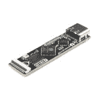
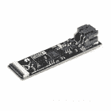
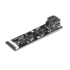
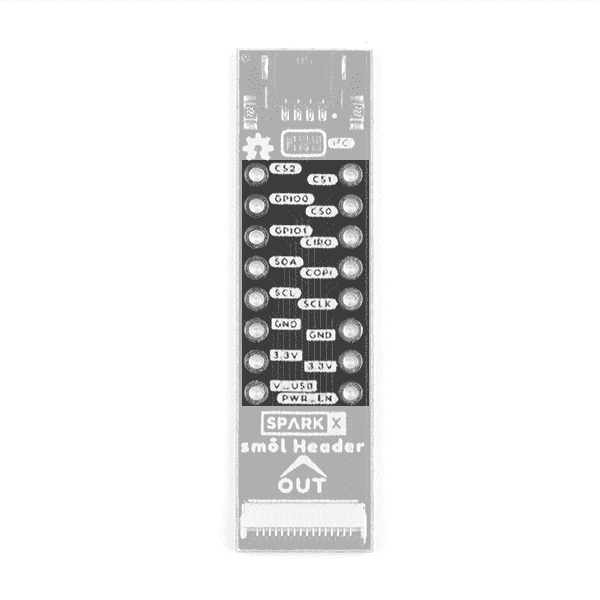

# SML 割台连接指南

> 原文：<https://learn.sparkfun.com/tutorials/sml-header-hookup-guide>

## 介绍

smol 是一种新的主板格式，顾名思义，它们*真的*小！

 

将**添加到您的[购物车](https://www.sparkfun.com/cart)中！**

### [SML 标题](https://www.sparkfun.com/products/18620)

[Out of stock](https://learn.sparkfun.com/static/bubbles/ "out of stock") SPX-18620

我们的红纸板很棒。但是他们有时候是不是显得有点* * _ 大 _**？！进入* * SML * *，这是一个新系列的主板，它…

$2.95[Favorited Favorite](# "Add to favorites") 2[Wish List](# "Add to wish list")** **需要用 smol 做一些原型制作？或者想要将 SML 堆栈连接到 Qwiic 板或您最喜欢的 SPI 传感器？smol 割台是完美的解决方案！

### 所需材料

如果您想将 qw IC 板连接到 SML 堆栈，您需要一些 qw IC 电缆:

 

将**添加到您的[购物车](https://www.sparkfun.com/cart)中！**

### [SparkFun Qwiic 线缆套件](https://www.sparkfun.com/products/15081)

[In stock](https://learn.sparkfun.com/static/bubbles/ "in stock") KIT-15081

为了更容易上手，我们用 50 毫米到 500 毫米的各种 Qwiic 电缆组装了 Qwiic 电缆套件…

$8.9516[Favorited Favorite](# "Add to favorites") 58[Wish List](# "Add to wish list")**** 

将**添加到您的[购物车](https://www.sparkfun.com/cart)中！**

### 

[In stock](https://learn.sparkfun.com/static/bubbles/ "in stock") CAB-17261

这种极化 I2C 电缆绝缘是由硅制成的，比我们原来的 Qwiic 电缆更灵活，特别是在

$1.60[Favorited Favorite](# "Add to favorites") 5[Wish List](# "Add to wish list")**** 

将**添加到您的[购物车](https://www.sparkfun.com/cart)中！**

### [Qwiic 线缆- 50mm](https://www.sparkfun.com/products/14426)

[In stock](https://learn.sparkfun.com/static/bubbles/ "in stock") PRT-14426

这是一根 50 毫米长的 4 芯电缆，带有 1 毫米 JST 端接。它旨在将支持 Qwiic 的组件连接在一起…

$0.95[Favorited Favorite](# "Add to favorites") 29[Wish List](# "Add to wish list")**** 

将**添加到您的[购物车](https://www.sparkfun.com/cart)中！**

### [Qwiic 电缆-试验板跳线(4 针)](https://www.sparkfun.com/products/14425)

[In stock](https://learn.sparkfun.com/static/bubbles/ "in stock") PRT-14425

这是一根跳线适配器电缆，一端带有一个 Qwiic JST 母接头，另一端带有一个试验板连接…

$1.50[Favorited Favorite](# "Add to favorites") 34[Wish List](# "Add to wish list")******** ********如果您使用 SML 进行原型制作，您可能需要:

 

将**添加到您的[购物车](https://www.sparkfun.com/cart)中！**

### [破开头球——直击](https://www.sparkfun.com/products/116)

[In stock](https://learn.sparkfun.com/static/bubbles/ "in stock") PRT-00116

一排标题-打破适应。40 个引脚，可切割成任何尺寸。用于定制 PCB 或通用定制接头。

$1.7520[Favorited Favorite](# "Add to favorites") 133[Wish List](# "Add to wish list")**** 

将**添加到您的[购物车](https://www.sparkfun.com/cart)中！**

### [试验板——经典](https://www.sparkfun.com/products/112)

[In stock](https://learn.sparkfun.com/static/bubbles/ "in stock") PRT-00112

你第一次接触电气工程-面包板。谁知道会带来这么大的挫败感？这是你的…

$10.9517[Favorited Favorite](# "Add to favorites") 28[Wish List](# "Add to wish list")**** 

将**添加到您的[购物车](https://www.sparkfun.com/cart)中！**

### [跳线高级 6 "米/米装 10 根](https://www.sparkfun.com/products/8431)

[In stock](https://learn.sparkfun.com/static/bubbles/ "in stock") PRT-08431

这是一个 SparkFun 独家！这些是 155 毫米长、26 AWG 跳线，两端都有公接头。用这些来跳离…

$4.502[Favorited Favorite](# "Add to favorites") 11[Wish List](# "Add to wish list")**** 

将**添加到您的[购物车](https://www.sparkfun.com/cart)中！**

### [【试验板-迷你模块化(红色)](https://www.sparkfun.com/products/12044)

[In stock](https://learn.sparkfun.com/static/bubbles/ "in stock") PRT-12044

这个红色迷你试验板是你的小项目原型的好方法！有了 170 个并列点，就有足够的空间来建立…

$4.50[Favorited Favorite](# "Add to favorites") 12[Wish List](# "Add to wish list")******** ********割台是 smol 生态系统的一部分。为什么不将其与 smol 处理器板配对呢？

 

将**添加到您的[购物车](https://www.sparkfun.com/cart)中！**

### [smol esp 32](https://www.sparkfun.com/products/18619)

[24 available](https://learn.sparkfun.com/static/bubbles/ "24 available") SPX-18619

我们的红纸板很棒。但是他们有时候是不是显得有点* * _ 大 _**？！进入* * SML * *，这是一个新系列的主板，它…

$17.951[Favorited Favorite](# "Add to favorites") 4[Wish List](# "Add to wish list")** **

为了能够将睡眠电流降低到 10 A 以下，您需要将 ESP32 与我们的智能 SML 电源板之一配对:

 

将**添加到您的[购物车](https://www.sparkfun.com/cart)中！**

### [SML 电源板脂](https://www.sparkfun.com/products/18622)

[Only 8 left!](https://learn.sparkfun.com/static/bubbles/ "only 8 left!") SPX-18622

我们的红纸板很棒。但是他们有时候是不是显得有点* * _ 大 _**？！进入* * SML * *，这是一个新系列的主板，它…

$17.95[Favorited Favorite](# "Add to favorites") 1[Wish List](# "Add to wish list")**** 

将**添加到您的[购物车](https://www.sparkfun.com/cart)中！**

### [SML 电源板 AAA](https://www.sparkfun.com/products/18621)

[In stock](https://learn.sparkfun.com/static/bubbles/ "in stock") SPX-18621

我们的红纸板很棒。但是他们有时候是不是显得有点* * _ 大 _**？！进入* * SML * *，这是一个新系列的主板，它…

$17.95[Favorited Favorite](# "Add to favorites") 2[Wish List](# "Add to wish list")**** ****不要忘记，您需要柔性印刷电路将您的 SML 板连接在一起。每块板上需要一个 FPC。如果你想让 SML 板整齐地叠放在一起，我们的 36 毫米 FPC 是最理想的长度。

 

将**添加到您的[购物车](https://www.sparkfun.com/cart)中！**

### [SML 36mm 16 路柔性印刷电路](https://www.sparkfun.com/products/18731)

[In stock](https://learn.sparkfun.com/static/bubbles/ "in stock") CAB-18731

这是用于互连 SML 板的 36 毫米 16 路 0.5 毫米间距柔性印刷电路。* * * * * * SML * *是一个 ec…

$0.95[Favorited Favorite](# "Add to favorites") 2[Wish List](# "Add to wish list")** **### 推荐阅读

这是 smol 割台的连接指南。如果您想了解更多关于 smol 的信息，请点击下面的按钮。

[Get started with the smôl Hookup Guide](https://learn.sparkfun.com/tutorials/sml-hookup-guide)

如果您不熟悉以下教程中涵盖的概念，我们建议您浏览这些教程:

 [### 串行外设接口(SPI)](https://learn.sparkfun.com/tutorials/serial-peripheral-interface-spi) SPI is commonly used to connect microcontrollers to peripherals such as sensors, shift registers, and SD cards.[Favorited Favorite](# "Add to favorites") 91 [### I2C](https://learn.sparkfun.com/tutorials/i2c) An introduction to I2C, one of the main embedded communications protocols in use today.[Favorited Favorite](# "Add to favorites") 128

## 硬件概述

SML 板采用 16 路 0.5 毫米间距的柔性印刷电路(FPC)，设计为一层堆叠一层。我们真的很喜欢 FPC，我们在越来越多的产品上使用它们。但是，当涉及到原型制作或如果您想要将其他器件连接到 SML 堆栈时，它们可能会有点棘手。smol 割台可助您一臂之力！

### FPC 关系

像我们所有的 SML 板一样，接头配有一个 16 路 0.5 毫米间距的柔性印刷电路连接器。SML 接头连接器的引脚排列如下:

| 连接器引脚号 | 信号名称 | 功能 |
| one | 进程 _ 功率 _EN | 处理器电源启用 |
| Two | 3V3 | 3.3V 电源轨 |
| three | GND | 电源接地/ 0V |
| four | SCLK | SPI 时钟 |
| five | 科皮 | SPI 控制器输出外设输入 |
| six | 奇波 | SPI 控制器输入外设输出 |
| seven | CS0 | SPI 片选 0 |
| eight | CS1 | SPI 片选 1 |
| nine | CS2 | SPI 片选 2 |
| Ten | GPIO0 | 通用输入/输出 0 |
| Eleven | GPIO1 | 通用输入/输出 1 |
| Twelve | 国家药品监督管理局 | I ² C 数据 |
| Thirteen | SCL | I ² C 时钟 |
| Fourteen | GND | 电源接地/ 0V |
| Fifteen | 3V3 | 3.3V 电源轨 |
| Sixteen | V_USB | USB 电源轨(5V) |

### 分线销

您可以完全访问所有 SML 引脚，因此将您最喜爱的 SPI 板连接到 SML 就像即插即用一样简单！SML 接头以良好的旧 0.1 英寸格式断开所有 16 个 SML 连接。孔模式与老式 16 引脚 0.3 英寸双列直插式封装(DIP)相同。非常适合将[头部引脚](https://www.sparkfun.com/products/116)焊接到标准[试验板](https://www.sparkfun.com/products/12044)上，然后推入其中。

### Qwiic 连接器

我们还包括一个 qw IC 连接器，因此您可以轻松快捷地将您喜爱的 qw IC 板连接到 SML 堆栈。

### Qwiic (I ² C】上拉

接头还包括用于 I ² C SDA 和 SCL 信号的上拉电阻。如果需要，可以通过断开双分离焊盘跳线链路来断开电阻。

如果你以前没有用过跳线，请查看我们的教程。

 [### 如何使用跳线焊盘和 PCB 走线](https://learn.sparkfun.com/tutorials/how-to-work-with-jumper-pads-and-pcb-traces) Handling PCB jumper pads and traces is an essential skill. Learn how to cut a PCB trace, add a solder jumper between pads to reroute connections, and repair a trace with the green wire method if a trace is damaged.[Favorited Favorite](# "Add to favorites") 11

## 解决纷争

* * *

**Not working as expected and need help?** [SparkX](https://www.sparkfun.com/sparkx) products are rapidly produced to bring you the most cutting edge technology as it becomes available. These products are tested but come with no guarantees. Live technical support is not available for SparkX products. Head on over to our [forum](https://forum.sparkfun.com/viewforum.php?f=123) for support or to ask a question and we will get back to you as soon as we can.

* * *

## 资源和更进一步

有关 SML 标题的更多信息，请查看以下链接:

**SML 标题文件:**

*   [示意图](https://cdn.sparkfun.com/assets/6/9/b/3/8/Schematic.pdf)
*   [老鹰档案](https://cdn.sparkfun.com/assets/0/e/5/8/a/SparkX_smol_Header.zip)
*   [GitHub 硬件回购](https://github.com/sparkfunX/SparkX_smol_Header)
*   [尺寸](https://cdn.sparkfun.com/assets/3/0/5/b/0/Dimensions.png)

**SML 文档:**

*   [SML 连接指南](https://learn.sparkfun.com/tutorials/sml-hookup-guide)**************************