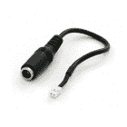
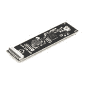
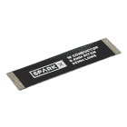
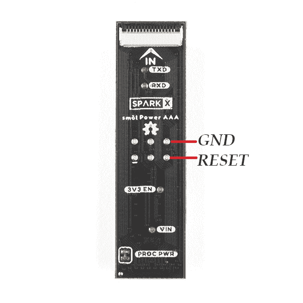

# SML 电源板 AAA 连接指南

> 原文：<https://learn.sparkfun.com/tutorials/sml-power-board-aaa-hookup-guide>

## 介绍

smol 是一种新的主板格式，顾名思义，它们*真的*小！

[](https://www.sparkfun.com/products/18621) 

将**添加到您的[购物车](https://www.sparkfun.com/cart)中！**

### [SML 电源板 AAA](https://www.sparkfun.com/products/18621)

[In stock](https://learn.sparkfun.com/static/bubbles/ "in stock") SPX-18621

我们的红纸板很棒。但是他们有时候是不是显得有点* * _ 大 _**？！进入* * SML * *，这是一个新系列的主板，它…

$17.95[Favorited Favorite](# "Add to favorites") 2[Wish List](# "Add to wish list")** **SML 电源板 AAA 是一款用于 SML 的智能电源板。它旨在通过一节或两节 AAA 或 AA 碱性(不可充电)电池为您的 SML 电池组提供 3.3V 电源。如果您需要充电解决方案，请查看[smol 电源板 LiPo](https://www.sparkfun.com/products/18622) 。

每个 SML 板的尺寸仅为 1.60 英寸乘 0.42 英寸(40.6 毫米乘 10.7 毫米)。我们把电路板做得足够宽，这样我们就可以在上面挤压 USB-C 和 16 路柔性印刷电路(FPC)连接器。一些电路板在顶层和底层都有元件，这也有助于保持电路板的小型化。

SML 板设计为一个堆叠在另一个之上，使用 16 路 0.5 毫米间距 FPC 来提供板与板之间的互连。每块板在底层有一个 **IN** FPC 连接器，在顶层有一个 **OUT** FPC 连接器。这些板堆叠成之字形菊花链；信号和电源通过 FPC 从一个电路板上下传递到下一个电路板。

### 所需材料

作为最低要求，您需要一个电池盒或 JST-PH 电缆来搭配您的电源板:

[](https://www.sparkfun.com/products/15101) 

将**添加到您的[购物车](https://www.sparkfun.com/cart)中！**

### [](https://www.sparkfun.com/products/15101)

[In stock](https://learn.sparkfun.com/static/bubbles/ "in stock") PRT-15101

这是一款独特的双电池 AAA 电池座，专为 BBC micro:bit 打造。6 英寸(约 150 毫米)电缆已被端接…

$2.10[Favorited Favorite](# "Add to favorites") 14[Wish List](# "Add to wish list")****[](https://www.sparkfun.com/products/9914) 

将**添加到您的[购物车](https://www.sparkfun.com/cart)中！**

### [JST 跳线 2 线组装](https://www.sparkfun.com/products/9914)

[In stock](https://learn.sparkfun.com/static/bubbles/ "in stock") PRT-09914

这是一根简单的双线电缆。非常适合从一个板跳到另一个板或者做其他事情。有一个 2 针 JST 连接器…

$1.053[Favorited Favorite](# "Add to favorites") 34[Wish List](# "Add to wish list")****[](https://www.sparkfun.com/products/14299) 

将**添加到您的[购物车](https://www.sparkfun.com/cart)中！**

### [](https://www.sparkfun.com/products/14299)

[In stock](https://learn.sparkfun.com/static/bubbles/ "in stock") PRT-14299

这是一款独特的 2 芯 AA 电池座。6 英寸(约 150 毫米)电缆已经用 JST-PH 连接器端接。

$1.60[Favorited Favorite](# "Add to favorites") 23[Wish List](# "Add to wish list")****[](https://www.sparkfun.com/products/8734) 

将**添加到您的[购物车](https://www.sparkfun.com/cart)中！**

### [桶形插孔到 2 针 JST](https://www.sparkfun.com/products/8734)

[In stock](https://learn.sparkfun.com/static/bubbles/ "in stock") TOL-08734

两针 JST 连接器连接到 2.1x 5.5mm 毫米筒式插孔，6.25 英寸长的跳线电缆。我们使用这种电缆来适应从墙上电源…

$3.501[Favorited Favorite](# "Add to favorites") 18[Wish List](# "Add to wish list")******** ********电源板 AAA 是 smol 生态系统的一部分。为什么不将它与一个 smol 处理器板和一个外设板配对呢？

[](https://www.sparkfun.com/products/18618) 

将**添加到您的[购物车](https://www.sparkfun.com/cart)中！**

### [【北极精灵 R2】](https://www.sparkfun.com/products/18618)

[Out of stock](https://learn.sparkfun.com/static/bubbles/ "out of stock") SPX-18618

我们的红纸板很棒。但是他们有时候是不是显得有点* * _ 大 _**？！进入* * SML * *，这是一个新系列的主板，它…

$199.95[Favorited Favorite](# "Add to favorites") 5[Wish List](# "Add to wish list")****[](https://www.sparkfun.com/products/18623) 

将**添加到您的[购物车](https://www.sparkfun.com/cart)中！**

### [【smol Zoe-m8q](https://www.sparkfun.com/products/18623)

[30 available](https://learn.sparkfun.com/static/bubbles/ "30 available") SPX-18623

我们的红纸板很棒。但是他们有时候是不是显得有点* * _ 大 _**？！进入* * SML * *，这是一个新系列的主板，它…

$39.95[Favorited Favorite](# "Add to favorites") 4[Wish List](# "Add to wish list")****[](https://www.sparkfun.com/products/18619) 

将**添加到您的[购物车](https://www.sparkfun.com/cart)中！**

### [smol esp 32](https://www.sparkfun.com/products/18619)

[24 available](https://learn.sparkfun.com/static/bubbles/ "24 available") SPX-18619

我们的红纸板很棒。但是他们有时候是不是显得有点* * _ 大 _**？！进入* * SML * *，这是一个新系列的主板，它…

$17.951[Favorited Favorite](# "Add to favorites") 4[Wish List](# "Add to wish list")****** ******不要忘记，您需要柔性印刷电路将您的 SML 板连接在一起。每块板上需要一个 FPC。如果你想让 SML 板整齐地叠放在一起，我们的 36 毫米 FPC 是最理想的长度。

[](https://www.sparkfun.com/products/18731) 

将**添加到您的[购物车](https://www.sparkfun.com/cart)中！**

### [SML 36mm 16 路柔性印刷电路](https://www.sparkfun.com/products/18731)

[In stock](https://learn.sparkfun.com/static/bubbles/ "in stock") CAB-18731

这是用于互连 SML 板的 36 毫米 16 路 0.5 毫米间距柔性印刷电路。* * * * * * SML * *是一个 ec…

$0.95[Favorited Favorite](# "Add to favorites") 2[Wish List](# "Add to wish list")** **需要用 smol 做一些原型制作？或者想要将您的 SML 堆栈连接到 Qwiic 板？SML 割台非常适合这种情况:

[](https://www.sparkfun.com/products/18620) 

将**添加到您的[购物车](https://www.sparkfun.com/cart)中！**

### [SML 标题](https://www.sparkfun.com/products/18620)

[Out of stock](https://learn.sparkfun.com/static/bubbles/ "out of stock") SPX-18620

我们的红纸板很棒。但是他们有时候是不是显得有点* * _ 大 _**？！进入* * SML * *，这是一个新系列的主板，它…

$2.95[Favorited Favorite](# "Add to favorites") 2[Wish List](# "Add to wish list")** **

### 推荐阅读

这是 smol 电源板 AAA 的连接指南。如果您想了解更多关于 smol 的信息，请点击下面的按钮。

[Get started with the smôl Hookup Guide](https://learn.sparkfun.com/tutorials/sml-hookup-guide)

如果您不熟悉以下教程中涵盖的概念，我们建议您浏览这些教程:

[](https://learn.sparkfun.com/tutorials/battery-technologies) [### 电池技术](https://learn.sparkfun.com/tutorials/battery-technologies) The basics behind the batteries used in portable electronic devices: LiPo, NiMH, coin cells, and alkaline.[Favorited Favorite](# "Add to favorites") 50[](https://learn.sparkfun.com/tutorials/i2c) [### I2C](https://learn.sparkfun.com/tutorials/i2c) An introduction to I2C, one of the main embedded communications protocols in use today.[Favorited Favorite](# "Add to favorites") 128

## 硬件概述

在本节中，我们将介绍该板的功能以及 SML 电源板 AAA 包含的内容。

### 这个板是做什么的？

这个板是做什么的？问得好！让我们现在就回答这个问题。

电源板的主要工作是为您的 SML 生态系统供电。SML 设计为小尺寸和低电流消耗。电源板在尽可能降低 SML 的电流消耗方面起着关键作用。该板有一个 TPS61200 开关调节器，用于将一个或两个 AAA 或 AA 碱性电池的电压提升至 3.3V，但它还带有一个 ATtiny43 AVR 微控制器。这是一款用于 smol 生态系统的*智能*电源板！

当您希望项目进入低功耗或深度睡眠状态时，标准做法是将处理器置于它所提供的最低功耗状态。但是你可能会发现电流消耗仍然在 100 A 到 500 A 之间，这取决于你使用的处理器。然后是电压调节器消耗的静态电流。静态电流是调节器开启但无负载时消耗的电流。同样，它因调节器而异，但您可能会发现这又增加了 55 A 的电流消耗。这些小电流累积起来会大大减少你的电池寿命。

对于 SML，我们采取了一种新的方法。电源板控制并为整个 SML 堆栈提供 3.3V 电源。当处理器板发出指令时，板载 ATtiny 微控制器将完全关闭电源*，然后在预定义的时间间隔内进入低功耗睡眠状态。从几十毫秒到几天的睡眠间隔是可能的。我们使用了神奇的 [Otii 电弧功率分析仪](https://www.sparkfun.com/products/18585)来帮助我们将睡眠电流降低到仅仅 **12 A** 。是的，你没看错，12 微安！smol 让您的电池寿命可以用**个月**来衡量，而不是几天！*

### 电池连接器

到目前为止，电路板上最大的组件是电池的 JST-PH 连接器。

[](https://cdn.sparkfun.com/assets/learn_tutorials/2/0/5/9/18621_smol_Power_AAA_Connector.jpg)**Battery Connector Polarity:** Please make sure that you use one of our recommended battery holders or cables. Some battery holders use the same JST connector as ours but have the [opposite polarity](https://learn.sparkfun.com/tutorials/polarity/all#other-polarized-components). Connecting one of these to your smôl power board will destroy it as the board has no reverse polarity protection. If you are going to use your own battery holder or cable, it is up to you to ensure it has the correct polarity. In the above photo, the positive pin is on the right.

### ATtiny43U AVR 微控制器

smol 电源板 AAA 是一个*智能*电源板。板载 ATtiny43U 微控制器可以监控电池电压和其他参数。当处理器板要求时，ATtiny43 将完全关闭 SML 3.3V 电源，并在预定义的时间间隔内进入深度睡眠状态。这使得休眠电流可以降至仅 12 A。

[](https://cdn.sparkfun.com/assets/learn_tutorials/2/0/5/9/18621_smol_Power_AAA_ATtiny43.jpg)

ATtiny43U 可能看起来是一个奇怪的选择，但实际上它是该板的完美选择。我们使用它是因为它内置升压转换器，可以直接在低至 0.7V 的电压下工作，不需要单独的稳压器。

我们的[spark fun SML 电源板 Arduino 库](https://github.com/sparkfun/SparkFun_smol_Power_Board_Arduino_Library)为您完成所有繁重的工作，通过简单的函数调用轻松与 ATtiny 通信。

### 关于温度传感的一点说明

ATtiny43 内置温度传感器，可通过[spark fun SML 电源板 Arduino 库](https://github.com/sparkfun/SparkFun_smol_Power_Board_Arduino_Library)访问。但是，引用的传感器典型精度是&pm；10 摄氏度是的，*正负十摄氏度*。传感器测量需要外部校准才有用。

### 稳压器

SML 电源板 AAA 内置 TPS61200 开关稳压器。这与我们在 [LiPower - Boost 转换器](https://www.sparkfun.com/products/10255)上使用的调节器相同。当将 1.5V 升压至 3.3V 时，它可以提供约 550mA 的电流，当将 3.0V 升压至 3.3V 时，它可以提供约 1500mA 的电流。它可以由 ATtiny43U 微控制器完全关闭，从而避免 55 A 的静态电流消耗。

[](https://cdn.sparkfun.com/assets/learn_tutorials/2/0/5/9/18621_smol_Power_AAA_Regulator.jpg)The TPS61200 can operate in Buck mode too and regulate higher voltages down to 3.3V. However, we do not recommend operating the board in this mode as the ATtiny43U's VCC supply will also be at that same higher voltage, leading to unexpected behavior and complications. Never exceed 5.5V or you will damage the ATtiny43U.***Ye cannae change the laws of physics!*** The current draw from a single AAA or AA cell will be approximately three times what smôl is drawing at 3.3V. When powering the [smôl ARTIC R2 satellite communication board](https://www.sparkfun.com/products/18618) you are likely to have to use two AA cells for best results.

### FPC 关系

像我们所有的 SML 板一样，电源板 AAA 配备了两个 16 路 0.5 毫米间距的柔性印刷电路连接器。FPC 用于以菊花链形式将 SML 板连接在一起。

SML 电源板 AAA 的引脚排列如下:

| 连接器引脚号 | 信号名称 | 功能 | 笔记 |
| one | 进程 _ 功率 _EN | 处理器电源启用 | 电源板将此信号拉低，以禁用电源板上的电压调节器 |
| Two | 3V3 | 3.3V 电源轨 |  |
| three | GND | 电源接地/ 0V |  |
| four | SCLK | SPI 时钟 | 未使用 |
| five | 科皮 | SPI 控制器输出外设输入 | 未使用 |
| six | 奇波 | SPI 控制器输入外设输出 | 未使用 |
| seven | CS0 | SPI 片选 0 | 未使用 |
| eight | CS1 | SPI 片选 1 | 未使用 |
| nine | CS2 | SPI 片选 2 | 未使用 |
| Ten | GPIO0 | 通用输入/输出 0 | 未使用 |
| Eleven | GPIO1 | 通用输入/输出 1 | 未使用 |
| Twelve | 国家药品监督管理局 | I ² C 数据 | 用于 ATtiny43U 通信 |
| Thirteen | SCL | I ² C 时钟 | 用于 ATtiny43U 通信 |
| Fourteen | GND | 电源接地/ 0V |  |
| Fifteen | 3V3 | 3.3V 电源轨 |  |
| Sixteen | V_USB | USB 电源轨(5V) | USB 电源用于给电池充电 |

SML 电源板 AAA 上的输入和输出引脚连接是相同的。(SML 外围设备板并不总是如此。查看相应的外围设备板连接指南，了解全部详情。)

连接 SML 板的顺序很重要。但是因为电源板 AAA 只使用 I ² C 通信，所以可以放在栈的任何地方。请参阅 SML 连接指南了解更多详情。

[Get started with the smôl Hookup Guide](https://learn.sparkfun.com/tutorials/sml-hookup-guide)

## SML 细节

### 界面:

*   接口:I ² C
    *   ATtiny43U 默认地址:0x50

### 进程 _ 功率 _EN:

*   进程 _ 功率 _EN:
    *   电源板将 PROC_PWR_EN 拉低，以禁用处理器板上的调节器

## Arduino 示例:电池电压

如果您使用的是 SML ESP32 处理器板，您需要首先为 ESP32 安装 CP210x USB 驱动程序和 Arduino 板软件包。请参见[smol ESP32 连接指南](https://learn.sparkfun.com/tutorials/sml-esp32-hookup-guide)了解更多详情。

SML 电源板有自己的 Arduino 库，使与板的通信像调用函数一样简单。你可以通过 Arduino IDE 库管理器搜索 **SparkFun smol power** 来安装这个库。或者，你可以从 [GitHub](https://github.com/sparkfun/SparkFun_smol_Power_Board_Arduino_Library) 下载这个库，或者点击下面的按钮下载成 zip 文件:

[SparkFun smôl Power Board Arduino Library (ZIP)](https://github.com/sparkfun/SparkFun_smol_Power_Board_Arduino_Library/archive/main.zip)

您还需要安装 SparkFun MAX1704x 燃油表 Arduino 库。SML 电源板 AAA 上没有电量计，但图书馆需要它来为 SML 电源板 LiPo 提供支持。同样，你可以通过 Arduino IDE 库管理器搜索 **SparkFun MAX1704x** 来安装这个库。或者，你可以从 [GitHub](https://github.com/sparkfun/SparkFun_MAX1704x_Fuel_Gauge_Arduino_Library) 下载这个库，或者点击下面的按钮下载成 zip 文件:

[SparkFun MAX1704x Fuel Gauge Arduino Library (ZIP)](https://github.com/sparkfun/SparkFun_MAX1704x_Fuel_Gauge_Arduino_Library/archive/main.zip)

电源板库包含一组[经过试验和测试的示例](https://github.com/sparkfun/SparkFun_smol_Power_Board_Arduino_Library/tree/main/examples)，它们将与 SML 电源板 AAA 和 SML 电源板 LiPo 一起工作。从一个切换到另一个时，只需要更改一行代码。

以下代码是 [Example2_BatteryVoltage](https://github.com/sparkfun/SparkFun_smol_Power_Board_Arduino_Library/blob/main/examples/Example2_BatteryVoltage/Example2_BatteryVoltage.ino) 的简化版。将代码上传到处理器板上，打开串行监视器或 115200 波特的终端仿真器，查看输出。

```
language:c
#include <Wire.h>

#include <SparkFun_MAX1704x_Fuel_Gauge_Arduino_Library.h> // Click here to get the library: http://librarymanager/All#SparkFun_MAX1704x_Fuel_Gauge_Arduino_Library
#include <SparkFun_smol_Power_Board.h> //Click here to get the library:  http://librarymanager/All#SparkFun_smol_Power_Board

smolPowerAAA myPowerBoard;

void setup()
{
  Serial.begin(115200);
  while (!Serial)
    ; // Wait for the user to open the Serial console
  Serial.println(F("smôl Power Board example"));
  Serial.println();

  Wire.begin();

  if (myPowerBoard.begin() == false) // Begin communication with the power board using the default I2C address (0x50) and the Wire port
  {
    Serial.println(F("Could not communicate with the power board. Please check the I2C connections. Freezing..."));
    while (1)
      ;
  }

  // Select VCC as the voltage reference - see the full example for more details
  myPowerBoard.setADCVoltageReference(SFE_SMOL_POWER_USE_ADC_REF_VCC);

  float voltage = myPowerBoard.getBatteryVoltage(); // Read the battery voltage from the ATtiny43U
  Serial.print(F("The battery voltage reads as: "));
  Serial.println(voltage);

  if (voltage == -99.0)
  {
    Serial.println(F("A voltage of -99.0V indicates an error."));
  }
}

void loop()
{
  //Nothing to do here
} 
```

## 解决纷争

如果您的 SML 堆栈没有通信，它可能处于深度睡眠状态。当处理器板命令电源板进入深度睡眠时，它再次唤醒它的唯一方式是当睡眠间隔到期时。您不能通过 USB 接口唤醒或重置系统。

移除并重新插入电池连接将重置电源板并再次唤醒它。

我们没有在 SML 电源板上包括复位按钮，以使板尽可能小。但是，您可以通过电路板底部的 ISP 编程测试点重置它。将 RESET 短接至 GND，以重置电路板。

[](https://cdn.sparkfun.com/assets/learn_tutorials/2/0/5/9/18621_smol_Power_AAA_Reset_Pin.jpg)**Not working as expected and need help?** [SparkX](https://www.sparkfun.com/sparkx) products are rapidly produced to bring you the most cutting edge technology as it becomes available. These products are tested but come with no guarantees. Live technical support is not available for SparkX products. Head on over to our [forum](https://forum.sparkfun.com/viewforum.php?f=123) for support or to ask a question and we will get back to you as soon as we can.

## 资源和更进一步

有关 SML 电源板 AAA 的更多信息，请查看以下链接:

**SML 电源板 AAA 文档:**

*   [示意图](https://cdn.sparkfun.com/assets/d/4/d/3/b/Schematic.pdf)
*   [老鹰档案](https://cdn.sparkfun.com/assets/7/9/a/3/f/SparkX_smol_Power_AAA.zip)
*   [GitHub 硬件回购](https://github.com/sparkfunX/SparkX_smol_Power_Board_AAA)
*   [spark fun SML 电源板 Arduino 库](https://github.com/sparkfun/SparkFun_smol_Power_Board_Arduino_Library)
*   [Arduino 示例](https://github.com/sparkfun/SparkFun_smol_Power_Board_Arduino_Library/tree/main/examples)

**升压调节器:**

*   [数据表](https://cdn.sparkfun.com/assets/5/6/d/0/0/tps61200.pdf) (TPS61200)

**微控制器:**

*   [数据表](https://cdn.sparkfun.com/assets/3/b/3/0/3/ATtiny43.pdf) (ATtiny43U)

**SML 文档:**

*   [SML 连接指南](https://learn.sparkfun.com/tutorials/sml-hookup-guide)*********************