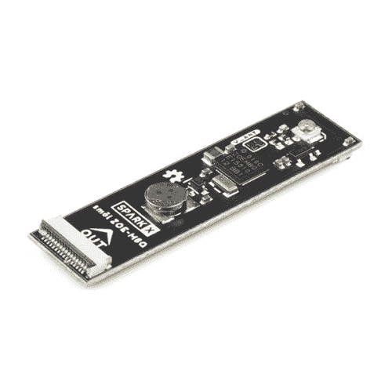
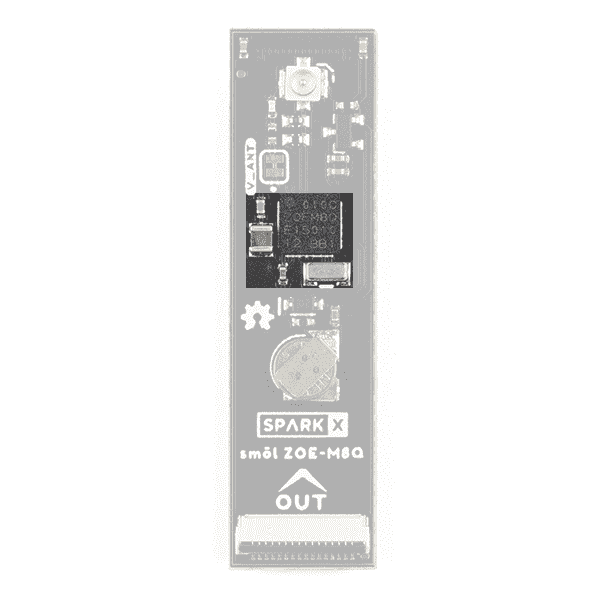
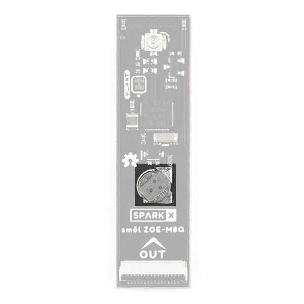
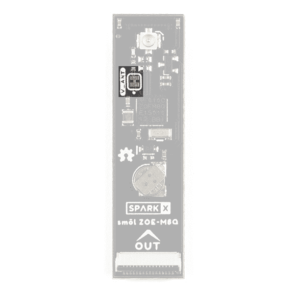
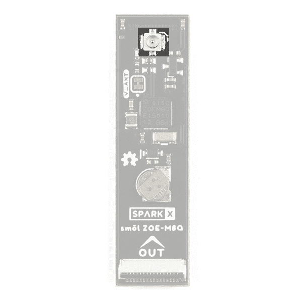
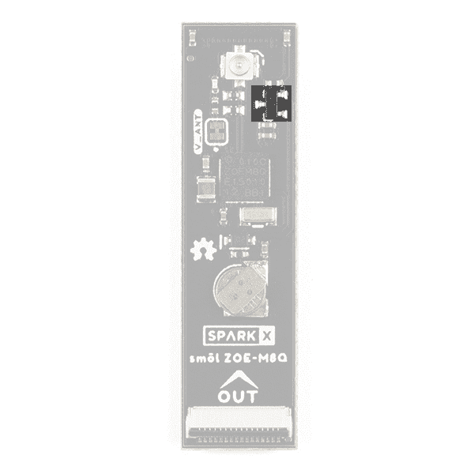

# SML ZOE-M8Q 连接指南

> 原文：<https://learn.sparkfun.com/tutorials/sml-zoe-m8q-hookup-guide>

## 介绍

smol 是一种新的主板格式，顾名思义，它们*真的*小！

[](https://www.sparkfun.com/products/18623) 

将**添加到您的[购物车](https://www.sparkfun.com/cart)中！**

 **### [【smol Zoe-m8q](https://www.sparkfun.com/products/18623)

[30 available](https://learn.sparkfun.com/static/bubbles/ "30 available") SPX-18623

我们的红纸板很棒。但是他们有时候是不是显得有点* * _ 大 _**？！进入* * SML * *，这是一个新系列的主板，它…

$39.95[Favorited Favorite](# "Add to favorites") 4[Wish List](# "Add to wish list")** **SML ZOE-M8Q 是一款 GNSS(全球导航卫星系统)接收器板，基于出色的 u-blox ZOE-M8Q。

每个 SML 板的尺寸仅为 1.60 英寸乘 0.42 英寸(40.6 毫米乘 10.7 毫米)。我们把电路板做得足够宽，这样我们就可以在上面挤压 USB-C 和 16 路柔性印刷电路(FPC)连接器。一些电路板在顶层和底层都有元件，这也有助于保持电路板的小型化。

SML 板设计为一个堆叠在另一个之上，使用 16 路 0.5 毫米间距 FPC 来提供板与板之间的互连。每块板在底层有一个 **IN** FPC 连接器，在顶层有一个 **OUT** FPC 连接器。这些板堆叠成之字形菊花链；信号和电源通过 FPC 从一个电路板上下传递到下一个电路板。

### 所需材料

作为最低要求，您需要一个 u.FL GNSS 天线:

[](https://www.sparkfun.com/products/15246) 

将**添加到您的[购物车](https://www.sparkfun.com/cart)中！**

 **### [【Molex】柔性 GNSS 天线-U . FL](https://www.sparkfun.com/products/15246)

[In stock](https://learn.sparkfun.com/static/bubbles/ "in stock") GPS-15246

具有 U.FL 连接器和背胶的柔性纸薄 GNSS 天线。

$4.501[Favorited Favorite](# "Add to favorites") 7[Wish List](# "Add to wish list")** **ZOE-M8Q 外设板是 smol 生态系统的一部分。为什么不将其与 smol 处理器板配对呢？

[](https://www.sparkfun.com/products/18619) 

将**添加到您的[购物车](https://www.sparkfun.com/cart)中！**

 **### [smol esp 32](https://www.sparkfun.com/products/18619)

[24 available](https://learn.sparkfun.com/static/bubbles/ "24 available") SPX-18619

我们的红纸板很棒。但是他们有时候是不是显得有点* * _ 大 _**？！进入* * SML * *，这是一个新系列的主板，它…

$17.951[Favorited Favorite](# "Add to favorites") 4[Wish List](# "Add to wish list")** **

为了能够将睡眠电流降低到 10 A 以下，您需要将 ESP32 与我们的智能 SML 电源板之一配对:

[](https://www.sparkfun.com/products/18622) 

将**添加到您的[购物车](https://www.sparkfun.com/cart)中！**

 **### [SML 电源板脂](https://www.sparkfun.com/products/18622)

[Only 8 left!](https://learn.sparkfun.com/static/bubbles/ "only 8 left!") SPX-18622

我们的红纸板很棒。但是他们有时候是不是显得有点* * _ 大 _**？！进入* * SML * *，这是一个新系列的主板，它…

$17.95[Favorited Favorite](# "Add to favorites") 1[Wish List](# "Add to wish list")****[](https://www.sparkfun.com/products/18621) 

将**添加到您的[购物车](https://www.sparkfun.com/cart)中！**

 **### [SML 电源板 AAA](https://www.sparkfun.com/products/18621)

[In stock](https://learn.sparkfun.com/static/bubbles/ "in stock") SPX-18621

我们的红纸板很棒。但是他们有时候是不是显得有点* * _ 大 _**？！进入* * SML * *，这是一个新系列的主板，它…

$17.95[Favorited Favorite](# "Add to favorites") 2[Wish List](# "Add to wish list")**** ****不要忘记，您需要柔性印刷电路将您的 SML 板连接在一起。每块板上需要一个 FPC。如果你想让 SML 板整齐地叠放在一起，我们的 36 毫米 FPC 是最理想的长度。

[](https://www.sparkfun.com/products/18731) 

将**添加到您的[购物车](https://www.sparkfun.com/cart)中！**

 **### [SML 36mm 16 路柔性印刷电路](https://www.sparkfun.com/products/18731)

[In stock](https://learn.sparkfun.com/static/bubbles/ "in stock") CAB-18731

这是用于互连 SML 板的 36 毫米 16 路 0.5 毫米间距柔性印刷电路。* * * * * * SML * *是一个 ec…

$0.95[Favorited Favorite](# "Add to favorites") 2[Wish List](# "Add to wish list")** **需要用 smol 做一些原型制作？或者想要将 SML ZOE-M8Q 连接到另一个 Qwiic 板？SML 割台非常适合这种情况:

[](https://www.sparkfun.com/products/18620) 

将**添加到您的[购物车](https://www.sparkfun.com/cart)中！**

 **### [SML 标题](https://www.sparkfun.com/products/18620)

[Out of stock](https://learn.sparkfun.com/static/bubbles/ "out of stock") SPX-18620

我们的红纸板很棒。但是他们有时候是不是显得有点* * _ 大 _**？！进入* * SML * *，这是一个新系列的主板，它…

$2.95[Favorited Favorite](# "Add to favorites") 2[Wish List](# "Add to wish list")** **

### 推荐阅读

这是 smol ZOE-M8Q 外围设备板的连接指南。如果您想了解更多关于 smol 的信息，请点击下面的按钮。

[Get started with the smôl Hookup Guide](https://learn.sparkfun.com/tutorials/sml-hookup-guide)

如果您不熟悉以下教程中涵盖的概念，我们建议您浏览这些教程:

[](https://learn.sparkfun.com/tutorials/i2c) [### I2C](https://learn.sparkfun.com/tutorials/i2c) An introduction to I2C, one of the main embedded communications protocols in use today.[Favorited Favorite](# "Add to favorites") 128[](https://learn.sparkfun.com/tutorials/three-quick-tips-about-using-ufl) [### 关于使用 U.FL 的三个快速提示](https://learn.sparkfun.com/tutorials/three-quick-tips-about-using-ufl) Quick tips regarding how to connect, protect, and disconnect U.FL connectors.[Favorited Favorite](# "Add to favorites") 14

## 硬件概述

在这一节中，我们将介绍 SML ZOE-M8Q 外设板上包含的内容。

### GNSS 能力

u-blox ZOE-M8Q 能够同时连接多达三个不同的 GNSS 星座，使其大小非常准确。

[](https://cdn.sparkfun.com/assets/learn_tutorials/2/0/5/5/18623_smol_ZOE-M8Q_GNSS.jpg)

以下列出了 GNSS 装置的功能:

|  | 全球导航卫星系统（global navigation satellite system） | GPS 和 GLONASS | 全球（卫星）定位系统 | GLONASS | 北斗 | “伽利略”号 |
| **水平位置精度** |  | 250 万 | 250 万 | 4m | 3m | 3m |
| **最大导航更新率** | 只读存储器 | 10Hz | 18Hz | 18Hz | 18Hz | 18Hz |  |
|  | 闪光 | 5Hz | 10Hz | 10Hz | 10Hz | 10Hz |
| **首次定位时间** | 冷启动 | 26s | 29 岁 | 30 秒 | 34s | 45s |
|  | 热起动 | 1s | 1s | 1s | 1s | 1s |
| **灵敏度** | 跟踪和导航 | -167dBm | -166dBm | -166dBm | -160dBm | -159dBm |
|  | 重新获得 | -160dBm | -160dBm | -156dBm | -157dBm | -153dBm |
|  | 冷启动 | -148dBm | -148dBm | -145dBm | -143dBm | -138dBm |
|  | 热起动 | -157dBm | -157dBm | -156dBm | -155dBm | -151dBm |
| **速度精度** | 0.05 米/秒 |  |  |  |  |  |
| **航向精度** | 0.3 度 |  |  |  |  |  |

### 力量

该板以及所有 SML 板的电源应为 **3.3V** 。

### 电池

板中央的小金属盘是一个小型锂电池。这种电池不像 3.3V 系统那样向 IC 供电，而是向 IC 内部的相关系统*供电，从而允许快速重新连接到卫星。第一次修复的时间大约为 **~29 秒**，但在产品锁定后，电池将允许一秒的**时间进行第一次修复。这称为**热启动**，在主板断电后持续四个小时。电池为备用系统提供超过一年的电力，当 SML 3.3V 供电时充电缓慢。***

[](https://cdn.sparkfun.com/assets/learn_tutorials/2/0/5/5/18623_smol_ZOE-M8Q_Battery.jpg)

### 针织套衫

这款产品顶部只有一个跳线，标签为 **V_ANT** 。默认情况下，有源天线的 u.FL 连接器上提供 3.3V 电源。切断 V_ANT 跳线会断开 3.3V 电源。

[](https://cdn.sparkfun.com/assets/learn_tutorials/2/0/5/5/18623_smol_ZOE-M8Q_Jumper.jpg)

### 单位 FL 连接器

板上的 u.FL 连接器是您插入天线的地方。这是一款用于射频天线的紧凑型连接器，具有与传统 SMA 连接器相同的功能。你可能更熟悉，甚至拥有一些使用 SMA 连接器的天线；别担心，我们带了一个 [U.FL 到 SMA](https://www.sparkfun.com/products/15114) 的线缆适配器。如果这是你第一次使用 U.FL 连接器，请查看我们的[教程。](https://learn.sparkfun.com/tutorials/three-quick-tips-about-using-ufl)

[](https://cdn.sparkfun.com/assets/learn_tutorials/2/0/5/5/18623_smol_ZOE-M8Q_u.FL.jpg)

### 电源开关

SML ZOE-M8Q 包括一个板载电源开关(MOSFET):

[](https://cdn.sparkfun.com/assets/learn_tutorials/2/0/5/5/18623_smol_ZOE-M8Q_MOSFET.jpg)

ZOE-M8Q 的电源通过 SML gpio 0 信号控制。让 GPIO0 悬空或拉高以禁用 ZOE-M8Q 的电源(默认状态)。将 SML gpio 0 信号拉低，以使能 ZOE-M8Q 的电源。

### FPC 关系

像我们所有的 SML 板一样，ZOE-M8Q 外设板配备了两个 16 路 0.5 毫米间距的柔性印刷电路连接器。FPC 用于以菊花链形式将 SML 板连接在一起。

SML ZOE-M8Q IN 连接器的引脚排列如下:

| 输入连接器引脚号 | 信号名称 | 功能 | 笔记 |
| one | 进程 _ 功率 _EN | 处理器电源启用 | 未使用 |
| Two | 3V3 | 3.3V 电源轨 |  |
| three | GND | 电源接地/ 0V |  |
| four | SCLK | SPI 时钟 | 未使用 |
| five | 科皮 | SPI 控制器输出外设输入 | 未使用 |
| six | 奇波 | SPI 控制器输入外设输出 | 未使用 |
| seven | CS0 | SPI 片选 0 | 未使用 |
| eight | CS1 | SPI 片选 1 | 未使用 |
| nine | CS2 | SPI 片选 2 | 未使用 |
| Ten | GPIO0 | ZOE-M8Q 电源控制 | 拉低以启用 ZOE-M8Q 的电源 |
| Eleven | GPIO1 | 通用输入/输出 1 | 连接到 OUT 连接器上的第 10 针(GPIO0) |
| Twelve | 国家药品监督管理局 | I ² C 数据 | 用于 ZOE-M8Q 通信 |
| Thirteen | SCL | I ² C 时钟 | 用于 ZOE-M8Q 通信 |
| Fourteen | GND | 电源接地/ 0V |  |
| Fifteen | 3V3 | 3.3V 电源轨 |  |
| Sixteen | V_USB | USB 电源轨(5V) | 未使用 |

SML ZOE-M8Q 输出连接器的引脚排列如下:

| 外部连接器引脚号 | 信号名称 | 功能 | 笔记 |
| one | 进程 _ 功率 _EN | 处理器电源启用 | 未使用 |
| Two | 3V3 | 3.3V 电源轨 |  |
| three | GND | 电源接地/ 0V |  |
| four | SCLK | SPI 时钟 | 未使用 |
| five | 科皮 | SPI 控制器输出外设输入 | 未使用 |
| six | 奇波 | SPI 控制器输入外设输出 | 未使用 |
| seven | CS0 | SPI 片选 0 | 未使用 |
| eight | CS1 | SPI 片选 1 | 未使用 |
| nine | CS2 | SPI 片选 2 | 未使用 |
| Ten | GPIO0 | 通用输入/输出 0 | 连接到 in 连接器上的引脚 11 (GPIO1) |
| Eleven | GPIO1 |  | 未连接 |
| Twelve | 国家药品监督管理局 | I ² C 数据 | 用于 ZOE-M8Q 通信 |
| Thirteen | SCL | I ² C 时钟 | 用于 ZOE-M8Q 通信 |
| Fourteen | GND | 电源接地/ 0V |  |
| Fifteen | 3V3 | 3.3V 电源轨 |  |
| Sixteen | V_USB | USB 电源轨(5V) | 未使用 |

我们在 GPIO 信号上使用一种叫做*瀑布*的技术。如果你以前没有使用过瀑布，请查看 smol 连接指南。

[Get started with the smôl Hookup Guide](https://learn.sparkfun.com/tutorials/sml-hookup-guide)

## SML 细节

### 界面:

*   I ² C
*   默认地址:0x42(未移位)

### GPIO:

*   GPIO0 控制 ZOE-M8Q 的电源
    *   将 GPIO0 拉高或保持浮空以禁用 ZOE-M8Q 的电源(默认状态)
    *   拉低 GPIO0 以启用 ZOE-M8Q 的电源

请记住，SML GPIO 引脚使用*瀑布*。GPIO0 的 Arduino 数字引脚数取决于您使用的处理器板以及 ZOE-M8Q 在 SML 堆栈中的位置。请查阅[SML 连接指南](https://learn.sparkfun.com/tutorials/sml-hookup-guide)了解更多详情。

## Arduino 示例:获取位置

如果您使用的是 SML ESP32 处理器板，您需要首先为 ESP32 安装 CP210x USB 驱动程序和 Arduino 板软件包。请参见[smol ESP32 连接指南](https://learn.sparkfun.com/tutorials/sml-esp32-hookup-guide)了解更多详情。

SML ZOE-M8Q GNSS 外设板与 SparkFun u-blox GNSS Arduino 库完全兼容。你可以通过 Arduino IDE 库管理器搜索 **SparkFun u-blox GNSS** 来安装这个库。或者，你可以从 [GitHub](https://github.com/sparkfun/SparkFun_u-blox_GNSS_Arduino_Library) 下载这个库，或者点击下面的按钮下载成 zip 文件:

[SparkFun u-blox GNSS Arduino Library (ZIP)](https://github.com/sparkfun/SparkFun_u-blox_GNSS_Arduino_Library/archive/main.zip)

以下示例基于 u-blox GNSS 库中的 *Example3_GetPosition* 。唯一的区别是多了两行代码，它们将 GPIO0 拉低，从而为 ZOE-M8Q 提供电源。将代码上传到处理器板上，打开串行监视器或 115200 波特的终端仿真器，查看输出。

```
language:c
#include <Wire.h> //Needed for I2C to GNSS

#include <SparkFun_u-blox_GNSS_Arduino_Library.h> //http://librarymanager/All#SparkFun_u-blox_GNSS
SFE_UBLOX_GNSS myGNSS;

void setup()
{
  delay(1000);

  Serial.begin(115200);
  Serial.println("SparkFun u-blox example for the smôl ZOE-M8Q");

  // GNSS power is disabled by default on the smôl ZOE-M8.
  // We need to pull GPIO0 low to enable the power.
  // On the smôl ESP32, GPIO0 is connected to digital pin 27.
  // smôl uses waterfalling:
  //  If you have an intermediate smôl board between the ESP32 and the ZOE-M8Q
  //  and that board also uses GPIO0, then the ZOE-M8Q's power enable will be connected
  //  to GPIO1 instead which is digital pin 26 on the smôl ESP32.
  pinMode(27, OUTPUT);
  digitalWrite(27, LOW); // Pull GPIO0 (digital pin 27) low to enable power for the ZOE-M8Q

  delay(1000); // Give the ZOE-M8Q some time to power up

  Wire.begin();

  //myGNSS.enableDebugging(); //Uncomment this line to enable helpful debug messages on Serial

  if (myGNSS.begin() == false) //Connect to the u-blox module using Wire port
  {
    Serial.println(F("u-blox GNSS not detected at default I2C address. Please check wiring. Freezing."));
    while (1);
  }

  myGNSS.setI2COutput(COM_TYPE_UBX); //Set the I2C port to output UBX only (turn off NMEA noise)
  myGNSS.saveConfigSelective(VAL_CFG_SUBSEC_IOPORT); //Save (only) the communications port settings to flash and BBR
}

void loop()
{
  //The module only responds when a new position is available

  Serial.print(myGNSS.getYear());
  Serial.print("/");
  Serial.print(myGNSS.getMonth());
  Serial.print("/");
  Serial.print(myGNSS.getDay());
  Serial.print(" ");
  Serial.print(myGNSS.getHour());
  Serial.print(":");
  Serial.print(myGNSS.getMinute());
  Serial.print(":");
  Serial.print(myGNSS.getSecond());

  Serial.print(F(" Lat: "));
  Serial.print(myGNSS.getLatitude());

  Serial.print(F(" Long: "));
  Serial.print(myGNSS.getLongitude());
  Serial.print(F(" (degrees * 10^-7)"));

  Serial.print(F(" Alt: "));
  Serial.print(myGNSS.getAltitudeMSL());
  Serial.print(F(" (mm)"));

  Serial.print(F(" SIV: "));
  Serial.print(myGNSS.getSIV());

  Serial.println();
} 
```

## 解决纷争

如果 SML ZOE-M8Q 看起来不工作，您是否记得将其 GPIO0 信号拉低以启用电源？默认情况下，ZOE-M8Q 的电源是禁用的。拉低 GPIO0 可使能电源。

如果您通过[SML 接头](https://www.sparkfun.com/products/18620)连接到 SML ZOE-M8Q，而没有处理器板，您需要用跳线将正确的 GPIO 信号连接到 GND。

Molex Flexible GNSS Antenna-u . FL 设计用于在没有接地层的情况下工作。当放置在离地平面至少 40 毫米的位置时，效果最佳。如果您将天线贴在金属外壳上，或者将天线放在靠近电池或电路板的位置，您将接收到很少或没有信号。将天线放置在空旷的地方，以获得最佳效果。更多细节请参考天线[应用规范](https://cdn.sparkfun.com/assets/d/b/4/4/1/2065600050-AS.pdf)。

**Not working as expected and need help?** [SparkX](https://www.sparkfun.com/sparkx) products are rapidly produced to bring you the most cutting edge technology as it becomes available. These products are tested but come with no guarantees. Live technical support is not available for SparkX products. Head on over to our [forum](https://forum.sparkfun.com/viewforum.php?f=123) for support or to ask a question and we will get back to you as soon as we can.

## 资源和更进一步

有关 SML ZOE-M8Q 外设板的更多信息，请查看以下链接:

**SML ZOE-M8Q 文档:**

*   [示意图](https://cdn.sparkfun.com/assets/3/f/5/c/f/Schematic.pdf)
*   [老鹰档案](https://cdn.sparkfun.com/assets/9/d/9/4/9/SparkX_smol_ZOE-M8Q.zip)
*   [数据表](https://cdn.sparkfun.com/assets/1/c/f/8/a/ZOE-M8_DataSheet__UBX-16008094_.pdf) (ZOE-M8Q)
*   [集成手册](https://cdn.sparkfun.com/assets/c/7/3/2/5/ZOE-M8_HIM__UBX-16030136_.pdf) (ZOE-M8Q)
*   [产品概要](https://cdn.sparkfun.com/assets/7/5/1/8/3/ZOE-M8_ProductSummary__UBX-16005908_.pdf) (ZOE-M8Q)
*   [GitHub 硬件回购](https://github.com/sparkfunX/SparkX_smol_ZOE-M8Q)
*   [Arduino 示例](https://github.com/sparkfunX/SparkX_smol_ZOE-M8Q/tree/main/examples)
*   [SparkFun u-blox GNSS Arduino 库](https://github.com/sparkfun/SparkFun_u-blox_GNSS_Arduino_Library)

**SML 文档:**

*   [SML 连接指南](https://learn.sparkfun.com/tutorials/sml-hookup-guide)**************