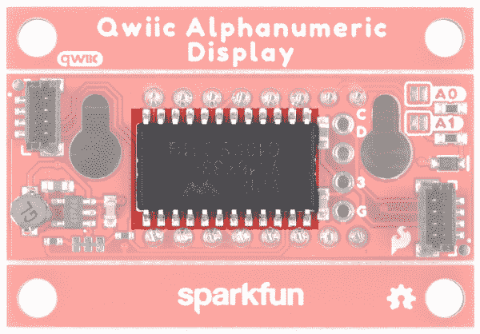
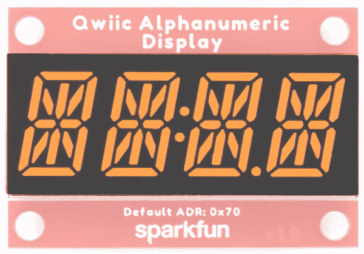

# SparkFun Qwiic 字母数字显示器连接指南

> 原文：<https://learn.sparkfun.com/tutorials/sparkfun-qwiic-alphanumeric-display-hookup-guide>

## 介绍

七段显示器太 2020 了。我是说，我们每天都能在钟表、烤箱和微波炉里看到它们。但是当你在每个数字上增加更多的线段时会发生什么呢？你可以升级你的电器，让每个人都知道你的真实感受。介绍 SparkFun 最新的 Qwiic 字母数字显示屏，有[粉色](https://www.sparkfun.com/products/16919)、[绿色](https://www.sparkfun.com/products/18566)、[蓝色](https://www.sparkfun.com/products/16917)、[红色](https://www.sparkfun.com/products/16916)、[紫色](https://www.sparkfun.com/products/16918)和[白色](https://www.sparkfun.com/products/18565)。定制微波警报-“你食物做好了，傻瓜！”或者黑掉那些烤箱信息——“我可怜那个不会预热的傻瓜！”这些 14 段数字允许您显示各种数字、字符和符号。让我们跳进去看看，好吗？

[](https://www.sparkfun.com/products/16919) 

将**添加到您的[购物车](https://www.sparkfun.com/cart)中！**

 **### [SparkFun Qwiic 字母数字显示器-粉色](https://www.sparkfun.com/products/16919)

[In stock](https://learn.sparkfun.com/static/bubbles/ "in stock") COM-16919

粉色 SparkFun Qwiic 字母数字显示器允许您显示各种数字、字符和符号。有了 Qwiic，…

$9.95[Favorited Favorite](# "Add to favorites") 3[Wish List](# "Add to wish list")****[](https://www.sparkfun.com/products/18566) 

将**添加到您的[购物车](https://www.sparkfun.com/cart)中！**

 **### [SparkFun Qwiic 字母数字显示器-绿色](https://www.sparkfun.com/products/18566)

[In stock](https://learn.sparkfun.com/static/bubbles/ "in stock") COM-18566

绿色 SparkFun Qwiic 字母数字显示器允许您显示各种数字、字符和符号。有了 Qwiic…

$9.953[Favorited Favorite](# "Add to favorites") 6[Wish List](# "Add to wish list")****[](https://www.sparkfun.com/products/16917) 

将**添加到您的[购物车](https://www.sparkfun.com/cart)中！**

 **### [SparkFun Qwiic 字母数字显示器-蓝色](https://www.sparkfun.com/products/16917)

[In stock](https://learn.sparkfun.com/static/bubbles/ "in stock") COM-16917

蓝色 SparkFun Qwiic 字母数字显示器允许您显示各种数字、字符和符号。有了 Qwiic，…

$9.951[Favorited Favorite](# "Add to favorites") 3[Wish List](# "Add to wish list")************[](https://www.sparkfun.com/products/16916) 

将**添加到您的[购物车](https://www.sparkfun.com/cart)中！**

 **### [SparkFun Qwiic 字母数字显示-红色](https://www.sparkfun.com/products/16916)

[In stock](https://learn.sparkfun.com/static/bubbles/ "in stock") COM-16916

红色 SparkFun Qwiic 字母数字显示器允许您显示各种数字、字符和符号。有了 Qwiic，…

$9.95[Favorited Favorite](# "Add to favorites") 2[Wish List](# "Add to wish list")****[](https://www.sparkfun.com/products/16918) 

将**添加到您的[购物车](https://www.sparkfun.com/cart)中！**

 **### [SparkFun Qwiic 字母数字显示器-紫色](https://www.sparkfun.com/products/16918)

[28 available](https://learn.sparkfun.com/static/bubbles/ "28 available") COM-16918

紫色 SparkFun Qwiic 字母数字显示器允许您显示各种数字、字符和符号。有了 Qwii…

$9.95[Favorited Favorite](# "Add to favorites") 4[Wish List](# "Add to wish list")****[](https://www.sparkfun.com/products/18565) 

将**添加到您的[购物车](https://www.sparkfun.com/cart)中！**

 **### [SparkFun Qwiic 字母数字显示器-白色](https://www.sparkfun.com/products/18565)

[Only 11 left!](https://learn.sparkfun.com/static/bubbles/ "only 11 left!") COM-18565

白色 SparkFun Qwiic 字母数字显示器允许您显示各种数字、字符和符号。有了 Qwiic…

$9.951[Favorited Favorite](# "Add to favorites") 2[Wish List](# "Add to wish list")****** ******[https://www.youtube.com/embed/qhpRGrULrqg/?autohide=1&border=0&wmode=opaque&enablejsapi=1](https://www.youtube.com/embed/qhpRGrULrqg/?autohide=1&border=0&wmode=opaque&enablejsapi=1)

**Note:** We also have two kits with the Qwiic Alphanumeric Displays and Qwiic cables available for purchase.

[](https://www.sparkfun.com/products/19297) 

将**添加到您的[购物车](https://www.sparkfun.com/cart)中！**

 **### [SparkFun Qwiic 字母数字显示套件](https://www.sparkfun.com/products/19297)

[Only 10 left!](https://learn.sparkfun.com/static/bubbles/ "only 10 left!") KIT-19297

SparkFun Qwiic 字母数字显示器套件带有六种不同颜色的 14 段 Qwiic 显示器。这是你的全部…

$54.95[Favorited Favorite](# "Add to favorites") 4[Wish List](# "Add to wish list")****[](https://www.sparkfun.com/products/18624) 

将**添加到您的[购物车](https://www.sparkfun.com/cart)中！**

 **### [SparkFun Qwiic 字母数字入门套件——红白](https://www.sparkfun.com/products/18624)

[In stock](https://learn.sparkfun.com/static/bubbles/ "in stock") KIT-18624

SparkFun Qwiic 字母数字初学者工具包带有两个显示器，一个红色，一个白色，支架和安装螺钉…

$22.95[Favorited Favorite](# "Add to favorites") 3[Wish List](# "Add to wish list")**** ****### 所需材料

你需要一个微控制器来控制 Qwiic 字母数字显示器，以便跟随本教程。以下是一些开箱即用的 Qwiic 选项:

[](https://www.sparkfun.com/products/15663) 

将**添加到您的[购物车](https://www.sparkfun.com/cart)中！**

 **### [【spark fun Thing Plus-ESP32 WROOM(微-B)](https://www.sparkfun.com/products/15663)

[Out of stock](https://learn.sparkfun.com/static/bubbles/ "out of stock") WRL-15663

SparkFun ESP32 Thing Plus 是开始使用 Espressif 物联网概念的下一步，同时还可以享受所有的便利设施

$22.5010[Favorited Favorite](# "Add to favorites") 48[Wish List](# "Add to wish list")****[](https://www.sparkfun.com/products/15795) 

将**添加到您的[购物车](https://www.sparkfun.com/cart)中！**

 **### [【spark fun Qwiic Pro Micro-USB-C(atmega 32 u 4)](https://www.sparkfun.com/products/15795)

[In stock](https://learn.sparkfun.com/static/bubbles/ "in stock") DEV-15795

SparkFun Qwiic Pro Micro 在小型化的 Arduino bo 上增加了一个重置按钮、Qwiic 连接器、USB-C 和齿形垫…

$21.507[Favorited Favorite](# "Add to favorites") 46[Wish List](# "Add to wish list")****[](https://www.sparkfun.com/products/15123) 

将**添加到您的[购物车](https://www.sparkfun.com/cart)中！**

 **### [spark fun RedBoard Qwiic](https://www.sparkfun.com/products/15123)

[In stock](https://learn.sparkfun.com/static/bubbles/ "in stock") DEV-15123

SparkFun RedBoard Qwiic 是一款 Arduino 兼容开发板，内置 Qwiic 连接器，无需…

$21.5014[Favorited Favorite](# "Add to favorites") 49[Wish List](# "Add to wish list")****[](https://www.sparkfun.com/products/15444) 

将**添加到您的[购物车](https://www.sparkfun.com/cart)中！**

 **### [SparkFun RedBoard Artemis](https://www.sparkfun.com/products/15444)

[In stock](https://learn.sparkfun.com/static/bubbles/ "in stock") DEV-15444

RedBoard Artemis 采用 SparkFun 的功能强大的 Artemis 模块，并将其包装在一个易于使用和熟悉的环境中…

$21.509[Favorited Favorite](# "Add to favorites") 32[Wish List](# "Add to wish list")******** ********如果您选择的微控制器尚未启用 Qwiic，您可以添加以下一项或多项功能:

[](https://www.sparkfun.com/products/14495) 

将**添加到您的[购物车](https://www.sparkfun.com/cart)中！**

 **### [SparkFun Qwiic 适配器](https://www.sparkfun.com/products/14495)

[In stock](https://learn.sparkfun.com/static/bubbles/ "in stock") DEV-14495

SparkFun Qwiic 适配器提供了将任何旧 I ² C 板改造成支持 Qwiic 的板的完美方法。

$1.601[Favorited Favorite](# "Add to favorites") 53[Wish List](# "Add to wish list")****[](https://www.sparkfun.com/products/14352) 

将**添加到您的[购物车](https://www.sparkfun.com/cart)中！**

 **### [ArduinoT3 的 SparkFun Qwiic 盾](https://www.sparkfun.com/products/14352)

[In stock](https://learn.sparkfun.com/static/bubbles/ "in stock") DEV-14352

SparkFun Qwiic Shield 是一种易于组装的板，它提供了一种简单的方法来将 Qwiic Connect 系统与

$7.508[Favorited Favorite](# "Add to favorites") 39[Wish List](# "Add to wish list")**** ****您还需要至少一根 Qwiic 电缆将您的字母数字显示器连接到您的微控制器。

[](https://www.sparkfun.com/products/14427) 

将**添加到您的[购物车](https://www.sparkfun.com/cart)中！**

 **### [Qwiic 线缆- 100mm](https://www.sparkfun.com/products/14427)

[In stock](https://learn.sparkfun.com/static/bubbles/ "in stock") PRT-14427

这是一条 100 毫米长的 4 芯电缆，带有 1 毫米 JST 端接。它旨在将支持 Qwiic 的组件连接在一起…

$1.50[Favorited Favorite](# "Add to favorites") 32[Wish List](# "Add to wish list")****[](https://www.sparkfun.com/products/14429) 

将**添加到您的[购物车](https://www.sparkfun.com/cart)中！**

 **### [Qwiic 线缆- 500mm](https://www.sparkfun.com/products/14429)

[In stock](https://learn.sparkfun.com/static/bubbles/ "in stock") PRT-14429

这是一根 500mm 长的 4 芯电缆，带有 1mm JST 端接。它旨在将支持 Qwiic 的组件连接在一起…

$1.951[Favorited Favorite](# "Add to favorites") 25[Wish List](# "Add to wish list")****[](https://www.sparkfun.com/products/14426) 

将**添加到您的[购物车](https://www.sparkfun.com/cart)中！**

 **### [Qwiic 线缆- 50mm](https://www.sparkfun.com/products/14426)

[In stock](https://learn.sparkfun.com/static/bubbles/ "in stock") PRT-14426

这是一根 50 毫米长的 4 芯电缆，带有 1 毫米 JST 端接。它旨在将支持 Qwiic 的组件连接在一起…

$0.95[Favorited Favorite](# "Add to favorites") 29[Wish List](# "Add to wish list")****[](https://www.sparkfun.com/products/14428) 

### [Qwiic 线缆- 200mm](https://www.sparkfun.com/products/14428)

[Out of stock](https://learn.sparkfun.com/static/bubbles/ "out of stock") PRT-14428

这是一根 200 毫米长的 4 芯电缆，带有 1 毫米 JST 端接。它旨在将支持 Qwiic 的组件连接在一起…

[Favorited Favorite](# "Add to favorites") 21[Wish List](# "Add to wish list")****** ******### 推荐阅读

如果您不熟悉 Qwiic 系统，我们建议您阅读此处的概述:

| [](https://www.sparkfun.com/qwiic) |

如果您不熟悉以下教程中的概念，我们还建议您通读这些教程:

[](https://learn.sparkfun.com/tutorials/serial-communication) [### 串行通信](https://learn.sparkfun.com/tutorials/serial-communication) Asynchronous serial communication concepts: packets, signal levels, baud rates, UARTs and more 100[](https://learn.sparkfun.com/tutorials/i2c) [### I2C](https://learn.sparkfun.com/tutorials/i2c) An introduction to I2C, one of the main embedded communications protocols in use today.[Favorited Favorite](# "Add to favorites") 128

## 硬件概述

正如介绍中提到的，Qwiic 字母数字显示器使用 VK16K33 LED 驱动芯片来控制各段。在指南的这一部分，我们将更详细地介绍 LED 驱动器和显示器，以及电路板上的其它元件。

### VK16K33 LED 驱动器

Qwiic 字母数字显示板使用 VK16K33 LED 驱动芯片来控制各段。VK16K33 是一个内存映射和多功能 LED 控制器驱动器，最大显示段数为 128 个模式(16 个段和 8 个公共段)和一个 13×3 矩阵按键扫描电路。还有一个集成的 RC 振荡器和 16 级调光电路。更多信息可在 [VK16K33 数据表](https://cdn.sparkfun.com/assets/c/8/7/2/5/VK16K33Datasheet.pdf)中找到。

[](https://cdn.sparkfun.com/assets/learn_tutorials/1/2/0/9/16919-SparkFun-Qwiic-Alphanumeric-Display_HT16K33.jpg)

### 字母数字显示器

看看那些准备好展示(几乎)你内心所渴望的一切的美丽片段吧！

[](https://cdn.sparkfun.com/assets/learn_tutorials/1/2/0/9/16919-SparkFun-Qwiic-Alphanumeric-Display_DisplayScreen.jpg)

### Qwiic

我们的 Qwiic 生态系统让传感器变得即插即用。字母数字显示板的两侧有两个 Qwiic 连接器，可同时提供电源和 I ² C 连接。

板卡默认的 I ² C 地址为 **0x70** 。其他地址可用-参见下面的*跳线*部分。

[](https://cdn.sparkfun.com/assets/learn_tutorials/1/2/0/9/16919-SparkFun-Qwiic-Alphanumeric-Display_Qwiic.jpg)

### I ² C 地址跳线

提供了两个跳线，允许您选择外设的 I ² C 地址。有关配置的详细信息，请参见下表。

[](https://cdn.sparkfun.com/assets/learn_tutorials/1/2/0/9/16919-SparkFun-Qwiic-Alphanumeric-Display_Bothjumpers.jpg)

| 地址 | A0 | 一流的 |
| 0x70 | 打开 | 打开 |
| 0x71 | 关闭的 | 打开 |
| 0x72 | 打开 | 关闭的 |
| 0x73 | 关闭的 | 关闭的 |

### I ² C 总线电阻器跳线

Qwiic 字母数字显示分线点具有板载 I ² C 上拉电阻；如果多个传感器连接到总线并使能上拉电阻，并联等效电阻将产生过强的上拉电阻，使总线无法正常工作。一般来说，如果总线上连接了多个器件，则除一对上拉电阻外，应禁用所有上拉电阻。如果需要断开上拉电阻，可以通过切断下面突出显示的相应跳线上的走线来移除。

[](https://cdn.sparkfun.com/assets/learn_tutorials/1/2/0/9/16919-SparkFun-Qwiic-Alphanumeric-Display_I2CJumper.jpg)

### I ² C 引脚

如果你有疯狂的焊接技能，并且真的想使用 I ² C 引脚，我们为你准备了这些坏男孩。检查一下:

*   **C**——SCL
*   **D** - SDA
*   3 - 3.3V
*   **克**——GND

[](https://cdn.sparkfun.com/assets/learn_tutorials/1/2/0/9/16919-SparkFun-Qwiic-Alphanumeric-Display_I2CPins.jpg)

### 电路板轮廓

每个字母数字显示分线板的尺寸为 1.6 英寸 x 1.1 英寸。

[](https://cdn.sparkfun.com/assets/learn_tutorials/1/2/0/9/16919-SparkFun-Qwiic-Alphanumeric-Display_BoardOutline.png)

## 硬件连接

使用 Qwiic 系统，组装硬件轻而易举。您所需要做的就是用 Qwiic 电缆或[适配器电缆](https://www.sparkfun.com/products/14425)将 SparkFun Qwiic 字母数字显示器连接到您选择的开发板。

[](https://cdn.sparkfun.com/assets/learn_tutorials/1/2/0/9/Alphanumeric_Hookup_Guide-09.jpg)

如果您决定使用显示器上断开的 PTH 引脚，您将需要[焊接](https://learn.sparkfun.com/tutorials/how-to-solder-through-hole-soldering)一些接头。如果你不熟悉通孔焊接，看看这个教程:

[](https://learn.sparkfun.com/tutorials/how-to-solder-through-hole-soldering) [### 如何焊接:通孔焊接

#### 2013 年 9 月 19 日](https://learn.sparkfun.com/tutorials/how-to-solder-through-hole-soldering) This tutorial covers everything you need to know about through-hole soldering.[Favorited Favorite](# "Add to favorites") 70[](https://cdn.sparkfun.com/assets/learn_tutorials/1/2/0/9/Alphanumeric_Hookup_Guide-10.jpg)

显示器连接到您的微控制器后，是时候开始使用 SparkFun 字母数字显示库了！

## 字母数字显示 Arduino 库

**Note:** Make sure you are using the latest stable version of the Arduino IDE on your desktop. If this is your first time using Arduino IDE, library, or board add-on, please review the following tutorials.

*   [安装 Arduino IDE](https://learn.sparkfun.com/tutorials/installing-arduino-ide)
*   [安装 Arduino 库](https://learn.sparkfun.com/tutorials/installing-an-arduino-library)
*   [在 Arduino IDE 中安装板卡定义](https://learn.sparkfun.com/tutorials/installing-board-definitions-in-the-arduino-ide)

在我们开始之前，我们需要下载并安装 SparkFun 的字母数字显示 Arduino 库。您可以使用 Arduino 库管理器，通过搜索“ **SparkFun 字母数字显示器**”来自动安装。或者您可以下载该库并使用下面的按钮安装它。

[Download the SparkFun Alphanumeric Display Arduino Library (ZIP)](https://github.com/sparkfun/SparkFun_Alphanumeric_Display_Arduino_Library/archive/refs/heads/master.zip)

在我们开始开发草图之前，让我们看看这个库的可用功能。

*   `bool setBrightness(uint8_t duty);` -设置所有单元的亮度
*   `setBrightnessSingle(uint8_t displayNumber, uint8_t duty);` -设置单个单元的亮度
*   `setBlinkRate(float rate);` -设置所有单元的刷新率。
*   `setBlinkRateSingle(uint8_t displayNumber, float rate);` -设置单台设备的刷新率
*   `displayOn();` -打开所有显示单元
*   `displayOff();` -关闭所有显示单元
*   `displayOnSingle(uint8_t displayNumber);` -打开单个显示单元
*   `displayOffSingle(uint8_t displayNumber);` -关闭单个显示单元
*   `setDisplayOnOff(uint8_t displayNumber, bool turnOnDisplay);` -设置或清除显示开/关位
*   `enableSystemClock();` -打开 I2C 总线上所有显示器的系统振荡器
*   `disableSystemClock();` -关闭总线上所有显示器的系统振荡器
*   `enableSystemClockSingle(uint8_t displayNumber);` -开启正常运行模式的系统振荡器
*   `disableSystemClockSingle(uint8_t displayNumber);` -关闭系统振荡器，进入待机模式
*   `illuminateSegment(uint8_t segment, uint8_t digit);` -给定一个段和一个数字，在 Holtek RAM 组的 RAM 内设置匹配位
*   `illuminateChar(uint16_t disp, uint8_t digit);` -给定一组二进制段和一个数字，将该数据存储到 RAM 阵列中
*   `printChar(uint8_t displayChar, uint8_t digit);` -在显示器上打印给定数字的字符
*   `updateDisplay();` -将 displayRAM 的内容以 16 字节块的形式推送到各个显示器
*   `defineChar(uint8_t displayChar, uint16_t segmentsToTurnOn);` -更新列表，为特定字符定义新的分段显示
*   `getSegmentsToTurnOn (uint8_t charPos);` -从定义列表或默认表中获取字符映射表
*   `decimalOn();` -打开总线上所有显示器的十进制显示
*   `decimalOff();` -关闭总线上所有显示的小数
*   `decimalOnSingle(uint8_t displayNumber);` -打开单次显示的小数点
*   `decimalOffSingle(uint8_t displayNumber);` -关闭单次显示的小数点
*   `setDecimalOnOff(uint8_t displayNumber, bool turnOnDecimal);` -设置或清除十进制开/关位
*   `colonOn();` -打开总线上所有显示器的冒号
*   `colonOff();` -关闭总线上所有显示器的冒号
*   `colonOnSingle(uint8_t displayNumber);` -打开冒号进行单次显示
*   `colonOffSingle(uint8_t displayNumber);` -关闭单次显示的冒号
*   `setColonOnOff(uint8_t displayNumber, bool turnOnColon);` -设置或清除冒号开/关位
*   `shiftRight(uint8_t shiftAmt = 1);` -将显示内容向右移动一位
*   `shiftLeft(uint8_t shiftAmt = 1);` -将显示内容左移一位

## Arduino 示例-基础

现在我们已经安装了我们的库，我们准备运行一些例子。该库目前提供了一套 10 个示例来帮助您开始学习。我们来看前面几个例子！

### 示例 _ 01 _ 打印字符串

一旦库安装完毕，继续打开**文件** - > **示例** - > **SparkFun Qwiic 字母数字显示库** - > **示例 _01_PrintString** 。

或者，您可以将下面的代码复制并粘贴到一个崭新的 Arduino 文件中:

```
 language:c
/*****************************************************************************************
 * This example tests illuminating whole 4 letter strings on the 14-segment display.
 * 
 * Priyanka Makin @ SparkFun Electronics
 * Original Creation Date: February 3, 2020
 * 
 * SparkFun labored with love to create this code. Feel like supporting open source hardware?
 * Buy a board from SparkFun! https://www.sparkfun.com/products/16391
 * 
 * This code is Lemonadeware; if you see me (or any other SparkFun employee) at the 
 * local, and you've found our code helpful, please buy us a round!
 * 
 * Hardware Connections:
 * Attach Red Board to computer using micro-B USB cable.
 * Attach Qwiic Alphanumeric board to Red Board using Qwiic cable.
 * 
 * Distributed as-is; no warranty is given.
 ****************************************************************************************/
#include <Wire.h>

#include <SparkFun_Alphanumeric_Display.h> //Click here to get the library: http://librarymanager/All#SparkFun_Qwiic_Alphanumeric_Display by SparkFun
HT16K33 display;

void setup()
{
  Serial.begin(115200);
  Serial.println("SparkFun Qwiic Alphanumeric - Example 1: Print String");

  Wire.begin(); //Join I2C bus

  if (display.begin() == false)
  {
    Serial.println("Device did not acknowledge! Freezing.");
    while (1);
  }
  Serial.println("Display acknowledged.");

  display.print("Milk");
}

void loop()
{
} 
```

一旦你有了代码，确保你选择了正确的端口，然后点击上传按钮。如果一切顺利，你会看到你的显示屏上亮起“牛奶”！

[](https://cdn.sparkfun.com/assets/learn_tutorials/1/2/0/9/Alphanumeric_Hookup_Guide-02.jpg)

### 示例 _ 02 _ TurnOnOneSegment

这个例子点亮了显示器上的一个单独的段。迎面回到你的文件菜单，打开**文件** - > **示例** - > **SparkFun Qwiic 字母数字显示库** - > **示例 _ 02 _ turnonesegment**。

或者，您可以将下面的代码复制并粘贴到一个崭新的 Arduino 文件中:

```
language:c
/*******************************************************************************************
 * This example tests illuminating individual segments of the display. Pass in the segment
 * and digit you wish to illuminate to illuminateSegement().
 * 
 * Priyanka Makin @ SparkFun Electronics
 * Original Creation Date: January 31, 2020
 * 
 * SparkFun labored with love to create this code. Feel like supporting open source hardware?
 * Buy a board from SparkFun! https://www.sparkfun.com/products/16391
 * 
 * This code is Lemonadeware; if you see me (or any other SparkFun employee) at the 
 * local, and you've found our code helpful, please buy us a round!
 * 
 * Hardware Connections:
 * Attach Red Board to computer using micro-B USB cable.
 * Attach Qwiic Alphanumeric board to Red Board using Qwiic cable.
 * 
 * Distributed as-is; no warranty is given.
 *****************************************************************************************/
#include <Wire.h>

#include <SparkFun_Alphanumeric_Display.h>  //Click here to get the library: http://librarymanager/All#SparkFun_Qwiic_Alphanumeric_Display by SparkFun
HT16K33 display;

void setup()
{
  Serial.begin(115200);
  Serial.println("SparkFun Qwiic Alphanumeric - Example 2: Turn On One Segment");
  Wire.begin(); //Join I2C bus

  //check if display will acknowledge
  if (display.begin() == false)
  {
    Serial.println("Device did not acknowledge! Freezing.");
    while(1);
  }
  Serial.println("Display acknowledged.");

  display.illuminateSegment('A', 0);
  display.illuminateSegment('L', 1);
  display.illuminateSegment('I', 2);
  display.illuminateSegment('G', 3);
  display.updateDisplay();
}

void loop()
{
} 
```

和以前一样，一旦你有了代码，确保你选择了正确的端口，然后点击上传按钮。你不需要你的串行监视器，除非你想要它。如果一切顺利，您应该会看到显示器像这样亮起:

[](https://cdn.sparkfun.com/assets/learn_tutorials/1/2/0/9/Alphanumeric_Hookup_Guide-03.jpg)

它看起来很奇怪，但它是每个字母的一部分。

### 示例 _03_PrintChar

让我们打印一些东西！通过前往**文件** - > **抓取示例 3**->**spark fun Qwiic 字母数字显示库**->**Example _ 03 _ print char**。

或者，您可以将下面的代码复制并粘贴到一个崭新的 Arduino 文件中:

```
language:c
/*****************************************************************************************
 * This example tests illuminating whole characters on the 14-segment display.
 * 
 * Priyanka Makin @ SparkFun Electronics
 * Original Creation Date: February 3, 2020
 * 
 * SparkFun labored with love to create this code. Feel like supporting open source hardware?
 * Buy a board from SparkFun! https://www.sparkfun.com/products/16391
 * 
 * This code is Lemonadeware; if you see me (or any other SparkFun employee) at the
 * local, and you've found our code helpful, please buy us a round!
 * 
 * Hardware Connections:
 * Attach Red Board to computer using micro-B USB cable.
 * Attach Qwiic Alphanumeric board to Red Board using Qwiic cable.
 * 
 * Distributed as-is; no warranty is given.
 *****************************************************************************************/
#include <Wire.h>

#include <SparkFun_Alphanumeric_Display.h>  //Click here to get the library: http://librarymanager/All#SparkFun_Qwiic_Alphanumeric_Display by SparkFun
HT16K33 display;

void setup()
{
  Serial.begin(115200);
  Serial.println("SparkFun Qwiic Alphanumeric - Example 3: Print Character");
  Wire.begin(); //Join I2C bus

  //check if display will acknowledge
  if (display.begin() == false)
  {
    Serial.println("Device did not acknowledge! Freezing.");
    while(1);
  }
  Serial.println("Display acknowledged.");

  display.printChar('W', 0);
  display.printChar('H', 1);
  display.printChar('A', 2);
  display.printChar('T', 3);

  display.updateDisplay();
}

void loop(){
} 
```

检查您的端口，然后点击上传按钮。瞧啊。你开始明白了吗？

[](https://cdn.sparkfun.com/assets/learn_tutorials/1/2/0/9/Alphanumeric_Hookup_Guide-04.jpg)

这仅仅是个开始——还有更多例子可以让你使用 SparkFun Qwiic 字母数字显示器。我们不会在这里一一讨论，但是可以随意修改这些，看看你能想出什么来！

如果您尚未下载该库，请点击此处或点击下面的链接获得它！

[Download the SparkFun Alphanumeric Display Arduino Library (ZIP)](https://github.com/sparkfun/SparkFun_Alphanumeric_Display_Arduino_Library/archive/refs/heads/master.zip)

## Arduino 示例-有趣的东西

好吧。你已经完成了基本的工作-你可以点亮片段，对吗？现在让我们做一些有趣的事情！

### 示例 _ 08 _ 多显示器

本示例测试多台显示器之间的打印。为了让这个例子生效，你需要在电路板背面的跳线上做一些[焊接](https://learn.sparkfun.com/tutorials/how-to-solder-through-hole-soldering)。在本例中，我们将使用 0x70 和 0x71 作为地址，因此第二台显示器的跳线应该如下所示:

[](https://cdn.sparkfun.com/assets/learn_tutorials/1/2/0/9/16919-SparkFun-Qwiic-Alphanumeric-Display_Bothjumpers-A0Soldered.jpg)

一旦你的跳线被焊接，继续用你的 [Qwiic 电缆](https://www.sparkfun.com/categories/tags/qwiic-cables)把你的板钩在一起，然后把它们插到你的 RedBoard 上。

[](https://cdn.sparkfun.com/assets/learn_tutorials/1/2/0/9/Alphanumeric_Hookup_Guide-08.jpg)

一旦你的硬件准备就绪，回到你的文件菜单，打开**文件** - > **示例** - > **SparkFun Qwiic 字母数字显示库** - > **示例 _ 08 _ 多显示**。

或者，您可以将下面的代码复制并粘贴到一个崭新的 Arduino 文件中:

```
language:c
/**************************************************************************************
 * This example tests printing across multiple alpha displays.
 * 
 * Priyanka Makin @ SparkFun Electronics
 * Original Creation Date: February 26, 2020
 * 
 * SparkFun labored with love to create this code. Feel like supporting open source hardware?
 * Buy a board from SparkFun! https://www.sparkfun.com/products/16391
 * 
 * This code is Lemonadeware; if you see me (or any other SparkFun employee) at the
 * local, and you've found our code helpful, please buy us a round!
 * 
 * Hardware Connections:
 * Attach Red Board to computer using micro-B USB cable.
 * Attach Qwiic Alphanumeric board to Red Board using Qwiic cable. 
 *  Don't close any of the address jumpers so that it defaults to address 0x70.
 * Attach a second Alphanumeric display using Qwiic cable.
 *  Close address jumper A0 so that this display's address become 0x71.
 * 
 * Distributed as-is; no warranty is given.
 *****************************************************************************************/
#include <Wire.h>

#include <SparkFun_Alphanumeric_Display.h>  //Click here to get the library: http://librarymanager/All#SparkFun_Qwiic_Alphanumeric_Display by SparkFun
HT16K33 display;

void setup() {
  Serial.begin(115200);
  Serial.println("SparkFun Qwiic Alphanumeric - Example 8: Multi Display");
  Wire.begin(); //Join I2C bus

  //check if displays will acknowledge
  //The first address in the begin() function should be the left-most display, traveling to the right from there
  //This is how the string will print across displays, reading from left to right.
  if (display.begin(0x70, 0x71) == false)
  {
    Serial.println("Device did not acknowledge! Freezing.");
    while(1);
  }
  Serial.println("Displays acknowledged.");

  display.print("Get Milk");
}

void loop() 
{
} 
```

一旦你得到了你的代码，确保你选择了正确的端口，然后点击上传按钮。您应该看到以下内容:

[](https://cdn.sparkfun.com/assets/learn_tutorials/1/2/0/9/Alphanumeric_Hookup_Guide-01.jpg)

### 示例 _09_ScrollingString

这个例子滚动了！让我们从用你方便的优质电缆将你的字母数字板插入你的 RedBoard 开始。

一旦你的硬件准备就绪，回到你的文件菜单，打开**文件** - > **示例** - > **SparkFun Qwiic 字母数字显示库** - > **示例 _09_ScrollingString** 。

或者，您可以将下面的代码复制并粘贴到一个崭新的 Arduino 文件中:

```
language:c
/**************************************************************************************
 * This example tests scrolling functionality of alphanumeric displays.
 * 
 * Priyanka Makin @ SparkFun Electronics
 * Original Creation Date: February 26, 2020
 * 
 * SparkFun labored with love to create this code. Feel like supporting open source hardware?
 * Buy a board from SparkFun! https://www.sparkfun.com/products/16391
 * 
 * This code is Lemonadeware; if you see me (or any other SparkFun employee) at the
 * local, and you've found our code helpful, please buy us a round!
 * 
 * Hardware Connections:
 * Attach Red Board to computer using micro-B USB cable.
 * Attach Qwiic Alphanumeric board to Red Board using Qwiic cable. 
 *  Don't close any of the address jumpers so that it defaults to address 0x70.
 * Attach a second Alphanumeric display using Qwiic cable.
 *  Close address jumper A0 so that this display's address become 0x71.
 * 
 * Distributed as-is; no warranty is given.
 *****************************************************************************************/
#include <Wire.h>

#include <SparkFun_Alphanumeric_Display.h>  //Click here to get the library: http://librarymanager/All#SparkFun_Qwiic_Alphanumeric_Display by SparkFun
HT16K33 display;

void setup() {
  Serial.begin(115200);
  Serial.println("SparkFun Qwiic Alphanumeric - Example 9: Scrolling String");
  Wire.begin(); //Join I2C bus

  //check if displays will acknowledge
  if (display.begin(0x70) == false)
  {
    Serial.println("Device did not acknowledge! Freezing.");
    while(1);
  }
  Serial.println("Display acknowledged.");

  display.print("MILK");
}

void loop() 
{  
  delay(300);
  display.shiftLeft();
  //Alternatively - you could also shift the string to the right
  //display.shiftRight();
} 
```

一旦你得到了你的代码，确保你选择了正确的端口，然后点击上传按钮。您应该看到以下内容:

[](https://cdn.sparkfun.com/assets/learn_tutorials/1/2/0/9/Alphanumeric_Disply.gif)

## 解决纷争

**Not working as expected and need help?**

If you need technical assistance and more information on a product that is not working as you expected, we recommend heading on over to the [SparkFun Technical Assistance](https://www.sparkfun.com/technical_assistance) page for some initial troubleshooting.

[SparkFun Technical Assistance Page](https://www.sparkfun.com/technical_assistance)

If you don't find what you need there, the [SparkFun Forums](https://forum.sparkfun.com/index.php) are a great place to find and ask for help. If this is your first visit, you'll need to [create a Forum Account](https://forum.sparkfun.com/ucp.php?mode=register) to search product forums and post questions.

[Create New Forum Account](https://forum.sparkfun.com/ucp.php?mode=register)   [Log Into SparkFun Forums](https://forum.sparkfun.com/index.php)

## 资源和更进一步

恭喜你！现在你已经让你的字母数字显示器启动并运行，你可以用一些更“傻瓜”的证据来破解那个无聊的老微波信息了！是啊！

如果您想要或需要字母数字显示屏上的信息，请查看下面的一些资源:

*   [示意图](https://cdn.sparkfun.com/assets/c/7/2/8/a/Qwiic_Alphanumeric_Display.pdf)
*   [老鹰档案](https://cdn.sparkfun.com/assets/c/f/f/7/c/Qwiic_Alphanumeric_Display.zip)
*   [电路板尺寸](https://cdn.sparkfun.com/assets/4/a/3/8/3/16919-SparkFun-Qwiic-Alphanumeric-Display_BoardOutline.png)
*   [数据表](https://cdn.sparkfun.com/assets/c/8/7/2/5/VK16K33Datasheet.pdf) (VK16K33)
*   [Qwiic 信息页面](https://www.sparkfun.com/qwiic)
*   [Arduino 库](https://github.com/sparkfun/SparkFun_Alphanumeric_Display_Arduino_Library)
*   [GitHub 硬件回购](https://github.com/sparkfun/Qwiic_Alphanumeric_Display_Breakout)

需要灵感？查看一些与 Qwiic 相关的教程:

[](https://learn.sparkfun.com/tutorials/qwiic-distance-sensor-vl53l1x-vl53l4cd-hookup-guide) [### Qwiic 距离传感器(VL53L1X，VL53L4CD)连接指南](https://learn.sparkfun.com/tutorials/qwiic-distance-sensor-vl53l1x-vl53l4cd-hookup-guide) The Qwiic Distance Sensor - VL53L1X is a time of flight sensor that is capable of several modes, as well as having a range of 4M. It's cousin VL53L4CD is also a time of flight sensor with similar characteristics but it has a range of about 1.3M. Let's hook it up and find out just how far away that thing over there is.[Favorited Favorite](# "Add to favorites") 3[](https://learn.sparkfun.com/tutorials/three-quick-tips-about-using-ufl) [### 关于使用 U.FL 的三个快速提示](https://learn.sparkfun.com/tutorials/three-quick-tips-about-using-ufl) Quick tips regarding how to connect, protect, and disconnect U.FL connectors.[Favorited Favorite](# "Add to favorites") 14[](https://learn.sparkfun.com/tutorials/power-delivery-board---usb-c-qwiic-hookup-guide) [### 配电板- USB-C (Qwiic)连接指南](https://learn.sparkfun.com/tutorials/power-delivery-board---usb-c-qwiic-hookup-guide) This guide will go over how to use the USB Type-C Power Delivery Board.[Favorited Favorite](# "Add to favorites") 4[](https://learn.sparkfun.com/tutorials/sparkfun-environmental-sensor-breakout---bme68x-qwiic-hookup-guide) [### SparkFun 环境传感器分线点- BME68x (Qwiic)连接指南](https://learn.sparkfun.com/tutorials/sparkfun-environmental-sensor-breakout---bme68x-qwiic-hookup-guide) A hookup guide to get started with the BME68x Environmental Sensor from Bosch. Monitor the air quality, temperature, humidity, and barometric pressure with this Qwiic sensor 1

[https://giphy.com/embed/FKtABjMzZD3Ow](https://giphy.com/embed/FKtABjMzZD3Ow)

[](https://giphy.com/gifs/mr-t-FKtABjMzZD3Ow)

[via GIPHY](https://giphy.com/gifs/mr-t-FKtABjMzZD3Ow)[](https://giphy.com/gifs/mr-t-FKtABjMzZD3Ow)**********************************