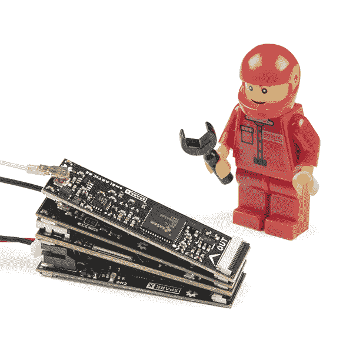
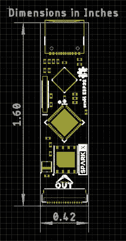
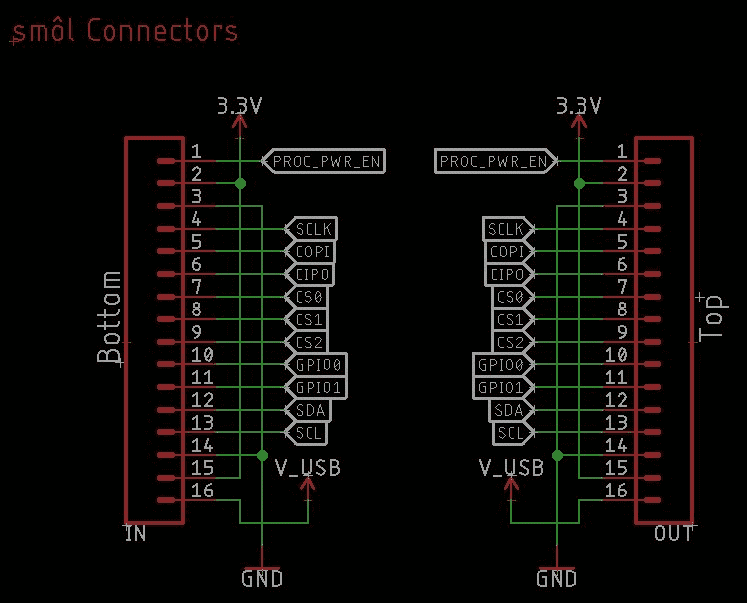
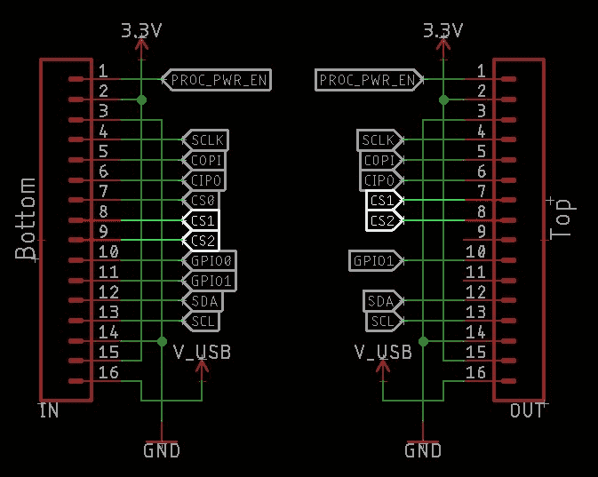
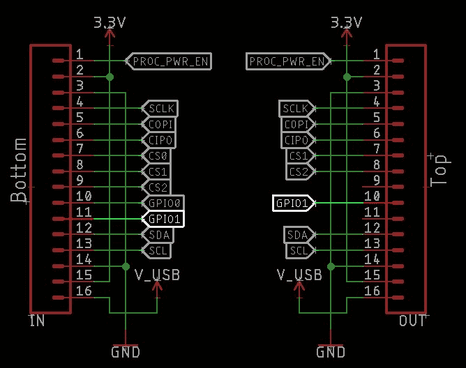
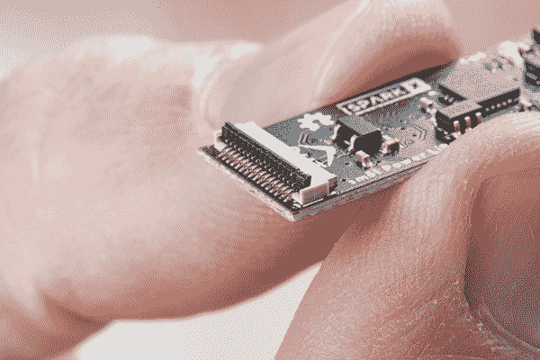
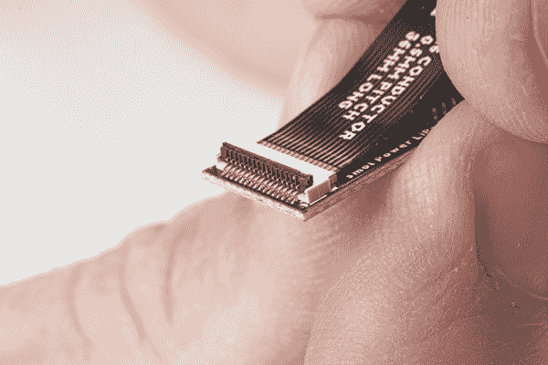
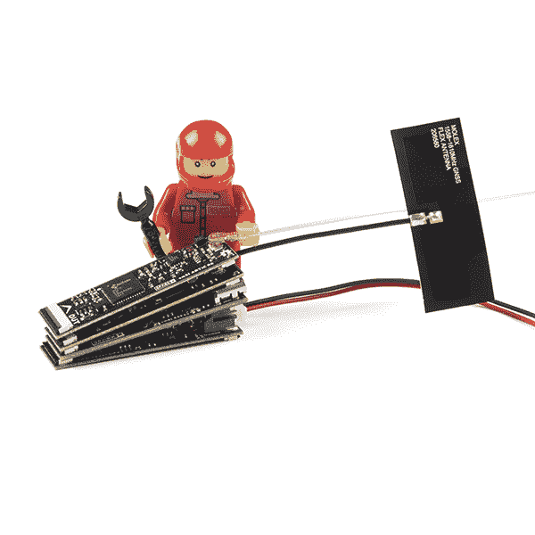
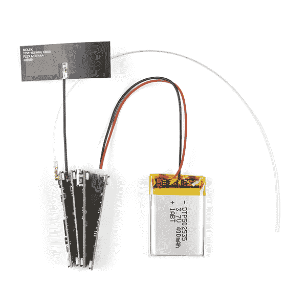
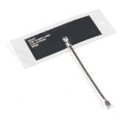

# SML 连接指南

> 原文：<https://learn.sparkfun.com/tutorials/sml-hookup-guide>

## 介绍

我们的红纸板很棒。但是他们有时候不就显得小 ***大*** 了吗？！

进入**smol**，这是一个新的电路板系列，尺寸小，电流消耗小。这是一个小世界！

*Above is a GNSS receiver, a satellite transceiver, and an ESP32 with WiFi and 16MB storage, all running for 100 days off a 400mAh battery.* 😲

当我们设计 ARGOS 卫星收发器防护罩北极 R2 时，我们知道人们会希望将其用于野生动物跟踪、海洋浮标、环境监测或传输紧急医疗信息等应用。但是如果你想开发更小的东西呢？比如说，一个用来追踪鲸鱼的小镖，或者一个用来追踪鸟类的小背包。或者你只是需要你的电池持续几个月。SML 旨在满足这些需求。

上面照片中的堆栈是一个完整的北极 R2 卫星跟踪器，能够使用 400mAh 电池在 100 多天内每天五次向 ARGOS 卫星网络(ARGOS 提供全球覆盖，包括海洋和极地区域)传输 2.5 米精度的定位信息！

SML 系列电路板包括:

### 处理器板

 

将**添加到您的[购物车](https://www.sparkfun.com/cart)中！**

### [smol esp 32](https://www.sparkfun.com/products/18619)

[24 available](https://learn.sparkfun.com/static/bubbles/ "24 available") SPX-18619

我们的红纸板很棒。但是他们有时候是不是显得有点* * _ 大 _**？！进入* * SML * *，这是一个新系列的主板，它…

$17.951[Favorited Favorite](# "Add to favorites") 4[Wish List](# "Add to wish list")** **### 全球导航卫星系统(GPS)板

 

将**添加到您的[购物车](https://www.sparkfun.com/cart)中！**

### [【smol Zoe-m8q](https://www.sparkfun.com/products/18623)

[30 available](https://learn.sparkfun.com/static/bubbles/ "30 available") SPX-18623

我们的红纸板很棒。但是他们有时候是不是显得有点* * _ 大 _**？！进入* * SML * *，这是一个新系列的主板，它…

$39.95[Favorited Favorite](# "Add to favorites") 4[Wish List](# "Add to wish list")** **### 卫星通信板

 

将**添加到您的[购物车](https://www.sparkfun.com/cart)中！**

### [【北极精灵 R2】](https://www.sparkfun.com/products/18618)

[Out of stock](https://learn.sparkfun.com/static/bubbles/ "out of stock") SPX-18618

我们的红纸板很棒。但是他们有时候是不是显得有点* * _ 大 _**？！进入* * SML * *，这是一个新系列的主板，它…

$199.95[Favorited Favorite](# "Add to favorites") 5[Wish List](# "Add to wish list")** **### 配电板

 

将**添加到您的[购物车](https://www.sparkfun.com/cart)中！**

### [SML 电源板脂](https://www.sparkfun.com/products/18622)

[Only 8 left!](https://learn.sparkfun.com/static/bubbles/ "only 8 left!") SPX-18622

我们的红纸板很棒。但是他们有时候是不是显得有点* * _ 大 _**？！进入* * SML * *，这是一个新系列的主板，它…

$17.95[Favorited Favorite](# "Add to favorites") 1[Wish List](# "Add to wish list")**** 

将**添加到您的[购物车](https://www.sparkfun.com/cart)中！**

### [SML 电源板 AAA](https://www.sparkfun.com/products/18621)

[In stock](https://learn.sparkfun.com/static/bubbles/ "in stock") SPX-18621

我们的红纸板很棒。但是他们有时候是不是显得有点* * _ 大 _**？！进入* * SML * *，这是一个新系列的主板，它…

$17.95[Favorited Favorite](# "Add to favorites") 2[Wish List](# "Add to wish list")**** ****### 必需品；要素

 

将**添加到您的[购物车](https://www.sparkfun.com/cart)中！**

### [SML 36mm 16 路柔性印刷电路](https://www.sparkfun.com/products/18731)

[In stock](https://learn.sparkfun.com/static/bubbles/ "in stock") CAB-18731

这是用于互连 SML 板的 36 毫米 16 路 0.5 毫米间距柔性印刷电路。* * * * * * SML * *是一个 ec…

$0.95[Favorited Favorite](# "Add to favorites") 2[Wish List](# "Add to wish list")** **### 配件

 

将**添加到您的[购物车](https://www.sparkfun.com/cart)中！**

### [SML 标题](https://www.sparkfun.com/products/18620)

[Out of stock](https://learn.sparkfun.com/static/bubbles/ "out of stock") SPX-18620

我们的红纸板很棒。但是他们有时候是不是显得有点* * _ 大 _**？！进入* * SML * *，这是一个新系列的主板，它…

$2.95[Favorited Favorite](# "Add to favorites") 2[Wish List](# "Add to wish list")** *** * *

**Skill Level - Competent:** We think smôl is brilliant and we will be releasing more smôl boards over the coming months. We have plans for: environmental monitoring, IMU, RFID, radio and GNSS peripheral boards; plus additional processor boards. However, we recognize that the smôl format is - intentionally - very small and that the FPC connections can be a little bit *fiddly* until you get used to working with them. So, we're recommending smôl for those with **Level 3 (Competent) DIY and Electrical Prototyping skills**:

*   无论是组装套件、破解外壳，还是创建自己的部件；DIY 技能就是知道如何使用工具和相关的技术。
*   如果它需要电源，你需要知道多少，所有的引脚做什么，以及如何连接它。你可能需要参考数据表、原理图，并了解电子产品的来龙去脉。

* * *

## 什么是 smol？

smol 是一种新的主板格式，顾名思义，它们*真的*小！

每个 SML 板的尺寸仅为 1.60 英寸乘 0.42 英寸(40.6 毫米乘 10.7 毫米)。我们把电路板做得足够宽，这样我们就可以在上面挤压 USB-C 和 16 路柔性印刷电路(FPC)连接器。一些电路板在顶层和底层都有元件，这也有助于保持电路板的小型化。

*Having a hard time seeing everything? Click the image for a closer look.*

SML 板设计为一个堆叠在另一个之上，使用 16 路 0.5 毫米间距 FPC 来提供板与板之间的互连。每块板在底层有一个 **IN** FPC 连接器，在顶层有一个 **OUT** FPC 连接器。这些板堆叠成之字形菊花链；信号和电源通过 FPC 从一个电路板上下传递到下一个电路板。

我们还设计了一个[SML 接头](https://www.sparkfun.com/products/18620)，您可以使用它将 SML 堆栈安装在标准试验板或另一个 PCB 上。头部只有一个输出连接器，所以它需要放在堆栈的底部。

连接电路板的顺序很重要，我们将在下一节中讨论。

## FPC 关系

我们喜欢柔性印刷电路(FPC)连接，并在越来越多的产品中使用。

每个 SML 板(除了[接头](https://www.sparkfun.com/products/18620)之外)都带有两个 16 路 FPC 连接器，标记为**输入**和**输出**。输入连接器在每块电路板的底部，输出连接器在顶部。匹配的 FPC 将一块板上的 OUT 连接器连接到下一块板上的 IN 连接器。

如果你想要 SML 板整齐地堆叠在一起，我们的[36 毫米 FPC](https://www.sparkfun.com/products/18731) 是完美的长度。连接器具有“双触点”(顶部和底部触点)，因此无论您从哪个方向插入 FPC，它都会保持接触。

我们希望 SML 板尽可能小，因此我们在 16 个 FPC 连接上的信号上花了很多心思，以尽可能提高它们的效率。连接器的标准引脚排列如下:

| 连接器引脚号 | 信号名称 | 功能 |
| one | 进程 _ 功率 _EN | 处理器电源启用 |
| Two | 3V3 | 3.3V 电源轨 |
| three | GND | 电源接地/ 0V |
| four | SCLK | SPI 时钟 |
| five | 科皮 | SPI 控制器输出外设输入 |
| six | 奇波 | SPI 控制器输入外设输出 |
| seven | CS0 | SPI 片选 0 |
| eight | CS1 | SPI 片选 1 |
| eight | CS2 | SPI 片选 2 |
| Ten | GPIO0 | 通用输入/输出 0 |
| Eleven | GPIO1 | 通用输入/输出 1 |
| Twelve | 国家药品监督管理局 | I ² C 数据 |
| Thirteen | SCL | I ² C 时钟 |
| Fourteen | GND | 电源接地/ 0V |
| Fifteen | 3V3 | 3.3V 电源轨 |
| Sixteen | V_USB | USB 电源轨(5V) |

在我们的 Eagle 示意图上，连接*通常是这样的:*

我们说*“通常”*是因为确切的连接取决于电路板类型。稍后会有更多的介绍。

首先，让我们讨论一下每个引脚的作用:

### 引脚 1: PROC_PWR_EN

处理器电源使能是一个在 SML 堆栈中上下传递的信号。它连接到*处理器板*上的 3.3V 电压调节器的使能引脚。如果 PROC_PWR_EN 被拉高或悬空，处理器板电压调节器将*使能*，并将从 USB-C 产生 3.3V 电压

当您将电源板连接到 smol 堆栈时，PROC_PWR_EN 允许电源板禁用处理器板上的调节器。然后，电源板负责为整个 SML 堆栈产生 3.3V 电源轨。我们这样做有两个原因:防止电源板和处理器板调节器互相争斗；即使连接了 USB，也允许电源板关闭整个 smol 堆栈。

SML 的一个巧妙之处在于，可以指示电源板在预定义的时间内关闭整个堆栈的电源。几十毫秒到几天的断电持续时间是可能的。掉电期间，唯一保持运行的器件是电源板上的 ATtiny 处理器，其功耗通常不到 10 微安。PROC_PWR_EN 允许 SML 避免处理器调节器正常消耗的静态电流。

### 针脚 2 和 15: 3.3V 电源

引脚 2 和 15 将 3.3V 电源在 SML 堆栈中上下传输。3.3V 电源可以由 USB-C 供电的处理器板产生，也可以由我们的电源板产生。

如上所述，电源板可以通过 PROC_PWR_EN 引脚禁用处理器板上的调节器，从而避免相关的静态电流消耗。

### 插脚 3 和 14: GND

引脚 3 和 14 是 smol 电源接地或 0V 引脚。

您会注意到，最高速度的 SML 信号(SPI SCLK 和 I ² C SCL)在 GND 连接附近运行，以最大限度地减少电磁干扰。

### 引脚 4-6: SPI SCLK、COPI 和 CIPO

引脚 4-6 承载[串行外设接口(SPI)](https://learn.sparkfun.com/tutorials/serial-peripheral-interface-spi) 的时钟和数据信号。

处理器板是 SPI 控制器，可以以高数据速率与 smol 外设板通信。

SPI 器件共享公共时钟和数据信号，但需要单独的片选信号。smol 芯片选择信号将在下一段中介绍。

### 引脚 7-9: SPI CS0、CS1 和 CS2

引脚 7-9 是 SML SPI 片选信号，允许最多三个 SPI 外设板连接到 SML 堆栈中。

当将芯片选择线从一个 SML 板链接到下一个 SML 板时，我们使用一种称为*瀑布式*的技术。本指南的 [SPI 芯片选择瀑布](https://learn.sparkfun.com/tutorials/sml-hookup-guide#spi-chip-select-waterfalling)部分对此有完整的描述。

如果您最喜欢的 3.3V SPI 分线板还没有 SML 格式，您可以通过[SML 接头](https://www.sparkfun.com/products/18620)上的分线引脚连接它。

### 引脚 10 和 11: GPIO0 和 GPIO1

引脚 10 和 11 承载两个通用输入/输出信号:GPIO0 和 GPIO1。这些信号通常用作电源控制信号来关断各个外围电路板，同样也是为了尽可能降低电流消耗。

与 SPI 片选信号一样，GPIO0 和 GPIO1 也是瀑布型的。如果外围板使用 GPIO0，那么 GPIO1 会瀑布式地流到板的 OUT 连接器的 GPIO0 上。请参见本指南的 [GPIO 瀑布式](https://learn.sparkfun.com/tutorials/sml-hookup-guide#gpio-waterfalling)部分中对此的完整描述。

### 针脚 12 和 13: I ² C SDA 和 SCL

引脚 12 和 13 承载用于[内部集成电路(I ² C】通信](https://learn.sparkfun.com/tutorials/i2c)的数据和时钟信号。

多个 I ² C 板可以连接到 SML，前提是每个板都有唯一的地址。

如果您最喜欢的 Qwiic 板还没有 SML 格式，您可以通过[SML 接头](https://www.sparkfun.com/products/18620)上的 Qwiic 连接器连接它。

### 引脚 16: V_USB

引脚 16 将 5V 电源从处理器板上的 USB-C 连接器沿 SML 堆栈上下传输。

当 USB-C 连接时，[smol 电源板 LiPo](https://www.sparkfun.com/products/18622) 使用 V_USB 为 LiPo 电池充电。我们将充电电流限制在 100mA，以避免通过单一 V_USB FPC 走线汲取过多电流。

## 引脚编号

只是为了澄清哪一个是引脚 1:

从板的*前*或*顶*看，OUT 连接器的 1 号脚在右边。

当电路板翻转过来时，in 连接器的引脚 1 位于左侧。

## SPI 片选瀑布

SML 允许您将多达三个[串行外设接口(SPI)](https://learn.sparkfun.com/tutorials/serial-peripheral-interface-spi) 外设板连接到堆栈中。

SPI 器件共享公共时钟和数据信号，但需要单独的片选信号。下面是我们如何使用一种称为*瀑布式*的技术连接 SML 上的片选信号。

三个芯片选择信号称为 CS0、CS1 和 CS2。在 ESP32 处理器板上，它们分别连接到 GPIO5、GPIO14 和 GPIO13。在 Arduino 术语中，它们是 D5、D14 和 D15，或者数字引脚 5、14 和 13。

瀑布是一种技术，其中:

*   如果外设板需要 SPI 片选，它将始终使用 IN 连接器的 CS0
*   然后，未使用的芯片选择线 CS1 和 CS2 作为 CS0 和 CS1 被传递到 OUT 连接器

 **让我们看看实际情况。以下是 FPC 在[R2 站](https://www.sparkfun.com/products/18618)的联系方式:

SML ARTIC R2 使用 SPI 通信，因此使用 in 连接器的 CS0(引脚 7)。

CS1(在引脚 8 中)和 CS2(在引脚 9 中)未使用，因此直接连接到 OUT 连接器**，但作为引脚 7 和 8** (不是引脚 8 和 9)。

如果北极 R2 被直接放置在 smol 堆栈中的 ESP32 处理器板的 ***上方*** ，则其芯片选择被连接到 ESP32 数字引脚 5。

如果将另一个 SPI 外设板 ***放置在*** 北极 R2 板上方，它也将使用 CS0 **，但是**由于瀑布效应，它的 CS0 将连接到 ESP32 数字引脚 14(不是 5)。

重要的“规则”是:外围设备板必须放置在 SML 堆栈中处理器板的 ***上方***

如果您不小心将外围设备板 ***放在处理器板*** 的下面，不会造成任何损坏。但是外围板将不起作用，因为其芯片选择信号将保持浮动。

电源板是一个特例。它们只使用 I ² C 进行通信，因此可以放在堆栈中的任何位置。它们自然应该放在处理器板的下面，但是如果您愿意，也可以放在上面。

[SML 接头](https://www.sparkfun.com/products/18620)只有一个 OUT 连接器，所以它需要放在堆栈的最底部。

## GPIO 瀑布

SML 提供两个通用输入/输出信号。这些通常用于电源控制，允许单独的 SML 板完全断电，以最小化电流消耗

就像 SPI 片选信号一样，两个 GPIO 信号也使用 waterfalling。

这两个 GPIO 信号称为 GPIO0 和 GPIO1。在 ESP32 处理器板上，它们分别连接到 GPIO27 和 GPIO26。在 Arduino 术语中，它们是 D27 和 D26，或数字引脚 27 和 26。

这里是 FPC 在 R2 的联系:

SML ARTIC R2 使用 GPIO0 进行电源控制，因此使用 in 连接器的 GPIO0(引脚 10)。

GPIO1(在引脚 11 中)未使用，因此直接连接到 OUT 连接器**，但作为引脚 10** (不是引脚 11)。

如果北极 R2 被直接放置在 smol 堆栈中的 ESP32 处理器板的 ***上方*** ，其电源使能被连接到 ESP32 数字引脚 27。

如果将另一个外围板 ***放置在*** 北极 R2 板上方，它也可以使用 GPIO0 **，但是**由于瀑布效应，它将连接到 ESP32 数字引脚 26(不是 27)。

重要的“规则”是:外围设备板必须放置在 SML 堆栈中处理器板的 ***上方***

如果您不小心将外围设备板 ***放在处理器板*** 的下面，不会造成任何损坏。但是外围设备板将不会像预期的那样工作，因为它的 GPIO 信号将保持浮动。

电源板是一个特例。它们只使用 I ² C 进行通信，因此可以放在堆栈中的任何位置。它们自然应该放在处理器板的下面，但是如果您愿意，也可以放在上面。

[SML 接头](https://www.sparkfun.com/products/18620)只有一个 OUT 连接器，所以它需要放在堆栈的最底部。

## 装配

SML 板设计为一个堆叠在另一个之上，使用 16 路 0.5 毫米间距 FPC 来提供板与板之间的互连。每块板在底层有一个 **IN** FPC 连接器，在顶层有一个 **OUT** FPC 连接器。这些板堆叠成之字形菊花链；信号和电源通过 FPC 从一个电路板上下传递到下一个电路板。

我们使用“后翻式”“双触点”连接器，以尽可能避免插入 FPC 时的挫折。“后翻”使连接器非常紧凑，很容易用指甲翻转杠杆。我们发现它们比传统的滑动连接器更容易使用。“双触点”连接器在顶部和底部都有触点，因此无论从哪个方向插入 FPC 都没有关系。任何一种方式都可以。

连接主板时，您需要遵循一些简单的步骤:

### 抬起后翻杆

用指甲或小螺丝刀提起后翻拉杆:

*Having a hard time seeing everything? Click the image for a closer look.*

### 插入 FPC

插入 FPC。轻轻摇动并施加一点压力，直到它完全插入。您可以向上插入 FPC:

*Having a hard time seeing everything? Click the image for a closer look.*

### 关闭后翻杆

用指甲或小螺丝刀合上后翻拉杆，固定 FPC:

*Having a hard time seeing everything? Click the image for a closer look.*

### 专家提示:

假设您正在将 ZOE-M8Q GNSS 外围设备板连接到 ESP32 处理器板。如前一节所述，您将把 ZOE-M8Q *放在 esp 32*的上方。我们的专家建议是:

*   翻转 ZOE-M8Q 板，提起 IN 连接器上的后翻拉杆
*   确定 FPC 的方向，使书写和金手指对着 ZOE-M8Q 主板的底面。这揭示了 FPC 背面的棕色加强筋。
*   开始将 FPC 插入 IN 连接器，然后*用指甲抵住加强板*的边缘。加强筋边缘有一个小台阶。
*   用指甲轻轻拖动 FPC 加强板到位，确保 FPC 完全插入连接器。
*   关闭 IN 连接器上的后翻杆。
*   提起 ESP32 OUT 连接器上的后翻杆。
*   开始将 FPC 的另一端插入输出连接器。
*   *握住 ZOE-M8Q 板，轻轻摇动它以帮助插入 FPC。*握住 ZOE-M8Q 主板比握住 FPC 本身更容易。
*   确保 FPC 完全插入，然后关闭输出连接器后翻杆。

简单！

### 完整堆栈

以下是完成组装后的完整 SML 堆栈的外观:

*Having a hard time seeing everything? Click the image for a closer look.**Having a hard time seeing everything? Click the image for a closer look.*

上面照片中的堆栈是一个完整的北极 R2 卫星跟踪器，能够使用 400mAh 电池在 100 多天内每天五次向 ARGOS 卫星网络(ARGOS 提供全球覆盖，包括海洋和极地区域)传输 2.5 米精度的定位信息！

*   [ARGOS 全向天线- 401MHz](https://www.sparkfun.com/products/17523)
*   [北极精灵 R2](https://www.sparkfun.com/products/18618)
*   **3 个**36 毫米 16 路 0.5 毫米 FPCs
*   [Molex 柔性 GNSS 天线- U.FL](https://www.sparkfun.com/products/15246)
*   [SML ZOE-M8Q](https://www.sparkfun.com/products/18623)
*   [smol esp 32](https://www.sparkfun.com/products/18619)
*   [SML 电源板脂](https://www.sparkfun.com/products/18622)
*   [锂离子电池- 400mAh](https://www.sparkfun.com/products/13851)

 

将**添加到您的[购物车](https://www.sparkfun.com/cart)中！**

### [锂离子电池- 400mAh](https://www.sparkfun.com/products/13851)

[In stock](https://learn.sparkfun.com/static/bubbles/ "in stock") PRT-13851

这是一种基于锂离子化学的非常小、非常轻的电池，具有目前最高的能量密度…

$5.5010[Favorited Favorite](# "Add to favorites") 41[Wish List](# "Add to wish list")**** 

将**添加到您的[购物车](https://www.sparkfun.com/cart)中！**

### [【北极精灵 R2】](https://www.sparkfun.com/products/18618)

[Out of stock](https://learn.sparkfun.com/static/bubbles/ "out of stock") SPX-18618

我们的红纸板很棒。但是他们有时候是不是显得有点* * _ 大 _**？！进入* * SML * *，这是一个新系列的主板，它…

$199.95[Favorited Favorite](# "Add to favorites") 5[Wish List](# "Add to wish list")**** 

将**添加到您的[购物车](https://www.sparkfun.com/cart)中！**

### [【Molex】柔性 GNSS 天线-U . FL](https://www.sparkfun.com/products/15246)

[In stock](https://learn.sparkfun.com/static/bubbles/ "in stock") GPS-15246

具有 U.FL 连接器和背胶的柔性纸薄 GNSS 天线。

$4.501[Favorited Favorite](# "Add to favorites") 7[Wish List](# "Add to wish list")**** 

将**添加到您的[购物车](https://www.sparkfun.com/cart)中！**

### [【smol Zoe-m8q](https://www.sparkfun.com/products/18623)

[30 available](https://learn.sparkfun.com/static/bubbles/ "30 available") SPX-18623

我们的红纸板很棒。但是他们有时候是不是显得有点* * _ 大 _**？！进入* * SML * *，这是一个新系列的主板，它…

$39.95[Favorited Favorite](# "Add to favorites") 4[Wish List](# "Add to wish list")**** 

将**添加到您的[购物车](https://www.sparkfun.com/cart)中！**

### [smol esp 32](https://www.sparkfun.com/products/18619)

[24 available](https://learn.sparkfun.com/static/bubbles/ "24 available") SPX-18619

我们的红纸板很棒。但是他们有时候是不是显得有点* * _ 大 _**？！进入* * SML * *，这是一个新系列的主板，它…

$17.951[Favorited Favorite](# "Add to favorites") 4[Wish List](# "Add to wish list")**** 

将**添加到您的[购物车](https://www.sparkfun.com/cart)中！**

### [SML 电源板脂](https://www.sparkfun.com/products/18622)

[Only 8 left!](https://learn.sparkfun.com/static/bubbles/ "only 8 left!") SPX-18622

我们的红纸板很棒。但是他们有时候是不是显得有点* * _ 大 _**？！进入* * SML * *，这是一个新系列的主板，它…

$17.95[Favorited Favorite](# "Add to favorites") 1[Wish List](# "Add to wish list")**** 

将**添加到您的[购物车](https://www.sparkfun.com/cart)中！**

### [ARGOS 全向天线- 401MHz](https://www.sparkfun.com/products/17523)

[In stock](https://learn.sparkfun.com/static/bubbles/ "in stock") WRL-17523

这款四分之一波长天线专为 401MHz 的发射和接收而设计，是 ARGOS ARTIC R2 卫星的完美搭档

$6.95[Favorited Favorite](# "Add to favorites") 1[Wish List](# "Add to wish list")**** 

将**添加到您的[购物车](https://www.sparkfun.com/cart)中！**

### [SML 36mm 16 路柔性印刷电路](https://www.sparkfun.com/products/18731)

[In stock](https://learn.sparkfun.com/static/bubbles/ "in stock") CAB-18731

这是用于互连 SML 板的 36 毫米 16 路 0.5 毫米间距柔性印刷电路。* * * * * * SML * *是一个 ec…

$0.95[Favorited Favorite](# "Add to favorites") 2[Wish List](# "Add to wish list")**************** ************## 电流消耗

如果您正在使用 SML 开发自己的野生动物跟踪器，您当然会对电路板消耗的电流非常感兴趣。

神奇的 [Otii 电弧功率分析仪](https://www.sparkfun.com/products/18585)使我们能够捕捉到 SML ARTIC R2 卫星收发器的准确峰值发射电流，并研究芯片空闲时的平均电流。我们已经使用这些数据来帮助优化[中的代码，例如](https://github.com/sparkfun/SparkFun_ARGOS_ARTIC_R2_Arduino_Library/blob/main/examples/smol_ARTIC_R2/Example2_TransmitARGOS3WithPredictionAndSleep/Example2_TransmitARGOS3WithPredictionAndSleep.ino)，以便在将[SML ARTIC R2](https://www.sparkfun.com/products/18618)与[SML ESP32 处理器板](https://www.sparkfun.com/products/18619)、[SML ZOE-M8Q GNSS 板](https://www.sparkfun.com/products/18623)和[SML 电源板 LiPo](https://www.sparkfun.com/products/18622) 一起使用时，尽可能延长电池寿命。

下图显示了 [Otii Arc](https://www.sparkfun.com/products/18585) 使用[这个例子](https://github.com/sparkfun/SparkFun_ARGOS_ARTIC_R2_Arduino_Library/blob/main/examples/smol_ARTIC_R2/Example2_TransmitARGOS3WithPredictionAndSleep/Example2_TransmitARGOS3WithPredictionAndSleep.ino)在一个完整的传输周期中捕获的电流消耗。这里的增益设置为最大。

*Having a hard time seeing? Click the image for a closer look.*

在传输周期开始时，电源板会唤醒 ESP32 处理器板。它打开 ZOE-M8Q GNSS 板并等待修复。这里的电流消耗约为 100mA，持续约 10 秒。

一旦 ESP32 确定了位置，它就可以计算下一次 ARGOS 卫星通过的时间。电源板在下一遍开始前 1 分钟唤醒 ESP32，因此 ESP32 在接下来的约 30 秒内进入和退出轻度睡眠。

“北极 R2”在 40 秒标记处通电，五次传输中的第一次传输发生在一分钟标记之后。

该代码示例在每个卫星通道上传输五次。发送之间的间隔为 90 秒，强制&pm; 10%抖动。在此期间，你可以看到 ESP32 进入和退出浅睡眠，北极 R2 在下一次发射前 20-30 秒通电。

[Otii Arc](https://www.sparkfun.com/products/18585) 捕捉到的惊人数据使我们能够放大发射本身，捕捉真正的最大电流消耗:

*Having a hard time seeing? Click the image for a closer look.*

然后提取我们需要的数据是轻而易举的事！

*   LiPo 电池电压:3.7V
*   峰值电流消耗 ESP32 +北极 R2(最大增益):238 毫安
*   峰值电流消耗 ESP32 +北极 R2(最小增益):114 毫安
*   一个完整的 5*TX 发射周期内的平均电流消耗(最大增益):29.9mA
*   一个完整的 5*TX 发射周期内的平均电流消耗(最小增益):24.9mA
*   平均连续 ESP32 + ZOE-M8Q GNSS 电流消耗:97mA
*   深度睡眠期间的电流消耗:6.4 A
*   一个完整 5*TX 发射周期的功耗(最大增益):13.3mWh
*   一个完整的 5*TX 发射周期的功耗(最小增益):11.1mWh

然后，我们可以使用这些数据，根据发射功率和每天的发射次数来预测电池寿命。我们的 [Arduino 库](https://github.com/sparkfun/SparkFun_ARGOS_ARTIC_R2_Arduino_Library)中的卫星通过预测代码可以计算出每天卫星通过最高仰角的时间，以最大限度地提高接收传输的机会。以最大功率每天传输五次，我们可以预期我们非常普通的 400 毫安时电池可以持续 100 多天！

## 资源和更进一步

如需更多信息，请查看各个主板连接指南:

[smôl ESP32 Hookup Guide](https://learn.sparkfun.com/tutorials/sml-esp32-hookup-guide)[smôl ZOE-M8Q Hookup Guide](https://learn.sparkfun.com/tutorials/sml-zoe-m8q-hookup-guide)[smôl ARTIC R2 Hookup Guide](https://learn.sparkfun.com/tutorials/sml-artic-r2-hookup-guide)[smôl Power Board LiPo Hookup Guide](https://learn.sparkfun.com/tutorials/sml-power-board-lipo-hookup-guide)[smôl Power Board AAA Hookup Guide](https://learn.sparkfun.com/tutorials/sml-power-board-aaa-hookup-guide)[smôl Header Hookup Guide](https://learn.sparkfun.com/tutorials/sml-header-hookup-guide)

* * *

**Skill Level - Competent:** We think smôl is brilliant and we will be releasing more smôl boards over the coming months. We have plans for: environmental monitoring, IMU, RFID, radio and GNSS peripheral boards; plus additional processor boards. However, we recognize that the smôl format is - intentionally - very small and that the FPC connections can be a little bit *fiddly* until you get used to working with them. So, we're recommending smôl for those with **Level 3 (Competent) DIY and Electrical Prototyping skills**:

*   无论是组装套件、破解外壳，还是创建自己的部件；DIY 技能就是知道如何使用工具和相关的技术。
*   如果它需要电源，你需要知道多少，所有的引脚做什么，以及如何连接它。你可能需要参考数据表、原理图，并了解电子产品的来龙去脉。****************************