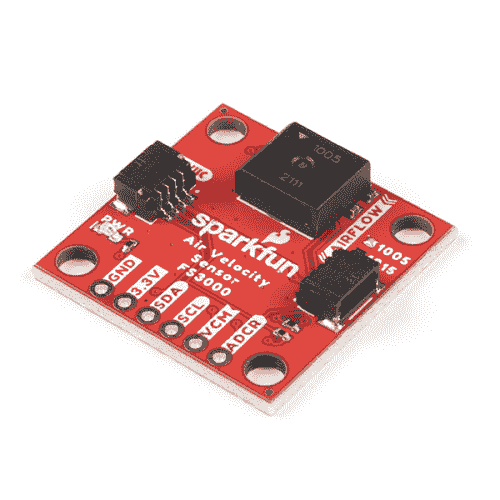

# 空气速度传感器分线点- FS3000 连接指南

> 原文：<https://learn.sparkfun.com/tutorials/air-velocity-sensor-breakout---fs3000-hookup-guide>

## 介绍

需要跟踪数据中心或服务器周围的气流吗？如何确保您的暖通空调和空气控制系统的功能在满负荷运行？或者，如果你更有趣的话，计算一下你的遥控飞机的速度怎么样？那么，SparkFun 空气速度传感器 Breakout - [FS3000-1005](https://www.sparkfun.com/products/18377) 和 [FS3000-1015](https://www.sparkfun.com/products/18768) 可以帮助你完成所有这些，甚至更多！这是超级容易，超级 Qwiic 连接，超级好玩。让我们来看看！

 

将**添加到您的[购物车](https://www.sparkfun.com/cart)中！**

 **### [【spark fun 风速传感器分接头- FS3000-1005 (Qwiic)](https://www.sparkfun.com/products/18377)

[In stock](https://learn.sparkfun.com/static/bubbles/ "in stock") SEN-18377

SparkFun FS3000-1005 Qwiic 空气速度传感器分接头可以帮助您准确地确定空气流动的速度和一致性

$59.951[Favorited Favorite](# "Add to favorites") 10[Wish List](# "Add to wish list")**** 

将**添加到您的[购物车](https://www.sparkfun.com/cart)中！**

 **### [【spark fun 风速传感器分接头- FS3000-1015 (Qwiic)](https://www.sparkfun.com/products/18768)

[In stock](https://learn.sparkfun.com/static/bubbles/ "in stock") SEN-18768

SparkFun FS3000-1015 Qwiic 空气速度传感器分接头可以帮助您准确地确定空气流动的速度和一致性

$59.951[Favorited Favorite](# "Add to favorites") 4[Wish List](# "Add to wish list")**** ****[https://www.youtube.com/embed/SwrXruuCTpY/?autohide=1&border=0&wmode=opaque&enablejsapi=1](https://www.youtube.com/embed/SwrXruuCTpY/?autohide=1&border=0&wmode=opaque&enablejsapi=1)

### 所需材料

要跟随本教程，您将需要以下材料。你可能不需要所有的东西，这取决于你拥有什么。将它添加到您的购物车，通读指南，并根据需要调整购物车。****