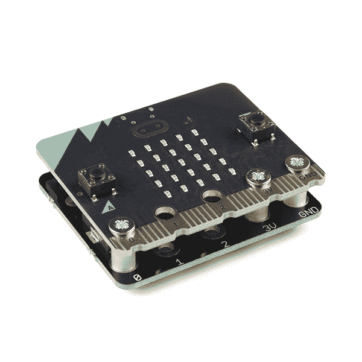
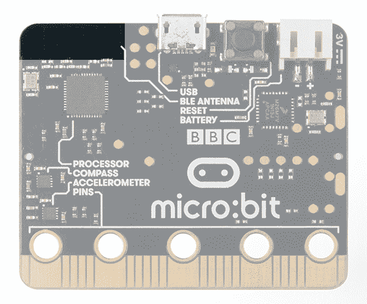
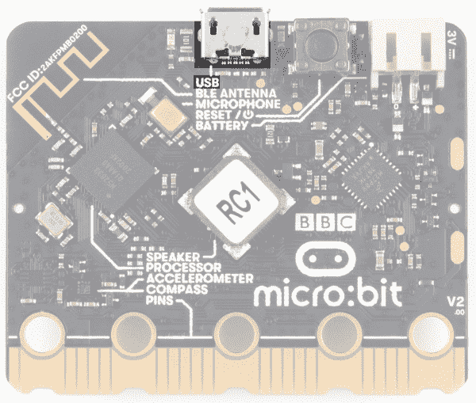
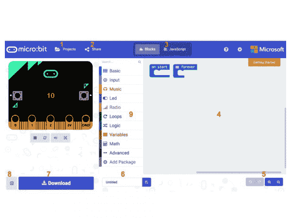
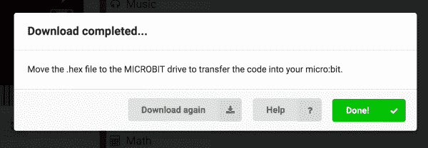
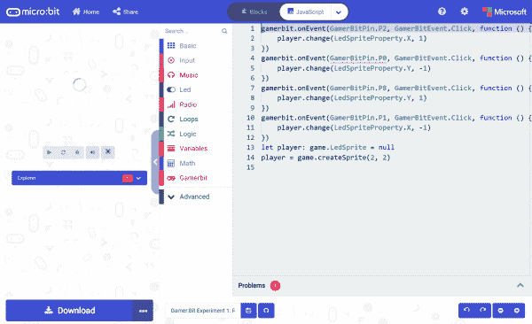
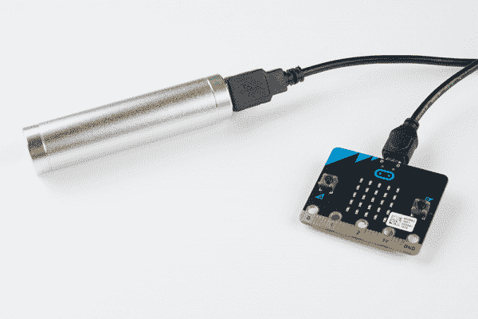

# micro:bit 入门

> 原文：<https://learn.sparkfun.com/tutorials/getting-started-with-the-microbit>

## 介绍

所以你买了这个叫做[微:位](https://www.sparkfun.com/products/14208)的东西...或者更好的是，你已经购买了升级版的[微:位 v2](https://www.sparkfun.com/products/17287) 。但这是什么呢？

 

### [微:位板](https://www.sparkfun.com/products/retired/14208)

[Retired](https://learn.sparkfun.com/static/bubbles/ "Retired") DEV-14208

BBC micro:bit 是一款口袋大小的电脑，可以让你利用数字技术进行创作。

10 **Retired**[Favorited Favorite](# "Add to favorites") 45[Wish List](# "Add to wish list") 

将**添加到您的[购物车](https://www.sparkfun.com/cart)中！**

### [微:位 v2 板](https://www.sparkfun.com/products/17287)

[In stock](https://learn.sparkfun.com/static/bubbles/ "in stock") DEV-17287

BBC micro:bit v2 是一款口袋大小的计算机，已经更新了附加功能，可以让您发挥创造力…

$15.956[Favorited Favorite](# "Add to favorites") 19[Wish List](# "Add to wish list")** **BBC micro:bit 是一款口袋大小的电脑，可以让你利用数字技术进行创作。您可以在任何地方编码、定制和控制您的 micro:bit！你可以使用微型钻头进行各种独特的创作，从机器人到乐器等等。

micro:bit 是 BBC 的一个项目，旨在将计算机科学教育和 STEM 主题带给英国的每个学生。这是一款开放式开发板，可与其它板载硬件组件同步工作，帮助您开始硬件编程之路。

[https://www.youtube.com/embed/Wuza5WXiMkc/?autohide=1&border=0&wmode=opaque&enablejsapi=1](https://www.youtube.com/embed/Wuza5WXiMkc/?autohide=1&border=0&wmode=opaque&enablejsapi=1)

在信用卡的一半大小，你会惊讶于每个板配备的硬件数量，包括 25 个红色 LED 灯，可以闪烁信息。有两个可编程按钮可用于控制游戏或暂停和跳过播放列表中的歌曲。微型钻头甚至可以探测到运动，并告诉你前进的方向。它还可以使用蓝牙低能耗(BLE)与其他设备和互联网进行交互。

micro:bit 具有嵌入式指南针、加速度计、手机和基于网络的编程功能。micro:bit v2 增加了板载扬声器和 MEMS 麦克风，以及触摸感应标志。这两种板都兼容多种不同语言的在线代码编辑器。本指南将重点介绍由微软开发的基于块或 JavaScript 的环境 [MakeCode](https://makecode.com) 。

### 所需材料

按照这个教程，你只需要一个 micro:bit，和一根 [micro USB 线](https://www.sparkfun.com/products/10215)。相当简单！

 

将**添加到您的[购物车](https://www.sparkfun.com/cart)中！**

### [USB micro-B 线- 6 脚](https://www.sparkfun.com/products/10215)

[In stock](https://learn.sparkfun.com/static/bubbles/ "in stock") CAB-10215

USB 2.0 型到微型 USB 5 针。这是一种新的、更小的 USB 设备连接器。微型 USB 连接器大约是…

$5.5014[Favorited Favorite](# "Add to favorites") 21[Wish List](# "Add to wish list")**** 

将**添加到您的[购物车](https://www.sparkfun.com/cart)中！**

### [【USB Micro-B 线缆-6】](https://www.sparkfun.com/products/13244)

[In stock](https://learn.sparkfun.com/static/bubbles/ "in stock") CAB-13244

这是一根 USB 2.0 型转 Micro-B 型 5 针黑色电缆。你知道，通常配在手机上的迷你 B 连接器，可以…

$2.103[Favorited Favorite](# "Add to favorites") 7[Wish List](# "Add to wish list")**** 

### [spark fun Traveler microB Cable-1m](https://www.sparkfun.com/products/retired/14741)

[Retired](https://learn.sparkfun.com/static/bubbles/ "Retired") CAB-14741

你是旅行者吗？你会从你的装备上去掉每一盎司多余的重量吗？SparkFun 1 米旅行者微型电缆是 d…

**Retired**[Favorited Favorite](# "Add to favorites") 0[Wish List](# "Add to wish list")**** ****### 推荐阅读

我们建议看看下面的教程。

 [### I2C](https://learn.sparkfun.com/tutorials/i2c) An introduction to I2C, one of the main embedded communications protocols in use today.[Favorited Favorite](# "Add to favorites") 128 [### 微型:bit 分线板连接指南](https://learn.sparkfun.com/tutorials/microbit-breakout-board-hookup-guide) How to get started with the micro:bit breakout board.[Favorited Favorite](# "Add to favorites") 2

## 硬件概述

BBC micro:bit 有两个版本，当涉及到板载输入和输出时，这两个版本都有很多功能。事实上，这些小小的板上集成了如此多的东西，如果你只是在探索编程和硬件的基础，你很难真正需要任何其他东西。

### 前面

在主板的正面，有许多组件非常显眼！

#### LED 阵列

micro:bit 有一个 5x5 的 LED 阵列，你可以用它作为一个小屏幕来绘制和显示单词、数字和其他信息。

|  |  |
| *微处理器上的 LED 阵列:位* | *微:位 V2 上的 LED 阵列* |

#### A/B 按钮

两个按钮:A 在左边，B 在右边，都是控制你设计的游戏的主要按钮。

|  |  |
| *微型上的 A/B 按钮:bit* | *微型:bit V2 上的 A/B 按钮* |

#### 边缘“引脚”

电路板底部的金色标签用于连接外部元件。带有较大孔的拉环可以很容易地与[鳄鱼夹](https://www.sparkfun.com/products/12978)一起使用，快速制作原型！要访问所有的引脚，您需要一个带有边缘连接器的电路板。对于试验板原型，你会想要[微型:带头部的钻头突破](https://www.sparkfun.com/products/16446)。

|  |  |
| *微:位上的边缘引脚* | *微:位 V2 上的边缘引脚* |

**Note:** You can also be creative when connecting to the larger through holes. For certain boards, you can use flat-head or countersunk screws that taper along the shaft, nylon standoffs, and hex nuts to access the through holes. Below is an image with the Micro:bit connecting to the [Kitronik MI:power Board V2](https://www.sparkfun.com/products/17852) with countersunk screws.

|  |  |

Using countersunk screws is also an alternative to alligator clips that provides a secure connection. For more information, check out this blog post: [micro:bit - Hacking the GPIO - Updated!](https://bigl.es/micro-bit-hacking-the-gpio/)

#### 光敏感元件

一块隐藏的宝石。LED 阵列兼作光传感器！

|  |  |
| *微型光传感器:位* | *微:位 V2 上的光传感器* |

#### 仅限 V2-麦克风输入和 LED 指示灯

#### 仅限 V2-触摸感应标志

金色标志是一种电容式触摸传感器，有点像手机上的触摸屏，测量电流的微小变化。

### 背部

后面是很多奇迹发生的地方。仔细讨论...

#### 微控制器

这套服装的主脑。

micro:bit 由一个 16MHz ARM Cortex-M0 微控制器供电，配有 256KB 闪存和 16KB RAM。

micro:bit v2 由 Nordic Semiconductor 的 nRF52833 芯片提供支持，这是一款 64MHz ARM Cortex-M4 微控制器，配有 FPU、512KB 闪存和 128KB RAM。

|  |  |
| *nRF51822 微处理器:位* | *微 V2 上的 nRF52833 处理器* |

#### 加速度计/指南针

micro:bit 有一个测量重力的机载加速度计，以及一个可以利用地球磁场检测其方向的指南针(也称为磁力计)。

|  |  |
| *微处理器上的加速计和磁力计:位* | *微处理器上的加速计和磁力计:位 v2* |

#### 蓝牙/无线电

用微比特交流是巨大的。您可以使用蓝牙低能量(BLE)与手机或平板电脑进行通信，或者使用标准的“无线电”在两个或多个微比特之间进行通信。

|  |  |
| *微型蓝牙/无线电天线:位* | *微型蓝牙/无线电天线:v2 位* |

#### 温度传感器

不，绘图没有不正确地突出显示！微控制器兼作温度传感器！

|  |  |
| *微控制器作为微处理器上的温度传感器:位* | *微控制器作为微处理器上的温度传感器:位 v2* |

#### 通用串行总线接口

用于从您的计算机或笔记本电脑上传代码到您的 micro:bit 或 power。

|  |  |
| *微处理器上的 USB 端口:位* | *微处理器上的 USB 端口:位 v2* |

#### 复原按钮

重置 micro:bit 并从头开始编写代码的按钮。

|  |  |
| *复位按钮微:位* | *微处理器上的复位按钮:位 v2* |

#### JST 电池连接器

将外部电池组连接到您的 micro:bit 的连接器。

|  |  |
| *复位按钮微:位* | *微处理器上的复位按钮:位 v2* |

#### 仅限 V2-麦克风

micro:bit 的 V2 包含一个 MEMS 麦克风，无需连接其他设备即可感知声音。

#### 仅限 V2-扬声器

唷！那是一大堆花里胡哨的东西...一把真正的瑞士军刀！

## 连接起来

micro:bit 使用 microUSB 电缆连接到你的电脑或 Chromebook。只需将线缆插入您的 micro:bit，另一端插入一个开放的 USB 端口即可。

插上主板后，您应该会看到 micro:bit 背面的黄色小 LED 灯亮起，并可能闪烁几次。然后，放在 micro:bit 上的任何现有程序都将开始运行。如果这是你第一次插入你的微型:钻头，继续玩一会儿，按下按钮，摇动它，你会得到一点复活节彩蛋。

一旦你的 micro:bit 启动，如果你用的是 Mac，检查一下你的 **Finder** ，如果你用的是 PC，检查一下你的 **My Computer Drives** 。micro:bit 应该显示为一个外部存储设备，其中存储了两个文件。

如果你在 Chromebook 上，当你插入 micro:bit 时，你会看到一个对话框来打开驱动器。请随意这样做，以确保它的工作！

开始编程吧！

## 使用生成代码

本指南和 SparkFun 围绕 micro:bit 的大部分内容将使用微软的 MakeCode 进行编程。

### 什么是 MakeCode？

MakeCode 是微软为 micro:bit，以及[其他板卡](https://makecode.com)打造的开放编程环境。您可以通过以下链接导航到 micro:bit 的 MakeCode:

[Launch MakeCode!](https://makecode.microbit.org/)

启动 MakeCode 后，当浏览器窗口最大化时，你会看到它的基本布局，左边是一个模拟器，右边是一个基于块的环境，如下所示。

*Click on the image above for a larger view.*

让我们快速浏览一下，看看有什么适合我们的！

1.  **项目** -一个连接到你电脑的云存储系统，不需要设置账户。
2.  允许你以多种不同的方式与你的朋友分享你的项目代码！
3.  **Blocks/JavaScript**——通过用 Blocks(默认)或 JavaScript 编程来选择你自己的冒险。
4.  程序空间(Program Space)-这是魔法发生的地方，也是你构建程序的地方...在那里你“编写代码”
5.  **缩放/撤销-重做** -有时候需要撤销事情，或者缩小看看周围；这些是按钮。
6.  **命名&保存** -命名你的程序并将其保存(下载)到你的电脑上。
7.  **下载**——类似于保存，下载你的程序为一个. hex 文件，并将其拖入你的 micro:bit。
8.  **模拟器隐藏/显示** -如果你愿意，你可以隐藏/显示模拟器。
9.  **块库** -程序构建块方面的所有选项，按功能进行颜色编码。
10.  **模拟器**——不需要硬件！MakeCode 有实时模拟器！当你改变你的程序时，你可以看到它将在这个虚拟微比特上做什么！

唷！现在你有一个选择——块还是基于文本的编程？

### 块或文本

对于本指南以及您将在 SparkFun for the micro:bit 上找到的大多数内容，我们将使用基于块的编程示例。

但是，如果您愿意，也可以使用 JavaScript 选项。选择权在你，好消息是你可以在同一个程序中从一个来回切换到另一个；一个将填充另一个，如果您是编程新手，这真的很好！

### 模拟器

MakeCode 包括一个 micro:bit 的模拟器，这意味着如果您没有 micro:bit，您仍然可以为它编写代码。或者，如果您想在上传到您的 micro:bit 之前尝试一个想法，您也可以这样做！

模拟器将随着您构建代码而更新，如果您想从头开始运行它，您可以单击停止和运行按钮重新开始！

说到代码，让我们写一个快速的程序，并把它放到你的 micro:bit 上！

## 你好，世界！

现在好东西来了——在 MakeCode 编程环境中为您的 micro:bit 编写第一个程序！

*“Hello World”*是我们用来定义你用编程语言或在一个新硬件上编写的第一个程序的术语。本质上，它是一段简单的代码，可以让你快速获胜(手指交叉),迈出学习的第一步。这也给了你一个机会来确保一切正常运行。

对于您的第一个“Hello World ”,我们将在 LED 阵列上创建一个简单的动画，该动画将永远重复。如果你只是想要完整的节目，可以在这里看到[。要查看我们如何构建该程序的分步解释，请继续阅读！](https://makecode.microbit.org/52659-35804-63742-17414)

[https://makecode.microbit.org/#pub:_LoJY7R7yTgC9](https://makecode.microbit.org/#pub:_LoJY7R7yTgC9)

**Note:** You may need to disable your ad/pop blocker to interact with the MakeCode programming environment and simulated circuit!

### 建筑“Hello World”

micro:bit 上的“Hello World”与普通微控制器上的略有不同。micro:bit 没有像 Arduino 或类似主板上那样单独闪烁的 LED。micro:bit 拥有的是一个 LED 阵列！所以，micro:bit 的“Hello World”就是用 LED 阵列画东西！

当你打开 MakeCode 时，你会看到两个块:`On Start`块和`forever`块。`On Start`块是所有在程序开始时执行的代码，并且只运行一次。`forever`块是将会一遍又一遍循环的代码...永远。

我们将使用`forever`块来构建这个“Hello World”我们现在需要开始向`forever`添加块。

首先，点击基础类别。这些模块是构建代码程序的基本模块。它将扩展成许多选项。点击并拖动`show leds`模块，将其放入`forever`模块内。请注意，该块是键控，以适应内部的`forever`块，如果你有你的电脑上的音量，你会听到一个令人满意的“点击”噪音时，你放开块。

`show leds`块有一个象征 LED 阵列的正方形阵列。如果你点击一个方块，它会变成红色，这意味着它是'开'的。通过打开或关闭不同的 led 来绘制简单的像素艺术形状；您应该能够在窗口左侧的模拟器中看到结果。

为了将这个静态图像转换成动画，我们需要另一个`show leds`块放在第一个块的下面。然后，您可以使用这组矩形进行第二次绘制。在你的模拟器中，你会看到图像切换得非常非常快。我们得放慢速度。

为了让你的动画慢下来，你将使用`pause`块，它在基本块组下面。`pause`块正是它所说的；它告诉 micro:bit 暂停并等待一段时间。如图所示，在程序中放置两个`pause`程序块。

我们使用两个“暂停”块并将其中一个放在末尾的原因是这个程序是一个循环。如果没有最后的方块，动画中的图像会变化得非常非常快。

我们在下一节构建了一个示例，您可以下载该文件并在自己的 micro:bit 上试用，或者使用模拟器。如果您想摆弄代码并做一些修改，请点击小部件中的 Edit 按钮，它会打开一个 MakeCode 编辑器，让您开始编写“Hello World”尽情享受吧！

## 将您的程序加载到您的 micro:bit 上

你已经用 MakeCode 编写了你的第一个程序，它在你的模拟器上运行。现在，你如何把它放到你的微型钻头上呢？

### 下载您的程序

一旦你对你的程序感到满意，你可以点击 MakeCode 中的下载按钮。

这会将您的程序文件下载到您的标准下载位置，可能是您计算机上的 **Downloads** 文件夹，或者您在下载首选项中设置的任何位置。

然后，您只需点击程序文件并将其从下载位置拖到您的 micro:bit 驱动器，该驱动器显示为外部设备。

就是这样！

你的 micro:bit 会闪几秒，然后你的程序会自动启动。是啊！赢了！

[https://makecode.microbit.org/---run?id=_MVhEDaUbq6Tu](https://makecode.microbit.org/---run?id=_MVhEDaUbq6Tu)

**Note:** You may need to disable your ad/pop blocker to see the simulated circuit!

## 进行代码扩展

**Heads up!** Previously, these libraries were referred to as MakeCode packages. They are now referred to as [MakeCode extensions](https://makecode.com/extensions).

如果你以前用过 Arduino，你大概知道一个叫库的东西；它是扩展核心编程语言功能的代码集合。MakeCode 扩展以同样的方式工作。

Arduino 库和 MakeCode 扩展之间有一些惊人的区别。其中之一是 MakeCode 扩展包括 JavaScript 函数，您可以在用文本编程时使用这些函数，以及您需要使用 block 方法编程的所有块。这使得学习和使用新的扩展变得简单明了，并在着手构建您梦想的项目时缩短了时间。

有几个 MakeCode 扩展可用。以下指令利用了 Controller:bit 的 MakeCode 扩展，但是您也可以继续添加其他扩展。

### [安装 MakeCode 扩展](#installing)

要在 MakeCode 工具箱(不同块组的列表)中安装或添加新的扩展，点击“**高级**，然后点击“**添加扩展**

从这里你可以搜索“ **SparkFun** 或“ **SparkFun gamer-bit** ”，它应该在列表中显示为一个公共扩展。继续点击它。

**Heads up!** Not able to find a certain extension? It could be that the extension has not been approved and published yet. It does take time to get an extension approved by the micro:bit Educational Foundation before it can be searchable by name. Part of the requirements for the approval process involves a live product page. Therefore, at the time of the launch for certain products, an extension may not have been approved and the only method of adding the extension is to use the link to the GitHub repository of the pxt-package and paste the URL in the extension search box. The MakeCode editor will find it and allow anyone to add it to their project.

这将把所有的块添加到您的工具箱中。一般来说，这有点棘手，因为根据扩展是如何编写的，它可能有自己的工具箱或者只是向现有的工具箱添加块。看看你的工具箱；对于游戏玩家:你应该看到的一点...

太好了！您现在已经安装了 gamer:bit 扩展！如果您购买了 micro:arcade 套件，您就可以使用该板以及套件中附带的组件。顺便提一下，对于您创建的每个新的 MakeCode 项目，您都必须重新加载扩展。没什么大不了的，但是值得注意！

### [更新扩展](#update)

公布的示例代码和 ***。保存的十六进制**文件使用扩展名的存档版本。有时，MakeCode editor 或扩展会有更新。如果由于编译错误或新特性而需要将扩展更新到最新版本，有两种方法可以更新扩展。一种方法是移除扩展提供的块的所有实例，并如上所述重新安装扩展。如果有几个块夹在一起，并且代码很长，这可能会很乏味。第二种方法是在 Javascript 视图中更新版本号。好处是用户不必手动移除夹在一起的块。

下面是一个公开的例子，以前的 gamer:bit 扩展能够编译。对 MakeCode 编辑器的更新导致了一个错误，这是由于 gamer:bit 扩展中的一个错误，该错误在早期版本的 MakeCode 编辑器中被忽略。最终对 gamer:bit 扩展应用了一个补丁，所以我们想更新这个例子，引入最新版本来修复这个错误。

切换顶部的 **JavaScript** 按钮，切换到 JavaScript 视图。在左手边，你会注意到**浏览器**菜单。单击箭头展开菜单。

向下滚动到 MakeCode 扩展的版本号。您可以在这里删除或更新扩展版本。我们需要更新版本号，因为代码依赖于 gamer:bit 扩展。单击带有刷新符号和版本号的按钮。

此时，给它几秒钟时间从云中获取最新的版本号。然后重新打开浏览器菜单。如果有更新，这将刷新扩展并使用最新版本。在这种情况下，有一个更新，所以它在版本 0.0.8 拉！您会注意到带有数字的红框(表示代码的问题数量)也消失了。

只是为了确保一切顺利。回到**块**视图，由三角形指示的错误消失了。太棒了。我们已经成功更新了 MakeCode 扩展，这样我们就可以重新开始编码了！

### 进行扩展

For developers and advanced programmers interesting in making your own custom extensions, [check out the following tutorial](https://learn.sparkfun.com/tutorials/how-to-create-a-makecode-package-for-microbit) for more information [### 如何为 Micro:Bit 创建 MakeCode 包

#### 2019 年 4 月 16 日](https://learn.sparkfun.com/tutorials/how-to-create-a-makecode-package-for-microbit) Learn how to develop code blocks for the Micro:bit in Microsoft MakeCode 2

## 给微处理器供电:bit

你的程序在你的微处理器上运行，但是它仍然和你的计算机相连。有许多方法可以解决这个问题...电池，电池和更多的电池！

⚡ **Oh snap!** Looking for more information about adding remote power to your micro:bit? Check out these application notes from the micro:bit Foundation!

[micro:bit Foundation: Power Supply](https://tech.microbit.org/hardware/powersupply/)

### USB 电池组

USB 电池组在那里变得非常普遍。你可以用它来运行你的 micro:bit 项目很长一段时间。

有一根更短的 USB 线很方便，可以避免拖着一根超长的电线到处走。

### 2 个 AA 电池组

如果您希望长时间为大量 micro:bits 供电，例如在教室环境中，带 JST-PH 连接器的 [2xAA 电池座是一个很好的解决方案。](https://www.sparkfun.com/products/14299)

这些电池可以以相当便宜的价格批量购买。

### 2 个 AAA 电池组

寻找一个更小的电池座？试试看带 JST-PH 连接器的 2xAAA 电池座。有一个包含在 micro:bit Go 捆绑包中！

 

将**添加到您的[购物车](https://www.sparkfun.com/cart)中！**

### [微:位 v2 走捆绑](https://www.sparkfun.com/products/17288)

[In stock](https://learn.sparkfun.com/static/bubbles/ "in stock") DEV-17288

micro:bit v2 是一个口袋大小的计算机，Go 捆绑包为您提供了连接和供电所需的一切…

$18.50[Favorited Favorite](# "Add to favorites") 6[Wish List](# "Add to wish list")** **甚至可以看看带有 JST-PH 连接器和电源开关的 2xAAA 电池座！添加的开关使得打开和关闭 micro:bit 项目变得容易，而不需要将 JST-PH 连接器从 micro:bit 上移开。

 

将**添加到您的[购物车](https://www.sparkfun.com/cart)中！**

### 

[In stock](https://learn.sparkfun.com/static/bubbles/ "in stock") PRT-15101

这是一款独特的双电池 AAA 电池座，专为 BBC micro:bit 打造。6 英寸(约 150 毫米)电缆已被端接…

$2.10[Favorited Favorite](# "Add to favorites") 14[Wish List](# "Add to wish list")** **## 资源和更进一步

**Note:** If you modified the firmware on the micro:bit and have issues uploading code with MakeCode, try [reinstalling the firmware](https://microbit.org/guide/firmware/).

[micro:bit Foundation: Updating your micro:bit firmware](https://microbit.org/guide/firmware/)

既然您已经熟悉了 micro:bit 的基础知识，请查看这些附加资源以获得更多灵感！

*   [microbit.org](http://microbit.org/)
    *   [关于 micro:bit](http://microbit.org/about/) -关于 micro:bit 基金会的信息。
    *   [硬件](http://microbit.org/hardware/) -技术和合规信息。
    *   [快速入门指南](http://microbit.org/guide/) -来自 micro:bit foundation 的其他入门指南。
    *   [活动](http://microbit.org/ideas/) -来自 micro:bit 网站的项目。
    *   [项目](https://makecode.microbit.org/projects)——你可以用你的 micro:bit 构建的项目。
    *   [应用](http://microbit.org/code/)-micro:bit 应用可以让你用蓝牙无线发送代码到你的 micro:bit。不需要任何线索！这还包括一个 micro:bit 的其他编程环境列表。
    *   [教育工作者教学资源](http://microbit.org/teach/#resources-section) -教育工作者资源。基于微比特的课堂导向活动。
*   [代码俱乐部活动](https://www.codeclubprojects.org/en-GB/microbit/) -代码俱乐部 6 项活动试玩！
*   [BBC 微:bit - Kitronik 大学](https://www.kitronik.co.uk/blog/bbc-microbit-kitronik-university/) -更多微:bit 教程。
*   [Kitronik 微:位 vs 微:位 v2 指南](https://kitronik.co.uk/blogs/resources/explore-micro-bit-v1-microbit-v2-differences)
*   [熔结零件](https://github.com/microbit-foundation/dev-docs/issues/36#issuecomment-292777097) -对于教程中使用的红色熔结零件，请查看此库中链接的用户贡献零件！
*   [SparkFun 微:bit 登陆页面](https://www.sparkfun.com/pages/microbit)

仅使用 micro:bit 寻找其他项目创意？查看 micro:climate kit 的阅读光线水平实验:

|  |
| [微:气候实验 2 -阅读光级](https://learn.sparkfun.com/tutorials/microclimate-kit-experiment-guide/experiment-2-reading-the-light-level) |

有关其他 SparkFun 教程，请查看一些相关的 micro:bit 教程:

 [### 微型:bit 分线板连接指南](https://learn.sparkfun.com/tutorials/microbit-breakout-board-hookup-guide) How to get started with the micro:bit breakout board.[Favorited Favorite](# "Add to favorites") 2 [### 如何在微控制器板上加载 MicroPython](https://learn.sparkfun.com/tutorials/how-to-load-micropython-on-a-microcontroller-board) This tutorial will show you how to load the MicroPython interpreter onto a variety of development boards.[Favorited Favorite](# "Add to favorites") 5 [### SparkFun gator:bit v2 连接指南](https://learn.sparkfun.com/tutorials/sparkfun-gatorbit-v2-hookup-guide) The gator:bit v2 is a breakout board for the BBC micro:bit. The gator:bit exposes almost every pin on the micro:bit to clippable pad with circuit protection. It also has as built-in addressable LEDs and a built-in buzzer.[Favorited Favorite](# "Add to favorites") 1 [### 火花短吻鳄:日志连接指南](https://learn.sparkfun.com/tutorials/sparkfun-gatorlog-hookup-guide) The gator:log is a serial communication based data logger. This tutorial will get you started using the gator:log with the micro:bit platform.[Favorited Favorite](# "Add to favorites") 1

查看 Shawn 的 4 部分视频系列。这些项目有使用加速度计的例子，结合了伺服和温度的例子，并在两个微比特之间发送蓝牙消息。还有另外两个使用 micro:bit 和 MicroPython 的视频。或者尝试用纸板电路探索 micro:bit！

 [### 微:比特重访

June 12, 2017](https://www.sparkfun.com/news/2400 "June 12, 2017: Let's compile some Getting Started lessons for the micro:bit.")[Favorited Favorite](# "Add to favorites") 1 [### 今日英语:纸板电路

November 30, 2017](https://www.sparkfun.com/news/2546 "November 30, 2017: Affordable, consumable, single-layer PCB design! ")[Favorited Favorite](# "Add to favorites") 6**********