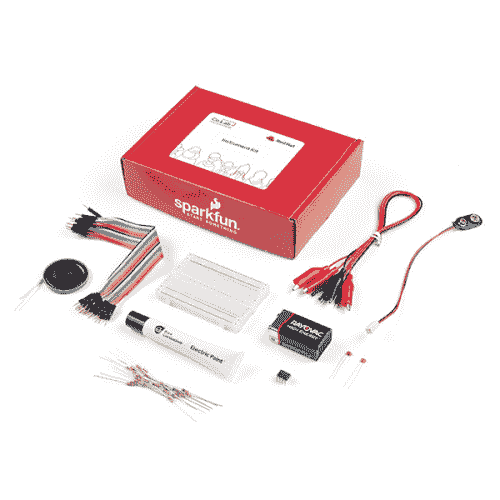

# Red Hat 仪器套件连接指南

> 原文：<https://learn.sparkfun.com/tutorials/red-hat-instrument-kit-hookup-guide>

## 介绍

开源如何帮助我们找到新的表达方式？在 [Red Hat 乐器套件](https://www.sparkfun.com/products/18432)中，您将学习导电性是如何工作的，并使用这种理解来创建一种交互式乐器。导电涂料和墨水将让你探索物理设计如何影响工具的使用方式。这个实验使参与者能够将他们自己的创造性思维带入声音和乐器的世界。这项活动最适合 10-13 岁的人，不需要任何电路知识或布线或电子技能。考虑到一些组件很小，并且连接需要一定程度的灵活性，年幼的学生可能需要一些成人的帮助。

### 所需材料

要跟随本教程，您将需要 Red Hat 工具套件。

 

将**添加到您的[购物车](https://www.sparkfun.com/cart)中！**

 **### [红帽公司实验室仪器套件](https://www.sparkfun.com/products/18432)

[In stock](https://learn.sparkfun.com/static/bubbles/ "in stock") CUST-18432

在这个工具包中，您将了解在创建交互式乐器时导电性是如何工作的。

$24.95[Favorited Favorite](# "Add to favorites") 0[Wish List](# "Add to wish list")** **如果您希望购买单个零件作为补充或扩展，这里有一个列表:**