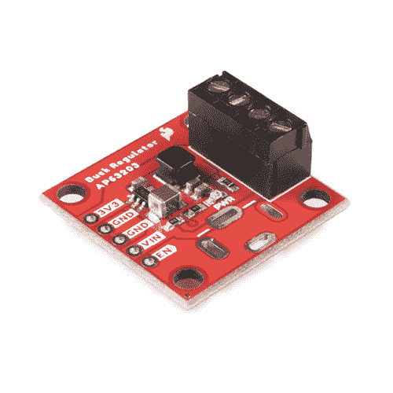
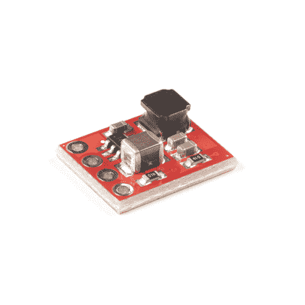

# 降压调节器连接指南

> 原文：<https://learn.sparkfun.com/tutorials/buck-regulator-hookup-guide>

## 介绍

谁不偶尔需要电力调节？我们当然知道，所以我们设计了 [SparkFun 降压调节器突破](https://www.sparkfun.com/products/18356)和 [SparkFun BabyBuck 调节器突破](https://www.sparkfun.com/products/18357)来帮助我们完成这样的任务。

两款分线板均以 Diodes Inc .的 AP63203 为主角，利用 2A 同步降压转换器(具有 3.8V 至 32V 的宽输入电压范围)和完全集成的 125m 高端功率 MOSFET/68mω低端功率 MOSFET 来提供高效率降压 DC/DC 转换。所有这些都集成在一个薄型 TSOT26 封装中，该封装集成在 1x1 英寸或 0.4x0.5 英寸电路板上。对于各种各样的电源管理需求-拿起你自己的降压调节器或婴儿降压调节器，让我们开始吧！

 

将**添加到您的[购物车](https://www.sparkfun.com/cart)中！**

 **### [【spark fun 降压稳压器分线点- 3.3V (AP63203)](https://www.sparkfun.com/products/18356)

[In stock](https://learn.sparkfun.com/static/bubbles/ "in stock") COM-18356

该分线板采用 AP63203，利用 2A 同步降压转换器，具有宽输入电压范围

$5.50[Favorited Favorite](# "Add to favorites") 7[Wish List](# "Add to wish list")**** 

将**添加到您的[购物车](https://www.sparkfun.com/cart)中！**

 **### 

[In stock](https://learn.sparkfun.com/static/bubbles/ "in stock") COM-18357

这款小型分线板采用 AP63203，利用了具有宽输入电压的 2A 同步降压转换器…

$4.502[Favorited Favorite](# "Add to favorites") 8[Wish List](# "Add to wish list")**** ****[https://www.youtube.com/embed/y71HFXXvlAM/?autohide=1&border=0&wmode=opaque&enablejsapi=1](https://www.youtube.com/embed/y71HFXXvlAM/?autohide=1&border=0&wmode=opaque&enablejsapi=1)

### 所需材料

要跟随本教程，您将需要以下材料。你可能不需要所有的东西，这取决于你拥有什么。将它添加到您的购物车，通读指南，并根据需要调整购物车。****