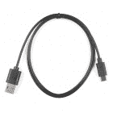
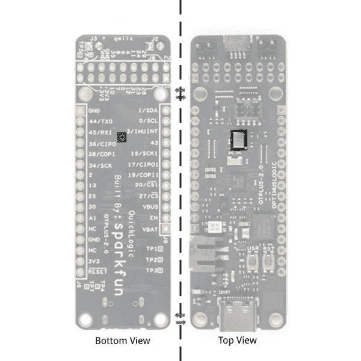

# QuickLogic Thing Plus (EOS S3)连接指南

> 原文：<https://learn.sparkfun.com/tutorials/quicklogic-thing-plus-eos-s3-hookup-guide>

## 介绍

**Note:** Content for this user guide was originally written by QuickLogic.

本指南为用户提供了 QuickLogic Thing Plus EOS S3 的功能描述和配置选项。它还可以作为“入门”和“如何做”的指南。

 

将**添加到您的[购物车](https://www.sparkfun.com/cart)中！**

 **### [spark fun quick logic Thing Plus-EOS S3](https://www.sparkfun.com/products/17273)

[In stock](https://learn.sparkfun.com/static/bubbles/ "in stock") DEV-17273

spark fun quick logic Thing Plus EOS S3 是一款小型系统，非常适合实现下一代低功耗…

$49.50[Favorited Favorite](# "Add to favorites") 11[Wish List](# "Add to wish list")** **[https://www.youtube.com/embed/sFxGwaUxhlE/?autohide=1&border=0&wmode=opaque&enablejsapi=1](https://www.youtube.com/embed/sFxGwaUxhlE/?autohide=1&border=0&wmode=opaque&enablejsapi=1)

### 所需材料

要跟随本教程，您将需要以下材料。你可能不需要所有的东西，这取决于你拥有什么。将它添加到您的购物车，通读指南，并根据需要调整购物车。

 

将**添加到您的[购物车](https://www.sparkfun.com/cart)中！**

 **### [可逆 USB A 转 C 线- 0.8m](https://www.sparkfun.com/products/15425)

[15 available](https://learn.sparkfun.com/static/bubbles/ "15 available") CAB-15425

这些 0.8 米电缆稍作修改，允许它们插入其端口，而不管它们在…

$5.502[Favorited Favorite](# "Add to favorites") 5[Wish List](# "Add to wish list")**** 

将**添加到您的[购物车](https://www.sparkfun.com/cart)中！**

 **### [spark fun quick logic Thing Plus-EOS S3](https://www.sparkfun.com/products/17273)

[In stock](https://learn.sparkfun.com/static/bubbles/ "in stock") DEV-17273

spark fun quick logic Thing Plus EOS S3 是一款小型系统，非常适合实现下一代低功耗…

$49.50[Favorited Favorite](# "Add to favorites") 11[Wish List](# "Add to wish list")**** ****### 你还需要

你还需要一台装有[终端程序](https://learn.sparkfun.com/tutorials/terminal-basics)或任何 UART 控制台应用程序的计算机。对于本教程的范围，我们将使用[油灰](https://www.putty.org/)。

*   装有 Windows 10 操作系统或 Linux 操作系统的计算机
    *   串行终端

**Note:** Windows 7, Windows 8 and Virtual Ubuntu machines are not supported.

### 推荐阅读

如果你不熟悉 Qwiic 系统，我们推荐你在这里阅读[以获得一个概述](https://www.sparkfun.com/qwiic)。

|  |
| *[Qwiic 连接系统](https://www.sparkfun.com/qwiic)* |

如果您不熟悉以下概念，我们也建议您在继续之前先查阅一些教程。

 [### 串行外设接口(SPI)](https://learn.sparkfun.com/tutorials/serial-peripheral-interface-spi) SPI is commonly used to connect microcontrollers to peripherals such as sensors, shift registers, and SD cards.[Favorited Favorite](# "Add to favorites") 91 [### 逻辑电平](https://learn.sparkfun.com/tutorials/logic-levels) Learn the difference between 3.3V and 5V devices and logic levels.[Favorited Favorite](# "Add to favorites") 82 [### 加速度计基础知识](https://learn.sparkfun.com/tutorials/accelerometer-basics) A quick introduction to accelerometers, how they work, and why they're used.[Favorited Favorite](# "Add to favorites") 29 [### I2C](https://learn.sparkfun.com/tutorials/i2c) An introduction to I2C, one of the main embedded communications protocols in use today.[Favorited Favorite](# "Add to favorites") 128 [### 串行终端基础知识](https://learn.sparkfun.com/tutorials/terminal-basics) This tutorial will show you how to communicate with your serial devices using a variety of terminal emulator applications.[Favorited Favorite](# "Add to favorites") 46

## 硬件概述

QuickLogic Thing Plus EOS S3 是一款小型系统，非常适合支持下一代低功耗机器学习(ML)的物联网(IoT)设备。与其他基于专有硬件和软件工具的开发板不同，QuickLogic Things Plus 基于 100%开源硬件，与 Feather 外形兼容，并围绕 100%开源软件(包括 Symbiflow FPGA 工具)构建。

QuickLogic 由 QuickLogic 的[EOS S3](https://www.quicklogic.com/products/eos-s3/)提供支持，这是首款支持 eFPGA 的 Arm Cortex -M4F MCU，完全支持泽法 RTOS 和 FreeRTOS。

其他功能包括:

*   QuickLogic EOS S3 MCU 平台
*   ST micro LIS2DH12TR 加速度计
*   Vesper VM3011 自适应 ZeroPower Listening 数字压电 MEMS PDM 麦克风
*   SparkFun 的 Qwiic 连接器可轻松连接大量 Qwiic 模块
*   16Mbit 板载闪存
*   用户按钮和 RGB LED
*   由 USB 或单节锂电池供电
*   集成电池充电器
*   连接到可编程逻辑的 USB 数据信号
*   IO 信号路由到通用引脚
*   兼容标准 0.1 英寸试验板

### 利益

*   QuickLogic Thing Plus EOS S3 小巧、兼容 Feather、价格低廉，并且 100%受开源工具支持。
*   凭借 Cortex M4F MCU 和集成的 eFPGA，EOS S3 让您能够利用 100%开源的硬件和软件进行创新。

### 应用程序

*   微小的 ML 应用程序(例如 SensiML 的 AI 软件平台和 Google 的 TensorFlow Lite)
*   通用 MCU 应用

### 电路板布局

下面是电路板布局和元件的简要概述。

*   QuickLogic EOS S3 MCU 平台
*   ST micro LIS2DH12TR 加速度计
*   SparkFun 的 Qwiic 连接器
*   Vesper 的 VM3011 MEMS PDM 麦克风
*   16Mbit 板载闪存
*   用户按钮和 RGB LED
*   硬件重置按钮
*   由 USB 或单节锂电池供电
*   集成电池充电器
*   连接到可编程逻辑的 USB 数据信号
*   IO 信号中断路由至通用引脚

### IO 扩展连接器 EOS S3 MCU IO 映射到 QuickLogic Thing Plus

下面是图形数据表的 QuickLogic 的东西加上 EOS S3 参考引脚，其次是一个表列出了 EOS S3 引脚。由于电路板和元件的尺寸，丝网印刷印刷在电路板的背面。您可以翻转电路板，参考引脚名称及其各自的功能。

*Click image for a closer view.*

| EOS S3 MCU IO | 快速逻辑事物加功能 | 附加功能 | 膨胀 |
| IO_0 | I2C0 单片机 |  | J9.11 |
| IO_1 | I2C0 SDA |  | J9.12 |
| 木卫二 | 超正析象管(Image Orthicon) |  | J6.7 |
| IO_3 | 加速度计 LIS2DH12TR 中断 |  | J9.10 |
| IO_4 | 超正析象管(Image Orthicon) |  | J8.8 |
| IO_5 | 超正析象管(Image Orthicon) |  | J8.9 |
| IO_6 | 用户按钮输入 |  | J8.10 |
| IO_7 | 超正析象管(Image Orthicon) |  | J8.11 |
| IO_8 | 超正析象管(Image Orthicon) |  | J8.12 |
| IO_10 | 超正析象管(Image Orthicon) |  | J8.13 |
| IO_11 | 超正析象管(Image Orthicon) |  | J8.6 |
| IO_12 | 超正析象管(Image Orthicon) |  | J8.7 |
| IO_13 | 超正析象管(Image Orthicon) |  | J6.8 |
| IO_14 | 串行线调试 CLK |  | J6.4 |
| IO_15 | 串行线调试数据 |  | J6.2 |
| IO_16 | 超正析象管(Image Orthicon) | SPI 外设 CLK | J9.8 |
| IO_17 | 超正析象管(Image Orthicon) | SPI 外设 CIPO(输入) | J9.7 |
| IO_18 | 蓝色 LED |  | 不适用的 |
| IO_19 | 超正析象管(Image Orthicon) | SPI 外设 COPI | J9.6 |
| IO_20 | 超正析象管(Image Orthicon) | SPI 外设 CSn | J9.5 |
| IO_21 | 绿色 LED |  | 不适用的 |
| IO_22 | 红色 LED |  | 不适用的 |
| IO_23 | 超正析象管(Image Orthicon) | I2S 外设 WCLK(帧) | J8.3 |
| IO_24 | 超正析象管(Image Orthicon) | I2S 外设数据(dout) | J8.4 |
| IO_25 | 超正析象管(Image Orthicon) |  | J6.9 |
| IO_27 | 超正析象管(Image Orthicon) | SPI 控制器 CS2 | J9.2 |
| IO_28 | PDM 数据；若要隔离，请移除 R28 |  | J8.1 |
| IO_29 | PDM CKO |  | J8.2 |
| IO_30 | 超正析象管(Image Orthicon) |  | J6.10 |
| IO_31 | 超正析象管(Image Orthicon) | I2S 外围 CLK(输入) | J8.5 |
| IO_32 | 超正析象管(Image Orthicon) |  | J9.3 |
| IO_33 | 超正析象管(Image Orthicon) |  | J9.4 |
| IO_34 | SPI 控制器 CLK |  | J6.6 |
| IO_36 | SPI 控制器 CIPO |  | J6.4 |
| IO_38 | SPI 控制器 COPI(闪存) |  | J6.5 |
| IO_40 | 超正析象管(Image Orthicon) |  | 不适用的 |
| IO_43 | 超正析象管(Image Orthicon) | 到主机的中断输出 | J9.9 |
| IO_44 | 超正析象管(Image Orthicon) | UART TX | J6.2 |
| IO_45 | 超正析象管(Image Orthicon) | UART RX | J6.3 |

### 连接器 J9

| J2 | EOS S3 MCU IO | BGA 引脚编号 | 功能 |
| one |  |  | VBAT |
| Two |  |  | 3.3V 电路使能 |
| three |  |  | VBUS |
| four | IO_27 | 手持式受送话器(Handset) | 木卫一；SPI 控制器 CSn2 |
| five | IO_20 | 八国集团(Group of Eight) | SPI 外设 SSn 输入；EOS S3 自举 |
| six | IO_19 | H8 | SPi 外设 COPI 输入；EOS S3 自举 |
| seven | IO_17 | D7 | SPI 外设 CIPO 输出 |
| eight | IO_16 | E7 | SPI 外设 CLK 输入 |
| nine | IO_43 | D1 | EOS S3 中断输出 |
| Ten | IO_3 | 主动脉第二声 | 加速中断输入 |
| Eleven | IO_0 | B1 | I2C0 单片机 |
| Twelve | IO_1 | C1 | I2C0 SDA |

### 连接器 J6

| J6 | EOS S3 MCU IO | BGA 引脚编号 | 功能 |
| one |  |  | 地面 |
| Two | IO_44 | E1 | S3 通用异步收发器 TX |
| three | IO_45 | G1 | S3 通用异步收发器 |
| four | IO_36 | H3 | SPI 控制器 CIPO 输入 |
| five | IO_38 | E2 | SPI 控制器 COPI 输出 |
| six | IO_34 | 第三子代 | SPI 控制器 CLK 输出 |
| seven | 木卫二 | 一流的 | 超正析象管(Image Orthicon) |
| eight | IO_13 | D6 | 超正析象管(Image Orthicon) |
| nine | IO_25 | F7 | 超正析象管(Image Orthicon) |
| Ten | IO_30 | 法乐四联症 | 超正析象管(Image Orthicon) |
| Eleven | ADC1 | C7 | ADC1 输入 |
| Twelve |  |  | 没有连接 |
| Thirteen |  |  | 地面 |
| Fourteen |  |  | 没有连接 |
| Fifteen |  |  | +3.3V |
| Sixteen | SYS_RSTn | F8 | EOS S3 硬件复位输入 |

### 连接器 J8

| J8 | EOS S3 MCU IO | BGA 引脚编号 | 功能 |
| one | IO_28 | G5 | PDM 麦克风数据 |
| Two | IO_29 | F5 | PDM 麦克风 CLK |
| three | IO_23 | H6 | I2S 外设 WCLK 输入 |
| four | IO_24 | G6 | I2S 外设数据输出 |
| five | IO_31 | G4 | I2S 外围 CLK 输入 |
| six | IO_11 | 溴化五烃季胺 | 超正析象管(Image Orthicon) |
| seven | IO_12 | B5 | 超正析象管(Image Orthicon) |
| eight | IO_4 | B2 | 超正析象管(Image Orthicon) |
| nine | IO_5 | C3 | 超正析象管(Image Orthicon) |
| Ten | IO_6 | B3 | 用户按钮输入 |
| Eleven | IO_7 | A3 号 | 超正析象管(Image Orthicon) |
| Twelve | IO_8 | 补体第四成份缺乏 | 超正析象管(Image Orthicon) |
| Thirteen | IO_10 | A4 号 | 超正析象管(Image Orthicon) |
| Fourteen | IO_35 | 第二子代 | 超正析象管(Image Orthicon) |
| Fifteen |  |  | +3.3V |
| Sixteen |  |  | 地面 |
| Seventeen |  |  | +3.3V |
| Eighteen |  |  | 地面 |

### 开发连接器

### EOS S3 MCU SWD 连接器

下面是用于电路板编程的 SWD 连接器。右边的引脚标签取自图形数据手册，以供参考。

| J7 | EOS S3 MCU IO | 功能 |
| one |  | +3.3V |
| Two | IO_15 | SWD_IO |
| three |  | 地面 |
| four | IO_14 | CLK 社会福利署 |
| five |  | 地面 |
| six |  | 没有连接 |
| seven |  | 没有连接 |
| eight |  | 没有连接 |
| nine |  | 地面 |
| Ten | SYS_RSTn | 硬件复位 |

### 引导程序 IO_19 和 IO_20

有两对 IO 引脚是为编程器刷新 EOS S3 而保留的。当从闪存启动程序时，你需要保持这些引脚打开。

*   安装两个分流器以使用 SWD 调试器进行开发
*   移除从闪存启动的两个分流器

**Note:** QuickLogic Thing Plus board flash device must contain valid boot image for successful boot from flash.

### 力量

有两种方式为 QuickLogic Thing Plus 供电:USB 连接器(J5)或电池连接器(J4)。当两个端口同时连接时，USB 电源激活电池充电电路，为电池提供充电电流。

使用可充电电池时，最小输入电压将决定系统需要支持的最大电流。当将附加外设连接到 QuickLogic Thing Plus 时，这一点非常重要，因为 quick logic Thing Plus 也需要连接到+3.3V 电源。

MCP73831 LiPo 充电器的默认充电速率设置为约 212.76mA。在将电池插入充电器之前，您应该了解您的**电池的容量**和充电器提供的**充电电流**。为了安全起见，您应该将电池的充电电流**保持在 1C** 或以下。这意味着您应该连接一个容量约为 212.75 毫安或更高的 LiPo 电池来安全充电。有关充电 LED 状态的更多信息，请查看 MCP73831 的 [LiPo USB 充电器分线板](https://learn.sparkfun.com/tutorials/lipo-usb-charger-hookup-guide#charge_LED)。

### RGB LED

说到 LED，该板包括一个内置的 RGB LED。如本教程前面所列，可以使用引脚 22(红色)、引脚 21(绿色)和引脚 18(蓝色)来控制 led。请注意，引脚没有布线到电路板边缘。

### 用户和重置按钮

该板包括一个用户按钮和硬件复位按钮。这些也连接到电路板的边缘。当连接到编程器时，reset 引脚也连接到 SWD 引脚。

### 将附加外围设备连接到 QuickLogic Thing Plus

QuickLogic Thing Plus 支持通过扩展连接器 J2 和 JBOY3 乐队直接连接到顺桨模块(假设顺桨模块安装了堆栈头)。请参考 AdaFruit 的网站，了解关于可用的顺桨模块的更多信息。

### 带 I ² C 端口的传感器

QuickLogic Thing Plus 板支持通过扩展连接器 J2 连接到带 I ² C 外设接口的传感器模块。您还可以访问 J9 接头上的引脚。

QuickLogic Thing Plus I ² C 支持 I ² C 标准模式(100KHz)和快速模式(400KHz)。有一条 I ² C 总线可用；额外的 I ² C IP 可以在 EOS S3 FPGA 中实现。

*   I2C0 总线:J2 引脚 12 (SDA)和 J2 引脚 11(SCL)；信号(SCL 和 SDA)连接到 4.7K 上拉电阻。该总线与板载 I ² Csensor，LIS2DH12TR (b0011000x)共享。

将外部 I ² C 传感器连接到 QuickLogic Thing Plus 板的步骤:

*   接地
*   电源连接(+3.3V 电源)；检查满足连接模块要求的电源电压水平
*   连接 SCL 和 SDA 信号；检查输入输出电平(仅限+3.0V 输入输出)
*   保持连接线尽可能短
*   配置 I ² 地址以避免 LIS2DH12TR 分配的地址(b0011000x)
*   检查 SCL 和 SDA 上升时间(标准模式< 1000 ns，快速模式< 300 ns)

注意:您可能需要使用示波器来验证 SCL 和 SDA 的上升时间是否在上升时间规格内

**Note:** Refer to I2C- bus specification for details (UM10204)

### LIS2DH12TR 加速度计

该板包括 LIS2DH12TR 三轴加速度计。下面是基于数据手册的 IC 参考轴。该传感器连接到 I ² C 总线。加速度计的地址设置为 0b0011000 (0x18)。加速度计 INT1 引脚连接到引脚 3。

### 带 SPI 外设端口的传感器

QuickLogic Thing Plus 板支持通过扩展连接器 J6 和 J9 连接到带 SPI 外设接口的传感器模块:SPI 控制器 CLK (J6 引脚 6)、SPI 控制器 CIPO (J6 引脚 4)、SPI 控制器 COPI (J6 引脚 5)和 SPI 控制器 CS2 (J9 引脚 4)。

支持的最大 SPI 时钟频率为 10MHz。

将外部 SPI 传感器连接到 QuickLogic Thing Plus 板的步骤:

*   接地
*   电源连接(+3.3V 电源)检查满足连接模块要求的电源电压水平
*   连接 SPI 控制器信号；检查输入输出电平(仅限+3.0V 输入输出)
*   保持连接线尽可能短
*   使用示波器检查信号质量

### PDM 麦克风

#### 单个 PDM 麦克风

板载 PDM 麦克风(Vesper VM3011)配置为左声道输出(在 PDM CLK 的下降沿驱动有效数据)。根据麦克风的设计，电路板上有一个钻孔，为声音提供了一个开口。

QuickLogic Thing Plus 通过扩展连接器 J8 支持外部 PDM 麦克风连接:PDM CLK (J8 引脚 2)和 PDM 数据(J8 引脚 1)。

将一个外部 PDM 麦克风连接到 QuickLogic Thing Plus 板的步骤:

*   接地
*   电源连接(+3.3V 电源)检查满足连接模块要求的电源电压水平
*   **拆下 R28(100ω电阻)**
*   连接 PDM CLK 和 PDM 数据信号；检查输入输出电平(仅限+3.0V 输入输出)
*   保持连接线尽可能短
*   PDM 麦克风配置为右声道麦克风；左/右信号或通道信号连接到 VDD
*   使用示波器检查信号质量

#### 双 PDM 麦克风

为了支持两个外部 PDM 麦克风配置，需要禁用车载 PDM 麦克风的连接。

QuickLogic Thing Plus 通过扩展连接器 J8 支持外部 PDM 麦克风连接:PDM CLK (J8 引脚 2)和 PDM 数据(J8 引脚 1)。

将两个外部 PDM 麦克风连接到 QuickLogic Thing Plus 板的步骤:

*   接地
*   电源连接(+3.3V 电源)检查满足连接模块要求的电源电压水平
*   **拆下 R28(100ω电阻)**
*   连接 PDM CLK 和 PDM 数据信号；检查输入输出电平(仅限+3.0V 输入输出)
*   保持连接线尽可能短；避免星形连接方案(见下图)
*   将一个 PDM 麦克风配置为左声道，一个 PDM 麦克风配置为右声道
*   使用示波器检查信号质量

### 电路板尺寸

板子是 2.75“x 2.10”。虽然该板使用了 Thing Plus footprint，但该板的长度略长于其他 Thing Plus 设计。

## 硬件装配

要向终端窗口供电并输出串行数据，您需要将 USB 电缆插入电路板。

## 入门指南

### 从闪存运行预加载的程序

预装程序的目的是让新用户能够快速、直接地验证电路板是否正常工作。虽然我们在发货前对每个 QuickLogic 产品都进行了生产测试，但有时在运输或储存过程中会出现问题。运行该测试不到一分钟，不需要了解 QuickLogic Thing Plus，让您高枕无忧，QuickLogic Thing Plus 已准备好让您开始自由创新。

1.  确保 J2 和 JBOY3 乐队没有安装分流器；如果安装了分流器，拆除分流器；为将来的固件开发保留分流
2.  使用 C 型 USB 电缆为 QuickLogic Thing Plus 供电；电源可以是 PC 或墙上的适配器。当主板通电时，LED 会短暂闪烁“白色”
3.  按下“重置”按钮
4.  LED 闪烁蓝色 5 秒钟，然后熄灭
5.  等待 5 秒钟
6.  在 Windows 10 机器上，打开设备管理器检查分配 COM 端口

**Note:** For Win10 system, the system device manager may not fully configure QuickLogic Thing Plus as COM port when install for the first time, repeat step (3) to (6).

7.  启动 PuTTY 应用程序并配置串行访问，然后选择“打开”。

8。在 PuTTY 终端中执行以下操作:

a)输入:"`diag`"调出 QuickLogic Thing Plus 诊断菜单

b)输入:"`help`"调出命令菜单

c.)类型:“`red`”；该命令为 LED 显示红色

d.)类型:“`red`”；LED 关闭 LED

e.)尝试"`green`"和"蓝色"命令

## 使用 JLink SWD 下载二进制文件

QuickLogic Thing Plus 支持加载和测试独立的 eFPGA 设计或 eFPGA + M4 MCU 设计，使用 SWD 标准工具，如 Segger 的 Jlink SWD 或 OCD。以下是使用 Segger Jlink pod 的 Windows 10 操作系统的说明。

### 你需要什么

*   装有 Windows 10 的笔记本电脑或个人电脑
*   Segger Jlink pod 和 PC 连接 USB 电缆
*   Segger Jlink 适配器至 10 针连接器和电缆
*   QuickLogic 东西加板和微型 USB 线

### 下载独立 FPGA 二进制指令

*   断开 QuickLogic 东西加电源；如果 USB 转串行电缆连接到主板，请断开与 PC 的连接
*   在 J2 和 JBOY3 乐队安装分流器
*   将微型 USB 电缆从 QuickLogic Thing Plus 连接到 PC
*   将 10 针电缆连接到 QuickLogic Thing Plus 连接器 J6；检查连接器键是否正确对齐
*   按下重置按钮
*   打开 CMD 控制台
*   类型:"`Jlink.exe -device cortex-m4 -If SWD -speed 4000 -commandFile "Jlink script"`"

注意:

*   jlink . exe:Link commander–包含对可执行文件位置的引用
*   Jlink 脚本:EOS S3 FPGA 二进制文件的输出文件符号流
*   更多信息请参考 Jlink Commander

### 下载 FPGA 二进制+ M4 MCU 二进制指令

*   断开 QuickLogic 东西加电源；如果 USB 转串行电缆连接到主板，请断开与 PC 的连接
*   在 J2 和 JBOY3 乐队安装分流器
*   将微型 USB 电缆从 QuickLogic Thing Plus 连接到 PC
*   将 10 针电缆连接到 QuickLogic Thing Plus 连接器 J7；检查连接器键是否正确对齐
*   按下重置按钮
*   打开 CMD 控制台(#1)
*   启动 Jlink commander(即键入“`Jlink.exe`”)，并按照屏幕上的说明连接到 QuickLogic Thing Plus M4 目标
*   在链接管理器控制台中执行以下操作
    *   键入:"`r`"重置 EOS S3
    *   类型:"`loadbin qt_helloworldsw.bin 0x0`"
    *   类型:"`r`"
*   打开另一个 CMD 控制台(#2)
*   类型:"`Jlink.exe -device cortex-m4 -If SWD -speed 4000 -commandFile "Jlink script"`"

注意:

*   jlink . exe:Link commander–包含对可执行文件位置的引用
*   Jlink 脚本:EOS S3 FPGA 二进制文件的 Symbiflow 输出
*   更多信息请参考 Jlink Commander
*   返回控制台# 1；类型:“`g`”；M4 SRAM 中的 M4 二进制文件将开始运行，eFPGA 已配置完毕

## 资源和更进一步

现在你已经成功地启动并运行了 QuickLogic EOS S3 插件，是时候把它整合到你自己的项目中了！有关更多信息，请查看以下资源:

*   [示意图(PDF)](https://cdn.sparkfun.com/assets/7/0/b/4/0/SparkFun_QuickLogic_ThingPlus_EOS-S3_R8_Schematic.pdf)
*   [步调板文件(BRD)](https://cdn.sparkfun.com/assets/5/f/8/1/d/SparkFun_QuickLogic_ThingPlus_EOS-S3_V2_1.brd)
*   [电路板尺寸(JPG)](https://cdn.sparkfun.com/assets/learn_tutorials/1/7/9/1/QuickLogic_Thing_Plus_EOS_S3_Board_Dimensions.jpg)
*   [图形数据表](https://cdn.sparkfun.com/assets/learn_tutorials/1/7/9/1/QuickLogic_Thing_Plus_EOS_S3_v1a.pdf)
*   快速逻辑 EOS E3
    *   [数据表(PDF)](https://cdn.sparkfun.com/assets/7/a/c/c/e/QL-EOS-S3-Ultra-Low-Power-multicore-MCU-Datasheet-v3_3d.pdf)
    *   [技术参考手册(PDF)](https://cdn.sparkfun.com/assets/f/2/a/c/5/QL-S3-Technical-Reference-Manual-revisionv1.1a.pdf)
    *   [白皮书(PDF)](https://cdn.sparkfun.com/assets/b/9/6/b/4/QL-TWS-Whitepaper-August-14.pdf)
    *   [众包供应教程演示](https://www.crowdsupply.com/sparkfun/thing-plus-quicklogic-eos-s3/updates)
*   数据表
    *   [意法半导体 LIS2DH12TR (PDF)](https://cdn.sparkfun.com/assets/learn_tutorials/1/7/9/1/dm00091513-1797743.pdf) -三轴 12 位加速度计
    *   [Vesper VM3011 (PDF)](https://cdn.sparkfun.com/assets/learn_tutorials/1/7/9/1/Vesper_Technologies_VM3011_Datasheet_5b5_5d-1893207.pdf) -带声音唤醒功能的数字 PDM 麦克风
    *   [giga device GD 25 q 16 ce IGR(PDF)](https://cdn.sparkfun.com/assets/learn_tutorials/1/7/9/1/gd25q16c_v3_2_20210513-1668164.pdf)-16 mbit SPI NOR 闪存
    *   [微芯片 MCP73831 (PDF)](http://cdn.sparkfun.com/datasheets/Components/General%20IC/33244_SPCN.pdf) -单细胞脂质充电 IC
*   软件
    *   机器学习
        *   TensorFlow Lite
        *   森西洛
    *   实时操作系统
        *   [泽弗里·RTOS(快速逻辑分叉)](https://github.com/QuickLogic-Corp/zephyr/)
        *   [带自由操作系统的 QORC 软件开发套件](https://github.com/QuickLogic-Corp/qorc-sdk)
    *   FPGA 工具
        *   [符号流](https://github.com/QuickLogic-Corp/quicklogic-fpga-toolchain/)
*   [GitHub 硬件回购](https://github.com/sparkfun/QuickLogic_QTPlus)
*   [产品展示区](https://youtu.be/sFxGwaUxhlE)

你的下一个项目需要一些灵感吗？查看一些相关教程:

 [### FPGA 编程](https://learn.sparkfun.com/tutorials/programming-an-fpga) Come look at the basics of working with Field Programmable Gate Arrays.[Favorited Favorite](# "Add to favorites") 9******