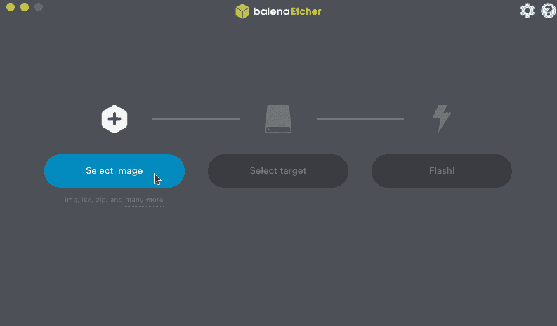
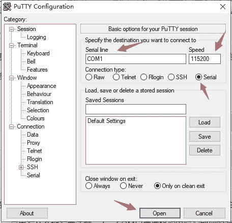
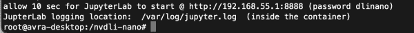

# 机器学习@ Home Kit 连接指南

> 原文：<https://learn.sparkfun.com/tutorials/machine-learning--home-kit-hookup-guide>

## 介绍

机器学习席卷了技术世界。

从智能电子邮件分类，使其更容易筛选您的收件箱，到 ML 应用程序，破译您的笔迹，并允许您将支票存入手机，到医疗诊断，如检测癌症。在这一点上，机器学习实际上在我们生活的几乎每个方面都无处不在。

机器学习本身就是一个简单的想法——ML 算法使用历史数据作为输入来预测新的输出值。然而，机器学习的实际实践使用复杂的数学，并需要相当多的计算能力，这似乎难以独自实现。但幸运的是，我们不再需要从头开始构建机器学习模型——有几十个 API 已经构建了复杂的数学来运行 ML 模型，我们可以只使用带有特定参数的库。

这太好了，这意味着我们可以访问各种各样的机器学习模型，我们可以在我们的计算机上运行。但这并不总是感觉超级有形，只是在你的笔记本电脑上运行模型。如果你想在现实世界中，在你的日常生活中实现机器学习，会怎么样？你如何从建立和训练一个模型到部署来解决你现实生活中的问题？

欢迎使用 Machine Learning @ Home Kit——这旨在帮助您弥合构建和训练机器学习模型之间的差距，并以有形和有意义的方式部署它们。

[](https://www.sparkfun.com/products/18157) 

将**添加到您的[购物车](https://www.sparkfun.com/cart)中！**

### [spark fun Machine Learning @ Home Kit for NVIDIA Jetson Nano](https://www.sparkfun.com/products/18157)

[Only 1 left!](https://learn.sparkfun.com/static/bubbles/ "only 1 left!") KIT-18157

该工具包是作为英伟达 DLI 课程工具包的扩展工具包设计的，作为对机器学习的介绍

$123.50[Favorited Favorite](# "Add to favorites") 8[Wish List](# "Add to wish list")** **NVIDIA 的 Jetson Nano 具有强大的 GPU 功能，非常适合 ML 应用。这个套件通过许多不同的 SparkFun Qwiic 板将机器输出和交互带入画面，让您将机器学习变成机器工作！

这个特定连接指南的目标是扩展 NVIDIA 的[Jetson Nano 上的 AI 入门](https://courses.nvidia.com/courses/course-v1:DLI+S-RX-02+V2/about)课程的内容，以在您自己的家中以实用的方式实现机器学习。它将是“活的”，这意味着它将被周期性地迭代，并且随着时间的推移将添加额外的项目。我们将讨论如何脱离 Jupyter 实验室并实际部署应用程序，以及如何在部署后战略性地运行应用程序。例如，我们将回顾如何通过在引导时启动程序，或者使用运动传感器/按钮而不是让程序一直运行来节省电力。

让我们立即开始，看看该套件中包含了什么，这样我们就可以开始构建了！

## 套件概述

Machine Learning @ Home Kit 包括将 Nvidia Jetson Nano 学习体验提升到家庭或办公室实用水平所需的所有硬件。我们决定利用开发板的 SparkFun Qwiic 生态系统，将布线保持在最低限度，并让您在没有电线、焊接或交叉的情况下启动和运行硬件。在本节中，我们将回顾不同的 Qwiic 板和套件组件，但我们确实想花点时间了解硬件方面的其他要求。

## 必备硬件

Machine Learning @ Home 套件不包括 Nvidia Jetson Nano 或任何入门所需的附件。

[](https://www.sparkfun.com/products/16389) 

将**添加到您的[购物车](https://www.sparkfun.com/cart)中！**

### [【斯帕克芬 DLI 套装(不带杰特森纳米)](https://www.sparkfun.com/products/16389)

[Out of stock](https://learn.sparkfun.com/static/bubbles/ "out of stock") KIT-16389

随着 Jetson Nano 开发工具包(不包括在内)的发布，NVIDIA 增强了开发人员、研究人员、学生和家庭用户的能力

$84.501[Favorited Favorite](# "Add to favorites") 2[Wish List](# "Add to wish list")** **一步到位的最好的第一步是拿起 DLI 课程套件，其中包括你需要的所有附件，包括 Nvidia Jetson Nano(如果你还没有)、电源和电缆(2GB 的 USB 或 4GB 的 5V 4A 桶)、操作系统的 microSD 卡和 USB 网络摄像头。有了 DLI 的课程包，我们强烈建议您参加深度学习学院的免费在线课程，让您熟悉 Nano 本身，获得所有的软件设置，并准备好开始体验 Jupyter Labs。

## 套件内容

现在，回到机器学习@ Home Kit！该工具包包括一系列硬件，旨在让你将机器学习项目从 Jupyter 实验室转移出来，并将显示器的反馈作为回应转移到物理世界。让我们一起来看看这些组件吧！

#### 物联网中继

你想用你的微控制器控制一个标准的墙壁插座设备，但又不想弄乱高压电线吗？物联网功率继电器是一种可控功率继电器，配有四个输出，可帮助您创建一个具有安全、可靠功率控制的物联网项目。借助物联网电源继电器，您可以轻松控制 Arduino、Raspberry Pi 或其他单板计算机或微控制器设备的电源。它提供了电源开关尾部的替代方案。

[](https://www.sparkfun.com/products/14236) 

将**添加到您的[购物车](https://www.sparkfun.com/cart)中！**

### [物联网电源继电器](https://www.sparkfun.com/products/14236)

[Out of stock](https://learn.sparkfun.com/static/bubbles/ "out of stock") COM-14236

你想用你的微控制器控制一个标准的墙壁插座设备，但又不想弄乱高压电源吗

$34.9520[Favorited Favorite](# "Add to favorites") 67[Wish List](# "Add to wish list")** **物联网电源继电器旨在允许您安全地控制在 3 - 48VDC 或 12 - 120VAC 下运行的插座设备。每个物联网电源继电器都有一个输入(来自附带的 C13 电源线)到四个输出:一个常开，一个常开，两个常关。耐用的 SPDT 控制继电器的额定值为 30/40A，可运行 400，000 次。

在这个套件中，我们将使用继电器能够安全地*和可靠地控制你的房子或办公室周围的较大负载，而不需要切断电线和处理高电流交流电压。最棒的是，你还可以用它来驱动项目，同时控制一个设备！*

#### 伺服 Phat

SparkFun 伺服 pHAT 允许您的 Jetson Nano 通过 I2C 连接以简单明了的方式控制多达 16 台伺服电机。由于其 I2C 功能，这种 PWM 帽子节省了 GPIO 引脚，允许您将它们用于其他目的。伺服 pHAT 还增加了一个串行终端连接，这将允许您连接到串行/UART 兼容的许多其他设备。

[](https://www.sparkfun.com/products/15316) 

将**添加到您的[购物车](https://www.sparkfun.com/cart)中！**

### [树莓派的 SparkFun 伺服 pHAT](https://www.sparkfun.com/products/15316)

[In stock](https://learn.sparkfun.com/static/bubbles/ "in stock") DEV-15316

树莓皮的 SparkFun 伺服 pHAT 允许您的树莓皮控制多达 16 个伺服电机在一个简单的方式…

$11.954[Favorited Favorite](# "Add to favorites") 27[Wish List](# "Add to wish list")** **SparkFun 伺服 pHAT 的电源可以通过 USB-C 连接器提供。这将只给伺服电机供电，或者给伺服电机以及连接到帽子的 Jetson Nano 供电。我们改用 USB-C，让你比以往任何时候都可以给你的伺服系统带来更多的电流。这种 USB-C 连接器还可以用于通过串行端口连接来连接 Nano，从而避免使用显示器和键盘来设置 Nano。要仅向伺服电源轨(而不是 Pi 的 5V 电源轨)供电，只需在隔离跳线上切割一条小走线。这样做可以让你从多个或更大的伺服驱动更重的负载。我们甚至在设计中加入了电源保护电路，以避免损坏电源。该 pHAT 的 16 个伺服电机引脚接头中的每一个都与标准的 3 引脚伺服引脚(接地、5V、信号)隔开，以便更容易连接伺服电机。

#### 伺服系统

简单、低成本、高质量的伺服系统，满足您所有的机电需求。这个伺服是非常相似的大小和规格的 Hitec HS-55。这个小家伙能够接受 6 伏电压并输出 20.8 盎司的电流。0.10 秒/60 时的最大扭矩

[](https://www.sparkfun.com/products/9065) 

将**添加到您的[购物车](https://www.sparkfun.com/cart)中！**

### [【伺服-通用(亚微米尺寸)](https://www.sparkfun.com/products/9065)

[In stock](https://learn.sparkfun.com/static/bubbles/ "in stock") ROB-09065

这是一款简单、低成本、高质量的伺服系统，可以满足您所有的机电需求。这个伺服是非常相似的大小和规格…

$9.9512[Favorited Favorite](# "Add to favorites") 41[Wish List](# "Add to wish list")** **这个小伺服系统配有一个标准的 3 针电源和控制电缆，可以完美地让您的 Nvidia Jetson 项目开始移动！

#### Qwiic 按钮

按钮是与项目交互的一种简单而有触感的方式，但为什么要处理去抖、轮询和连接上拉电阻呢？带有内置红色 LED 的 Qwiic 按钮将所有这些令人讨厌的担忧简化为一个易于使用的 I2C 设备！利用我们的 Qwiic Connect 系统，使用按钮就像连接电缆和加载一些预先编写的代码一样简单！

[](https://www.sparkfun.com/products/15932) 

将**添加到您的[购物车](https://www.sparkfun.com/cart)中！**

### [SparkFun Qwiic 按钮-红色 LED](https://www.sparkfun.com/products/15932)

[In stock](https://learn.sparkfun.com/static/bubbles/ "in stock") BOB-15932

红色 LED 的 SparkFun Qwiic 按钮简化了所有这些讨厌的烦恼，成为一个易于使用的 I2C 设备，没有焊接…

$4.951[Favorited Favorite](# "Add to favorites") 18[Wish List](# "Add to wish list")** **如果你的项目需要多个按钮，不用担心！每个按钮都有一个可配置的 I2C 地址，因此您可以通过 Qwiic 菊花链连接多个按钮，并且仍然可以单独寻址每个按钮。我们的 Arduino 库中有一个例子，它提供了一个超级简单的方法来配置你的 Qwiic 按钮到你想要的任何 I2C 地址。你可以通过 Arduino library manager 搜索“SparkFun Qwiic Button”来下载这个库，或者你可以获得 GitHub repo 作为一个. zip 文件并从那里安装这个库。除了处理闪烁和去抖动之外，Qwiic 按钮具有可配置的中断，可以配置为在按下或点击按钮时激活。我们还在 Qwiic 按钮上实现了一个 FIFO 队列，它保存了按钮被按下时的内部记录。这意味着您的微控制器上的代码不需要浪费宝贵的处理时间来检查按钮的状态，而是可以在按钮被按下或点击时运行一个小功能！关于中断的更多信息，请点击这里查看我们的指南！

#### Qwiic PIR 运动传感器

被动红外(PIR)传感器非常适合检测传感器周围小范围内的运动。170 A spark fun ekmc 4607112k Qwiic PIR 使用来自松下的 EKM 系列 PIR 传感器与 ATTiny84 配对，通过 I2C 与 qw IIC 系统进行交互。EKM 系列 PIR 传感器针对微小运动进行了优化，为持续供电的应用提供运动感测选项。当项目前面确实有检测到的东西时，这是启用网络摄像头或运行机器学习程序的一个好方法！

[](https://www.sparkfun.com/products/17374) 

将**添加到您的[购物车](https://www.sparkfun.com/cart)中！**

### [](https://www.sparkfun.com/products/17374)

[Out of stock](https://learn.sparkfun.com/static/bubbles/ "out of stock") SEN-17374

非常适合在小范围内检测运动，并针对小运动进行了优化，为连续运动提供了运动感应选项

$22.501[Favorited Favorite](# "Add to favorites") 6[Wish List](# "Add to wish list")** **PIR 传感器不会返回特定的距离数据，而是监控来自其视野内物体的红外光，并在感应区域检测到运动时激活信号，这使其非常适合于检测到运动时自动打开设备等应用。应用包括节能的家庭和建筑自动化、自动开关照明控制、安全、电器和物联网。松下的薄型 PIR 运动传感器(10.9 毫米比标准的 14.4 毫米高，为受限的设计节省了空间)由一个创建各种检测区的透镜、一个阻挡非红外光的滤光器、热电传感元件、所有电路的电磁屏蔽和一个获取电信号的阻抗转换器组成。这种 PIR 传感器在 5 米的检测距离和 90 x 90 的检测区域提供跨越 32 个区域的数字输出。

#### Qwiic SerLCD 显示器

SparkFun SerLCD 是一款基于 AVR 的串行 LCD，它为将 16x2 黑色 RGB 液晶显示器添加到您的机器学习项目中提供了一种简单且经济高效的解决方案。

[](https://www.sparkfun.com/products/16396) 

将**添加到您的[购物车](https://www.sparkfun.com/cart)中！**

### [【spark fun 16 x2 SerLCD-RGB 背光(Qwiic)](https://www.sparkfun.com/products/16396)

[In stock](https://learn.sparkfun.com/static/bubbles/ "in stock") LCD-16396

SparkFun Qwiic SerLCD 是一款串行启用的 LCD，为添加 16x2 黑色提供了一种简单且经济高效的解决方案…

$21.952[Favorited Favorite](# "Add to favorites") 8[Wish List](# "Add to wish list")** **我们已经对屏幕背面的 PCB 设计进行了认真的改革，包括一个处理所有屏幕控制的 ATmega328P，这意味着不再需要背包了！该显示器现在可以通过三种不同的方式进行通信:串行、I2C 和 SPI。该版本配备了 Qwiic 连接器，将串行液晶显示器带入 Qwiic 生态系统。这简化了所需导线的数量，并允许您的项目显示所有类型的文本和数字。

#### Qwiic SparkFun 环境组合传感器

SparkFun CCS811/BME280 环境组合突破通过流行的 CCS811 和 BME280 ICs 满足您所有的大气质量检测需求。这一独特的突破提供了各种环境数据，包括大气压力、湿度、温度、TVOCs 和等效 CO2(或 eCO2)水平。为了使它更容易使用这个突破，所有的通信都是通过 I2C，利用我们方便的 Qwiic 系统专门制定的。然而，我们仍然有 0.1 英寸间距的引脚，以防您更喜欢使用试验板。

[](https://www.sparkfun.com/products/14348) 

### [【spark fun 环保组合 Breakout-CCS 811/BME 280(Qwiic)](https://www.sparkfun.com/products/14348)

[Out of stock](https://learn.sparkfun.com/static/bubbles/ "out of stock") SEN-14348

SparkFun CCS811/BME280 环境组合突破满足您所有的大气质量感测需求

20[Favorited Favorite](# "Add to favorites") 63[Wish List](# "Add to wish list")

CCS811 是一款非常受欢迎的传感器，可提供百万分之一(PPM)当量 CO2(或 eCO2)和十亿分之一(PPB)总挥发性有机化合物的读数。CCS811 还具有一个功能，如果它可以访问当前的湿度和温度，它可以微调其读数。幸运的是，BME280 提供了湿度、温度和气压！这使得传感器能够协同工作，给我们提供比它们单独工作时更准确的读数。我们也让通过 I2C 与他们交流变得容易。

## 软件概述和设置

这一节将从软件的角度引导您起步。随着 Nvidia Jetson 2GB 的出现，Docker 及其容器也成为管理不同操作系统映像的一种方式，而不是将不同的操作系统映像刻录到 microSD 卡上，并在需要时进行交换。

对于那些不熟悉 Docker 容器的人来说，它们是软件的可移植单元，结合了一个应用程序及其所有依赖项(代码、运行时、系统工具、系统库等)。)集成到一个独立于主机操作系统的软件包中。换句话说，不管其环境如何，应用程序将始终运行相同的程序。这消除了重复从头构建复杂环境的需要，并简化了部署应用程序的过程。

首先，我们可以将基本操作系统刻录到 microSD 卡上，下载我们正在处理的内容所需的任何容器，然后打开这些容器。对于那些习惯于为 Raspberry Pi 或其他单板计算机管理 SD 卡的人来说，这个过程有点不同，而且是新的，但这是一个改进，在时间方面更有效。

这一部分有点长，但是设置是启动和运行您的第一个家庭自动化项目的关键部分！因此，请慢慢来，正确配置所有设置。

### NVIDIA Jetson Nano 操作系统映像

尽管谈论了所有的容器，我们仍然需要一个基本的操作系统。你可以在这里找到来自 Nvidia 的最新图片。

一旦你下载了它，你就可以根据你电脑的操作系统(Windows、macOS 或 Linux)按照 Nvidia 的[指令](https://developer.nvidia.com/embedded/learn/get-started-jetson-nano-devkit#write)将图像写入你的 microSD 卡。

[](https://cdn.sparkfun.com/assets/learn_tutorials/1/9/2/4/Install_JetsonNano_OS.gif)

### 通过显示器或无头设备进行设置和引导

您可以通过两种方式加载操作系统映像并设置您的 Jetson Nano:连接显示器、键盘和鼠标，或者通过与另一台计算机的连接以无头模式。

如果选择第一种方法，只需插入 microSD 卡，通过 HDMI 连接显示器，通过 USB-C 连接电源，通过 USB 连接键盘和鼠标。Nano 将启动——这可能需要几分钟——并会将您带到一个配置窗口。这将指导您选择时区、键盘语言和设置用户配置文件。

通过 headless 模式设置是非常相似的...你仍然需要通过 USB-C 连接电源并插入 microSD 卡，但你需要将 Micro USB-C 连接到电脑，而不是连接显示器、鼠标和键盘。使用终端应用程序( [PuTTY](https://www.putty.org/) 流行于 Windows， [Serial](https://www.decisivetactics.com/products/serial/) 用于 MAC)，可以通过 USB 串行通信与 Jetson Nano 进行通信。

如果你使用 PuTTy，你必须进入 Windows 的设备管理器，寻找通信端口，以确定 Jetson Nano 在哪个端口下运行。如果您找不到通信端口，请转到设备管理器中的操作菜单，然后选择添加旧硬件。您将通过单击“下一步”继续浏览菜单，这将带您到可以安装的硬件列表。选择端口(COM & LPT)，继续单击下一步(标准端口类型选项将起作用)，您就完成了。在 puTTY 中，输入 COM 端口号，并将速度设置为 115200。

[](https://cdn.sparkfun.com/assets/learn_tutorials/1/9/2/4/puTTy.jpeg)

如果你使用串口，这个设备会出现在 USB 标签中，你可以双击它进入 Nano 的终端。记住在终端中按一次 enter，提示它询问您用户/密码设置，否则光标会闪烁。

[](https://cdn.sparkfun.com/assets/learn_tutorials/1/9/2/4/Serial.png)

在 Nano 的终端中，无论您通过 USB 串行通信采用何种方式，Jetson Nano 都会提示您与连接到显示器时相同的配置设置。这将通过[命令行](https://docs.nvidia.com/jetson/l4t/index.html#page/Tegra%20Linux%20Driver%20Package%20Development%20Guide/flashing.html#wwpID0E0WB0HA)来完成，而不是通过 GUI。

### 网络设置

不幸的是，Jetson Nano 没有配备 Wifi，但我们需要它来访问 DLI 课程 Docker 容器和 JupyterLabs。有几种方法可以连接到 WiFi -乍一看，很明显 Nano 配备了一个以太网端口，所以你只需使用以太网电缆就可以连接到你的个人网络。

然而，你可能想无线使用 Jetson Nano，最简单的方法是使用插入 USB 端口的无线网络适配器，就像我们这里携带的 Edimax 适配器[一样](https://www.sparkfun.com/products/17598)。这些适配器工作起来很顺畅；在大多数情况下，没有额外的驱动程序需要安装或设置(如果有*需要安装*驱动程序，我们已经写了一个[教程](https://learn.sparkfun.com/tutorials/adding-wifi-to-the-nvidia-jetson/)来教你如何做)。一旦 USB 被插入 Nano，设备就会自动识别它，你就可以选择你的网络了。

如果您使用 2GB 和单独的显示器，通过随附的 WiFi 加密狗连接应该很简单，只需使用 GUI 并在设置过程中选择您的网络。

如果你通过 headless 模式操作你的 Jetson Nano，你必须使用命令行连接到网络。我们将从使用以下命令开始:

`ifconfig wlan0` `Enter`

ifconfig 代表接口配置，因此它允许您设置 Nano 的网络接口。wlan0 是第一个无线网络接口的名称。这将告诉我们 wlan0 的状态-如果 Wifi 适配器加密狗没有正确插入或工作，您将不会看到如下所示的状态。

[](https://cdn.sparkfun.com/assets/learn_tutorials/1/9/2/4/wlan0.png)

一旦我们知道适配器正在工作并且设备能够连接到网络，我们就可以通过键入以下命令来列出所有可能的网络连接，该命令调用网络管理器:

`nmcli d` `Enter`

如下图所示，wlan0 设备未连接任何设备。因此，要连接到我的网络，我们必须首先使用以下提示来确保 WiFi 模块已打开:

`nmcli r wifi on` `Enter`

然后，我们可以扫描可见的 WiFi 网络列表，以及它们的信号强度、数据速率、信道、安全性等。

`nmcli d wifi list` `Enter`

[](https://cdn.sparkfun.com/assets/learn_tutorials/1/9/2/4/Connect2Wifi_1.png)

一旦您看到要连接的无线网络，请键入以下命令，并记住 SSID 和密码都区分大小写。

`sudo nmcli d wifi connect [SSID] password [PASSWORD]` `Enter`

如果 WiFi 是公共的且没有密码，则以下命令可用于连接:

`nmcli --ask dev wifi connect [SSID]` `Enter`

最后，您可以通过提示网络管理器向您显示所有活动连接来检查您是否已连接:

`nmcli con show --active`

[](https://cdn.sparkfun.com/assets/learn_tutorials/1/9/2/4/Connect2Wifi_2.png)

如果你遇到问题，参考我们写的教程,里面有摆脱困境的参考。

### 下载并安装 DLI 课程容器

一旦您的 Jetson Nano 启动并运行，并且基本配置完成(包括通过 WiFi 或以太网将其连接到您的个人网络)，请打开命令提示符并键入以下命令来下载 DLI 课程容器，我们将使用该容器作为我们的起点，然后在进行过程中添加它！

`docker pull nvcr.io/nvidia/dli/dli-nano-ai:v2.0.1-r32.6.1` `Enter`

下载该容器需要一些时间。这是喝杯咖啡、看些 YouTube 视频或小睡一会儿的好时机！

### 启动 DLI 课程容器

当容器映像完全下载后，您将再次获得对命令提示符的控制。完成后，您可以通过在提示符下键入以下命令来启动容器。请确保您的 USB 摄像头在这一点上插入。

```
sudo docker run --runtime nvidia -it --rm --network host --volume ~/nvdli-data:/nvdli-nano/data --device /dev/i2c-1 --device /dev/video0  nvcr.io/nvidia/dli/dli-nano-ai:v2.0.1-r32.6.1 
```

请注意，这是在一行上运行的一个命令——您应该一起运行它。NVIDIA 很好地解释了运行 Docker 容器和其中的 JupyterLabs 的命令:

*   -运行时 nvidia 将在运行 l4t-base 容器时使用 NVIDIA 容器运行时
*   -这意味着以交互模式运行
*   - rm 将在完成后删除容器
*   -网络主机允许容器使用您的 Jetson 主机网络和端口
*   - volume 定义了一个挂载目录，用于在 Jetson 主机和容器之间共享持久数据文件和 USB 摄像头
*   -设备允许访问视频设备

该命令将在本地 Docker 容器中启动个人 JupyterLab 服务器。因为无论何时您想要构建应用程序，都将使用它，这大概是经常的，所以我建议使用 nano 文本编辑器创建一个 Bash 脚本，这样您就不必每次都去寻找命令，您可以直接运行脚本。如果你想这样做，打开一个像 nano 这样的文本编辑器(你总是可以使用`sudo apt install nano`来安装它)，复制并粘贴上面的命令，并用. sh 扩展名保存文件。您需要使用 chmod 命令`chmod +x script-name-here.sh`设置脚本的执行权限，然后您就可以使用`./script-name-here.sh`随时运行您的脚本。

如果您以前运行过 DLI 课程容器，您可能会注意到，这个命令与您在课程材料中找到的以前版本相比略有不同。我们为`/dev/i2c-1`增加了一个设备标志。该选项允许容器访问 i2c-1 总线，所有 SparkFun Qwiic 板都将通过该总线进行连接。如果没有这个标志，当您开始尝试使用套件中的不同板时，会出现一系列错误。

当显示以下消息时，您将知道 DLI 课程容器已启动并成功完成:

[](https://cdn.sparkfun.com/assets/learn_tutorials/1/9/2/4/JupyterLab_Launch.png)

复制 url(就是 Nano 的特定 IP 地址后跟:8888)并使用密码`dlinano`进入 JupyterLabs。请注意，我们已经在文件夹`nvdli-nano`中，这使我们能够访问 DLI-纳米笔记本目录。

### 导航木星实验室

欢迎来到 JupyterLab！JupyterLab 使您能够用笔记本、文本文件、终端和笔记本输出来安排您的工作区域。主页将为您提供从头开始和创建自己的 Python 3 笔记本或控制台的选项，以及打开终端选项卡或创建 Markdown 文件。而且，因为我们将 DLI 课程图像加载到了 Nano 上，所以我们可以访问所有相关的课程文档和示例，如文件目录中所示。

[](https://cdn.sparkfun.com/assets/learn_tutorials/1/9/2/4/JupyterLab.png)

一旦您登录到 Jupyter 笔记本电脑，您将需要打开一个新的终端窗口来下载用于 Qwiic 板的 Jupyter 笔记本电脑，并安装 Qwiic Python 库。

从启动窗口打开终端窗口后，您可以使用以下命令从 GitHub 下载 SparkFun Qwiic Jupyter 笔记本:

`git clone https://github.com/d1runberg/qwiic-jupyter-nb.git` `[Enter]`

该命令将下载一个文件夹，其中包含我们 Jupyter 笔记本的内容以及显示图像所需的资源等。你现在应该可以在 JupyterLabs 左侧的目录树中看到 SparkFun Qwiic 笔记本目录了！

[](https://cdn.sparkfun.com/assets/learn_tutorials/1/9/2/4/QwiicLibraries.png)

一旦 SparkFun Qwiic 笔记本下载完成，你需要安装 Qwiic Python 库，然后才能使用它们。

### 安装 Qwiic 库

在 Jupyter 笔记本的终端窗口仍然打开的情况下，您可以通过 pip 键入以下命令来安装 SparkFun Qwiic Python 库:

`pip3 install sparkfun-qwiic` `[Enter]`

这将安装整个 Qwiic Py 包，其中包含 Python 中支持的 Qwiic 板的库。

安装完成后，您应该可以关闭终端窗口了。

您可以正式开始开发应用程序了！请记住，我们打开的容器是为了在完成时删除该容器，因此如果您现在关闭 JupterLabs，您将会丢失刚刚下载并安装的 Qwiic Jupyter 笔记本和 Qwiic 库。

您可以使用几乎任何具有 [python 库](https://github.com/sparkfun/Qwiic_Py)的 Qwiic 设备，这意味着您可以将您的项目扩展到远远超出机器学习工具包的范围。在你深入研究机器学习之前，确保你已经熟悉了[在 JupterLabs](https://learn.sparkfun.com/tutorials/working-with-qwiic-on-a-jetson-nano-through-jupyter-notebooks?_ga=2.55583907.964891127.1632153031-231345100.1580276392#running-an-example-in-jupyter-notebooks) 用 Qwiic 板运行一个例子。

## 工作坊 1:制作宠物喂食器

好吧，让我知道这听起来对你来说是否熟悉——你有一个粗暴的 _____ 倾向于偷超过允许的食物。填补空白...可能是一只宠物，一个孩子，一个朋友(他们真的是吗？)或者室友。不管是谁，对你来说都有问题，要么是因为他们拿走了你的食物，要么就是他们吃得太多了。而且，自己监控也是累死人的！如果你能创造一个只为特定的人/宠物打开的自动食物箱，会怎么样？

这是一种机器学习@ Home 工具包能够很好地处理的问题。它需要一个系统，可以使用图像作为数据来确定食品箱是否被打开。回到 GTC 2021，我们的一个创意技术专家，德里克，实际上建造了它，如下图链接所示。强烈建议浏览并观看整个演示，因为它为使用 Jetson Nano 进行图像分类提供了一个完整的框架，并展示了如何通过更改很少的代码来构建一个完全不同的项目。此外，这实际上是一步一步地解释如何建立自己的宠物/人类喂食器。

[https://www.youtube.com/embed/jbnzdNQc-2E/?autohide=1&border=0&wmode=opaque&enablejsapi=1](https://www.youtube.com/embed/jbnzdNQc-2E/?autohide=1&border=0&wmode=opaque&enablejsapi=1)

由于 Derek 在视频中很好地构建了项目的硬件部分，我们将在这里对他所做的软件更改进行一次排练。

首先需要将 SparkFun Pi 伺服 pHAT 连接到 Jetson Nano，然后是伺服本身。你可以观看视频，了解打开和关闭“垃圾桶”的机制。

[](https://cdn.sparkfun.com/assets/learn_tutorials/1/9/2/4/IMG_2206.jpg)

正如 Derek 所解释的，需要对本项目的 DLI 课程示例代码进行两项重大修改。首先是编写一个 python 脚本来操作 Qwiic 伺服系统。第二种方法是将图像分类的参数更改为您自己和您想要阻止吃食物的任何人的输入。

让我们处理 Python 中的第一部分——通过 Pi 伺服 pHAT 驱动 Qwiic 伺服。在 JupyterLabs 中打开一个空白的 Python 3 笔记本，并测试以下脚本。它将使用 Pi 伺服帽库来启动伺服，并在特定时间移动它特定的增量。

```
#import the necessary libraries
import pi_servo_hat
import time
import math
import sys

#an object of our servo
myServo = pi_servo_hat.PiServoHat()

#starts up the servo
myServo.restart()

#initializes the position at (0,0)
myServo.move_servo_position(0,0)

#pauses for 1 second
time.sleep(1)

#moves the position 180 degrees
myServo.move_servo_position(0,180)

#pauses for 1 second
time.sleep(1)

#moves back to the initialized position
myServo.move_servo_position(0,0) 
```

好的，我们已经让伺服系统开始运转了，我们可以用它来打开和关闭我们的食物箱。但是，我们需要它只在特定的人/宠物在箱子前面时移动。这就是机器学习分类与 USB 摄像头的关系。

在 JuptyerLabs 中，进入 classifications 文件夹并打开 classification _ interactive . ipynb 文件。这个笔记本是各种各样的模板，用于数据收集、培训和测试杰特森纳米和相机；DLI 的课程已经为你准备了一些例子，比如判断你的拇指是向上还是向下，你的情绪，你举起了多少根手指，或者你自己的 DIY 任务。但是，无论您正在训练哪个数据集，数据集合和模型实际上都保持不变，只是数据的内容发生了变化。从运行所有代码块开始，直到任务部分。

我们一到这里，笔记本里的东西就开始变化了。我们将注释掉“拇指”任务，而称之为“diy”任务。类似地，类别将从“拇指向上，拇指向下”变成 diy 的最后一个类别。在这里，你将决定你想为谁创建这个食物箱。以德里克为例，他只是做了自己，'德里克'，或者'什么都没有'，这是两个范畴。如果这与您的情况相似(您可以用其他人的名字替换“nothing ”),然后填写类别名称，并将数据集设置为两个变量。如果您有两只宠物和您自己，请填写变量名，然后取消带有三个变量的数据集选项的注释。现在您可以运行代码块了。下面是一个例子，说明它可能是什么样子:

[](https://cdn.sparkfun.com/assets/learn_tutorials/1/9/2/4/Screen_Shot_2021-09-21_at_11.46.50_AM.png)

因为我们没有改变模型本身，所以我们可以继续往下走，直到到达实时执行代码块。正是在这里，我们实际上可以根据谁在摄像机前来调用伺服移动。首先，我们将在其他库导入下添加 pi_servo_hat 库。然后，在 live 函数下，我们可以添加以下代码，根据摄像机前的人实时移动伺服。

```
if prediction_widget.value == 'Pet 1':
    myServo.move_servo_position(0,180) #open the food bin
else:
    myServo.move_servo_position(0,0) #close the food bin 
```

由于只允许一个宠物/人进入食物箱，else 语句涵盖了所有其他场景，其中要么什么都没有出现，要么错误的人/宠物出现在摄像机前。

[](https://cdn.sparkfun.com/assets/learn_tutorials/1/9/2/4/Screen_Shot_2021-09-21_at_11.53.14_AM.png)

一旦你运行了所有的代码块，你会发现交互式工具已经准备好了。单击您想要训练的类别(宠物 1 或宠物 2 或什么都不要)，并开始添加该特定类别的照片。越多越好，但至少要拍 100 张。尝试得到所有的角度和所有的情况，也许这意味着狗有没有项圈，去美容院之前和之后，等等。对你拥有的类别继续这样做。

下一步是决定精确应用需要多少个历元或整个训练数据集的周期。在样本数据上训练机器学习模型时，实际上有一个有趣的问题，叫做过度拟合。过度拟合是指使用了太多的历元，训练模型学习的模式对于样本数据来说过于具体，因此在处理真实世界数据时准确性较低。摆弄一下较低数量和较高数量的纪元如何改变你的模型对真实世界输入的反应方式，但是现在，让我们做 5 个纪元。

也就这样了，你准备好训练模型了！一旦经过训练，你就可以通过展示相机真实世界的数据来测试它的准确性，比如你的脸或你的狗的脸。当你显示你设置的打开食物箱的类别的输入时，它就应该这样做。现在没人能得到你的彩虹糖了，它们都是给你的！

## 工作坊 2:用香蕉烹饪

正如你所看到的，我们正试图构建一些对家庭有所帮助的应用程序；尤其是因为这些天我们都花了更多的时间在家里。具体来说，可以使用硬件解决的问题，从而将机器学习带入物理和有形的世界。

另一个可以解决的问题是厨房里的食物浪费。有时候，你只是没有时间去吃最新鲜的食物，但你仍然不想浪费它，扔掉它。对此最常见的食物之一就是香蕉！当香蕉变坏时，把东西混合起来烤香蕉面包是很有趣的，但是你很快就会厌倦香蕉面包，这使得用熟透的香蕉烹饪变得非常棘手。你还能用任何成熟度的香蕉做什么其他的食谱？机器学习@ Home Kit 能仅仅通过看一眼香蕉就告诉你要做什么吗？

[](https://cdn.sparkfun.com/assets/learn_tutorials/1/9/2/4/banana.jpeg)

让我们把它建出来；这与宠物喂食器非常相似，因为我们只是给了模型不同的训练数据，并使用了不同的 Qwiic 设备。首先，我们将 Qwiic SerLCD 连接到 Pi 伺服 pHAT，并做和以前一样的事情:简单地测试一下我们是否能在 JupyterLabs 中让它工作。

```
from __future__ import print_function
import qwiic_serlcd
import time
import sys

def runExample():

    print("\nSparkFun Qwiic SerLCD   Example 1\n")
    myLCD = qwiic_serlcd.QwiicSerlcd()

    if myLCD.connected == False:
        print("The Qwiic SerLCD device isn't connected to the system. Please check your connection", \
            file=sys.stderr)
        return

    myLCD.setBacklight(255, 255, 255) # Set backlight to bright white
    myLCD.setContrast(5) # set contrast. Lower to 0 for higher contrast.
    myLCD.clearScreen() # clear the screen - this moves the cursor to the home position as well

    time.sleep(1) # give a sec for system messages to complete

    myLCD.print("Hello World!")
    counter = 0
    while True:
        print("counter: %d" % counter)
        myLCD.setCursor(0,1)
        myLCD.print(str(counter))
        counter = counter + 1
        time.sleep(1)

if __name__ == '__main__':
    try:
        runExample()
    except (KeyboardInterrupt, SystemExit) as exErr:
        print("\nEnding Example 1")
        sys.exit(0) 
```

太好了，显示器检查过了！现在，让我们回过头来为这个新项目制作一个 classification _ interactive . ipynb 副本，在这里我们将再次运行所有内容，直到任务部分。

这一次，我们将有五个不同的类别:“非常不成熟”、“不成熟”、“成熟”、“非常成熟”、“过熟”。这意味着我还必须添加额外的数据集…一直到“E”。

同样，我们可以运行所有的代码块直到实时执行。我们仍将像处理伺服系统一样导入 SerLCD 库，并为它创建一个对象。在这种情况下，我们将写出一个不同的 if 语句，它可以适应香蕉的每种情况。因此，如果香蕉没有完全成熟，显示屏将会推荐一个不同于香蕉非常不成熟的烹饪方法，等等。它的结构可以类似于这样:

```
if prediction_widget.value == 'Very Unripe':
    myLCD.print("Make some fried green bananas")
if prediction_widget.value == 'Unripe':
    myLCD.print("Make bananas foster")
if prediction_widget.value == 'Ripe':
    myLCD.print("Make some fried green bananas")
if prediction_widget.value == 'Very Unripe':
    myLCD.print("Make a fruit smoothie")
if prediction_widget.value == 'Very ripe':
    myLCD.print("Make banana pancakes")
if prediction_widget.value == 'Overripe':
    myLCD.print("Make banana bread") 
```

这将再次把我们带回到交互式工具，这次将花费更多的时间，因为我们需要每个成熟阶段的数据。因此，买一些非常不成熟的香蕉，在一两个星期的过程中，定期在每个阶段训练它们。同样，获得尽可能多的不同观点和意见也很重要。最后，训练数据，看看你的 Qwicc SerLCD 显示器推荐你做什么！

## 研讨会 3:电力负荷

我们看到的一个主要用例是自动化电力负载和电气系统。假设你忘记关掉烤箱，离开家一段时间，这是我们大多数人都会遇到的事情，也是一个真正的安全问题！或者，你只是想在离开房间时更加自觉地关灯。如果你只想在办公桌前开着灯呢？我们可以使用机器学习@ Home 工具包来实施这些性质的项目，因为它带有一个物联网电源继电器。

NVIDIA 有一个专门用于操作 Jetson GPIO 的 [Python 库](https://pypi.org/project/Jetson.GPIO/)，用于输入或输出。我们必须首先在 Nano 上本地安装这个包(在 JupyterLabs 之外),对它进行测试，然后将它添加到 docker 命令来封装库。

回到你正在使用的终端模拟器(比如串口)，我们可以安装 Jetson。带有以下命令的 GPIO 库:

`sudo pip install Jetson.GPIO`

然后，我们必须通过创建一个组来设置权限，并将您的用户名添加到可以访问 GPIO 的组中。如果不知道自己的用户名，只需写出命令`whoami`。

`sudo groupadd -f -r gpio`

`sudo usermod -a -G gpio your_user_name`

最后，为了让新规则生效，要么使用命令`sudo reboot`重新启动 Nano，要么运行以下命令重新加载 udev 规则:

`sudo udevadm control --reload-rules && sudo udevadm trigger`

既然库已经安装好了，我们几乎准备好测试它了。将您的跳线连接到绿色插座中的螺丝端子，然后将它们连接到 Nano 上您选择的接地引脚和数字引脚。现在，只需输入 python3 就可以打开 python3 解释器，并运行下面的脚本。

```
#load in libraries
import Jetson.GPIO as GPIO 
import time

#sets the pin getting power sent to
output_pin = 21

#set pin numbering
GPIO.setmode(GPOI.BCM)

#setup GPIO channel with pin, ouput, and what the initial value is
GPIO.setup(output_pin, GPIO.OUT, initial = GPIO.LOW)

#set value of output pin
GPIO.output(output_pin, GPIO.HIGH)

time.sleep(10)

#clean up the channels so that all pins are set in their default state
GPIO.cleanup() 
```

现在你知道该怎么做了，是时候进入任务了，改变需要的类别和数据集。如果你只想让灯在你坐在办公桌前的时候打开，你只需要两个数据集:你，其他什么都不需要。

[](https://cdn.sparkfun.com/assets/learn_tutorials/1/9/2/4/Screen_Shot_2021-09-21_at_3.02.39_PM.png)

在 Live Execution 中，我们将物联网中继设置为仅在类别设置为面部时打开。所以 if 语句看起来非常类似于宠物喂食器的情况……如果你在框架中，那么它就是 if 语句，否则就是任何其他场景。完整的代码在这里设置[。](https://github.com/HaywardPeirce/PI-IoT-Relay.)

几乎任何家庭自动化都可以通过 Machine Learning @ Home Kit 访问，现在您已经知道如何浏览和训练各种数据集，我们可以将它们部署为现实世界的应用程序。这就是我们接下来要讨论的，本期直播节目将继续。*****************