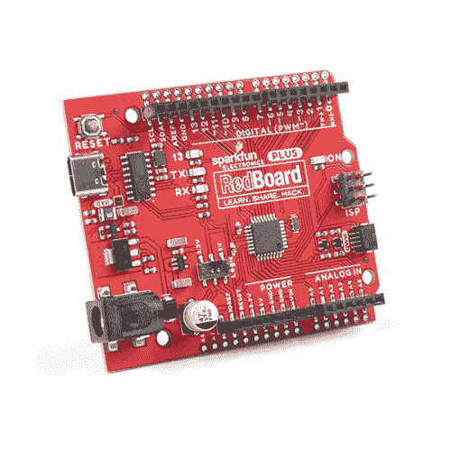
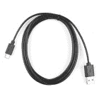
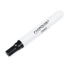
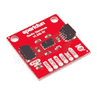
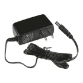
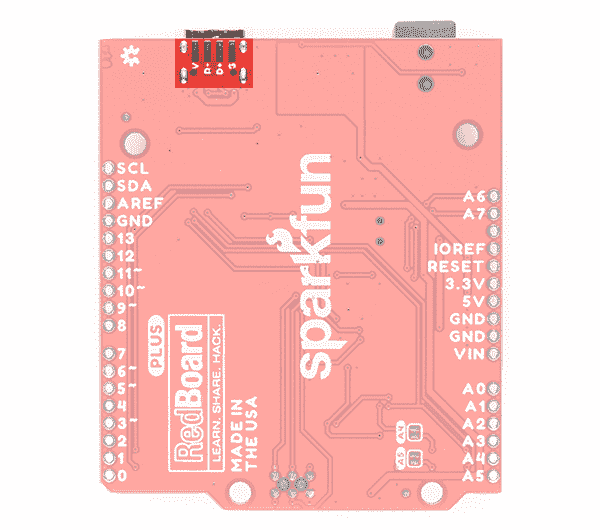
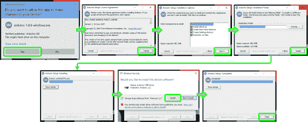
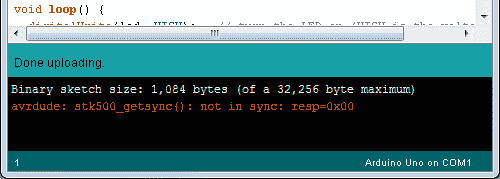

# RedBoard Plus 连接指南

> 原文：<https://learn.sparkfun.com/tutorials/redboard-plus-hookup-guide>

## 介绍

[SparkFun RedBoard Plus](https://www.sparkfun.com/products/18158) 是一款兼容 Arduino 的开发板，结合了来自*经典*red board 和 [RedBoard Qwiic](https://www.sparkfun.com/products/15123) 的设计。RedBoard Plus 对其前代产品进行了一些关键改进(参见[硬件概述](https://learn.sparkfun.com/tutorials/redboard-plus-hookup-guide#hardware-overview))。然而，就像最初的*red board 一样，它被设计成一个易于使用的学习平台，用于编码、物理计算和项目原型开发。这些技能在今天的教育和技术领域变得越来越重要。*

[](https://www.sparkfun.com/products/18158) 

将**添加到您的[购物车](https://www.sparkfun.com/cart)中！**

 **### [SparkFun RedBoard 加](https://www.sparkfun.com/products/18158)

[In stock](https://learn.sparkfun.com/static/bubbles/ "in stock") DEV-18158

RedBoard Plus 是一款兼容 Arduino 的开发板，拥有 Arduino Uno 所需的一切，并具有额外的额外功能…

$21.504[Favorited Favorite](# "Add to favorites") 12[Wish List](# "Add to wish list")** **[https://www.youtube.com/embed/giX2B__Oklw/?autohide=1&border=0&wmode=opaque&enablejsapi=1](https://www.youtube.com/embed/giX2B__Oklw/?autohide=1&border=0&wmode=opaque&enablejsapi=1)

本教程旨在让您熟悉 RedBoard Plus，并帮助您开始使用它。首先，我们将指导您完成 [Arduino IDE(集成开发环境)软件](https://www.arduino.cc/en/Guide/HomePage)的安装，这是对主板进行编程的主要用户界面。接下来，我们将讨论主板的硬件和特性。最后，我们将带您看几个使用 Arduino IDE 的例子。

RedBoard Plus 可以与现实世界的传感器进行交互，控制电机，显示信息，并执行近即时计算。它使任何人都能创造出独特、漂亮的项目，从简单到在液晶显示器上显示字符的 T2 或检测光线变化的 T4，再到复杂得多的项目，如物联网蜂窝设备...从简单的事情开始，一步一步来。).如果你熟悉最初的*red board 和 RedBoard Qwiic 是如何工作的，你可能想浏览一下本教程的部分内容。*

### 所需材料

要开始，你只需要几样东西。你可能不需要所有的东西，这取决于你拥有什么。将它添加到您的购物车，通读指南，并根据需要调整购物车。

*   [RedBoard Plus](https://www.sparkfun.com/products/18158) -你肯定需要这个；否则，你可能上错了教程(*眨眼*)。
*   [可逆 USB A 转 C 线-2m](https://www.sparkfun.com/products/15424)-USB 接口有两个用途:为电路板供电，并允许您向电路板上传程序。

[](https://www.sparkfun.com/products/18158) 

将**添加到您的[购物车](https://www.sparkfun.com/cart)中！**

 **### [SparkFun RedBoard 加](https://www.sparkfun.com/products/18158)

[In stock](https://learn.sparkfun.com/static/bubbles/ "in stock") DEV-18158

RedBoard Plus 是一款兼容 Arduino 的开发板，拥有 Arduino Uno 所需的一切，并具有额外的额外功能…

$21.504[Favorited Favorite](# "Add to favorites") 12[Wish List](# "Add to wish list")****[](https://www.sparkfun.com/products/15424) 

将**添加到您的[购物车](https://www.sparkfun.com/cart)中！**

 **### [可逆 USB A 转 C 线- 2m](https://www.sparkfun.com/products/15424)

[18 available](https://learn.sparkfun.com/static/bubbles/ "18 available") CAB-15424

这些 2 米长的电缆稍加修改后，就可以插入其端口，而不用考虑其在 U…

$8.951[Favorited Favorite](# "Add to favorites") 4[Wish List](# "Add to wish list")**** ****### 所需软件

你还需要一台安装了 Arduino IDE 的电脑——这就是我们如何对主板进行编程并与之交互。

**Troubleshooting Tip:** If you are not a technical or computer savy individual and you have your choice of computers, a **Windows 7 or 10** computer is highly recommended. You will usually run into the the least issues, if any, with these operating systems.

### 建议的工具和外围设备

就是这些了...很简单，对吧？现在你将不能做太多，因为没有额外的传感器与物理世界互动。然而，你至少可以让 LED 闪烁一下，做一些数学计算。

[**跳线修改**](#Jumper_Materials)[Qwiic 示例](#Example_Materials)

***Click the buttons** above to toggle the **additional materials** based on the tasks you
wish to perform. Feel free to modify the items in your cart to fit your needs.*

#### 跳线修改

If you would like to modify the A4/A5 Qwiic connector jumpers, you will need [soldering equipment](https://www.sparkfun.com/categories/49) and/or a [knife](https://www.sparkfun.com/categories/379).

[](https://www.sparkfun.com/products/14228) 

### [威勒 WLC100 焊台](https://www.sparkfun.com/products/14228)

[Out of stock](https://learn.sparkfun.com/static/bubbles/ "out of stock") TOL-14228

Weller 的 WLC100 是一款多功能的 5 瓦至 40 瓦焊台，非常适合业余爱好者、DIY 爱好者和学生。…

2[Favorited Favorite](# "Add to favorites") 17[Wish List](# "Add to wish list")[](https://www.sparkfun.com/products/9325) 

将**添加到您的[购物车](https://www.sparkfun.com/cart)中！**

 **### [无铅焊料- 100 克线轴](https://www.sparkfun.com/products/9325)

[In stock](https://learn.sparkfun.com/static/bubbles/ "in stock") TOL-09325

这是带有水溶性树脂芯的无铅焊料的基本线轴。0.031 英寸规格，100 克。这是一个好主意…

$9.957[Favorited Favorite](# "Add to favorites") 33[Wish List](# "Add to wish list")****[](https://www.sparkfun.com/products/14579) 

将**添加到您的[购物车](https://www.sparkfun.com/cart)中！**

 **### [芯片快克免清洗助焊剂笔- 10mL](https://www.sparkfun.com/products/14579)

[In stock](https://learn.sparkfun.com/static/bubbles/ "in stock") TOL-14579

这款来自 Chip Quik 的 10 毫升免清洗助焊剂笔非常适合您的所有焊接、脱焊、返工和回流目的！

$8.954[Favorited Favorite](# "Add to favorites") 36[Wish List](# "Add to wish list")****[](https://www.sparkfun.com/products/9200) 

将**添加到您的[购物车](https://www.sparkfun.com/cart)中！**

 **### [爱好刀](https://www.sparkfun.com/products/9200)

[In stock](https://learn.sparkfun.com/static/bubbles/ "in stock") TOL-09200

就像一把 Xacto 刀，只是更好。我们在处理多氯联苯时广泛使用这些技术。这些小刀子很适合切割…

$3.502[Favorited Favorite](# "Add to favorites") 18[Wish List](# "Add to wish list")****** ******#### Qwiic 示例

If you would like to follow along with the examples below to interact with the physical world, you will also need the following items:

[](https://www.sparkfun.com/products/14722) 

将**添加到您的[购物车](https://www.sparkfun.com/cart)中！**

 **### [【spark fun 距离传感器分线点- 4 米，VL53L1X (Qwiic)](https://www.sparkfun.com/products/14722)

[Out of stock](https://learn.sparkfun.com/static/bubbles/ "out of stock") SEN-14722

这种 SparkFun 距离传感器突破利用 VL53L1X 下一代 ToF 传感器模块给你高精度…

$23.5010[Favorited Favorite](# "Add to favorites") 42[Wish List](# "Add to wish list")****[](https://www.sparkfun.com/products/14427) 

将**添加到您的[购物车](https://www.sparkfun.com/cart)中！**

 **### [Qwiic 线缆- 100mm](https://www.sparkfun.com/products/14427)

[In stock](https://learn.sparkfun.com/static/bubbles/ "in stock") PRT-14427

这是一条 100 毫米长的 4 芯电缆，带有 1 毫米 JST 端接。它旨在将支持 Qwiic 的组件连接在一起…

$1.50[Favorited Favorite](# "Add to favorites") 32[Wish List](# "Add to wish list")**** ****### 推荐阅读

**RedBoard Plus** 旨在成为一个初学者友好的微控制器平台。没有关于[欧姆定律](https://learn.sparkfun.com/tutorials/voltage-current-resistance-and-ohms-law)或者[电是如何工作的](https://learn.sparkfun.com/tutorials/what-is-electricity)的先天知识，你也可以开始(但是稍微了解一下也无妨！).以下是一些你应该熟悉的主题；然而，要使用主板的更高级功能，建议您仔细阅读**逻辑电平**和 **I ² C** 教程。

[](https://learn.sparkfun.com/tutorials/what-is-a-circuit) [### 什么是电路？](https://learn.sparkfun.com/tutorials/what-is-a-circuit) Every electrical project starts with a circuit. Don't know what a circuit is? We're here to help.[Favorited Favorite](# "Add to favorites") 82[](https://learn.sparkfun.com/tutorials/what-is-an-arduino) [### 什么是 Arduino？](https://learn.sparkfun.com/tutorials/what-is-an-arduino) What is this 'Arduino' thing anyway? This tutorials dives into what an Arduino is and along with Arduino projects and widgets.[Favorited Favorite](# "Add to favorites") 50[](https://learn.sparkfun.com/tutorials/logic-levels) [### 逻辑电平](https://learn.sparkfun.com/tutorials/logic-levels) Learn the difference between 3.3V and 5V devices and logic levels.[Favorited Favorite](# "Add to favorites") 82[](https://learn.sparkfun.com/tutorials/i2c) [### I2C](https://learn.sparkfun.com/tutorials/i2c) An introduction to I2C, one of the main embedded communications protocols in use today.[Favorited Favorite](# "Add to favorites") 128[](https://www.sparkfun.com/qwiic)

该板的一个新的高级特性是它利用了 [Qwiic 连接系统](https://www.sparkfun.com/qwiic)。我们建议您在使用之前熟悉一下**逻辑电平**和 **I ² C** 教程(如上),因为所有 **Qwiic** 传感器都使用一个 **I ² C** 通信协议。点击上面的横幅，了解更多关于 [Qwiic 产品](https://www.sparkfun.com/qwiic)的信息。

[https://www.youtube.com/embed/x0RDEHqFIF8/?autohide=1&border=0&wmode=opaque&enablejsapi=1](https://www.youtube.com/embed/x0RDEHqFIF8/?autohide=1&border=0&wmode=opaque&enablejsapi=1)

**Fun Fact:** Qwiic is a play on words between "quick" and I²C or "iic".

* * *

## 硬件概述

下面是该板的图形数据表，以及 RedBoard Plus 所有重要特性的概述。所有的 RedBoard Plus 引脚都在电路板的外边缘上断开 0.1 英寸间距的母接头(即连接器)。电源输入/输出、模拟输入和数字输入的引脚组合在一起。

[](https://cdn.sparkfun.com/assets/learn_tutorials/1/7/5/8/RedBoard_Plus_Graphical_Datasheet_v1a.pdf)*Click on image for a closer view*

### 新功能

在 RedBoard Qwiic 的基础上，RedBoard Plus 包含以下更改。

*   **USB C 型连接器**-red board 见过很多类型的 USB 连接器。RedBoard Plus 利用了 USB C 连接器的优势。电路板背面的针脚也断开了！
*   **旁路跳线** -电路板包括一个跳线，用于旁路自复位保险丝。
*   **I/O 逻辑开关** -现在，您可以翻转开关来调整系统电压的逻辑电平，而不是切割跳线焊盘并向电路板添加焊料。
*   **多两个模拟引脚**-A6 和 A7 包括两个额外的模拟引脚。RedBoard 上 Uno R3 的先前设计不包括引脚。这些模拟引脚作为 PTH 焊盘包含在电源引脚中。
*   **PTH 焊盘**-RedBoard Plus 上的所有边缘引脚现在在每个母接头旁都包括一个额外的 PTH 焊盘。这使得电路板稍微宽一点，但你有焊接导线或额外的插头引脚到电路板的优势。

|  |  |
| *RedBoard Qwiic* | *RedBoard Plus* |

### 力量

RedBoard Plus 可以通过 USB 和/或筒式插孔连接器供电。如果您选择通过 USB 供电，USB 电缆的另一端可以连接到**电脑或 5V(稳压)** [USB 壁式充电器](https://www.sparkfun.com/products/11456)。否则，如果您选择使用筒式插孔，连接到该插孔的任何墙壁适配器都应该提供 7 到 15V 之间的 **DC 电压。您也可以通过接头引脚给电路板供电。**

[](https://cdn.sparkfun.com/assets/learn_tutorials/1/7/5/8/18158-SparkFun_RedBoard_Plus_Power.jpg)

#### 桶形千斤顶

筒式插孔接受一个外径为 5.5 毫米、内径为 2.1 毫米的阳性中心连接器。查看本[教程](https://learn.sparkfun.com/tutorials/connector-basics#power-connectors)了解更多关于电源连接器的信息。

[](https://cdn.sparkfun.com/assets/learn_tutorials/1/7/5/8/18158-SparkFun_RedBoard_Plus_Barrel_Jack_Power.jpg)

如果您希望通过筒形插孔为主板供电，我们的 [9V](https://www.sparkfun.com/products/15314) 和 [12V](https://www.sparkfun.com/products/15313) 电源适配器是不错的选择。连接到此插孔的任何墙壁适配器都应提供 7 到 15V 之间的 **DC 电压，如主板上使用的 LM1117 电压调节器的电气特性所指定。电源接头上的输入电压引脚 VIN 直接连接到桶形插孔的输入电压。根据您的项目，您也可以用 DC 桶形插孔适配器连接自己的电源，或者在电源和 RedBoard Plus 之间添加一个开关。**

[](https://www.sparkfun.com/products/10287) 

将**添加到您的[购物车](https://www.sparkfun.com/cart)中！**

 **### [DC 筒式千斤顶适配器——公](https://www.sparkfun.com/products/10287)

[In stock](https://learn.sparkfun.com/static/bubbles/ "in stock") PRT-10287

此适配器允许您将筒式插孔连接器连接到裸线。一端有螺丝端子，另一端有一个 5.5…

$3.50[Favorited Favorite](# "Add to favorites") 16[Wish List](# "Add to wish list")****[](https://www.sparkfun.com/products/15313) 

将**添加到您的[购物车](https://www.sparkfun.com/cart)中！**

 **### [墙壁适配器电源- 12VDC，600mA(筒式插孔)](https://www.sparkfun.com/products/15313)

[In stock](https://learn.sparkfun.com/static/bubbles/ "in stock") TOL-15313

这是一个高质量的交流到 DC 的“壁式电源”，在高达 600 毫安时产生 12v 直流稳压输出。

$6.50[Favorited Favorite](# "Add to favorites") 8[Wish List](# "Add to wish list")****[](https://www.sparkfun.com/products/15314) 

将**添加到您的[购物车](https://www.sparkfun.com/cart)中！**

 **### [墙壁适配器电源- 9VDC，650mA(筒式插孔)](https://www.sparkfun.com/products/15314)

[In stock](https://learn.sparkfun.com/static/bubbles/ "in stock") TOL-15314

这是一个高品质的开关“壁式”交流到 DC 9V 650 毫安壁式电源，专为 SparkFun Elect 制造…

$6.501[Favorited Favorite](# "Add to favorites") 12[Wish List](# "Add to wish list")****[](https://www.sparkfun.com/products/11705) 

将**添加到您的[购物车](https://www.sparkfun.com/cart)中！**

 **### [【M-F】筒式千斤顶电源开关(3)](https://www.sparkfun.com/products/11705)

[In stock](https://learn.sparkfun.com/static/bubbles/ "in stock") COM-11705

我们在这里经常使用桶形千斤顶，有时我们需要在组合中插入一个开关。这通常意味着破解一个人…

$2.75[Favorited Favorite](# "Add to favorites") 28[Wish List](# "Add to wish list")******************Troubleshooting Tips:** The board could operate on an external supply of **6 to 20 volts**, but the recommended range is **7 to 12 volts**. (**If supplied with less than 7V, the 5V pin may supply less than five volts and the board may be unstable. Using more than 12V, the voltage regulator may overheat and damage itself and/or the board.*)

*For more technical details about voltage regulators and thermal dissipation, I suggest taking a look at these blog posts and tutorial:*

*   [根据皮特-电压调节器](https://www.sparkfun.com/news/1067)
*   [Enginursday:线性调节器热测试](https://www.sparkfun.com/news/2173)
*   [功率和散热](https://www.sparkfun.com/tutorials/217)
*   [Enginursday:调压器温度手机 App](https://www.sparkfun.com/news/2258)

#### USB 电源

USB C 线通常是给电路板供电最简单的方式，尤其是在你编程的时候，因为上传代码也需要 USB 接口。电路板背面的针脚是断开的。

*   **V** - USB 输入电压。这个应该是 **5V** 。
*   **D**和 **D+** - USB 数据引脚。这些连接到 CH340 USB 转串行转换器。
*   **G** -接地引脚

| [](https://cdn.sparkfun.com/assets/learn_tutorials/1/7/5/8/18158-SparkFun_RedBoard_Plus_USB_C.jpg) | [](https://cdn.sparkfun.com/assets/learn_tutorials/1/7/5/8/18158-SparkFun_RedBoard_Plus_USB_Pads.jpg) |

一个传统的 USB 口提供调节过的 **5V** ，但是限制在 **500mA** 左右(USB 2.0)。此外，还有一个可复位的保险丝，保护您的计算机免受短路和过电流。如果通过 USB 端口的电流超过约 750 毫安，它会自动调节电流或断开电源，直到短路/过载消除。如果你需要更多，一个桶插孔墙适配器是最好的选择。

#### BYP 跳线

USB C 连接器旁边是一个旁路跳线(标记为 BYP)。如果您出于任何原因需要绕过 PTC 保险丝(额定最大 6V，4A 跳闸电流)，您可以[添加一些焊料来连接跳线](https://learn.sparkfun.com/tutorials/how-to-work-with-jumper-pads-and-pcb-traces/all#adding-a-solder-jumper)。这是推荐给知道自己在做什么的高级用户的。

[](https://cdn.sparkfun.com/assets/learn_tutorials/1/7/5/8/18158-SparkFun_RedBoard_Plus_Bypass_Jumper.jpg)

#### USB 编程

有两种方法可以对 RedBoard Plus 进行编程。如前所述，用户最常用的方式是通过 USB 连接。另一种不太常用的方法是通过 ISP 接头或引脚。

USB C 连接器是为电路板供电和编程的最便捷方式。要通过 USB 连接对电路板进行编程，您需要一根[USB C 型电缆](https://www.sparkfun.com/products/15424)，并且必须有一个闪存到微控制器的引导加载程序(工厂“*安装了*)。对于 RedBoard Plus，这与 Arduino Uno R3 的 Optiboot 引导程序相同。对于大多数用户来说，电路板将使用 Arduino IDE 通过 USB 连接进行编程。

#### 双电源

可以同时连接筒状插孔和 USB 连接器。RedBoard Plus 具有电源控制电路，可自动选择最佳电源。

[](https://cdn.sparkfun.com/assets/learn_tutorials/1/7/5/8/RedBoard_Plus_USB_Barrel_Power.jpg)*USB and barrel jack wires connected.*

#### AP2112 电压调节器

AP2112 使用一个强大的 **3.3V** 稳压器为菊花链多个 Qwiic (I ² C)器件提供更多功率。不像原始 RedBoard 上的 MIC5205，它只能提供大约 150mA 的电流；AP2112 可以提供高达 **600mA** 的电流，应该能够满足您的 Qwiic 设备的需求。

**Troubleshooting Tip:** If you need more power for your Qwiic devices, you can attach a separate power supply. However, it is recommended that you cut the 3.3V line of the Qwiic cable to the [RedBoard Plus](https://www.sparkfun.com/products/18158). Leave the GND line alone, as that ground loops your system, providing a consistent reference voltage for your I²C signals. By cutting the 3.3V line, this allows you to power all your devices without straining the 3.3V regulator. For more details on voltage regulators, check out this [According to Pete](https://www.sparkfun.com/news/1067) blog post.

#### 电源接头

电源接头提供所有参考、输入和输出电压。

*   **IOREF** -该引脚连接到 I/O 逻辑电平开关。根据选择的电压，电压可以是 3.3V 或 5V。此引脚为微控制器的 I/O 引脚提供基准电压。正确配置的屏蔽可以读取 IOREF 引脚电压并选择适当的电源，或者使输出上的电压转换器能够在 5V 或 3.3V 下工作。我们建议选择 5V，因为大多数 Arduino Uno 板和屏蔽都期望 5V。但是，根据您的需要，您可以选择 3.3V。
*   **复位** -该引脚连接到微控制器的复位引脚和复位按钮。如果此引脚被切换为低电平或短接到 GND 引脚，将触发微控制器复位。
*   **3.3V** -由板载调节器产生的 3.3V 电源。最大电流消耗为 600 mA。
*   **5V** -该引脚从电路板上的调节器输出调节后的 5V 电压。主板可以通过 DC 电源插孔(7 - 12V)、USB 连接器(5V)或主板的 VIN 引脚(7-12V)供电。通过 5V 或 3.3V 引脚提供电压会绕过调节器，可能会损坏电路板。我们不建议这样做。
*   **GND** -接地引脚。
*   **VIN**-Arduino 板使用外部电源时的输入电压。您可以通过此引脚提供外部电源电压，或者通过此引脚从电源插孔获取外部电源电压。如果仅通过 USB 连接供电，电压将在 5V 左右。

[](https://cdn.sparkfun.com/assets/learn_tutorials/1/7/5/8/18158-SparkFun_RedBoard_Plus_Power_Female_Header.jpg)*RedBoard Plus Power Header*

### 输入输出逻辑电平开关

对于更高级的用户，我们增加了一个 I/O 电压开关，也称为“红松鼠”开关(因为他们是申请 mod 的[)。现在，您只需动动手指，即可轻松选择 3.3V 或 5V 之间的 GPIO 电压。如果有需要保护的屏蔽或 3.3V 敏感器件，如 SPI 接口，这非常方便。担心不小心扳动开关？一条胶带会把它固定住！](https://www.sparkfun.com/products/retired/15296#comment-5d78452ec6a6ff5bfc77dba7)

[](https://cdn.sparkfun.com/assets/learn_tutorials/1/7/5/8/18158-SparkFun_RedBoard_Plus_IO_Logic_Switch.jpg)

### 重置

按下 reset 按钮会暂时将 reset 引脚接地，并重新启动 Arduino 上加载的任何代码。如果您的代码没有重复，但是您想要多次测试它，这将非常有用。作为另一种选择，您也可以使用跳线将 RESET 引脚接地。某些屏蔽可以利用这个引脚，并且也将其重新布线到屏蔽的顶部。

[](https://cdn.sparkfun.com/assets/learn_tutorials/1/7/5/8/18158-SparkFun_RedBoard_Plus_Reset.jpg)

### CH340C USB 转串行转换器

不像*经典* [红板](https://www.sparkfun.com/products/13975)，那用的是 FTDI IC 该板使用 CH340C IC 进行 USB 转串行转换。一个优点是它不需要驱动程序，因为大多数操作系统已经安装了驱动程序。该芯片用于将进出计算机的 USB 数据转换为微控制器的串行协议。

[](https://cdn.sparkfun.com/assets/learn_tutorials/1/7/5/8/18158-SparkFun_RedBoard_Plus_CH340.jpg)**Troubleshooting Tip:**

*   每当你上传到你的板或发送串行数据，你应该看到 RX 和/或 TX 发光二极管闪烁。测试该器件功能的最佳方法是在计算机和电路板之间发送串行数据。
*   关于通过引导加载程序上传代码时 Arduino IDE 中会发生什么的更多细节，请查看这个伟大的[论坛帖子](https://arduino.stackexchange.com/questions/15936/what-happens-when-code-is-uploaded-using-the-bootloader)。

*For more tips and details on serial communication, read our [Serial Communication](https://learn.sparkfun.com/tutorials/serial-communication#common-pitfalls) and [Terminal Basics](https://learn.sparkfun.com/tutorials/terminal-basics/all#tips-and-tricks) tutorials. There are also good examples of using the serial communication with Arduino in the [SparkFun Inventor's Kit v4.1.](https://learn.sparkfun.com/tutorials/sparkfun-inventors-kit-experiment-guide---v41/circuit-1a-blink-an-led)*

### 状态指示灯

RedBoard Plus 上有 4 个状态指示灯。

*   **亮** -第一个 LED 是**电源** LED。该 LED 表示 VCC 和 GND 引脚之间存在电位。对于该状态指示器，一个好的辅助测试是使用万用表对照 GND 引脚测试 VIN、5V 和 3.3V 引脚。
*   **RX/TX** -接下来的两个状态指示灯是串行通信指示灯。这些 led 指示串行 UART **RX/TX** 引脚和 **USB 转串行转换器**之间有数据在移动。该状态指示器的一个良好的辅助测试是确保这些 led 在上传或任何其他[串行通信](https://learn.sparkfun.com/tutorials/serial-communication)期间闪烁。
*   **13** -最后一个指示灯是引脚 **13** LED。这通常仅用作测试 LED，以确保电路板正常工作或进行基本调试。然而，对于 [RedBoard Plus](https://www.sparkfun.com/products/18158) ，该 LED 也可以指示是否存在引导加载程序。通常主板会用引导装载程序刷新。如果主板正常闪烁，通电时 LED 应该会闪烁。

**Troubleshooting Tips:**

*   新的电路板将被编程为在 RX 和 TX LEDs 之间循环的测试草图。
*   引脚 13 很难用作数字输入，因为状态 LED 和与其串联焊接的电阻会产生压降。如果引脚通过内部 20k 上拉电阻作为输入使能，它将始终读取低电平状态；预期的 5V(高)信号将改为大约 1.7V(低)。

    如果您必须使用引脚 13 作为数字输入，建议您将 **pinMode()** 设置为**输入**并使用外部下拉电阻。

    

[](https://cdn.sparkfun.com/assets/learn_tutorials/1/7/5/8/18158-SparkFun_RedBoard_Plus_LEDs.jpg)*Status LEDs on the RedBoard Plus.***Note:** There is a small change to the color of ther status LEDs from the *original* [RedBoard](https://www.sparkfun.com/products/13975). The power LED is green, the LED for Pin 13 is blue, the RX LED is yellow, and the TX LED is green. However, the color of the LED's don't really matter, the indication is based on whether the LED is on/off. The color differences only help to indicate which LED is on when the LED blinks quickly or from a quick glance.

### 微控制器

微控制器(ATmega328P IC)是 RedBoard Plus 的工作平台。ATmega328 是一款 8 位 AVR 微控制器，由 Atmel(现为 Microchip)制造。一旦 Arduino 草图上传到板上，程序就存储在 ATmega328 的存储器中。当 RedBoard Plus 通电时，微控制器将运行/执行该程序。

[](https://cdn.sparkfun.com/assets/learn_tutorials/1/7/5/8/18158-SparkFun_RedBoard_Plus_Microcontroller_ATmega328P.jpg)*Image of the ATmega328 IC.*

#### 时钟

外部 16MHz 晶振用作 ATmega328P 的时钟。当使用 I/O 逻辑电平开关将系统电压设置为 3.3V 时，从技术上讲，您将会使 ATmega328P 超频。我们已经在其他设计上这样做了，没有看到任何问题，所以您的里程可能会有所不同。如果这是一个问题，我们建议将系统电压设置为 5V。

#### 记忆

ATmega328 有 **Flash** 、 **SRAM** (静态随机存取存储器)、和 **EEPROM** (电可擦可编程只读存储器)存储器。

*   **32KB 闪存** -存储 Arduino 草图/程序的地方(包括 512 字节 Optiboot 引导加载程序)。
*   **2KB SRAM** -草图/程序运行时创建和操作变量的地方。
*   **1KB EEPROM** -可长期稳定存储(用 [EEPROM 库](https://www.arduino.cc/en/Reference/EEPROM)读写)。

闪存和 EEPROM 存储器是非易失性的；即使板不再通电，数据仍会存储。另一方面，SRAM 是易失性的，数据仅在电路板上电时可用。

**Troubleshooting Tips**

*   EEPROM 可能因低功耗/掉电问题而损坏。
*   当你用完了 SRAM，草图上传后可能会失败或者行为怪异。如果您怀疑这是问题所在，请尝试注释掉任何长字符串或大型数据结构。如果草图开始正常运行，则您可能需要修改您的数据要求。

#### 引导装载程序

Optiboot 引导加载程序是闪存地址空间末端的一个独特的固件(512 字节)。Optiboot 引导加载程序专门针对 ATmega328P 进行了配置，以便通过串行接口与 Arduino IDE 接口，从而上传代码。如果没有引导加载程序，您将需要一个外部编程器，并通过 SPI 接口(特别是 ISP/ICSP 接口)对微控制器进行编程。

有关 ATmega328、内存和引导程序的更多详细信息，请查看以下教程:

*   [Arduino 内存教程](https://www.arduino.cc/en/Tutorial/Memory)
*   [SparkFun EEPROM 教程](https://learn.sparkfun.com/tutorials/reading-and-writing-serial-eeproms)
*   [Arduino 引导程序页面](https://www.arduino.cc/en/Hacking/Bootloader?from=Tutorial.Bootloader)
*   [Arduino 作为 ISP 和 Arduino Bootloaders](https://www.arduino.cc/en/Tutorial/ArduinoISP)
*   [boot loaders 上的 StackExchange 论坛帖子](https://electronics.stackexchange.com/questions/27486/what-is-a-boot-loader-and-how-would-i-develop-one)

您也可以从[微芯片产品页面](https://www.microchip.com/wwwproducts/en/ATmega328)找到 ATmega328 的数据表。

### 微控制器 I/O 引脚

该板上所有的 **I/O** 引脚都是微控制器(ATmega328P)的**数字输入**或**输出**。还有选择引脚，如**模拟引脚**，它们具有额外的功能。

#### 数字输入输出

该板上有 22x 个 **I/O** 引脚，可用作微控制器(ATmega328P)的**数字输入**或**输出**。这包括标有**模拟**的引脚，其配置和使用方式与**数字引脚**相同。这些是你连接到按钮，发光二极管，传感器等。将 Arduino 与其他硬件连接起来。

##### 投入

默认情况下，所有数字 I/O 引脚都配置为输入。最佳做法是在每个**草图**(在 Arduino IDE 中编写的程序)的设置中为所使用的管脚定义 [**管脚模式()**](https://www.arduino.cc/reference/en/language/functions/digital-io/pinmode/) 。正确配置后，**输入**引脚将寻找**高**或**低**状态。**输入**引脚是高阻抗**引脚**引脚，将输入引脚从一种状态转换到另一种状态需要很小的电流。

**Troubleshooting Tips:**

*   如果一个输入引脚被读取，并且**浮动**(没有任何连接)，您将看到随机数据/状态。实际上，用一个**上拉电阻**(到 VCC)，或一个**下拉电阻**(到 GND)，将一个输入引脚连接到一个已知状态可能是有用的。
*   ATmega328 芯片内置 20K 上拉电阻，可通过将 pinMode()设置为 INPUT_PULLUP 进行配置。
*   引脚 13 很难用作数字输入，因为状态 LED 和与其串联焊接的电阻会产生压降。如果引脚通过内部 20k 上拉电阻作为输入使能，它将始终读取低电平状态；预期的 5V(高)信号将改为大约 1.7V(低)。如果您必须使用引脚 13 作为数字输入，建议您将**引脚模式()**设置为**输入**，并使用外部下拉电阻。

##### 输出

当配置为**输出**时，引脚将处于**高**或**低**电压。**输出**引脚为**低阻抗**:这意味着它们可以向其他电路提供大量电流。

**Troubleshooting Tip:** The maximum current an I/O pin can source (provide positive current) or sink (provide negative current) is 40 mA (milliamps). For more details, you can refer to the [ATmega328 datasheet](https://www.microchip.com/wwwproducts/en/ATmega328) or this [reference page](https://playground.arduino.cc/Main/ArduinoPinCurrentLimitations). Attempting to run high current devices may damage the output the pin or entire ATmega328 chip.**Note:** For more details about **digital** pins, check out this [reference page](https://www.arduino.cc/en/Tutorial/DigitalPins).

#### 附加功能

除了通用的**数字 I/O** 之外，还有几个引脚具有特殊功能。这些引脚及其附加功能在下面的选项卡中列出。关于 **I/O** 引脚的更多技术规格，可以参考 [ATmega328P 数据表](https://www.microchip.com/wwwproducts/en/ATmega328)。

##### 模拟输入引脚

模拟接头上有 6 个模拟输入**和电源接头旁边的 2 个附加模拟引脚。这些管脚都有 10 位(10 位= 1024 个不同的值)[模数转换器](https://learn.sparkfun.com/tutorials/analog-to-digital-conversion) (ADC)，可以用来读入 0 到 VCC 之间的模拟电压。如果您需要读取电位计或其他模拟传感器的输出，这些非常有用。**

**Troubleshooting Tip:** To take analog readings on pins A4/A5, the jumpers for the Qwiic connector need to be cut. Otherwise, the pullup resistors for the logic level converters will act as voltage dividers and the pins will read improper values at lower voltages.[](https://cdn.sparkfun.com/assets/learn_tutorials/1/7/5/8/18158-SparkFun_RedBoard_Plus_Analog_Input_Reference.jpg)**Note:** The **AREF** pin provides a reference voltage for the analog inputs. This pin can be used to get a higher resolution at lower voltage levels. Be sure to read the **Notes and Warnings** on the [**analogReference()**](https://www.arduino.cc/reference/en/language/functions/analog-io/analogreference/) page.

Analog pins 4 and 5 also support I²C (TWI) communication using the Wire library.

有关模拟输入的更多信息，请查看以下教程:

*   [SparkFun 模拟 Pin 教程](https://learn.sparkfun.com/tutorials/analog-to-digital-conversion)
*   [Arduino 模拟引脚教程](https://www.arduino.cc/en/Tutorial/AnalogInputPins)

##### 脉宽调制(PWM)输出引脚

标有波浪符号(~)的数字引脚(3、5、6、9、10 和 11)是 8 位 [PWM 输出](https://learn.sparkfun.com/tutorials/pulse-width-modulation)，可用于调光 led 或运行伺服电机。

[](https://cdn.sparkfun.com/assets/learn_tutorials/1/7/5/8/18158-SparkFun_RedBoard_Plus_PWM_Pins.jpg)**Troubleshooting Tip:** Novice users often mistake PWM pins as an analog output. Although, it can somewhat mimic that functionality, it is not a true analog output.

有关脉宽调制的更多详细信息，请查看以下教程:

*   [SparkFun PWM 教程](https://learn.sparkfun.com/tutorials/pulse-width-modulation)
*   [Arduino PWM 教程](https://www.arduino.cc/en/Tutorial/PWM)
*   [Arduino:Arduino PWM 的秘密](https://www.arduino.cc/en/Tutorial/SecretsOfArduinoPWM)

### 串行通信引脚

数字引脚 0 (RX)和 1 (TX)也是专用串行通信引脚，与 USB 转串行转换器(CH340C)相连。这些引脚用于接收(RX)和发送(TX) TTL 串行数据，以及对微控制器进行编程。其他数字引脚可以用来仿真与 [**软件串行()**](https://www.arduino.cc/en/Reference/softwareSerial) 的串行通信。

[](https://cdn.sparkfun.com/assets/learn_tutorials/1/7/5/8/18158-SparkFun_RedBoard_Plus_UART.jpg)**Troubleshooting Tip:**If a device is communicating to the microcontroller over digital pins 0 and 1, while you are trying to upload code, you will run into an upload error. Disconnect the device before uploading code again. It may be easier to emulate serial communication with another set of pins to make debugging easier.

有关串行通信的更多详细信息，请查看以下教程:

*   [SparkFun 串行通信教程](https://learn.sparkfun.com/tutorials/serial-communication)
*   [Arduino 串行参考页面](https://www.arduino.cc/reference/en/language/functions/communication/serial/)
*   [Arduino 软件系列参考页](https://www.arduino.cc/en/Reference/SoftwareSerial)
*   [Arduino 软件系列教程](https://www.arduino.cc/en/Tutorial/SoftwareSerialExample)

##### SPI 通信引脚

数字引脚 10 (CS)、11 (COPI)、12 (CIPO)和 13 (SCK)支持串行外设接口(SPI)通信。

[](https://cdn.sparkfun.com/assets/learn_tutorials/1/7/5/8/18158-SparkFun_RedBoard_Plus_SPI.jpg)**Note:** Using the Serial Peripheral Interface, configures the SCK and COPI pins to be directly managed by the SPI hardware. Therefore, while in use, pins 11 and 13 can't be used (i.e. the LED on pin 13 can no longer be used as a debug/status indicator.)

Executing "`SPI.end();`" allows those pins 11 and 13 to be used as general I/O again.

有关串行外设接口的更多信息，请查看以下教程:

*   [SparkFun SPI 教程](https://learn.sparkfun.com/tutorials/serial-peripheral-interface-spi)
*   [Arduino SPI 教程](https://www.arduino.cc/en/Tutorial/SPIIntro)
*   [Arduino SPI 参考页面](https://www.arduino.cc/en/Reference/SPI)
*   [Arduino SPI 设置参考页面](https://www.arduino.cc/en/Reference/SPISettings)

### ISP 或 ICSP 连接器

大多数用户对电路板上的微控制器进行编程的一种不太常见的方式是使用 ISP 接头。这种方法直接通过 **SPI 引脚**对微控制器进行编程。一个更有经验的用户，对数字电子和微控制器(数据表)有牢固的掌握，可能会使用像 Atmel studio 这样更容易调试的软件包。

[](https://cdn.sparkfun.com/assets/learn_tutorials/1/7/5/8/18158-SparkFun_RedBoard_Plus_ISP.jpg)

通过系统内编程器(ISP)对 AVR 进行编程的最常见原因是:

*   ISP 更快、更可靠——我们在大多数电路板的质量控制过程中使用这种方法。
*   微控制器上没有引导程序，或者您的主板没有正确刷新:
    *   这可能是在没有引导加载程序的情况下对微控制器进行编程的唯一方法。
*   你想使用你自己的，定制的引导程序。
*   为各种设置配置熔丝位。
*   没有引导程序的程序，当你只需要一点点空间来加载你的程序。

大多数 AVR 通过一个 **[串行外设接口](https://learn.sparkfun.com/tutorials/serial-peripheral-interface-spi) (SPI)** 进行编程。ISP 和 AVR 之间的通信需要六种独特的信号。

[](https://cdn.sparkfun.com/assets/learn_tutorials/1/7/5/8/ICSP_Pins_SPI_Signal_Name_Update.jpg)*AVR ISP Pinouts – Top View.*

在 RedBoard Plus 上，COPI 和 D11 引脚、CIPO 和 D12 引脚以及 SCK 和 D13 引脚连在一起。要通过 ISP 引脚对 RedBoard Plus 进行编程，您需要**将 I/O 跳线设置为 5V** 。这将把微控制器的**V[CC]连接到 ISP 接头的 **5V 轨//引脚**。否则，您可能会遇到问题，并可能损坏 I/O 引脚和/或微控制器芯片组。**

**Troubleshooting Tip:** Re-flashing the Bootloader
Often, this method is used as a last ditch effort, when after all else has failed to revive a board (do not attempt, unless you know what you are doing). Most likely your board isn’t bricked unless you have done something drastic like modified the fuses. In which case, reflashing the board probably won’t help you. However, if you have no options left and want to try to reflash the bootloader with an Uno or RedBoard. Here are links to some tutorials to get you started:

*   [SparkFun 正在安装 Arduino Bootloader 教程](https://learn.sparkfun.com/tutorials/installing-an-arduino-bootloader)
*   [Arduino 作为 ISP 和 Arduino Bootloaders](https://www.arduino.cc/en/Tutorial/ArduinoISP)
*   [Arduino 单片机编程教程](https://www.arduino.cc/en/Tutorial/ArduinoToBreadboard)
*   [Pi AVR 编程器连接指南](https://learn.sparkfun.com/tutorials/pi-avr-programmer-hat-hookup-guide)

**Time Capsule:** If you would like to take a look back, here is a tutorial from back in **June 2008** on [How to Get Code Onto a Microcontroller](https://www.sparkfun.com/tutorials/93). We have come so far since then!

Back then, it wasn't as easy to get into programming or processing. Without a USB-to Serial Converter or Bootloader, you needed an external ISP programmer to flash a microcontroller. You needed to use a lower level language and complex development platform to create and compile code for your microcontroller. Before flash memory, you could only program chips once.(**Make sure to upload the ISP sketch to the programming board. Lastly, be sure to double check the board options you are selecting so that the Arduino IDE uses the correct bootloader hex file.*)

##### I ² C 通信引脚

模拟引脚 4 (SDA)和 5 (SCL)支持 I ² C (TWI)通信。这些和几个地方有关。

[](https://cdn.sparkfun.com/assets/learn_tutorials/1/7/5/8/18158-SparkFun_RedBoard_Plus_I2C.jpg)**Troubleshooting Tip:**
Be sure to double check that you are not trying to use and I²C device while you are trying use analog pin 4 or 5 to read analog data, you will run into issues. You can only do one or the other.

有关串行外设接口的更多信息，请查看以下教程:

*   [SparkFun I ² C 教程](https://learn.sparkfun.com/tutorials/i2c)
*   [Arduino I ² C 参考页](https://www.arduino.cc/en/Reference/Wire)

### I ² C 和 Qwiic

该板最方便的功能是 Qwiic 连接器，允许 RedBoard Plus 将 I ² C 设备与 [SparkFun 的 Qwiic 生态系统](https://www.sparkfun.com/qwiic)无缝对接。只需在支持 Qwiic 的设备和 RedBoard Plus 的 Qwiic 连接器之间连接一根 Qwiic 电缆，您就可以开始工作了！如果逻辑开关位于 5V 侧，Qwiic 连接器旁边有逻辑电平转换器，可安全地将逻辑电平转换为 3.3V。这些 I ² C 引脚连接到 **A4** 和 **A5** 。

[](https://cdn.sparkfun.com/assets/learn_tutorials/1/7/5/8/18158-SparkFun_RedBoard_Plus_Qwiic_Connector.jpg)

### 模拟输入(A4/A5)跳线

电路板背面包括电路板背面的跳线，以防您需要将逻辑电平转换器从 A4/SDA 和 A5/SCL 引脚断开。这是如果你需要使用引脚采取模拟读数。要修改，您需要一把[业余爱好刀](https://www.sparkfun.com/categories/379)来修改 A4/A5 跳线。要修改位于电路板背面模拟引脚旁边的跳线，您需要[切断两个焊盘](https://learn.sparkfun.com/tutorials/how-to-work-with-jumper-pads-and-pcb-traces/all#cutting-a-trace-between-jumper-pads)之间的走线。切断走线后，Qwiic 连接器和逻辑电平转换器将被断开。要修复连接，只需在两个跳线的焊盘之间焊接一个跳线。务必用万用表测试跳线，以确保焊接连接良好。

[](https://cdn.sparkfun.com/assets/learn_tutorials/1/7/5/8/18158-SparkFun_RedBoard_Plus_Analog_Jumpers.jpg)**Troubleshooting Tip:** To take analog readings on pins A4/A5, the jumpers for the Qwiic connector need to be cut. Otherwise, the pullup resistors for the logic level converters will act as voltage dividers and the pins will read improper values at lower voltages.

##### 中断引脚

中断允许您*中断*运行在主循环中的代码，并在返回主循环之前执行另一组指令(也称为中断处理程序或中断服务程序)。数字引脚 2 和 3 可以配置为在低值、上升沿、下降沿或数值变化时触发中断。

[](https://cdn.sparkfun.com/assets/learn_tutorials/1/7/5/8/18158-SparkFun_RedBoard_Plus_Interrupt.jpg)

有关中断的更多详细信息，请查看这些教程:

*   [SparkFun 中断教程](https://learn.sparkfun.com/tutorials/processor-interrupts-with-arduino)
*   [Arduino 中断教程](http://playground.arduino.cc/code/interrupts)
*   [Arduino attachinterrupt()参考页面](https://www.arduino.cc/reference/en/language/functions/external-interrupts/attachinterrupt)

### 电路板尺寸

主板尺寸约为 2.7 英寸 x 2.3 英寸。该板包括四个安装孔和凹形接头，以标准 Arduino Uno R3 尺寸布局，用于 Arduino 屏蔽。有关电路板尺寸和元件布局的更多详细信息，请参考提供的 Eagle 文件。

[](https://cdn.sparkfun.com/assets/learn_tutorials/1/7/5/8/SparkFun_RedBoard_Plus-Board_Dimensions.png)

## 硬件装配

要给电路板供电和编程，您只需要一根 USB C 电缆。用一只手的食指和拇指按住连接器。用另一只手的食指和拇指将 USB 电缆插入连接器。

[](https://cdn.sparkfun.com/assets/learn_tutorials/1/7/5/8/RedBoard_Plus_USB-C_Cable_Disconnect-Connect.gif)*An example of how to pull USB cable straight out.***Troubleshooting Tip:** Users should take care **NOT** to pry or leverage on the connector when inserting/removing the USB cable. Doing so, **WILL** damage the board and cause the pads and/or traces to tear off as well. The cable should be removed by pulling straight outwards from the board. The fuse can also be tripped with a high current draw and high ambient temperatures.

至少，你的板应该看起来像下面的图片。

[](https://cdn.sparkfun.com/assets/learn_tutorials/1/7/5/8/RedBoard_Plus_USB_Cable.jpg)

### I/O 逻辑电平电压

我们建议将评估板的系统电压设置为 5V。设置完成后，我们建议添加一条胶带来压住开关，以避免意外损坏连接到电路板的任何 3.3V 敏感器件或原型制作时需要 5V 逻辑的任何外设。

[](https://cdn.sparkfun.com/assets/learn_tutorials/1/7/5/8/RedBoard_Plus_Tape_Logic_Switch.jpg)

### Qwiic 设备

如果您决定将支持 Qwiic 的设备连接到板上，只需在 RedBoard Plus 和您选择的 Qwiic 设备之间插入一根 Qwiic 电缆。Qwiic connect 系统便于向电路板添加额外功能。如果你要[焊接到 I ² C 功能的通孔引脚](https://learn.sparkfun.com/tutorials/how-to-solder-through-hole-soldering#soldering-your-first-component)，那么只需将线连接到电源、地和接头引脚或 PTH 焊盘上的 I ² C 数据线。

[](https://cdn.sparkfun.com/assets/learn_tutorials/1/7/5/8/RedBoard_Plus_Qwiic_Enable_I2C_Device_Connected.jpg)

### 3.3V 电源注入

3.3V 电压调节器应该能够为您的 Qwiic 设备提供充足的电源。在特殊情况下，如果您有几个菊花链 Qwiic 器件，您可能需要断开 3.3V 线路，并在线路上注入单独的 3.3V 稳压电压。你可以不去管 GND 线，因为那根地线环绕着你的系统，为你的 I ² C 信号提供一致的参考电压。

[](https://cdn.sparkfun.com/assets/learn_tutorials/1/7/5/8/RedBoard_Plus_Qwiic_Cable_Disconnect_3v3.jpg)

通过切断 3.3V 线，您可以为所有器件供电，而不会使电路板上的 3.3V 调节器过度紧张。由于所有的电压调节器都略有不同，并不能保持完美的 3.3 电压，3.3V AP2112 调节器将不断与您的独立电源的电压调节器竞争，以调节*其*版本的 3.3V。有关电压调节器的更多细节，请查看 Pete 博客文章中的[。或者查看](https://www.sparkfun.com/news/1067)[如何为项目供电:电压/电流考虑因素](https://learn.sparkfun.com/tutorials/how-to-power-a-project/all#voltagecurrent-considerations)，了解如何为菊花链 Qwiic 设备供电。

### 跳线

所有的引脚都在电路板的外边缘断开到 0.1 英寸间距的母接头(即连接器)。此外，每个引脚附近都有 PTH 焊盘。有各种电线、连接器和其他物品可以插入这些接头中，以便与 Arduino 接口。如果您想将 RedBoard Plus 连接到试验板上的其他电路，跳线是一个不错的选择。以下是取自[spark fun Inventor ' s Kit v 4.1](https://learn.sparkfun.com/tutorials/sparkfun-inventors-kit-experiment-guide---v41/circuit-3b-distance-sensor)的示例电路。

[](https://cdn.sparkfun.com/assets/learn_tutorials/1/7/5/8/RedBoard_Plus_SparkFun_Inventor_s_Kit_Distance_Sensor_LED_Breadboard_Prototyping_Arduino.jpg)*A tangled assortment of [jumper wires](https://www.sparkfun.com/products/8431) run between the RedBoard headers and components on a [breadboard](https://www.sparkfun.com/products/11317). An [Arduino baseplate](https://www.sparkfun.com/products/11235) holds them all in one place.*

当连接到接头时，请确保您了解正在使用的引脚的功能。

**Troubleshooting tip:** If you don't have jumper wires, you can [strip and cut](https://learn.sparkfun.com/tutorials/working-with-wire/how-to-strip-a-wire) some [solid core wire](https://www.sparkfun.com/products/11367) (20-24 AWG wire works best).

### Arduino 护盾

屏蔽是与接头连接的另一种流行方式。这些 Arduino 形状的板可以堆叠，并可以同时连接到 RedBoard Plus 的所有四个接头。盾牌有数百种形式，它们可以为你的 Arduino 添加 GPS、WiFi、MP3 解码和各种其他功能。有关 Arduino 防护罩和防护罩组件的更多详细信息，请参考本 [Arduino 防护罩](https://learn.sparkfun.com/tutorials/arduino-shields-v2)教程。

[](https://cdn.sparkfun.com/assets/learn_tutorials/1/7/5/8/RedBoard_Plus_Arduino_R3_XBee_Shield.jpg)*An [XBee Shield](https://www.sparkfun.com/products/12847) with an [XBee Series 3 module stacks](https://www.sparkfun.com/products/15126) onto a RedBoard Plus to wirelessly transmit characters to another remote XBee.***Troubleshooting tip:** Most shields are expecting a 5V board. Double check the documentation or datasheet for the shield you are using to verify what voltage it is expecting. You will need to adjust the I/O jumper accordingly.

## 安装驱动程序

**Note:** The USB-to-Serial adapter IC, used on the RedBoard Plus, is different from what was used on the original RedBoard. **The new CH340G chip will require a different driver than the FTDI chip used on the original [RedBoard](https://www.sparkfun.com/products/13975)** because they are different chips made by separate manufacturers. **Please make sure to follow the [driver installation guide](https://learn.sparkfun.com/tutorials/how-to-install-ch340-drivers) before plugging this new board into your computer.**

RedBoard Plus 使用的是由 [WCH](http://www.wch.cn/) 制造的 CH340G USB 转串行适配器。CH340G 芯片的驱动程序需要安装在您的计算机上。我们已经测试并确认该驱动程序可以在 Windows 7、Windows 10、Mac OSX High Sierra 和 Raspbian Stretch(2018 年 11 月 13 日发布)上运行。在所有操作系统上，如果您以前安装了 CH340G 驱动程序，则需要先卸载这些驱动程序，然后再更新到新的 CH340G 驱动程序。更多信息，请查看我们的[如何安装 CH340 驱动教程](https://www.sparkfun.com/ch340)。

[](https://learn.sparkfun.com/tutorials/how-to-install-ch340-drivers) [### 如何安装 CH340 驱动程序

#### 2019 年 8 月 6 日](https://learn.sparkfun.com/tutorials/how-to-install-ch340-drivers) How to install CH340 drivers (if you need them) on Windows, Mac OS X, and Linux.[Favorited Favorite](# "Add to favorites") 9

安装 CH340G 驱动程序可让您的电脑将 RedBoard Plus 识别为设备，并通过 USB 连接与主板通信。你也可以在这里找到来自 WCH 的 CH340 驱动程序的最新版本。(*他们的大部分网页都是中文的，但是如果你使用 Chrome 浏览器，你应该可以选择把网页翻译过来。*)

## 安装 Arduino IDE

### 下载/安装 Arduino

你可以从他们的网站下载 Arduino IDE。他们有[安装说明](https://www.arduino.cc/en/Guide/HomePage)，但是我们也会检查安装过程。确保您下载的版本与您的操作系统相匹配。

[Click for Arduino IDE Download Page](http://arduino.cc/en/Main/Software)

安装过程相当简单，但会因操作系统而异。这里有一些提示可以帮助你。我们还写了一个单独的[安装 Arduino 教程](https://learn.sparkfun.com/tutorials/installing-arduino-ide)以防你卡住。

**Troubleshooting Tips:**

*   我们建议使用装有完整桌面操作系统的电脑，如 Windows 7/10 ( **避免** Windows 8，如果可以的话)、Mac OSX 和某些风格的 Linux(查看 [Arduino FAQ 页面了解兼容性](https://www.arduino.cc/en/Main/FAQ#toc12))。

*   如果你不是一个技术或电脑高手，但你有自己的电脑选择，我强烈推荐使用一台 **Windows 7 或 10** 电脑。使用这些操作系统，您通常会遇到最少的问题，如果有的话。

*   我们确实 **而不是** 建议使用 Chromebook、上网本、平板电脑、手机或 Arduino Web IDE。您将负责解决任何驱动程序或 Arduino Web IDE 问题。

*   截至撰写本教程时(2018 年 12 月 14 日)，Arduino IDE 的最新稳定版本是 1.8.5 版。我们建议使用该版本的 Arduino IDE 你可以在这里下载以前的版本。

*   在 Windows 10 上，我们做 **而不是** 推荐从 app store 安装 Arduino IDE。您可能会遇到问题，因为操作系统会自动更新到 Arduino IDE 的最新版本，这可能会有未知的错误(如版本 1.8.6 和 1.8.7 中的编译器错误)。

*   安装了 Raspbian 的 Raspberry Pi 用户应该使用 **Linux ARM** 下载。我们不建议使用命令行安装。它将安装 Arduino 的最老版本，这在安装新的板卡定义或库时毫无用处。

*   关于其他故障排除技巧，这里有一个来自 Arduino 的[故障排除指南。](https://www.arduino.cc/en/Guide/Troubleshooting)

[**Windows 7/10**](#Windows)[Mac OSX](#Mac_OSX)[**Linux**](#Linux)

***Click the buttons above** for OS specific instructions.*

### Windows 安装提示

The Windows version of Arduino is offered in two options: an installer or a zip file. The **installer** is the easier of the two options, just download that, and run the executable file to begin the installation.

[](https://cdn.sparkfun.com/assets/learn_tutorials/8/4/4/Win_10-_Installation_Diagram.png)
*Windows install steps. Click the image to get a bigger view.*
When you're prompted to install a driver during installation, select "Install". This will install drivers for Arduino specific boards (like the Uno, Nano, etc.) that you may use in the future.

*   如果你选择下载 Arduino 的 **zip 文件**版本，你需要自己解压文件。不要忘记你把文件解压到哪个文件夹！您需要运行文件夹中的可执行 Arduino 文件来启动 Arduino IDE。

*   在 Windows 10 上，有一个通过他们的应用商店安装 Arduino 的选项。我们不建议从 app store 安装 Arduino IDE。您可能会遇到问题，因为操作系统会自动更新到 Arduino IDE 的最新版本，其中可能有未知的错误。

### Mac 安装提示

The Mac download of Arduino is only offered in a zip file version. After the download is finished, simply **double-click the .zip file** to unzip it.

[](https://cdn.sparkfun.com/assets/3/4/1/7/b/52cc895fce395fe16e8b456a.jpg)
*Mac OSX Arduino.app*
Following that, you'll need to **copy the Arduino application into your applications folder** to complete the installation.

### Linux 安装技巧

As Linux users are no doubt aware, there are many flavors of Linux out there, each with unique installation routines. Check out the [FAQ section](https://www.arduino.cc/en/Main/FAQ#toc11) of the Arduino webpage for more details. Otherwise, you can also use the [Linux section of our Installing Arduino tutorial](https://learn.sparkfun.com/tutorials/installing-arduino/linux) for some helpful links for an assortment of Linux distributions.

##### 拉斯比恩拉伸

Raspberry Pi users with Raspbian installed should use the **Linux ARM** download. Do not use the command line installation process. For more information, please refer to this [blog post from Arduino](https://playground.arduino.cc/Linux/Raspbian).

##### Ubuntu 和 Debian

For Ubuntu and Debian users, installing Arduino should only need a simple "**apt-get**" command like:

```
sudo apt-get update && sudo apt-get install arduino arduino-core

```

##### 其他分布

Other Linux distros aren't too dissimilar from the Ubuntu and Debian instructions.

下载并安装好 Arduino 后，下一步就是插上电路板并进行测试！很快你就会闪烁发光二极管，阅读按钮，并做一些物理计算！

* * *

## Arduino 示例

### 示例 1:上传 Blink

In this example we will go over the basics of the Arduino IDE and upload a sample code. This is a great way to test the basic functionality of any board to make sure it is working.

#### Arduino IDE

Now it's finally time to **open up the Arduino software**. You'll be presented with a window that looks a little something like this:

[](https://cdn.sparkfun.com/assets/8/4/5/b/d/52309c7e757b7f522d8b4567.png)
*Layout of the Arduino IDE.*
Before we can send the code over to the RedBoard, there are a couple of adjustments we need to make.

#### 选择一个电路板

This step is required to tell the Arduino IDE *which* of the [available Arduino boards](https://learn.sparkfun.com/tutorials/choosing-an-arduino-for-your-project), we are using. Go up to the **Tools** menu. Then hover over **Board** and make sure **Arduino/Genuino Uno** is selected.
[](https://cdn.sparkfun.com/assets/learn_tutorials/8/4/4/Board_Selection.PNG)
*Screen shot of **Board** selection.*

#### 选择一个串行端口

Next up we need to tell the Arduino IDE which of our computer's serial ports the RedBoard is connected to. For this, again go up to **Tools**, then hover over **Serial Port** and select your RedBoard's COM port.
[](ttps://cdn.sparkfun.com/assets/learn_tutorials/8/4/4/Serial_Port_Selection.PNG)
*Screen shot of **COM Port** selection.*
If you've got more than one port, and you're not sure which of the serial ports is your RedBoard, unplug it for a moment and check the menu to see which one disappears.

#### 眨眼素描

Code written for the Arduino IDE are referred to as sketches. All code in Arduino is C based. Let us upload a **Blink sketch** to make sure our new RedBoard setup is totally functional. Go up to the **File** menu in Arduino, then go to **Examples > 01.Basics > Blink** to open it up.
[](https://cdn.sparkfun.com/assets/learn_tutorials/8/4/4/Selecting_Sketch.PNG)
*Screen shot of **Blink sketch** selection.*

#### 上传！

With all of those settings adjusted, you're finally ready to upload some code! Click the **Upload** button (the right-pointing arrow) and allow the IDE some time to compile and upload your code. It should take around 10-20 seconds for the process to complete. When the code has uploaded, you should see something like this in your console window:
[](https://cdn.sparkfun.com/assets/learn_tutorials/8/4/4/Uploaded_Code.PNG)
*Screen shot of upload complete.*
And if you look over to the RedBoard, you should see the blue LED turn on for a second, off for a second, on for a second, off for a second...ad infinitum (at least until it loses power).[](https://cdn.sparkfun.com/assets/learn_tutorials/1/7/5/8/RedBoard_Plus_Blink.gif)*Expected response from board.*

如果你想调整闪烁速度，试着改变`delay(1000);`行中的“1000”值。你正在成为一名 Arduino 程序员！

#### 出什么事了吗？

Uh oh! If you didn't get a "Done Uploading" message, and instead got an error, there are a few things we can double-check.

如果你的控制台窗口出现一个`avrdude: stk500_getsync(): not in sync: resp=0x00`错误。

[](https://cdn.sparkfun.com/assets/9/a/6/f/b/5230a5fa757b7fcf2d8b4567.png)
*Screen shot of **Error Message** in the **Console**.*
Either your serial port or board may be incorrectly set. Again, make sure **Arduino/Genuino Uno** is the board selection (under the "**Tools** > **Board**" menu). The serial port is usually the more common culprit here. Is the Serial Port correctly set (under the "**Tools** > **Serial Port**" menu)? Did the drivers successfully install? To double check your RedBoard's serial port, look at the menu when the board is plugged in, then unplug it and look for the missing port. If none of the ports are missing, you may need to go back to [driver installation](https://learn.sparkfun.com/tutorials/redboard-qwiic-hookup-guide#installing-drivers).

### 示例 2:qw IC 连接器

One of the great features of the RedBoard (Qwiic) is its ability to interface with I²C devices using our [Qwiic system](https://www.sparkfun.com/qwiic). The Qwiic system is a solderless connection system that allows users to seamlessly daisy chain multiple I²C devices with ease.

#### Qwiic 距离传感器

For this example, we will be running a basic sketch using the [SparkFun 4m Distance Sensor (VL53L1X)](https://www.sparkfun.com/products/14722). For more examples with this sensor, please refer to the [complete hookup guide](https://learn.sparkfun.com/tutorials/qwiic-distance-sensor-vl53l1x-hookup-guide).

#### 硬件装配

The wiring for this is simple. Use the Qwiic cable and connect the distance sensor to the board. That is it! The connections are polarized, so you don't have to worry about which side or connector you are using.[](https://cdn.sparkfun.com/assets/learn_tutorials/1/7/5/8/RedBoard_Plus_Qwiic_Enable_I2C_Device_Connected.jpg)*Hardware assembly for [VL53L1X distance sensor](https://www.sparkfun.com/products/14722) example.*

让我们为距离传感器运行一个示例，看看它是如何工作的。

#### 安装 Arduino 库

**注意:**如果您之前没有安装 Arduino 库，请查看我们的 [Arduino 库安装指南。](https://learn.sparkfun.com/tutorials/installing-an-arduino-library)

首先，你需要一个 **Sparkfun VL53L1X** Arduino 库。您可以通过 Arduino 库管理器获得这些库。搜索 **Sparkfun VL53L1X Arduino 库**安装最新版本。如果你喜欢从 [GitHub 库](https://github.com/sparkfun/SparkFun_VL53L1X_Arduino_Library/)下载库并手动安装，你可以在这里下载:

[DOWNLOAD THE SPARKFUN VL53L1X ARDUINO LIBRARY (ZIP)](https://github.com/sparkfun/SparkFun_VL53L1X_Arduino_Library/archive/master.zip)

#### 示例 1 -阅读距离

To get started with this example, open up **File** > **Examples** > **SparkFun VL53L1x 4M Laser Distance Sensor** > **Example1_ReadDistance**. In this example, we begin by creating a **`SFEVL53L1X`** object called `distanceSensor` with our wire port, `Wire`, and then our shutdown and interrupt pins. Then we initialize our sensor object in the `setup()` loop. The code to do this is shown below.

```
language:c
#include <Wire.h>
#include "SparkFun_VL53L1X.h"

//Optional interrupt and shutdown pins.
#define SHUTDOWN_PIN 2
#define INTERRUPT_PIN 3

SFEVL53L1X distanceSensor(Wire, SHUTDOWN_PIN, INTERRUPT_PIN);

void setup(void)
{
  Wire.begin();

  Serial.begin(9600);
  Serial.println("VL53L1X Qwiic Test");

  if (distanceSensor.init() == false)
    Serial.println("Sensor online!");

} 
```

一旦我们初始化了传感器，我们就可以开始从中获取测量数据。为此，我们使用`distanceSensor.startRanging()`向传感器发送一些配置字节来启动测量。然后，我们等待数据可用，当数据可用时，我们读入数据，将其从毫米转换为英尺，并通过串口打印出来。执行此操作的`void loop()`函数如下所示。

```
language:c
void loop(void)
{
  distanceSensor.startRanging(); //Write configuration bytes to initiate measurement
  int distance = distanceSensor.getDistance(); //Get the result of the measurement from the sensor
  distanceSensor.stopRanging();

  Serial.print("Distance(mm): ");
  Serial.print(distance);

  float distanceInches = distance * 0.0393701;
  float distanceFeet = distanceInches / 12.0;

  Serial.print("\tDistance(ft): ");
  Serial.print(distanceFeet, 2);

  Serial.println();
} 
```

打开你的[串行监视器](https://learn.sparkfun.com/tutorials/terminal-basics/arduino-serial-monitor-windows-mac-linux)到波特率 **9600** 应该显示传感器和它所指向的物体之间的距离，单位是毫米和英尺。输出应该类似于下图。

[](https://cdn.sparkfun.com/assets/learn_tutorials/7/8/4/EX1.PNG)
*Distance readings in mm and ft*

## 解决纷争

下面，我们还提供了一些额外的故障诊断技巧，用于解决您在使用新的 RedBoard Plus 时可能遇到的问题。

1.  我们的一名员工根据最常见的客户问题编制了一份很棒的故障排除提示列表。这是开始的最佳地方。
2.  对于任何 Arduino IDE 的具体问题，我建议从他们的[故障诊断指南](https://www.arduino.cc/en/Guide/Troubleshooting)开始。

如果上面的故障诊断指南都没有帮助，这里有一些你可能错过的提示。(这些材料大部分是从教程中总结出来的。):

### 您使用的是推荐的计算机操作系统吗？

This board is not tested using the Arduino Web IDE. We do **NOT** recommend using a Chromebook, Netbook, tablet, phone, or the Arduino Web IDE in general. If you are here, try a **RECOMMENDED** operating system (see [Installing the Arduino IDE](https://learn.sparkfun.com/tutorials/redboard-qwiic-hookup-guide#installing-the-arduino-ide)).

### 我的板坏了:

Every [board that **we** manufacture gets tested](https://learn.sparkfun.com/tutorials/constant-innovation-in-quality-control/). If you didn't buy the board from us or one of our authorized distributors, it could be a knock-off. That being said, let's try a basic test to see if just the board is working. Disconnect everything that you have attached to the board; we just want to test the board.

1.  检查棋盘:
    检查棋盘，确保一切正常。使用[产品页面](https://www.sparkfun.com/products/18158)上的图片来验证组件的放置或对齐，以及不良的焊点或损坏。
2.  **通电并检查状态指示灯:**
    使用已知良好的 [USB C 线](https://www.sparkfun.com/products/15424)，将您的主板插入计算机。是否有任何状态指示灯亮起(参见[硬件概述](https://learn.sparkfun.com/tutorials/redboard-plus-hookup-guide#hardware-overview))？
    *   新的电路板将被编程为在 RX 和 TX LEDs 之间循环的测试草图。
3.  **上传*眨眼*草图:**
    尝试上传眨眼草图。为什么眨眼？这是简单的，已知的工作方式(从示例文件)，你有一个指示灯。验证您是否看到状态 LED 正常闪烁，以及 Arduino IDE 是否显示“**完成上传”状态。**”
    *   再次检查您是否选择了正确的**板**和**串口**。
    *   对于已经运行 blink 示例的电路板，我建议更改时序参数，以检查电路板响应的变化。Verify that you see the status LED blinking properly and that the Arduino IDE shows a status of "

### 我在串行/COM 端口上看不到我的板:

If you don't see your board as an available COM port on the Arduino IDE:

*   尝试重新打开 Arduino IDE。
*   检查**设备管理器**以验证您的计算机是否识别该板。点击教程[安装驱动](https://learn.sparkfun.com/tutorials/redboard-qwiic-hookup-guide#installing-drivers)部分的**驱动验证**按钮。
*   如果您之前安装了**较旧的 CH340G 驱动程序**，您可能需要更新您的驱动程序。特别是在 MAC 电脑上，你需要删除以前的驱动程序并安装更新的驱动程序。
*   如果不是这样，您的问题可能与您的 USB 电缆有关。检查您使用的是能够传输数据的 USB 电缆。**有些线缆只有电源引脚连接，用于充电**。测试这一点的一个好方法是将一个设备插入你的 USB 电缆(比如电话)。如果它没有显示为设备或驱动器，那么尝试一个新的 [USB 微型 B 线](https://www.sparkfun.com/products/10215)。
*   这种情况很少发生，但是很容易检查。如果您使用的是 USB 3.0 端口(您会在 USB 插孔或坏的 USB 端口中看到蓝色的"*舌片*),请尝试不同的 USB 端口。您也可以尝试在不同的计算机上测试该板，以双重检查硬件不兼容性(通常是扩展板)。

### 上传至公告板时出错:

There are two types of issues that you will usually see in the console of the Arduino IDE, compile errors or upload errors. The easiest way to see where to start is by clicking the **Verify** button (check mark); the Arduino IDE will try to compile your code. A failure here is a compile error.

这需要一些经验，但是如果您从 Arduino IDE **首选项**中启用详细输出，它可能会为您提供问题所在的更多线索。

[](https://cdn.sparkfun.com/assets/learn_tutorials/8/4/4/Enable_Verbose_Output.png)*Screen shots of how to enable verbose output. **Click** to enlarge.*

*   **编译错误:**
    对于编译错误，有几种情况可能会导致问题。然而，99%的情况下，这是用户的错误。通常是你的代码或者你正在使用的库有问题。如果您手动在任何 Arduino 文件夹中添加文件/文件夹，偶尔会出现文件结构问题(仍然是用户错误)。
*   **上传错误:**
    上传错误变得更加棘手。你通常只会看到 Arduino IDE 试图多次上传到主板。这通常有几种不同的原因，通常在控制台中没有具体的错误。以下是一些常见的例子:
    *   **错板选择:**
        仔细检查你的板选择选项。如果您上传了错误的主板选择，您可能会覆盖主板上的引导加载程序或损坏微控制器。
    *   **缺少引导加载程序:**
        如果您的主板有刷新的引导加载程序，13 号针脚会在通电时闪烁几次。
    *   **串口干扰:**
        当你试图上传代码时，如果一个设备正在通过数字引脚 0 和 1 与微控制器通信。
    *   损坏的 USB 电缆或端口(参见上面的串行端口部分)。

### 其他提示:

*   如果输入引脚被读取且悬空(无任何连接)，您将看到随机数据/状态。实际上，用一个上拉电阻(连接到 VCC)或下拉电阻(连接到 GND)将输入引脚连接到一个已知状态可能很有用。

*   引脚 13 很难用作数字输入，因为状态 LED 和与其串联焊接的电阻会产生压降。如果必须将引脚 13 用作数字输入，建议将引脚模式()设置为输入，并使用外部下拉电阻。

*   I/O 引脚可以提供(提供正电流)或吸收(提供负电流)的最大电流为 40 mA(毫安)。你可以为 LED 灯或小型电机的小部分供电，但大功率设备会有问题。

*   当您尝试使用模拟引脚 A4 或 A5 读取模拟数据时，请务必仔细检查您没有尝试使用 I ² C 设备。您将会遇到模拟读数似乎为恒定值的问题。因此，模拟读数不会反映从传感器输出看到的变化。你只能做这个或那个。

*   利用串行外设接口，将 SCK 和 MOSI 引脚配置为由 SPI 硬件直接管理。因此，在使用时，引脚 11 和 13 不能使用(即引脚 13 上的 LED 不能再用作调试/状态指示器。)执行“SPI . end()；”允许这些引脚 11 和 13 再次用作通用 I/O。

*   这个问题并不经常发生，但它可能是任意的，常见的:如果您的鼠标指针开始不稳定地移动，您的鼠标对您的输入没有反应，并且您的主板正在发送大量串行数据，那么您的计算机有可能将您的主板视为串行鼠标。解决方法是拔下您的主板，并在按住复位按钮的同时将其插回，让您的计算机有机会枚举 COM 端口。

## 资源和更进一步

现在你已经成功地开始使用你的 RedBoard Plus，是时候把它合并到你自己的项目中了！有关更多信息，请查看以下资源:

*   [示意图(PDF)](https://cdn.sparkfun.com/assets/8/d/6/e/b/RedBoard_Plus_USB-C_Schematic.pdf)
*   [老鹰文件(ZIP)](https://cdn.sparkfun.com/assets/d/3/2/6/e/RedBoard_Plus_USB-C.zip)
*   [板尺寸(PNG)](https://cdn.sparkfun.com/assets/learn_tutorials/1/7/5/8/SparkFun_RedBoard_Plus-Board_Dimensions.png)
*   [图形数据表(PDF)](https://cdn.sparkfun.com/assets/learn_tutorials/1/7/5/8/RedBoard_Plus_Graphical_Datasheet_v1a.pdf)
*   [如何安装 CH340 驱动](https://learn.sparkfun.com/tutorials/how-to-install-ch340-drivers)
*   [Qwiic 登陆页面](https://www.sparkfun.com/qwiic)
*   [GitHub 硬件回购](https://github.com/sparkfun/RedBoard_Plus)

你的下一个项目需要一些灵感吗？查看一些相关教程:

*   [Arduino IDE](#Arduino-IDE-tab)
*   [木板&盾牌](#Arduino-BS-tab)
*   [电路板功能](#Board-Functionality-tab)
*   [项目向导](#Project-Guides-tab)

#### SparkFun 教程

[](https://learn.sparkfun.com/tutorials/installing-an-arduino-library) [### 安装 Arduino 库](https://learn.sparkfun.com/tutorials/installing-an-arduino-library) How do I install a custom Arduino library? It's easy! This tutorial will go over how to install an Arduino library using the Arduino Library Manager. For libraries not linked with the Arduino IDE, we will also go over manually installing an Arduino library.[Favorited Favorite](# "Add to favorites") 22[](https://learn.sparkfun.com/tutorials/what-is-an-arduino) [### 什么是 Arduino？](https://learn.sparkfun.com/tutorials/what-is-an-arduino) What is this 'Arduino' thing anyway? This tutorials dives into what an Arduino is and along with Arduino projects and widgets.[Favorited Favorite](# "Add to favorites") 50[](https://learn.sparkfun.com/tutorials/installing-arduino-ide) [### 安装 Arduino IDE](https://learn.sparkfun.com/tutorials/installing-arduino-ide) A step-by-step guide to installing and testing the Arduino software on Windows, Mac, and Linux.[Favorited Favorite](# "Add to favorites") 16

#### Arduino 教程

*   [入门>简介:什么是 Arduino，我可以用它做什么？](https://www.arduino.cc/en/Guide/Introduction)
*   【Arduino 和 Genuino 产品入门
*   [Arduino 软件(IDE)](https://www.arduino.cc/en/Guide/Environment)
*   [Arduino 故障排除](https://www.arduino.cc/en/Guide/Troubleshooting)
*   Arduino:联系我们

#### Arduino 板卡比较指南

[](https://learn.sparkfun.com/tutorials/choosing-an-arduino-for-your-project) [### 为您的项目选择 Arduino](https://learn.sparkfun.com/tutorials/choosing-an-arduino-for-your-project) Examining the diverse world of Arduino boards and understanding the differences between them before choosing one for a project.[Favorited Favorite](# "Add to favorites") 5[](https://www.sparkfun.com/standard_arduino_comparison_guide) [### 标准 Arduino 比较指南](https://www.sparkfun.com/standard_arduino_comparison_guide) Arduino Comparison Guide Uno or Pro Mini? Bluetooth or wireless? When it comes to Arduinos, there are a lot of choices. We've compiled every Arduino development…[](https://learn.sparkfun.com/tutorials/redboard-vs-uno) [### RedBoard 对 Uno](https://learn.sparkfun.com/tutorials/redboard-vs-uno) In this tutorial we discuss the differences and similarities between the RedBoard and the Arduino Uno (SMD and PTH). The development platforms[Favorited Favorite](# "Add to favorites") 13

#### Arduino 盾牌

[](https://learn.sparkfun.com/tutorials/arduino-shields-v2) [### Arduino Shields v2](https://learn.sparkfun.com/tutorials/arduino-shields-v2) An update to our classic Arduino Shields Tutorial! All things Arduino shields. What they are and how to assemble them.[Favorited Favorite](# "Add to favorites") 5[**Beginner**](#Basic) [**Intermediate**](#Med) [**Advanced**](#Adv)

***Click the buttons above** for tutorials relating to the board functionality based on topic difficulty.*

* * *

#### 初学者

[](https://learn.sparkfun.com/tutorials/serial-communication) [### 串行通信](https://learn.sparkfun.com/tutorials/serial-communication) Asynchronous serial communication concepts: packets, signal levels, baud rates, UARTs and more 100[](https://learn.sparkfun.com/tutorials/analog-to-digital-conversion) [### 模数转换](https://learn.sparkfun.com/tutorials/analog-to-digital-conversion) The world is analog. Use analog to digital conversion to help digital devices interpret the world.[Favorited Favorite](# "Add to favorites") 58[](https://learn.sparkfun.com/tutorials/logic-levels) [### 逻辑电平](https://learn.sparkfun.com/tutorials/logic-levels) Learn the difference between 3.3V and 5V devices and logic levels.[Favorited Favorite](# "Add to favorites") 82[](https://learn.sparkfun.com/tutorials/analog-vs-digital) [### 模拟与数字](https://learn.sparkfun.com/tutorials/analog-vs-digital) This tutorial covers the concept of analog and digital signals, as they relate to electronics.[Favorited Favorite](# "Add to favorites") 66[](https://learn.sparkfun.com/tutorials/data-types-in-arduino) [### Arduino 中的数据类型](https://learn.sparkfun.com/tutorials/data-types-in-arduino) Learn about the common data types and what they signify in the Arduino programming environment.[Favorited Favorite](# "Add to favorites") 38[](https://learn.sparkfun.com/tutorials/how-to-work-with-jumper-pads-and-pcb-traces) [### 如何使用跳线焊盘和 PCB 走线](https://learn.sparkfun.com/tutorials/how-to-work-with-jumper-pads-and-pcb-traces) Handling PCB jumper pads and traces is an essential skill. Learn how to cut a PCB trace, add a solder jumper between pads to reroute connections, and repair a trace with the green wire method if a trace is damaged.[Favorited Favorite](# "Add to favorites") 11

#### 中级

[](https://learn.sparkfun.com/tutorials/serial-peripheral-interface-spi) [### 串行外设接口(SPI)](https://learn.sparkfun.com/tutorials/serial-peripheral-interface-spi) SPI is commonly used to connect microcontrollers to peripherals such as sensors, shift registers, and SD cards.[Favorited Favorite](# "Add to favorites") 91[](https://learn.sparkfun.com/tutorials/i2c) [### I2C](https://learn.sparkfun.com/tutorials/i2c) An introduction to I2C, one of the main embedded communications protocols in use today.[Favorited Favorite](# "Add to favorites") 128[](https://learn.sparkfun.com/tutorials/processor-interrupts-with-arduino) [### Arduino 处理器中断](https://learn.sparkfun.com/tutorials/processor-interrupts-with-arduino) What is an interrupt? In a nutshell, there is a method by which a processor can execute its normal program while continuously monitoring for some kind of event, or interrupt. There are two types of interrupts: hardware and software interrupts. For the purposes of this tutorial, we will focus on hardware interrupts.[Favorited Favorite](# "Add to favorites") 9

#### 高级

[](https://learn.sparkfun.com/tutorials/installing-an-arduino-bootloader) [### 安装 Arduino 引导程序](https://learn.sparkfun.com/tutorials/installing-an-arduino-bootloader) This tutorial will teach you what a bootloader is and why you would need to install or reinstall it. We will also go over the process of burning a bootloader by flashing a hex file to an Arduino microcontroller.[Favorited Favorite](# "Add to favorites") 25[](https://learn.sparkfun.com/tutorials/integrated-circuits) [### 集成电路](https://learn.sparkfun.com/tutorials/integrated-circuits) An introduction to integrated circuits (ICs). Electronics' ubiquitous black chips. Includes a focus on the variety of IC packages.[Favorited Favorite](# "Add to favorites") 46[](https://learn.sparkfun.com/tutorials/reading-and-writing-serial-eeproms) [### 读写串行 EEPROMs](https://learn.sparkfun.com/tutorials/reading-and-writing-serial-eeproms) EEPROM is a great way to add extra memory to your microcontroller project. Wait 'til you see how easy it is to use 14

#### 示例项目

[](https://learn.sparkfun.com/tutorials/assembly-guide-for-redbot-with-shadow-chassis) [### 带影子底盘的 RedBot 装配指南](https://learn.sparkfun.com/tutorials/assembly-guide-for-redbot-with-shadow-chassis) Assembly Guide for the RedBot Kit. This tutorial includes extra parts to follow to go along with the RedBot Inventor's Kit tutorial.[Favorited Favorite](# "Add to favorites") 13[](https://learn.sparkfun.com/tutorials/redboard-edge-hookup-guide) [### 红纸板边缘连接导轨](https://learn.sparkfun.com/tutorials/redboard-edge-hookup-guide) The RedBoard Edge is a RedBoard that's been rebuilt around the idea that projects are eventually put into an enclosure to help clean up their look.[Favorited Favorite](# "Add to favorites") 1[](https://learn.sparkfun.com/tutorials/sparkfun-inventors-kit-experiment-guide---v41) [### SparkFun 发明家套件实验指南-4.1 版](https://learn.sparkfun.com/tutorials/sparkfun-inventors-kit-experiment-guide---v41) The SparkFun Inventor's Kit (SIK) Experiment Guide contains all of the information needed to build all five projects, encompassing 16 circuits, in the latest version of the kit, v4.1\.[Favorited Favorite](# "Add to favorites") 10************************