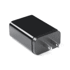
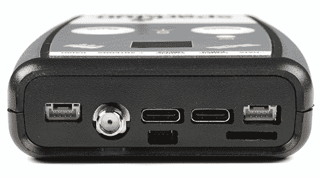
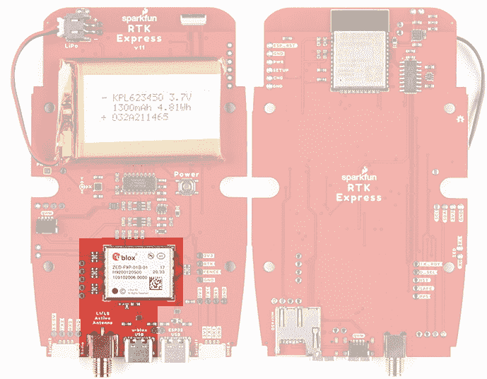

# SparkFun RTK 快速连接指南

> 原文：<https://learn.sparkfun.com/tutorials/sparkfun-rtk-express-hookup-guide>

## 介绍

SparkFun 的 RTK Express 是您满足高精度地理定位和测量需求的一站式商店。对于基本用户来说，它非常容易启动和运行，对于高级用户来说，RTK Express 是一个灵活而强大的工具。

 

将**添加到您的[购物车](https://www.sparkfun.com/cart)中！**

 **### [spark fun RTK Express](https://www.sparkfun.com/products/18442)

[In stock](https://learn.sparkfun.com/static/bubbles/ "in stock") GPS-18442

SparkFun RTK Express 是一款易于使用的 GNSS 接收器，用于厘米级定位。非常适合测量、伐木和…

$534.951[Favorited Favorite](# "Add to favorites") 5[Wish List](# "Add to wish list")** **只需几分钟的设置，RTK Express 是进行厘米级测量的最快方法之一。

*An RTK Fix with 14mm accuracy in SW Maps*

通过蓝牙将您的手机连接到 RTK Express，您的手机可以作为无线电链路来提供校正数据并接收设备的 NMEA 输出。这就是价值 10，000 美元的测量设备在过去十年中的运作方式——我们只是让它更容易、更小、更便宜。

### 所需材料

虽然 RTK Express 是很好的封闭，但你需要一些电缆和天线来使一切工作。我们将探讨如何将这些东西连接在一起的细节，但一般来说，您需要一个高质量的 L1/L2 天线:

 

将**添加到您的[购物车](https://www.sparkfun.com/cart)中！**

 **### [GNSS 多频段 L1/L2 勘测天线(TNC) - TOP106](https://www.sparkfun.com/products/17751)

[In stock](https://learn.sparkfun.com/static/bubbles/ "in stock") GPS-17751

TOPGNSS 的 TOP106 是经过认证的 GNSS/GPS 测量天线，能够接收 GPS 的 L1/L2 波段，GLONASS，加利…

$133.9511[Favorited Favorite](# "Add to favorites") 17[Wish List](# "Add to wish list")**** 

将**添加到您的[购物车](https://www.sparkfun.com/cart)中！**

 **### [接口电缆- SMA 公头至 TNC 公头(300mm)](https://www.sparkfun.com/products/17833)

[28 available](https://learn.sparkfun.com/static/bubbles/ "28 available") CAB-17833

这是一根 300 毫米长的公 TNC 到公 SMA 电缆。这是连接我们的 RTK 开发板的极好的电缆…

$10.95[Favorited Favorite](# "Add to favorites") 7[Wish List](# "Add to wish list")**** 

将**添加到您的[购物车](https://www.sparkfun.com/cart)中！**

 **### [天线螺纹适配器-1/4 英寸。到 5/8 英寸。](https://www.sparkfun.com/products/17546)

[In stock](https://learn.sparkfun.com/static/bubbles/ "in stock") PRT-17546

这款铝制适配器将相机三脚架和单脚架上常见的 1/4”螺纹转换为 5/8”11-TPI(螺纹…

$5.50[Favorited Favorite](# "Add to favorites") 4[Wish List](# "Add to wish list")****** ******根据您的设置，您可能需要使用手机获取 RTCM 校正数据。如果无法在线获得信号源，则需要在基本模式下设置第二个 RTK 面，并通过无线电链路将基本设备连接到漫游器。我们将详细介绍，但我们设计的 RTK Facet 可与这些 100mW 915MHz 遥测无线电开箱即用。

 

将**添加到您的[购物车](https://www.sparkfun.com/cart)中！**

 **### [植遥测电台 V3 - 915MHz，100mW](https://www.sparkfun.com/products/19032)

[In stock](https://learn.sparkfun.com/static/bubbles/ "in stock") WRL-19032

915MHz SiK 遥测无线电 V3 是一个轻量级和廉价的开源无线电平台，可允许 30…

$89.95[Favorited Favorite](# "Add to favorites") 11[Wish List](# "Add to wish list")** **要给 RTK Express 充电，你需要一根 USB C 线和一个电源。SparkFun 有几个选项:

 

将**添加到您的[购物车](https://www.sparkfun.com/cart)中！**

 **### [USB 2.0 Type-C 线缆- 1 米](https://www.sparkfun.com/products/16905)

[In stock](https://learn.sparkfun.com/static/bubbles/ "in stock") CAB-16905

1 米 USB C 型到 C 型电缆 USB 2.0 数据传输能力。

$4.951[Favorited Favorite](# "Add to favorites") 4[Wish List](# "Add to wish list")**** 

将**添加到您的[购物车](https://www.sparkfun.com/cart)中！**

 **### [可逆 USB A 转 C 线- 0.8m](https://www.sparkfun.com/products/15425)

[15 available](https://learn.sparkfun.com/static/bubbles/ "15 available") CAB-15425

这些 0.8 米电缆稍作修改，允许它们插入其端口，而不管它们在…

$5.502[Favorited Favorite](# "Add to favorites") 5[Wish List](# "Add to wish list")**** 

将**添加到您的[购物车](https://www.sparkfun.com/cart)中！**

 **### [USB 壁式充电器- 5V，2A](https://www.sparkfun.com/products/16893)

[In stock](https://learn.sparkfun.com/static/bubbles/ "in stock") TOL-16893

这个 USB 交流到 DC 的电源将在 2A 做 5V！

$6.501[Favorited Favorite](# "Add to favorites") 2[Wish List](# "Add to wish list")**** 

将**添加到您的[购物车](https://www.sparkfun.com/cart)中！**

 **### [USB-C 壁式适配器- 5.1V，3A(黑色)](https://www.sparkfun.com/products/16272)

[In stock](https://learn.sparkfun.com/static/bubbles/ "in stock") TOL-16272

这是一个 USB Type-C 电源，与 Raspberry Pi 4 兼容。

$5.501[Favorited Favorite](# "Add to favorites") 5[Wish List](# "Add to wish list")******** ********### 推荐阅读

GNSS RTK 是一项令人难以置信的工程壮举，功能强大的 GNSS 接收机，如 u-blox 的 ZED-F9P(RTK Express 内的接收机)，使其易于使用。设置 RTK 系统的过程将在本教程中介绍，但如果你想了解更多关于 RTK 的知识，这里有一些很好的教程供你温习:

 [### 什么是 GPS RTK？](https://learn.sparkfun.com/tutorials/what-is-gps-rtk) Learn about the latest generation of GPS and GNSS receivers to get 14mm positional accuracy 9 [### u-blox 的 U-Center 入门](https://learn.sparkfun.com/tutorials/getting-started-with-u-center-for-u-blox) Learn the tips and tricks to use the u-blox software tool to configure your GPS receiver.[Favorited Favorite](# "Add to favorites") 2 [### GPS-RTK2 连接指南](https://learn.sparkfun.com/tutorials/gps-rtk2-hookup-guide) Get precision down to the diameter of a dime with the new ZED-F9P from u-blox.[Favorited Favorite](# "Add to favorites") 9 [### 设置基于流动站的 RTK 系统](https://learn.sparkfun.com/tutorials/setting-up-a-rover-base-rtk-system) Getting GNSS RTCM correction data from a base to a rover is easy with a serial telemetry radio! We'll show you how to get your high precision RTK GNSS system setup and running.[Favorited Favorite](# "Add to favorites") 15 [### 如何建立一个 DIY GNSS 参考站](https://learn.sparkfun.com/tutorials/how-to-build-a-diy-gnss-reference-station) Learn how to affix a GNSS antenna, use PPP to get its ECEF coordinates and then broadcast your own RTCM data over the internet and cellular using NTRIP to increase rover reception to 10km 14

## 硬件概述

RTK Express 是一种全封闭的预编程设备。需要担心或配置的东西很少，但是我们将介绍一些基础知识。

### **按钮**

RTK Express 使用**电源**和**设置**两个按钮进行现场配置。

#### **设置**

该器件可用于四种模式:

*   GNSS 定位(约 30 厘米精度)-也称为“漫游者”
*   带 RTK 的 GNSS 定位(1.4 厘米精度)-也称为“带 RTK 定位的漫游者”
*   GNSS 基站
*   GNSS 基站 NTRIP 服务器

开机时，设备将进入漫游或基本模式；设备在最后一次断电时所处的状态。当按下设置按钮时，RTK Express 将在*漫游车*和*基地*模式之间切换。显示屏会用一个小车或旗帜图标来指示变化。

在*漫游者*模式下，RTK Express 将接收来自四个星座(GPS、GLONASS、伽利略和北斗)的 L1 和 L2 GNSS 信号，并根据这些信号计算位置。与标准等级的 GPS 接收器类似，RTK Express 将以 4Hz 的频率输出行业标准的 NMEA 句子，并通过任何配对的蓝牙设备进行广播。最终用户将需要使用常见的移动应用程序、GIS 产品或嵌入式设备(有许多开源库)来解析 NMEA 的句子。与具有 2500 米精度的标准等级 GPS 接收机不同，这种模式下的精度大约为 300 毫米水平位置精度，具有良好等级的 L1/L2 天线。

当设备处于*漫游器*模式且 RTCM 校正数据被发送到无线电端口或通过蓝牙发送时，设备将自动进入 RTK 模式的**定位。在这种模式下，RTK Express 将从天线接收 L1/L2 信号，并从基站接收校正数据。接收器将快速(在几秒钟内)获得 RTK 浮点值，然后进行定位。NMEA 句子的水平精度将提高到 14 毫米，垂直精度将提高到 10 毫米。RTCM 校正数据可以从到在线校正源的蜂窝链路获得，或者通过到作为基站的第二 RTK Express 设置的无线电链路获得。**

在*基站*模式下，设备将进入*基站*模式。当设备安装在固定位置(如三脚架或屋顶)时使用。RTK 快递将会展开调查。60 至 120 秒后，调查将完成，RTK Express 将开始通过无线电端口传输 RTCM 校正数据。底座通常与设置为“漫游”的第二个 RTK Express(或 RTK Surveyor)单元结合使用，以获得 14 毫米的精度。换句话说，基地静止不动，并向漫游车发送校正数据，以便漫游车可以输出真正准确的位置。您将创建一个没有任何其他设置的 RTK 系统。

#### **功率**

*RTK Express startup display with firmware version number*

电源按钮打开和关闭设备。按住电源按钮，直到显示屏亮起。任何时候按住电源按钮都可以关闭本机。

*RTK Express showing the battery level*

RTK Express 内置 1300mAh 锂聚合物电池，充电后可在野外使用 5 小时以上。如果需要更多的时间，可以连接一个通用 USB 电源组，将现场时间提高到 40 小时。

### **充电指示灯**

充电 LED 位于**电源**按钮上方。只要有外部电源，它就会亮起，当内部电池充满电时，它就会熄灭。在设备完全断电的情况下，使用 1A 壁式电源充电大约需要 1.5 小时，使用标准 USB 端口充电大约需要 3 小时。RTK Express 可以在充电时运行，但会增加充电时间。支持使用外部 USB 电池组长时间运行设备，或使用永久性墙壁电源运行设备。

### **连接器**

*The SparkFun RTK Express has a variety of connectors*

#### **天线:**

该 SMA 连接器用于将 L1/L2 型 GNSS 天线连接至 RTK Express。请注意，标准 GPS 天线无法接收 L2 波段信号，会极大地影响 RTK Express 的性能(RTK 几乎不可能修复)。确保使用合适的 [L1/L2 天线](https://www.sparkfun.com/products/17751)。

#### **配置 u-blox:**

该 USB C 连接器用于为设备充电和/或使用 [u-center](https://learn.sparkfun.com/tutorials/getting-started-with-u-center-for-u-blox/all) 直接配置和检查 ZED-F9P GNSS 接收器。这在正常操作中不是必需的，但对于根据特定应用定制接收机来说却很方便。作为额外的好处，ZED-F9P 可以被一些手机和平板电脑自动检测到。如果需要，接收器可以直接连接到兼容的手机或平板电脑，无需蓝牙连接。

#### **配置 ESP32:**

该 USB C 连接器用于设备充电、设备配置和 ESP32 重新编程。各种调试消息以 115200bps 的速度打印到该端口，并且可以打开一个串行菜单来配置高级设置。

#### **收音机:**

这种 4 针 JST 连接器用于允许 RTCM 校正数据在设备充当流动站时流入设备，或在设备充当基站时流出设备。该连接器是一个 4 针锁定 1.25 毫米 JST SMD 连接器(零件号:SM04B-GHS-TB，配套连接器零件号:GHR-04V-S)。RTK Express 附带一根电缆来连接该连接器，但可以购买额外的电缆。如果你无法在互联网上访问校正源，你最有可能将这个端口连接到我们的[串行遥测无线电](https://www.sparkfun.com/products/19032)之一。如图所示，引脚排列从左到右为**3.5-5.5V**/TX/RX/GND([引脚标签显示在电路板上](https://learn.sparkfun.com/tutorials/sparkfun-rtk-express-hookup-guide#hardware-overview---advanced-features))。 **3.5V 至 5.5V** 由该连接器提供，为收音机提供取决于电源的电压。如果 USB 连接到 RTK Express，则该端口上的电压将为 **5V** (+/-10%)。如果使用内部电池，则该端口上的电压将随电池电压而变化(根据充电状态， **3.5V** 至 **4.2V** )。虽然该端口能够提供高达 2 安培的电流，但我们建议不要超过 500 毫安。该端口不应连接到电源。

#### **数据:**

该 4 针 JST 连接器用于向 RTK Express 输出和输入各种数据。该连接器是一个 4 针锁定 1.25 毫米 JST SMD 连接器(零件号:SM04B-GHS-TB，配套连接器零件号:GHR-04V-S)。RTK Express 附带一根电缆来连接该连接器，但可以购买额外的电缆。

数据连接器内部连接到数字多路复用器，允许四种软件可选设置之一:

*   **NMEA**-TX 引脚输出任何使能的消息(NMEA、UBX 和 RTCM)，默认值为 460，800bps(可配置为 9600 至 921600bps)。RX 引脚可以接收 RTK 的 RTCM，如果需要，还可以接收 UBX 配置命令。
*   **PPS/Trigger**-TX 引脚输出精确到 30ns RMS 的每秒脉冲信号。RX 引脚连接到 ZED-F9P 的 EXTINT 引脚，允许以令人难以置信的精确纳秒分辨率测量事件。对于音频三角测量这样的事情很有用。更多信息参见 ZED-F9P 集成的 Timemark 部分。
*   **I2C** -在 I2C 总线上，TX 引脚作为 SCL 工作，RX 引脚作为 SDA 工作。这允许额外的传感器连接到 I2C 总线。
*   **GPIO**-TX 引脚作为 ESP32 上支持 DAC 的 GPIO。RX 引脚用作 ESP32 的 ADC 使能输入。这对自定义应用程序很有用。

大多数应用程序不需要使用该端口，而是通过蓝牙发送 NMEA 位置数据。该端口可用于向嵌入式微控制器或单板计算机发送位置数据。引脚排列为 **3.3V** / TX / RX / GND。 **3.3V** 如图从左到右([引脚标签显示在板本身](https://learn.sparkfun.com/tutorials/sparkfun-rtk-express-hookup-guide#hardware-overview---advanced-features)上)，由该连接器提供，以在需要时为远程设备供电。虽然该端口能够提供高达 600mA 的电流，但我们不建议超过 300mA。该端口不应连接到电源。

#### **microSD:**

该插槽支持最高 32GB 的 FAT16 或 FAT32 格式的标准 microSD 卡。所有星座都支持以高达 4Hz 的频率记录 67 条消息中的任何一条。

日志记录支持以下 67 条消息:

*   NMEA-DTM
*   NMEA-GBS
*   NMEA-GGA
*   NMEA-GLL
*   NMEA 全球导航卫星系统
*   NMEA-GRS
*   NMEA GSA
*   NMEA 商品及服务税
*   NMEA-GSV
*   NMEA-RMC
*   NMEA-VLW
*   NMEA-VTG
*   NMEA-ZDA
*   导航时钟
*   导航 DOP
*   NAV-EOE
*   导航-地理围栏
*   NAV-HPPOSECEF
*   纳夫-HPPOSLLH
*   NAV-ODO
*   导航球
*   导航-POSECEF
*   导航位置
*   NAV-PVT
*   导航-重新定位
*   导航卫星系统
*   NAV-SIG
*   导航状态
*   NAV-SVIN
*   NAV-TIMEBDS
*   NAV-TIMEGAL
*   导航时间
*   NAV-TIMEGPS
*   导航时间
*   NAV-TIMEUTC
*   NAV-VELECEF
*   NAV-VELNED
*   RXM-MEASX
*   RXM-RAWX
*   RXM-RLM
*   RXM-RTCM
*   XM-sfbx
*   周一至周五
*   MON-HW2
*   MON-HW3
*   mon-HW-硬体
*   -我
*   mon-msgid PP
*   蒙-射频
*   蒙-鲁布夫
*   蒙 RXR
*   蒙-切布夫
*   蒂姆·TM2
*   TIM-TP
*   蒂姆·弗尔菲
*   rtcm3x-1005
*   rtcm3x-1074 号命令
*   rtcm3x-1077 号命令
*   rtcm3x-1084
*   rtcm3x-1087
*   rtcm3x-1094
*   rtcm3x-1097
*   rtcm3x-1124
*   rtcm3x-1127
*   rtcm3x-1230 号房
*   rtcm3x-4072-0
*   rtcm3x-4072-1

#### **Qwiic:**

这个 4 针 [Qwiic 连接器](https://www.sparkfun.com/qwiic)暴露了 ESP32 WROOM 模块的 I2C 总线。目前，没有固件支持将 I2C 设备添加到 RTK Express，但将来可能会添加支持。

### **功率**

RTK Express 内置 1300mAh 电池，在蓝牙连接激活、GNSS 完全跟踪和 500mW 无线电广播的情况下，最差功耗约为 240mA。这将允许在野外使用大约 5.5 小时。如果在野外需要更多时间，可以连接一个标准的 USB 电源组。如果连接一个 10，000mAh 的电池组，假设 RTK Express 内的电源组和充电电路的效率损失了 25%,则可以估计 30 小时的运行时间。

RTK Express 可以从任何 USB 端口或适配器充电。充电电路的额定电流为 1000 毫安，因此 USB 2.0 端口的充电电流为 500 毫安，USB 3.0+端口的充电电流为 1A。

要快速查看充电状态，请打开设备。电池图标将指示以下内容:

*   3 格:剩余 75%以上的容量
*   2 巴:剩余超过 50%的容量
*   1 巴:剩余 25%以上容量
*   0 小节:剩余容量小于 25%

*RTK Express Display showing three battery bars*

## 硬件概述-高级功能

RTK 快车是黑客的最爱。在 RTK Express 的引擎盖下是一个连接到 ZED-F9P 以及一些外围硬件(LiPo 燃料计、microSD 等)的 ESP32 室。它是用 Arduino 编程的，最终用户可以根据自己的需要进行定制。

*Click on the image to get a closer look at the Schematic!*

### ZED-F9P 全球导航卫星系统接收器

[ZED-F9P GNSS 接收机](https://www.sparkfun.com/products/16481)配置在 I ² C 上，使用两个 UART 输出 NMEA (UART1)和输入/输出 RTCM (UART2)。一般而言，ESP32 从 ZED-F9Ps UART1 获取数据，用于蓝牙传输和记录至 SD。

### ESP32

[ESP32](https://www.sparkfun.com/products/15663) 使用标准 USB 转串行转换 IC ( [CH340](https://learn.sparkfun.com/tutorials/how-to-install-ch340-drivers/all) )对设备进行编程。你可以将 ESP32 内核用于 Arduino 或 Espressif 的[物联网开发框架(IDF)](https://www.espressif.com/en/support/download/all) 。

CH340 会自动重置，并根据需要将 ESP32 置于引导加载模式。然而，如果需要外部复位按钮，则 ESP32 的复位引脚被引出至外部 2 引脚 0.1 英寸尺寸。

**Note:** If you've never connected a CH340 device to your computer before, you may need to install drivers for the USB-to-serial converter. Check out our section on ["How to Install CH340 Drivers"](https://learn.sparkfun.com/tutorials/sparkfun-serial-basic-ch340c-hookup-guide#drivers-if-you-need-them) for help with the installation.

### 测量跳线

为了便于测量运行电流、充电电流和静态电流，内置了两个测量跳线。这些是常闭跳线，具有 2 针 0.1 英寸的尺寸。要进行测量，切断跳线并安装 2 针接头，使用[香蕉到 IC 钩](https://www.sparkfun.com/products/506)电缆到 DMM。这些可以用 [2 针跳线](https://www.sparkfun.com/products/9044)关闭。

### 脂肪和充电

RTK Express 装有标准的 [1300mAh 3.7V LiPo](https://www.sparkfun.com/products/17748) 。充电电路设置为 1A，因此使用合适的电源，给空电池充电应该需要一个多小时。RTK Express 上的 USB C 配置为 2A 汲取，因此如果用户连接到 USB 3.0 端口，充电电路应该在 1A 最大值附近工作。如果用户连接到 USB 2.0 端口，充电电路将在 500mA 下工作。这种充电电路还包括一个 42℃的温度上限，以确保在危险的条件下不能充电。

### 燃油表和加速计

[MAX17048](https://cdn.sparkfun.com/assets/learn_tutorials/1/4/6/3/MAX17048-MAX17049.pdf) 是一款简单易用的燃油表 IC，它为用户提供一份基本上是 0-100%报告的充电状态(SOC)。MAX17048 有一个复杂的算法来计算基于电池电压的 SOC，这超出了本教程的范围，但出于我们的目的，允许我们在单元打开时可靠地查看电池电量。

RTK Express 还集成了一个 [LIS2DH12](https://cdn.sparkfun.com/assets/learn_tutorials/1/8/5/7/lis2dh12_accelerometer_datasheet.pdf) 三轴加速度计，以帮助现场调平。

### Qwiic

该装置包括两个 [Qwiic 连接器](https://www.sparkfun.com/qwiic)。内部 Qwiic 连接器连接到与上盖相连的有机发光二极管显示屏。下部 Qwiic 连接器暴露在装置的末端。这些允许连接到 ESP32 上的 I ² C 总线。目前，stock RTK Express 不支持任何额外的 Qwiic 传感器或显示器，但用户可以为自己的应用添加支持。

### microSD

一个 microSD 插座位于 ESP32 SPI 总线上。支持最高 32GB 的任何 microSD。RTK Express 支持 RAWX 和 NMEA 记录到 SD 卡。还可以设置最大日志记录时间(默认为 10 小时)，以避免数千兆字节的文本文件。有关 RAWX 和 PPP 的更多信息，请参见本教程。

### 数据端口和数字多路复用器

74HC4052 模拟多路复用器控制哪些数字信号路由至外部数据端口。这允许各种定制的最终用户应用。其中最有趣的是事件日志。由于 ZED-F9P 对输入数字信号具有微秒级精度，因此可以创建定制固件，根据接收器的位置和多个捕获事件之间的时间延迟对事件进行三角测量。目前，支持 TM2 事件日志记录。

此外，该多路复用器可以配置为连接 ESP 引脚 26(支持 DAC)和引脚 39(支持 ADC ),用于最终用户定制应用。

## 硬件装配

RTK Express 设计用于低成本的现成设备。在这里，我们将描述如何组装一个漫游者和基地。

### 流浪者

这里显示的是最常见的 RTK 漫游者设置。使用为照相机设计的单极天线。手机支架夹在单脚架上，安装 RTK Express。单极天线的“相机线[适配⅝”11-TPI](https://www.sparkfun.com/products/17546)并附有一根 [L1/L2 天线](https://www.sparkfun.com/products/17751)。一根[公 TNC 到公 SMA 电缆](https://www.sparkfun.com/products/17833)将天线连接到 RTK Express。不需要无线电，因为 RTCM 校正数据由电话通过蓝牙提供。

*Basic RTK Express Rover setup with RTCM over Bluetooth*

如果你要买一个单极天线(又名独脚架)，买一个长度为 65 英寸或更长的，以确保天线在你的头顶上。我们在亚马逊基础品牌上运气很好。

我们已经用 u-blox L1/L2 天线做了很多测试，它的价格和尺寸都非常好。安装在一个接地板上，你会得到很好的结果。只是安装在单极天线的顶部有点笨拙。我们推荐“飞碟”风格的 L1/L2 天线，因为它们比 u-blox 天线具有更大的天线元件和略大的接地平面。

*u-blox L1/L2 antenna with ground plate*

我们强烈建议不要使用如下所示的刚性螺旋天线配置。RTK Express 不适用于此类配置，可能会导致天线连接器永久性损坏。螺旋天线变成一个大杠杆臂。如果单元掉落，该杠杆会损坏 SMA 连接器以及连接器焊接到 PCB 的位置。

*Dangerous Antenna Configuration*

如果你要买一个手机夹子，一定要买一个和你的单极天线直径相匹配的，并且有一个旋钮来增加夹子的压力。我们的单极天线直径为 27 毫米，我们已经很好地体验了[这个夹子](https://www.amazon.com/gp/product/B07VF4H6KW)和[这个夹子](https://www.amazon.com/gp/product/B072DSRF3J)。您的里程可能会有所不同。

如果您通过无线电链路接收 RTCM 校正数据，建议您在 RTK Express 的后面附加一个无线电。

*2nd most common setup with a 915MHz Radio providing RTCM*

来自 3M 公司的图片挂带是一个不错的半永久挂架。将 RTK Express 随附的 4 针至 6 针 JST 电缆从**无线电**端口插入任一[串行遥测无线电](https://www.sparkfun.com/products/19032)(成对装运)。我们真的很喜欢这些无线电，因为它们是开箱即用的，既可以发送也可以接收(所以哪个无线电连接到基站或漫游器并不重要)，而且它们的覆盖范围很大。我们用 500mW 无线电和底座上的[大 915MHz 天线](https://www.sparkfun.com/products/retired/14868)实现了超过 1 英里的范围(接近 1.5 英里或 2.4 公里)。

### 临时基地

当您在现场距离校正源和/或蜂窝接收太远时，需要临时或移动基站设置。第二台 RTK Express 安装在一个三脚架上，它被配置为完成一次勘测(也称为自身定位)，然后开始广播 RTCM 校正数据。这些数据(每秒约 1000 字节)被发送到用户选择的连接无线电。出于我们的目的，使用 915MHz 500mW 遥测无线电，因为它们在我们的基地和漫游者之间提供了基本上是串行的电缆。

*Temporary RTK Express Base setup*

任何带“相机线”的三脚架都可以。亚马逊基础三脚架工作得很好，但是有点轻而且不稳。手机支架夹在三脚架上，RTK Express 夹在夹子里。“相机线[适配⅝”11-TPI](https://www.sparkfun.com/products/17546)并附有一根 [L1/L2 天线](https://www.sparkfun.com/products/17751)。一个[公 TNC 到公 SMA 适配器](https://www.sparkfun.com/products/17833)将天线连接到 RTK Express。

一旦基地设置好了清晰的天空视野，打开 RTK Express。一旦打开，按下*设置*按钮，将设备置于基本模式。显示屏将显示调查屏幕 60-120 秒。一旦测量完成，显示器将显示“x 拟合”显示，并开始产生 RTCM 校正数据。您可以通过查看遥测无线电上的 LED 来验证这一点(当从 RTK Express 接收到串行数据时，一个小的红色 LED 将闪烁)。RTK Express 的设计遵循 u-blox 建议的 60 秒勘测时间和所有定位点 5 米的平均 3D 标准偏差。如果调查未能达到这些要求，它将在 10 分钟后自动重启。

更昂贵的测量员基座有⅝11-TPI 螺纹，但是测量员基座的顶部经常会干扰天线的 TNC 连接器。如果您选择使用测量员的“棒”,请确保获得一个⅝”延长板，将天线抬高至少一英寸。

如果你想买一个手机夹子，一定要买一个和你的三脚架的直径相匹配的，并且有一个旋钮来增加夹子的压力。我们的三脚架直径为 18 毫米，我们对这个夹子有很好的体验。您的里程可能会有所不同。

注意:移动基站非常适合快速到达现场。然而，不建议将测量方法用于最高精度的测量，因为基座的位置精度将直接转化为漫游者的精度。换句话说，如果你的基座的塌陷位置偏离了 100 厘米，那么你的探测车的每个读数也会偏离。如果你在寻找最大的精确度，考虑安装一个带有固定天线的[静态基座。我们能够使用 PPP 以令人难以置信的精度](https://learn.sparkfun.com/tutorials/how-to-build-a-diy-gnss-reference-station#static-base-setup--lasers) [+/-2mm 的精度](https://cdn.sparkfun.com/assets/learn_tutorials/1/4/6/3/SparkFun_PPP_Results.png)精确定位 SparkFun 顶部的天线！

## 蓝牙和 NTRIP

RTK Express 通过蓝牙串行端口模式(SPP)以 4Hz 和 115200bps 传输完整的 NMEA 句子。这意味着几乎所有可以通过串行端口接收 NMEA 数据的 GIS 应用程序(几乎所有都可以)都可以与 RTK Express 一起使用。只要您的设备可以通过蓝牙(也称为 SPP)打开串行端口，您的设备就可以检索行业标准的 NMEA 位置数据。以下步骤显示了如何使用 SW Maps，但也可以遵循相同的步骤来连接任何基于串行端口的 GIS 应用程序。

请参见 [SparkFun RTK 产品手册](https://sparkfun.github.io/SparkFun_RTK_Firmware/connecting_bluetooth/)获取分步说明。

## 显示

RTK Express 拥有 0.96 英寸高对比度有机发光二极管显示屏。虽然很小，但它包含了各种情况数据，这些数据在野外可能会有所帮助。我们将带您参观每个展示区。

请参见 [SparkFun RTK 产品手册](https://sparkfun.github.io/SparkFun_RTK_Firmware/displays/)了解每个显示器的说明。

## 系统配置

开箱即用，SparkFun RTK 产品是出色的开箱即用 GNSS 接收机，只需很少或无需配置即可使用。此外，SparkFun 的 RTK 产品系列非常易于配置。请参见 [SparkFun RTK 产品手册](https://sparkfun.github.io/SparkFun_RTK_Firmware/intro/)了解 RTK 产品上所有可用功能的详细描述。

## 固件更新和定制

RTK Express 是开源硬件，这意味着你可以完全访问[固件](https://github.com/sparkfun/SparkFun_RTK_Firmware)和[硬件](https://github.com/sparkfun/SparkFun_RTK_Express)。

SparkFun 将不时发布 RTK 产品线的新固件，以增加和改进功能。我们已经尽可能容易地更新固件。请参见[更新 RTK 固件](https://sparkfun.github.io/SparkFun_RTK_Firmware/firmware_update/)获取分步指南。

## 解决纷争

**Not working as expected and need help?**

If you need technical assistance and more information on a product that is not working as you expected, we recommend heading on over to the [SparkFun Technical Assistance](https://www.sparkfun.com/technical_assistance) page for some initial troubleshooting.

[SparkFun Technical Assistance Page](https://www.sparkfun.com/technical_assistance)

If you don't find what you need there, the [SparkFun Forums](https://forum.sparkfun.com/index.php) are a great place to find and ask for help. If this is your first visit, you'll need to [create a Forum Account](https://forum.sparkfun.com/ucp.php?mode=register) to search product forums and post questions.

[Create New Forum Account](https://forum.sparkfun.com/ucp.php?mode=register)   [Log Into SparkFun Forums](https://forum.sparkfun.com/index.php)

## 资源和更进一步

我们希望您和我们一样喜欢使用 RTK Express！

以下是 RTK Express 的相关技术文件:

*   [ZED-F9P GNSS 接收机数据表](https://cdn.sparkfun.com/assets/learn_tutorials/1/4/6/3/ZED-F9P_Datasheet.pdf)
*   [MAX17048 燃油表 IC](https://cdn.sparkfun.com/assets/learn_tutorials/1/4/6/3/MAX17048-MAX17049.pdf)
*   [spark fun RTK Express GitHub Repo](https://github.com/sparkfun/SparkFun_RTK_Express)(包含开源硬件电子设备和外壳)
*   [SparkFun RTK 固件 GitHub Repo](https://github.com/sparkfun/SparkFun_RTK_Surveyor) (包含运行 SparkFun RTK 产品的固件)

查看这些附加教程，供您阅读:

 [### GPS-RTK 连接指南](https://learn.sparkfun.com/tutorials/gps-rtk-hookup-guide) Find out where you are! Use this easy hook-up guide to get up and running with the SparkFun high precision GPS-RTK NEO-M8P-2 breakout board.[Favorited Favorite](# "Add to favorites") 5 [### SparkFun RTK 快速连接指南](https://learn.sparkfun.com/tutorials/sparkfun-rtk-express-hookup-guide) Learn how to use the enclosed RTK Express product to achieve millimeter level geospatial coordinates.[Favorited Favorite](# "Add to favorites") 2 [### MicroMod GNSS 功能板- NEO-M9N 连接指南](https://learn.sparkfun.com/tutorials/micromod-gnss-function-board---neo-m9n-hookup-guide) The u-blox NEO-M9N is a powerful GPS unit that now comes populated on a MicroMod Function Board! In this tutorial, we will quickly get you set up using it with the MicroMod ecosystem and Arduino so that you can start reading the output.[Favorited Favorite](# "Add to favorites") 2 [### MicroMod GNSS 载板(ZED-F9P)连接指南](https://learn.sparkfun.com/tutorials/micromod-gnss-carrier-board-zed-f9p-hookup-guide) Easily switch between Processor Boards using the MicroMod ecosystem and get precision down to the diameter of a dime with the ZED-F9P from u-blox using the MicroMod GNSS Carrier Board 0 [### ESP32 Thing Plus 连接指南](https://learn.sparkfun.com/tutorials/esp32-thing-plus-hookup-guide) Hookup guide for the ESP32 Thing Plus (Micro-B) using the ESP32 WROOM's WiFi/Bluetooth system-on-chip in Arduino.[Favorited Favorite](# "Add to favorites") 8 [### 如何安装 CH340 驱动程序](https://learn.sparkfun.com/tutorials/how-to-install-ch340-drivers) How to install CH340 drivers (if you need them) on Windows, Mac OS X, and Linux.[Favorited Favorite](# "Add to favorites") 9 [### 设置基于流动站的 RTK 系统](https://learn.sparkfun.com/tutorials/setting-up-a-rover-base-rtk-system) Getting GNSS RTCM correction data from a base to a rover is easy with a serial telemetry radio! We'll show you how to get your high precision RTK GNSS system setup and running.[Favorited Favorite](# "Add to favorites") 15 [### 如何建立一个 DIY GNSS 参考站](https://learn.sparkfun.com/tutorials/how-to-build-a-diy-gnss-reference-station) Learn how to affix a GNSS antenna, use PPP to get its ECEF coordinates and then broadcast your own RTCM data over the internet and cellular using NTRIP to increase rover reception to 10km 14******************