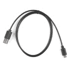

# Qwiic 6DoF (LSM6DSO)分线连接指南

> 原文：<https://learn.sparkfun.com/tutorials/qwiic-6dof-lsm6dso-breakout-hookup-guide>

## 介绍

**Note:** This tutorial is for the LSM6DSO. It is important to note that last designation for the IC is the letter `O` as opposed to the number `0`. There is also the LSM6DS0 that was released by STMicroelectronics but it is EOL.

LSM6DSO 是一款加速度计和陀螺仪传感器，具有巨大的 9k 字节缓冲区和嵌入式处理中断功能，专门针对手机市场。该传感器非常灵活，可以根据具体应用进行配置。我们已经整理了一个驱动因素和大量示例，以帮助您探索各种可能性。

[](https://www.sparkfun.com/products/18020) 

将**添加到您的[购物车](https://www.sparkfun.com/cart)中！**

 **### [【spark fun 6 自由度突破- LSM6DSO (Qwiic)](https://www.sparkfun.com/products/18020)

[In stock](https://learn.sparkfun.com/static/bubbles/ "in stock") SEN-18020

LSM6DSO 6DoF Breakout 是一款加速度计和陀螺仪传感器，具有一个巨大的 9kB FIFO 缓冲器和嵌入式处理接口。

$12.95[Favorited Favorite](# "Add to favorites") 3[Wish List](# "Add to wish list")** **[https://www.youtube.com/embed/lEER_nn7BHo/?autohide=1&border=0&wmode=opaque&enablejsapi=1](https://www.youtube.com/embed/lEER_nn7BHo/?autohide=1&border=0&wmode=opaque&enablejsapi=1)

LSM6DSO 可以做的一些事情:

*   每秒读取高达 6.66 千个样本的加速度计数据，实现超精确的运动检测
*   读取陀螺仪数据的速度高达每秒 6.66 千个样本
*   最高 6.66 ksps 模式下，工作电流为 0.55mA
*   读取温度
*   读取之间最多可缓冲 9 千字节的数据(内置 FIFO)
*   计算步数(计步器)
*   检测震动、倾斜、移动、点击、双击
*   将其他传感器放入其 FIFO
*   通过嵌入式功能或 FIFO 低容量/溢出警告驱动中断引脚。

### 本教程涵盖的内容

本教程为您提供了开始使用 LSM6DSO 所需的全部内容。我们将向您介绍芯片本身，然后是分线板。然后，我们将切换到示例代码，向您展示如何使用 Arduino 和我们的 [SparkFun LSM6DSO Arduino 库](https://github.com/sparkfun/SparkFun_Qwiic_6DoF_LSM6DSO_Arduino_Library)与主板进行交互。

本教程分为以下几页:

*   **简介** -基本信息
*   **硬件概述** -硬件连接
*   **硬件组件** -通过 I2C 或 SPI 连接到 LSM6DSO
*   **安装 Arduino 库** -包括示例概述
*   **使用 Arduino 库** -解释用户 API
*   **资源和进一步发展** -数据手册和应用笔记的链接，以及灵感项目

### 所需材料

要跟随本教程，您将需要以下材料。你可能不需要所有的东西，这取决于你拥有什么。将它添加到您的购物车，通读指南，并根据需要调整购物车。

[](https://www.sparkfun.com/products/15123) 

将**添加到您的[购物车](https://www.sparkfun.com/cart)中！**

 **### [spark fun RedBoard Qwiic](https://www.sparkfun.com/products/15123)

[In stock](https://learn.sparkfun.com/static/bubbles/ "in stock") DEV-15123

SparkFun RedBoard Qwiic 是一款 Arduino 兼容开发板，内置 Qwiic 连接器，无需…

$21.5014[Favorited Favorite](# "Add to favorites") 49[Wish List](# "Add to wish list")****[](https://www.sparkfun.com/products/18020) 

将**添加到您的[购物车](https://www.sparkfun.com/cart)中！**

 **### [【spark fun 6 自由度突破- LSM6DSO (Qwiic)](https://www.sparkfun.com/products/18020)

[In stock](https://learn.sparkfun.com/static/bubbles/ "in stock") SEN-18020

LSM6DSO 6DoF Breakout 是一款加速度计和陀螺仪传感器，具有一个巨大的 9kB FIFO 缓冲器和嵌入式处理接口。

$12.95[Favorited Favorite](# "Add to favorites") 3[Wish List](# "Add to wish list")****[](https://www.sparkfun.com/products/14427) 

将**添加到您的[购物车](https://www.sparkfun.com/cart)中！**

 **### [Qwiic 线缆- 100mm](https://www.sparkfun.com/products/14427)

[In stock](https://learn.sparkfun.com/static/bubbles/ "in stock") PRT-14427

这是一条 100 毫米长的 4 芯电缆，带有 1 毫米 JST 端接。它旨在将支持 Qwiic 的组件连接在一起…

$1.50[Favorited Favorite](# "Add to favorites") 32[Wish List](# "Add to wish list")****[](https://www.sparkfun.com/products/15428) 

将**添加到您的[购物车](https://www.sparkfun.com/cart)中！**

 **### [可逆 USB A 转可逆 Micro-B 线- 0.8m](https://www.sparkfun.com/products/15428)

[In stock](https://learn.sparkfun.com/static/bubbles/ "in stock") CAB-15428

这些 0.8 米的电缆有微小的，但天才的修改，允许两端插入其端口，不管是什么…

$4.501[Favorited Favorite](# "Add to favorites") 2[Wish List](# "Add to wish list")******************Warning!** The LSM6DSO is a 3.3V device! Supplying voltages greater than ~3.6V can permanently damage the IC. As long as your Arduino has a 3.3V supply output, and you're ok with using I²C, you shouldn't need any extra level shifting. If you want to use SPI, you may need a [level shifter](https://www.sparkfun.com/products/12009).

[](https://www.sparkfun.com/products/12009) 

将**添加到您的[购物车](https://www.sparkfun.com/cart)中！**

 **### [SparkFun 逻辑电平转换器-双向](https://www.sparkfun.com/products/12009)

[In stock](https://learn.sparkfun.com/static/bubbles/ "in stock") BOB-12009

SparkFun 双向逻辑电平转换器是一个小型设备，可以安全地将 5V 信号降压至 3.3V，并升压 3。…

$3.50116[Favorited Favorite](# "Add to favorites") 146[Wish List](# "Add to wish list")****[](https://www.sparkfun.com/products/15439) 

将**添加到您的[购物车](https://www.sparkfun.com/cart)中！**

 **### [SparkFun 关卡翻译器分会场- PCA9306](https://www.sparkfun.com/products/15439)

[In stock](https://learn.sparkfun.com/static/bubbles/ "in stock") BOB-15439

不同的部分有时使用不同的电压电平进行通信。这款 PCA9306 电平转换器是制作…

$4.951[Favorited Favorite](# "Add to favorites") 22[Wish List](# "Add to wish list")********A logic level shifter is required for any 5V-operating Arduino (Uno, RedBoard, Leonardo, etc). If you use a 3.3V-based 'duino -- like the [Arduino Pro 3.3V](https://www.sparkfun.com/products/10914) or [3.3V Pro Mini](https://www.sparkfun.com/products/11114) -- there is no need for level shifting.

The RedBoard Qwiic has two level shifters on the I²C lines so you do not need to worry about the logic levels when using the board in I²C mode. You could also adjust the system voltage by [cutting the jumper and adding solder](https://learn.sparkfun.com/tutorials/how-to-work-with-jumper-pads-and-pcb-traces) to the 3.3V side when using the board in SPI.

[](https://cdn.sparkfun.com/assets/learn_tutorials/1/4/6/1/Adjust_RedBoard_Logic_Levels_3V3.jpg)

### 推荐阅读

如果你不熟悉 Qwiic 系统，我们推荐你在这里阅读[以获得一个概述](https://www.sparkfun.com/qwiic)。

| [](https://www.sparkfun.com/qwiic) |
| *[Qwiic 连接系统](https://www.sparkfun.com/qwiic)* |

如果您不熟悉以下概念，我们也建议您在继续之前先查阅一些教程。

[](https://learn.sparkfun.com/tutorials/serial-peripheral-interface-spi) [### 串行外设接口(SPI)](https://learn.sparkfun.com/tutorials/serial-peripheral-interface-spi) SPI is commonly used to connect microcontrollers to peripherals such as sensors, shift registers, and SD cards.[Favorited Favorite](# "Add to favorites") 91[](https://learn.sparkfun.com/tutorials/gyroscope) [### 陀螺仪](https://learn.sparkfun.com/tutorials/gyroscope) Gyroscopes measure the speed of rotation around an axis and are an essential part in determines ones orientation in space.[Favorited Favorite](# "Add to favorites") 22[](https://learn.sparkfun.com/tutorials/logic-levels) [### 逻辑电平](https://learn.sparkfun.com/tutorials/logic-levels) Learn the difference between 3.3V and 5V devices and logic levels.[Favorited Favorite](# "Add to favorites") 82[](https://learn.sparkfun.com/tutorials/accelerometer-basics) [### 加速度计基础知识](https://learn.sparkfun.com/tutorials/accelerometer-basics) A quick introduction to accelerometers, how they work, and why they're used.[Favorited Favorite](# "Add to favorites") 29[](https://learn.sparkfun.com/tutorials/i2c) [### I2C](https://learn.sparkfun.com/tutorials/i2c) An introduction to I2C, one of the main embedded communications protocols in use today.[Favorited Favorite](# "Add to favorites") 128

## 硬件概述

在这一部分，我们将重点介绍主板的特性。我们建议查看参考资料中链接的数据手册和应用笔记，并进一步了解有关 LSM6DSO 的更多信息。在可以在窗格中显示索引/目录的非浏览器查看器中打开它们。有这么多的信息，paned 查看是必须的！

### 电源和逻辑电平

快速制作原型时，我们建议通过 Qwiic 连接器为电路板供电。为了更安全的连接，你总是可以将[焊接到标有 **3V3** 和 **GND** 的 PTH](https://learn.sparkfun.com/tutorials/how-to-solder-through-hole-soldering) 上。使用带微控制器的电路板时，如果使用 Qwiic 连接器，建议输入电压为 **3.3V** 。不过，您可以使用 1.71V 至 3.6V 之间的稳压电源为传感器供电。逻辑电平将匹配输入电压(例如，如果传感器以 3.3V 供电，则逻辑电平也将是 3.3V)。

[](https://cdn.sparkfun.com/assets/learn_tutorials/1/6/6/4/18020-SparkFun_Qwiic_6_Degrees_of_Freedom_LSM6DSO_Power.jpg)

### I ² C

读取 LSM6DSO 的主要方法是通过 I ² C 总线。该板包括两个 Qwiic 连接器，用于快速原型制作，无需焊接。您只需将 qw IC 电缆插入 qw IC 连接器，瞧！也可以将[焊接到标为 **SDA** 和 **SCL** 的 PTHs](https://learn.sparkfun.com/tutorials/how-to-solder-through-hole-soldering) 上作为替代。IC 的默认地址是 **0x6B** 。但是，您可以调整电路板背面的跳线，将地址更改为 **0x6A** 。

[](https://cdn.sparkfun.com/assets/learn_tutorials/1/6/6/4/18020-SparkFun_Qwiic_6_Degrees_of_Freedom_LSM6DSO_I2C.jpg)

### 精力

如果你决定使用一个 [SPI 总线](https://learn.sparkfun.com/tutorials/serial-peripheral-interface-spi/all)，你将需要[焊接头部引脚或电线](https://learn.sparkfun.com/tutorials/how-to-solder-through-hole-soldering)到电路板。

*   **SDA/SDI** -器件数据输入。注意，用于 I ² C 的 SDA 引脚也是用于 SPI 的 SDI 引脚。将电路板翻转到底侧，将显示 SPI 引脚的标签。
*   **SCL**-I²C 或 SPI 的串行时钟。
*   **SDO** -设备数据输出。默认情况下，SDO 引脚连接到电源以设置 I ² C 地址。如果您决定在 SPI 模式下使用该传感器，请务必按照以下说明切断走线。
*   **【CS】**-芯片选择。

| [](https://cdn.sparkfun.com/assets/learn_tutorials/1/6/6/4/18020-SparkFun_Qwiic_6_Degrees_of_Freedom_LSM6DSO_Top_SPI.jpg) | [](https://cdn.sparkfun.com/assets/learn_tutorials/1/6/6/4/18020-SparkFun_Qwiic_6_Degrees_of_Freedom_LSM6DSO_Back_SPI.jpg) |
| *SPI 电路板顶部* | *SPI 电路板底部* |

在 SPI 模式下使用电路板时，需要切断背面默认地址(如 0x6B)的 I ² C 跳线，并在使用 SPI 时保持跳线焊盘不连接。

[](https://cdn.sparkfun.com/assets/learn_tutorials/1/6/6/4/18020-SparkFun_Qwiic_6_Degrees_of_Freedom_LSM6DSO_Cut_Jumper_for_SPI.jpg)

### 中断引脚

INT1 和 INT2 是加速度计和陀螺仪的可编程中断。它们可以设置为在超过/低于阈值、数据就绪或 FIFO 溢出时发出警报。确保这些连接到输入引脚，以防止将 5v 驱动回 LSM6DSO。

[](https://cdn.sparkfun.com/assets/learn_tutorials/1/6/6/4/18020-SparkFun_Qwiic_6_Degrees_of_Freedom_LSM6DSO_Interrupts.jpg)

LSM6DSO 上有多种中断。虽然连接这些引脚不像通信或电源引脚那样重要，但使用它们将有助于充分利用芯片。

中断引脚是 **INT1** 和 **INT2** 。一个或两个引脚可以通过软件配置，并映射到以下条件:

*   检测到步骤
*   增量时间后检测到步长
*   步进计数器溢出
*   重大运动(震动、跌落)
*   FIFO 已满
*   FIFO 溢出
*   达到 FIFO 阈值(数据手册称之为“水印”)
*   启动状态
*   陀螺仪数据就绪
*   加速度计数据就绪
*   静止
*   单抽头
*   唤醒
*   自由落体
*   双击
*   6D(方向)
*   倾斜
*   计时器
*   熨烫中断

仅提供了几个中断示例。有关高级中断特性的使用，请参见数据手册和应用指南。

### 辅助引脚

辅助串行数据输出引脚用于连接从机 I ² C 和辅助 SPI 3/4 线器件，以便收集 FIFO 数据。本教程不介绍这个函数。

*   OCS - aux 芯片选择
*   SCX -辅助串行时钟
*   SDIX - aux 串行数据输入
*   SDOX - aux 串行数据输出

[](https://cdn.sparkfun.com/assets/learn_tutorials/1/6/6/4/18020-SparkFun_Qwiic_6_Degrees_of_Freedom_LSM6DSO_Auxiliary.jpg)

### 坐标轴

为了便于参考，我们在电路板的顶部和底部记录了带有 3D 笛卡尔坐标轴的 6DoF 向量。确保根据您的应用正确定位和安装电路板。记住，都是相对的。

| [](https://cdn.sparkfun.com/assets/learn_tutorials/1/6/6/4/18020-SparkFun_Qwiic_6_Degrees_of_Freedom_LSM6DSO_Top_6DoF_Reference.jpg) | [](https://cdn.sparkfun.com/assets/learn_tutorials/1/6/6/4/18020-SparkFun_Qwiic_6_Degrees_of_Freedom_LSM6DSO_Bottom_6DoF_Reference.jpg) |
| *6 自由度参考(上)* | *6 自由度参考(底部)* |

### 发光二极管

该板包括一个 LED 指示灯，当有电源时它会亮起。

[](https://cdn.sparkfun.com/assets/learn_tutorials/1/6/6/4/18020-SparkFun_Qwiic_6_Degrees_of_Freedom_LSM6DSO_LED.jpg)

### 跳线引脚

板子的背面有五根跳线。如需了解更多信息，请查看我们的[教程，了解如何使用跳线焊盘和 PCB 走线](https://learn.sparkfun.com/tutorials/how-to-work-with-jumper-pads-and-pcb-traces/all)，如果您决定用业余爱好刀切割走线。

*   **LED** -连接到电路板顶部的电源 LED。切断它会禁用 LED。
*   **I2C**-I2C 跳线连接到 4.7k &欧姆；I ² C 总线的上拉电阻。大多数时候你可以不去管这些，除非你的项目需要你[断开上拉电阻](https://learn.sparkfun.com/tutorials/i2c/all#i2c-at-the-hardware-level)。SPI 支持这些相连的器件，但为了在高速下获得更好的信号形状和更低的功耗，实际上应该将它们分开。
*   **0x6B/0x6A** -这些跳线用于选择 I ² C 通信的地址 0x6B(默认)或 0x6A。该跳线必须为 SPI 模式打开**，否则 SDO 线将不会提供数据。**
*   **SCX** -默认情况下，此引脚连接到 GND，因为 ST 建议在不使用时将未使用的 SCX 拉至电源或地。对于大多数用户来说，可以不去管这个跳线。如果您的项目需要将从器件连接到辅助引脚，请切断该走线。
*   **SDIX** -默认情况下，此引脚连接到 GND，因为 ST 建议在不使用时将未使用的 SDIX 拉至电源或地。对于大多数用户来说，可以不去管这个跳线。如果您的项目需要将从器件连接到辅助引脚，请切断该走线。

[](https://cdn.sparkfun.com/assets/learn_tutorials/1/6/6/4/18020-SparkFun_Qwiic_6_Degrees_of_Freedom_LSM6DSO_Jumpers.jpg)

### 电路板尺寸

该板使用标准的 Qwiic 尺寸 1.0"x1.0 "，每个角上有四个安装孔。

[](https://cdn.sparkfun.com/assets/9/9/6/f/a/SparkFun_Qwiic_6DoF_LSMDSO_Board_Dimensions.png)

## 硬件装配

### I ² C 模式

在这个例子中，我们将使用一个 RedBoard Qwiic 和相关的 USB 电缆。有了它和一根 Qwiic 电缆，组装就非常简单了。在 RedBoard Qwiic 和 Qwiic 6DoF LSM6DSO 之间插入 Qwiic 电缆。如果你要将[焊接到通孔引脚](https://learn.sparkfun.com/tutorials/how-to-solder-through-hole-soldering)，那么只需将线路连接到电源、地线，并将 I ² C 数据线连接到你选择的微控制器。只要确保使用逻辑电平转换器来匹配 Qwiic 6DoF 上的 3.3V 逻辑即可。

[](https://cdn.sparkfun.com/assets/learn_tutorials/1/6/6/4/Qwiic_6_Degrees_of_Freedom_LSM6DSO_Arduino_Connected.jpg)

### SPI 模式

下面介绍如何使用 [SparkFun 逻辑电平转换器](https://www.sparkfun.com/products/12009)将 SPI 线路连接到 RedBoard Qwiic 等 5V 系统。确保转换器的低端朝向 LSM6DSO。如果使用 Teensy 或其他 3.3V 微控制器，SPI 线可以直接连接！

[](https://cdn.sparkfun.com/assets/learn_tutorials/1/6/6/4/SparkFun_Qwiic_6DoF_LSM6DSO_SPI_Mode_Arduino_bb.jpg)**Note:** When using the LSM6DSO, make sure to firmly attach the thing that is being measured to filter movement noise. To secure the board using its mounting holes, you will need screws and standoffs.

## 安装 Arduino 库

**Note:** This example assumes you are using the latest version of the Arduino IDE on your desktop. If this is your first time using Arduino, please review our tutorial on [installing the Arduino IDE.](https://learn.sparkfun.com/tutorials/installing-arduino-ide) If you have not previously installed an Arduino library, please check out our [installation guide.](https://learn.sparkfun.com/tutorials/installing-an-arduino-library)

我们编写了一个 Arduino 库来帮助尽可能容易地与 LSM6DSO 的陀螺仪、加速度计和温度传感器接口。使用 Arduino 库管理器通过搜索'**spark fun Qwiic 6 DOF LSM 6 DSO Arduino 库**进行下载，或者您可以通过从 [GitHub 库](https://github.com/sparkfun/SparkFun_Qwiic_6DoF_LSM6DSO_Arduino_Library)下载 zip 文件来手动安装库:

[Download the SparkFun Qwiic 6DoF LSM6DSO Arduino Library (ZIP)](https://github.com/sparkfun/SparkFun_Qwiic_6DoF_LSM6DSO_Arduino_Library/archive/refs/heads/main.zip)**Note:** The LSM6DSO library is based on the LSM6DS3's Arduino Library. While the libraries are similar, the LSM6DS3's library will not work with the LSM6DSO. Make sure to download the correct library for your IC!

## 例子

### 基础阅读

图书馆里有一些例子，但是我们建议使用 I ² C 模式中的基本读物来开始。

将 LSM6DSO 挂到 I ² C 总线上，点击“**文件** > **实例**>**spark fun Qwiic 6 DoF-LSM 6 DSO**>**基本 _ 读数**”。这个例子展示了最高级的用法。除了设置线库和总线，你要做的就是创建一个类型为“`LSM6DSO`的变量，将其设置为`.begin();`，并初始化`BASIC_SETTINGS`。使用 [Arduino 串行监视器](https://learn.sparkfun.com/tutorials/terminal-basics/arduino-serial-monitor-windows-mac-linux)读取加速度计、陀螺仪或温度传感器。

我们假设您此时已经选择了板卡(在本例中为**Arduino Uno**)COM 端口。如果你打开了代码，点击上传按钮。否则，将以下内容复制并粘贴到 Arduino IDE 中。

```
language:c
/******************************************************************************
Basic_Readings.ino

https://github.com/sparkfun/SparkFun_Qwiic_6DoF_LSM6DSO
https://github.com/sparkfun/SparkFun_Qwiic_6DoF_LSM6DSO_Arduino_Library

Description:
Most basic example of use.

Example using the LSM6DSO with basic settings.  This sketch collects Gyro and
Accelerometer data every second, then presents it on the serial monitor.

Development environment tested:
Arduino IDE 1.8.2

This code is released under the [MIT License](http://opensource.org/licenses/MIT).
Please review the LICENSE.md file included with this example. If you have any questions 
or concerns with licensing, please contact techsupport@sparkfun.com.
Distributed as-is; no warranty is given.
******************************************************************************/

#include "SparkFunLSM6DSO.h"
#include "Wire.h"
//#include "SPI.h"

LSM6DSO myIMU; //Default constructor is I2C, addr 0x6B

void setup() {

  Serial.begin(115200);
  delay(500); 

  Wire.begin();
  delay(10);
  if( myIMU.begin() )
    Serial.println("Ready.");
  else { 
    Serial.println("Could not connect to IMU.");
    Serial.println("Freezing");
  }

  if( myIMU.initialize(BASIC_SETTINGS) )
    Serial.println("Loaded Settings.");

}

void loop()
{
  //Get all parameters
  Serial.print("\nAccelerometer:\n");
  Serial.print(" X = ");
  Serial.println(myIMU.readFloatAccelX(), 3);
  Serial.print(" Y = ");
  Serial.println(myIMU.readFloatAccelY(), 3);
  Serial.print(" Z = ");
  Serial.println(myIMU.readFloatAccelZ(), 3);

  Serial.print("\nGyroscope:\n");
  Serial.print(" X = ");
  Serial.println(myIMU.readFloatGyroX(), 3);
  Serial.print(" Y = ");
  Serial.println(myIMU.readFloatGyroY(), 3);
  Serial.print(" Z = ");
  Serial.println(myIMU.readFloatGyroZ(), 3);

  Serial.print("\nThermometer:\n");
  Serial.print(" Degrees F = ");
  Serial.println(myIMU.readTempF(), 3);

  delay(1000);
} 
```

上传后，打开串口监视器，设置在 **115200** 。

## 资源和更进一步

IMU 的使用方式多种多样，从简单的重力感应到先进的运动跟踪。配置 LSM6DSO 的方法太多了！在您使用 Arduino 和示例掌握诀窍后，使用以下过程:

1.  **阅读数据手册和应用笔记！**
2.  **设计一个实验来尝试一个想法**
3.  **测量结果**

只有这样，才是改善的途径。

*   [示意图(PDF)](https://cdn.sparkfun.com/assets/3/1/6/b/c/SparkFun_Qwiic_6DoF_LSM6DSO_Schematic.pdf)
*   [老鹰文件(ZIP)](https://cdn.sparkfun.com/assets/8/6/0/c/1/SparkFun_Qwiic_6DoF_LSM6DSO.zip)
*   [板尺寸(PNG)](https://cdn.sparkfun.com/assets/9/9/6/f/a/SparkFun_Qwiic_6DoF_LSMDSO_Board_Dimensions.png)
*   [数据手册(PDF)](https://cdn.sparkfun.com/assets/2/3/c/6/5/lsm6dso.pdf) -该数据手册涵盖从 IC 的硬件和引脚排列到陀螺仪和加速度计的寄存器映射的所有内容。
*   [应用笔记(PDF)](https://cdn.sparkfun.com/assets/c/b/2/e/f/dm00517282-lsm6dso-alwayson-3d-accelerometer-and-3d-gyroscope-stmicroelectronics.pdf)——本应用笔记包含与数据手册相同的信息，但加入了真实的英语单词，以帮助人们。在索引窗口打开的情况下，在带选项卡的 PDF 查看器中同时使用该文件和数据表，以获得最高效率。
*   [Arduino 库](https://github.com/sparkfun/SparkFun_Qwiic_6DoF_LSM6DSO_Arduino_Library)
*   [GitHub 硬件回购](https://github.com/sparkfun/SparkFun_Qwiic_6DoF_LSM6DSO)

需要一点灵感吗？看看这些教程吧！

[](https://learn.sparkfun.com/tutorials/hobby-servo-tutorial) [### 爱好伺服教程](https://learn.sparkfun.com/tutorials/hobby-servo-tutorial) Servos are motors that allow you to accurately control the rotation of the output shaft, opening up all kinds of possibilities for robotics and other projects.[Favorited Favorite](# "Add to favorites") 24[](https://learn.sparkfun.com/tutorials/advanced-autonomous-kit-for-sphero-rvr-assembly-guide) [### Sphero RVR 装配指南的高级自主套件](https://learn.sparkfun.com/tutorials/advanced-autonomous-kit-for-sphero-rvr-assembly-guide) Get your Advanced Autonomous Kit for the Sphero RVR built up with this hookup guide 0[](https://learn.sparkfun.com/tutorials/sparkfun-pir-breakout-hookup-guide) [### SparkFun PIR 转接指南](https://learn.sparkfun.com/tutorials/sparkfun-pir-breakout-hookup-guide) Get started with these Panasonic EKM-Series PIR breakouts following this Hookup Guide.[Favorited Favorite](# "Add to favorites") 0[](https://learn.sparkfun.com/tutorials/sparkfun-triple-axis-accelerometer-breakout---bma400-qwiic-hookup-guide) [### SparkFun 三轴加速度计分线点- BMA400 (Qwiic)连接指南](https://learn.sparkfun.com/tutorials/sparkfun-triple-axis-accelerometer-breakout---bma400-qwiic-hookup-guide) Add low power triple axis motion monitoring to your Qwiic project using the SparkFun Triple Axis Accelerometer Breakout - BMA400 (Qwiic).[Favorited Favorite](# "Add to favorites") 0**************