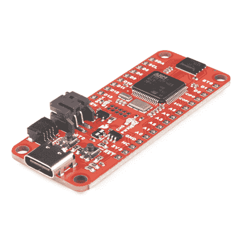

# STM32 Thing Plus 连接指南

> 原文：<https://learn.sparkfun.com/tutorials/stm32-thing-plus-hookup-guide>

## 介绍

什么产品集成了高性能 Arm Cortex -M4 32 位 RISC 内核、全套 DSP 指令、存储器保护单元(MPU)、高速嵌入式存储器、高达 4kb 的备份 SRAM 以及广泛的增强型 I/o 和外设？新的 [SparkFun STM32 Thing Plus](https://www.sparkfun.com/products/17712) 在流行的、羽毛兼容的 Thing Plus 外形中拥有所有这些和更多。

让我们来看看细节吧！

 

将**添加到您的[购物车](https://www.sparkfun.com/cart)中！**

### [SparkFun 的东西 Plus-STM 32](https://www.sparkfun.com/products/17712)

[In stock](https://learn.sparkfun.com/static/bubbles/ "in stock") DEV-17712

凭借 32 位 ARM Cortex -M4 RISC 内核，SparkFun STM32 Thing Plus 为您的项目带来强大的功能和精度。

$32.50[Favorited Favorite](# "Add to favorites") 5[Wish List](# "Add to wish list")** **[https://www.youtube.com/embed/ZYDraoF1Z0s/?autohide=1&border=0&wmode=opaque&enablejsapi=1](https://www.youtube.com/embed/ZYDraoF1Z0s/?autohide=1&border=0&wmode=opaque&enablejsapi=1)

### 所需材料

要跟随本教程，您将需要以下材料。你可能不需要所有的东西，这取决于你拥有什么。将它添加到您的购物车，通读指南，并根据需要调整购物车。**