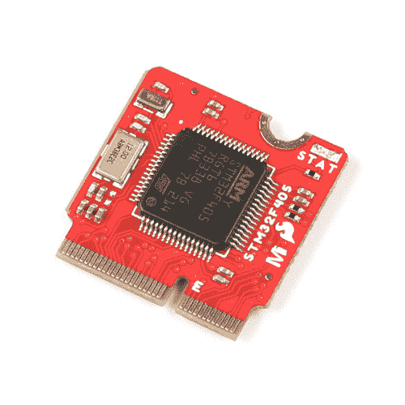

# MicroMod STM32 处理器连接指南

> 原文：<https://learn.sparkfun.com/tutorials/micromod-stm32-processor-hookup-guide>

## 介绍

我们将 STM32 处理器的强大功能和精度带到了 MicroMod 生态系统中！有请 [MicroMod STM32 处理器板](https://www.sparkfun.com/products/21326)！凭借高性能的 Arm Cortex -M4 32 位 RISC 内核、高达 1 兆字节的闪存、高达 192 千字节的 SRAM、存储器保护单元(MPU)、高速嵌入式存储器、高达 4 千字节的备份 SRAM，以及广泛的增强型 I/o 和外设，该板已准备好震撼您的 MicroMod 世界。让我们开始吧！

 

将**添加到您的[购物车](https://www.sparkfun.com/cart)中！**

 **### [SparkFun MicroMod STM32 处理器](https://www.sparkfun.com/products/21326)

[In stock](https://learn.sparkfun.com/static/bubbles/ "in stock") DEV-21326

SparkFun MicroMod STM32 处理器板已经准备好用其 ARM Cortex -M4 32 位 RISC 内核震撼您的 MicroMod 世界！

$16.50[Favorited Favorite](# "Add to favorites") 0[Wish List](# "Add to wish list")** **[https://www.youtube.com/embed/ZYDraoF1Z0s/?autohide=1&border=0&wmode=opaque&enablejsapi=1](https://www.youtube.com/embed/ZYDraoF1Z0s/?autohide=1&border=0&wmode=opaque&enablejsapi=1)

### 所需材料

要跟随本教程，您将需要以下材料。你可能不需要所有的东西，这取决于你拥有什么。将它添加到您的购物车，通读指南，并根据需要调整购物车。**