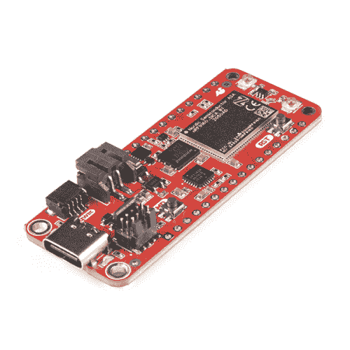

# nRF9160 Thing Plus 连接指南

> 原文：<https://learn.sparkfun.com/tutorials/nrf9160-thing-plus-hookup-guide>

## 介绍

SparkFun 已经与 CircuitDojo 合作，为您带来了 [SparkFun nRF9160 Thing Plus](https://www.sparkfun.com/products/17354) ，它采用了功能强大的 Nordic nRF9160 微控制器，尺寸与羽毛兼容。这款小芯片支持卡特彼勒 M1 LTE 和 NB-IoT 蜂窝通信，旨在与 RTOS 嵌入式开发的领军企业泽法合作。

您不仅可以利用 Nordic 的高级电源状态，还可以将设备置于低功耗待机状态。实验室测量显示这种模式的电流约为 2 A。2 A！它还具有 3.3V 降压升压功能，有助于尽可能从电池中获得最大功率。

没有电池？没问题！您可以从外部给 nRF9160 Thing Plus 插上电源或供电，以实现交流/DC 供电操作。对于高可用性场景，请始终保持开启状态。通过 5V 引脚供电或插入 USB C 线，让事情继续进行。

想要持久化数据？nRF9160 Thing Plus 有一个 4MB 的外部闪存，用于在离线时存储数据。使用外部闪存和 LitteFS 这样的文件系统，你将有一个项目来侦察！

 

将**添加到您的[购物车](https://www.sparkfun.com/cart)中！**

 **### [SparkFun 东西 Plus - nRF9160](https://www.sparkfun.com/products/17354)

[In stock](https://learn.sparkfun.com/static/bubbles/ "in stock") WRL-17354

SparkFun 已与 CircuitDojo 合作，为您带来 nRF9160 Thing Plus，其中包含强大的北欧 nRF9160

$139.95[Favorited Favorite](# "Add to favorites") 16[Wish List](# "Add to wish list")** **[https://www.youtube.com/embed/YP9-e5wG8Nw/?autohide=1&border=0&wmode=opaque&enablejsapi=1](https://www.youtube.com/embed/YP9-e5wG8Nw/?autohide=1&border=0&wmode=opaque&enablejsapi=1)

### 所需材料

要跟随本教程，您将需要以下材料。你可能不需要所有的东西，这取决于你拥有什么。将它添加到您的购物车，通读指南，并根据需要调整购物车。**