# SparkFun QwiicBus 连接指南

> 原文：<https://learn.sparkfun.com/tutorials/sparkfun-qwiicbus-hookup-guide>

## 介绍

介绍 SparkFun QwiicBus 系统！QwiicBus 是扩展 I ² C 总线范围的一种快速简单的方法。QwiicBus 系统有两块板:T2 spark fun QwiicBus 端点和 T4 spark fun QwiicBus 中点。SparkFun 还提供了 [QwiicBus 套件](https://www.sparkfun.com/products/17250)，包括两个端点、一个中点和两条以太网电缆，让您开始使用 QwiicBus。

[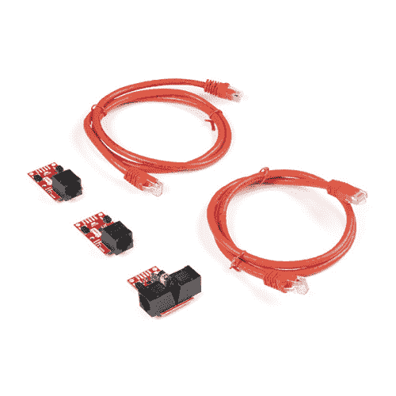](https://www.sparkfun.com/products/17250) 

将**添加到您的[购物车](https://www.sparkfun.com/cart)中！**

### [SparkFun QwiicBus 套件](https://www.sparkfun.com/products/17250)

[Out of stock](https://learn.sparkfun.com/static/bubbles/ "out of stock") KIT-17250

快速简单地扩展 I2C 通信总线范围所需的一切。

$42.95[Favorited Favorite](# "Add to favorites") 6[Wish List](# "Add to wish list")****[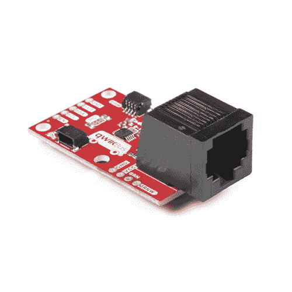](https://www.sparkfun.com/products/16988) 

将**添加到您的[购物车](https://www.sparkfun.com/cart)中！**

### [spark fun QwiicBus-EndPoint](https://www.sparkfun.com/products/16988)

[In stock](https://learn.sparkfun.com/static/bubbles/ "in stock") COM-16988

SparkFun QwiicBus 端点是扩展 I2C 通信总线范围的最快和最简单的方法。

$11.953[Favorited Favorite](# "Add to favorites") 11[Wish List](# "Add to wish list")****[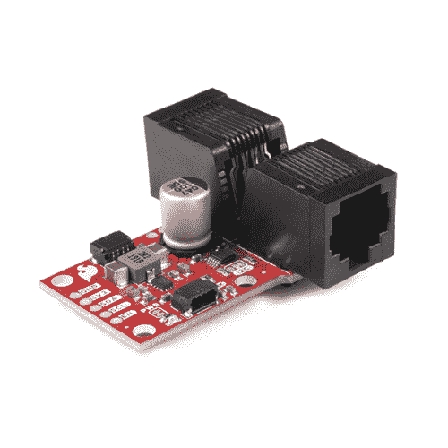](https://www.sparkfun.com/products/18000) 

将**添加到您的[购物车](https://www.sparkfun.com/cart)中！**

### [SparkFun QwiicBus -中点](https://www.sparkfun.com/products/18000)

[Only 7 left!](https://learn.sparkfun.com/static/bubbles/ "only 7 left!") COM-18000

QwiicBus 中点与 QwiicBus 端点协同工作，以扩展您的 I2C 总线的范围，并接入它以降低…

$22.501[Favorited Favorite](# "Add to favorites") 5[Wish List](# "Add to wish list")****** ******[https://www.youtube.com/embed/0Dbp4Je5NPQ/?autohide=1&border=0&wmode=opaque&enablejsapi=1](https://www.youtube.com/embed/0Dbp4Je5NPQ/?autohide=1&border=0&wmode=opaque&enablejsapi=1)

QwiicBus 使用恩智浦的 PCA9615 差分 I ² C 总线缓冲 IC，将两个默认 I ² C 信号转换为四个差分信号(两个用于 SCL，两个用于 SDA)。差分信号通过以太网电缆发送，该电缆通过板载 RJ-45 连接器连接到端点或中点。差分信号允许 I ² C 信号到达超过 100 英尺的距离，同时仍然保持其信号完整性。在我们的测试中，使用了两个端点、四个中点、每个节点上至少一个 Qwiic 设备和超过 200 英尺的以太网电缆，我们能够使用所有设备，几乎没有信号完整性损失！

端点作为 QwiicBus 的起点和终点，而中点则允许您在您想要的任何位置向长距离差分 I ² C 链添加插入式 I2C 连接。

这些电路板是与 FarmHand Automation 合作的产物。在开发自主微型拖拉机以帮助小农户发展业务的同时，Farmhand 意识到他们需要一种低成本、开源的 CAN/Modbus 替代方案。[在这里阅读他们的故事](https://www.sparkfun.com/pages/custom_farming_solution)。FarmHand 创始人亚历克斯·琼斯说:“我们知道我们想要使用的传感器，但一旦你需要在嘈杂的环境中进行长距离通信，事情就变得复杂了。Qwiic 中点将解决很多令人头疼的问题。”QwiicBus MidPoint 和 QwiicBus EndPoint 非常适合需要通过以太网进行远程通信的应用，例如农业技术或农村/偏远地区的数据收集/监控。

无论你有一个像 FarmHand 这样的带有多个 I ² C 设备的机器人，一个在大面积上带有多个传感器的传感器网络项目，还是你能想到的其他需要长距离有线信号传输的 I ² C 项目，QwiicBus 都可以让这种通信变得轻而易举！

### 所需材料

如果您使用 QwiicBus 套件，您将拥有组装 QwiicBus 电路所需的电路板和以太网电缆。否则，您将需要选择两个端点以及项目需要的任意多个中点。

除了 QwiicBus 板，您还需要以下材料来学习本教程。你可能不需要所有的东西，这取决于你拥有什么。将它添加到您的购物车，通读指南，并根据需要调整购物车。

需要一个微控制器来控制连接到 QwiicBus 的任何 I ² C 设备。以下是一些开箱即用的 Qwiic 选项:

 

将**添加到您的[购物车](https://www.sparkfun.com/cart)中！**

### [【spark fun Thing Plus-ESP32 WROOM(微-B)](https://www.sparkfun.com/products/15663)

[Out of stock](https://learn.sparkfun.com/static/bubbles/ "out of stock") WRL-15663

SparkFun ESP32 Thing Plus 是开始使用 Espressif 物联网概念的下一步，同时还可以享受所有的便利设施

$22.5010[Favorited Favorite](# "Add to favorites") 48[Wish List](# "Add to wish list")**** 

将**添加到您的[购物车](https://www.sparkfun.com/cart)中！**

### [【spark fun Qwiic Pro Micro-USB-C(atmega 32 u 4)](https://www.sparkfun.com/products/15795)

[In stock](https://learn.sparkfun.com/static/bubbles/ "in stock") DEV-15795

SparkFun Qwiic Pro Micro 在小型化的 Arduino bo 上增加了一个重置按钮、Qwiic 连接器、USB-C 和齿形垫…

$21.507[Favorited Favorite](# "Add to favorites") 46[Wish List](# "Add to wish list")**** 

将**添加到您的[购物车](https://www.sparkfun.com/cart)中！**

### [spark fun RedBoard Qwiic](https://www.sparkfun.com/products/15123)

[In stock](https://learn.sparkfun.com/static/bubbles/ "in stock") DEV-15123

SparkFun RedBoard Qwiic 是一款 Arduino 兼容开发板，内置 Qwiic 连接器，无需…

$21.5014[Favorited Favorite](# "Add to favorites") 49[Wish List](# "Add to wish list")****[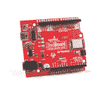](https://www.sparkfun.com/products/15444) 

将**添加到您的[购物车](https://www.sparkfun.com/cart)中！**

### [SparkFun RedBoard Artemis](https://www.sparkfun.com/products/15444)

[In stock](https://learn.sparkfun.com/static/bubbles/ "in stock") DEV-15444

RedBoard Artemis 采用 SparkFun 的功能强大的 Artemis 模块，并将其包装在一个易于使用和熟悉的环境中…

$21.509[Favorited Favorite](# "Add to favorites") 32[Wish List](# "Add to wish list")******** ********如果您喜欢使用单板计算机(SBC ),如 Raspberry Pi 或 Jetson Nano 作为控制器，以下产品也可用于 QwiicBus:

[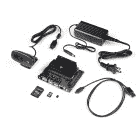](https://www.sparkfun.com/products/16308) 

将**添加到您的[购物车](https://www.sparkfun.com/cart)中！**

### [捷信纳米的 SparkFun DLI 套件](https://www.sparkfun.com/products/16308)

[19 available](https://learn.sparkfun.com/static/bubbles/ "19 available") KIT-16308

随着 Jetson Nano 开发套件的发布，NVIDIA 使开发人员、研究人员、学生和业余爱好者能够通过

$229.955[Favorited Favorite](# "Add to favorites") 20[Wish List](# "Add to wish list")**** 

### [【树莓派 4 型号 B (2 GB)](https://www.sparkfun.com/products/15446)

[Out of stock](https://learn.sparkfun.com/static/bubbles/ "out of stock") DEV-15446

2 GB Raspberry Pi 4 具有运行两个 4k 分辨率显示器的能力，以运行真正的千兆位以太网操作，所有…

4[Favorited Favorite](# "Add to favorites") 119[Wish List](# "Add to wish list") 

将**添加到您的[购物车](https://www.sparkfun.com/cart)中！**

### [NVIDIA Jetson Nano 开发者套件(V3)](https://www.sparkfun.com/products/16271)

[Out of stock](https://learn.sparkfun.com/static/bubbles/ "out of stock") DEV-16271

NVIDIA Jetson Nano 开发套件 V3 以小尺寸、低成本提供运行现代人工智能工作负载的性能

$149.0011[Favorited Favorite](# "Add to favorites") 57[Wish List](# "Add to wish list")**** 

### [SparkFun 树莓 Pi 4 桌面套装- 4GB](https://www.sparkfun.com/products/16386)

[Out of stock](https://learn.sparkfun.com/static/bubbles/ "out of stock") KIT-16386

SparkFun Raspberry Pi 4 桌面套件(4GB)包括将任何带 HDMI 端口的显示器变成桌面所需的一切

[Favorited Favorite](# "Add to favorites") 10[Wish List](# "Add to wish list")**** ****如果您喜爱的微控制器或单板计算机尚未启用 Qwiic，您可以添加以下一项或多项功能:

[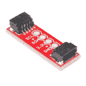](https://www.sparkfun.com/products/14495) 

将**添加到您的[购物车](https://www.sparkfun.com/cart)中！**

### [SparkFun Qwiic 适配器](https://www.sparkfun.com/products/14495)

[In stock](https://learn.sparkfun.com/static/bubbles/ "in stock") DEV-14495

SparkFun Qwiic 适配器提供了将任何旧 I ² C 板改造成支持 Qwiic 的板的完美方法。

$1.601[Favorited Favorite](# "Add to favorites") 53[Wish List](# "Add to wish list")**** 

将**添加到您的[购物车](https://www.sparkfun.com/cart)中！**

### [ArduinoT3 的 SparkFun Qwiic 盾](https://www.sparkfun.com/products/14352)

[In stock](https://learn.sparkfun.com/static/bubbles/ "in stock") DEV-14352

SparkFun Qwiic Shield 是一种易于组装的板，它提供了一种简单的方法来将 Qwiic Connect 系统与

$7.508[Favorited Favorite](# "Add to favorites") 39[Wish List](# "Add to wish list")**** 

将**添加到您的[购物车](https://www.sparkfun.com/cart)中！**

### [树莓派的 spark fun Qwiic pHAT v 2.0](https://www.sparkfun.com/products/15945)

[15 available](https://learn.sparkfun.com/static/bubbles/ "15 available") DEV-15945

树莓派的 SparkFun Qwiic pHAT V2 是进入 Qwiic 生态系统和 sti…

$6.952[Favorited Favorite](# "Add to favorites") 32[Wish List](# "Add to wish list")**** 

将**添加到您的[购物车](https://www.sparkfun.com/cart)中！**

### [树莓派的 SparkFun Qwiic 垫片](https://www.sparkfun.com/products/15794)

[In stock](https://learn.sparkfun.com/static/bubbles/ "in stock") DEV-15794

spark fun Qwiic SHIM for Raspberry Pi 是一个小型、易于拆卸的突破，可以轻松地将 qw IIC 连接器添加到您的 Ras…

$1.0512[Favorited Favorite](# "Add to favorites") 18[Wish List](# "Add to wish list")******** ********您可能还需要一些 Qwiic 电缆来连接 I ² C 总线上的设备:

 

将**添加到您的[购物车](https://www.sparkfun.com/cart)中！**

### [Qwiic 线缆- 100mm](https://www.sparkfun.com/products/14427)

[In stock](https://learn.sparkfun.com/static/bubbles/ "in stock") PRT-14427

这是一条 100 毫米长的 4 芯电缆，带有 1 毫米 JST 端接。它旨在将支持 Qwiic 的组件连接在一起…

$1.50[Favorited Favorite](# "Add to favorites") 32[Wish List](# "Add to wish list")**** 

将**添加到您的[购物车](https://www.sparkfun.com/cart)中！**

### [Qwiic 线缆- 500mm](https://www.sparkfun.com/products/14429)

[In stock](https://learn.sparkfun.com/static/bubbles/ "in stock") PRT-14429

这是一根 500mm 长的 4 芯电缆，带有 1mm JST 端接。它旨在将支持 Qwiic 的组件连接在一起…

$1.951[Favorited Favorite](# "Add to favorites") 25[Wish List](# "Add to wish list")**** 

将**添加到您的[购物车](https://www.sparkfun.com/cart)中！**

### [Qwiic 线缆- 50mm](https://www.sparkfun.com/products/14426)

[In stock](https://learn.sparkfun.com/static/bubbles/ "in stock") PRT-14426

这是一根 50 毫米长的 4 芯电缆，带有 1 毫米 JST 端接。它旨在将支持 Qwiic 的组件连接在一起…

$0.95[Favorited Favorite](# "Add to favorites") 29[Wish List](# "Add to wish list")**** 

### [Qwiic 线缆- 200mm](https://www.sparkfun.com/products/14428)

[Out of stock](https://learn.sparkfun.com/static/bubbles/ "out of stock") PRT-14428

这是一根 200 毫米长的 4 芯电缆，带有 1 毫米 JST 端接。它旨在将支持 Qwiic 的组件连接在一起…

[Favorited Favorite](# "Add to favorites") 21[Wish List](# "Add to wish list")****** ******最后，如果您不使用 QwiicBus 套件，您至少需要一根直通以太网电缆。

### 备选 QwiicBus 电源配置的可选附件

QwiicBus 提供多种电源配置，适用于许多设备需要通过 QwiicBus 供电的应用。我们将在硬件概述和硬件组装中更详细地介绍这些配置。要使用这些配置，您需要一些额外的硬件和工具。单击下面的按钮，查看一些推荐的替代电源配置产品。

You'll want a dedicated power supply capable of supplying **5-36V** with adequate Amperage depending on your project's needs along with some wire to connect it to your QwiicBus: 

将**添加到您的[购物车](https://www.sparkfun.com/cart)中！**

### [电源- 5V，4A](https://www.sparkfun.com/products/15352)

[In stock](https://learn.sparkfun.com/static/bubbles/ "in stock") TOL-15352

这是专为 SparkFun 电子产品制造的高质量电源，具有很大的功率；5V 和 40 时为 20W

$13.95[Favorited Favorite](# "Add to favorites") 12[Wish List](# "Add to wish list")**** 

### [指 LED 开关电源-5v 直流，5A](https://www.sparkfun.com/products/retired/14601)

[Retired](https://learn.sparkfun.com/static/bubbles/ "Retired") TOL-14601

这是一款 40W 单输出开关电源，来自 Mean Well，专为 LED 应用而设计

**Retired**[Favorited Favorite](# "Add to favorites") 8[Wish List](# "Add to wish list")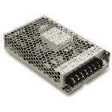 

### 平均井开关电源- 12VDC，12.5A

[Retired](https://learn.sparkfun.com/static/bubbles/ "Retired") TOL-16266

这意味着开关电源具有 12VDC、12.5A、150W 的输出。

**Retired** 

### 平均井开关电源-5v 直流，18A

[Retired](https://learn.sparkfun.com/static/bubbles/ "Retired") TOL-16607

这是一款来自 Mean Well 的 100W 单输出开关电源。

**Retired******You'll also need a soldering iron and solder to assemble your power circuit: 

### [威勒 WLC100 焊台](https://www.sparkfun.com/products/14228)

[Out of stock](https://learn.sparkfun.com/static/bubbles/ "out of stock") TOL-14228

Weller 的 WLC100 是一款多功能的 5 瓦至 40 瓦焊台，非常适合业余爱好者、DIY 爱好者和学生。…

2[Favorited Favorite](# "Add to favorites") 17[Wish List](# "Add to wish list") 

将**添加到您的[购物车](https://www.sparkfun.com/cart)中！**

### [无铅焊料- 100 克线轴](https://www.sparkfun.com/products/9325)

[In stock](https://learn.sparkfun.com/static/bubbles/ "in stock") TOL-09325

这是带有水溶性树脂芯的无铅焊料的基本线轴。0.031 英寸规格，100 克。这是一个好主意…

$9.957[Favorited Favorite](# "Add to favorites") 33[Wish List](# "Add to wish list")**** 

将**添加到您的[购物车](https://www.sparkfun.com/cart)中！**

### [【烙铁- 60W(可调温度)](https://www.sparkfun.com/products/14456)

[In stock](https://learn.sparkfun.com/static/bubbles/ "in stock") TOL-14456

当你不想倾家荡产，但又需要一个可靠的烙铁时，这个可调节温度的烙铁是一个很好的工具…

$16.5016[Favorited Favorite](# "Add to favorites") 43[Wish List](# "Add to wish list")**** 

将**添加到您的[购物车](https://www.sparkfun.com/cart)中！**

### [焊锡含铅 100 克线轴](https://www.sparkfun.com/products/9161)

[In stock](https://learn.sparkfun.com/static/bubbles/ "in stock") TOL-09161

这是你的含铅焊料的基本线轴，带有 63/37 水溶性树脂芯。0.031 英寸规格，100 克。这是一个很好的例子…

$6.503[Favorited Favorite](# "Add to favorites") 25[Wish List](# "Add to wish list")****** ******### 推荐阅读

如果你不熟悉 Qwiic 系统，我们推荐你在这里阅读[以获得一个概述](https://www.sparkfun.com/qwiic)。

|  |
| *[Qwiic 连接系统](https://www.sparkfun.com/qwiic)* |

如果您不熟悉以下教程所涵盖的主题，我们也建议您看一看它们。

 [### 逻辑电平](https://learn.sparkfun.com/tutorials/logic-levels) Learn the difference between 3.3V and 5V devices and logic levels.[Favorited Favorite](# "Add to favorites") 82 [### 电力](https://learn.sparkfun.com/tutorials/electric-power) An overview of electric power, the rate of energy transfer. We'll talk definition of power, watts, equations, and power ratings. 1.21 gigawatts of tutorial fun 54 [### I2C](https://learn.sparkfun.com/tutorials/i2c) An introduction to I2C, one of the main embedded communications protocols in use today.[Favorited Favorite](# "Add to favorites") 128 [### 如何使用跳线焊盘和 PCB 走线](https://learn.sparkfun.com/tutorials/how-to-work-with-jumper-pads-and-pcb-traces) Handling PCB jumper pads and traces is an essential skill. Learn how to cut a PCB trace, add a solder jumper between pads to reroute connections, and repair a trace with the green wire method if a trace is damaged.[Favorited Favorite](# "Add to favorites") 11

## 硬件概述

QwiicBus 的简单性是其最大的吸引力之一，因为您真正需要的是 QwiicBus 板、以太网和 Qwiic 电缆以及控制器(开发板或 SBC)。其他 I ² C 通信方式需要将 I ² C 通信打包成另一种协议，无论是 [RS-485](https://en.wikipedia.org/wiki/RS-485) 还是[单线](https://en.wikipedia.org/wiki/1-Wire)。然而，PCA9615 利用差分收发器保持 I ² C 协议。在本节中，我们将进一步了解 QwiicBus 板和其上的硬件，以便更好地理解它们的工作原理。

### PCA9615 总线缓冲器 IC

让我们快速看一下中点和端点核心的 PCA9615 IC。PCA9615 充当一个桥接器，将标准双线 I ² C 总线转换为四线差分 I ² C 总线。转换为差分总线有助于防止高噪声环境中的信号中断，以及将信号扩展到长距离传输。有关 PCA9615 全部功能和特性集的详细信息，请查看[数据手册](https://cdn.sparkfun.com/assets/a/5/1/3/6/PCA9615.pdf)。

| [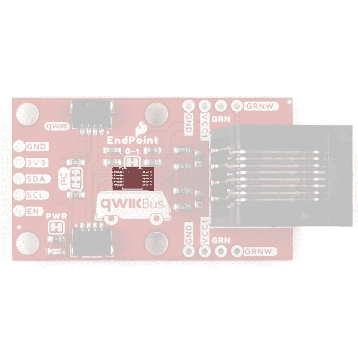](https://cdn.sparkfun.com/assets/learn_tutorials/1/2/0/2/QwiicBus_EndPoint-PCA9615.jpg) | [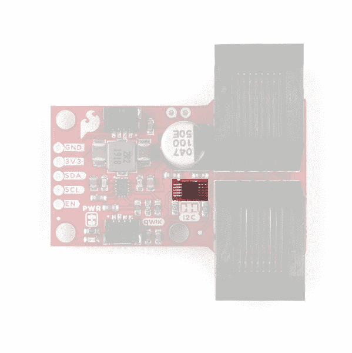](https://cdn.sparkfun.com/assets/learn_tutorials/1/2/0/2/QwiicBus_MidPoint-PCA9615.jpg) |

PCA9615 有两条电源电压轨:VDDA 和 VDDB。VDDA 主要用作 I ² C-bus 侧电源，VDDB 主要用于差分侧电源。而两个电源的工作范围略有不同(VDDA 电源电压范围: **2.3-5.5V** )。VDDB 电源电压范围: **3.0-5.5V** ，端点和中点都默认在 **3.3V** 将两个电压合在一起。

PCA9615 支持最高 1MHz 的 I ² C 时钟速度，尽管最大电缆长度与时钟速度成反比。在最大速度下，最大额定电缆长度为 3m，但在较低的时钟速度下可以增加。例如，在我们使用超过 200 英尺的以太网电缆对 QwiicBus 进行测试时，我们观察到在 Arduino 电线库的标准时钟速度(100KHz)下运行时没有明显的信号损失。

我们设计了 QwiicBus 中点和端点，为 QwiicBus 供电提供了多种配置选项，因此在给所有设备供电之前需要注意一些事项。我们将在“焊接跳线”小节和“硬件组装”小节中进一步讨论不同的电源配置，请继续阅读了解更多信息。

如果您想手动控制 PCA9615，QwiicBus 板还将 Enable (EN)引脚连接到 PTH 接头。默认情况下，它通过内部电阻被拉至 VDDA。有关使用此引脚的更多信息，请参考 [PCA9615 数据表](https://cdn.sparkfun.com/assets/a/5/1/3/6/PCA9615.pdf)的第 7.3 节。

最后，PCA9615 要求总线两端都有端接电阻才能正常工作。端点包括这些电阻，但正如中点的名称所暗示的，它仅用作一个节点(中间点)，因此没有端接电阻。因此，控制器*必须*连接到端点，当连接到中点时将无法正常工作。

### Qwiic 和 I ² C 接口

正如大部分读者所期待的那样，I ² C 引脚被分成两个 Qwiic 连接器，因此您可以轻松地将 QwiicBus 板连接到其他 Qwiic 设备。我们还为喜欢标准电镀通孔连接的用户将四个 I ² C 引脚拆分为标准 0.1 英寸间距的 PTH 插头引脚。

| [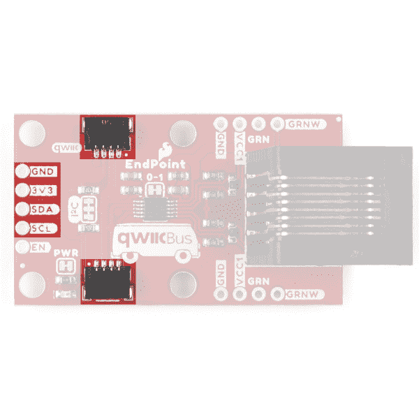](https://cdn.sparkfun.com/assets/learn_tutorials/1/2/0/2/QwiicBus_EndPoint-I2C.jpg) | [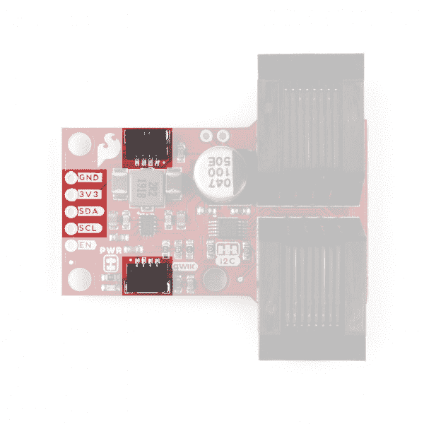](https://cdn.sparkfun.com/assets/learn_tutorials/1/2/0/2/QwiicBus_MidPoint-I2C.jpg) |

### 差分输出和 RJ-45 连接器

端点有一个 RJ-45 将差分信号发送到另一个端点或中点节点。中点带有两个 RJ-45 连接器，因此您可以轻松地将其集成到现有总线中。

| [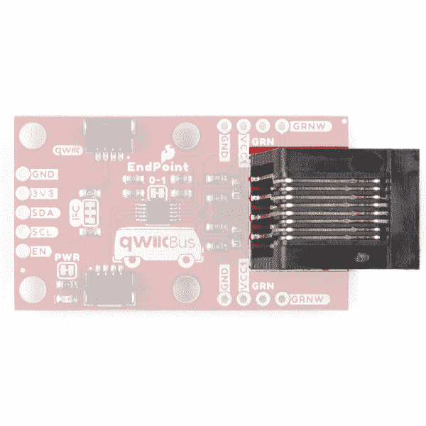](https://cdn.sparkfun.com/assets/learn_tutorials/1/2/0/2/QwiicBus_EndPoint-RJ11.jpg) | [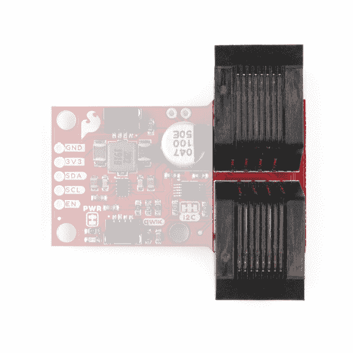](https://cdn.sparkfun.com/assets/learn_tutorials/1/2/0/2/QwiicBus_MidPoint-RJ11.jpg) |

根据您项目的电力需求，以太网电缆中未使用的绿色和蓝色双绞线可用于通过蓝色线对(以太网引脚 4 和 5)发送 **5V** 或通过绿色线对(以太网引脚 3 和 6)发送 **3.8V** 至 **36V** 。在端点上，蓝色线对连接到标记为 **VCC1** 和 **GND** 的 PTH 引脚，绿色线对连接到标记为 **VCC2** 和 **GND2** 的 PTH 引脚。

我们还将 **VCC2** 和 **GND2** 线分支到中点的一对 PTH 引脚，如果用户想要使用它们为外设供电或在单独的线路上通过 QwiicBus 链运行电压。

| [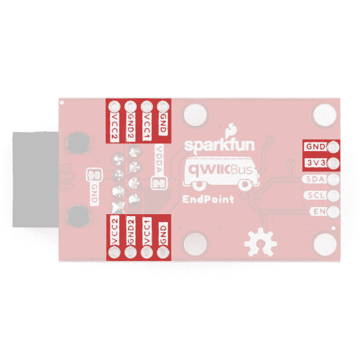](https://cdn.sparkfun.com/assets/learn_tutorials/1/2/0/2/QwiicBus_EndPoint-Voltage_Inputs.jpg) | [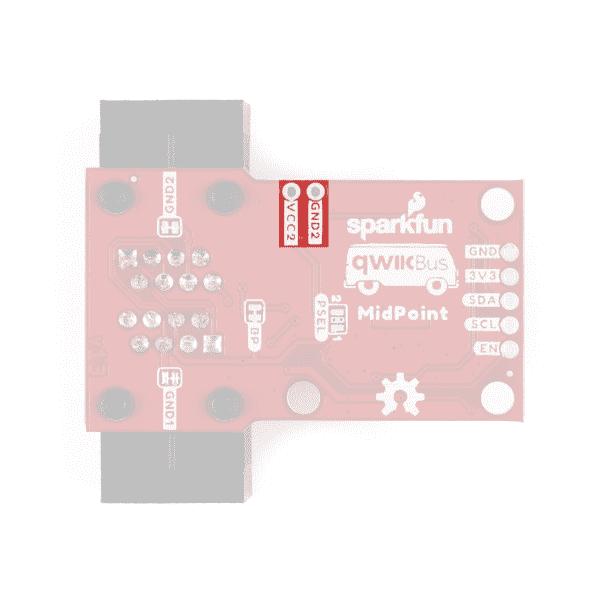](https://cdn.sparkfun.com/assets/learn_tutorials/1/2/0/2/QwiicBus_MidPoint-VCC2_PTH.jpg) |

只要 0-1 跳线**闭合**，VCC1 就同时连接到 PCA9615 上的 VDDA 和 VDDB(更多信息见以下章节)。VCC2 和 GND2 连接到以太网绿色线对，用于在任何连接的中点为降压调节器供电。如果用户通过这些电压输入中的任何一个给 QwiicBus 供电，所有中点上的旁路跳线必须打开**。使用绿色或蓝色线对向 QwiicBus 提供电压需要正确的电源配置，详见硬件组装部分。**

 **最后，您可能会注意到，从顶部看时，端点上的 VCC2 和 GND2 PTH 引脚标记为 **GRN** 和 **GRNW** 。通过打开端点上的 VDDA 和 GND 跳线，可以将绿色线对用作隔离信号线。注意，当以这种方式使用绿色线对时，确保任何连接的中点上的 GND2 跳线都是开路的。

### 降压调节器- *仅中点*

中点包括德州仪器的 LMR33630 简单切换器可变降压调节器。调节器接受在 **3.8V** 到 **36V** 之间的输入电压，因此您可以通过以太网电缆发送更高的电压，使长电缆上的任何电压降都可以忽略不计，并且 **3A@3.3V** 输出为连接到中点的任何设备提供更大的电流源。LMR33630 具有可变电压输出，中点设计将其设置为 **3.3V** 。

[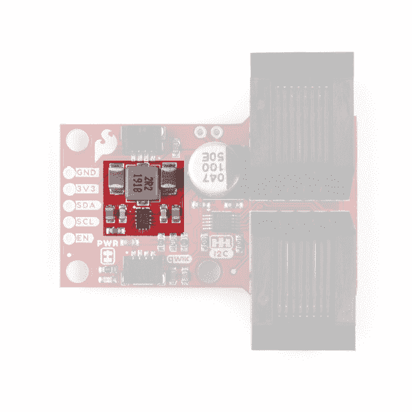](https://cdn.sparkfun.com/assets/learn_tutorials/1/2/0/2/QwiicBus_MidPoint-LMR33630.jpg)

默认情况下，降压调节器不供电，但该设计具有一个标记为 PSEL 的双跳线，用户可以进行调整，以使降压调节器能够通过端点和中点上断开的蓝色和绿色成对引脚，从更高的电压( **5V** 或 **3.8V** 到 **36V** )为中点供电。关于如何使用这些备用电源配置的更多信息，请继续阅读下面的焊接跳线小节和硬件组装部分。

**Note:** While the buck regulator is rated for **3A**, sourcing max current through the regulator continuously will cause it to heat up and decrease its efficiency. Running max current through the regulator for an extended period of time can also damage the IC and is not recommended.

### 焊料跳线

If you have never worked with solder jumpers and PCB traces before or would like a quick refresher, check out our [How to Work with Solder Jumpers and PCB Traces](https://learn.sparkfun.com/tutorials/how-to-work-with-jumper-pads-and-pcb-traces) tutorial for detailed instructions and tips.

在本节中，我们将介绍两个 QwiicBus 板上的跳线及其功能、默认状态以及调整前需要注意的一些事项。

由于本指南涵盖了两种 QwiicBus 板(端点和中点),我们将指出两种板上的跳线以及特定于板的跳线。端点的五个跳线分别标有: **I2C** 、 **PWR** 、 **VDDA** 、 **GND** 和 **0-1** 。六个中点跳线分别标有: **I2C** 、 **PWR** 、 **BP** 、 **PSEL** 、 **GND1** 和 **GND2** 。

| [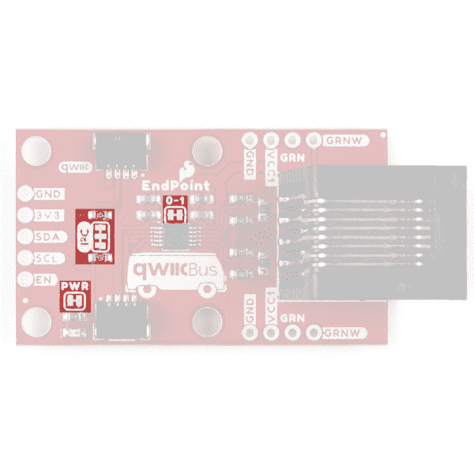](https://cdn.sparkfun.com/assets/learn_tutorials/1/2/0/2/QwiicBus_EndPoint-Jumpers_Top.jpg) | [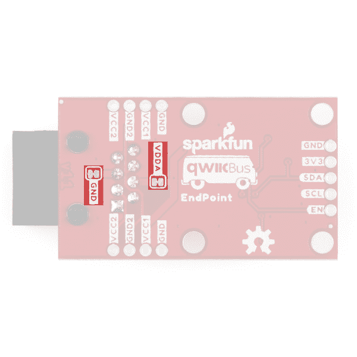](https://cdn.sparkfun.com/assets/learn_tutorials/1/2/0/2/QwiicBus_EndPoint-Jumpers_Bottom.jpg) |
| *QwiicBus 端点焊接跳线-顶部* | *QwiicBus 端点焊接跳线-底部* |
| [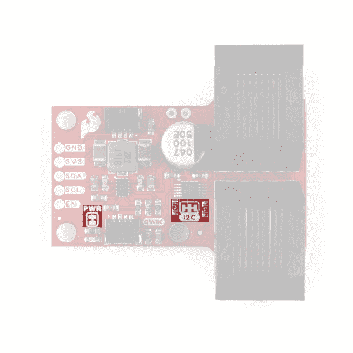](https://cdn.sparkfun.com/assets/learn_tutorials/1/2/0/2/QwiicBus_MidPoint-Jumpers_Top.jpg) | [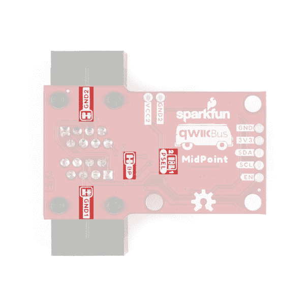](https://cdn.sparkfun.com/assets/learn_tutorials/1/2/0/2/QwiicBus_MidPoint-Jumpers_Bottom.jpg) |
| *QwiicBus 中点焊接跳线-顶部* | *QwiicBus 中点焊接跳线-底部* |

#### I ² C 上拉跳线- *端点和中点*

该跳线通过一对 **4.7k &欧姆将 SDA 和 SCL 线连接到 PCA9615 的 VDDA(通常为 **3.3V** );**电阻器。跳线的默认状态是**关闭**。要禁用上拉电阻，断开三个焊盘之间的走线来断开跳线。

**Note:** *Each* MidPoint will need its own set of pull-up resistors on the I²C side of the PCA9615\. We recommend disabling any pull-up resistors on devices connected to the MidPoint's Qwiic connectors or the SDA/SCL pins since if multiple devices have their pull-up resistors enabled, the parallel equivalent resistance can create too strong of a pull-up for the bus to operate correctly.

#### 电源(PWR) LED 跳线- *端点和中点*

该跳线通过一个 **1k &欧姆将功率 LED 的阴极连接到**3.3V**；**电阻器。跳线默认为**关闭**。通过切断两个焊盘之间的走线来断开跳线，以禁用任一 QwiicBus 板上的电源 LED。

#### VDDA 和 GND 跳投- *终点*

VDDA 和 GND 跳线连接 VDDA(如果 0-1 跳线闭合)并接地到 RJ-45 插孔和以太网电缆上的蓝色双绞线。它们的默认状态是**关闭**。如果用户不需要电源输入的蓝色线对，可以打开这些跳线，以便该线对可用于其他数据线或冗余电源连接。大多数用户都不想使用这些跳线。如果使用蓝色线对作为独立信号，确保任何中点上的 GND2 跳线**打开**。

#### 0-1 跳线- *端点*

0-1 跳线将 PCA9615 上的 VDDA 和 VDDB 连在一起。默认情况下，该跳线**闭合**，以相同的电源电压为 VDDA 和 VDDB 供电(默认电源配置中为 **3.3V** )。如果 VDDA (VCC)和 VDDB (VCC1)使用两个独立的电压，则断开此跳线。如果使用单独的电压，确保它们在 VDDA ( **2.3V-5.5V** )和 VDDB ( **3.0V-5.5V** )的电压范围内。

**Heads Up!** When using any of the alternate power configurations, the 0-1 jumper on the *primary / first* EndPoint should be **OPEN** but the 0-1 jumper on the *terminating / last* should be **CLOSED** to avoid leaving VDDB on the terminating EndPoint floating. Take note that with the 0-1 jumper **CLOSED**, **5V** is sent to the Qwiic connectors and **3.3V** PTH pin on the terminating EndPoint.

#### 旁路(BP)跳线- *中点*

旁路跳线(板上标有 BP)用中点的 **3.3V** 轨连接 VCC1。默认情况下，该跳线为**关闭**。当 QwiicBus 系统以 **3.3V** 供电时，该跳线可以保持闭合，但是如果 PSEL 跳线被调整为使用超过 **3.3V** 的任何电压来给 QwiicBus 供电，该跳线*必须*打开**。**

#### 电源选择(PSEL)跳线- *中点*

该双跳线选择哪个电压为中点降压调节器提供输入电压。电源选择跳线默认为**全部打开**，降压调节器为*未通电*。在此默认设置中，每个端点的电源为 **3.3V** ，通过微控制器/SBC 或专用 **3.3V** 电源的蓝色以太网电缆对提供。

如果使用 **5V** 电源配置，该跳线应闭合设置到**“1”**侧。当设置为**“1”**时，输入电压仍然通过以太网电缆的蓝色线对提供，但为 **5V** 。

如果使用 **3.8V-36V** 电源配置，关闭跳线设置到**“2”**侧。当设置为**“2”**时，输入电压通过以太网电缆的绿色线对提供。

**Important!** If either alternate setting of the PSEL Jumper is used, the Bypass Jumper *must be* **OPEN**.

#### GND1 和 GND2 跳线- *中点*

GND1 和 GND2 跳线将两个输入电压净接地。默认情况下，两个跳线都是**关闭**。在高级使用情况下，用户可以断开其中一个或两个跳线，以降低噪声和/或防止 QwiicBus 板上的接地环路。大多数用户都不想使用这些跳线。

### 电路板尺寸

QwiicBus 端点 PCB 的尺寸与 1.75 英寸 x 1.00in 英寸(44.45 毫米 x 25.40mm 毫米)的[差动 I ² C 分线点](https://www.sparkfun.com/products/14589)相同。中点尺寸为 1.80 英寸 x 1 英寸(45.72 毫米 x 25.40mm 毫米)，在 RJ-45 端张开至 1.10 英寸(27.94 毫米)。两块电路板上的 RJ-45 连接器从 PCB 边缘伸出约 0.30 英寸(7.62 毫米)。

[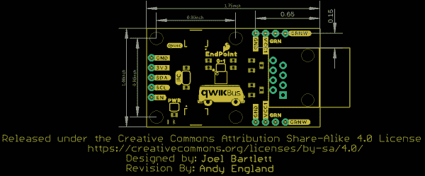](https://cdn.sparkfun.com/assets/e/e/f/7/9/QwiicBus_EndPoint-Dimensions.png)[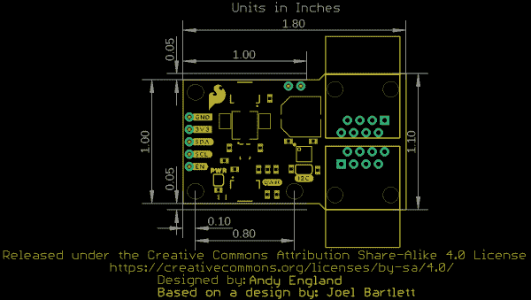](https://cdn.sparkfun.com/assets/4/b/3/4/9/QwiicBus_MidPoint-Dimensions.png)

## 硬件装配

在本节中，我们将介绍如何配置 QwiicBus 端点和中点，以及如何组装 QwiicBus 电路。在我们开始连接任何东西之前，有几件事情需要注意。

### 以太网电缆

确保您的以太网电缆是直通的(即电缆一端的引脚 1 连接到另一端的引脚 1)，并且*不是*交叉。大多数出售的以太网电缆是直通的，所以你可能没有什么好担心的。如果你不确定你用的是什么类型的以太网电缆，你可以用数字万用表测试针脚的连续性[。](https://learn.sparkfun.com/tutorials/how-to-use-a-multimeter#continuity)

还要考虑以太网电缆上的压降。对于较长的链或多个中点上有许多器件的电路，可以考虑使用一种备用电源配置，这样压降可以忽略不计。下面的公式可以帮助您计算不同长度的 CAT-6/Ethernet 电缆的电压降，以及您是否需要考虑备用电源选项之一:

[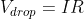](https://www.codecogs.com/eqnedit.php?latex=V_{drop}&space;=&space;IR)

在这个公式中，I 是通过物体的电流，单位为安培，R 是导线的电阻，单位为欧姆。大多数 CAT-6/Ethernet 电缆都有 24AWG 内部导线，根据电缆的质量，可以是铜或铝。参考类似 PowerStream 中的[表格，确定电阻的&欧姆；/1000 英尺或&欧姆；/km 来帮助计算近似的电压降。](https://www.powerstream.com/Wire_Size.htm)

### I ² C 上拉电阻

花点时间记下连接到端点和中点 I ² C 总线侧的哪些器件使能了上拉电阻，以及它们连接到什么电压。几乎所有 Qwiic 产品都有默认启用的上拉电阻，将直接连接到 I ² C 总线的 SDA/SCL 线拉到 **3.3V** 。

PCA9615 需要双线 I ² C 总线上的上拉电阻，因此**每个**端点和中点必须至少有一对在双线侧使能的上拉电阻。上拉电阻*不会*转换到 PCA9615 的差分端。为了让事情变得简单一点，每个 QwiicBus 端点和中点都在 SDA 和 SCL 线上配备了上拉电阻，连接到 VDDA。正常情况下，VDDA 为 **3.3V** ，但根据电源配置设置，端点上的电压可能高达 **5V** 。

**Note:** If multiple devices are connected and you have a single device with pull-up resistors, make sure the voltage they are netted to is within the operating voltage range of all other I²C devices on the bus (normally **3.3V** for Qwiic devices). If needed, you can shift the voltage to safe levels with a level shifter or voltage divider. If you're not familiar with logic levels and how to shift them, take a read through [this tutorial](https://learn.sparkfun.com/tutorials/logic-levels).

### 电源配置设置

正如我们在本指南的硬件概述部分提到的，两种 QwiicBus 板都有大量跳线和两对专用电源 PTH 引脚，用于配置如何为 QwiicBus 电路供电。让我们仔细看看为 QwiicBus 供电的三个选项。

**Important!** When using alternate power configurations make sure to double check the jumpers on all EndPoints and MidPoints on your QwiicBus are set properly per the instructions below. Any QwiicBus boards or other Qwiic devices on your bus can be damaged if the circuit is assembled improperly.

#### 默认-整个系统处于 3.3V

在这种配置中，整个系统以 **3.3V** 供电，中点的降压调节器不供电。在中点处，旁路跳线**关闭**，PSEL 跳线两侧**打开**。 **3.3V** 由您的开发板或单板计算机通过 Qwiic 连接器或主端点上的 **3.3V** 引脚提供。

请注意，在这种配置中，所有电源都通过 CAT-6/以太网电缆提供，由于内部电线的物理限制，使用标准 CAT-6/以太网电缆时，连接设备的总电流消耗将被限制在 **~550mA** 。任何超过**550 毫安**的电流都有损坏电线的风险，并可能引发火灾。

然后， **3.3V** 电源电压通过 QwiicBus 系统中的 CAT-6/以太网电缆从初始端点传输。请注意，在很长的电线上，您会看到电压下降，如果电压下降到工作范围以下，QwiicBus 链下游的设备可能会出现故障。参考上面以太网电缆小节中的公式和链接，计算电路中的压降。

#### 5V 时的备用 1 - VCC1

虽然默认的 **3.3V** 配置对于较短的 QwiicBus 链应该工作得很好，但我们发现 PCA9615 在使用 **5V** 供电时工作得更好。利用 **5V** 为 VCC1 供电，我们还可以在中点使用降压调节器，为连接到中点的器件提供高达 **3A@3.3V** 的电源。使用这种配置需要调整端点和中点以及多个电源。

首先也是最重要的，每个中点*上的旁路跳线必须* **打开**。在每个中点，将 PSEL 跳线调整到**“1”**侧(见下图)。

[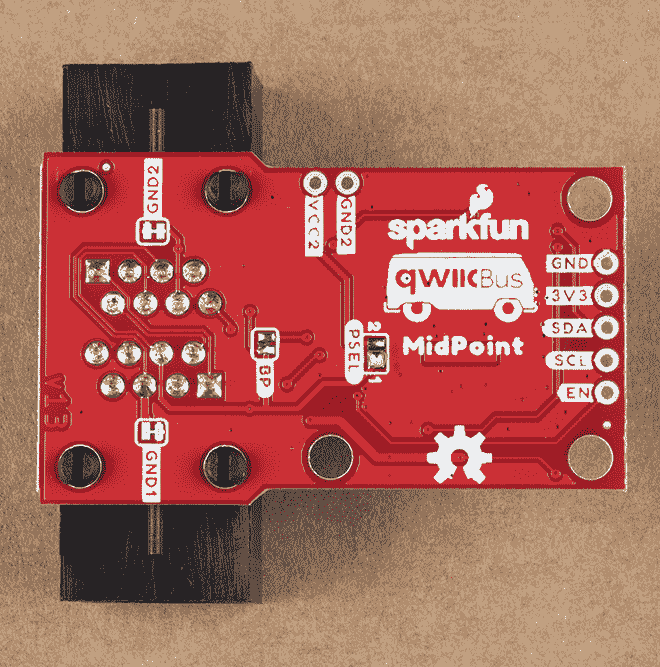](https://cdn.sparkfun.com/assets/learn_tutorials/1/2/0/2/QwiicBus_MidPoint-Power_Configuration-1.jpg)

强烈建议**断开**主/第一端点上的 0-1 跳线，以将 VCC (VDDA)与 VCC1 (VDDB)隔离，但让终端点**上的 0-1 跳线保持闭合**。保持 0-1 跳线闭合，将向连接到您的终端/最后一个端点的任何 Qwiic 设备发送 **5V** 。

[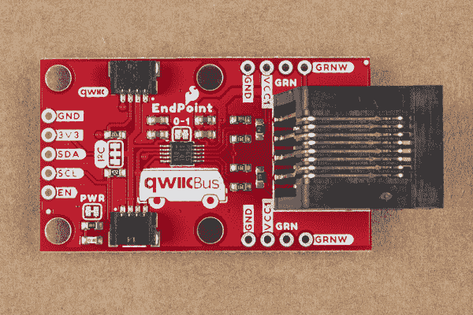](https://cdn.sparkfun.com/assets/learn_tutorials/1/2/0/2/QwiicBus_EndPoint-0-1_Open.jpg)

调整跳线并组装 QwiicBus 电路，包括连接到中点的任何外围设备，将您的 **5V** 源连接到主端点上的 VCC1 和 GND PTH 引脚。如果 0-1 跳线断开，则应在 Qwiic 连接器上或通过 **3.3V** PTH 引脚提供 **3.3V** 电压，为主端点上的 VCC (VDDA)供电。

#### 3.8V 至 36V 时的备用 2 - VCC2

对于这种配置，我们使用两个独立的电压为端点和中点供电。首先也是最重要的，每个中点*上的旁路跳线必须* **打开**。将 PSEL 跳线调节到每个中点的**“2”**位置。

[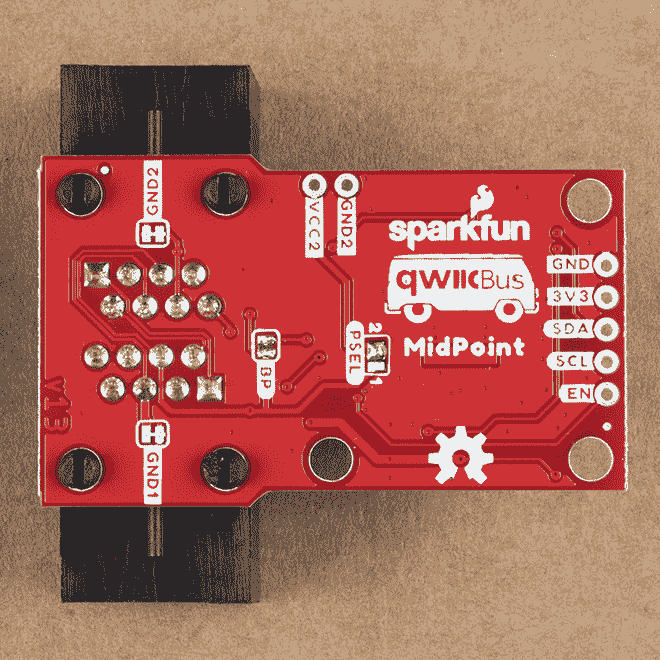](https://cdn.sparkfun.com/assets/learn_tutorials/1/2/0/2/QwiicBus_MidPoint-Power_Configuration-2.jpg)

如果您计划用 **5V** 给 VCC1 供电，建议**断开**主端点上的 0-1 跳线，以将 VCC 与 VCC1 隔离。如上所述，我们建议让终端点上的 0-1 跳线**关闭**。

调整跳线并组装 QwiicBus 电路(包括连接到中点的任何外围设备)后，将 **3.8V** 至 **36V** 连接到主端点上的 VCC2 和 GND2 PTH 引脚。第一端点的 **3.3V** 应由微控制器/SBC 通过 Qwiic 连接器提供，或通过 **3.3V** PTH 引脚提供专用电源。

#### 交替 3-5V 时的 VCC1 和 6V 至 36V 时的 VCC2

这种高级配置使用多个电源，以允许 QwiicBus 在具有多个中点的长距离上实现最佳性能。如上所述，我们已经发现 QwiicBus 在 **5V** (特别是 VDDB @ **5V** )的情况下在长距离上运行得最好。在这种配置下，VCC1 由 **5V** 供电，VCC2 由 **6V** - **36V** 供电。连接电源之前，必须调整一些跳线。

首先，每个中点*上的旁路跳线必须* **打开**。将所有中点上的 PSEL 跳线设置到**“2”**位置。主端点上的 0-1 跳线**打开**，终端端点上的 0-1 跳线**关闭**。这隔离了第一端点上的 VDDA 和 VDDB，因此第一端点上的 Qwiic 连接器处于 **3.3V** 。正如我们之前提到的，终端点上的 Qwiic 连接器和 **3.3V** PTH 引脚将处于 **5V** 电压，因此要小心连接到该端点的是什么。

在调整所有 QwiicBus 板上的跳线并组装电路的其余部分(包括将任何 Qwiic 器件连接到中点/端点)后，将 **5V** 电源连接到 VCC1 和 GND PTH 引脚，并将电源源 **6V** 到 **36V** 连接到 VCC2 和 GND2 PTH 引脚到主端点。

### 组装 QwiicBus 电路

**Important!** Make sure your QwiicBus circuit is ***not powered*** when adding or removing devices to your MidPoint(s) and EndPoint. Connecting and disconnecting devices while your QwiicBus is powered can cause voltage spikes and damage the PCA9615.

在考虑你打算如何配置你的 QwiicBus 电路之后，是时候组装它了。调整适当的跳线(如有必要)，将您的控制器(Arduino/SBC)连接到主端点，将任何 Qwiic/I ² C 设备连接到端点和中点，并将 QwiicBus 板相互连接，将以太网电缆插入每个板上的 RJ-45 连接器。一旦所有设备都连接在一起，给电路加电。下面的照片显示了在默认配置下组装的 QwiicBus(所有板都由 **3.3V** 供电)，因此您的电路可能会有所不同。

[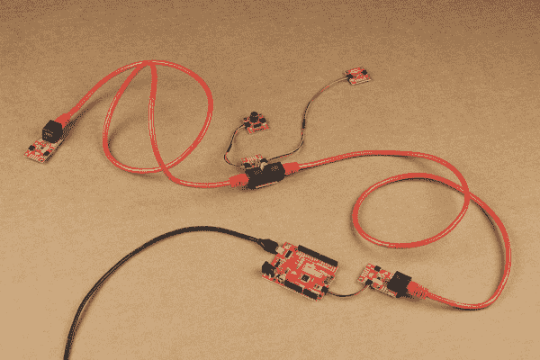](https://cdn.sparkfun.com/assets/learn_tutorials/1/2/0/2/QwiicBus-Completed_3V3_Circuit.jpg)*A completed QwiicBus Kit circuit using a SparkFun RedBoard Qwiic and operating at **3.3V***

一切调整和连接正确，这就是你需要组装你的 QwiicBus 电路。向前迈进，随心所欲地建造长得离谱的有线 I ² C 电路！

## 解决纷争

以下是 SparkFun QwiicBus 的一些故障排除技巧。

### I ² C 通信

PCA9615 在短距离内支持高达 1MHz 的 I ² C 时钟速度，但随着电缆长度的增加，高时钟速度可能变得更加不可靠。如果您发现 QwiicBus 上的数据丢失或通信不可靠，请尝试降低时钟速度作为快速软件修复方法。切换到备用电源配置之一也有助于提高高时钟速度下长距离传输的可靠性。

### 电压降落

长距离电缆传输时，电压可能会降至 PCA9615 或附属设备的工作电压范围以下。下面的公式可以帮助您计算不同长度的 CAT-5/Ethernet 电缆的电压降，以及您是否需要使用备用电源选项之一:

I 是通过物体的电流，单位为安培，R 是导线的电阻，单位为欧姆。大多数 CAT-5/以太网电缆都有 24AWG 内部导线，根据电缆的质量，可能是铜制的，也可能是铝制的。参考类似 PowerStream 中的[表格，确定以ω/1000 ft 或ω/km 为单位的电阻，以帮助计算 QwiicBus 电路上的近似电压降。](https://www.powerstream.com/Wire_Size.htm)

### 推荐的上电/关断程序

记住在将任何设备连接到链上或从链上断开之前，关闭 QwiicBus 电路*。如果 QwiicBus 板上的 PCA9615 通电，连接或断开 QwiicBus 上的设备可能会损坏 PCA 9615。*

### 终端上的浮动 VDDB

请注意，当使用任何备用电源配置时，*初级/第一个*端点上的 0-1 跳线应**断开**，但*终端/最后一个*上的 0-1 跳线应**闭合**，以避免终端上的 VDDB 悬空。注意，当 0-1 跳线**闭合**时， **5V** 被发送到 Qwiic 连接器和终端点上的 **3.3V** PTH 引脚。

### 终端电阻器

与上面的提示相关，QwiicBus 仅适用于控制器(Arduino/SBC/etc)。)连接到端点。顾名思义，端点设计包括所需的端接电阻，作为 QwiicBus 的端点。中点*不*包括这些电阻，因为它们将作为节点插入端点之间。

### 常规故障排除

**Need help?**

If your product is not working as you expected or you need technical assistance or information, head on over to the [SparkFun Technical Assistance](https://www.sparkfun.com/technical_assistance) page for some initial troubleshooting.

If you don't find what you need there, the [SparkFun Forums](https://forum.sparkfun.com/index.php) are a great place to find and ask for help from our Tech Support team and communicty. If this is your first visit, you'll need to [create a Forum Account](https://forum.sparkfun.com/ucp.php?mode=register) to search product forums and post questions.

## 资源和更进一步

既然您已经按照自己的喜好设置和配置了 QwiicBus，那么是时候开始创建一些 I ² C 设备网络了！有关更多信息，请查看以下链接:

**QwiicBus 端点链接**

*   [示意图(PDF)](https://cdn.sparkfun.com/assets/b/8/9/5/a/SparkFun_QwiicBus_Endpoint-Schematic.pdf)
*   [老鹰文件(ZIP)](https://cdn.sparkfun.com/assets/2/3/c/e/4/SparkFun_QwiicBus_Endpoint.zip)
*   [尺寸图(PNG)](https://cdn.sparkfun.com/assets/e/e/f/7/9/QwiicBus_EndPoint-Dimensions.png)
*   [PCA9615 数据手册(PDF)](https://cdn.sparkfun.com/assets/a/5/1/3/6/PCA9615.pdf)
*   [硬件 GitHub 库](https://github.com/sparkfun/QwiicBus_EndPoint)

**QwiicBus 中点链接**

*   [示意图(PDF)](https://cdn.sparkfun.com/assets/d/f/f/b/6/SparkFun_QwiicBus_Midpoint-Schematic.pdf)
*   [老鹰文件(ZIP)](https://cdn.sparkfun.com/assets/0/a/f/c/1/SparkFun_QwiicBus-Midpoint.zip)
*   [尺寸图(PNG)](https://cdn.sparkfun.com/assets/4/b/3/4/9/QwiicBus_MidPoint-Dimensions.png)
*   [LMR33630 数据手册(PDF)](https://cdn.sparkfun.com/assets/6/5/6/c/5/lmr33630.pdf)
*   [硬件 GitHub 库](https://github.com/sparkfun/QwiicBus_MidPoint)

在以下链接中阅读更多关于 Farmhand 的 QwiicBus 故事和 SparkFun 的其他农业技术项目的信息:

*   [Farmhand:构建定制的农业解决方案](https://www.sparkfun.com/custom_farming_solution)
*   [SparkFun 农业技术登陆页面](https://www.sparkfun.com/ag_tech)
*   [精准农业与环境监测技术博文](https://www.sparkfun.com/news/3788)

要获得使用 QwiicBus 的 I ² C 项目的灵感，请查看以下教程:

 [### 红纸板边缘连接导轨](https://learn.sparkfun.com/tutorials/redboard-edge-hookup-guide) The RedBoard Edge is a RedBoard that's been rebuilt around the idea that projects are eventually put into an enclosure to help clean up their look.[Favorited Favorite](# "Add to favorites") 1 [### Qwiic 透明有机发光二极管平视显示器连接指南](https://learn.sparkfun.com/tutorials/qwiic-transparent-oled-hud-hookup-guide) Learn how to connect that sweet transparent OLED.[Favorited Favorite](# "Add to favorites") 11 [### RFID 初学者教程](https://learn.sparkfun.com/tutorials/rfid-beginners-tutorial) In this tutorial we'll revisit some RFID basics and practice by making a remote work logger using an RFID reader and a GPS module. You'll scan a card and get ID, location, and time. All the perfect data to punch in and punch out from the middle of Nowhere 12 [### 用于 Raspberry Pi 连接指南的 Qwiic 垫片套件](https://learn.sparkfun.com/tutorials/qwiic-shim-kit-for-raspberry-pi-hookup-guide) Get started with the Serial LCD with RGB backlight and 9DoF IMU (ICM-20948) via I2C using the Qwiic system and Python on a Raspberry Pi! Take sensor readings and display them in the serial terminal or SerLCD.[Favorited Favorite](# "Add to favorites") 0********************************************