# Qwiic 多端口连接指南

> 原文：<https://learn.sparkfun.com/tutorials/qwiic-multiport-hookup-guide>

## 介绍

在 I ² C 总线上只有一个 Qwiic 端口的主板上， [SparkFun Qwiic 多端口](https://www.sparkfun.com/products/18012)增加了额外的端口。一旦添加完毕，你就可以把它作为一个集线器，根据你的需要把任意多的 I ² C 设备添加到总线上！您也可以将该板用作菊花链配置的替代产品。

[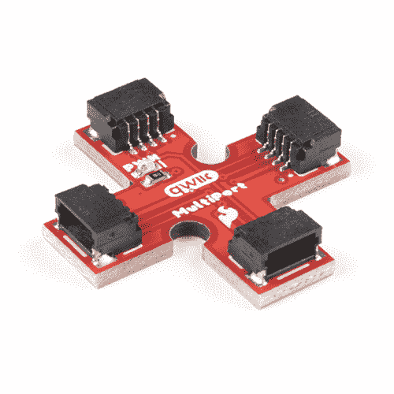](https://www.sparkfun.com/products/18012) 

将**添加到您的[购物车](https://www.sparkfun.com/cart)中！**

### [SparkFun Qwiic 多端口](https://www.sparkfun.com/products/18012)

[In stock](https://learn.sparkfun.com/static/bubbles/ "in stock") BOB-18012

Qwiic 多端口向 I2C 总线上只有一个 Qwiic 端口的板添加了额外的端口。

$2.101[Favorited Favorite](# "Add to favorites") 11[Wish List](# "Add to wish list")** **[https://www.youtube.com/embed/rZdpmfQWeIg/?autohide=1&border=0&wmode=opaque&enablejsapi=1](https://www.youtube.com/embed/rZdpmfQWeIg/?autohide=1&border=0&wmode=opaque&enablejsapi=1)

[**Note:**](https://learn.sparkfun.com/tutorials/qwiic-multiport-hookup-guide#note1) Technically, there are limitations to how many boards that you can add to the bus. You may need to adjust [pull-up resistors](https://learn.sparkfun.com/tutorials/i2c/all#i2c-at-the-hardware-level) depending on what is connected. This is usually about 7x boards. You may also need to disconnect 3.3V to certain devices and inject power depending on the total power required. Keep in mind the Qwiic cable wires are .

### 所需材料

按照本教程，你需要一个微控制器或带有 Qwiic 连接器的单板计算机。你还需要一根 Qwiic 电缆和一种给电路板供电的方法。你可能不需要所有的东西，这取决于你拥有什么。将它添加到您的购物车，通读指南，并根据需要调整购物车。

除了在您的购物车中安装 Qwiic 多端口以外，如果您决定使用微控制器，这里还有一些部件。你可以很容易地根据你的项目需要用 MicroMod 替换掉微控制器。请确保您的购物车中也包含支持 Qwiic 的设备！

 

将**添加到您的[购物车](https://www.sparkfun.com/cart)中！**

### [SparkFun Qwiic 线缆套件](https://www.sparkfun.com/products/15081)

[In stock](https://learn.sparkfun.com/static/bubbles/ "in stock") KIT-15081

为了更容易上手，我们用 50 毫米到 500 毫米的各种 Qwiic 电缆组装了 Qwiic 电缆套件…

$8.9516[Favorited Favorite](# "Add to favorites") 58[Wish List](# "Add to wish list")**** 

将**添加到您的[购物车](https://www.sparkfun.com/cart)中！**

### [SparkFun MicroMod SAMD51 处理器](https://www.sparkfun.com/products/16791)

[Out of stock](https://learn.sparkfun.com/static/bubbles/ "out of stock") DEV-16791

SparkFun MicroMod SAMD51 处理器板采用 32 位 ARM Cortex-M4F MCU，是一款功能强大的微控制器，封装在一个

$18.951[Favorited Favorite](# "Add to favorites") 8[Wish List](# "Add to wish list")**** 

将**添加到您的[购物车](https://www.sparkfun.com/cart)中！**

### [SparkFun MicroMod ATP 载板](https://www.sparkfun.com/products/16885)

[In stock](https://learn.sparkfun.com/static/bubbles/ "in stock") DEV-16885

如果您需要“大量”带有简单 to 编程、准备上市模块的 GPIO，ATP 是您需要的解决方案。

$19.951[Favorited Favorite](# "Add to favorites") 13[Wish List](# "Add to wish list")**** 

将**添加到您的[购物车](https://www.sparkfun.com/cart)中！**

### [USB 3.1 线 A 到 C - 3 脚](https://www.sparkfun.com/products/14743)

[In stock](https://learn.sparkfun.com/static/bubbles/ "in stock") CAB-14743

USB C 棒极了。但是，在我们将所有的集线器、充电器和端口转换为 USB C 之前，这是您要使用的电缆…

$5.504[Favorited Favorite](# "Add to favorites") 9[Wish List](# "Add to wish list")******** ********如果你决定用单板电脑，这里有一些零件。如果您没有 Qwiic 功能的设备，Qwiic 垫片套件是一个很好的起点。

[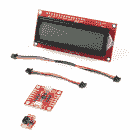](https://www.sparkfun.com/products/16987) 

将**添加到您的[购物车](https://www.sparkfun.com/cart)中！**

### [树莓派 SparkFun Qwiic 垫片套件](https://www.sparkfun.com/products/16987)

[In stock](https://learn.sparkfun.com/static/bubbles/ "in stock") KIT-16987

spark fun Qwiic SHIM Kit for Raspberry Pi 提供了将您的 Raspberry Pi 变成 Qwiic 使能设备所需的一切

$32.50[Favorited Favorite](# "Add to favorites") 10[Wish List](# "Add to wish list")**** 

### [SparkFun 树莓 Pi 4 桌面套装- 4GB](https://www.sparkfun.com/products/16386)

[Out of stock](https://learn.sparkfun.com/static/bubbles/ "out of stock") KIT-16386

SparkFun Raspberry Pi 4 桌面套件(4GB)包括将任何带 HDMI 端口的显示器变成桌面所需的一切

[Favorited Favorite](# "Add to favorites") 10[Wish List](# "Add to wish list")** **### 推荐阅读

如果你不熟悉 MicroMod 生态系统，我们推荐你阅读这里的[来了解](https://www.sparkfun.com/micromod)的概况。如果你决定利用 Qwiic 连接器，我们推荐阅读[这里的概述](https://www.sparkfun.com/qwiic)。

|  |  |
| *[微模式生态系统](https://www.sparkfun.com/micromod)* | *[Qwiic 连接系统](https://www.sparkfun.com/qwiic)* |

如果您不熟悉以下教程中涵盖的概念，我们还建议您浏览这些教程:

 [### 逻辑电平](https://learn.sparkfun.com/tutorials/logic-levels) Learn the difference between 3.3V and 5V devices and logic levels.[Favorited Favorite](# "Add to favorites") 82 [### I2C](https://learn.sparkfun.com/tutorials/i2c) An introduction to I2C, one of the main embedded communications protocols in use today.[Favorited Favorite](# "Add to favorites") 128 [### Raspberry Pi 4 套件连接指南](https://learn.sparkfun.com/tutorials/raspberry-pi-4-kit-hookup-guide) Guide for hooking up your Raspberry Pi 4 Model B basic, desktop, or hardware starter kit together.[Favorited Favorite](# "Add to favorites") 2 [### MicroMod 入门](https://learn.sparkfun.com/tutorials/getting-started-with-micromod) Dive into the world of MicroMod - a compact interface to connect a microcontroller to various peripherals via the M.2 Connector 3

## 硬件概述

该板是一个简单的设计，允许您使用 [Qwiic 连接系统](https://www.sparkfun.com/qwiic)轻松地将设备连接到 I ² C 总线。电源和[逻辑电平](https://learn.sparkfun.com/tutorials/logic-levels/all)设置为 3.3V。如果您的主板使用高于 3.3V 的电压，请确保使用[逻辑电平转换器](https://learn.sparkfun.com/tutorials/i2c/all#i2c-at-the-hardware-level)

| 电线颜色 | 信号 |
| 黑色 | GND |
| 红色 | 3.3V |
| 蓝色 | 国家药品监督管理局 |
| 黄色 | SCL |

### Qwiic 连接器

板上有 4 个 Qwiic 连接器。

[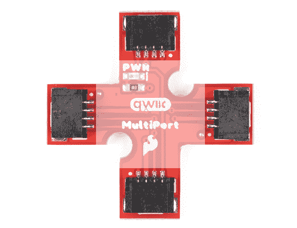](https://cdn.sparkfun.com/assets/learn_tutorials/1/6/5/9/18012-SparkFun_Qwiic_MultiPort-Qwiic_Connectors.jpg)

### LED 和跳线

除了连接器之外，还有一个 LED 来指示 I ² C 总线上的电源何时可用。在背面，有一个跳线，以防您想要[禁用 LED](https://learn.sparkfun.com/tutorials/how-to-work-with-jumper-pads-and-pcb-traces/all) 。

|  | [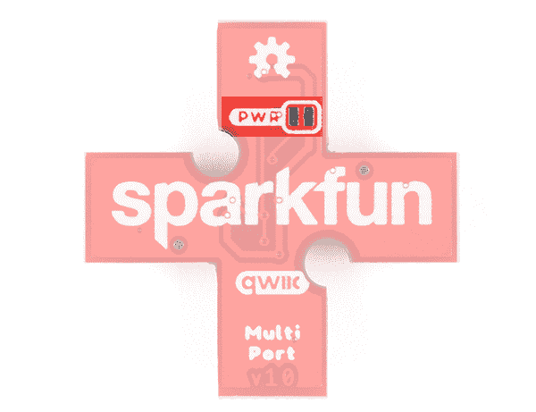](https://cdn.sparkfun.com/assets/learn_tutorials/1/6/5/9/18012-SparkFun_Qwiic_MultiPort-Jumper.jpg) |
| *电路板前部* | *电路板背面* |

### 安装孔

板上有 2 个安装孔。

[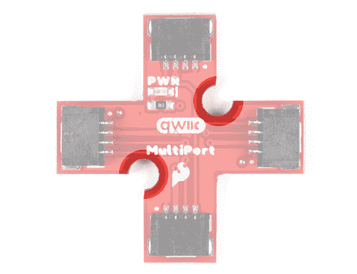](https://cdn.sparkfun.com/assets/learn_tutorials/1/6/5/9/18012-SparkFun_Qwiic_MultiPort-Mounting_Holes.jpg)

### 电路板尺寸

以下是电路板尺寸。电路板的整体尺寸为 1.00 英寸 x 1.00 英寸。从中心延伸的每个连接器具有大约 0.30 英寸的宽度。如前所述，该板中心有 2 个安装孔。

[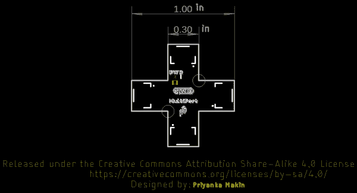](https://cdn.sparkfun.com/assets/learn_tutorials/1/6/5/9/Qwiic_MultiPort_Board_Dimensions.png)

## 硬件装配

### 使用一个 Qwiic 连接器在板上扩展

根据设计，可能只有足够的空间容纳一个 Qwiic 连接器。以下是 SparkFun 目录中的一些[板](https://www.sparkfun.com/categories/399)

 

将**添加到您的[购物车](https://www.sparkfun.com/cart)中！**

### [【spark fun 20 x4 SerLCD-RGB 背光(Qwiic)](https://www.sparkfun.com/products/16398)

[Only 7 left!](https://learn.sparkfun.com/static/bubbles/ "only 7 left!") LCD-16398

SparkFun Qwiic SerLCD 是一款串行启用的 LCD，为添加 20x4 黑色提供了一种简单且经济高效的解决方案…

$26.9512[Favorited Favorite](# "Add to favorites") 16[Wish List](# "Add to wish list")****[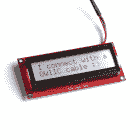](https://www.sparkfun.com/products/16396) 

将**添加到您的[购物车](https://www.sparkfun.com/cart)中！**

### [【spark fun 16 x2 SerLCD-RGB 背光(Qwiic)](https://www.sparkfun.com/products/16396)

[In stock](https://learn.sparkfun.com/static/bubbles/ "in stock") LCD-16396

SparkFun Qwiic SerLCD 是一款串行启用的 LCD，为添加 16x2 黑色提供了一种简单且经济高效的解决方案…

$21.952[Favorited Favorite](# "Add to favorites") 8[Wish List](# "Add to wish list")****[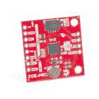](https://www.sparkfun.com/products/15193) 

将**添加到您的[购物车](https://www.sparkfun.com/cart)中！**

### [【spark fun GPS Breakout-ZOE-M8Q(Qwiic)](https://www.sparkfun.com/products/15193)

[In stock](https://learn.sparkfun.com/static/bubbles/ "in stock") GPS-15193

SparkFun ZOE-M8Q GPS Breakout 是一款高精度、小型化的 GPS 板，非常适合不支持

$49.957[Favorited Favorite](# "Add to favorites") 8[Wish List](# "Add to wish list")**** 

将**添加到您的[购物车](https://www.sparkfun.com/cart)中！**

### [kickfunk 16x2 心脏液晶屏- RGB 文本(qwiic)T3](https://www.sparkfun.com/products/16397)

[In stock](https://learn.sparkfun.com/static/bubbles/ "in stock") LCD-16397

SparkFun Qwiic SerLCD 是一款支持串行的 LCD，为在……上添加 16x2 RGB 提供了一个简单且经济高效的解决方案

$21.505[Favorited Favorite](# "Add to favorites") 12[Wish List](# "Add to wish list")**** 

将**添加到您的[购物车](https://www.sparkfun.com/cart)中！**

### [SparkFun Qwiic 土壤水分传感器](https://www.sparkfun.com/products/17731)

[In stock](https://learn.sparkfun.com/static/bubbles/ "in stock") SEN-17731

用于测量土壤和类似材料中水分的简单装置。裸露焊盘共同充当一个阀门…

$9.502[Favorited Favorite](# "Add to favorites") 9[Wish List](# "Add to wish list")****[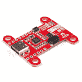](https://www.sparkfun.com/products/15801) 

将**添加到您的[购物车](https://www.sparkfun.com/cart)中！**

### [【spark fun 电源传输板- USB-C (Qwiic)](https://www.sparkfun.com/products/15801)

[Out of stock](https://learn.sparkfun.com/static/bubbles/ "out of stock") DEV-15801

SparkFun 功率传输板提供 5-20V 输入，产生高达 100W 的功率，因此您可以使用相同的功率和

$26.954[Favorited Favorite](# "Add to favorites") 38[Wish List](# "Add to wish list")************ ************如果您想用一个 qw IC 连接器将多个器件连接到您的开发板，您只需要一个 qw IC 多端口板和一根额外的 qw IC 电缆。

[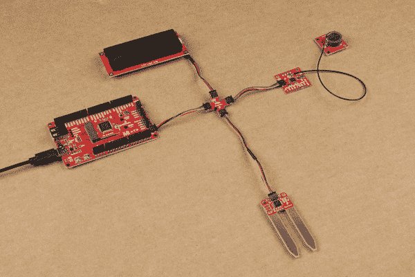](https://cdn.sparkfun.com/assets/learn_tutorials/1/6/5/9/Qwiic_MultiPort_MicroMod_to_I2C_Devices.jpg)

### 菊花链配置的替代方案

Qwiic 多端口也可以用作集线器，因此您不必在菊花链末端放置带有一个 Qwiic 连接器的板。下面是一个用于 Raspberry Pi 的 Qwiic 垫片套件的示例。代替在 Pi 和 Qwiic SerLCD 之间的 Qwiic 9DoF，

[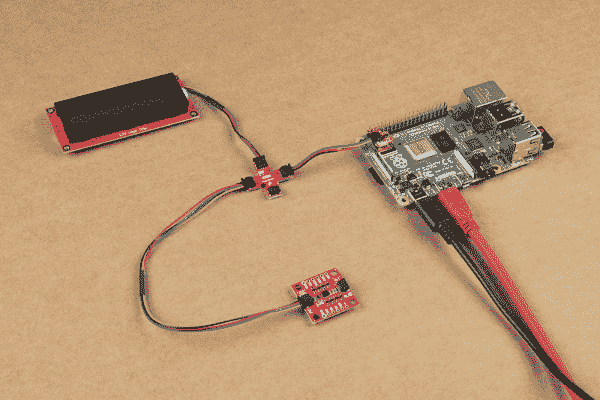](https://cdn.sparkfun.com/assets/learn_tutorials/1/6/5/9/Qwiic_MultiPort_Raspberry_Pi_to_I2C_Devices.jpg)

### 用支座安装

两块板可以用支座安装[以实现安全连接。下面是 Qwiic Micro (SAMD21)、Qwiic 多端口、Qwiic GPS (ZOE-M8Q)和一个 GPS 天线(W3062A)，它们相互堆叠连接。它们都使用 qw IC 电缆连接到 Qwiic SerLCD connect(天线除外)。](https://www.sparkfun.com/categories/257)

[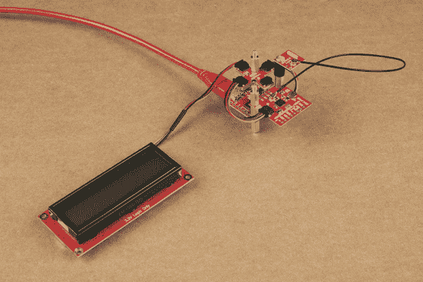](https://cdn.sparkfun.com/assets/learn_tutorials/1/6/5/9/Qwiic_MultiPort_Hookup_Mounting_Standoffs.jpg)

## 资源和更进一步

现在你已经连接了你的 Qwiic 多端口，是时候把它整合到你自己的项目中了！有关更多信息，请查看以下资源:

*   [示意图(PDF)](https://cdn.sparkfun.com/assets/7/d/6/c/3/SparkFun_Qwiic_MultiPort_Schematic.pdf)
*   [老鹰文件(ZIP)](https://cdn.sparkfun.com/assets/2/d/0/0/2/SparkFun_Qwiic_MultiPort.zip)
*   [板尺寸(PNG)](https://cdn.sparkfun.com/assets/learn_tutorials/1/6/5/9/Qwiic_MultiPort_Board_Dimensions.png)
*   [GitHub 回购](https://github.com/sparkfun/Qwiic_MultiPort)

寻找灵感？查看任何标有 Qwiic 的教程，了解如何连接到 Qwiic 系统！

 [### Qwiic 扭转连接指南](https://learn.sparkfun.com/tutorials/qwiic-twist-hookup-guide) Take your volume knob beyond 11 with the Qwiic Twist digital RGB LED encoder via I2C 5 [### SparkFun MicroMod 输入和显示载板连接指南](https://learn.sparkfun.com/tutorials/sparkfun-micromod-input-and-display-carrier-board-hookup-guide) A short Hookup Guide to get started with the SparkFun MicroMod Input and Display Carrier Board[Favorited Favorite](# "Add to favorites") 3 [### MicroMod 资产追踪器载板连接指南](https://learn.sparkfun.com/tutorials/micromod-asset-tracker-carrier-board-hookup-guide) Get started with the SparkFun MicroMod Asset Tracker Carrier Board following this Hookup Guide. The Asset Tracker uses the u-blox SARA-R510M8S LTE-M / NB-IoT module to provide a host of data communication options.[Favorited Favorite](# "Add to favorites") 0 [### 通过 LoRa 发送传感器数据](https://learn.sparkfun.com/tutorials/sending-sensor-data-over-lora) This tutorial will show you how setup a simple peer-to-peer connection to send and receive sensor data using LoRa.[Favorited Favorite](# "Add to favorites") 4************************