# Qwiic PIR 连接指南

> 原文：<https://learn.sparkfun.com/tutorials/qwiic-pir-hookup-guide>

## 介绍

被动红外(PIR)传感器非常适合检测传感器周围特定区域的运动。[spark fun Qwiic PIR-170 ua(ekmc 4607112k)](https://www.sparkfun.com/products/17374)和[spark fun Qwiic PIR-1uA(ekmb 1107112)](https://www.sparkfun.com/products/17375)使用松下的 EKM 系列 PIR 传感器的两个版本，为电池供电和连续供电应用提供 I ² C 以上的薄型运动感应选项。

[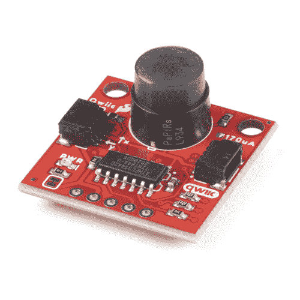](https://www.sparkfun.com/products/17374) 

将**添加到您的[购物车](https://www.sparkfun.com/cart)中！**

### [](https://www.sparkfun.com/products/17374)

[Out of stock](https://learn.sparkfun.com/static/bubbles/ "out of stock") SEN-17374

非常适合在小范围内检测运动，并针对小运动进行了优化，为连续运动提供了运动感应选项

$22.501[Favorited Favorite](# "Add to favorites") 6[Wish List](# "Add to wish list")****[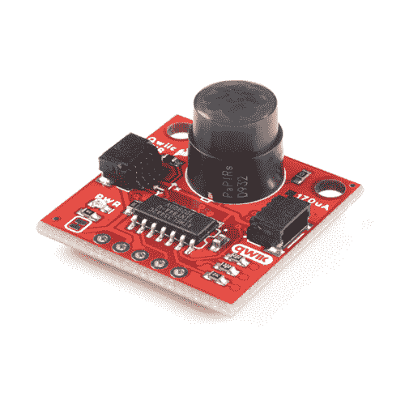](https://www.sparkfun.com/products/17375) 

将**添加到您的[购物车](https://www.sparkfun.com/cart)中！**

### [](https://www.sparkfun.com/products/17375)

[In stock](https://learn.sparkfun.com/static/bubbles/ "in stock") SEN-17375

非常适合检测小区域内的运动，并针对小运动进行了优化，为电池供电提供运动检测选项…

$33.50[Favorited Favorite](# "Add to favorites") 1[Wish List](# "Add to wish list")**** ****[https://www.youtube.com/embed/rYC2duun4UI/?autohide=1&border=0&wmode=opaque&enablejsapi=1](https://www.youtube.com/embed/rYC2duun4UI/?autohide=1&border=0&wmode=opaque&enablejsapi=1)

PIR 传感器不像[距离传感器](https://www.sparkfun.com/distance_sensing)那样返回特定的距离数据。相反，传感器测量来自其检测区域内物体的红外光，使其非常适合控制灯、相机、屏幕等设备的电源等应用。检测到运动时自动启动。

这些 PIR 分线点的 Qwiic 版本具有 ATTiny84，其固件处理对传感器输出信号的监控，将该信号与可配置中断一起去抖，并将其全部转换到 I ² C 接口；使向现有的 Qwiic/I ² C 项目添加 PIR 变得容易。

在本指南中，我们将介绍 Qwiic PIRs 上的硬件，以及如何将它们连接到您的电路，最后我们将介绍为这些传感器编写的 Arduino 库和 Python 包，以及两个代码包中包含的示例。

If you would prefer to monitor the output of the sensors directly, check out our basic breakouts of the [170uA PIR](https://www.sparkfun.com/products/17372) and [1uA PIR](https://www.sparkfun.com/products/17373).

### 所需材料

为了跟随这个教程，你需要一些物品和你的 Qwiic PIR。首先，你需要一个微控制器与电路板通信。以下是一些开箱即用的 Qwiic 选项:

[](https://www.sparkfun.com/products/15663) 

将**添加到您的[购物车](https://www.sparkfun.com/cart)中！**

### [【spark fun Thing Plus-ESP32 WROOM(微-B)](https://www.sparkfun.com/products/15663)

[Out of stock](https://learn.sparkfun.com/static/bubbles/ "out of stock") WRL-15663

SparkFun ESP32 Thing Plus 是开始使用 Espressif 物联网概念的下一步，同时还可以享受所有的便利设施

$22.5010[Favorited Favorite](# "Add to favorites") 48[Wish List](# "Add to wish list")****[](https://www.sparkfun.com/products/15123) 

将**添加到您的[购物车](https://www.sparkfun.com/cart)中！**

### [spark fun RedBoard Qwiic](https://www.sparkfun.com/products/15123)

[In stock](https://learn.sparkfun.com/static/bubbles/ "in stock") DEV-15123

SparkFun RedBoard Qwiic 是一款 Arduino 兼容开发板，内置 Qwiic 连接器，无需…

$21.5014[Favorited Favorite](# "Add to favorites") 49[Wish List](# "Add to wish list")****[](https://www.sparkfun.com/products/15444) 

将**添加到您的[购物车](https://www.sparkfun.com/cart)中！**

### [SparkFun RedBoard Artemis](https://www.sparkfun.com/products/15444)

[In stock](https://learn.sparkfun.com/static/bubbles/ "in stock") DEV-15444

RedBoard Artemis 采用 SparkFun 的功能强大的 Artemis 模块，并将其包装在一个易于使用和熟悉的环境中…

$21.509[Favorited Favorite](# "Add to favorites") 32[Wish List](# "Add to wish list")****[](https://www.sparkfun.com/products/15423) 

将**添加到您的[购物车](https://www.sparkfun.com/cart)中！**

### [spark fun Qwiic Micro-samd 21 开发板](https://www.sparkfun.com/products/15423)

[In stock](https://learn.sparkfun.com/static/bubbles/ "in stock") DEV-15423

SparkFun Qwiic Micro 的成型符合我们的标准 1" x 1" Qwiic 板尺寸，这使它成为我们最小的 SAMD21 微控制器…

$22.505[Favorited Favorite](# "Add to favorites") 18[Wish List](# "Add to wish list")******** ********我们还为 Qwiic PIRs 提供了一个 Python 包，因此您也可以使用诸如 Raspberry Pi 或 Jetson Nano 之类的单板计算机(SBC)作为控制器。

[](https://www.sparkfun.com/products/16308) 

将**添加到您的[购物车](https://www.sparkfun.com/cart)中！**

### [捷信纳米的 SparkFun DLI 套件](https://www.sparkfun.com/products/16308)

[19 available](https://learn.sparkfun.com/static/bubbles/ "19 available") KIT-16308

随着 Jetson Nano 开发套件的发布，NVIDIA 使开发人员、研究人员、学生和业余爱好者能够通过

$229.955[Favorited Favorite](# "Add to favorites") 20[Wish List](# "Add to wish list")****[](https://www.sparkfun.com/products/15446) 

### [【树莓派 4 型号 B (2 GB)](https://www.sparkfun.com/products/15446)

[Out of stock](https://learn.sparkfun.com/static/bubbles/ "out of stock") DEV-15446

2 GB Raspberry Pi 4 具有运行两个 4k 分辨率显示器的能力，以运行真正的千兆位以太网操作，所有…

4[Favorited Favorite](# "Add to favorites") 119[Wish List](# "Add to wish list")[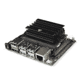](https://www.sparkfun.com/products/16271) 

将**添加到您的[购物车](https://www.sparkfun.com/cart)中！**

### [NVIDIA Jetson Nano 开发者套件(V3)](https://www.sparkfun.com/products/16271)

[Out of stock](https://learn.sparkfun.com/static/bubbles/ "out of stock") DEV-16271

NVIDIA Jetson Nano 开发套件 V3 以小尺寸、低成本提供运行现代人工智能工作负载的性能

$149.0011[Favorited Favorite](# "Add to favorites") 57[Wish List](# "Add to wish list")****[](https://www.sparkfun.com/products/16386) 

### [SparkFun 树莓 Pi 4 桌面套装- 4GB](https://www.sparkfun.com/products/16386)

[Out of stock](https://learn.sparkfun.com/static/bubbles/ "out of stock") KIT-16386

SparkFun Raspberry Pi 4 桌面套件(4GB)包括将任何带 HDMI 端口的显示器变成桌面所需的一切

[Favorited Favorite](# "Add to favorites") 10[Wish List](# "Add to wish list")**** ****如果您的首选微控制器或 SBC 没有 Qwiic 连接器，您可以使用以下产品之一添加一个:

[](https://www.sparkfun.com/products/14352) 

将**添加到您的[购物车](https://www.sparkfun.com/cart)中！**

### [ArduinoT3 的 SparkFun Qwiic 盾](https://www.sparkfun.com/products/14352)

[In stock](https://learn.sparkfun.com/static/bubbles/ "in stock") DEV-14352

SparkFun Qwiic Shield 是一种易于组装的板，它提供了一种简单的方法来将 Qwiic Connect 系统与

$7.508[Favorited Favorite](# "Add to favorites") 39[Wish List](# "Add to wish list")****[](https://www.sparkfun.com/products/15945) 

将**添加到您的[购物车](https://www.sparkfun.com/cart)中！**

### [树莓派的 spark fun Qwiic pHAT v 2.0](https://www.sparkfun.com/products/15945)

[15 available](https://learn.sparkfun.com/static/bubbles/ "15 available") DEV-15945

树莓派的 SparkFun Qwiic pHAT V2 是进入 Qwiic 生态系统和 sti…

$6.952[Favorited Favorite](# "Add to favorites") 32[Wish List](# "Add to wish list")****[](https://www.sparkfun.com/products/16790) 

将**添加到您的[购物车](https://www.sparkfun.com/cart)中！**

### [SparkFun Qwiic 盾为物加](https://www.sparkfun.com/products/16790)

[In stock](https://learn.sparkfun.com/static/bubbles/ "in stock") DEV-16790

SparkFun Qwiic Shield for Thing Plus 使您可以使用 spark fun 的 Qwiic connect 生态系统和开发板来测试

$4.95[Favorited Favorite](# "Add to favorites") 7[Wish List](# "Add to wish list")****[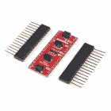](https://www.sparkfun.com/products/16789) 

将**添加到您的[购物车](https://www.sparkfun.com/cart)中！**

### [Arduino Nano的 SparkFun Qwiic 盾](https://www.sparkfun.com/products/16789)

[Only 14 left!](https://learn.sparkfun.com/static/bubbles/ "only 14 left!") DEV-16789

用于 Arduino Nano 的 SparkFun Qwiic Shield 使您可以将 SparkFun 的 Qwiic connect 生态系统与开发板一起使用…

$4.95[Favorited Favorite](# "Add to favorites") 12[Wish List](# "Add to wish list")******** ********最后，您至少需要一根 Qwiic 电缆将 Qwiic PIR 连接到您的微控制器:

[](https://www.sparkfun.com/products/17260) 

将**添加到您的[购物车](https://www.sparkfun.com/cart)中！**

### [柔性 Qwiic 线缆- 50mm](https://www.sparkfun.com/products/17260)

[Out of stock](https://learn.sparkfun.com/static/bubbles/ "out of stock") PRT-17260

这种极化 I2C 电缆绝缘是由硅制成的，比我们原来的 Qwiic 电缆更灵活，特别是在

$1.05[Favorited Favorite](# "Add to favorites") 8[Wish List](# "Add to wish list")****[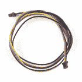](https://www.sparkfun.com/products/17257) 

将**添加到您的[购物车](https://www.sparkfun.com/cart)中！**

### [柔性 Qwiic 线缆- 500mm](https://www.sparkfun.com/products/17257)

[In stock](https://learn.sparkfun.com/static/bubbles/ "in stock") PRT-17257

这种极化 I2C 电缆绝缘是由硅制成的，比我们原来的 Qwiic 电缆更灵活，特别是在

$2.10[Favorited Favorite](# "Add to favorites") 8[Wish List](# "Add to wish list")****[](https://www.sparkfun.com/products/14427) 

将**添加到您的[购物车](https://www.sparkfun.com/cart)中！**

### [Qwiic 线缆- 100mm](https://www.sparkfun.com/products/14427)

[In stock](https://learn.sparkfun.com/static/bubbles/ "in stock") PRT-14427

这是一条 100 毫米长的 4 芯电缆，带有 1 毫米 JST 端接。它旨在将支持 Qwiic 的组件连接在一起…

$1.50[Favorited Favorite](# "Add to favorites") 32[Wish List](# "Add to wish list")****[](https://www.sparkfun.com/products/14428) 

### [Qwiic 线缆- 200mm](https://www.sparkfun.com/products/14428)

[Out of stock](https://learn.sparkfun.com/static/bubbles/ "out of stock") PRT-14428

这是一根 200 毫米长的 4 芯电缆，带有 1 毫米 JST 端接。它旨在将支持 Qwiic 的组件连接在一起…

[Favorited Favorite](# "Add to favorites") 21[Wish List](# "Add to wish list")****** ******### 推荐阅读

如果您不熟悉 Qwiic 系统，我们建议您阅读此处的[以获得概述](https://www.sparkfun.com/qwiic):

| [](https://www.sparkfun.com/qwiic) |

如果您不熟悉以下教程中的概念，我们还建议您看一看这些教程:

[](https://learn.sparkfun.com/tutorials/what-is-an-arduino) [### 什么是 Arduino？](https://learn.sparkfun.com/tutorials/what-is-an-arduino) What is this 'Arduino' thing anyway? This tutorials dives into what an Arduino is and along with Arduino projects and widgets.[Favorited Favorite](# "Add to favorites") 50[](https://learn.sparkfun.com/tutorials/i2c) [### I2C](https://learn.sparkfun.com/tutorials/i2c) An introduction to I2C, one of the main embedded communications protocols in use today.[Favorited Favorite](# "Add to favorites") 128[](https://learn.sparkfun.com/tutorials/terminal-basics) [### 串行终端基础知识](https://learn.sparkfun.com/tutorials/terminal-basics) This tutorial will show you how to communicate with your serial devices using a variety of terminal emulator applications.[Favorited Favorite](# "Add to favorites") 46[](https://learn.sparkfun.com/tutorials/raspberry-pi-4-kit-hookup-guide) [### Raspberry Pi 4 套件连接指南](https://learn.sparkfun.com/tutorials/raspberry-pi-4-kit-hookup-guide) Guide for hooking up your Raspberry Pi 4 Model B basic, desktop, or hardware starter kit together.[Favorited Favorite](# "Add to favorites") 2

## 硬件概述

在本节中，我们将介绍 Qwiic PIR 板上的 PIR 传感器和其他硬件的特性和功能。

### 松下 EKM 系列 PIR 传感器

松下的 EKMC4607112K 和 EKMB1107112 是薄型 PIR 传感器，非常适合运动启动灯、相机或其他电子产品。应用包括节能自动照明、运动启动安全或跟踪摄像头，或者可能是像自制便利店钟声这样有趣的东西。EKMC4607112K 最适合连续供电安装，其检测性能略优于 EKMB1107112，后者最适合电池和低功率安装。

[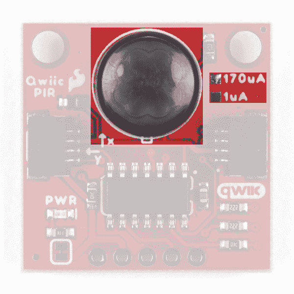](https://cdn.sparkfun.com/assets/learn_tutorials/1/3/9/8/SparkFun_Qwiic_PIR-Sensor.jpg)*The version (1µA or 170µA) is marked by one of two solder pads "East" of the PIR sensor.*
Input voltage (normally **3.3V**) for the Qwiic PIR is provided either via the Qwiic connectors or through the **3.3V** pin on the PTH header. The Output (OUT) pin is connected to a digital pin on the ATTiny84\. Take note that both versions of the Qwiic PIR share the same PCB design and the version (**1µA** or **170µA**) are marked by the solder pads "East" of the PIR sensor.

这两种 PIR 传感器具有非常相似的电气和传感特性，用户在决定哪种传感器最适合自己的需求之前，需要注意一些具体差异。下表概述了电气和检测性能特征，为用户提供了一个基本概述。要更详细地了解这两种传感器，请查看它们各自的规格表([ekmc 4607112k](https://cdn.sparkfun.com/assets/learn_tutorials/1/4/0/0/EKMC460711xK_Spec.pdf)&[ekmb 1107112](https://cdn.sparkfun.com/assets/learn_tutorials/1/4/0/0/EKMB110711x_Spec.pdf))以及[松下 PIR 传感器-产品简介](https://cdn.sparkfun.com/assets/3/f/8/8/1/4541_fileversion.pdf) (EKM 系列传感器包含在第 8 页)。

| 电特性 |
|  |  | ekmc4607112k | EKMB1107112 |
| 特性 | 单位 | 福建话 | 典型。 | 最大 | 福建话 | 典型。 | 最大 |
| 工作电压 | 直流电压 | Three | - | Six | Two point three | - | Four |
| 电流消耗
(仅传感器) | A | - | One hundred and seventy | Three hundred | - | 1^([【1】](#QwiicPIR1)) | three |
| 输出电流 | A | - | - | One hundred | - | - | One hundred |
| 输出电压 | 直流电压 | VDD-0.5 | - | - | VDD-0.5 | - | - |
| 电路稳定时间
(施加电压时) | 秒 | - | - | Thirty | - | Twenty-five | Two hundred and ten |

如上所述，PIR 传感器的感测性能非常相似，只有一些显著的差异。另请注意，PIR 传感器的性能会因其所监控的环境而异。

| 检测性能特征 |
|  | ekmc4607112k | EKMB1107112 | 笔记 |
|  | 温差 | 价值 | 温差 | 价值 | 目标条件 |
| 探测距离 | 8 摄氏度(14.4 华氏度) | 高达 7m | 4 摄氏度(7.2 华氏度) | 高达 7m | 1.移动速度:1 米/秒
2。目标概念是人体(物体尺寸:约 700×250 毫米) |
| 4 摄氏度(7.2 华氏度) | 高达 5m | 2 摄氏度(3.6 华氏度) | 高达 5m |

[[1] Note:](https://learn.sparkfun.com/tutorials/qwiic-pir-breakout-hookup-guide#QwiicPIR1) Current consumption for the EKMB1107112 varies depending on the operating mode. Refer to section 4-4 of the [EKMB Spec Sheet](https://cdn.sparkfun.com/assets/learn_tutorials/1/4/0/0/EKMB110711x_Spec.pdf) for specific values.

### 阿蒂尼 84 IC

该板上的 ATTiny84 预编程有固件，可通过 Qwiic/I ² C 充当 PIR 传感器和微控制器之间的中介。固件负责监控原始传感器输出，以检测进入或离开感测区域的物体，自动对输出进行去抖，每当检测到运动时触发中断，甚至存储一个感测事件队列，您可以从中提取和清除。

[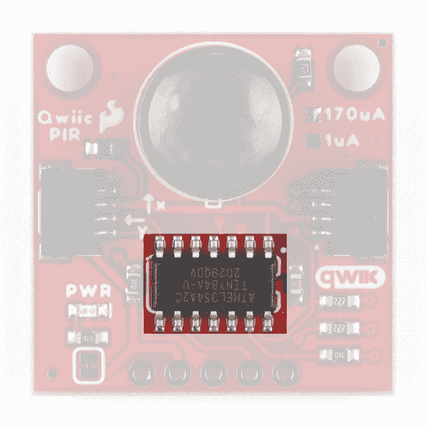](https://cdn.sparkfun.com/assets/learn_tutorials/1/3/9/8/SparkFun_Qwiic_PIR-ATTiny.jpg)

Qwiic PIR 的默认 I ² C 地址是 **0x12** ，但是可以通过调整 ADR 跳线切换到 **0x13** 。或者，用户可以使用库中的函数将地址更改为自定义值，或者直接写入地址寄存器。I ² C 地址的软件设置在 Arduino 和 Python 库部分有更详细的介绍。

最后，电路板背面的 2x3 接头允许对 ATTiny84 进行编程。这主要用于制造过程中的编程，但也可用于使用定制固件对 IC 进行重新编程。您可以从[硬件 GitHub 库](https://github.com/sparkfun/Qwiic_PIR)下载并修改固件。

Need help re-programming your Qwiic PIR? Take a look through these tutorials for instructions and tips:

*   [微型 AVR 编程器连接指南](https://learn.sparkfun.com/tutorials/tiny-avr-programmer-hookup-guide)
*   [对 LilyTiny/LilyTwinkle 重新编程](https://learn.sparkfun.com/tutorials/re-programming-the-lilytiny--lilytwinkle) 

### Qwiic/I ² C 接口和中断引脚

使用 Qwiic PIR 最简单的方法是使用 Qwiic connect 系统。用一根 [Qwiic 电缆](https://www.sparkfun.com/products/14427)将其连接到您的微控制器或 SBC，通过 I ² C 开始与之通信。对于喜欢焊接连接的用户，Qwiic PIR 的 I ² C 引脚连接到一个标准的 0.1 英寸间距 PTH 接头。

| [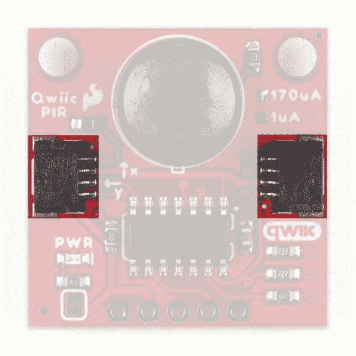](https://cdn.sparkfun.com/assets/learn_tutorials/1/3/9/8/SparkFun_Qwiic_PIR-Qwiic.jpg) | [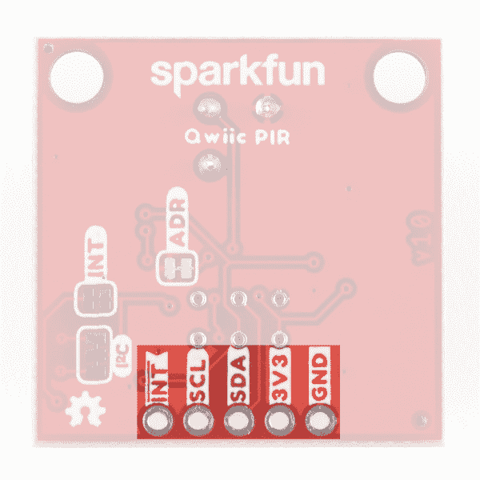](https://cdn.sparkfun.com/assets/learn_tutorials/1/3/9/8/SparkFun_Qwiic_PIR-I2C_PTH_Header.jpg) |

*Having trouble viewing the detail in these photos? Click on them for a larger view.*

我们还包括一个专用的中断引脚，用户可以连接到微控制器上的中断引脚，根据 Qwiic PIR 检测到的活动触发中断事件。有关如何配置和使用此引脚的更多信息，请继续阅读 Arduino 和 Python 部分。

### 焊料跳线

If you have never worked with solder jumpers and PCB traces before or would like a quick refresher, check out our [How to Work with Solder Jumpers and PCB Traces](https://learn.sparkfun.com/tutorials/how-to-work-with-jumper-pads-and-pcb-traces) tutorial for detailed instructions and tips.

Qwiic PIR 板上有四个焊接跳线，标记为 **PWR** 、 **I2C** 、 **INT** 和 **ADR** 。让我们简要介绍一下每个跳线的功能和默认状态。

| [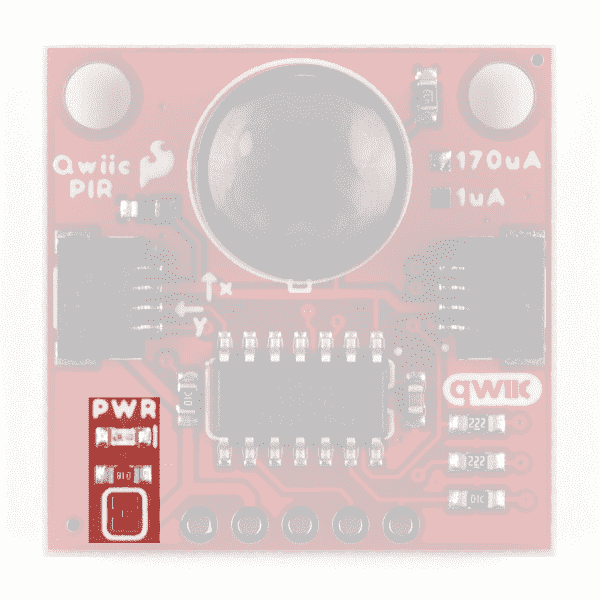](https://cdn.sparkfun.com/assets/learn_tutorials/1/3/9/8/SparkFun_Qwiic_PIR-Power_LED.jpg) | [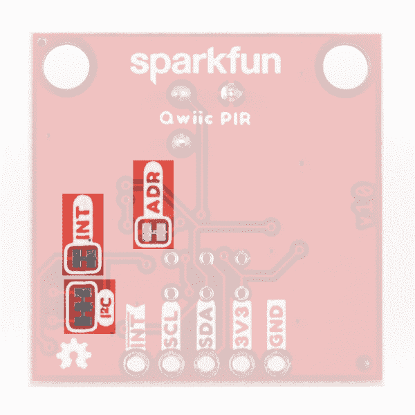](https://cdn.sparkfun.com/assets/learn_tutorials/1/3/9/8/SparkFun_Qwiic_PIR-Jumpers.jpg) |

#### 电源跳线

电源(PWR)跳线控制板上的电源 LED，默认情况下**关闭**。它通过一个 **1K &欧姆将电源 LED 的阳极连接到**3.3V**；**电阻器。断开跳线，切断两个焊盘之间的走线，禁用 LED。关闭电源指示灯有助于降低 Qwiic PIR 的总电流消耗。

#### I ² C 跳线

I ² C 跳线通过一对 **2.2k &欧姆将 ATTiny84 的 SDA 和 SCL 线拉到**3.3V**；**电阻器。默认状态是**关闭**。断开连接三个焊盘的走线以禁用上拉电阻，从而断开跳线。

If you have more than one device on a single I²C bus, it is recommended to only maintain a single pair of pullup resistors to avoid creating too strong of a parallel resistance. A strong parallel resistance can lead to communication issues on the bus. If you have multiple devices using a single set of pull-up resistors on your I²C bus make sure all devices operate at the same [logic level](https://learn.sparkfun.com/tutorials/logic-levels) or are properly shifted to avoid damage to the device(s).

#### 中断跳线

中断(INT)跳线通过 **10k &欧姆将 ATTiny84 的中断引脚拉至**3.3V**；**电阻器。中断跳线的默认状态是**关闭**。ATTiny84 上的中断引脚配置为低电平有效中断，必须拉至逻辑高电平( **3.3V** )才能正常工作。打开跳线，禁用中断引脚。

#### 地址跳线

地址(ADR)跳线设置 ATTiny84 的 I ² C 地址。跳线默认为**关闭**。通过切断两个焊盘之间的走线打开跳线，将 I ² C 地址从默认值( **0x12** )更改为 **0x13** 。

### 电路板尺寸

Qwiic PIR 与大多数 Qwiic 分线点的标准 1 英寸 x 1 英寸(24.5 毫米 x 24.5mm 毫米)外形相匹配，并有两个安装孔，可安装一个 [4-40 螺钉](https://www.sparkfun.com/products/10453)。

[](https://cdn.sparkfun.com/assets/learn_tutorials/1/3/9/8/Qwiic_PIR-Dimensions.png)

## 硬件装配

使用 Qwiic 系统，组装 SparkFun Qwiic PIR 非常简单。我们将在这里介绍硬件组装的基础知识，以及一些使用中断引脚的技巧。

### 连接 Qwiic 电缆

假设您使用的是支持 Qwiic 的开发板，如下面所示的 [RedBoard Qwiic](https://www.sparkfun.com/products/15123) ，或者您的开发板或 Raspberry Pi/SBC 上连接了 Qwiic 屏蔽或 Qwiic 适配器，您只需将 Qwiic PIR 连接到电路，将 Qwiic 电缆的一端插入 Qwiic PIR，另一端插入开发板/屏蔽上的 Qwiic 连接器。

[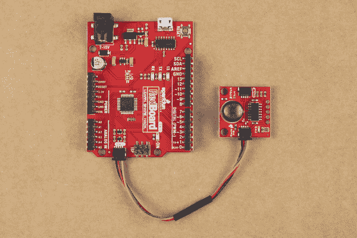](https://cdn.sparkfun.com/assets/learn_tutorials/1/3/9/8/Qwiic_PIR-RedBoard_Connection.jpg)

或者，您可以使用我们的适配器电缆([公](https://www.sparkfun.com/products/14425)和[母](https://www.sparkfun.com/products/14988))将 Qwiic 系统转换为标准跳线组件。如果您使用其中一种适配器电缆，请确保信号匹配正确:

*   **黑色= GND**
*   **红色=3.3V**
*   **蓝色=SDA**
*   **黄色=SCL**

如果您不想使用 Qwiic 连接器，您可以[将](https://learn.sparkfun.com/tutorials/how-to-solder-through-hole-soldering)电线或接头引脚焊接到 PTH 接头上进行连接。

### 连接一切

如果您不打算使用 Qwiic PIR 上的中断引脚，请通过 USB 将开发板连接到您的计算机，或者如果您使用的是 Raspberry Pi 或其他 SBC，请接通电源。

如果要使用中断引脚，还需要一点组装。为了使用中断引脚，我们需要将其焊接，或者，为了快速制作原型，您可以使用 IC 挂钩将其连接到您的开发板/SBC，如[这些](https://www.sparkfun.com/products/9741)端接在标准公跳线连接中。

连接到 Qwiic PIR 的中断引脚后，将该线连接到可用于外部中断的数字引脚。如果您不确定哪些引脚支持中断，请参考您的主板文档以了解详情。由于我们使用的是 RedBoard Qwiic，我们可以将 D2 或 D3 设置为中断引脚。在下面的电路和 Arduino 库中的中断示例中，中断引脚连接到 D2:

[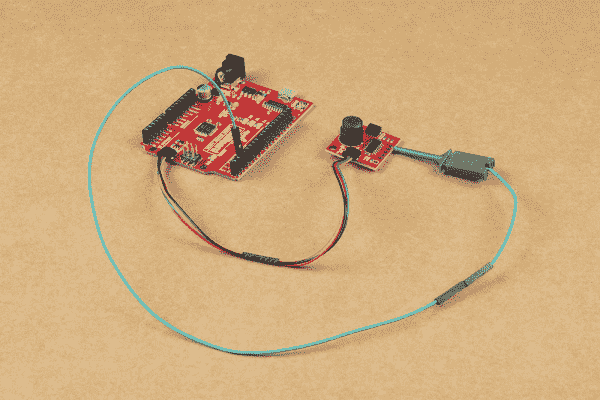](https://cdn.sparkfun.com/assets/learn_tutorials/1/3/9/8/Qwiic_PIR-Interrupt_Assembly.jpg)

现在 Qwiic PIR 电路已经完全组装好，通过 USB 将 RedBoard 连接到您的 PC(或者如果使用 Raspberry Pi 或其他 SBC，请打开电源),我们就可以继续上传代码和监控运动了。

## Qwiic PIR Arduino 图书馆

**Note:** This example assumes you are using the latest version of the Arduino IDE on your desktop. If this is your first time using Arduino, please review our tutorial on [installing the Arduino IDE.](https://learn.sparkfun.com/tutorials/installing-arduino-ide) If you have not previously installed an Arduino library, please read our [Installing an Arduino Library](https://learn.sparkfun.com/tutorials/installing-an-arduino-library) tutorial.

我们已经编写了一个 Arduino 库，以便于入门和与 Qwiic PIR 交互。在我们进入从传感器读取数据的示例之前，我们需要安装这个库，我们将仔细看看库中可用的函数。Arduino 库管理器是安装库的最简单的方法。打开库管理器，搜索**“spark fun Qwiic PIR Arduino 库”**点击“安装”按钮下载最新版本。如果你喜欢从 [GitHub 库](https://github.com/sparkfun/SparkFun_Qwiic_PIR_Arduino_Library)手动安装这个库，你可以在这里下载:

[Download the SparkFun Qwiic PIR Arduino Library](https://github.com/sparkfun/SparkFun_Qwiic_PIR_Arduino_Library/archive/master.zip)

### 库函数

下面的列表列出了 SparkFun Qwiic PIR Arduino 库中所有可用的函数，以及它们的功能描述。这些示例几乎涵盖了列表中的所有函数，因此可以参考它们来开始使用或者演示如何将它们集成到您自己的代码中。

#### 班级

在全局作用域中，构造不带参数的传感器对象(如`mySensor`或`myPIR`)。

*   `QwiicPIR mySensor;`

#### 设备设置和设置

*   `bool begin(uint8_t address = DEFAULT_ADDRESS, TwoWire &wirePort = Wire);` -初始化 I ² C 总线上的 Qwiic PIR。如果地址已经更改，用户可以指定一个替代地址，并选择哪个 I ² C 端口用于与 PIR 通信。
*   `bool isConnected();` -如果 PIR 将通过 I ² C 确认，则返回 true，否则返回 false。
*   `uint8_t deviceID();` -返回 8 位设备 ID。
*   `bool checkDeviceID();` -如果设备 ID 与 Qwiic PIR ID 匹配，则返回 true。
*   `uint8_t getDeviceType();` -如果 Qwiic PIR 连接到总线，则返回`1`，如果没有连接设备，则返回`0`。
*   `uint16_t getFirmwareVersion();` -以 16 位整数形式返回 Qwiic PIR 固件版本。主要修订号=最左边(高)字节。次要修订号=最右边(低位)字节。
*   `bool setI2Caddress(uint8_t address);` -配置连接的 Qwiic PIR，以使用指定地址初始化总线。
*   `uint8_t getI2Caddress();` -返回附属 Qwiic PIR 的 I ² C 地址。

#### PIR 状态和去抖配置

这些功能是读取感应区域是否检测到物体的主要方式，以及如何从 PIR 定制去反跳时间以减少噪声和错误检测，以及如何操纵检测队列。

*   `bool rawPIRReading();` -当 PIR 输出信号时返回`1`，不输出信号时返回`0`。这是没有去抖的 PIR 的原始输出。
*   `bool objectDetected();` -如果在感应区域发生去抖物体检测事件，则返回`1`。`objectDetected();`等待的去抖时间由`setDebounceTime(uint16_t time);`设定。
*   `bool ojbectRemoved()`；-如果在感应区域发生去抖物体移动事件，则返回`1`。`objectRemoved();`等待的去抖时间由`setDebounceTime(uint16_t time);`设定。
*   `uint16_t getDebounceTime();` -返回为 PIR 读数设定的去抖时间(以毫秒为单位)。
*   `uint8_t setDebounceTime(uint16_t time);`设置 Qwiic PIR 等待传感器原始读数稳定的时间。去抖时间的默认值是 750 毫秒。

#### 中断状态和配置

*   `uint8_t enableInterrupt();` -调用时，中断引脚配置为触发所有 PIR 事件(检测&移除)。
*   `uint8_t disableInterrupt();` -调用时，中断引脚不再配置为触发 PIR 事件。
*   `bool available();` -返回`eventAvailable`位。
*   `uint8_t clearEventBits();` -将`objectDetected`、`objectRemoved`和`eventAvailable`位设置为零。
*   `uint8_t resetInterruptConfig();` -将任何已配置的中断功能重置为默认值(关闭)。

#### 队列操作

*   `bool isDetectedQueueFull();` -如果对象检测时间戳队列*已满*，则返回真，否则返回假。这个队列存储十个时间戳值。
*   `bool isDetectedQueueEmpty();` -如果对象检测时间戳队列为*空*，则返回真，否则返回假。
*   `unsigned long timeSinceLastDetect();` -返回自`objectDetected();`函数上次返回`1`以来的时间(以毫秒为单位)。
*   `unsigned long timeSinceFirstDetect();` -返回存储在检测到的队列中的最旧值的时间(以毫秒为单位)。
*   `unsigned long popDetectedQueue();` -返回存储在检测到的队列中最早的值，并将其删除。
*   `bool isRemovedQueueFull();` -如果对象移除队列*已满*，则返回真，否则返回假。这个队列存储十个时间戳值。
*   `bool isRemovedQueueEmpty();` -如果对象移除队列*为空*，则返回真，否则返回假。
*   `unsigned long timeSinceLastRemove();` -返回自`objectRemoved();`函数上次返回`1`以来的时间(以毫秒为单位)。
*   `unsigned long timeSinceFirstRemove();` -返回存储在已删除队列中的最旧值的时间(以毫秒为单位)。
*   `unsigned long popRemovedQueue();` -返回存储在已删除队列中最早的值并将其删除。

## Arduino 示例

SparkFun Qwiic PIR Arduino 库包括五个示例，帮助用户开始使用电路板和库。在这一节中，我们将回顾几个例子，并强调它们是如何工作的。

### 示例 1 -打印原始 PIR 状态

第一个例子演示了如何在 I ² C 总线上设置 Qwiic PIR，然后使用`rawPIRReading();`函数从 Qwiic PIR 中检索原始数据读数。导航到**文件>示例> SparkFun Qwiic PIR Arduino 库>example 1 _ PrintRawPIRStatus**打开第一个示例。接下来，打开工具菜单，选择您的主板(在我们的例子中，Arduino Uno)和正确的端口。上传代码并打开您的[串行监视器](https://learn.sparkfun.com/tutorials/terminal-basics)，波特率设置为 **115200** 。

该示例首先设置 Qwiic PIR 对象和去抖时间(单位为毫秒):

```
language:c
QwiicPIR pir;

#define DEBOUNCE_TIME 750 
```

接下来，它初始化传感器，然后等待 30 秒，让 PIR 预热并稳定下来。

```
language:c
if (pir.begin() == false) {
    Serial.println("Device did not acknowledge! Freezing.");
    while (1);
  }

  Serial.println("PIR acknowledged. Waiting 30 Seconds while PIR warms up");
  for (uint8_t seconds = 0; seconds < 30; seconds++)
  {
    Serial.println(seconds);
    delay(1000);
  } 
```

如果 Qwiic PIR 在默认地址的 I ² C 总线上没有应答，代码将冻结。不良连接或不同的 I ² C 地址是这种故障最常见的原因。

一旦 PIR 预热，主循环检查`rawPIRReading();`是否返回`TRUE`或`FALSE`，并等待再次更新为`DEBOUNCE_TIME`设置的值。该代码打印出通过串行检测或移除的对象。使用`rawPIRReading();`时请注意，信号的去抖动必须手动完成。

### 示例 2 -打印 PIR 状态

第二个例子与第一个非常相似，但是使用了`objectDetected();`和`objectRemoved();`函数，而不是`rawPIRReading();`。这些功能的主要区别在于 PIR 信号的去抖动发生在哪里。`objectDetected();`和`objectRemoved();`功能参考为`setDebounceTime(uint16_t time);`存储的值，并在该时间自动对信号进行去抖，而不是每次出现 PIR 信号时手动去抖。`setDebounceTime();`的默认值是 750 毫秒。

打开示例，上传并打开一个设置为 **115200** 波特的串行终端。初始化传感器并等待 30 秒让 PIR 预热后，代码将开始轮询 PIR 事件，并通过串行打印事件:

```
language:c
if (pir.available()) {
    if (pir.objectDetected()) {
        Serial.println("Object Detected");
    }    
    if (pir.objectRemoved()) {
        Serial.println("Object Removed");
    }
    pir.clearEventBits();
} 
```

### 示例 3 -队列使用

库中包含的第三个示例展示了如何读取和操作对象检测和对象删除队列。上传示例后，打开串行终端，再次将波特率设置为 **115200** 。在初始化 Qwiic PIR 后，主循环检查检测到的或移除的队列是否存储了自第一次检测/移除以来的时间(以秒为单位)或自上次检测/移除以来的时间的值，并通过串行打印它们。如果两个队列中都没有值，代码会打印出哪个队列是空的:

```
language:c
if(pir.isDetectedQueueEmpty() == false) {
    Serial.print(pir.timeSinceLastDetect()/1000.0);
    Serial.print("s since PIR detect   ");
    Serial.print(pir.timeSinceFirstDetect()/1000.0);
    Serial.print("s since PIR detect   ");
}

if(pir.isDetectedQueueEmpty() == true) {
    Serial.print("PIR Detected Queue is empty! ");
} 

if(pir.isRemovedQueueEmpty() == false) { 
    Serial.print(pir.timeSinceLastRemove()/1000.0);
    Serial.print("s since PIR remove   ");
    Serial.print(pir.timeSinceFirstRemove()/1000.0);
    Serial.print("s since PIR remove   ");
}
if(pir.isRemovedQueueEmpty() == true) {
    Serial.print("  PIR Removed Queue is empty!");
} 
```

除了打印每个队列中的值，该示例还显示了如何操作和弹出任何队列中的值:

```
language:c
if(Serial.available()) {

    uint8_t data = Serial.read();
    if(data == 'd' || data == 'D') { 
        pir.popDetectedQueue();
        Serial.println("Popped DetectedQueue!");
    }

    if(data == 'r' || data == 'R') { 
        pir.popRemovedQueue();
        Serial.println("Popped RemovedQueue!");
    }
}
delay(20); 
```

在串行终端打开的情况下，发送字母“D”(大写或非大写)从检测到的队列中弹出一个值。类似地，发送字母“R”从删除的队列中弹出一个值。

### 示例 4 -外部中断

示例 4 - ExtInterrupt 演示了如何使用 Qwiic PIR 上的中断引脚。

除了在全局类中设置 Qwiic PIR，代码还定义了中断引脚并创建了一个中断标志:

```
language:c
int interruptPin = 2;

bool interruptEntered = false; 
```

根据需要调整中断引脚的值。本例假设使用 SparkFun RedBoard/Arduino Uno，并将 D2 设置为中断引脚。在设置中，代码将中断引脚初始化为输入，并将其作为下降沿中断附加到名为`pirHandler`的自定义函数:

```
language:c
pinMode(interruptPin, INPUT);
attachInterrupt(digitalPinToInterrupt(interruptPin), pirHandler, FALLING); 
```

在总线上初始化 Qwiic PIR 并等待 30 秒让 PIR 预热后，代码调用`enableInterrupt();`和`clearEventBits();`函数告诉 Qwiic PIR 在对象事件上触发引脚，并清除任何事件位以切换中断引脚`HIGH`:

```
pir.enableInterrupt();
pir.clearEventBits(); 
```

主循环检查运动事件，如果检测到任何运动事件，它将触发中断引脚:

```
language:c
void loop() {
  if (interruptEntered)
  {
    if (pir.objectDetected()) {
      Serial.println("Object Detected");
    }
    pir.clearEventBits();
    interruptEntered = false;
    delay(10);
  }
}

void pirHandler()
{
  interruptEntered = true;
} 
```

从这里开始，您可以修改这个例子，或者将它插入到更复杂的代码中，使用 Qwiic PIR 触发您想要的任何中断事件。

## Qwiic PIR Python 包

**注意:**本教程假设您使用的是最新版本的 Python 3。如果这是你第一次在 Raspberry Pi 上使用 Python 或 I ² C 硬件，这些教程将帮助你入门:

*   [用树莓 Pi 进行 Python 编程](https://learn.sparkfun.com/tutorials/python-programming-tutorial-getting-started-with-the-raspberry-pi)
*   [树莓派 SPI 和 I2C 教程](https://learn.sparkfun.com/tutorials/raspberry-pi-spi-and-i2c-tutorial)

我们为 Qwiic PIR 编写了一个 Python 包，供喜欢在传感器上使用类似树莓 Pi 的用户使用。这个包可以和 SparkFun Qwiic Python 包一起安装，也可以单独安装。

我们建议安装整个 SparkFun Qwiic 包，因为它也安装了所需的 I ² C 驱动程序。

**Note:** Don't forget to double check that the hardware I²C connection is enabled on your Raspberry Pi or other single board computer. Make sure to reboot your Pi after enabling the I²C bus for changes to take effect.

### SparkFun Qwiic 包

这个存储库作为`sparkfun-qwiic`包托管在 PyPi 上。在支持 PyPi 的系统上，通过`pip3`安装(对于 Python 2 使用`pip`)很简单，使用以下命令:

对于**所有用户**(注意:用户必须拥有  权限):

```
language:bash
sudo pip3 install sparkfun-qwiic 
```

对于**当前用户**:

```
language:bash
pip3 install sparkfun-qwiic 
```

### 独立 Qwiic PIR Py 包安装

如果你喜欢只安装 Qwiic PIR 包，你可以按照下面的说明通过`pip3`下载 PyPi 托管的`sparkfun-qwiic-pir` Python 包。或者，如果你喜欢手动下载并构建库，你可以从 [Qwiic PIR Py GitHub 库](https://github.com/sparkfun/Qwiic_PIR_Py)中获取或者点击下面的按钮:

[Download the Qwiic PIR Py Repository](https://github.com/sparkfun/Qwiic_PIR_Py/archive/main.zip)

#### PyPi 安装

这个存储库作为`sparkfun-qwiic-PIR`包托管在 PyPi 上。在支持 PyPi 的系统上，使用以下命令通过`pip3`安装`sparkfun-qwiic-PIR`包(对于 Python 2 使用`pip`):

对于**所有用户**(注意:用户必须拥有 [**须户**](https://en.wikipedia.org/wiki/Sudo) 权限):

```
language:bash
sudo pip3 install sparkfun-qwiic-PIR 
```

对于**当前用户**:

```
language:bash
pip3 install sparkfun-qwiic-PIR 
```

#### 本地安装

要安装，请确保系统上安装了`setuptools`包。

命令行直接安装(Python 2 使用`python`):

```
language:bash
python3 setup.py install 
```

要构建与`pip3`一起使用的包:

```
language:bash
python3 setup.py sdist 
```

构建一个包文件并放在名为 dist 的子目录中。这个包文件可以用`pip3`来安装。

```
language:bash
cd dist
pip3 install sparkfun_qwiic_PIR-<version>.tar.gz 
```

### Qwiic PIR Python 包操作

让我们快速看一下 Python 包中可用的函数。关于这个包如何工作的更多细节，请看一下 [ReadTheDocs](https://qwiic-pir-py.readthedocs.io/en/latest/?) 上的[源代码](https://github.com/sparkfun/Qwiic_PIR_Py/blob/main/qwiic_pir.py)和包文档。

#### 属国

这个 Python 包在代码中有一些依赖项，如下所示:

```
language:python
import time
import sys 
```

#### 默认变量

```
language:python
# Define the device name and I2C addresses. These are set in the class definition
# as class variables, making them available without having to create a class instance.
# This allows higher level logic to rapidly create an index of qwiic devices at runtime.

# This is the name of the device
_DEFAULT_NAME = "Qwiic PIR"

# Some devices have  multiple available addresses - this is a list of these addresses.
# NOTE: The first address in this list is considered the default I2C address for the 
# device.
_AVAILABLE_I2C_ADDRESS = [0x12] 
```

**Note:** This package differs from other SparkFun packages as the register values are declared in the object class.

```
language:python
# Constructor
device_name = _DEFAULT_NAME
available_addresses = _AVAILABLE_I2C_ADDRESS

# Device ID for all Qwiic PIRs
DEV_ID = 0x72

# Registers
ID = 0x00
FIRMWARE_MINOR = 0x01
FIRMWARE_MAJOR = 0x02
EVENT_STATUS = 0x03
INTERRUPT_CONFIG = 0x04
EVENT_DEBOUNCE_TIME = 0x05
DETECTED_QUEUE_STATUS = 0x07
DETECTED_QUEUE_FRONT = 0x08
DETECTED_QUEUE_BACK = 0x0C
REMOVED_QUEUE_STATUS = 0x10
REMOVED_QUEUE_FRONT = 0x11
REMOVED_QUEUE_BACK = 0x15
I2C_ADDRESS = 0x19

# Status Flags
eventAvailable = 0
objectRemove = 0
objectDetect = 0
rawObjectDetected = 0

# Interrupt Configuration Flags
interruptEnable = 0

# Queue Status Flags
popRequest = 0
isEmpty = 0
isFull = 0 
```

#### 班级

**`QwiicPIR()`** 或 **`QwiicPIR(address)`**

这个 Python 包作为一个类对象运行，允许创建该类型的新实例。使用一个`__init__()`构造器，该构造器使用默认或指定的 I ² C 地址通过 I ² C 总线创建到 I ² C 设备的连接。

**Note:** If the Qwiic PIR's address has been altered from the default (**0x12**), create the Qwiic PIR object with the new address. For example, if the address jumper is opened create the Qwiic PIR object using this format: `QwiicPIR(0x13)`.

##### 构造函数

构造函数是一种特殊的方法，用于在创建对象时初始化(赋值)对象所需的数据成员。

**T2`__init__(address=None, i2c_driver=None):`**

Input: valueThe value of the device address. If not defined, the Python package will use the default I²C address (**0x12**) stored under `_AVAILABLE_I2C_ADDRESS` variable.Input: *i2c_driver*Loads the specified I²C driver; by default the [Qwiic I²C driver](https://github.com/sparkfun/Qwiic_I2C_Py) is used: `qwiic_i2c.getI2CDriver()`. Users should use the default I²C driver and leave this field blank.

#### 功能

函数是类的一个属性，它为类的实例定义了一个方法。简单地说，它们是类的操作(或方法)的对象。要获得所有可用函数的完整列表，请前往 [Qwiic PIR Py Python 包](https://github.com/sparkfun/Qwiic_PIR_Py)的 ReadtheDocs 的 [API 参考页面](https://qwiic-pir-py.readthedocs.io/en/latest/apiref.html)。

### 升级软件包

必须为每个软件包单独更新已安装的软件包(即子模块和依赖项不会自动更新，必须手动更新)。对于`sparkfun-qwiic-pir` Python 包，使用下面的命令(对于 Python 2 使用`pip`):

对于**所有用户**(注意:用户必须拥有 [**须户**](https://en.wikipedia.org/wiki/Sudo) 权限):

```
language:bash
sudo pip3 install --upgrade sparkfun-qwiic-pir 
```

对于**当前用户**:

```
language:bash
pip3 install --upgrade sparkfun-qwiic-pir 
```

## Python 示例

SparkFun Qwiic PIR Python 库包括四个示例，帮助用户开始使用该板和库。在这一部分，我们将回顾这些例子，并强调它们是如何工作的。

要使用这些示例，请从 Python 库的位置打开它们，或者将代码复制到您喜欢的 Python 解释器中。

### 示例 1 -简单示例(原始 PIR 读数)

第一个例子显示了如何在 I ² C 总线上设置 Qwiic PIR，并从 PIR 的输出信号中检索原始数据。因为我们读取的是原始 PIR 输出，所以代码手动设置了一个去抖时间(以毫秒为单位),以等待 PIR 输出信号稳定。通过更改该值来调整去抖时间:

```
language:python
debounce_time = .20 
```

主示例循环设置 PIR 对象，尝试在 I ² C 总线上初始化它，如果成功，等待 30 秒让 PIR 稳定:

```
language:python
def run_example():

        print("\nSparkFun Qwiic PIR Example1\n")
        my_PIR = qwiic_pir.QwiicPIR()

        if my_PIR.begin() == False:
                print("The Qwiic PIR isn't connected to the system. Please check your connection", \ file=sys.stderr)

                return
        print ("Waiting 30 seconds for PIR to stabilize")
        for i in range(0,30):
                print(i)
                time.sleep(1)

        print("Device Stable") 
```

PIR 初始化并稳定后，代码开始读取数据，并打印出是否检测到或移除了物体，每次读取后暂停`debounce_time`的设定值:

```
language:python
while True:
        if my_PIR.raw_reading() is True:
                print("Object Detected")
        else:
                print("Object Removed")
        time.sleep(debounce_time) 
```

### 示例 2 -去抖读数

第二个例子演示了如何使用`object_detected()`和`object_removed()`功能从 Qwiic PIR 读取去抖输出信号。就像 Arduino 库一样，Qwiic PIR Python 库包括用于原始 PIR 读数和自动去抖读数的函数。

使用`object_detected()/removed()`功能，您可以通过`set_debounce_time()`功能设置去抖时间，PIR 将一直等待该时间，然后再进行下一次读取。`set_debounce_time()`的默认值是 750 毫秒。

该代码初始化总线上的 Qwiic PIR，并在读取物体检测读数之前等待 30 秒，以使 PIR 稳定:

```
language:python
while True:
        if my_PIR.available() is True:
                if my_PIR.object_detected():
                        print("Object Detected")
                if my_PIR.object_removed():
                        print("Object Removed")
                my_PIR.clear_event_bits()
        time.sleep(1) 
```

### 示例 3 -队列使用

第三个示例显示了如何读取为检测到的对象和删除的对象队列存储的值。初始化传感器并等待其稳定后，代码打印出自上次(最近)物体检测或移除事件以来的时间(以秒为单位)以及自最早存储的物体检测或移除事件以来的时间内存储在检测队列和移除队列中的值。如果任一队列为空，代码将打印出哪个队列为空。

```
language:python
while True:
        if my_PIR.is_detected_queue_empty() is False:
                last_detect = my_PIR.time_since_last_detect() / 1000.0
                first_detect =  my_PIR.time_since_first_detect() / 1000.0
                print(last_detect)
                print("s since last PIR detect   ")
                print(first_detect)
                print("s since first PIR detect   ")
        else:
                print("Detected queue is empty")

        if my_PIR.is_removed_queue_empty() is False:
                last_remove = my_PIR.time_since_last_remove() / 1000.0
                first_remove =  my_PIR.time_since_first_remove() / 1000.0
                print(last_remove)
                print("s since last PIR detect   ")
                print(first_remove)
                print("s since first PIR detect   ")
        else:
                print("Removed queue is empty") 
```

### 示例 4 -弹出队列

示例 4 演示了如何通过串行发送适当的字符从`object_detected()`和`object_removed()`队列中弹出值。

与其他示例一样，Qwiic PIR 在 I ² C 总线上初始化，代码等待 30 秒，等待 PIR 稳定其读数。等待之后，输出代码以输入“d”或“r ”,从检测到的(d)或删除的(r)队列中弹出值:

```
language:python
while True:
    print("\mType 'd' to pop from the detected queue.")
    val = raw_input("Type 'r' to pop from the removed queue: ")
    # If the character is 'd' or 'D', then pop a value off the detected queue
    if val == 'd' or val == 'D':
        print("\nPopped detected queue! The first timestamp in detected queue was: ")
        print(str(my_PIR.pop_detected_queue() / 1000.0))

    # If the character is 'r' or 'R', then pop a value off the removed queue
    if val == 'r' or val == 'R':
        print("\nPopped removed queue! The first timestamp in removed queue was: ")
        print(str(my_PIR.pop_removed_queue90 / 1000.0))

    time.sleep(debounce_time) 
```

如果输入了正确的值，代码会通过串行打印出相应的队列，并以秒为单位打印出删除值的时间戳。

## 解决纷争

组装和测试 Qwiic PIR 相当简单，但如果您遇到任何问题，我们在这里列出了一些测试 PIR 的提示和技巧。

### 检测区域/视野

EKMC4607112K 和 EKMB1107112 的有效探测区域取决于多种因素。测量范围的规格基于人体以 1 米/秒的速度穿过两个检测区域的目标概念(面积约为 700×250 毫米)。当人体在水平(X)或垂直(Y)轴上穿过两个检测区域时，PIR 对物体的感知最好。PIR 可能难以检测远离或朝向 PIR(沿 Z 轴)移动的物体，除非它们也沿其他两个轴移动。

还要注意，背景红外辐射会影响 PIR 探测物体的能力。PIR 可以在更大的范围内检测与背景具有更大温差的物体。关于不同温差下的范围规格，请参考硬件概述部分。

在选择 Qwiic PIR 的安装位置时，请考虑这些检测因素。传感器规格表的第 4-7 节( [EKMC4607112K](https://cdn.sparkfun.com/assets/learn_tutorials/1/4/0/0/EKMC460711xK_Spec.pdf) 和 [EKMB1107112](https://cdn.sparkfun.com/assets/learn_tutorials/1/4/0/0/EKMB110711x_Spec.pdf) )显示了最佳传感器放置和物体运动的示意图，以提高传感性能。

### I ² C 总线上的 Qwiic PIR 未被识别

如果 Qwiic PIR 不在 I ² C 总线上应答，Arduino 和 Python 库中包含的示例将会冻结。最常见的原因是使用 Qwiic 连接器或 PTH 接头连接不良或不完整。检查 qw IC 电缆是否牢固连接到 qw IC 连接器或是否损坏。如果使用 PTH 接头，仔细检查你的[焊点和电线](https://learn.sparkfun.com/tutorials/sparkfun-troubleshooting-tips#loose-wires)以确保它们是完整和安全的。

此错误的另一个常见原因是 Qwiic PIR 被设置为备用地址。这些例子假设 PIR 使用默认的 I ² C 地址( **0x12** )，如果代码没有被调整以反映地址的变化，PIR 将会冻结。例如，如果 ADR 跳线设置为将地址切换至 **0x13** ，则 Arduino 库中的`begin();`功能可调整如下:

```
language:c
pir.begin(0x13); 
```

类似地，可以使用以下代码在 Python 包中的备用地址创建 Qwiic PIR 对象:

```
language:python
QwiicPIR(0x13) 
```

最后，遇到此错误的 Raspberry Pi 用户应该检查以确保 I ² C 总线已启用。有关启用总线的详细说明，请参考我们的树莓 Pi SPI & I ² C 教程的[这一节](https://learn.sparkfun.com/tutorials/raspberry-pi-spi-and-i2c-tutorial#i2c-on-pi)。

### 常规故障排除

如果您需要技术帮助和更多关于这款或另一款 SparkFun 产品的信息，而该产品并未如您预期的那样工作，我们建议您前往 SparkFun 技术帮助页面进行一些初步的故障排除:

[SparkFun Technical Assistance Page](https://www.sparkfun.com/technical_assistance)

如果你没有找到你需要的，SparkFun 论坛是一个寻找和寻求帮助的好地方。如果这是你第一次访问，你需要[创建一个论坛账户](https://forum.sparkfun.com/ucp.php?mode=register)来搜索产品论坛和发布问题。

## 资源和更进一步

有关 SparkFun Qwiic PIR 板的更多信息，请查看以下资源:

*   [示意图(PDF)](https://cdn.sparkfun.com/assets/6/0/b/7/6/Qwiic_PIR-Schematic.pdf)
*   [老鹰文件(ZIP)](https://cdn.sparkfun.com/assets/9/0/b/5/7/Qwiic_PIR.zip)
*   [尺寸图(PNG)](https://cdn.sparkfun.com/r/600-600/assets/learn_tutorials/1/3/9/8/Qwiic_PIR-Dimensions.png)
*   [松下 PIR 运动传感器-产品简介](https://cdn.sparkfun.com/assets/3/f/8/8/1/4541_fileversion.pdf)
*   [EKMB110711x 规格表](https://cdn.sparkfun.com/assets/c/e/8/7/5/EKMB110711x_Spec.pdf)
*   [EKMC460711xK 规格表](https://cdn.sparkfun.com/assets/7/2/a/4/3/EKMC460711xK_Spec.pdf)
*   [SparkFun Qwiic PIR Arduino 库](https://github.com/sparkfun/SparkFun_Qwiic_PIR_Arduino_Library)
*   [Qwiic PIR Python 库](https://github.com/sparkfun/Qwiic_PIR_Py)
*   [GitHub 硬件回购](https://github.com/sparkfun/Qwiic_PIR)
*   [Qwiic 登陆页面](https://www.sparkfun.com/qwiic)

寻找一些项目灵感来使用您的 Qwiic PIR？查看这些资源:

*   [PIR“门铃”插科打诨项目](https://learn.sparkfun.com/tutorials/papa-soundie-audio-player-hookup-guide#hardware-example-project-the-gag)
*   [PIR 初级读本和 PIR 项目博客文章](https://www.sparkfun.com/news/3809)

[](https://learn.sparkfun.com/tutorials/vernier-photogate) [### 游标光电门](https://learn.sparkfun.com/tutorials/vernier-photogate) Vernier Photogate Timer -- using the Serial Enabled LCD Kit.[Favorited Favorite](# "Add to favorites") 2[](https://learn.sparkfun.com/tutorials/photon-remote-water-level-sensor) [### 光子远程水位传感器](https://learn.sparkfun.com/tutorials/photon-remote-water-level-sensor) Learn how to build a remote water level sensor for a water storage tank and how to automate a pump based off the readings 15[](https://learn.sparkfun.com/tutorials/are-you-okay-widget) [### 你还好吗？小部件](https://learn.sparkfun.com/tutorials/are-you-okay-widget) Use an Electric Imp and accelerometer to create an "Are You OK" widget. A cozy piece of technology your friend or loved one can nudge to let you know they're OK from half-a-world away.[Favorited Favorite](# "Add to favorites") 6[](https://learn.sparkfun.com/tutorials/boss-alarm) [### Boss 警报](https://learn.sparkfun.com/tutorials/boss-alarm) Build a Boss Alarm that alerts you of anyone walking into your office and automatically changes your computer screen.[Favorited Favorite](# "Add to favorites") 19******************************