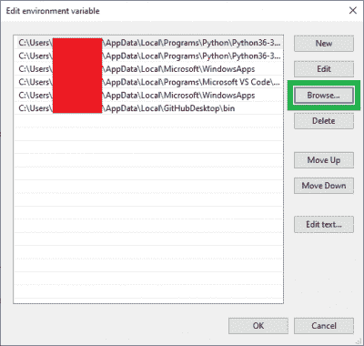

# 配置 PATH 系统变量

> 原文：<https://learn.sparkfun.com/tutorials/configuring-the-path-system-variable>

## 介绍

一个[路径](https://en.wikipedia.org/wiki/Path_(computing))是一个文件的目录名，它指定了一个文件系统中的唯一位置。而 [PATH 系统变量](https://en.wikipedia.org/wiki/PATH_(variable)) ( `$PATH`)指定了一组可执行程序所在的目录。这允许软件应用程序访问通常执行的程序。

在各种操作系统上修改(`$` ) `PATH`变量有不同的方法。以下说明基于每个操作系统最常用的方法。要了解更多信息，只需使用你最喜欢的搜索引擎，搜索关键词:`path system variable`和`<the name of the OS you are working on>`。

## Windows 10

在 Windows 10 中，`PATH`系统变量是通过**系统属性**窗口配置的。用户访问**系统属性**窗口有多种方法；例如，用户可以从任务栏的`⊞ Start`菜单中搜索`view advanced system settings`。

*Searching `view adva` from the taskbar* `⊞ Start` *menu, to access the the **System Properties** window. (Click to enlarge)*

一旦**系统属性**窗口被弹出，从`Advanced`选项卡中选择`Environment Variables...`按钮。

*Opening the **Environment Variables** window. (Click to enlarge)*

在**环境变量**窗口中，从<用户名>T6 部分的**用户变量中选择`Path`变量。然后，选择`Edit...`按钮来配置`PATH`系统变量。**

**Note:** The **User variables** are specific for a user account on the computer; while, the **System variables** will be available for all accounts on the computer.*Opening the `PATH` system variable window. (Click to enlarge)*

从`PATH` **编辑环境变量**窗口，选择`Browse...`按钮。弹出对话框出现后，导航到包含要包含在`PATH`系统变量中的可执行文件的文件夹。

**Note:** Make sure not to select and overwrite a previously configured file path. Users can click on the black space area to make sure that a previously configured file path isn't highlighted and therefore, won't get overwritten.*Adding a directory to the `PATH` system variable. (Click to enlarge)*

## 基于 Mac OSX 和 Linux 的系统

在基于 Mac OSX 和 linux 的系统上，用户可以通过在终端输入`echo $PATH`来显示`$PATH`系统变量的路径。

**Note:** The commands below use the [GNU nano](https://en.wikipedia.org/wiki/GNU_nano) text editor. Feel free to use another text editor of your choice *(such as `vi` for [Vim](https://en.wikipedia.org/wiki/Vim_(text_editor)))*.

要修改变量:

1.  打开终端，运行以下命令编辑路径文件:`sudo nano <file path location>`
    *   用户可以在几个地方修改系统变量`$PATH`:
        *   `/etc/paths`(麦克·OSX——山狮)
        *   `/usr/bin`
        *   `/usr/local/bin`
        *   `/usr/local/sbin`
        *   `/usr/sbin`
        *   `~/.bash_profile`
        *   `~/.bashrc`
        *   `~/.profile`
2.  如果出现提示，输入超级用户*(管理)*密码。
3.  输入要添加的路径的修改。
    *   输入字段通常靠近文件的底部。
4.  点击`Ctrl` + `X`退出。
5.  在输入提示下，发送`Y`并点击`Enter`或`Return`保存修改后的缓冲区。

*Displaying paths of `$PATH` variable and accessing the `~/.profile` file for modifications. (Click to enlarge)*

就是这样！要验证更改，请在终端窗口中键入:`echo $PATH`

**注意:**另一种常见的方法是在终端中使用`export`命令。

示例:`export PATH=$PATH:<file path to be added>`

## 资源和更进一步

寻找一些额外的编程相关教程？查看以下指南:

 [### 微型 AVR 编程器连接指南](https://learn.sparkfun.com/tutorials/tiny-avr-programmer-hookup-guide) A how-to on the Tiny AVR Programmer. How to install drivers, hook it up, and program your favorite Tiny AVRs using AVRDUDE 11 [### 英特尔 Edison 编程:超越 Arduino IDE](https://learn.sparkfun.com/tutorials/programming-the-intel-edison-beyond-the-arduino-ide) Intel's Edison module goes beyond being just another Arduino clone. Check this tutorial for advice on how to get the most out of your Edison by writing code in C++ 7 [### BadgerHack:游戏附加套件](https://learn.sparkfun.com/tutorials/badgerhack-gaming-add-on-kit) Make a Breakout clone with the BadgerHack Gaming Add-On Kit.[Favorited Favorite](# "Add to favorites") 1 [### 加密协处理器 ATECC508A (Qwiic)连接指南](https://learn.sparkfun.com/tutorials/cryptographic-co-processor-atecc508a-qwiic-hookup-guide) Learn how to use some of the standard features of the SparkFun Cryptographic Co-processor.[Favorited Favorite](# "Add to favorites") 6